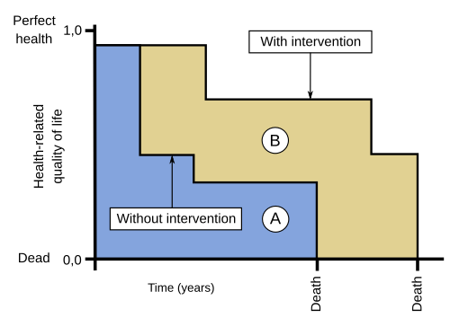
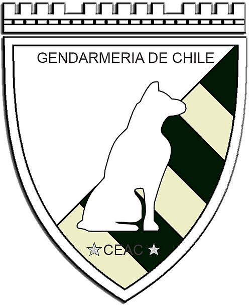

# AVALIAÇÃO DE TECNOLOGIAS EM SAÚDE E ECONOMIA DA SAÚDE NO SUS

Para entender este tema, você precisa primeiro vestir o chapéu de gestor. Imagine que você tem um orçamento fixo para cuidar de uma cidade inteira. Se você gastar todo o dinheiro comprando o medicamento mais caro e moderno para um único paciente, faltará vacina para dez mil crianças. Esse é o dilema central da Economia da Saúde: os recursos são finitos, mas as necessidades humanas e os desejos tecnológicos são infinitos.

Nas provas de residência, as bancas não querem que você seja um economista, mas que entenda como o SUS decide o que entra e o que sai da sua lista de serviços. Vamos desmistificar esses conceitos agora.

## Fundamentos da Avaliação de Tecnologias em Saúde (ATS)

A Avaliação de Tecnologias em Saúde (ATS) é o processo contínuo de análise das consequências clínicas, sociais e econômicas do uso de uma tecnologia. Quando falamos em "tecnologia", não pense apenas em robôs ou máquinas de ressonância. No SUS, tecnologia é tudo: medicamentos, equipamentos, procedimentos, programas de saúde e até formas de organizar o sistema.

O objetivo da ATS no SUS é assegurar que as tecnologias incorporadas sejam seguras, efetivas e, acima de tudo, eficientes. Não basta o remédio funcionar no laboratório, ele precisa funcionar na vida real e valer o investimento.

### A Tríade Essencial: Eficácia, Efetividade e Eficiência

Este é o ponto onde muitos alunos escorregam. As bancas adoram trocar esses conceitos. Guarde esta explicação do MedEvo para nunca mais errar:

- **Eficácia:** Refere-se ao desempenho da tecnologia em condições IDEAIS. É o resultado do ensaio clínico controlado, com pacientes selecionados que não têm outras doenças e tomam o remédio na hora exata. Se o estudo diz que a droga X reduz a pressão em 20mmHg num ambiente controlado, isso é eficácia.

- **Efetividade:** É o desempenho na PRÁTICA REAL. Aqui entra o paciente que esquece a dose, que tem comorbidades e que compra o remédio na farmácia da esquina. A efetividade mede o impacto no "mundo como ele é".

- **Eficiência:** Aqui entra o dinheiro. A eficiência relaciona os resultados obtidos (efetividade) com os recursos gastos. Uma tecnologia é eficiente quando entrega o melhor resultado possível pelo menor custo.

**Dica de Prova:** Se a questão mencionar "estudo clínico randomizado e controlado", ela está falando de eficácia. Se mencionar "uso rotineiro no sistema de saúde", está falando de efetividade.

## Economia da Saúde e Avaliações Econômicas

A Economia da Saúde estuda como alocar recursos de forma otimizada. Um conceito fundamental aqui é o de **Eficiência Distributiva**, que busca maximizar o bem-estar social através da alocação equitativa de recursos. No SUS, isso significa que não basta ser barato, tem que ser justo e alcançar quem mais precisa.

### Tipos de Análise Econômica

Existem quatro tipos principais de análises que você deve conhecer. Elas se diferenciam pela forma como medem os resultados (desfechos).

| Tipo de Análise | Como mede o Custo | Como mede o Desfecho (Resultado) | Quando usar? |
| --- | --- | --- | --- |
| **Minimização de Custos** | Reais (R) | Equivalentes | Quando as tecnologias têm eficácia e segurança idênticas. Escolhe-se a mais barata. |
| **Custo-Efetividade** | Reais (R) | Unidades Naturais (ex: anos de vida ganhos, mmHg reduzidos) | Quando se quer comparar intervenções com o mesmo objetivo clínico. |
| **Custo-Utilidade** | Reais (R) | Qualidade de Vida (ex: QALY - Anos de Vida Ajustados pela Qualidade) | Quando a intervenção afeta tanto a sobrevida quanto a qualidade de vida. |
| **Custo-Benefício** | Reais (R) | Reais (R$) | Quando se quer comparar programas de áreas diferentes (ex: vacinação vs. saneamento). |

**Exemplo Clínico:** Imagine que você tem dois anti-hipertensivos. Ambos reduzem a pressão na mesma intensidade e têm os mesmos efeitos colaterais. Para decidir qual o SUS deve comprar, você faz uma **Análise de Minimização de Custos**. Agora, se um remédio reduz a pressão mas o outro reduz a pressão E evita infartos, você precisa de uma **Análise de Custo-Efetividade** para ver se o ganho extra em "infartos evitados" justifica o preço maior.

### O Conceito de Custo de Oportunidade

Este é um conceito clássico da economia que cai em provas de gestão. O custo de oportunidade não é o valor em dinheiro, mas sim o que você deixa de ganhar ao escolher uma opção em vez de outra. Se o governo gasta 1 bilhão em uma droga para uma doença ultra-rara, o "custo de oportunidade" pode ser a não realização de 500 mil cirurgias de catarata. É o conflito eterno entre a **Universalidade** (atender a todos) e a **Integralidade** (oferecer tudo o que o paciente precisa).

## CONITEC: O Coração da Incorporação no SUS

*Figura 1 - Representação gráfica do conceito de QALY (Quality-Adjusted Life Year), comparando duas intervenções hipotéticas quanto à qualidade de vida e sobrevida. Fonte: Jmarchn, CC BY-SA 3.0 | Wikimedia Commons*

A Comissão Nacional de Incorporação de Tecnologias no SUS (CONITEC) é o órgão que assessora o Ministério da Saúde nessas decisões. Criada pela Lei 12.401/2011, ela mudou o jogo da gestão pública.

A CONITEC avalia:

- Evidências científicas sobre eficácia, acurácia, efetividade e segurança.

- Avaliação econômica (custo-efetividade).

- Impacto orçamentário (quanto vai custar no total para o cofre do SUS).

**Regra de Ouro para Prova:** O prazo para a CONITEC emitir um relatório é de 180 dias, prorrogáveis por mais 90 dias. Após a decisão de incorporar, o gestor tem até 180 dias para efetivamente disponibilizar a tecnologia ao paciente.

### Protocolos Clínicos e Diretrizes Terapêuticas (PCDT)

Uma vez que uma tecnologia é incorporada, ela não pode ser usada de qualquer jeito. O PCDT estabelece os critérios de diagnóstico, os critérios de inclusão e exclusão, as doses e o monitoramento.

**Cuidado:** As bancas costumam afirmar que o PCDT é uma imposição legal que tira a autonomia do médico. Errado! O PCDT é um guia para garantir qualidade e efetividade, mas o médico mantém sua autonomia, embora o SUS só seja obrigado a financiar o que está no protocolo.

## Financiamento do SUS e Regras de Gasto

Como o Dr. Will sempre reforça em suas aulas, o financiamento é o que sustenta a estrutura. Você precisa conhecer a **Emenda Constitucional 29 (EC 29/2000)**, que definiu os percentuais mínimos que cada ente federado deve investir em Ações e Serviços Públicos de Saúde (ASPS).

### Percentuais de Investimento (EC 29 e LC 141/2012)

| Ente Federado | Valor Mínimo de Investimento |
| --- | --- |
| **Municípios** | 15% da receita de impostos e transferências. |
| **Estados** | 12% da receita de impostos e transferências. |
| **União** | Valor do ano anterior + variação nominal do PIB (regra original) ou conforme o Teto de Gastos vigente. |

**Pegadinha de Prova:** A União não tem um percentual fixo de 15% como os municípios. A regra da União mudou com o tempo (EC 86, EC 95), mas para a maioria das provas, o foco é que Estados (12%) e Municípios (15%) têm percentuais fixos sobre suas receitas.

### Blocos de Financiamento

Antigamente, o dinheiro vinha carimbado em seis blocos. Desde 2017, para facilitar a gestão, o financiamento foi simplificado em apenas dois blocos:

- **Bloco de Custeio:** Para manter os serviços funcionando (salários, insumos, contas).

- **Bloco de Investimento:** Para obras e compra de equipamentos novos.

Dentro do custeio, ainda dividimos mentalmente para fins de planejamento em: Atenção Básica, MAC (Média e Alta Complexidade), Vigilância em Saúde, Assistência Farmacêutica e Gestão do SUS.

## Assistência Farmacêutica no SUS

A Política Nacional de Medicamentos (PNM) visa garantir o acesso e o **Uso Racional de Medicamentos (URM)**. O URM significa que o paciente recebe o medicamento apropriado para sua necessidade clínica, na dose correta, por um período adequado e ao menor custo para ele e para a comunidade.

### RENAME e Relações Estaduais/Municipais

A **RENAME (Relação Nacional de Medicamentos Essenciais)** é a lista de referência.

- O Ministério da Saúde define a RENAME nacional.

- Estados e Municípios podem (e devem) ter suas próprias listas (REME e REUME), mas elas devem ampliar o acesso, nunca restringir o que a nacional já garante.

- Para receber um medicamento pelo SUS, o usuário deve estar assistido por um profissional do SUS e a prescrição deve seguir a RENAME e os PCDT.

### Medicamentos Genéricos e Biossimilares

Este é um tema quente. O medicamento genérico é aquele que contém o mesmo princípio ativo, na mesma dose e forma farmacêutica que o medicamento de referência. Ele é comprovado por testes de **Biodisponibilidade** (velocidade e extensão de absorção) e **Bioequivalência**.

**Dica do Professor:** O farmacêutico pode substituir o medicamento de referência pelo genérico, a menos que o médico escreva de próprio punho "não aceito substituição". No entanto, a promoção de genéricos é obrigatória em compras e licitações públicas.

Já os **Biossimilares** são para medicamentos biológicos (como anticorpos monoclonais). Eles não são cópias idênticas (porque são produzidos em células vivas), mas são altamente semelhantes em termos de qualidade, segurança e eficácia. Diferente dos genéricos, a vantagem econômica do biossimilar nem sempre é maior, mas eles são cruciais para a sustentabilidade do sistema.

## Saúde Suplementar: O Mercado de Planos de Saúde

O SUS não está sozinho. Cerca de 25% da população brasileira possui planos de saúde. A **ANS (Agência Nacional de Saúde Suplementar)**, criada pela Lei 9.961/2000, é quem regula esse mercado.

### Pontos Chave da Lei 9.656/98 (Lei dos Planos de Saúde)

- **Cobertura de Doenças Pré-existentes:** O plano não pode recusar o cliente, mas pode aplicar uma Cobertura Parcial Temporária (CPT) de até 24 meses para cirurgias e alta complexidade relacionadas àquela doença.

- **Ressarcimento ao SUS:** Se um paciente que tem plano de saúde for atendido no SUS, a operadora do plano deve pagar ao governo o valor do atendimento. Isso evita que o lucro seja privado e o custo seja público.

- **Rol de Procedimentos:** É a lista mínima obrigatória que os planos devem cobrir. A ANS atualiza esse rol periodicamente.

- **Proibições:** É absolutamente ilegal exigir cheque caução ou depósito antecipado para internação em qualquer hospital, seja público ou privado. Isso é crime.

### Modelos de Gestão: OS e OSCIP

O SUS pode contratar entidades privadas para gerir serviços.

- **Organização Social (OS):** Entidade privada sem fins lucrativos que recebe o título do poder público para gerir uma unidade (ex: um Hospital Estadual gerido por uma OS). O lucro deve ser integralmente reinvestido na própria saúde.

- **Entidades Filantrópicas:** São parceiras históricas do SUS (como as Santas Casas). Elas gozam de isenções fiscais em troca de prestar serviços ao sistema público (mínimo de 60% de atendimentos pelo SUS).

## Judicialização da Saúde: O Grande Dilema

A judicialização ocorre quando o cidadão recorre à justiça para obter um tratamento que o SUS não ofereceu.

- **O Problema:** Juízes muitas vezes têm um conceito de "saúde" muito amplo e concedem liminares para medicamentos sem evidência científica ou fora da RENAME.

- **O Impacto:** Isso causa um desvio orçamentário gigante. O dinheiro que estava planejado para a vacinação de todos acaba sendo usado para um tratamento individual caríssimo, ferindo a equidade e o planejamento do SUS.

## Temas Específicos que Despencam em Prova

### Lei 14.154/2021: O Novo Teste do Pezinho

Esta lei ampliou o Teste do Pezinho no SUS. A grande novidade que as bancas cobram é a inclusão da triagem de **Imunodeficiências Primárias** através de biologia molecular (TREC e KREC). É um exemplo de ATS aplicada: decidiu-se que o custo de triar cedo é menor que o custo de tratar as complicações tardias.

### Prevenção Quaternária e Sobreutilização

A Economia da Saúde também luta contra a **Medicalização Excessiva**. A prevenção quaternária visa evitar o excesso de intervenções diagnósticas e terapêuticas desnecessárias (overdiagnosis e overtreatment). Pedir exames de check-up sem indicação clínica gera custos e riscos de falsos positivos, o que é ineficiente.

### Indicadores de Qualidade e Gestão

- **Razão Paciente-Dia:** Usada para calcular a carga de trabalho da enfermagem e custos hospitalares.

- **Qualiss ANS:** Programa que avalia a qualidade dos prestadores de serviços na saúde suplementar. Um requisito essencial para hospitais é ter comissões de revisão de prontuários ativas.

- **Pacto pela Saúde (2006):** Dividido em Pacto pela Vida (prioridades clínicas), Pacto em Defesa do SUS (repúdio à privatização e defesa dos princípios) e Pacto de Gestão (descentralização e regionalização).

### Transplantes e Isquemia Fria

Dentro da alta complexidade, o SUS é referência mundial em transplantes. Um detalhe técnico que aparece em questões de logística e economia: o **rim** é o órgão mais resistente à isquemia fria, podendo aguardar até 24 horas para o transplante, o que facilita a logística nacional.

## Diagnóstico Diferencial de Conceitos Econômicos

Para não cair em pegadinhas, compare estes termos:

| Conceito | Definição Rápida | Foco da Banca |
| --- | --- | --- |
| **Integralidade** | Oferecer tudo o que é necessário para a saúde. | Frequentemente em conflito com a escassez de recursos. |
| **Equidade** | Tratar desigualmente os desiguais para reduzir disparidades. | Justifica priorizar certos grupos em detrimento de outros. |
| **Verticalização** | Quando o plano de saúde é dono dos hospitais e laboratórios. | Reduz custos para a operadora, mas pode restringir a escolha do paciente. |
| **Acreditação** | Processo voluntário de avaliação da qualidade hospitalar. | Foco na segurança do paciente e melhoria de processos. |

## Pontos-Chave para Prova

- **Eficácia vs. Efetividade:** Eficácia é no estudo (ideal); Efetividade é na vida real (prática).

- **Análise de Minimização de Custos:** Só se usa quando os resultados clínicos das duas opções são comprovadamente iguais.

- **CONITEC:** Prazo de 180 + 90 dias para decidir; 180 dias para o gestor disponibilizar após a decisão.

- **Financiamento:** Municípios (15%), Estados (12%). União segue regras de teto de gastos/PIB.

- **Lei 14.154/2021:** Ampliação do teste do pezinho para incluir imunodeficiências primárias.

- **Genéricos:** Substituição permitida pelo farmacêutico; exige testes de bioequivalência e biodisponibilidade.

- **Ressarcimento ao SUS:** Obrigação das operadoras de planos de saúde quando seus clientes usam o sistema público.

- **Cheque Caução:** Prática criminosa e proibida em qualquer atendimento de urgência/emergência.

- **Prevenção Quaternária:** Evitar o dano causado pelo excesso de medicina (exames e remédios desnecessários).

- **Judicialização:** O principal dilema é a interpretação ampla do direito à saúde pelos juízes, ignorando as limitações orçamentárias coletivas.

- **RENAME:** Lista nacional de medicamentos; estados e municípios podem ampliar, mas não reduzir.

- **Pacto pela Saúde:** Composto por três eixos: Vida, Defesa do SUS e Gestão.

- **Organizações Sociais (OS):** São privadas, sem fins lucrativos, e o lucro deve ser 100% reinvestido no objeto social.

- **Isquemia Fria:** O rim suporta até 24h, sendo o órgão mais "robusto" para transporte em transplantes.

- **Uso Racional de Medicamentos:** O foco não é apenas economizar, mas garantir que o paciente use o que é correto, na dose correta e pelo tempo correto.

- **Custo de Oportunidade:** Representa o valor da melhor alternativa sacrificada quando se faz uma escolha.

- **Eficácia Distributiva:** Alocação de recursos que busca o máximo de bem-estar para a sociedade como um todo.

 Cópia offline para consulta pessoal.
 Fonte original:
 [https://www.medevo.com.br/material-apoio/ler/3df155ff-f60c-4e17-9ab9-8e526f964905](https://www.medevo.com.br/material-apoio/ler/3df155ff-f60c-4e17-9ab9-8e526f964905)
