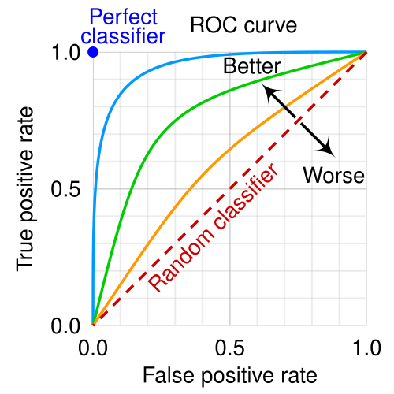

# AVALIAÇÃO DE TESTES DIAGNÓSTICOS

Para entender testes diagnósticos, você precisa esquecer por um momento a decoração de fórmulas e focar na lógica clínica. No dia a dia da residência, você não quer apenas saber se um teste é "bom"; você quer saber o quanto pode confiar naquele resultado que está na sua mão para tomar uma decisão.

As bancas de residência sabem disso e pararam de pedir apenas o cálculo básico. Elas querem que você entenda como a prevalência de uma doença na sua comunidade muda a interpretação do exame. Vamos construir esse raciocínio do zero.

## A Tabela 2x2: O Ponto de Partida

*Figura 1 - Representação visual de Sensibilidade (Verdadeiros Positivos entre todos os Doentes) e Especificidade (Verdadeiros Negativos entre todos os Saudáveis). A tabela 2x2 organiza esses conceitos fundamentais. Fonte: Walber/FeanDoe, CC BY-SA 4.0 | Wikimedia Commons*

Tudo na avaliação de testes diagnósticos nasce de uma comparação. Para saber se um novo teste funciona, precisamos compará-lo com algo que já sabemos ser a "verdade absoluta". Esse padrão é o que chamamos de **Padrão-Ouro** (ou Teste de Referência).

Imagine que estamos testando um novo teste rápido para Dengue. O padrão-ouro seria o isolamento viral ou o PCR. Montamos uma tabela cruzando o resultado do nosso "Teste Novo" com o "Padrão-Ouro".

| | Doente (Padrão-Ouro +) | Saudável (Padrão-Ouro -) | Total |
| --- | --- | --- | --- |
| **Teste Positivo** | Verdadeiro-Positivo (A) | Falso-Positivo (B) | A + B |
| **Teste Negativo** | Falso-Negativo (C) | Verdadeiro-Negativo (D) | C + D |
| **Total** | A + C (Total de Doentes) | B + D (Total de Saudáveis) | N |

Essa tabela é o mapa da mina. Se você souber montá-la, resolve 90% das questões. O erro comum aqui é trocar as colunas pelas linhas. Lembre-se: o **Padrão-Ouro fica sempre nas colunas** (vertical) e o **Teste que estamos avaliando fica nas linhas** (horizontal).

## Sensibilidade e Especificidade: A Identidade do Teste

*Figura 2 - Curva ROC (Receiver Operating Characteristic) comparando três classificadores. A área sob a curva (AUC) representa o poder discriminativo global do teste. Quanto mais próxima de 1, melhor. A linha diagonal representa um classificador aleatório (AUC = 0,5). Fonte: cmglee/MartinThoma, CC BY-SA 4.0 | Wikimedia Commons*

A Sensibilidade e a Especificidade são características intrínsecas do teste. Elas dizem o quão bom o teste é em identificar quem tem a doença e quem não tem. Elas **não mudam** se a prevalência da doença na população mudar. Isso é uma "pegadinha" clássica de prova: a banca dirá que a prevalência dobrou e perguntará o que aconteceu com a sensibilidade. A resposta? Nada. Ela permanece igual.

### Sensibilidade (Capacidade de detectar doentes)

A Sensibilidade responde à pergunta: "Dos pacientes que realmente estão doentes, quantos o meu teste consegue detectar?".

Matematicamente: **A / (A + C)**.

Por que usamos testes sensíveis? Para **triagem (screening)**. Se um teste é muito sensível, ele dá poucos resultados falso-negativos. Ou seja, se o teste deu negativo, você pode ter quase certeza de que o paciente NÃO tem a doença.

Aqui no MedEvo, gostamos de usar o mnemônico "SnNout": se a **S**ensibilidade é alta, um resultado **N**egativo exclui (**out**) a doença.

### Especificidade (Capacidade de detectar saudáveis)

A Especificidade responde à pergunta: "Dos pacientes que são realmente saudáveis, quantos o meu teste identifica corretamente como negativos?".

Matematicamente: **D / (B + D)**.

Usamos testes específicos para **confirmar** um diagnóstico. Um teste muito específico tem pouquíssimos falso-positivos. Se ele deu positivo, você "carimba" o diagnóstico.

Mnemônico: "SpPIn": se a **E**specificidade (Specificity) é alta, um resultado **P**ositivo confirma (**In**) a doença.

### Tabela 1: Comparativo Sensibilidade vs. Especificidade

| Característica | Sensibilidade | Especificidade |
| --- | --- | --- |
| **Foco** | Identificar doentes | Identificar saudáveis |
| **Erro que evita** | Falso-Negativo | Falso-Positivo |
| **Utilidade Clínica** | Triagem (Screening) | Confirmação |
| **Resultado ideal** | Se negativo, exclui a doença | Se positivo, confirma a doença |
| **Exemplo** | ELISA para HIV | Western Blot para HIV |

## Entendendo os Erros: Falso-Positivos e Falso-Negativos

Nenhum teste é perfeito. Sempre teremos os erros, e é aqui que as bancas adoram apertar o candidato.

O **Falso-Negativo** é aquele paciente que tem a doença (Padrão-Ouro positivo), mas o teste disse que ele estava bem. Isso é perigoso em doenças graves e transmissíveis. O número de falso-negativos é inversamente proporcional à sensibilidade.

O **Falso-Positivo** é o paciente saudável que o teste disse estar doente. Isso gera ansiedade, custos desnecessários e tratamentos iatrogênicos.

Aqui entra uma **Pérola Clínica** fundamental para cálculos rápidos em prova:
**Falso-positivos = (1 - Especificidade) x (Número de não-doentes).**

Por que isso funciona? Pense comigo: se a especificidade é 90%, significa que o teste acerta 90% dos saudáveis. Logo, ele erra 10% (1 - 0,90). Se você tem 200 pessoas saudáveis, 10% de 200 é 20. Esses são os seus falso-positivos. Como diz o Dr. Will, entender a lógica por trás da fórmula evita que você "trave" na hora do nervosismo.

## Valores Preditivos: A Realidade do Consultório

Agora, mude sua perspectiva. Você não é mais o pesquisador validando o teste; você é o médico com o resultado na mão. O paciente pergunta: "Doutor, meu teste deu positivo. Qual a chance de eu realmente ter essa doença?".

A Sensibilidade não responde isso. Quem responde são os **Valores Preditivos**.

### Valor Preditivo Positivo (VPP)

É a probabilidade de o paciente ter a doença dado que o teste foi positivo.
Matematicamente: **A / (A + B)** (Olhamos a linha horizontal dos positivos).

### Valor Preditivo Negativo (VPN)

É a probabilidade de o paciente ser saudável dado que o teste foi negativo.
Matematicamente: **D / (C + D)** (Olhamos a linha horizontal dos negativos).

### O Impacto da Prevalência (O "Pulo do Gato")

Diferente da Sensibilidade e Especificidade, os Valores Preditivos **dependem diretamente da prevalência** da doença na população testada.

Imagine testar HIV em um grupo de usuários de drogas injetáveis (alta prevalência) versus testar em monges isolados (baixa prevalência).

- Se o teste der positivo no grupo de alto risco, o VPP é altíssimo. É muito provável que seja um verdadeiro-positivo.

- Se o teste der positivo no monge, a chance de ser um falso-positivo é enorme, pois a doença é rara ali. O VPP cai.

**Regra de Ouro para Provas:**

- Se a **Prevalência Aumenta**: O VPP aumenta e o VPN diminui.

- Se a **Prevalência Diminui**: O VPP diminui e o VPN aumenta.

Cuidado: as bancas tentam confundir você dizendo que a sensibilidade aumenta com a prevalência. Mentira. Só quem "dança" conforme a prevalência são os Valores Preditivos.

### Tabela 2: Relação entre Prevalência e Valores Preditivos

| Mudança na Prevalência | Valor Preditivo Positivo (VPP) | Valor Preditivo Negativo (VPN) |
| --- | --- | --- |
| **Aumento da Prevalência** | Sobe (↑) | Desce (↓) |
| **Diminuição da Prevalência** | Desce (↓) | Sobe (↑) |

## Razão de Verossimilhança (Likelihood Ratio)

Muitos alunos tremem quando ouvem falar em Razão de Verossimilhança (RV), mas ela é, na verdade, a forma mais elegante de avaliar um teste. A RV nos diz quanto o resultado de um teste aumenta ou diminui a probabilidade pré-teste de o paciente ter a doença.

A grande vantagem? A RV **não depende da prevalência**, mas ela nos ajuda a calcular a probabilidade pós-teste.

### Razão de Verossimilhança Positiva (RV+)

Indica quanto o teste positivo é mais provável de ocorrer em doentes do que em saudáveis.
Fórmula: **Sensibilidade / (1 - Especificidade)**.

Quanto maior a RV+, melhor o teste para confirmar a doença. Uma RV+ > 10 é considerada excelente.

### Razão de Verossimilhança Negativa (RV-)

Indica quanto o teste negativo é mais provável de ocorrer em doentes do que em saudáveis.
Fórmula: **(1 - Sensibilidade) / Especificidade**.

Quanto menor a RV-, melhor o teste para excluir a doença. Uma RV- < 0,1 é considerada excelente.

**Exemplo Clínico:**
Imagine um paciente com suspeita de Infarto Agudo do Miocárdio. A probabilidade pré-teste (baseada na dor e fatores de risco) é de 20%. Você pede um ECG. Se o ECG tem uma RV+ de 10, a probabilidade pós-teste sobe drasticamente. Se a RV+ fosse 1, o teste seria inútil (não mudaria nada).

## Acurácia: O Acerto Geral

A Acurácia é a proporção de resultados corretos (verdadeiros-positivos e verdadeiros-negativos) em relação ao total de testes realizados.

Matematicamente: **(A + D) / N**.

Cuidado: a acurácia pode ser enganosa. Se você tem uma doença muito rara (prevalência de 1%) e um teste que sempre dá negativo para todo mundo, esse teste terá uma acurácia de 99%! Mas ele é inútil, pois não detecta nenhum doente. Por isso, na medicina, raramente usamos a acurácia isoladamente.

## Curva ROC: O Equilíbrio de Forças

A maioria dos testes diagnósticos não é "sim ou não" (como um teste de gravidez), mas sim baseada em valores contínuos (como a glicemia ou o PSA). Para decidir se o paciente está doente, precisamos escolher um **ponto de corte**.

A Curva ROC (Receiver Operating Characteristic) é um gráfico que coloca a **Sensibilidade no eixo Y** e o **(1 - Especificidade) no eixo X**.

### O que você precisa saber sobre a Curva ROC para a prova:

- **A Área Abaixo da Curva (AUC):** Quanto maior a área, melhor o teste. Um teste perfeito formaria um ângulo reto no canto superior esquerdo (área = 1,0). Um teste que é puro chute (como jogar uma moeda) seria uma linha diagonal (área = 0,5).

- **Mudança do Ponto de Corte:** Se você move o ponto de corte para a esquerda (tornando o teste mais "liberal"), você aumenta a Sensibilidade, mas diminui a Especificidade (aceita mais falso-positivos). Se move para a direita (mais "rigoroso"), aumenta a Especificidade, mas perde Sensibilidade (aceita mais falso-negativos).

**Exemplo Clínico:**
Pense no diagnóstico de Diabetes pela glicemia de jejum.

- Se baixarmos o corte para 70 mg/dL, teremos uma sensibilidade de quase 100% (ninguém com diabetes escapa), mas teremos muitos falso-positivos (especificidade baixa).

- Se subirmos o corte para 200 mg/dL, teremos uma especificidade altíssima (quem der positivo certamente é diabético), mas deixaremos muitos doentes de fora (sensibilidade baixa).

## Testes em Série e em Paralelo

Na prática médica, raramente pedimos apenas um exame. Usamos estratégias para melhorar nossa precisão.

### Testes em Paralelo (Simultâneos)

Você pede dois ou mais testes ao mesmo tempo (ex: Troponina + ECG na emergência).

- **Critério de positividade:** Basta um ser positivo para considerar o paciente doente.

- **Resultado:** Aumenta a **Sensibilidade** e o **VPN**. Você não quer deixar passar nada.

- **Preço a pagar:** Diminui a especificidade (mais chance de falso-positivos).

### Testes em Série (Sequenciais)

Você pede um teste e, se ele vier positivo, pede o segundo para confirmar (ex: ELISA para HIV, seguido de Western Blot).

- **Critério de positividade:** Ambos precisam ser positivos.

- **Resultado:** Aumenta a **Especificidade** e o **VPP**. Você quer ter certeza absoluta antes de dar o diagnóstico.

- **Preço a pagar:** Diminui a sensibilidade (pode perder alguns doentes no caminho).

### Tabela 3: Testes em Série vs. Paralelo

| Estratégia | Quando usar? | O que aumenta? | O que diminui? |
| --- | --- | --- | --- |
| **Paralelo** | Emergências, triagem rápida | Sensibilidade e VPN | Especificidade |
| **Série** | Doenças graves/estigmatizantes | Especificidade e VPP | Sensibilidade |

## Coeficiente Kappa: A Concordância

Às vezes, a prova não quer saber se o teste acerta a doença, mas se dois médicos (ou dois testes) concordam entre si. Isso é a **Reprodutibilidade**.

O Coeficiente Kappa mede a concordância além do que seria esperado pelo puro acaso.

- **Kappa = 0:** Concordância apenas por acaso.

- **Kappa = 1:** Concordância perfeita.

- **Kappa < 0:** Concordância pior do que o acaso (os médicos estão discordando ativamente).

Geralmente, um Kappa > 0,60 é considerado uma concordância boa; > 0,80 é excelente.

## Diagnóstico Diferencial de Erros em Testes

Ao analisar uma questão, identifique onde está o erro. Se o problema é o teste em si, falamos de **Validade** (Sensibilidade/Especificidade). Se o problema é a aplicação do teste em diferentes populações, falamos de **Valores Preditivos**.

Se a questão menciona que o teste dá resultados diferentes cada vez que é repetido no mesmo paciente, o problema é de **Confiabilidade** ou **Precisão** (falta de reprodutibilidade).

Um teste pode ser preciso (dá sempre o mesmo resultado), mas não ser acurado (o resultado está sempre errado em relação ao padrão-ouro). Imagine uma balança desregulada que sempre marca 2kg a menos. Ela é precisa (reprodutível), mas não é válida (acurada).

## Aplicação Prática: O Rastreamento (Screening)

O rastreamento é a aplicação de testes em pessoas assintomáticas. Segundo os critérios de Wilson e Jungner (adotados pelo Ministério da Saúde), para rastrear uma doença, ela deve:

- Ser um problema de saúde importante.

- Ter história natural conhecida.

- Ter um estágio latente identificável.

- Ter tratamento eficaz disponível.

- O teste deve ser aceitável pela população e ter bom custo-benefício.

Em provas de Medicina Preventiva, lembre-se: rastreamento foca em **Sensibilidade**. Queremos captar o máximo de casos possíveis na fase inicial.

## Pontos-Chave para Prova 🎯

- **Sensibilidade:** Capacidade de detectar doentes. Fórmula: A / (A+C). Alta sensibilidade = Poucos Falso-Negativos. Ideal para triagem.

- **Especificidade:** Capacidade de detectar saudáveis. Fórmula: D / (B+D). Alta especificidade = Poucos Falso-Positivos. Ideal para confirmação.

- **VPP e VPN:** Dependem da prevalência. Se a prevalência sobe, VPP sobe e VPN desce.

- **Pérola de Cálculo:** Falso-positivos = (1 - Especificidade) x (Número de não-doentes). Use isso quando a banca der a especificidade e a população saudável.

- **Razão de Verossimilhança Positiva (RV+):** Sensibilidade / (1 - Especificidade). Não muda com a prevalência.

- **Razão de Verossimilhança Negativa (RV-):** (1 - Sensibilidade) / Especificidade. Quanto menor, melhor para excluir.

- **Curva ROC:** Eixo Y (Sensibilidade) e Eixo X (1 - Especificidade). A área sob a curva define a acurácia global do teste.

- **Ponto de Corte:** Se você quer um teste mais sensível, "baixe a régua" (aumenta sensibilidade, cai especificidade).

- **Testes em Paralelo:** Aumentam a Sensibilidade (bom para não comer bola na emergência).

- **Testes em Série:** Aumentam a Especificidade (bom para confirmar diagnósticos graves).

- **Acurácia:** (A+D) / Total. Cuidado com doenças raras, onde a acurácia pode ser alta apenas porque o teste acerta os muitos saudáveis.

- **Kappa:** Mede concordância interobservador. Kappa de 0,6 a 0,8 é bom; acima de 0,8 é excelente.

- **O que NÃO fazer:** Nunca diga que Sensibilidade ou Especificidade mudam com a prevalência. Isso é o erro que mais elimina candidatos.

- **Validade vs. Confiabilidade:** Validade é o teste ser "verdadeiro" (acertar o alvo). Confiabilidade é o teste ser "constante" (acertar sempre no mesmo lugar, mesmo que fora do alvo).

- **Viés de Sobrevida (Neyman):** Acontece quando o teste detecta apenas casos crônicos ou leves, pois os casos fatais morrem antes de serem testados.

- **Viés de Tempo de Antecipação (Lead-time bias):** Impressão de que o paciente viveu mais apenas porque o diagnóstico foi feito mais cedo, mas a data da morte não mudou.

Ao revisar este material, tente montar a tabela 2x2 mentalmente para cada exemplo clínico que encontrar. A bioestatística na prova de residência não é sobre matemática complexa, é sobre entender como essas métricas protegem o seu paciente de diagnósticos errados ou de perder a oportunidade de tratamento. Como sempre reforçamos no MedEvo, o domínio desses conceitos é o que diferencia o médico que apenas "pede exames" do médico que realmente faz diagnósticos.

 Cópia offline para consulta pessoal.
 Fonte original:
 [https://www.medevo.com.br/material-apoio/ler/e83381ee-cf54-450b-9652-fb2a15b73a0c](https://www.medevo.com.br/material-apoio/ler/e83381ee-cf54-450b-9652-fb2a15b73a0c)
