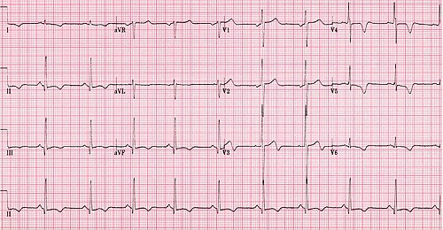
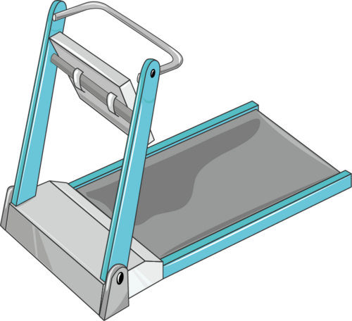

# AVALIAÇÃO DO ATLETA

A avaliação do atleta, ou Avaliação Pré-Participação (APP), é um dos temas mais recorrentes em provas de Clínica Médica e Medicina Esportiva. O examinador não quer apenas que você saiba pedir exames, ele quer que você saiba filtrar quem realmente precisa de investigação profunda e quem está apenas apresentando adaptações fisiológicas ao treinamento.

Para começar, precisamos diferenciar o indivíduo sedentário do atleta. O sedentarismo é definido pela ausência de atividade física regular, mas, para fins de prova, foque no impacto: o sedentarismo é um fator de risco cardiovascular independente. Já o atleta é aquele que treina com foco em performance e competição. Entre eles, temos o praticante de exercícios recreativos. A conduta muda conforme o perfil.

## A Lógica da Avaliação Pré-Participação (APP)

Por que fazemos a APP? O objetivo primordial é a prevenção da Morte Súbita Cardíaca (MSC). No entanto, aqui entra a primeira grande discussão de diretrizes: o custo-benefício do rastreamento em massa.

Segundo a Diretriz Brasileira de Cardiologia do Esporte e do Exercício (SBC, 2020), a anamnese e o exame físico são obrigatórios para todos. A polêmica reside no Eletrocardiograma (ECG) de repouso. Em indivíduos jovens (12 a 35 anos) e assintomáticos que pretendem fazer atividade física recreativa de baixa ou moderada intensidade, a anamnese e o exame físico completo são suficientes.

Cuidado com a pegadinha: se o indivíduo é um atleta competitivo, o ECG de repouso torna-se obrigatório na avaliação inicial. Por que essa diferença? Porque o volume e a intensidade do treino no atleta de elite podem desmascarar patologias silenciosas, como a Cardiomiopatia Hipertrófica ou a Displasia Arritmogênica do Ventrículo Direito.

### Anamnese e Exame Físico: O Filtro Inicial

Na anamnese, você deve buscar ativamente por:

- Sintomas durante o exercício (dor torácica, síncope, palpitações, dispneia desproporcional).

- Histórico familiar de morte súbita prematura (homens < 55 anos, mulheres < 65 anos).

- Uso de substâncias (ergogênicos, suplementos, drogas ilícitas).

No exame físico, o foco é cardiovascular e musculoesquelético. Sopros cardíacos (especialmente os que aumentam com manobra de Valsalva, sugerindo obstrução de via de saída no VE), pulsos periféricos, pressão arterial em repouso e sinais de síndromes genéticas (como Marfan) são cruciais.

## O Eletrocardiograma do Atleta: Onde a Maioria Erra

*Figura 1 - Eletrocardiograma demonstrando padrão de cardiomiopatia hipertrófica obstrutiva, principal causa de morte súbita em atletas jovens. Fonte: CardioNetworks ECGpedia, CC BY-SA 3.0 | Wikimedia Commons*

Este é o ponto onde os alunos mais perdem pontos. Você precisa distinguir o que é adaptação fisiológica (Coração de Atleta) do que é patológico. O treinamento físico regular aumenta o tônus vagal (parassimpático) e reduz o tônus simpático em repouso. Isso gera alterações eletrocardiográficas que seriam anormais em um sedentário, mas são normais no atleta.

### Alterações Fisiológicas (Grupo A - Não exigem investigação)

Estas alterações são fruto do remodelamento elétrico e estrutural benigno:

- Bradicardia sinusal (frequência cardíaca > 30 bpm).

- Arritmia sinusal respiratória.

- Bloqueio Atrioventricular (BAV) de primeiro grau.

- BAV de segundo grau Mobitz I (Fenômeno de Wenckebach).

- Repolarização precoce (elevação do ponto J).

- Critérios de voltagem isolados para hipertrofia ventricular esquerda (Sokolow-Lyon positivo), desde que não haja outras alterações de repolarização.

Muitas questões trazem um atleta assintomático com BAV de primeiro grau ou Mobitz I e perguntam a conduta. A resposta é: nenhuma investigação adicional. É apenas tônus vagal aumentado. Se você pedir um Holter ou um Ecocardiograma para esse paciente, estará errando por excesso.

### Alterações Patológicas (Grupo B - Exigem investigação)

Se você encontrar isso, pare tudo e investigue:

- Inversão de onda T (além de V1, ou V2-V4 em atletas negros, que pode ser variante).

- Infradesnivelamento do segmento ST.

- Ondas Q patológicas.

- Bloqueio de Ramo Esquerdo (BRE).

- Pré-excitação ventricular (padrão de Wolff-Parkinson-White).

- Intervalo QT longo ou curto.

- Padrão de Brugada.

Um erro clássico de prova é dizer que o intervalo PR curto é comum no atleta. Mentira. O PR tende a ser mais longo devido ao atraso de condução no nó AV pelo estímulo vagal.

| Achado no ECG | Significado no Atleta | Conduta |
| --- | --- | --- |
| Bradicardia Sinusal | Fisiológico (Tônus Vagal) | Observar |
| BAV 1º grau | Fisiológico | Observar |
| Mobitz I (Wenckebach) | Fisiológico | Observar |
| Inversão de Onda T | Suspeito (Isquemia/Miocardiopatia) | Investigar (Eco/RMC) |
| Onda Q Patológica | Suspeito (Infarto prévio/CMH) | Investigar |
| Realce Tardio na RMC | Patológico (Fibrose) | Afastar de competição |

## Síndrome do Coração do Atleta: O Remodelamento Estrutural

O exercício crônico gera adaptações morfológicas. O coração precisa bombear mais sangue (aumento do débito cardíaco). Para isso, ele aumenta o volume das cavidades (hipertrofia excêntrica) e a espessura das paredes.

A grande dúvida diagnóstica é: isso é Coração de Atleta ou Cardiomiopatia Hipertrófica (CMH)?
No Coração de Atleta, a hipertrofia é harmoniosa, a função diastólica é normal (ou aumentada) e a espessura do septo raramente ultrapassa 12-13 mm. Na CMH, a hipertrofia costuma ser assimétrica, há disfunção diastólica e o átrio esquerdo costuma estar muito mais dilatado.

Um conceito fundamental que o MedEvo sempre reforça: a presença de fibrose miocárdica (detectada pelo realce tardio na Ressonância Magnética Cardiovascular) NÃO é uma característica do coração do atleta. Se houver realce tardio, pense em cicatriz de miocardite, infarto ou cardiomiopatia, mas nunca em adaptação normal ao exercício.

## Teste Ergométrico (TE) e Resposta Pressórica

O Teste Ergométrico é uma ferramenta de estratificação de risco, mas sua aplicação em atletas jovens e assintomáticos é limitada pela baixa prevalência de Doença Arterial Coronariana (DAC) nessa população.

Lembre-se do Teorema de Bayes: se a probabilidade pré-teste é muito baixa, um resultado positivo tem um Valor Preditivo Positivo (VPP) baixíssimo. Ou seja, a chance de ser um falso positivo é enorme. Por isso, não pedimos TE de rotina para jovens sem sintomas.

No entanto, o TE nos dá dados valiosos sobre a Resposta Pressórica ao Exercício:

- **Comportamento Normal:** A Pressão Arterial Sistólica (PAS) sobe linearmente com a carga. A Pressão Arterial Diastólica (PAD) tende a se manter ou cair levemente devido à vasodilatação periférica muscular.

- **Resposta Hipertensiva:** Uma elevação excessiva da PAS (> 210 mmHg em homens ou > 190 mmHg em mulheres) ou qualquer aumento da PAD é preditor de hipertensão arterial futura.

- **Idosos e Descondicionados:** Nesses indivíduos, a PAS sobe mais rápido e de forma mais exacerbada. Por que? Por causa da rigidez arterial (menor complacência da aorta).

Em atletas, uma medida interessante é a PA indexada à carga. Se a PAS de pico for muito alta em relação ao trabalho realizado, isso pode predizer mortalidade cardiovascular a longo prazo.

## Teste Cardiopulmonar de Exercício (TCPE) ou Ergoespirometria

Se o TE avalia apenas eletrocardiograma e pressão, o TCPE (o padrão-ouro) avalia a troca gasosa. Como diria o Dr. Will, o TCPE é a ferramenta definitiva para a prescrição precisa do exercício.

### O Conceito de VO2 Máximo

O VO2 máx é o volume máximo de oxigênio que o corpo consegue consumir. Ele é o produto do débito cardíaco (entrega de O2) pela diferença arteriovenosa de O2 (extração de O2 pelo músculo).

- **Componente Central:** Coração e pulmões transportando O2.

- **Componente Periférico:** Músculo extraindo e usando esse O2 nas mitocôndrias.

### Limiares Ventilatórios

Durante um exercício incremental, passamos por dois pontos críticos:

- **Primeiro Limiar Ventilatório (LV1 ou Limiar Anaeróbico):** É o ponto onde o metabolismo aeróbico começa a ser suplementado pelo anaeróbico. O lactato começa a subir levemente, mas o corpo ainda tampona bem. É a zona de "conforto" para exercícios de longa duração.

- **Segundo Limiar Ventilatório (LV2 ou Ponto de Compensação Respiratória):** Aqui o bicho pega. A acidose metabólica é intensa, e o pulmão precisa hiperventilar desesperadamente para lavar o CO2 e tentar compensar o pH. Acima do LV2, o exercício é insustentável por muito tempo.

Para a prova, entenda que o TCPE diferencia se a limitação do paciente é cardíaca, pulmonar ou muscular (descondicionamento).

## Prescrição de Exercício e Benefícios à Saúde

O exercício não é apenas para "ficar forte". Ele é uma intervenção multissistêmica.

- **Saúde Mental:** Redução comprovada de sintomas de depressão e ansiedade, além de retardar a demência.

- **Prevenção de Câncer:** Reduz o risco de câncer de cólon, mama, próstata e reto.

- **Saúde Óssea:** O impacto e a tração muscular aumentam a densidade mineral óssea, reduzindo o risco de fraturas em idosos.

- **Expectativa de Vida:** Indivíduos ativos vivem mais e com melhor qualidade de vida.

### Zonas de Treinamento e Escala de Borg

Para prescrever, usamos a Frequência Cardíaca Máxima (FCmáx). A fórmula clássica "220 - idade" é muito imprecisa para atletas. O ideal é obter a FCmáx real em um teste de esforço máximo.
A Escala de Borg (Percepção Subjetiva de Esforço) é uma ferramenta excelente e barata. Um Borg entre 12-14 (moderado) geralmente correlaciona-se com a zona de treinamento aeróbico ideal para a maioria da população.

| Nível de Intensidade | % da FC Máxima | Escala de Borg (6-20) |
| --- | --- | --- |
| Leve | < 64% | 9 - 11 |
| Moderada | 64% - 76% | 12 - 14 |
| Vigorosa | 77% - 95% | 15 - 17 |
| Máxima | > 95% | 18 - 20 |

## Situações Especiais e Contraindicações

### A Tríade da Mulher Atleta

Este é um tema clássico de provas de Ginecologia e Medicina Esportiva. Ela é composta por três pilares interligados:

- **Baixa Disponibilidade Energética:** Com ou sem distúrbio alimentar. A atleta gasta mais do que consome.

- **Disfunção Menstrual:** Evoluindo para amenorreia secundária (hipogonadismo hipogonadotrófico funcional).

- **Baixa Densidade Mineral Óssea:** O hipoestrogenismo leva à osteopenia/osteoporose precoce e fraturas de estresse.

A conduta inicial não é dar anticoncepcional para "fazer descer a menstruação", mas sim o ajuste nutricional para aumentar a oferta de energia.

### Exercício Pós-Infarto Agudo do Miocárdio (IAM)

O exercício é pilar fundamental da reabilitação cardíaca. No entanto, cuidado: pacientes de baixo risco, mesmo que estejam assintomáticos, NÃO podem ser liberados para qualquer atividade sem restrições logo de cara. Eles precisam de uma avaliação funcional (TE ou TCPE) para definir a zona de segurança da frequência cardíaca (abaixo do limiar isquêmico).

### Contraindicações Absolutas ao Exercício

Existem situações onde o risco de morte supera qualquer benefício:

- Angina instável.

- Estenose aórtica grave sintomática.

- Arritmias não controladas que causam sintomas ou instabilidade.

- Insuficiência cardíaca descompensada.

- Miocardite ou pericardite aguda (deve-se esperar a resolução, geralmente 3 a 6 meses).

- Dissecção aguda de aorta.

## Manejo da Bradicardia no Atleta

Imagine o cenário: Atleta de endurance, assintomático, FC de repouso de 38 bpm. O que fazer?
Primeiro, verifique se ele tem sintomas (síncope, pré-síncope). Se assintomático, verifique o ECG. Se for bradicardia sinusal pura ou BAV de 1º grau, peça um TSH para excluir hipotireoidismo (causa não fisiológica). Se o TSH estiver normal e o paciente estiver bem, a conduta é apenas observação. Não precisa de marcapasso, não precisa de medicação. É apenas o "vagal" trabalhando.

## Hipertensão Arterial e Exercício

O exercício físico regular é tratamento não-farmacológico para hipertensão (reduz a PA em repouso). Porém, se o paciente chega para a APP com PA > 160/100 mmHg, a recomendação é estabilizar a pressão com fármacos antes de liberar para competições ou exercícios de alta intensidade.

Dica de prova: Os betabloqueadores são evitados em atletas de endurance porque reduzem a FCmáx e o débito cardíaco, prejudicando a performance, além de poderem mascarar sintomas de hipoglicemia. Os IECA ou BRA são geralmente as primeiras escolhas.

## Diagnóstico Diferencial: Hipertrofia Ventricular

| Característica | Coração de Atleta | Cardiomiopatia Hipertrófica |
| --- | --- | --- |
| Espessura do Septo | < 13 mm | > 15 mm |
| Cavidade do VE | Aumentada (> 55 mm) | Reduzida (< 45 mm) |
| Função Diastólica | Normal / Aumentada | Reduzida (E/e' alterado) |
| Padrão de Hipertrofia | Homogênea | Assimétrica |
| História Familiar | Negativa | Frequentemente Positiva |
| Descondicionamento | Regride a hipertrofia | Não regride |

O teste do descondicionamento (ficar 6 a 12 semanas sem treinar) pode ser usado em casos de dúvida. O coração do atleta "murcha" (remodelamento reverso), enquanto o coração com CMH permanece hipertrofiado.

## Pontos-Chave para Prova 🏅

- **APP Básica:** Anamnese + Exame Físico para todos. ECG obrigatório para atletas competitivos.

- **Bradicardia Sinusal:** É fisiológica no atleta assintomático. Se o TSH for normal, não faça nada.

- **BAV de 1º grau e Mobitz I:** São achados benignos no atleta (tônus vagal). Não exigem investigação.

- **Fibrose Miocárdica:** Detectada pelo realce tardio na RMC, NUNCA é normal. Sugere patologia.

- **VO2 Máximo:** É a medida da capacidade cardiovascular de transportar O2 e da eficiência muscular em usá-lo.

- **Resposta Hipertensiva no TE:** PAS > 210 (homens) ou > 190 (mulheres) prediz risco de hipertensão futura.

- **Tríade da Mulher Atleta:** Baixa energia + Amenorreia + Baixa densidade óssea. O tratamento é nutricional.

- **Contraindicação Absoluta:** Miocardite aguda é uma delas. O atleta deve ser afastado por 3-6 meses.

- **VPP do Teste Ergométrico:** É muito baixo em jovens assintomáticos devido à baixa prevalência de DAC. Alto risco de falso positivo.

- **Benefícios do Exercício:** Reduz risco de câncer (cólon, mama), melhora densidade óssea e reduz depressão/demência.

- **Sopro Cardíaco:** Se aumentar com Valsalva, suspeite de Cardiomiopatia Hipertrófica Obstrutiva.

- **Pós-IAM:** Necessita de teste funcional para prescrição segura, mesmo se estiver assintomático.

- **ECG Patológico:** Inversão de onda T (além de V1-V4 em negros) e ondas Q patológicas exigem investigação imediata.

- **Rigidez Arterial:** Explica por que idosos têm maior elevação da PAS durante o exercício.

- **Espirometria:** Avalia função pulmonar, mas não substitui o TCPE na avaliação da aptidão cardiorrespiratória.

- **Metabolismo Muscular:** O treinamento de endurance aumenta a densidade mitocondrial e a capacidade de oxidação de gorduras.

 Cópia offline para consulta pessoal.
 Fonte original:
 [https://www.medevo.com.br/material-apoio/ler/39b6c71a-b1d7-4d9c-a820-944d4e85c4e6](https://www.medevo.com.br/material-apoio/ler/39b6c71a-b1d7-4d9c-a820-944d4e85c4e6)
