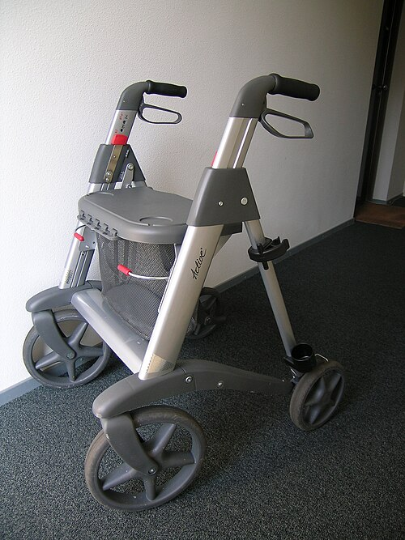
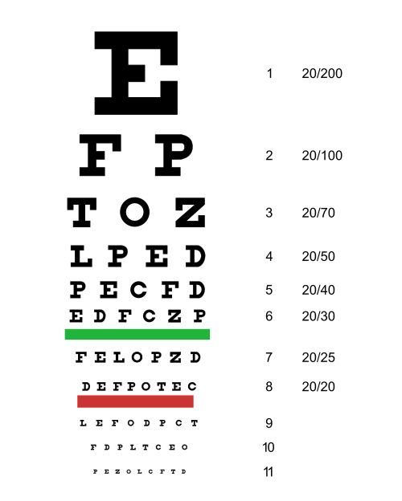

# AVALIAÇÃO GERIÁTRICA AMPLA

A Avaliação Geriátrica Ampla, ou simplesmente AGA, não é um exame físico estendido e nem um "check-up" de luxo. Se você entrar na prova pensando que a AGA é apenas uma lista de escalas, você vai errar as questões conceituais. A AGA é um processo diagnóstico multidimensional e, acima de tudo, interdisciplinar.

Por que fazemos a AGA? Porque o modelo biomédico tradicional, focado na doença, falha miseravelmente com o idoso. No idoso, as doenças não se apresentam como nos livros de semiologia clássica. Elas se manifestam como "Gigantes da Geriatria": instabilidade postural, incontinência, insuficiência cognitiva e iatrogenia.

O objetivo central da AGA é determinar a reserva funcional do paciente. Guarde esta frase: a funcionalidade é o quinto sinal vital do idoso. É ela que define o prognóstico, mais do que o número de comorbidades no prontuário.

## O Conceito de Funcionalidade e as Atividades de Vida Diária

*Figura 1 - Andador com rodas (rollator), dispositivo auxiliar de mobilidade utilizado por idosos com comprometimento funcional, refletindo a perda de atividades instrumentais de vida diária. Fonte: DirkvdM, CC BY 3.0 | Wikimedia Commons*

Para entender a AGA, precisamos entender como o idoso perde sua independência. Existe uma hierarquia na perda funcional que as bancas adoram cobrar. O idoso perde primeiro as atividades mais complexas e, por último, as mais básicas.

Imagine o Sr. José, de 75 anos. Ele começa a ter dificuldade para gerenciar a conta bancária (Atividade Avançada). Depois, para de conseguir ir ao mercado sozinho (Atividade Instrumental). Por fim, precisa de ajuda para tomar banho (Atividade Básica).

### Atividades Básicas de Vida Diária (ABVD)

As ABVDs referem-se ao autocuidado. É o que uma criança pequena aprende a fazer primeiro. O instrumento mais utilizado em provas para avaliar isso é o Índice de Katz.

O Índice de Katz avalia seis funções, geralmente na seguinte ordem de perda:

- Banho (a primeira a ser perdida).

- Vestir-se.

- Higiene pessoal (uso do banheiro).

- Transferência (sair da cama para a cadeira).

- Continência (controle esfincteriano).

- Alimentação (a última a ser perdida).

Cuidado: "preparar a refeição" não é ABVD. "Alimentar-se" no Katz significa levar a comida do prato à boca. Se o paciente precisa que alguém cozinhe, mas ele come sozinho, ele é independente na alimentação.

### Atividades Instrumentais de Vida Diária (AIVD)

As AIVDs referem-se à capacidade do idoso de viver de forma independente na comunidade. Elas exigem maior integridade cognitiva e motora do que as básicas. A escala padrão-ouro aqui é a Escala de Lawton e Brody.

As AIVDs incluem:

- Usar o telefone.

- Usar meios de transporte.

- Fazer compras.

- Preparar refeições.

- Arrumar a casa.

- Lavar a roupa.

- Tomar medicamentos (gestão da própria saúde).

- Cuidar das finanças.

Dica de prova: Se a questão descreve um idoso que "não consegue mais pagar as contas ou ir ao banco", ela está apontando para um declínio nas AIVDs. Isso é um marcador precoce de declínio cognitivo.

### Atividades Avançadas de Vida Diária (AAVD)

Estas não possuem uma escala única universal, mas referem-se à participação social, lazer, trabalho e atividades religiosas. São as primeiras a serem abandonadas quando o idoso começa a fragilizar.

| Categoria | O que avalia | Exemplo | Escala Principal |
| --- | --- | --- | --- |
| **Básicas (ABVD)** | Autocuidado | Banho, alimentação | Katz |
| **Instrumentais (AIVD)** | Vida independente | Finanças, compras | Lawton |
| **Avançadas (AAVD)** | Integração social | Trabalho, viagens | Descritiva |

## Avaliação Cognitiva e do Humor

Aqui é onde muitos alunos se perdem. A avaliação cognitiva na AGA serve para rastrear demência e delirium, enquanto a avaliação do humor foca em depressão.

### Mini-Exame do Estado Mental (MEEM)

O MEEM é o teste de rastreio mais famoso, mas ele tem um "pulo do gato": a pontuação de corte depende da escolaridade. Um paciente analfabeto tem um corte menor do que um paciente com 12 anos de estudo.

O MEEM avalia orientação temporal, espacial, memória imediata, atenção e cálculo, evocação, linguagem e praxia construtiva. No MedEvo, sempre reforçamos que o MEEM isolado não faz diagnóstico de demência. O diagnóstico de demência é clínico e exige declínio cognitivo MAIS prejuízo funcional.

### Teste do Relógio

Este é o queridinho das bancas recentemente. Pede-se ao paciente para desenhar um relógio, colocar os números e marcar uma hora específica (geralmente 11:10).
Por que ele é tão bom? Porque avalia funções executivas e habilidades visuoespaciais. Um paciente pode ter um MEEM normal e um Teste do Relógio alterado, sugerindo disfunção de lobo frontal.

### Escala de Depressão Geriátrica (GDS ou Yesavage)

A depressão no idoso é traiçoeira. Muitas vezes não há tristeza, mas sim apatia, queixas somáticas e déficit cognitivo. É a chamada "Pseudodemência Depressiva".

A GDS-15 (versão curta) é muito usada. Uma pontuação acima de 5 pontos sugere depressão e indica a necessidade de uma investigação mais profunda. Lembre-se: se o idoso chega com queixa de "esquecimento", você DEVE aplicar a GDS para excluir que esse esquecimento seja, na verdade, falta de atenção por depressão.

## Avaliação da Mobilidade e Risco de Quedas

A queda é um evento sentinela. Um idoso que cai uma vez tem um risco altíssimo de cair de novo e de perder a independência. Na AGA, investigamos a mobilidade de forma objetiva.

### Teste Timed Up and Go (TUG)

O paciente deve levantar de uma cadeira, caminhar 3 metros, virar, voltar e sentar.

- Abaixo de 10 segundos: Independente, baixo risco.

- Acima de 20 segundos: Risco elevado de quedas e déficit de mobilidade.

### Escala de Tinetti (Poma-Brasil)

Avalia tanto o equilíbrio quanto a marcha. É mais detalhada e excelente para identificar o componente específico da instabilidade (se é o início do passo, a altura do passo ou o equilíbrio ao sentar).

### SPPB (Short Physical Performance Battery)

O SPPB avalia três domínios: equilíbrio (pés juntos, semi-tandem e tandem), velocidade da marcha e força de membros inferiores (sentar e levantar da cadeira 5 vezes sem usar os braços). A pontuação vai de 0 a 12. Escores baixos (geralmente < 8) são preditores fortíssimos de morte, hospitalização e institucionalização.

## Síndrome da Fragilidade

Este é um conceito biológico, não apenas clínico. A fragilidade é um estado de vulnerabilidade a estressores. Um idoso frágil que pega uma gripe pode acabar em uma UTI, enquanto um idoso robusto apenas fica de repouso.

Os Critérios de Fried são a regra de ouro para o diagnóstico:

- Perda de peso não intencional (> 4,5 kg ou > 5% do peso corporal no último ano).

- Exaustão (autorreferida).

- Baixa atividade física (gasto calórico semanal baixo).

- Diminuição da velocidade da marcha.

- Diminuição da força de preensão palmar (medida com dinamômetro).

Classificação de Fried:

- 0 critérios: Robusto.

- 1 a 2 critérios: Pré-frágil.

- 3 ou mais critérios: Frágil.

## Avaliação Nutricional

O IMC do idoso não segue a tabela da OMS para adultos. Isso cai muito! O idoso precisa de mais reserva.

Segundo a OPAS e o Ministério da Saúde:

- IMC < 22 kg/m²: Baixo peso (desnutrição).

- IMC entre 22 e 27 kg/m²: Eutrofia (ideal).

- IMC > 27 kg/m²: Sobrepeso.

Por que o IMC ideal é maior? Porque o sobrepeso leve no idoso protege contra a sarcopenia e oferece reserva metabólica em caso de doenças agudas. É o chamado "paradoxo da obesidade" na geriatria.

Além do IMC, usamos a Mini Avaliação Nutricional (MAN), que inclui perguntas sobre perda de apetite e medidas da circunferência da panturrilha (marcador de massa muscular; < 31 cm sugere sarcopenia).

## Avaliação Social e Ambiental

Não adianta prescrever o melhor remédio se o idoso não tem quem o ajude a tomar ou se a casa dele é uma armadilha de quedas.

### Genograma e APGAR de Família

O Genograma ajuda a visualizar a estrutura familiar e as relações. O APGAR de Família avalia a satisfação do idoso com o suporte recebido. Se o APGAR for < 3, temos uma disfunção familiar grave, o que compromete qualquer plano terapêutico.

### Avaliação Ambiental

Devemos questionar ativamente sobre:

- Tapetes soltos (o maior vilão das fraturas de fêmur).

- Iluminação inadequada.

- Falta de barras de apoio no banheiro.

- Escadas sem corrimão.

## Manejo de Comorbidades na AGA: O Exemplo do Diabetes

A AGA serve para individualizar metas. Não tratamos o "Diabetes", tratamos o "Idoso com Diabetes". Segundo a Sociedade Brasileira de Diabetes, as metas glicêmicas mudam conforme a funcionalidade.

| Perfil do Idoso | Meta de Hemoglobina Glicada (HbA1c) | Glicemia de Jejum (mg/dL) |
| --- | --- | --- |
| Saudável / Robusto | 7,0% a 7,5% | 80 - 130 |
| Complexo / Intermediário | 7,5% a 8,0% | 90 - 150 |
| Muito Frágil / Fim de Vida | Até 8,5% (evitar hipo) | 100 - 180 |

Por que somos mais permissivos com o idoso frágil? Porque o risco de hipoglicemia é muito mais perigoso do que uma hiperglicemia leve. A hipoglicemia no idoso causa quedas, arritmias e pode mimetizar um AVC ou demência.

## Polifarmácia e Critérios de Beers

Polifarmácia é geralmente definida como o uso de 5 ou mais medicamentos. Na AGA, fazemos a reconciliação medicamentosa para evitar a "Cascata Iatrogênica" (quando um remédio é prescrito para tratar o efeito colateral de outro).

Os Critérios de Beers listam medicamentos potencialmente inapropriados para idosos. Exemplos clássicos que as bancas amam:

- Benzodiazepínicos: Aumentam risco de quedas, fraturas e confusão mental.

- Antipsicóticos (em idosos com demência): Aumentam risco de AVC e morte.

- Anti-inflamatórios (AINEs): Risco de insuficiência renal e sangramento digestivo.

- Flunarizina / Metoclopramida: Podem causar Parkinsonismo medicamentoso.

Se um idoso chega com tremor de início recente e usa Flunarizina para tontura, a conduta não é pedir RM de crânio, é suspender a droga!

## Particularidades do Exame Físico Geriátrico

O exame físico na AGA tem detalhes que passam batido no adulto jovem.

- **Hiato Auscultatório:** Durante a aferição da PA, o desaparecimento dos sons de Korotkoff entre a sístole e a diástole pode levar a uma subestimação da pressão sistólica. Por isso, deve-se sempre palpar o pulso radial e insuflar o manguito acima do desaparecimento do pulso.

- **Hipotensão Ortostática:** Deve ser medida em todo idoso com queixa de tontura ou quedas. Mede-se a PA deitado e após 3 minutos em pé. Queda de > 20 mmHg na sistólica ou > 10 mmHg na diastólica confirma o diagnóstico.

- **Teste de Snellen:** A acuidade visual deve ser rastreada. Se < 20/40, o rastreio é positivo e exige encaminhamento.

- **Acuidade Auditiva:** O teste do sussurro é simples e eficaz. A perda auditiva (presbiacusia) é um fator de risco modificável importante para demência.

## Diagnóstico Diferencial: O Fenômeno do Iceberg

Na geriatria, a queixa principal é apenas a ponta do iceberg. Um idoso que chega com "confusão mental aguda" (Delirium) pode ter como causa subjacente uma Infecção Urinária, um Infarto (que pode ser indolor no idoso) ou apenas uma constipação intestinal severa (fecaloma).

Sempre que houver declínio funcional agudo, investigue causas orgânicas antes de rotular como "coisa da idade". Envelhecimento não é doença. Perder a capacidade de tomar banho sozinho não é normal do envelhecimento, é sinal de patologia.

## Cuidados Paliativos e Prognóstico

A AGA também serve para identificar quando mudar o foco do tratamento. Pacientes com doenças crônicas, progressivas e irreversíveis (como demência avançada ou IC refratária) devem ter diretivas antecipadas de vontade discutidas.

As escalas de performance status, como ECOG e Karnofsky, ajudam a definir o prognóstico oncológico. Um idoso com ECOG 3 ou 4 (passa mais de 50% do tempo na cama ou poltrona) dificilmente tolerará uma quimioterapia agressiva. Nesses casos, o conforto e a qualidade de vida tornam-se a prioridade absoluta.

## Pontos-Chave para Prova

- **Funcionalidade:** É o melhor indicador de prognóstico e longevidade. Avaliada por ABVD (Katz) e AIVD (Lawton).

- **Hierarquia de Perda:** AAVD -> AIVD -> ABVD. O banho é a primeira ABVD a ser perdida; a alimentação é a última.

- **IMC do Idoso:** Eutrofia é entre 22 e 27 kg/m². Abaixo de 22 é desnutrição.

- **Fragilidade (Fried):** 5 critérios (Peso, Exaustão, Atividade, Marcha, Força). ≥ 3 critérios = Frágil.

- **Metas Glicêmicas:** Idoso frágil/dependente tem metas mais relaxadas (HbA1c até 8,5%) para evitar hipoglicemia.

- **Teste do Relógio:** Avalia funções executivas e visuoespaciais. Ótimo para rastreio de demência.

- **GDS (Yesavage):** Rastreio de depressão, não de demência. Útil para diferenciar pseudodemência.

- **Hipotensão Ortostática:** Queda de 20 mmHg (Sistólica) ou 10 mmHg (Diastólica) após 3 min em pé.

- **Polifarmácia:** 5 ou mais drogas. Sempre revisar critérios de Beers.

- **Parkinsonismo Iatrogênico:** Suspeitar sempre de Flunarizina, Metoclopramida e Antipsicóticos típicos.

- **Incontinência Urinária:** Deve ser rastreada ativamente; idosos raramente queixam-se espontaneamente por vergonha.

- **Visão:** Rastreio com Snellen; positivo se < 20/40.

- **Audição:** Presbiacusia é fator de risco para isolamento social e demência.

- **Genograma e APGAR:** Avaliam suporte social e dinâmica familiar.

- **O que NÃO é AGA:** Exames laboratoriais de rotina não fazem parte dos domínios da AGA (embora sejam solicitados na consulta).

- **Pegadinha de Prova:** A banca vai dizer que o idoso é demente porque esqueceu o nome do médico, mas ele ainda viaja sozinho e cuida das contas. Se a funcionalidade está preservada, NÃO é demência (pode ser Comprometimento Cognitivo Leve).

- **Cuidado:** Não confunda Katz (Básicas) com Lawton (Instrumentais). Memorize: "Katz é o básico para sobreviver (banho, comer)".

- **Dr. Will avisa:** Em questões de conduta, se o idoso está perdendo funcionalidade, a primeira coisa é a AGA completa para identificar o domínio afetado.

 Cópia offline para consulta pessoal.
 Fonte original:
 [https://www.medevo.com.br/material-apoio/ler/ff92031c-6250-4401-82e2-4558a03810ea](https://www.medevo.com.br/material-apoio/ler/ff92031c-6250-4401-82e2-4558a03810ea)
