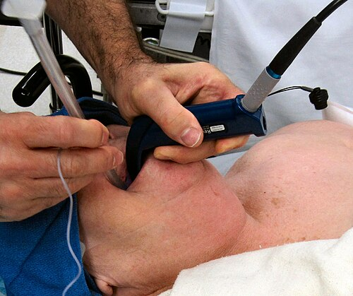

# AVALIAÇÃO PRÉ-OPERATÓRIA

A avaliação pré-operatória não é um "visto" ou um carimbo burocrático para liberar o paciente para a cirurgia. Se você entender isso, já está à frente de 50% dos candidatos. O objetivo real aqui é a **estratificação de risco** e a **otimização clínica**. Nós queremos saber qual a chance de o paciente morrer ou ter uma complicação grave e o que podemos fazer para reduzir esse risco.

Muitos alunos erram questões por acharem que "quanto mais exame, melhor". Na verdade, a medicina baseada em evidências e as bancas de residência (seguindo diretrizes como as da SBC e do Projeto ACERTO) punem o excesso de exames desnecessários. Como costumamos dizer no MedEvo, a base de tudo é a tríade: Anamnese, Exame Físico e Capacidade Funcional.

## O Coração da Avaliação: Anamnese e Exame Físico

Você vai encontrar dezenas de questões onde o enunciado descreve um paciente jovem, hígido, que vai operar uma hérnia inguinal. A pergunta é: "Quais exames solicitar?". A resposta, quase sempre, é: **Nenhum**.

Em pacientes ASA I (já vamos detalhar essa classificação), com menos de 40 anos e para cirurgias de baixo risco, a anamnese e o exame físico detalhados são suficientes. O exame físico deve focar especialmente em:

- **Avaliação das vias aéreas:** Predição de intubação difícil (Mallampati).

*Figura 1 - Classificação de Mallampati (I a IV) para predição de via aérea difícil, avaliada pela visualização das estruturas orofaríngeas. Fonte: Jmarchn, CC BY-SA 3.0 | Wikimedia Commons*
2. **Ausculta cardíaca e pulmonar:** Identificar sopros patológicos ou estertores que sugiram insuficiência cardíaca (IC) descompensada.
3. **Pulsos e perfusão:** Especialmente em cirurgias vasculares, onde a presença de sopro carotídeo ou ausência de pulsos distais muda a estratificação de risco.

**Dica de Prova:** Se o paciente tem Doença Vascular Periférica (DVP), o seu exame físico *deve* buscar sopro carotídeo. Isso é uma "pérola" que as bancas adoram para testar se você sabe que a aterosclerose é uma doença sistêmica.

## Classificação de Estado Físico (ASA)

A classificação da *American Society of Anesthesiologists* (ASA) é, sem dúvida, o tema mais cobrado. Ela é subjetiva? Sim. Mas é um preditor independente de mortalidade perioperatória fortíssimo.

| Classificação | Definição | Exemplos Práticos para Prova |
| --- | --- | --- |
| **ASA I** | Paciente saudável, sem doenças sistêmicas. | Jovem, não tabagista, não etilista, IMC normal. |
| **ASA II** | Doença sistêmica leve, sem limitação funcional. | **Tabagista**, HAS/DM controlados, Obesidade (IMC 30-40), Gravidez. |
| **ASA III** | Doença sistêmica grave, com limitação funcional. | IAM prévio (>3 meses), DM/HAS mal controlados, DPOC, IMC > 40, Insuf. Renal Crônica. |
| **ASA IV** | Doença sistêmica grave que é ameaça constante à vida. | IAM recente (<3 meses), AVC recente, Sepse, Disfunção orgânica grave. |
| **ASA V** | Paciente moribundo, expectativa de vida < 24h com ou sem cirurgia. | Aneurisma de aorta roto, TCE grave com hipertensão intracraniana. |
| **ASA VI** | Morte cerebral confirmada. | Doador de órgãos. |

**Cuidado com a pegadinha:** O sufixo "E" (ex: ASA IIE) indica cirurgia de **Emergência**. Se o paciente é hígido mas sofreu um trauma e precisa operar agora, ele é ASA IE.

**Erro clássico de prova:** Achar que um paciente com IAM prévio ou stent, mas que hoje está estável e controlado, é ASA II. Errado! Se a doença limita a reserva funcional ou é uma patologia sistêmica importante (como DM ou IAM prévio), ele é **ASA III**. O tabagismo isolado já joga o paciente para ASA II.

## Avaliação de Risco Cardiovascular

Aqui é onde o "filho chora e a mãe não vê". Para as provas, seguimos a **3ª Diretriz de Avaliação Cardiovascular Perioperatória da SBC**. O raciocínio deve ser algorítmico.

### Passo 1: A cirurgia é de emergência ou urgência?

Se sim, o paciente vai para a sala. Não há tempo para estratificação extensiva. O que se faz é a otimização possível no tempo disponível.

### Passo 2: O paciente tem condições cardíacas graves/instáveis?

Se o paciente tem uma angina instável, IC descompensada (NYHA IV), arritmias graves ou valvulopatias graves (estenose aórtica sintomática), a cirurgia eletiva **deve ser cancelada** e o paciente tratado antes de qualquer coisa.

### Passo 3: Qual o risco da cirurgia?

As cirurgias são divididas pelo risco de eventos cardiovasculares (morte ou IAM não fatal) em 30 dias:

- **Baixo Risco (< 1%):** Cirurgias superficiais, mama, endoscopia, catarata.

- **Risco Intermediário (1-5%):** Colecistectomia, ortopédicas, próstata, cirurgias de cabeça e pescoço.

- **Alto Risco (> 5%):** Cirurgias vasculares arteriais (aorta, carótida sintomática, revascularização de membros), cirurgias torácicas ou abdominais de grande porte e longa duração.

### Passo 4: Capacidade Funcional (METs)

Isso é fundamental. Perguntamos ao paciente o que ele consegue fazer.

- **< 4 METs (Baixa):** Não consegue subir dois lances de escada ou caminhar rápido em subida. Se o paciente tem baixa capacidade funcional ou ela é desconhecida, precisamos investigar mais se o risco cirúrgico for intermediário ou alto.

- **> 4 METs (Boa):** Consegue subir escadas, correr, fazer trabalho doméstico pesado. Se a capacidade funcional é boa, geralmente liberamos para a cirurgia, mesmo com fatores de risco.

### Passo 5: Índices de Risco (RCRI ou Lee)

O Índice de Risco Cardíaco Revisado (Lee) é o mais cobrado. Ele atribui 1 ponto para cada um dos seguintes critérios:

- Cirurgia de alto risco (intraperitoneal, intratorácica ou suprainguinal).

- História de doença isquêmica do coração.

- História de Insuficiência Cardíaca.

- História de doença cerebrovascular (AVC ou AIT).

- Diabetes Mellitus com uso de insulina.

- Creatinina pré-operatória > 2,0 mg/dL.
**MACETE PARA MEMORIZAR(CARDIO):**
**C**ardiopatia
**A**vc/AIT
**R**ins (doença renal crônica c/ Creatinina >2)
**D**iabético em uso de insulina
**I**nsuficiência cardíaca
**O**peração de grandes sistemas (cérebro / ♥ / vascular)

**Interpretação:**

- 0-1 ponto: Baixo risco.

- ≥ 2 pontos: Risco elevado -> Considerar exames adicionais (como teste ergométrico ou cintilografia) se isso for mudar a conduta.

**Dr. Will lembra:** Não peça teste de estresse para quem vai fazer cirurgia de baixo risco, independentemente do Lee. É desperdício de recurso e cai na prova como conduta errada.

## Avaliação de Risco Pulmonar

As complicações pulmonares (pneumonia, atelectasia, insuficiência respiratória) são tão frequentes e graves quanto as cardíacas.

O principal fator de risco para complicação pulmonar é o **sítio cirúrgico**. Quanto mais perto do diafragma, maior o risco. Cirurgias de andar superior do abdome e torácicas são as mais perigosas.

**Tabagismo:** O paciente deve parar de fumar? Sim. Mas cuidado com o tempo!

- O ideal é parar **8 semanas (2 meses)** antes da cirurgia.

- Parar menos de 4 semanas antes pode, teoricamente, aumentar a secreção e o risco de broncoespasmo na indução, embora a diretriz atual recomende a cessação em qualquer momento. Para a prova: o número mágico é 8 semanas.

**Espirometria:** Não é rotina! Ela está indicada em:

- Cirurgias de ressecção pulmonar (lung shaving, lobectomia).

- Pacientes com sintomas respiratórios inexplicados.

- Candidatos à cirurgia de grande porte com DPOC ou Asma, para otimização.

**Pérola de Prova:** Uma gasometria arterial com pO₂ < 60 mmHg no pré-operatório de uma cirurgia pulmonar é um forte preditor de complicações pós-operatórias.

## Manejo de Medicações Crônicas

Este tópico é um "prato cheio" para questões de múltipla escolha. Vamos organizar o que manter e o que suspender.

### Anti-hipertensivos e Cardiológicos

- **Betabloqueadores:** **MANTER SEMPRE**. Se o paciente já usa, não suspenda (risco de taquicardia reflexa e IAM). Se for iniciar, faça semanas antes, nunca no dia da cirurgia.

- **Estatinas:** **MANTER**. Têm efeito pleiotrópico (estabilizam a placa aterosclerótica).

- **iECA e BRA:** Existe controvérsia, mas a recomendação mais frequente em provas é **SUSPENDER 24h antes** da cirurgia para evitar hipotensão grave na indução anestésica, reiniciando após a estabilização volêmica.

- **Diuréticos:** **SUSPENDER** no dia da cirurgia (evitar hipovolemia e distúrbios eletrolíticos).

### Diabetes Mellitus

O objetivo é evitar a hipoglicemia (o maior vilão no perioperatório) e a cetoacidose.

- **Metformina:** **SUSPENDER 24-48h antes** devido ao risco de acidose lática, especialmente se houver risco de disfunção renal ou uso de contraste.

- **Sulfonilureias (Gliclazida):** **SUSPENDER 24h antes** (alto risco de hipoglicemia em jejum).

- **Inibidores da SGLT2 (Empagliflozina):** **SUSPENDER 3 a 4 dias antes** (risco de cetoacidose euglicêmica).

- **Insulina NPH:** No dia da cirurgia, reduzir a dose matinal em 50%.

- **Insulina Glargina (Lantus):** Reduzir em 20%.

- **Insulina Regular/Lispro:** Suspender enquanto estiver em jejum (usar apenas esquema de correção se necessário).

### Antiagregantes e Anticoagulantes

- **AAS:**

- Prevenção secundária (já teve IAM/AVC) em cirurgia de baixo risco: **MANTER**.

- Cirurgia de alto risco de sangramento (neurocirurgia, RTU de próstata): **SUSPENDER 7-10 dias**.

- **Clopidogrel:** Suspender 5 dias antes.

- **Varfarina:** Suspender 5 dias antes. Operar quando o RNI estiver < 1,5. Se o paciente tiver alto risco trombótico (ex: prótese valvar mecânica mitral), fazer a **ponte com Heparina** (HNF ou HBPM).

### Corticoides

Pacientes em uso crônico (> 20mg/dia de prednisona por > 3 semanas) têm supressão do eixo hipotálamo-hipófise-adrenal.

- Eles não conseguem responder ao estresse cirúrgico com aumento de cortisol.

- Conduta: **Dose de estresse de Hidrocortisona** no perioperatório para evitar insuficiência adrenal aguda.

## Jejum Pré-Operatório e Abreviação (Protocolo ACERTO/ERAS)

O dogma do "jejum de 8 horas para tudo" caiu. O protocolo ACERTO (Aceleração da Recuperação Total Pós-Operatória), baseado no ERAS europeu, preconiza a abreviação do jejum para reduzir a resistência insulínica e o catabolismo.

| Substância Ingerida | Tempo de Jejum Recomendado |
| --- | --- |
| Líquidos claros (água, chá, suco sem resíduos) | 2 horas |
| Carboidratos (Maltodextrina 12,5%) | 2 horas |
| Leite Materno | 4 horas |
| Leite não materno / Fórmulas infantis | 6 horas |
| Refeição leve (torrada, chá) | 6 horas |
| Refeição completa (gorduras, carne) | 8 horas |

**Por que carboidrato 2h antes?** Porque isso muda o estado metabólico do paciente de jejum (catabólico) para alimentado (anabólico), diminuindo a resistência à insulina e melhorando a cicatrização.

**Cuidado:** Pacientes com retardo do esvaziamento gástrico (ex: estenose pilórica, megaesôfago, obstrução intestinal) **não** entram na regra da abreviação. Eles são considerados "estômago cheio" e precisam de precauções para aspiração pulmonar (Pneumonite Química ou Síndrome de Mendelson).

## Exames Complementares: Quando Realmente Pedir?

Não decore listas infinitas. Use a lógica da diretriz para o paciente assintomático:

- **Hemograma:** Cirurgias de grande porte (perda sanguínea estimada > 500ml) ou história de anemia.

- **Creatinina:** Pacientes > 40 anos, hipertensos, diabéticos ou com doença renal conhecida.

- **Glicemia:** Diabéticos, obesos ou uso de corticoide.

- **ECG:** Homens > 40 anos, mulheres > 50 anos, ou qualquer paciente com fator de risco cardiovascular.

- **Rx de Tórax:** Pacientes > 60 anos ou com doença cardiopulmonar sintomática. (Muitas diretrizes modernas já não pedem Rx de rotina nem para idosos se forem assintomáticos).

- **Coagulograma:** História de sangramento, uso de anticoagulantes, hepatopatas ou cirurgias de grande porte.

**Pegadinha de Prova:** Paciente jovem, vai fazer colecistectomia eletiva, sem comorbidades. A alternativa que sugere "Colesterol Total e Frações" está **errada**. Isso não é exame pré-operatório, é check-up de saúde geral. Não confunda as coisas.

## Situações Especiais e Pegadinhas de Prova

### Feocromocitoma

Este é um clássico da cirurgia. O paciente tem uma tumor de adrenal que secreta catecolaminas.

- **Regra de Ouro:** Primeiro você faz o **bloqueio ALFA-adrenérgico** (ex: fenoxibenzamina ou prazosina) por 7-14 dias.

- Só depois que o paciente estiver alfa-bloqueado, se ele tiver taquicardia, você inicia o **bloqueio BETA**.

- **Por que?** Se você der beta-bloqueador primeiro, você bloqueia a vasodilatação mediada por receptores beta-2, deixando a vasoconstrição alfa-1 agir sozinha (estimulação alfa sem oposição). Resultado: uma crise hipertensiva catastrófica.

### Anemia Falciforme

Em cirurgias de médio/alto risco, o objetivo é reduzir a hemoglobina S (HbS) para menos de 30% e manter a hemoglobina total em torno de 10 g/dL. Isso geralmente exige uma **exsanguineotransfusão parcial** pré-operatória.

### Geriatria

No idoso, a reserva funcional é menor. O débito cardíaco máximo é reduzido e a complacência arterial é menor.

- **Delirium pós-operatório** é a complicação neuropsiquiátrica mais comum.

- Sempre avaliar polifarmácia e estado nutricional (albumina baixa é preditor de má cicatrização e deiscência).

### Hérnia Inguinal em Crianças

Diferente do adulto, a hérnia inguinal na criança é quase sempre **indireta** (persistência do conduto peritônio-vaginal).

- O tratamento é cirúrgico e deve ser feito **logo após o diagnóstico**. Não se espera até os 2 anos, pois o risco de encarceramento é muito alto em lactentes.

## Segurança do Paciente: O Checklist da OMS

A Lista de Verificação de Cirurgia Segura da OMS reduziu drasticamente a mortalidade. Ela é dividida em três momentos:

- **Antes da Indução Anestésica (Sign In):** Confirmar identificação, sítio cirúrgico, consentimento, se há risco de via aérea difícil e se há risco de perda sanguínea > 500ml.

- **Antes da Incisão Cirúrgica (Time Out):** Pausa crítica. Toda a equipe se apresenta, confirma o nome do paciente, o procedimento e a **antibioticoprofilaxia** (deve ser feita nos 60 minutos anteriores à incisão).

- **Antes do Paciente Sair da Sala (Sign Out):** Contagem de compressas e agulhas, identificação de amostras de patologia e revisão dos planos de recuperação.

**Dica MedEvo:** A antibioticoprofilaxia não deve ser mantida por mais de 24 horas na maioria das cirurgias limpas-contaminadas. O uso prolongado só aumenta a resistência bacteriana.

## Pontos-Chave para Prova

- **ASA II:** Inclui tabagistas, etilistas sociais, grávidas e obesos controlados.

- **ASA III:** Doença sistêmica que limita a atividade física (ex: DPOC que cansa aos esforços).

- **Jejum de Líquidos Claros:** 2 horas (inclui maltodextrina).

- **Metformina:** Suspender 24-48h antes (risco de acidose lática).

- **Betabloqueadores:** Nunca suspender se o paciente já usa.

- **iECA/BRA:** Suspender 24h antes (evitar hipotensão na indução).

- **Feocromocitoma:** Bloqueio ALFA primeiro, BETA depois. Nunca o contrário.

- **Capacidade Funcional:** O divisor de águas é 4 METs (subir 2 lances de escada).

- **Cessação do Tabagismo:** O ideal são 8 semanas antes da cirurgia.

- **Antibioticoprofilaxia:** Deve ser feita em até 60 min antes da incisão cutânea.

- **Exames de Rotina:** Não indicados para pacientes ASA I ou II, jovens (< 40 anos) em cirurgias de baixo risco.

- **Hérnia Inguinal Infantil:** Cirurgia precoce ao diagnóstico (risco de encarceramento).

- **Bacteriúria Assintomática:** Só tratar antes de cirurgias urológicas invasivas ou em gestantes.

- **AAS:** Manter em cirurgias de baixo risco; suspender 7-10 dias em neurocirurgia.

- **Hipertensão Grave:** Se PA > 180/110 mmHg, a cirurgia eletiva **deve** ser adiada. 💡

- **Anticoagulação:** Varfarina suspensa 5 dias antes; RNI alvo para operar < 1,5.

- **Pneumonite Química (Mendelson):** Aspiração de conteúdo gástrico ácido; prevenção com jejum e procinéticos em casos de risco.

 Cópia offline para consulta pessoal.
 Fonte original:
 [https://www.medevo.com.br/material-apoio/ler/496ce631-c67a-4271-9a0a-272512038aae](https://www.medevo.com.br/material-apoio/ler/496ce631-c67a-4271-9a0a-272512038aae)
