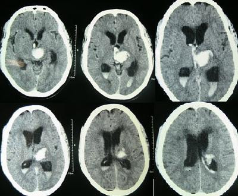
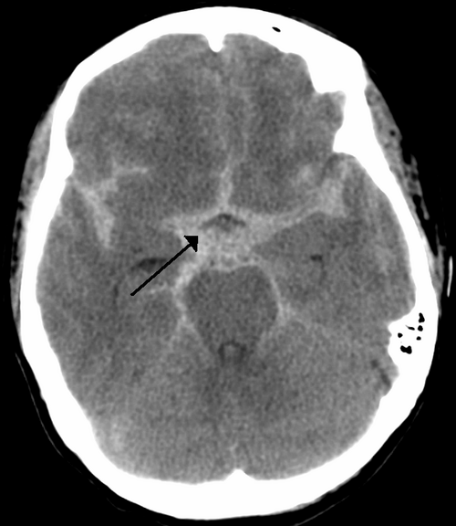

# AVC HEMORRÁGICO

Para começar nosso estudo, você precisa entender que o AVC Hemorrágico (AVCH) é o "primo mais agressivo" do AVC Isquêmico. Embora represente apenas cerca de 15% a 20% de todos os casos de AVC, ele é responsável por quase metade da mortalidade e por uma carga de sequelas muito mais pesada.

Como professor, vejo muitos alunos decorando condutas sem entender a mecânica do problema. No AVCH, o problema não é a falta de sangue (isquemia), mas o sangue onde ele não deveria estar. Isso gera dois problemas imediatos: a lesão direta do tecido cerebral pelo coágulo e o efeito de massa, que aumenta a Pressão Intracraniana (PIC).

Dividimos o AVCH em dois grandes grupos que as bancas amam separar: a Hemorragia Intraparenquimatosa (HIP) e a Hemorragia Subaracnoidea (HSA). Vamos dissecar cada uma delas, focando no que realmente cai na sua prova de residência.

## Hemorragia Intraparenquimatosa (HIP)

A HIP é o sangramento que ocorre dentro do parênquima cerebral. A causa número um, disparada, é a Hipertensão Arterial Sistêmica (HAS) mal controlada.

### Fisiopatologia e Etiologia: O "Porquê" do Sangramento

Por que a pressão alta estoura um vaso no cérebro? Anos de hipertensão causam uma degeneração das pequenas artérias penetrantes (como as artérias lentículo-estriadas). Esse processo é chamado de lipo-hialinose. Em pontos de fragilidade dessas arteríolas, formam se pequenas dilatações chamadas Microaneurismas de Charcot-Bouchard.

Quando a pressão sobe bruscamente, esses microaneurismas rompem. Por isso, os locais mais comuns de HIP por hipertensão são as estruturas profundas:

- Putâmen (o local mais frequente).

- Tálamo.

- Ponte.

- Cerebelo.

Agora, preste atenção em uma distinção que o Dr. Will sempre enfatiza: se o paciente é idoso, mas NÃO é hipertenso, e o sangramento é periférico (lobar), pense em Angiopatia Amyloide Cerebral. Aqui, o depósito de proteína beta-amiloide enfraquece os vasos corticais. É uma causa clássica de AVCH lobar recorrente em idosos.

### Quadro Clínico: Como identificar na emergência

Diferente do AVC isquêmico, onde o déficit costuma ser súbito e "estável", na HIP o quadro costuma ser progressivo em minutos ou horas. O hematoma vai crescendo, e o paciente vai piorando.

Os sinais cardinais são:

- Déficit focal súbito (hemiparesia, alteração sensitiva).

- Cefaleia intensa (presente em 50% dos casos).

- Vômitos (sugerem aumento da PIC).

- Rebaixamento do nível de consciência (pela compressão do tronco cerebral ou aumento global da PIC).

Exemplo clínico: Paciente de 65 anos, hipertenso mal aderente ao tratamento, chega ao pronto-socorro com hemiparesia à direita e fala arrastada (disartria) que começou há 40 minutos. Enquanto você o examina, ele começa a vomitar e fica sonolento. Isso é HIP até que se prove o contrário. O vômito e a sonolência progressiva são as "pistas" que afastam o diagnóstico de isquemia pura.

### Diagnóstico por Imagem

*Figura 1 - TC de crânio sem contraste evidenciando hemorragia intraparenquimatosa talâmica (área hiperdensa) com sangue nos ventrículos laterais e hidrocefalia. Fonte: Yadav YR et al., CC BY 2.0 | Wikimedia Commons*

A regra de ouro é: TC de crânio sem contraste. É o primeiro exame para qualquer suspeita de AVC. O sangue agudo na TC é hiperdenso (branco brilhante).

Cuidado com a pegadinha: a TC com contraste NÃO é o exame inicial. Usamos o contraste (ou angio-TC) apenas para procurar o "Spot Sign", que é um ponto de extravasamento de contraste dentro do hematoma, indicando que o sangramento ainda está ativo e o risco de expansão é alto.

### Manejo da HIP: O que as bancas cobram

Aqui o aluno costuma errar as metas de pressão arterial. No AVC isquêmico, somos tolerantes com a pressão. No AVCH, somos agressivos.

-

Controle da Pressão Arterial: Segundo os estudos INTERACT-2 e ATACH-2, a meta é reduzir a Pressão Arterial Sistólica (PAS) para próximo de 140 mmHg (entre 130 e 140 mmHg). Se o paciente chega com PAS > 220 mmHg, a redução deve ser imediata com medicações endovenosas (Nitroprussiato de Sódio ou Labetalol). Por que fazemos isso? Para evitar que o hematoma continue crescendo.

-

Reversão de Coagulopatias: Se o paciente usa Varfarina, você precisa dar Complexo Protrombínico (ou Plasma Fresco se não houver o primeiro) e Vitamina K. Se usa novos anticoagulantes (DOACs), use os antídotos específicos como o Idarucizumab (para Dabigatrana).

-

Manejo da PIC: Cabeceira elevada (30 a 45 graus), sedação se necessário e, em casos de herniação, terapia osmótica com Manitol ou Solução Salina Hipertonica a 3%.

-

Cirurgia: Quando operar? A maioria das HIPs é de tratamento clínico. A exceção absoluta que cai em prova é a Hemorragia Cerebelar. Se o hematoma no cerebelo for > 3 cm ou houver compressão do tronco/hidrocefalia, a neurocirurgia deve intervir imediatamente. O cerebelo está em uma "caixa" apertada (fossa posterior), e qualquer inchaço ali mata o paciente por compressão do centro respiratório.

## Hemorragia Subaracnoidea (HSA)

A HSA é o sangramento no espaço entre a aracnoide e a pia-máter, onde circula o líquor. A causa não traumática mais comum (85%) é a ruptura de um aneurisma sacular.

### O Perfil do Paciente e Fatores de Risco

Diferente da HIP, a HSA costuma atingir pacientes um pouco mais jovens (40 a 60 anos). Os principais fatores de risco são:

- Tabagismo (o mais importante para ruptura).

- Hipertensão.

- Etilismo.

- História familiar de aneurismas.

- Doença Renal Policística Autossômica Dominante (clássica associação de prova).

### Quadro Clínico: A "Thunderclap Headache"

O paciente descreve como "a pior cefaleia da minha vida". É uma dor que atinge o pico de intensidade em segundos (cefaleia em trovoada). Pode vir acompanhada de síncope, vômitos e rigidez de nuca (sinais meníngeos).

Atenção para a Paralisia do III Par Craniano (Oculomotor): se o paciente tem ptose palpebral, midríase (pupila dilatada) e o olho "olha para baixo e para fora", suspeite de um aneurisma de Artéria Comunicante Posterior comprimindo o nervo. Isso é uma emergência absoluta!

### Diagnóstico: A Escada da Investigação

*Figura 2 - TC de crânio sem contraste demonstrando hemorragia subaracnoidea com sangue hiperdensas nas cisternas basais e sulcos cerebrais. Fonte: James Heilman, MD, CC BY-SA 3.0 | Wikimedia Commons*

- TC de Crânio sem contraste: Identifica sangue nas cisternas e sulcos. Nas primeiras 6 horas, a sensibilidade é de quase 100%.

- Punção Lombar (PL): Se a TC for normal, mas a suspeita clínica for alta, você DEVE fazer a PL. O que buscamos? Hemácias que não diminuem do primeiro para o quarto tubo (acidente de punção limpa o líquor, HSA não) e, principalmente, a Xantocromia (líquor amarelado pela degradação da hemoglobina), que surge após 6 a 12 horas do sangramento.

- Angiografia Cerebral (Padrão-ouro): Serve para localizar o aneurisma e planejar o tratamento (clipping cirúrgico ou embolização endovascular).

### Classificações de Prova

Você precisa conhecer duas escalas para a HSA:

- Hunt-Hess: Avalia a gravidade clínica (vai de I a V, onde I é apenas cefaleia leve e V é coma profundo).

- Fisher: Avalia a quantidade de sangue na TC e prediz o risco de vasoespasmo.

| Escala de Fisher | Achado na Tomografia |
| --- | --- |
| Grau 1 | Sem sangue detectável |
| Grau 2 | Sangue difuso, lâmina < 1 mm de espessura |
| Grau 3 | Coágulo localizado ou lâmina > 1 mm |
| Grau 4 | Sangue intracerebral ou intraventricular |

### Complicações da HSA: Onde o paciente morre

Esta é a parte que as bancas mais amam, pois o manejo muda conforme a complicação.

- Ressangramento: Ocorre principalmente nas primeiras 24 horas. É a complicação mais letal. Por isso, o aneurisma deve ser excluído da circulação (clipping ou mola) o mais rápido possível.

- Vasoespasmo e Isquemia Cerebral Tardia: Ocorre entre o 3º e o 14º dia (pico no 7º dia). O sangue irrita as artérias, que se contraem, causando isquemia.

- Prevenção: Nimodipino 60mg de 4/4h por 21 dias para todos os pacientes. O Nimodipino não trata o espasmo, ele protege o neurônio (neuroproteção).

- Diagnóstico: Doppler Transcraniano diário à beira leito.

- Hidrocefalia: O sangue obstrui as granulações aracnoides, impedindo a reabsorção do líquor. Tratamento: Derivação Ventricular Externa (DVE).

- Hiponatremia: Comum por Síndrome Cerebral Perdedora de Sal. Cuidado: não restrinja líquidos, pois isso piora o risco de vasoespasmo. Use salina hipertônica.

## Diagnóstico Diferencial e Situações Especiais

Muitas vezes, a prova vai te dar um cenário de "emergência hipertensiva com sintomas neurológicos". Como diferenciar?

- Encefalopatia Hipertensiva: O paciente tem cefaleia, confusão mental e edema de papila, mas NÃO tem um déficit focal definido (como uma hemiparesia). A TC é normal ou mostra o padrão PRES (edema vasogênico posterior).

- Trombose Venosa Cerebral (TVC): Pense em mulheres jovens, usuárias de anticoncepcional, gestantes ou pacientes com infecções de face (seio cavernoso). A cefaleia é progressiva, pode haver crises convulsivas e o sinal clássico na TC com contraste é o "Sinal do Delta Vazio".

No MedEvo, sempre lembramos que o uso de cocaína é um gatilho comum para AVCH em jovens. A droga causa um pico hipertensivo súbito que rompe malformações arteriovenosas (MAV) ou aneurismas pré-existentes.

## Manejo Geral e Suporte

Independentemente da causa, o paciente com AVCH é um paciente crítico.

- Proteção de Via Aérea: Glasgow < 8 é indicação de intubação orotraqueal imediata.

- Controle Glicêmico: Manter entre 140 e 180 mg/dL. Tanto a hipo quanto a hiperglicemia pioram a lesão cerebral.

- Controle Térmico: Evite febre a todo custo. A febre aumenta o metabolismo cerebral e a lesão secundária. A hipotermia terapêutica, embora estudada, não é rotina no AVCH.

- Profilaxia de TVP: No início, use apenas métodos mecânicos (meias de compressão). Heparina profilática (HNF ou Enoxaparina) geralmente só é iniciada após 24 a 48 horas de estabilidade do hematoma na TC.

### Tabela Comparativa: HIP vs. HSA

| Característica | Hemorragia Intraparenquimatosa (HIP) | Hemorragia Subaracnoidea (HSA) |
| --- | --- | --- |
| Principal Causa | Hipertensão Arterial (HAS) | Ruptura de Aneurisma Sacular |
| Localização | Profunda (Putâmen, Tálamo) | Espaço Subaracnoideo (Cisternas) |
| Cefaleia | Variável, associada ao déficit | Súbita, "em trovoada", muito intensa |
| Sinais Meníngeos | Raros (exceto se houver inundação ventricular) | Muito comuns (Rigidez de nuca) |
| Meta de PAS | 130 a 140 mmHg | < 160 mmHg (até tratar o aneurisma) |
| Droga Específica | Nenhuma (foco no controle da PA) | Nimodipino (prevenção de isquemia) |

## O Fenômeno de Cushing e a PIC

Você precisa reconhecer a Tríade de Cushing, que indica hipertensão intracraniana grave e iminência de herniação:

- Hipertensão Arterial (o corpo tenta manter a Pressão de Perfusão Cerebral).

- Bradicardia (resposta reflexa ao aumento da PA).

- Alteração do Ritmo Respiratório.

Se vir isso em uma questão, a resposta quase sempre envolve medidas imediatas para reduzir a PIC: elevar cabeceira, hiperventilação leve (transitória) e terapia osmótica. NUNCA faça uma punção lombar em um paciente com suspeita de PIC elevada por lesão expansiva (como um hematoma), pois isso pode causar herniação transtentorial e morte imediata.

## Morte Encefálica

Infelizmente, muitos AVCHs evoluem para morte encefálica. Para a prova, lembre-se dos critérios brasileiros:

- Presença de lesão encefálica conhecida e irreversível.

- Ausência de fatores confundidores (distúrbios metabólicos graves, hipotermia, drogas sedantes).

- Dois exames clínicos (com intervalo de 1h para > 2 anos) mostrando coma aperceptivo e ausência de reflexos de tronco (fotomotor, corneano, oculocefálico, vestíbulo-calórico e de tosse).

- Teste de Apneia positivo (PCO2 final > 60 mmHg).

- Um exame complementar (EEG sem atividade, Arteriografia sem fluxo ou Cintilografia).

## Pontos-Chave para Prova 🧠

- A causa mais comum de AVCH não traumático é a Hipertensão Arterial (HIP profunda).

- A causa mais comum de HSA não traumática é a ruptura de aneurisma sacular.

- TC de crânio sem contraste é o padrão-ouro inicial para detectar sangue agudo (hiperdenso).

- Se TC é negativa e a suspeita de HSA é alta, a conduta obrigatória é a Punção Lombar (buscar xantocromia).

- Meta de PAS na HIP: 130 a 140 mmHg (redução agressiva).

- Meta de PAS na HSA: < 160 mmHg até que o aneurisma seja clipado ou embolizado.

- Nimodipino 60mg 4/4h por 21 dias é obrigatório na HSA para prevenir isquemia cerebral tardia.

- Vasoespasmo na HSA ocorre tipicamente entre o 3º e o 14º dia após o sangramento.

- Hemorragia cerebelar > 3 cm ou com compressão de tronco é indicação de cirurgia de emergência.

- Tríade de Cushing (HAS + Bradicardia + Arritmia respiratória) indica Hipertensão Intracraniana grave.

- Contraindicação ABSOLUTA: Realizar punção lombar em paciente com efeito de massa na TC (risco de herniação).

- Angiopatia Amiloide: Suspeitar em idosos não hipertensos com AVCH lobar (periférico) e recorrente.

- Aneurisma de Comunicante Posterior: Frequentemente causa paralisia do III par craniano (ptose e midríase).

- Escala de Fisher: Avalia o risco de vasoespasmo baseado na quantidade de sangue na TC.

- Escala de Hunt-Hess: Avalia a gravidade clínica do paciente com HSA.

- Hiponatremia na HSA: Geralmente por Síndrome Cerebral Perdedora de Sal; tratar com reposição volêmica e salina, nunca restrição hídrica.

- Uso de Metformina: Suspender antes de exames com contraste iodado (como Angio-TC) para evitar acidose láctica, especialmente se houver disfunção renal.

 Cópia offline para consulta pessoal.
 Fonte original:
 [https://www.medevo.com.br/material-apoio/ler/8909adf5-1978-43fa-9712-634099a17135](https://www.medevo.com.br/material-apoio/ler/8909adf5-1978-43fa-9712-634099a17135)
