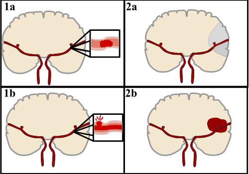
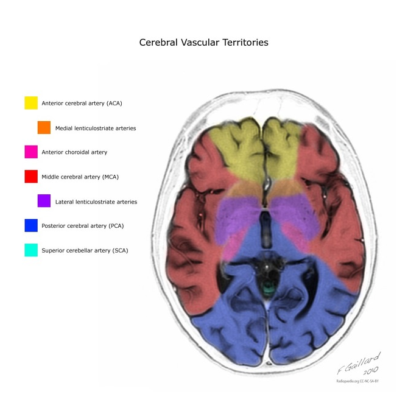
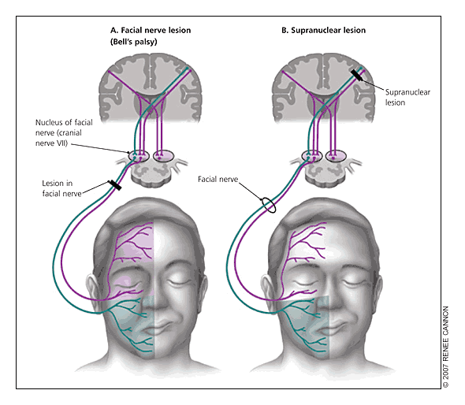
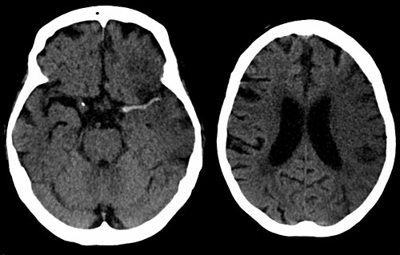
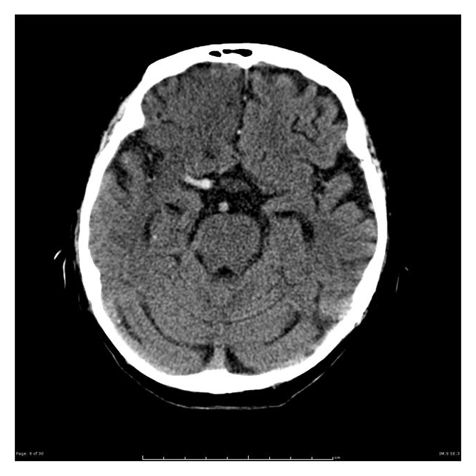
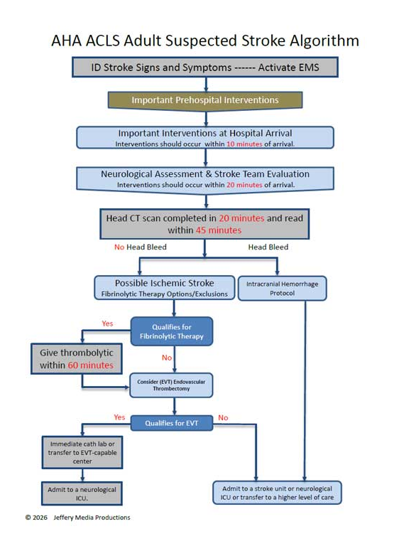

# AVC ISQUÊMICO

O Acidente Vascular Cerebral Isquêmico (AVCi) é, sem dúvida, um dos temas que mais assombra o estudante de medicina e o residente. A complexidade não vem apenas da neuroanatomia, mas da velocidade com que as decisões precisam ser tomadas. Como costumo dizer nas aulas do MedEvo, no AVC, "tempo é cérebro", e cada minuto de atraso custa ao paciente milhões de neurônios.

Para entender o AVCi, você precisa visualizar o que acontece no parênquima cerebral quando o fluxo sanguíneo é interrompido. Não é apenas uma área morta, é um campo de batalha. Temos o "core" isquêmico, que é o tecido já infartado, e a "área de penumbra", que é o tecido em sofrimento, mas ainda salvável. Nosso objetivo terapêutico é sempre resgatar a penumbra.

## Fisiopatologia e Etiologia: O Porquê do Entupimento

O AVCi ocorre quando há uma oclusão arterial que reduz o fluxo sanguíneo cerebral abaixo do limiar crítico, geralmente menos de 10 a 12 ml/100g/min. Isso gera uma cascata de eventos: falha das bombas iônicas, entrada de cálcio na célula, liberação de glutamato e, por fim, morte celular por necrose e apoptose.

Para a prova de residência, você deve dominar a classificação TOAST, que divide o AVCi em cinco grupos etiológicos principais. Entender a causa é fundamental porque ela dita a prevenção secundária.

- Aterosclerose de Grandes Vasos: Placas em carótidas ou vertebrais que embolizam ou ocluem o vaso.

- Cardioembolismo: O coração manda um êmbolo (comum na Fibrilação Atrial).

- Oclusão de Pequenos Vasos (Lacunar): Infartos pequenos (< 1,5 cm) em artérias perfurantes, geralmente associados à hipertensão crônica.

- Outras Etiologias: Dissecção arterial, vasculites, estados de hipercoagulabilidade (como a Síndrome do Anticorpo Antifosfolípide).

- Criptogênico: Quando, após investigação completa, não achamos a causa.

Cuidado: a banca pode tentar te confundir com a Displasia Fibromuscular. Lembre-se que esta é uma causa de isquemia extracraniana mais comum em mulheres jovens, apresentando o clássico aspecto de "colar de contas" na angiografia.

## Quadro Clínico e Síndromes Vasculares

O diagnóstico de AVCi é, primariamente, clínico. O déficit neurológico focal agudo é a marca registrada. Mas atenção: nem todo déficit é AVC. O Dr. Will sempre reforça que a primeira coisa a se fazer diante de um déficit focal é a glicemia capilar. A hipoglicemia é o principal "mimic" (simulador) de AVC.

### Síndrome da Artéria Cerebral Média (ACM)

É a mais cobrada em provas. A ACM irriga a maior parte da superfície lateral do cérebro.

- Hemiparesia e hemi-hipoestesia contralateral (predomínio facio-braquial).

- Afasia (se hemisfério dominante, geralmente o esquerdo): Broca (expressão comprometida, compreensão preservada) ou Wernicke (compreensão comprometida, fala fluida porém sem sentido).

- Negligência hemiespacial e anosognosia (se hemisfério não dominante, geralmente o direito).

### Síndrome da Artéria Cerebral Anterior (ACA)

Embora menos frequente que a da ACM, a oclusão da ACA é um alvo comum de pegadinhas de caso clínico.

- Sua marca registrada é a hemiparesia e hemi-hipoestesia contralateral com predomínio crural (o déficit acomete mais a perna e o pé do que o braço e a face).

- Pode vir acompanhada de incontinência urinária, apraxia de marcha e alterações comportamentais por acometimento do lobo frontal (como apatia e reflexos de libertação frontal, ex: preensão palmar).

### Síndromes de Tronco e Cerebelo

Aqui as bancas adoram as "síndromes alternadas" (nervo craniano ipsilateral e déficit motor/sensorial contralateral).

- Síndrome de Wallenberg (Bulbo Lateral): Vertigo, disfagia, disfonia, ataxia ipsilateral, Síndrome de Horner ipsilateral e analgesia térmica cruzada (face ipsilateral e corpo contralateral). É causada pela oclusão da artéria PICA ou vertebral.

- Lesão Cerebelar: Hipotonia, ataxia, dismetria e disartria. O sinal do canivete, por outro lado, indica lesão da via piramidal (neurônio motor superior), não cerebelar.

### O Diagnóstico Diferencial da Paralisia Facial

Este é um ponto onde muitos alunos erram.

- Paralisia Facial Central (AVC): Acomete apenas o terço inferior da face contralateral à lesão. O paciente consegue franzir a testa porque a musculatura frontal tem inervação bilateral.

- Paralisia Facial Periférica (Paralisia de Bell): Acomete toda a hemiface ipsilateral, incluindo a testa (não poupa a fronte). É uma lesão do VII par craniano (nervo facial).

## Manejo de Emergência: O Protocolo de AVC Agudo

O paciente chegou com suspeita de AVC. O cronômetro ligou. O que fazer?

- Estabilização (ABC): Garantir via aérea e estabilidade hemodinâmica.

- Glicemia Capilar: Regra de ouro. Excluir hipoglicemia imediatamente.

- Neuroimagem: Tomografia Computadorizada (TC) de crânio SEM contraste.

Por que TC sem contraste primeiro? Porque ela é o exame mais rápido para diferenciar isquemia de hemorragia. No AVCi agudo (nas primeiras horas), a TC costuma ser normal ou apresentar sinais precoces sutis (como o sinal da artéria cerebral média hiperdensa). Se a TC estiver normal e o quadro for compatível, você segue para a trombólise. Não espere a imagem mostrar a hipodensidade (que indica morte tecidual) para agir.

Escalas Objetivas na Emergência: NIHSS e ASPECTS

- **NIHSS** (National Institutes of Health Stroke Scale): Escala quantitativa de déficit neurológico que vai de 0 (normal) a 42 (déficit gravíssimo). Um NIHSS > 25 indica AVC muito grave (alto risco de sangramento) e um NIHSS < 4 com déficit não incapacitante configura AVC menor; ambas são situações de contraindicação relativa ao rtPA (Ativador do Plasminogênio Tecidual Recombinante) que geram debate em questões. Uma piora ≥ 2 pontos no NIHSS durante o plantão obriga a suspeita imediata de transformação hemorrágica.

- Escore **ASPECTS** (Alberta Stroke Program Early CT Score): Sistema de pontuação radiológica utilizado na TC sem contraste para avaliar a extensão da isquemia na circulação anterior (território da ACM). O score começa em 10 (TC completamente normal). A cada área de hipodensidade precoce ou apagamento de sulcos detectada em regiões específicas, subtrai-se 1 ponto. Um ASPECTS < 6 quantifica uma área isquêmica já extensa (superior a 1/3 do território da ACM), contraindicando abordagens de reperfusão por alto risco de sangramento e pouco tecido salvável.

### Controle da Pressão Arterial (PA) no Agudo

Este é o tema favorito das bancas. A conduta muda se você vai trombolisar ou não.

| Cenário | Meta de PA para Iniciar | Meta de PA durante/após |
| --- | --- | --- |
| Candidato à Trombólise | < 185 / 110 mmHg | < 180 / 105 mmHg |
| NÃO Candidato à Trombólise | < 220 / 120 mmHg | Reduzir 15% em 24h se acima disso |

Por que não baixamos a PA de todo mundo? Porque o cérebro isquêmico perde a autorregulação. Ele precisa de uma pressão de perfusão maior para manter o fluxo na área de penumbra. Se você baixar a PA agressivamente em um paciente não trombolisado com 200/110 mmHg, você pode transformar a penumbra em infarto.

Se o paciente ultrapassar as metas da tabela, a pressão deve ser reduzida com medicações endovenosas de ação rápida e fácil titulação. As drogas de escolha cobradas em prova são o **Labetalol** (bloqueador alfa/beta injetável, de acordo com diretriz da AHA/ASA) e o **Nitroprussiato de Sódio** (vasodilatador direto, amplamente disponível nos prontos-socorros brasileiros). **Evite** terminantemente o uso de **nifedipina sublingual** pelo risco de queda abrupta e descontrolada da perfusão cerebral.

## Terapias de Reperfusão: Trombólise e Trombectomia

### Trombólise Química (Alteplase - rtPA)

A janela terapêutica clássica é de até 4,5 horas do início dos sintomas (ou do "último momento visto bem").

- Dose: 0,9 mg/kg (máximo 90 mg).

- Administração: 10% em bolus e 90% em infusão contínua por 60 minutos.

- Critérios de Inclusão: Diagnóstico clínico de AVCi, início < 4,5h, idade > 18 anos.

Cuidado com as contraindicações absolutas (Critérios de Exclusão):

- AVC hemorrágico prévio ou qualquer evidência de sangramento na TC atual.

- TC com hipodensidade > 1/3 do território da ACM (indica que o tecido já morreu e o risco de transformação hemorrágica é altíssimo).

- Traumatismo cranioencefálico grave ou AVC prévio nos últimos 3 meses.

- Cirurgia intracraniana ou intraespinhal recente.

- Plaquetopenia < 100.000 ou uso de anticoagulantes com alteração de coagulação (INR > 1,7).

### Trombectomia Mecânica

Indicada para oclusão de grandes vasos da circulação anterior (carótida interna ou segmento M1 da ACM).

- Janela: Até 6 horas de forma rotineira.

- Janela Estendida (até 24h): Pode ser considerada se houver "mismatch" clínico-radiológico (pouco tecido morto na TC/RM para muito déficit clínico), avaliado por softwares de perfusão ou protocolos específicos como DAWN e DEFUSE-3.

- Exemplo: O AVC "wake-up" (paciente acorda com o déficit). Se a Ressonância (RM) mostrar FLAIR normal e difusão (DWI) alterada, significa que o AVC é recente e o paciente pode se beneficiar de intervenção.

## Investigação Etiológica e Prevenção Secundária

Passada a fase aguda, precisamos evitar que o paciente tenha um novo evento.

- Investigação Vascular: Angio-TC, Angio-RM ou Doppler de carótidas e vertebrais. Se houver estenose carotídea sintomática > 50%, a revascularização (endarterectomia ou stent) deve ser discutida. Se a oclusão for completa (100%), a cirurgia não tem benefício.

- Investigação Cardíaca: ECG (procurar Fibrilação Atrial), Ecocardiograma e, se necessário, Holter de 24h.

- Exames Laboratoriais: Perfil lipídico, glicemia de jejum, HbA1c, função renal (importante para ajuste de anticoagulantes).

### Tratamento Farmacológico de Longo Prazo

- Antiagregação Plaquetária: AAS (100-300mg) é a base. Em AVCi leve ou AIT de alto risco (ABCD2 ≥ 4), a dupla antiagregação (AAS + Clopidogrel) por 21 a 90 dias pode ser indicada. Nunca inicie AAS antes de excluir hemorragia na TC.

- Estatinas: Alta intensidade (Atorvastatina 80mg ou Rosuvastatina 20-40mg) para todos os pacientes com AVCi aterosclerótico, visando LDL < 55 ou 70 mg/dL.

- Anticoagulação: Indicada se a causa for cardioembólica (ex: Fibrilação Atrial). Os DOACs (Apixaban, Rivaroxaban, Dabigatrana) são preferíveis à Varfarina. Lembre-se do ajuste de dose: Rivaroxaban deve ser reduzido para 15mg se o Clearance de Creatinina estiver entre 15-49 mL/min.

- Controle de Fatores de Risco: Meta de PA < 130/80 mmHg, cessação do tabagismo, atividade física (150 min/semana de intensidade moderada) e dieta com redução de sal (< 5g de sal/dia).

## Complicações e Prognóstico

A complicação mais temida nas primeiras 24-48h após a trombólise é a transformação hemorrágica. Se o paciente apresentar piora neurológica (queda de 2 pontos ou mais no NIHSS ou rebaixamento de consciência), pare a infusão e peça uma nova TC imediatamente.

Outra complicação grave é o edema cerebral progressivo em AVCs extensos (AVC maligno de ACM). Isso gera hipertensão intracraniana, herniação e deterioração do nível de consciência (Glasgow cai, surge anisocoria). Nesses casos, a craniectomia descompressiva pode ser necessária.

Para avaliar a funcionalidade a longo prazo, usamos o Índice de Barthel (atividades de vida diária) ou a Escala de Rankin Modificada.

## Pontos-Chave para Prova

- Primeira conduta no déficit focal: Glicemia capilar e TC de crânio sem contraste.

- Janela da trombólise venosa: Até 4,5 horas. Dose: 0,9 mg/kg (10% bolus, 90% em 1h).

- Meta de PA para trombolisar: < 185/110 mmHg. Se não for trombolisar, só trate se > 220/120 mmHg.

- Paralisia Facial Periférica (Bell): Acomete a testa. Tratamento: Corticoide + Aciclovir (se suspeita viral).

- Paralisia Facial Central (AVC): Poupa a testa.

- Síndrome de Wallenberg: Lesão no bulbo lateral (PICA/Vertebral). Analgesia cruzada é a dica.

- Afasia de Broca: "B" de Boca (fala ruim), compreensão boa. Área frontal inferior esquerda.

- Afasia de Wernicke: "W" de "What?" (não entende nada), fala fluida mas sem nexo. Área temporal superior esquerda.

- Contraindicação absoluta de rtPA: Sangramento intracraniano prévio, TC com hipodensidade > 1/3 do território da ACM, ou AVC nos últimos 3 meses.

- AAS no AVC agudo: Iniciar após 24h da trombólise ou logo após a TC se não for trombolisar. Nunca antes da TC.

- Estenose de carótida sintomática: Intervir se > 50%. Se oclusão 100%, conduta clínica.

- AVC "Wake-up": Avaliar com RM (DWI positiva e FLAIR negativo indica janela para intervenção).

- Principal fator de risco modificável: Hipertensão Arterial Sistêmica.

- Dose de Rivaroxabana: Ajustar para 15mg se ClCr < 50 mL/min na prevenção de AVC por FA.

- Piora neurológica pós-trombólise: Suspeitar de transformação hemorrágica. Parar rtPA e nova TC.

- Área de penumbra: Tecido isquêmico, mas ainda viável, alvo das terapias de reperfusão. 🧠

 Cópia offline para consulta pessoal.
 Fonte original:
 [https://www.medevo.com.br/material-apoio/ler/c7ea382c-57e9-4876-bf9b-c8a6980b3abc](https://www.medevo.com.br/material-apoio/ler/c7ea382c-57e9-4876-bf9b-c8a6980b3abc)
