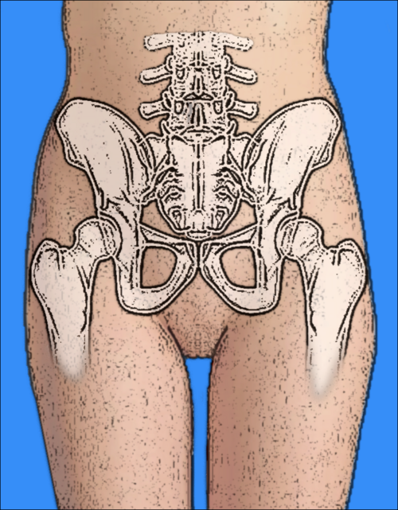
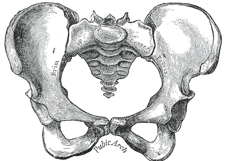

# BACIA OBSTÉTRICA E PELVIMETRIA

Para entender o parto, você precisa entender o trajeto. Imagine que o feto é um passageiro tentando passar por um túnel complexo, cheio de curvas e estreitamentos. Se o passageiro for grande demais ou o túnel for estreito ou torto, o trajeto não se completa. Na obstetrícia, chamamos isso de Desproporção Céfalo-Pélvica (DCP).

Muitos alunos tentam decorar diâmetros isolados, mas o segredo para acertar as questões de residência e, mais importante, para conduzir um parto com segurança, é entender como esses diâmetros se relacionam. Vamos dissecar a bacia obstétrica como se estivéssemos à beira do leito.

## Anatomia da Bacia Obstétrica

*Figura 1 - Desenho anatômico colorido da pelve feminina, identificando os ossos ilíacos, sacro, cóccix e sínfise púbica. Fonte: Heikenwaelder, CC BY-SA 3.0 | Wikimedia Commons*

A bacia, ou pelve, não é um osso único. Ela é um anel osteofibroso formado por quatro ossos: os dois ossos ilíacos (ou inominados), o sacro e o cóccix. Esses ossos são unidos por quatro articulações: a sínfise púbica, as duas sacroilíacas e a sacrococcígea.

Por que isso importa? Porque durante a gestação, sob influência da progesterona e, principalmente, da relaxina, essas articulações ganham uma leve mobilidade. Isso permite que a bacia "alargue" milímetros preciosos durante o trabalho de parto.

### A Divisão da Pelve

Dividimos a pelve em duas partes pela chamada linha terminal (ou linha inominada):

- Pelve Grande (Falsa): Fica acima da linha terminal. Ela não tem importância obstétrica direta no mecanismo de parto, servindo apenas para sustentar o útero gravídico.

- Pelve Pequena (Verdadeira): É o canal do parto propriamente dito. É aqui que o feto precisa manobrar. Ela é delimitada pelo estreito superior, pelo estreito médio e pelo estreito inferior.

## O Estreito Superior

*Figura 2 - Ilustração clássica da pelve feminina em vista superior, evidenciando os estreitos pélvicos e a linha terminal. Fonte: Henry Vandyke Carter, Domínio Público | Wikimedia Commons*

O estreito superior é a "porta de entrada" da bacia. Se o feto não passar por aqui, ele nem começa a descida. Ele é delimitado posteriormente pelo promontório (a borda superior da primeira vértebra sacral), lateralmente pelas linhas terminais e anteriormente pela borda superior da sínfise púbica.

Aqui encontramos os diâmetros que as bancas mais amam cobrar: as conjugatas.

### As Conjugatas do Estreito Superior

Existem três conjugatas anteroposteriores que você precisa diferenciar para não cair em pegadinhas:

- Conjugata Anatômica (Vera Anatômica): Vai do promontório à borda superior da sínfise púbica. Tem cerca de 11 cm. Para a prática, ela serve pouco, pois o feto não passa por cima da sínfise.

- Conjugata Obstétrica (Vera Obstétrica): Esta é a mais importante. É a menor distância entre o promontório e a face interna da sínfise púbica (o "calo" da sínfise). É o ponto mais estreito que a cabeça fetal enfrentará na entrada. Mede, em média, 10,5 cm.

- Conjugata Diagonal (Diagonalis): Vai do promontório à borda inferior da sínfise púbica. Por que ela é famosa? Porque é a única que conseguimos medir diretamente no exame de toque vaginal. Mede cerca de 12 cm.

Dica de ouro do Dr. Will: Como você não consegue medir a conjugata obstétrica com os dedos (já que ela está no meio do osso da sínfise), você mede a diagonal e subtrai 1,5 a 2 cm. Essa é a chamada Relação de Smellie. Se a conjugata diagonal for menor que 11,5 cm, abra o olho: essa bacia pode ser contraída.

### Outros Diâmetros do Estreito Superior

Além do anteroposterior, temos:

- Diâmetro Transverso Máximo: 13 cm.

- Diâmetro Transverso Útil (Mediano): 12,5 cm.

- Diâmetros Oblíquos: Cerca de 12 cm, indo da articulação sacroilíaca de um lado à eminência iliopúbica do outro.

## O Estreito Médio

O estreito médio é a zona de maior estrangulamento da pelve. Ele é delimitado lateralmente pelas espinhas isquiáticas (ou ciáticas).

O diâmetro mais importante aqui é o Diâmetro Bisquiático (ou Interespinhoso), que mede cerca de 10,5 cm. Guarde este número: as espinhas isquiáticas são o ponto de referência para o "plano zero" de De Lee. Quando a maior circunferência da cabeça fetal (o diâmetro biparietal) chega ao nível das espinhas isquiáticas, dizemos que o feto está insinuado (ou encaixado).

Se as espinhas isquiáticas forem muito proeminentes, elas podem impedir a rotação interna da cabeça fetal, causando uma distocia de trajeto.

## O Estreito Inferior

É a "porta de saída". Tem formato de losango e é composto por dois triângulos com base comum no diâmetro bituberoso.

- Triângulo Anterior: Delimitado pela arcada púbica.

- Triângulo Posterior: Delimitado pelos ligamentos sacrotuberosos e pelo ápice do cóccix.

Aqui, o diâmetro anteroposterior é a Conjugata Exitus, que vai da borda inferior da sínfise púbica à ponta do cóccix. Ela mede cerca de 9,5 cm, mas pode chegar a 11 cm ou mais durante o parto graças ao movimento de retropulsão do cóccix.

O diâmetro bituberoso (entre as tuberosidades isquiáticas) mede cerca de 11 cm. Se este diâmetro for muito reduzido, o feto terá dificuldade em sair, mesmo que tenha passado pelos outros estreitos.

| Estreito | Limite Anterior | Limite Posterior | Diâmetro Principal | Valor Médio |
| --- | --- | --- | --- | --- |
| Superior | Borda superior da sínfise | Promontório | Conjugata Obstétrica | 10,5 cm |
| Médio | Face inferior da sínfise | Sacro (S4-S5) | Interespinhoso | 10,5 cm |
| Inferior | Borda inferior da sínfise | Cóccix | Bituberoso | 11,0 cm |

## Tipos de Bacia (Classificação de Caldwell-Moloy)

Esta classificação é onipresente em provas. Ela divide as bacias em quatro tipos puros, baseando-se no formato do estreito superior. Na vida real, a maioria das mulheres tem bacias mistas, mas para a prova, foque nos tipos puros.

### 1. Bacia Ginecoide (50%)

É a bacia feminina típica. O estreito superior é arredondado ou levemente ovalado transversalmente. O ângulo subpúbico é amplo (maior que 90 graus) e as espinhas isquiáticas não são proeminentes.

- Prognóstico: Excelente para o parto vaginal. É a bacia "padrão ouro".

### 2. Bacia Antropoide (25%)

O estreito superior é ovalado, mas no sentido anteroposterior. Ou seja, o diâmetro AP é maior que o transverso. É comum em mulheres altas e em algumas etnias específicas.

- Característica de prova: Favorece a insinuação do feto em variedades de posição persistentes como Occipitoposterior (OP) ou Occipitosacra (OS). Se você vir um partograma com progressão lenta e o feto em OP, pense em bacia antropoide.

### 3. Bacia Androide (20%)

É a bacia com características masculinas. O estreito superior tem formato de "coração de carta de baralho". O estreito anterior é estreito (triangular), o sacro é inclinado para a frente e as espinhas isquiáticas são proeminentes.

- Prognóstico: Sombrio. É a bacia que mais causa distocias e necessidade de cesariana ou fórceps de rotação. O feto tem dificuldade em rotar e descer.

### 4. Bacia Platipeloide (5%)

É a bacia "achatada". O diâmetro transverso é muito maior que o anteroposterior. O estreito superior é um oval transverso achatado.

- Característica de prova: O feto costuma insinuar-se em variedade transversa (ex: Occipitodireita Transversa - ODT). É o tipo mais raro.

| Tipo de Bacia | Formato do Estreito Superior | Prognóstico | Característica Marcante |
| --- | --- | --- | --- |
| Ginecoide | Arredondado | Bom | Mais comum (50%) |
| Antropoide | Oval (AP > Transverso) | Favorável | Favorece posições OP/OS |
| Androide | Triangular (Coração) | Ruim | Espinhas proeminentes, bacia "masculina" |
| Platipeloide | Oval (Transverso > AP) | Reservado | Insinuação em transversa |

## O Passageiro: A Cabeça Fetal

Não adianta conhecer o túnel se não conhecemos o passageiro. A cabeça fetal é a parte mais volumosa e menos compressível do feto. Ela é composta pelos ossos da face e da base do crânio (fixos) e pelos ossos da calota craniana (móveis: dois frontais, dois parietais e um occipital).

Essa mobilidade dos ossos da calota permite o cavalgamento (um osso desliza sobre o outro), reduzindo os diâmetros da cabeça para passar pela bacia. Isso se chama moldagem cefálica.

### Fontanelas e Suturas

As suturas (espaços entre os ossos) e as fontanelas (encontro das suturas) são nossos pontos de referência no toque vaginal para identificar a posição do feto.

- Fontanela Posterior (Lambda): Pequena, triangular. É o ponto de referência da apresentação cefálica fletida. Se você toca o lambda, o feto está bem posicionado.

- Fontanela Anterior (Bregma): Grande, em formato de losango (romboide). Se você toca o bregma com facilidade, o feto está em algum grau de deflexão (apresentação de bregma).

### Diâmetros Fetais

Aqui está a pegadinha clássica: qual o maior diâmetro da cabeça fetal?

- Diâmetro Occipitomentoniano: 13,5 cm. É o maior de todos. Se o feto tentar passar com esse diâmetro (deflexão de 2º grau ou apresentação de fronte), ele não passa na bacia ginecoide normal. É indicação de cesariana.

E o menor?

- Diâmetro Suboccipitobregmático: 9,5 cm. É o diâmetro que se apresenta quando o feto está em flexão generalizada (queixo no peito). É o diâmetro ideal para o parto.

Outros diâmetros importantes:

- Biparietal (DBP): 9,5 cm. É o diâmetro transverso. Quando ele passa pelo estreito superior, dizemos que houve insinuação.

- Occipitofrontal: 12 cm. Apresenta-se na deflexão de 1º grau (apresentação de bregma).

## Pelvimetria Clínica: O Exame de Toque

A pelvimetria radiológica caiu em desuso devido à radiação e baixa acurácia preditiva. Hoje, usamos a pelvimetria clínica (o toque vaginal) e a avaliação funcional (observar o trabalho de parto).

Ao realizar o toque vaginal para avaliar a bacia, você deve seguir um roteiro mental:

- Conjugata Diagonal: Tente tocar o promontório sacral com o dedo médio. Em uma bacia normal, você NÃO deve conseguir tocar o promontório facilmente. Se você tocar e conseguir medir a distância até a borda inferior da sínfise, e essa medida for menor que 11,5 cm, a bacia é suspeita.

- Paredes Laterais: São paralelas, convergentes ou divergentes? Paredes convergentes sugerem bacia androide.

- Espinhas Isquiáticas: São rombas (normais) ou proeminentes (pontudas)?

- Sacro: É bem escavado (ginecoide) ou plano/curvado para a frente (androide)?

- Ângulo Subpúbico: Coloque dois dedos na arcada púbica. Se o ângulo for menor que 90 graus (cabe apenas um dedo ou os dedos ficam apertados), sugere bacia androide.

No MedEvo, sempre reforçamos: a pelvimetria clínica é subjetiva. O melhor "pelvímetro" é a própria cabeça fetal durante um trabalho de parto bem conduzido.

## Planos de Descida (De Lee vs. Hodge)

Para saber se o feto está descendo, precisamos de marcos anatômicos.

### Planos de De Lee

É o sistema mais usado no Brasil. O referencial zero (estação 0) é o nível das espinhas isquiáticas.

- Estações Negativas (-1, -2, -3...): A apresentação está acima das espinhas.

- Estação 0: O ponto mais baixo da apresentação atingiu as espinhas. Importante: isso geralmente significa que o maior diâmetro (biparietal) já passou pelo estreito superior (insinuação).

- Estações Positivas (+1, +2, +3...): A apresentação está abaixo das espinhas. No +4 ou +5, o parto é iminente, o feto está no assoalho pélvico.

### Planos de Hodge

Menos usado em provas modernas, mas ainda aparece.

- I: Borda superior da sínfise ao promontório (Estreito Superior).

- II: Borda inferior da sínfise à segunda vértebra sacral.

- III: Nível das espinhas isquiáticas (Equivale ao De Lee 0).

- IV: Nível da ponta do cóccix.

## Mecanismo de Parto: A Dança do Feto

O feto não desce como um pistão reto. Ele precisa realizar movimentos para se adaptar aos maiores diâmetros de cada plano da bacia.

- Insinuação: A passagem do diâmetro biparietal pelo estreito superior. O feto costuma entrar em posição transversa ou oblíqua.

- Descida: Ocorre durante todo o processo, impulsionada pelas contrações e pelo puxo.

- Flexão: Ao encontrar resistência no assoalho pélvico, o feto flete a cabeça para substituir o diâmetro occipitofrontal (12 cm) pelo suboccipitobregmático (9,5 cm).

- Rotação Interna: O feto gira a cabeça (geralmente para ficar com o occipital voltado para a sínfise púbica - variedade Occipitopúbica / OP). Por que? Porque o maior diâmetro do estreito inferior é o anteroposterior.

- Extensão (ou Desprendimento): A cabeça faz um movimento de "dobradiça" sob a sínfise púbica para sair.

- Rotação Externa (ou Restituição): A cabeça gira para fora para alinhar-se com os ombros, que agora estão entrando no estreito superior.

### Assinclitismo: O "Ginga" da Cabeça

Raramente a cabeça desce perfeitamente alinhada com a sutura sagital no meio do caminho entre o pube e o sacro (sinclitismo). Geralmente, há uma inclinação lateral:

- Assinclitismo Anterior (Obliqüidade de Naegele): A sutura sagital está mais próxima do sacro. O osso parietal anterior é o que desce primeiro.

- Assinclitismo Posterior (Obliqüidade de Litzmann): A sutura sagital está mais próxima do pube. O osso parietal posterior desce primeiro.

Pequenos graus de assinclitismo são fisiológicos e ajudam a cabeça a passar. Graus acentuados podem indicar DCP.

## Desproporção Céfalo-Pélvica (DCP)

A DCP pode ser absoluta (bacia muito pequena ou feto muito grande/malformado) ou relativa (feto em posição desfavorável).

Sinais de alerta no exame físico:

- Bossa serossanguínea: Edema no couro cabeludo fetal devido à pressão contra a bacia.

- Acavalgamento ósseo: Os ossos do crânio se sobrepõem de forma acentuada (sobreposição que não reduz com a pressão).

- Sinal de Bandl-Frommel: Um sinal de iminência de ruptura uterina. O útero fica com um anel visível separando o corpo do segmento inferior (Bandl) e os ligamentos redondos ficam tensos (Frommel). É uma emergência!

Se a paciente está em dilatação total, com contrações efetivas, e a apresentação não desce do plano zero de De Lee após 1-2 horas, suspeite fortemente de DCP.

## Situações Especiais e Dicas Práticas

### Posições Maternas

A posição de litotomia (deitada de costas) é a pior para o diâmetro da bacia. Posições verticalizadas ou de cócoras podem aumentar o diâmetro bituberoso e a mobilidade do cóccix. A Manobra de McRoberts (hiperflexão das coxas), usada na distocia de ombros, funciona justamente porque retifica o sacro e aumenta o espaço disponível no estreito superior.

### Cerclagem Cervical

Embora seja um tema de incompetência istmo-cervical, as bancas costumam misturar com anatomia pélvica. Lembre-se: a cerclagem (técnica de McDonald ou Shirodkar) é idealmente realizada entre 14 e 16 semanas de gestação.

### Episiotomia e Lacerações

O conhecimento da anatomia do períneo é vital. A episiotomia mediolateral direita é a preferida por evitar o esfíncter anal. Ao suturar lacerações, lembre-se dos planos: mucosa vaginal, submucosa, musculatura (bulbocavernoso, transverso superficial do períneo) e pele.

## Pontos-Chave para Prova

- Conjugata Obstétrica: É o menor diâmetro do estreito superior (10,5 cm). Calculada como Conjugata Diagonal menos 1,5 a 2 cm.

- Estreito Médio: O ponto mais estreito é o diâmetro interespinhoso (10,5 cm). Define o plano 0 de De Lee.

- Bacia Ginecoide: Mais comum (50%), melhor prognóstico.

- Bacia Antropoide: Favorece variedades de posição Occipitoposterior (OP) e Occipitosacra (OS).

- Bacia Androide: Formato de coração, pior prognóstico, comum em distocias de rotação.

- Bacia Platipeloide: Achatada, favorece insinuação em transversa.

- Maior Diâmetro Fetal: Occipitomentoniano (13,5 cm). Se estiver presente, o parto vaginal é impossível.

- Menor Diâmetro Fetal: Suboccipitobregmático (9,5 cm), presente na flexão total.

- Insinuação: Quando o diâmetro biparietal (9,5 cm) ultrapassa o estreito superior. Clinicamente, o ponto mais baixo da apresentação atinge o plano 0 de De Lee.

- Assinclitismo Anterior (Naegele): Sutura sagital perto do sacro.

- Assinclitismo Posterior (Litzmann): Sutura sagital perto do pube.

- Manobra de McRoberts: Hiperflexão das pernas que aumenta o diâmetro do estreito superior e facilita a saída do ombro anterior.

- Toque Vaginal: Se você NÃO toca o promontório, a bacia provavelmente é adequada (Conjugata Diagonal > 11,5 cm).

- Fontanela Lambda: Referência para apresentação cefálica fletida (triangular).

- Fontanela Bregma: Referência para deflexão de 1º grau (losango).

- ❌ Erro clássico: Achar que a Conjugata Anatômica é a mais importante. Não é! A Obstétrica é a que manda no parto.

- ❌ Erro clássico: Achar que De Lee +1 é mais alto que De Lee -1. Lembre-se: positivo é para baixo (em direção à saída), negativo é para cima.

- ❌ Erro clássico: Tentar forçar parto vaginal em apresentação de fronte (deflexão de 2º grau). O diâmetro de 13,5 cm não cabe na bacia. É cesariana.

 Cópia offline para consulta pessoal.
 Fonte original:
 [https://www.medevo.com.br/material-apoio/ler/56e99b0c-838c-441f-b5b0-5d989649e349](https://www.medevo.com.br/material-apoio/ler/56e99b0c-838c-441f-b5b0-5d989649e349)
