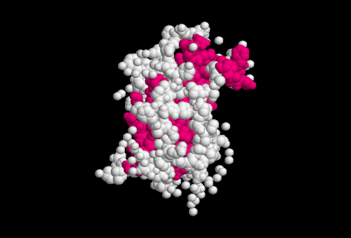

# BAIXA ESTATURA

Para entender baixa estatura, você precisa tirar uma ideia da cabeça: a de que toda criança baixa está doente. Na verdade, a imensa maioria das crianças que chegam ao consultório com essa queixa são saudáveis. O seu papel, como médico e candidato à residência, é saber separar o "joio do trigo". Ou seja, identificar quem tem uma variante normal do crescimento e quem tem uma patologia escondida.

Nas provas de residência, o examinador não quer apenas que você saiba o valor do Z-escore. Ele quer que você saiba interpretar a velocidade de crescimento e a idade óssea. Se você dominar esses dois pilares, você resolve 90% das questões.

## Definição e Critérios Diagnósticos

*Figura 1 - Curva de crescimento de uma menina comparada aos percentis das curvas OMS 2006, demonstrando a avaliação longitudinal do crescimento. Fonte: Michielvd, CC BY-SA 3.0 | Wikimedia Commons*

A definição clássica de baixa estatura é estatística. Consideramos baixa estatura quando a criança apresenta uma altura abaixo do percentil 3 (P3) ou um escore Z abaixo de -2 para a idade e o sexo, utilizando as curvas da Organização Mundial da Saúde (OMS).

Mas cuidado: um único ponto na curva é apenas uma fotografia. O que realmente importa na pediatria é o filme. Se uma criança está no escore Z -1,5 (tecnicamente normal), mas estava no Z +1,0 há um ano, ela tem um problema grave de crescimento. Por isso, a velocidade de crescimento (VC) é o parâmetro mais sensível para avaliar a saúde de uma criança.

### Velocidade de Crescimento (VC)

A VC é calculada medindo o quanto a criança cresceu em um intervalo de tempo, geralmente um ano, e transformando isso em cm/ano.

- Lactentes (0 a 1 ano): Crescem cerca de 25 cm/ano.

- Pré-escolares (1 a 3 anos): Crescem cerca de 10 a 12 cm/ano.

- Escolares (3 anos até a puberdade): Crescem cerca de 5 a 7 cm/ano.

Se a velocidade de crescimento estiver abaixo do percentil 25 para a idade, ligue o sinal de alerta. Uma criança com VC baixa precisa de investigação, mesmo que sua altura atual ainda esteja dentro da normalidade estatística. Como costumamos dizer no MedEvo, a desaceleração do crescimento é, muitas vezes, o primeiro sinal de uma doença sistêmica ou endócrina.

## Avaliação Inicial: O Alvo Genético

Antes de pedir qualquer exame, você precisa saber onde essa criança "deveria" estar. O potencial de crescimento é determinado pela genética dos pais. Para isso, usamos a fórmula da Estatura-Alvo (ou Alvo Genético).

As bancas adoram cobrar esse cálculo. Memorize:

- **Meninos:** (Altura do Pai + Altura da Mãe + 13) / 2

- **Meninas:** (Altura do Pai + Altura da Mãe - 13) / 2

O resultado tem uma margem de erro de 5 cm para mais ou para menos (alguns autores aceitam até 8,5 cm, mas para prova, foque no intervalo de confiança ao redor da média). Se a criança está crescendo dentro do canal de crescimento compatível com o alvo genético e tem uma VC normal, a chance de doença é mínima.

## Idade Óssea: A Peça Chave do Quebra-Cabeça

A idade óssea (IO) é avaliada por um raio-X de mãos e punho esquerdo (método de Greulich-Pyle). Ela nos diz a "idade biológica" do esqueleto.

Por que isso é importante? Porque o crescimento só acontece enquanto as epífises ósseas estão abertas. Se a IO está atrasada em relação à idade cronológica (IC), a criança tem "estoque" de crescimento para o futuro. Se a IO é igual à IC, o que você vê é o que você tem.

Aqui está o segredo para diferenciar as duas principais causas de baixa estatura não patológica:

### Baixa Estatura Familiar (BEF)

Neste caso, a criança é baixa porque a família é baixa.

- **Idade Óssea:** Compatível com a idade cronológica (IO = IC).

- **Velocidade de Crescimento:** Normal.

- **Estatura-Alvo:** Baixa.

- **Puberdade:** Ocorre na idade normal.

- **Prognóstico:** A altura final será baixa, mas condizente com a família.

### Atraso Constitucional do Crescimento e Puberdade (ACCP)

Aqui, a criança é um "tardio". Ela vai crescer depois dos amigos.

- **Idade Óssea:** Atrasada em relação à idade cronológica (IO < IC).

- **Velocidade de Crescimento:** Normal (embora no limite inferior).

- **Estatura-Alvo:** Normal (os pais costumam ter estatura normal, mas com história de terem "esticado" tarde ou a mãe ter tido a menarca tardia).

- **Puberdade:** Atrasada.

- **Prognóstico:** Excelente. Como a IO está atrasada, a criança crescerá por mais tempo e atingirá uma altura final normal para o alvo genético.

| Característica | Baixa Estatura Familiar (BEF) | Atraso Constitucional (ACCP) |
| --- | --- | --- |
| História Familiar | Pais baixos | Pais com puberdade tardia |
| Velocidade de Crescimento | Normal | Normal |
| Idade Óssea | IO = Idade Cronológica | IO < Idade Cronológica |
| Início da Puberdade | Normal | Atrasado |
| Estatura Final | Baixa (dentro do alvo) | Normal (dentro do alvo) |

## Causas Patológicas: Quando se Preocupar

Se a velocidade de crescimento está baixa, você deve obrigatoriamente investigar causas patológicas. Podemos dividi-las em dois grandes grupos: as causas desproporcionais (displasias esqueléticas e raquitismo) e as causas proporcionais.

### Doenças Sistêmicas (Causas Não Endócrinas)

Antes de pensar em falta de hormônio, pense em doenças crônicas. O corpo prioriza a sobrevivência sobre o crescimento.

- **Doença Celíaca:** É uma das causas mais comuns de baixa estatura isolada. A criança pode não ter diarreia ou dor abdominal. Se houver baixa estatura com baixo peso (Z-escore de peso menor que o de altura), investigue sempre.

- **Doença Renal Crônica:** A acidose tubular renal e a insuficiência renal alteram o eixo do GH e o metabolismo ósseo.

- **Cardiopatias e Pneumopatias:** Causam hipóxia tecidual e alto gasto energético.

- **Desnutrição e Deficiências Vitamínicas:** A deficiência de Vitamina A, por exemplo, pode se manifestar com xeroftalmia, manchas de Bitot (pequenas placas esbranquiçadas na conjuntiva) e cegueira noturna, além de comprometer o crescimento.

### Causas Endócrinas

*Figura 2 - Representação tridimensional da estrutura molecular do Hormônio de Crescimento humano (Somatotropina), cuja deficiência é causa endócrina importante de baixa estatura. Fonte: Domínio Público | Wikimedia Commons*

As causas endócrinas costumam ter uma característica marcante: a criança é baixa, mas tem peso normal ou está acima do peso (relação peso/estatura elevada).

- **Hipotireoidismo:** É a causa endócrina mais comum. O hormônio tireoidiano é essencial para a maturação óssea e para a secreção de GH. No hipotireoidismo, a IO é muito atrasada e a VC é muito baixa. Lembre-se da pérola clínica: em crianças com Síndrome de Down, o hipotireoidismo adquirido é muito frequente e deve ser rastreado se a VC cair.

- **Deficiência de Hormônio de Crescimento (DGH):** A criança tem uma aparência "boneca de porcelana" (face imatura, fronte proeminente, gordura troncular). A VC é nitidamente baixa. O diagnóstico exige testes provocativos, pois a secreção de GH é pulsátil (um GH basal normal não exclui o diagnóstico).

- **Excesso de Glicocorticoide (Cushing):** Seja por produção endógena ou uso de corticoides (inclusive inalatórios em doses altas por tempo prolongado), o excesso de cortisol "freia" a placa de crescimento.

### Causas Genéticas Específicas

**Síndrome de Turner:** Se você vir uma questão sobre uma menina com baixa estatura, mesmo que não haja pescoço alado ou tórax em escudo, você deve pensar em Turner. A baixa estatura pode ser o único sinal. O cariótipo é obrigatório em toda menina com baixa estatura sem causa explicada.

## O Exame Físico Detalhado

O exame físico não serve apenas para medir a altura. Você deve procurar pistas diagnósticas:

- **Proporcionalidade:** Meça a envergadura (distância entre os dedos médios com braços abertos). No adulto, a envergadura é igual à altura. Se houver grande desproporção, pense em displasias ósseas.

- **Estadiamento de Tanner:** Fundamental para avaliar se a criança está na puberdade. Se um menino de 14 anos tem testículos pré-púberes (volume < 4 ml), ele tem atraso puberal, o que corrobora o diagnóstico de ACCP.

- **Dismorfismos:** Procure por estigmas de Turner (linfedema de mãos e pés ao nascimento, implantação baixa de orelhas) ou Síndrome de Down.

- **Palpação da Tireoide:** Bócio ou nódulos podem indicar doença tireoidiana.

- **Exame Abdominal:** Procure por distensão ou massas (doença inflamatória intestinal ou celíaca).

Um detalhe prático que o Dr. Will sempre enfatiza: em crianças obesas que se queixam de "pênis pequeno", o primeiro passo é comprimir a gordura suprapúbica para medir o pênis real. Muitas vezes é apenas um pênis embutido pela gordura, e não um micropênis verdadeiro (que sugeriria deficiência de GH ou hipogonadismo).

## Roteiro de Investigação Laboratorial

Não saia pedindo GH para todo mundo. O GH basal não serve para nada na prática clínica porque ele é secretado em picos. Se você colher no vale, virá baixo mesmo em pessoas normais.

A investigação deve ser em etapas:

### 1ª Linha (Triagem Geral)

- Hemograma e VHS/PCR (doenças inflamatórias/anemias).

- Função renal (Ureia/Creatinina) e eletrólitos (Gasometria para Acidose Tubular Renal).

- Triagem para Doença Celíaca (Anticorpo Antitransglutaminase IgA + IgA total).

- TSH e T4 Livre.

- Idade Óssea.

- Cariótipo (em meninas).

### 2ª Linha (Eixo GH-IGF1)

Se a VC for baixa e a triagem inicial for negativa, investigamos o eixo do crescimento:

- **IGF-1 e IGFBP-3:** São produzidos pelo fígado sob estímulo do GH. Têm meia-vida longa e refletem a produção média de GH.

- **Testes de Estímulo do GH:** Se o IGF-1 estiver baixo, realizamos testes provocativos (Clonidina, Insulina, Glucagon ou Arginina). Como o GH é pulsátil, precisamos "forçar" a hipófise a secretar. O diagnóstico de deficiência de GH geralmente exige falha (pico < 5 ou 10 ng/mL, dependendo do protocolo) em dois testes diferentes.

## Diagnóstico Diferencial: A Armadilha do Peso

Um erro clássico em provas é confundir a criança com baixa estatura por desnutrição com a criança com baixa estatura por causa endócrina.

- **Baixa Estatura + Baixo Peso:** Pense em causas sistêmicas (Doença Celíaca, Crohn, Desnutrição, Cardiopatias). O peso "cai" antes da altura.

- **Baixa Estatura + Peso Normal ou Elevado:** Pense em causas endócrinas (Hipotireoidismo, Deficiência de GH, Cushing). A altura "cai" enquanto o peso se mantém ou sobe.

## Tratamento Farmacológico com GH

O uso de Hormônio de Crescimento Recombinante Humano (rhGH) não é para todos. Existem indicações precisas aprovadas pelo FDA e pela Sociedade Brasileira de Pediatria (SBP):

- Deficiência de GH (GHD).

- Síndrome de Turner.

- Criança Pequena para a Idade Gestacional (PIG) que não apresentou crescimento de recuperação (catch-up) até os 2 a 4 anos.

- Insuficiência Renal Crônica (pré-transplante).

- Síndrome de Prader-Willi.

- Deficiência do gene SHOX.

- Baixa Estatura Idiopática (quando o escore Z é extremamente baixo, < -2,25, mas não há causa definida).

A dose varia conforme a indicação, mas geralmente gira em torno de 0,03 a 0,05 mg/kg/dia, via subcutânea, aplicada à noite (para mimetizar o pico fisiológico noturno).

### Efeitos Colaterais do GH

Embora seguro, o GH pode causar:

- Hipertensão intracraniana benigna (pseudotumor cerebral).

- Epifisiólise da cabeça do fêmur (dor no quadril ou joelho em adolescentes em uso de GH deve ser investigada).

- Edema e resistência à insulina (monitorar glicemia).

## Situações Especiais e Pegadinhas de Prova

### O Paciente HIV+

Questões de pediatria geral costumam misturar temas. Lembre-se que crianças e adolescentes HIV+ são imunocomprometidos. A vacina do HPV para esse grupo é feita em um esquema de 3 doses (0, 2 e 6 meses), independentemente da idade, até os 45 anos. Isso cai muito!

### Raquitismo

Se a questão mostrar uma criança com baixa estatura, pernas arqueadas (genu varo), rosário raquítico e aumento da fosfatase alcalina, o diagnóstico é Raquitismo. A causa mais comum é a deficiência de Vitamina D. No laboratório, você verá Cálcio normal ou baixo, Fósforo baixo e Fosfatase Alcalina sempre elevada.

### Síndrome Cerebral Perdedora de Sal (SCPS)

Em contextos de pós-operatório de neurocirurgia (como a retirada de um craniofaringioma, que causa deficiência de GH), pode ocorrer hiponatremia. Se o paciente tiver hipovolemia e natriurese (perda de sódio na urina), o diagnóstico é SCPS, e não SIADH (onde o paciente está euvolêmico).

## Tabela Comparativa: Padrões de Crescimento

| Padrão | Velocidade de Crescimento | Idade Óssea | Estatura Final |
| --- | --- | --- | --- |
| **Familiar (BEF)** | Normal | IO = IC | Baixa (conforme pais) |
| **Constitucional (ACCP)** | Normal | IO < IC | Normal (conforme pais) |
| **Deficiência de GH** | Baixa | IO < IC | Muito baixa (se não tratar) |
| **Hipotireoidismo** | Muito Baixa | IO << IC | Comprometida |
| **Doença Celíaca** | Baixa | IO < IC | Comprometida (se não tratar) |

## Pontos-Chave para Prova

- **Critério de Baixa Estatura:** Escore Z < -2 ou Percentil < 3.

- **O parâmetro mais importante:** Velocidade de Crescimento (VC). Se a VC for normal, a causa provavelmente é BEF ou ACCP. Se a VC for baixa, investigue patologia.

- **Cálculo do Alvo Genético:** Meninos (Pai + Mãe + 13)/2; Meninas (Pai + Mãe - 13)/2.

- **Idade Óssea no ACCP:** Está sempre atrasada. É o "atraso" que permite o crescimento futuro.

- **Idade Óssea na BEF:** Está normal (compatível com a idade cronológica).

- **Menina com baixa estatura:** Sempre solicitar Cariótipo para descartar Síndrome de Turner, mesmo sem outros sinais.

- **Causa Endócrina vs. Sistêmica:** Endócrina ganha peso (ou mantém); Sistêmica perde peso (ou não ganha).

- **Hipotireoidismo:** É a causa endócrina mais comum de baixa estatura. Causa grande atraso na idade óssea.

- **Doença Celíaca:** Pode ser assintomática do ponto de vista gastrointestinal (baixa estatura isolada).

- **Teste de GH:** O GH basal não tem valor diagnóstico. São necessários testes de estímulo (Clonidina, Insulina).

- **Vitamina A:** Deficiência causa manchas de Bitot e xeroftalmia.

- **Corticoides:** O uso crônico, mesmo inalatório para asma, pode reduzir a velocidade de crescimento em crianças sensíveis.

- **Pérola de Ouro:** Se a velocidade de crescimento caiu, o primeiro exame a ser olhado (após a curva) é a Idade Óssea.

- **O que NÃO fazer:** Não prescrever GH sem diagnóstico de uma das indicações precisas. Não usar GH para "ganhar uns centímetros" em crianças com BEF ou ACCP.

- **Erro clássico:** Achar que toda criança baixa precisa de GH. Na verdade, a maioria precisa apenas de acompanhamento ou tratamento da doença de base (como dieta sem glúten na celíaca ou levotiroxina no hipotireoidismo). 💡

 Cópia offline para consulta pessoal.
 Fonte original:
 [https://www.medevo.com.br/material-apoio/ler/00f35b5b-d2f4-48be-ba7c-9df26aa24329](https://www.medevo.com.br/material-apoio/ler/00f35b5b-d2f4-48be-ba7c-9df26aa24329)
