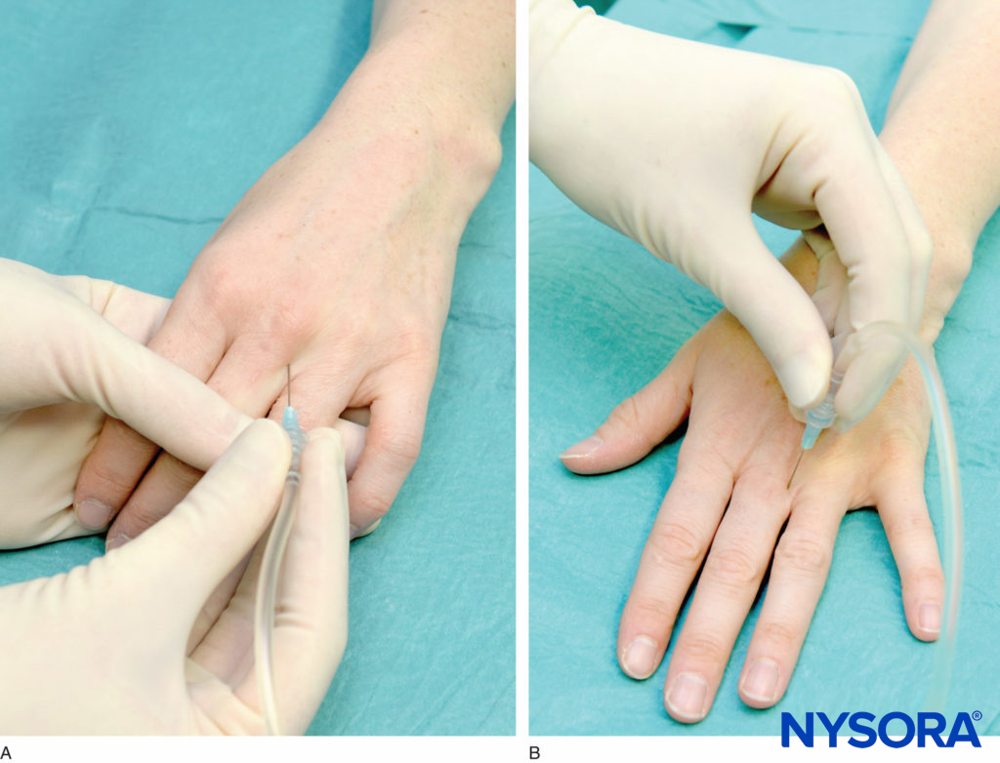
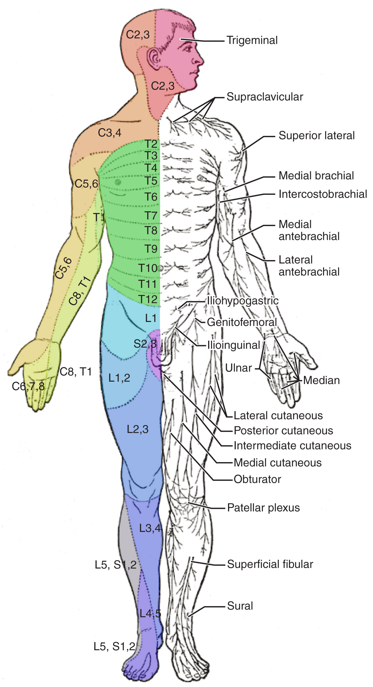
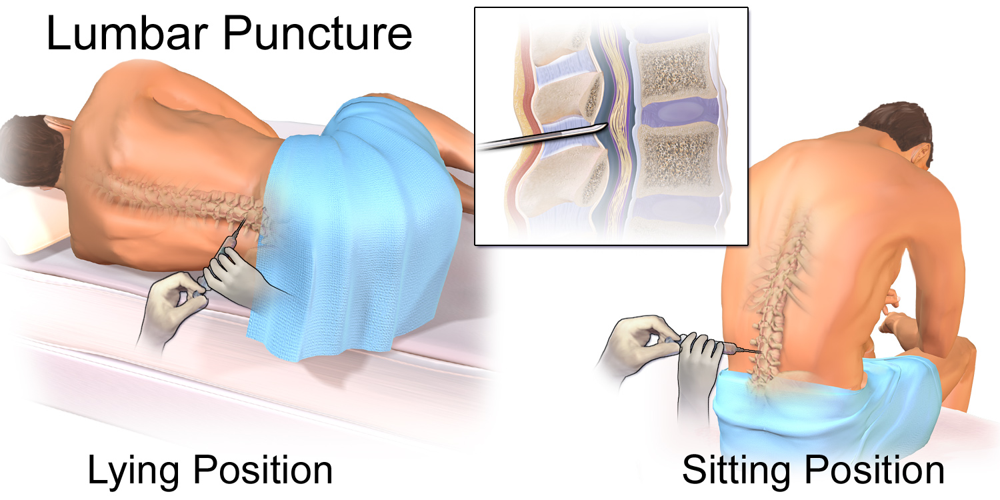
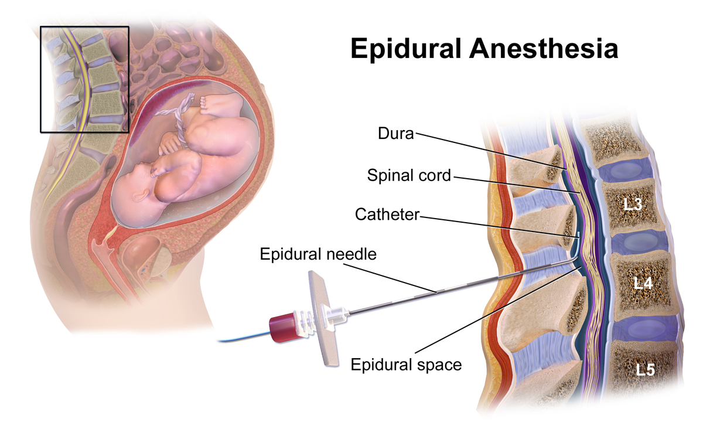
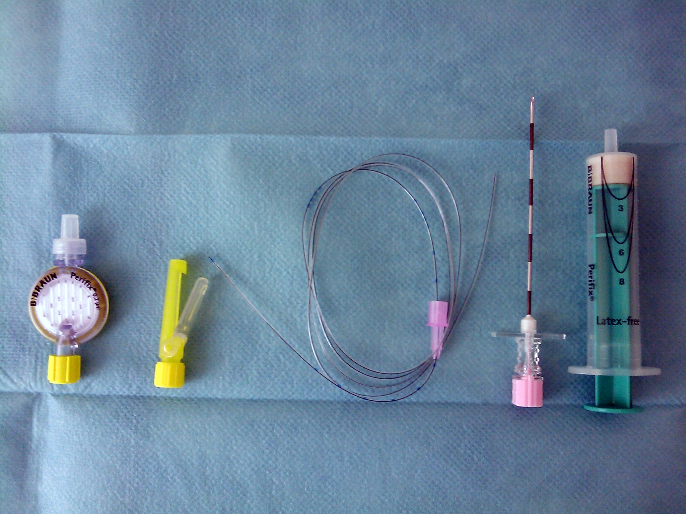
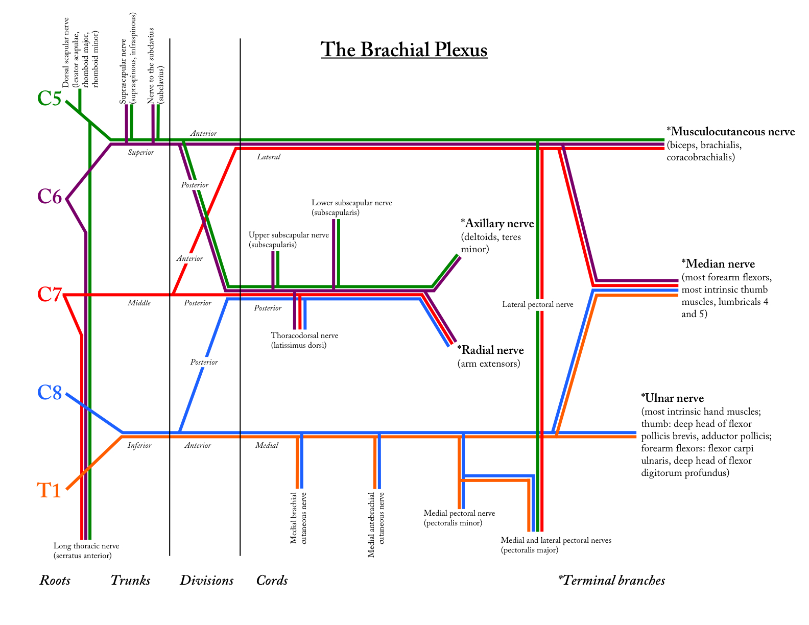

# BLOQUEIOS ANESTÉSICOS REGIONAIS

Para O estudo dos bloqueios regionais exige integração entre anatomia aplicada e fisiologia da condução nervosa. Em vez de decorar listas de nervos de forma isolada, é necessário reconhecer trajetos, planos anatômicos, camadas atravessadas pela agulha e repercussões fisiológicas da interrupção nervosa no paciente cirúrgico.

As diretrizes mais recentes da Sociedade Brasileira de Anestesiologia (SBA, atualizadas em 2024) reforçam a segurança em anestesia regional, com foco especial no manejo de pacientes em uso de novos anticoagulantes orais e na prevenção da toxicidade sistêmica. Essas atualizações são relevantes para a prática segura e para a interpretação de cenários clínicos em provas.

Nesta aula, revisaremos os pilares da anestesia regional: a farmacologia profunda dos anestésicos locais, a complexidade do plexo braquial, os bloqueios neuroaxiais (raquianestesia e peridural), os bloqueios periféricos essenciais e o manejo de complicações.

## 1. Fisiologia da Condução Nervosa e Mecanismo de Ação

Antes de falarmos das drogas, precisamos entender o alvo. O nervo periférico transmite impulsos elétricos através de potenciais de ação, gerados pela abertura rápida de canais iônicos.

Os anestésicos locais atuam bloqueando a condução nervosa de forma reversível. O mecanismo de ação dos anestésicos locais consiste na ligação aos **canais de sódio voltagem-dependentes** na membrana neuronal. Eles se ligam à porção intracelular do canal. Para que isso aconteça, a molécula do anestésico precisa primeiro atravessar a bicamada lipídica da membrana do nervo, entrar no citoplasma neuronal e, então, bloquear o canal de sódio por dentro. Esse bloqueio impede o influxo de sódio, evitando a despolarização da membrana e a propagação do potencial de ação.

A sequência de bloqueio das fibras nervosas obedece a um padrão previsível, baseado no diâmetro da fibra e na presença de mielina. As fibras mais finas e mielinizadas são bloqueadas primeiro. A sequência clássica de bloqueio é:

- **Fibras B (autonômicas):** Responsáveis pelo tônus simpático.

- **Fibras C e A-delta:** Responsáveis pela dor e temperatura.

- **Fibras A-gama:** Responsáveis pelo tônus muscular e propriocepção.

- **Fibras A-alfa:** Responsáveis pela motricidade profunda.

Essa sequência explica por que, durante a instalação de um bloqueio neuroaxial, o paciente primeiro apresenta vasodilatação (bloqueio simpático), depois para de sentir dor e alterações de temperatura, e só por último perde a capacidade de mover as pernas.

## 2. Farmacologia dos Anestésicos Locais (AL)

A estrutura química dos anestésicos locais dita o seu comportamento clínico. Quase todos os AL seguem a mesma arquitetura básica: um Polo Lipofílico (anel aromático) + uma Cadeia Intermediária + um Polo Hidrofílico (amina terciária).

A cadeia intermediária define a classe do fármaco e o seu local de metabolização:

- **Amino-amidas (Lidocaína, Bupivacaína, Ropivacaína):** Possuem a letra "i" antes do sufixo "-caína". São metabolizadas no fígado pelo sistema citocromo P450. São as drogas de escolha na prática atual devido à sua estabilidade e menor potencial alergênico.

- **Amino-ésteres (Procaína, Tetracaína, Cocaína):** Possuem apenas um "i" no nome (o do próprio sufixo). São metabolizadas no plasma pela enzima pseudocolinesterase. Têm maior potencial alérgico devido à formação do metabólito PABA (ácido para-aminobenzoico).

### Propriedades Físico-Químicas e Prática Clínica

Três propriedades químicas definem como o anestésico vai agir no paciente:

- **Lipossolubilidade:** Determina a **potência**. Quanto mais lipossolúvel, mais facilmente a droga penetra na membrana neuronal e maior a sua potência. A bupivacaína é muito mais lipossolúvel que a lidocaína, logo, é mais potente.

- **Ligação Proteica:** Determina a **duração do bloqueio anestésico**. Fármacos que se ligam fortemente às proteínas (como a alfa-1-glicoproteína ácida) permanecem mais tempo no receptor. A farmacocinética da bupivacaína mostra uma alta taxa de ligação proteica, o que explica sua longa duração.

- **pKa (Constante de Dissociação):** Determina o **início de ação (latência)**. Os AL são bases fracas. Quanto mais próximo o pKa do fármaco for do pH fisiológico (7,4), maior será a fração não ionizada da droga. Apenas a fração não ionizada (lipofílica) consegue atravessar a membrana do nervo.

### O Fator pH e a Anestesia em Tecido Inflamado

Aqui reside uma das questões mais clássicas de provas cirúrgicas. Em tecidos saudáveis (pH ~7,4), uma fração adequada da droga está na forma não ionizada, garantindo um rápido início de ação.

Em tecidos inflamados ou infectados, o ambiente sofre acidose tecidual (o pH cai para cerca de 6,0 ou menos). Nesse ambiente ácido, a molécula do anestésico local (que é uma base) recebe prótons (H+) e se transforma majoritariamente na sua forma **ionizada**. A forma ionizada é hidrossolúvel e não consegue atravessar a bainha lipídica do nervo. O resultado clínico é a falha completa da anestesia.

**Exemplo Clínico:** Um paciente chega ao pronto-socorro com um abscesso subcutâneo com flutuação evidente. A anestesia local infiltrativa com lidocaína diretamente no pus ou na pele inflamada sobrejacente tende a falhar e pode causar dor intensa durante a incisão. A conduta correta para garantir uma anestesia eficaz em tecido inflamado é realizar a drenagem de abscesso sob **bloqueio de campo**. O bloqueio de campo consiste em infiltrar o anestésico ao redor do campo operatório, em tecido sadio, formando um losango ao redor da lesão, ou realizar um bloqueio regional proximal ao nervo que inerva a área.

### Adjuvantes: O Papel da Epinefrina

A adição de vasoconstritores, primariamente a epinefrina (adrenalina), tem objetivos claros na anestesia locorregional:

- **Reduzir a absorção sistêmica:** A vasoconstrição local mantém o fármaco no sítio de injeção, diminuindo o pico plasmático e o risco de toxicidade.

- **Aumentar a duração do bloqueio anestésico:** O fármaco demora mais para ser "lavado" pela corrente sanguínea.

- **Servir como marcador de injeção intravascular:** Durante a realização de bloqueios anestésicos regionais, injeta-se uma dose teste. Se a frequência cardíaca subir subitamente (aumento > 10-15 bpm), a agulha está dentro de um vaso sanguíneo, e a injeção deve ser interrompida imediatamente.

**Atenção aos Erros Comuns:** Evite o uso de vasoconstritores em extremidades com circulação terminal em pacientes com vasculopatia prévia. Para o manejo da dor em procedimentos cirúrgicos menores, como a correção de uma onicocriptose (unha encravada), a cantoplastia digital exige a realização de um bloqueio digital com anestésico SEM vasoconstritor. A lidocaína sem vasoconstritor (ex: lidocaína 2%) é a escolha clássica para evitar isquemia e necrose da ponta do dedo.

*Figura 1: Bloqueio digital — injeção de anestésico local na base do dedo, bloqueando os nervos digitais. Sempre SEM vasoconstritor.*

### Efeito Bactericida dos Anestésicos Locais

Um detalhe frequentemente esquecido, mas cobrado em provas de cirurgia geral, é o efeito antimicrobiano de alguns anestésicos. A bupivacaína possui um leve efeito bactericida. O uso de bupivacaína 0,25% infiltrada nos planos musculares durante o reparo de hérnias inguinais oferece três benefícios simultâneos: promove analgesia prolongada no pós-operatório, facilita a hidrodissecção tecidual durante a cirurgia e o seu efeito bactericida contribui para a redução de infecções de sítio cirúrgico, garantindo maior sucesso cirúrgico.

### Tabela 1: Propriedades Clínicas dos Principais Anestésicos Locais

| Fármaco | Dose Máxima (sem Vasc.) | Dose Máxima (com Vasc.) | Início de Ação | Duração Clínica |
| --- | --- | --- | --- | --- |
| **Lidocaína** | 4 a 5 mg/kg | 7 mg/kg | Rápido | Curta/Média (1-2h) |
| **Bupivacaína** | 2 mg/kg | 2,5 a 3 mg/kg | Lento | Longa (3-5h) |
| **Ropivacaína** | 3 mg/kg | 3,5 mg/kg | Lento | Longa (3-5h) |

## 3. Toxicidade Sistêmica dos Anestésicos Locais (LAST)

A toxicidade sistêmica por anestésicos locais (LAST - *Local Anesthetic Systemic Toxicity*) é uma emergência médica catastrófica causada pela injeção intravascular acidental ou pela absorção maciça do fármaco a partir do tecido. O reconhecimento precoce dos pródromos neurológicos é decisivo, pois permite intervenção antes da progressão para colapso cardiovascular.

### Quadro Clínico e Progressão

*Figura 2: Mapa de dermátomos — fundamental para avaliar o nível do bloqueio neuroaxial. O mamilo corresponde a T4, o umbigo a T10 e a virilha a L1.*

Os efeitos sistêmicos da anestesia local tóxica seguem uma progressão dependente da concentração plasmática. O Sistema Nervoso Central (SNC) é mais sensível à toxicidade do que o sistema cardiovascular, logo, os sintomas neurológicos costumam aparecer primeiro.

- **Sintomas Iniciais do SNC:** Gosto metálico na boca, zumbido (tinnitus), dormência perioral, tontura e distúrbios visuais.

- **Excitação do SNC:** Agitação, tremores musculares e, finalmente, **convulsões tônico-clônicas generalizadas**.

- **Depressão do SNC:** Coma e parada respiratória.

- **Toxicidade Cardiovascular:** Arritmias ventriculares complexas, bloqueios de condução, hipotensão profunda e parada cardíaca. A bupivacaína é infame por sua alta cardiotoxicidade. Ela se liga fortemente aos canais de sódio do miocárdio e tem uma dissociação extremamente lenta durante a diástole, causando arritmias refratárias aos tratamentos convencionais de reanimação.

### Tratamento e Diretrizes Atuais

O manejo da LAST baseia-se no suporte avançado de vida (ABCDE), controle das convulsões (benzodiazepínicos) e na administração imediata do antídoto específico: a **Emulsão Lipídica a 20%**.

A emulsão lipídica funciona primariamente como um "sumidouro de lipídios" (*lipid sink*). Ao ser infundida na corrente sanguínea, ela cria um compartimento lipídico intravascular que atrai as moléculas do anestésico local (que são altamente lipofílicas), retirando-as dos tecidos nobres como o cérebro e o miocárdio.

As diretrizes da SBA (2024) e da ASRA recomendam uma modificação crucial durante a reanimação cardiopulmonar na LAST: a dose de epinefrina deve ser reduzida para menos de 1 µg/kg. Doses padrão de adrenalina (1 mg) podem piorar as arritmias induzidas pela bupivacaína e prejudicar a eficácia da terapia lipídica.

## 4. Anestesia Neuroaxial: Raquianestesia e Peridural

Diferenciar a raquianestesia (bloqueio subaracnóideo) da anestesia peridural (epidural) exige o domínio da neuroanatomia cirúrgica. Ambas são formas de anestesia regional central, mas diferem no local de injeção, volume de droga, latência e repercussões hemodinâmicas.

O bloqueio neuroaxial age principalmente na raiz nervosa espinhal, bloqueando a condução dos impulsos sensitivos, motores e autonômicos diretamente na sua emergência da medula espinhal, antes que formem os plexos periféricos.

### Anatomia da Punção e Camadas da Coluna Vertebral

*Figura 3: Punção lombar — as duas posições clássicas (decúbito lateral e sentado). O detalhe central mostra a agulha atravessando as camadas anatomicas até o espaço subaracnoideo.*

Para realizar uma punção subaracnoidea ou peridural por via mediana, o anestesiologista precisa conhecer intimamente as camadas da coluna vertebral. A anatomia da punção para raquianestesia segue uma ordem estrita da superfície para a profundidade. A agulha atravessa:

- **Pele**

- **Tecido Subcutâneo**

- **Ligamento Supraespinhoso:** Conecta os ápices dos processos espinhosos.

- **Ligamento Interespinhoso:** Fica entre os processos espinhosos adjacentes.

- **Ligamento Amarelo (*Ligamentum Flavum*):** Estrutura espessa e elástica. Na técnica de peridural, a passagem por este ligamento marca a "perda de resistência", indicando que a ponta da agulha chegou ao espaço alvo.

- **Espaço Epidural:** O alvo da anestesia epidural. É um espaço virtual localizado entre o ligamento amarelo e a dura-máter, preenchido por gordura, tecido conjuntivo e o plexo venoso de Batson. O espaço epidural não contém líquido cefalorraquidiano (LCR).

- **Dura-máter:** A camada meníngea mais externa e resistente.

- **Aracnoide:** Membrana fina justaposta à dura-máter.

- **Espaço Subaracnoideo:** O alvo da raquianestesia. Contém o LCR, a medula espinhal (que termina em L1-L2 no adulto) e as raízes da cauda equina.

Os ligamentos da coluna lombar (supraespinhoso, interespinhoso e amarelo) formam os ligamentos espinhais posteriores que devem ser transfixados na abordagem mediana clássica.

### Raquianestesia (Bloqueio Anestésico Subaracnóideo)

A anestesia subaracnóidea envolve a injeção de um pequeno volume de anestésico local diretamente no LCR. A raquianestesia proporciona um bloqueio da dor tão profundo e rápido que garante condições cirúrgicas satisfatórias com excelente relaxamento muscular, sendo a técnica de eleição para cesarianas, artroplastias de quadril e joelho, e cirurgias urológicas baixas.

A farmacocinética intratecal dita a escolha da droga para o procedimento. A bupivacaína na raqui garante longa duração (cerca de 3 a 5 horas), sendo ideal para cirurgias ortopédicas maiores. Já a lidocaína oferece curta duração (1 a 2 horas), mas seu uso intratecal foi reduzido devido ao risco de sintomas neurológicos transitórios.

#### Dispersão do Anestésico e Baricidade

A extensão do bloqueio sensitivo e motor depende da dispersão do anestésico dentro do canal medular. Na raquianestesia, a relação entre volume/dose e dispersão é direta. O aumento da dose do anestésico tende a ampliar a dispersão cefálica e a duração do bloqueio anestésico.

Outro fator crítico é a **baricidade dos anestésicos** (a densidade da solução em relação ao LCR):

- **Anestésicos Hiperbáricos:** São misturados com glicose, tornando-se mais pesados que o LCR. Uma solução hiperbárica administrada em um paciente posicionado em decúbito dorsal tende a escorrer pela gravidade e se acumular na cifose torácica (T4), o que eleva o nível do bloqueio.

- **Anestésicos Isobáricos:** Têm a mesma densidade do LCR. Anestésicos isobáricos resultam em bloqueios mais baixos quando o paciente está em posição supina, sendo muito menos influenciados pela mudança de decúbito do paciente.

#### Efeitos Hemodinâmicos da Raquianestesia

A injeção intratecal não bloqueia apenas a dor; ela causa um bloqueio simpático obrigatório. As fibras simpáticas pré-ganglionares (fibras B) são muito sensíveis e o bloqueio autonômico costuma se estender 2 a 3 dermátomos acima do nível do bloqueio sensitivo.

Uma raquianestesia alta (nível T5, por exemplo) causa um extenso bloqueio simpático toracolombar. O resultado fisiológico imediato é a venodilatação e arteriodilatação, levando à queda da resistência vascular sistêmica (RVS), redução drástica do retorno venoso e consequente queda do débito cardíaco. Se o bloqueio atingir as fibras cardioaceleradoras (T1-T4), o paciente apresentará bradicardia severa associada à hipotensão. O tratamento envolve hidratação e vasopressores (efedrina ou metaraminol).

### Anestesia Peridural (Epidural)

*Figura 4: Anestesia epidural — a agulha alcança o espaço epidural (entre o ligamento amarelo e a dura-máter). Compare com a raquianestesia, que atravessa a dura e a aracnoide.*

Na anestesia peridural, um volume muito maior de anestésico (15 a 20 mL) é injetado no espaço epidural. A latência é maior (15-20 minutos) e o bloqueio pode ser segmentar. A grande vantagem da peridural é a possibilidade de passagem de um cateter para analgesia pós-operatória contínua.

*Figura 5: Cateter peridural — inserido através de uma agulha de Tuohy no espaço epidural. Permite analgesia contínua no pós-operatório.*

A analgesia cirúrgica fornecida pela peridural traz benefícios sistêmicos profundos. O bloqueio subaracnóideo e a peridural reduzem drasticamente a resposta endócrina ao estresse cirúrgico (diminuindo a liberação de cortisol, catecolaminas e glucagon), garantindo um pós-operatório mais estável.

Além disso, a anestesia epidural reduz o íleo pós-operatório (ao bloquear o tônus simpático inibitório e deixar o parassimpático vagal agir livremente no trato gastrointestinal), permite uma deambulação precoce e oferece uma analgesia superior quando comparada aos opioides sistêmicos intravenosos.

Na cirurgia torácica e abdominal de grande porte, a analgesia peridural reduz a incidência de infarto agudo do miocárdio (IAM) perioperatório. A fisiopatologia do IAM perioperatório está intimamente ligada ao estresse adrenérgico. A peridural previne o IAM pois diminui a dor, a hipertensão reflexa, as arritmias e, consequentemente, o consumo de oxigênio miocárdico.

**Atualização de Diretriz (SBA e SBC 2024):** A Diretriz de Avaliação Cardiovascular Perioperatória da Sociedade Brasileira de Cardiologia (2024), em consonância com a SBA, estabelece regras rígidas para a anestesia regional em pacientes usando Novos Anticoagulantes Orais (DOACs). Por exemplo, após a retirada de um cateter peridural, deve-se aguardar pelo menos 6 horas para administrar a próxima dose do anticoagulante, minimizando o risco de hematoma epidural, uma das complicações da anestesia regional mais temidas, que pode levar à paraplegia irreversível.

### Tabela 2: Comparativo de Bloqueios Neuroaxiais

| Característica | Raquianestesia | Anestesia Peridural |
| --- | --- | --- |
| **Local de Deposição** | Espaço Subaracnoideo (LCR) | Espaço Epidural (Virtual) |
| **Volume de Anestésico** | Pequeno (ex: 2 a 4 mL) | Grande (ex: 15 a 20 mL) |
| **Início de Ação** | Muito rápido (2 a 5 min) | Mais lento (15 a 20 min) |
| **Densidade do Bloqueio** | Intenso (sensitivo e motor) | Pode ser titulado (bloqueio diferencial) |
| **Uso de Cateter** | Raro (risco de fístula liquórica) | Comum (analgesia contínua) |

## 5. Bloqueios do Membro Superior: O Plexo Braquial

A inervação do membro superior é quase inteiramente suprida pelo plexo braquial. O plexo braquial é formado pelas raízes ventrais dos nervos espinhais de C5 a T1, com contribuições variáveis de C4 (plexo pré-fixado) ou T2 (plexo pós-fixado).

*Figura 6: Plexo braquial — de C5 a T1. As raízes formam troncos (superior, médio, inferior), que se dividem em divisões, fascículos e finalmente ramos terminais (musculocutâneo, mediano, ulnar, radial, axilar).*

As raízes nervosas do plexo braquial se unem para formar troncos, que se dividem em divisões, fascículos e, finalmente, ramos terminais. As técnicas anestésicas guiadas por ultrassom revolucionaram a abordagem do plexo braquial.

-

**Bloqueio Interescalênico (Nível de Raízes/Troncos):**

- **Alvo:** Sulco interescalênico (entre os músculos escaleno anterior e médio).

- **Indicação:** Cirurgias de ombro, clavícula distal e úmero proximal.

- **Pegadinha:** Este bloqueio frequentemente poupa as raízes inferiores de C8-T1 (que formam o nervo ulnar). Portanto, é uma péssima escolha para cirurgias na mão.

- **Complicação:** O nervo frênico (C3-C5) desce sobre o escaleno anterior. O bloqueio interescalênico causa paralisia do nervo frênico ipsilateral em quase 100% dos casos. Deve ser evitado em pacientes com pneumopatia grave ou paralisia frênica contralateral.

-

**Bloqueio Supraclavicular (Nível de Divisões):**

- **Indicação:** Conhecido como a "raquianestesia do braço". Bloqueia de forma densa e rápida quase todas as estruturas do terço médio do braço até a mão.

- **Risco:** Devido à proximidade com a cúpula pleural e a artéria subclávia, o risco histórico de pneumotórax e punção arterial é maior, embora o ultrassom tenha mitigado muito esse perigo.

-

**Bloqueio Axilar (Nível de Ramos Terminais):**

- **Indicação:** Cirurgias de cotovelo, antebraço e mão.

- **Limitação Anatômica:** O nervo musculocutâneo frequentemente sai da bainha do plexo braquial muito alto, antes da axila, penetrando no músculo coracobraquial. Se o anestesiologista não o identificar e bloquear separadamente com o ultrassom, o paciente sentirá dor na face lateral do antebraço (inervação sensitiva) e não perderá a flexão do cotovelo.

### Anatomia do Nervo Mediano e Inervação Sensitiva da Mão

Para procedimentos distais, podemos realizar bloqueios periféricos específicos. A anatomia do nervo mediano no punho é superficial: ele se localiza entre os tendões do músculo palmar longo e do flexor radial do carpo.

O bloqueio do nervo mediano no punho anestesia a face palmar do polegar, indicador, médio e a metade radial do anelar. A pegadinha de prova é lembrar que ele também cobre as falanges distais dorsais desses mesmos dedos (a ponta dos dedos na parte de trás). O nervo ulnar cobre o 5º dedo e a metade ulnar do 4º dedo (palmar e dorsal), enquanto o nervo radial inerva o dorso da mão e a base dorsal do 1º, 2º e 3º dedos.

### Tabela 3: Inervação Sensitiva da Mão e Bloqueios no Punho

| Nervo | Território Palmar | Território Dorsal |
| --- | --- | --- |
| **Mediano** | 1º, 2º, 3º e metade radial do 4º dedo | Falanges distais (pontas) do 1º ao 4º dedo |
| **Ulnar** | 5º e metade ulnar do 4º dedo | 5º e metade ulnar do 4º dedo |
| **Radial** | Eminência tenar (apenas a base) | Dorso da mão (base do 1º, 2º e 3º dedos) |

## 6. Bloqueios do Tronco e Abdome

### Anestesia para Drenagem Torácica

A inserção de um dreno de tórax é um procedimento extremamente doloroso se a anestesia loco-regional não for bem executada. A dor provém da pele, músculos intercostais e, principalmente, da pleura parietal.

A pleura parietal é inervada pelos nervos intercostais (inervação somática) e dói intensamente à incisão ou fricção. Em contrapartida, a pleura visceral recebe inervação do nervo vago e do sistema simpático, sendo insensível à dor somática (corte ou pinçamento). Portanto, a anestesia para drenagem torácica exige a infiltração generosa da pele, do periósteo da costela inferior e o bloqueio dos nervos intercostais adjacentes para garantir o conforto do paciente.

### Tratamento da Dor Oncológica: Bloqueio de Plexo Celíaco

O tratamento da dor no paciente oncológico frequentemente exige intervenções regionais quando os opioides sistêmicos falham ou causam efeitos colaterais intoleráveis.

A dor visceral refratária do câncer de pâncreas tem indicação clássica de bloqueio de plexo celíaco para alívio. O plexo celíaco é uma rede de gânglios simpáticos localizada no retroperitônio, ao nível da vértebra L1, envolvendo o tronco celíaco e anterior à aorta abdominal. Ele transmite a dor das vísceras abdominais superiores (estômago, fígado, vias biliares, pâncreas e intestino até a flexura esplênica). A injeção de álcool absoluto ou fenol (neurólise) neste plexo interrompe permanentemente a via da dor, melhorando drasticamente a qualidade de vida do paciente. Uma complicação comum desse bloqueio é a hipotensão ortostática e a diarreia, decorrentes da simpaticólise esplâncnica.

## 7. Bloqueios Pélvicos e de Membro Inferior

### Analgesia Obstétrica e o Bloqueio do Nervo Pudendo

A anatomia pélvica é fundamental para a prática obstétrica. Durante o trabalho de parto, a dor tem duas origens distintas: a dor das contrações uterinas e dilatação cervical (transmitida por fibras simpáticas para T10-L1) e a dor da distensão perineal no período expulsivo (transmitida pelo nervo pudendo para S2-S4).

O bloqueio do nervo pudendo tem como referência anatômica chave a espinha isquiática. Durante o procedimento (geralmente por via transvaginal), o obstetra palpa a espinha isquiática e a agulha transfixa o ligamento sacroespinhoso. O anestésico é depositado logo atrás deste ligamento, onde o nervo pudendo cruza para entrar no canal de Alcock.

Este bloqueio é excelente para anestesiar o períneo para uma episiotomia ou reparo de lacerações. Contudo, o bloqueio de pudendo NÃO tira a dor das contrações uterinas. Para o alívio completo do trabalho de parto, a analgesia neuroaxial (raqui-peridural combinada ou peridural contínua) é o padrão-ouro.

### Anestesia Local no Pé: Bloqueio do Nervo Sural

A inervação do calcanhar e da planta do pé é complexa, derivada do nervo isquiático. O nervo sural (formado por ramos dos nervos tibial e fibular comum) desce pela face posterior da perna e passa posteriormente ao maléolo lateral, inervando a região lateral e posterior do calcanhar e a borda lateral do pé.

**Exemplo Clínico:** Imagine um paciente que sofreu uma ferroada de arraia na região látero-posterior do calcanhar enquanto caminhava na praia. A toxina causa dor excruciante e o ferimento exige desbridamento. A conduta anestésica ideal para limpeza e analgesia é o bloqueio do nervo sural, realizado com uma injeção subcutânea entre o maléolo lateral e o tendão do calcâneo (tendão de Aquiles).

## 8. Manejo da Dor em Procedimentos Cirúrgicos Menores

Na pequena cirurgia, a escolha entre anestesia local infiltrativa e bloqueio de campo dita o sucesso do procedimento.

- **Anestesia Local Infiltrativa:** O anestésico é injetado diretamente na linha de incisão ou no interior da lesão. É útil para exérese de pequenos nevos ou cistos não inflamados.

- **Bloqueio de Campo:** Quando o anestésico é infiltrado ao redor do campo operatório, e não diretamente na incisão, chamamos essa técnica de bloqueio de campo. Como discutido anteriormente, é a técnica mandatória para lesões infectadas (onde o pH ácido inativa a droga) ou para lesões onde a infiltração direta distorceria a anatomia (ex: biópsia de lesões estéticas na face).

A anestesia locorregional (ou anestesia loco-regional) engloba todas essas técnicas, desde a simples infiltração até os complexos bloqueios de plexo. O domínio da anatomia, da farmacologia e das diretrizes de segurança transforma procedimentos potencialmente traumáticos em experiências indolores e seguras para o paciente.

## Pontos-chave

- Para atingir o espaço subaracnoideo, a agulha atravessa sequencialmente: pele, tecido subcutâneo, ligamento supraespinhoso, ligamento interespinhoso, ligamento amarelo, dura-máter e aracnoide.

- O espaço epidural é um espaço virtual localizado entre a dura-máter e o ligamento amarelo, desprovido de LCR.

- Na raquianestesia, a relação entre volume e dispersão é direta. O aumento da dose do anestésico tende a ampliar a dispersão cefálica e a duração do bloqueio anestésico.

- Anestésicos isobáricos resultam em bloqueios mais baixos quando o paciente está em posição supina, sendo muito menos influenciados pela mudança de decúbito.

- Uma solução hiperbárica administrada em decúbito dorsal tende a se acumular na cifose torácica (T4), o que eleva o nível do bloqueio.

- Uma raquianestesia alta (nível T5) causa um extenso bloqueio simpático. O resultado fisiológico é a queda da resistência vascular sistêmica (RVS), redução do retorno venoso e consequente queda do débito cardíaco.

- A farmacocinética intratecal dita a escolha da droga: a bupivacaína na raqui garante longa duração (cerca de 3 a 5 horas), enquanto a lidocaína oferece curta duração (1 a 2 horas).

- O bloqueio subaracnóideo reduz drasticamente a resposta endócrina ao estresse cirúrgico, garantindo um pós-operatório mais estável.

- A anestesia epidural reduz o íleo pós-operatório, permite uma deambulação precoce e oferece uma analgesia superior.

- A analgesia peridural reduz a incidência de infarto agudo do miocárdio (IAM) perioperatório, pois diminui a dor, a hipertensão, as arritmias e o consumo de oxigênio miocárdico.

- O bloqueio neuroaxial age principalmente na raiz nervosa, bloqueando a condução dos impulsos diretamente na sua emergência da medula.

- A raquianestesia proporciona um bloqueio da dor tão profundo que garante condições cirúrgicas satisfatórias com relaxamento muscular adequado.

- O plexo braquial é formado pelas raízes de C5 a T1, com contribuições variáveis de C4.

- O bloqueio do nervo mediano no punho anestesia a face palmar do polegar, indicador, médio e a metade radial do anelar. A pegadinha de prova é lembrar que ele também cobre as falanges distais dorsais desses mesmos dedos.

- O bloqueio do nervo pudendo tem como referência anatômica chave a espinha isquiática. Durante o procedimento, a agulha transfixa o ligamento sacroespinhoso.

- Imagine um paciente que sofreu uma ferroada de arraia na região látero-posterior do calcanhar. A conduta anestésica ideal para limpeza e analgesia é o bloqueio do nervo sural.

- Diante de um abscesso com flutuação, a drenagem deve ser feita sob bloqueio de campo. Infiltrar diretamente no tecido inflamado é ineficaz devido ao pH ácido.

- Para uma cantoplastia digital (tratamento de onicocriptose), o bloqueio digital exige anestésico SEM vasoconstritor, como a lidocaína a 2%.

- Quando o anestésico é infiltrado ao redor do campo operatório, e não diretamente na incisão, chamamos essa técnica de bloqueio de campo.

- A dor visceral refratária do câncer de pâncreas tem indicação clássica de bloqueio de plexo celíaco para alívio.

- A pleura parietal é inervada pelos nervos intercostais e dói intensamente. A pleura visceral recebe inervação do vago e simpático, sendo insensível à dor somática.

- O uso de bupivacaína 0,25% em hérnias não só promove analgesia prolongada e hidrodissecção tecidual, mas seu efeito bactericida contribui para o sucesso cirúrgico. 🎯

 Cópia offline para consulta pessoal.
 Fonte original:
 [https://www.medevo.com.br/material-apoio/ler/de94cb0a-b69d-4979-9993-8ec01b8d7a4a](https://www.medevo.com.br/material-apoio/ler/de94cb0a-b69d-4979-9993-8ec01b8d7a4a)
