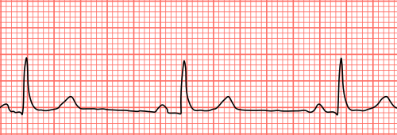
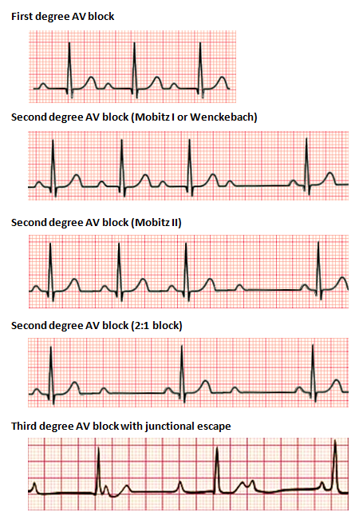
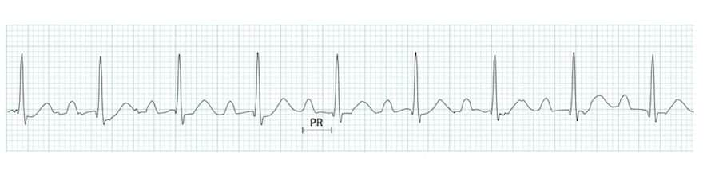
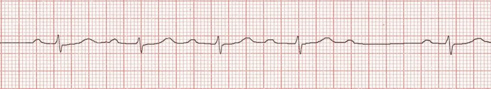
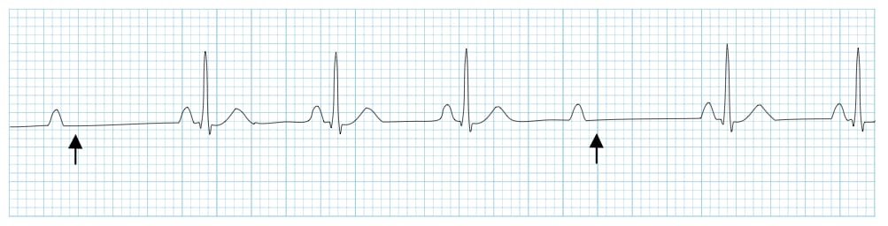
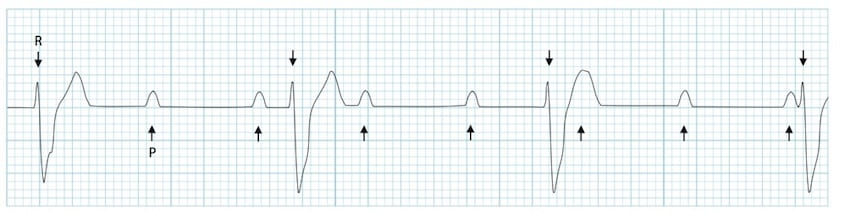
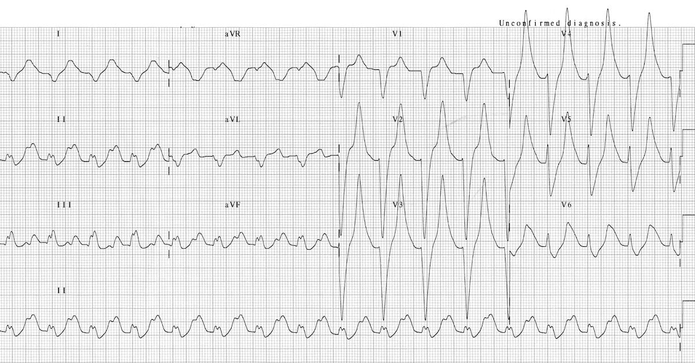
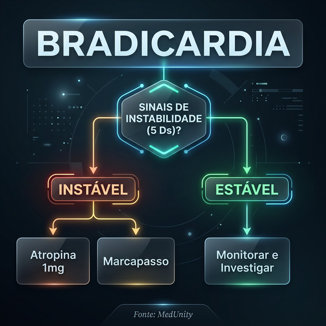

# BRADIARRITMIAS E BLOQUEIOS AV

Para dominar as bradiarritmias em provas de residência e na vida real, você precisa primeiro organizar sua mente em dois grandes grupos: os problemas que nascem no "gerador" (o Nó Sinusal) e os problemas que ocorrem na "fiação" (o Nó Atrioventricular e o sistema His-Purkinje).

A definição clássica de bradicardia mudou ligeiramente nas últimas diretrizes. De acordo com a **Diretriz da Sociedade Brasileira de Cardiologia (SBC) sobre Laudos Eletrocardiográficos (2022)**, consideramos bradicardia sinusal uma frequência cardíaca (FC) inferior a 50 bpm. Guarde esse número: 50. Se a prova trouxer um paciente com 55 bpm e ele estiver sintomático, você deve investigar, mas o ponto de corte para o diagnóstico eletrocardiográfico "seco" é 50.

## Disfunção do Nó Sinusal (DNS)

A Disfunção do Nó Sinusal não é uma doença única, mas um espectro. Ela acontece quando o nó sinusal falha em sua função de marcapasso natural, seja por não gerar o impulso ou por não conseguir transmiti-lo para o átrio (bloqueio sinoatrial).

### Por que o Nó Sinusal falha?

Na maioria das vezes, o culpado é o tempo. A fibrose senil degenerativa é a causa número um em idosos. No entanto, em provas brasileiras, nunca esqueça da Doença de Chagas, que adora "comer" o sistema de condução. Outras causas incluem isquemia (infarto de parede inferior, já que a artéria do nó sinusal nasce da coronária direita em 60% das pessoas), drogas (betabloqueadores, bloqueadores de canais de cálcio, digital) e distúrbios eletrolíticos.

### Manifestações Eletrocardiográficas da DNS

- **Bradicardia Sinusal Persistente:** FC < 50 bpm sem uma causa fisiológica clara (como o sono ou o condicionamento físico de um atleta).

- **Pausa ou Parada Sinusal:** O nó sinusal simplesmente para de disparar. No ECG, vemos um silêncio elétrico (linha isoelétrica) sem onda P.

- **Bloqueio Sinoatrial (BSA):** O estímulo é gerado, mas não sai do nó para o átrio.

- **BSA Tipo II:** A pausa é um múltiplo exato do intervalo PP anterior. É como se o coração "pulasse" um batimento inteiro de forma matemática.

- **Síndrome Taqui-Bradi:** Esta é a favorita das bancas. O paciente alterna momentos de bradicardia sinusal com paroxismos de taquiarritmias supraventriculares (geralmente Fibrilação Atrial). O perigo ocorre quando a taquiarritmia termina: o nó sinusal, que estava "suprimido" pela alta frequência, demora a "acordar", gerando uma pausa longa e síncope.

### A "Pérola" da Diretriz de 2023

Aqui está algo que o **Dr. Will** sempre enfatiza nas revisões do **MedEvo**: a **Diretriz Brasileira de Dispositivos Cardíacos Eletrônicos Implantáveis (2023)** trouxe um critério novo para pausas assintomáticas.
Antigamente, falávamos em 3 segundos. Agora, a recomendação (Classe IIa) é considerar marcapasso para pacientes com síncope inexplicada que apresentem pausas superiores a **6,0 segundos** no Holter, mesmo que assintomáticas no momento do registro. Se a pausa for > 3s e o paciente tiver sintomas claros naquele momento, a indicação é Classe I.

## Bloqueios Atrioventriculares (BAV)

Se a DNS é um problema no gerador, o BAV é um problema no "pedágio" (Nó AV) ou na "estrada" (Feixe de His e Ramos). A classificação dos BAVs é baseada na relação entre a onda P e o complexo QRS.

### BAV de Primeiro Grau

Aqui, todo estímulo passa, mas demora mais do que o normal.

- **Critério:** Intervalo PR > 200ms (ou 0,20s).

- **Regra de Ouro:** Toda onda P é seguida por um QRS. Não há batimentos perdidos.

- **Onde é o problema?** Geralmente no Nó AV (atraso fisiológico aumentado).

- **Conduta:** Quase sempre expectante. É um achado benigno, comum em idosos e atletas. Cuidado: a banca pode tentar te induzir a colocar marcapasso só pelo PR longo. Não caia nessa!

### BAV de Segundo Grau Mobitz I (Wenckebach)

É o bloqueio do "aviso". O intervalo PR vai aumentando progressivamente até que uma onda P é bloqueada.

-

**Fisiopatologia:** O problema costuma ser no Nó AV. O nó vai se cansando (período refratário aumenta) até que ele "apaga" por um ciclo para se recuperar.

-

**ECG:** PR curto -> PR médio -> PR longo -> P bloqueada. O intervalo RR que contém a P bloqueada é menor que a soma de dois intervalos PP.

-

**Prognóstico:** Geralmente benigno. Frequentemente visto durante o sono (tônus vagal alto).

### BAV de Segundo Grau Mobitz II

Este é o bloqueio "traiçoeiro". Não há aviso.

- **Critério:** O intervalo PR é constante (normal ou aumentado), mas, de repente, uma onda P não conduz.

- **Fisiopatologia:** O problema é **INFRANODAL** (no sistema His-Purkinje). Isso é crítico! O sistema His-Purkinje funciona no esquema "tudo ou nada". Se ele falha, é porque a doença é grave.

- **Risco:** Alto risco de progressão para BAV Total (BAVT) e morte súbita.

- **Conduta:** Marcapasso é a regra, mesmo se o paciente estiver assintomático (Classe I).

### BAV 2:1

Quando temos uma P conduzida e uma P bloqueada, alternadamente.

- **O dilema:** É Mobitz I ou II? Com apenas dois batimentos, não dá para ver se o PR está aumentando ou se é fixo.

- **Dica de Prova:** Olhe para o QRS. Se o QRS for estreito, a chance de ser nodal (benigno/Mobitz I) é maior. Se o QRS for largo, a lesão provavelmente é infranodal (perigoso/Mobitz II).

### BAV de Terceiro Grau (BAV Total - BAVT)

Aqui, a comunicação entre átrios e ventrículos está completamente rompida.

- **ECG:** Dissociação atrioventricular completa. As ondas P têm seu ritmo (PP constante) e os QRS têm o seu (RR constante), mas um não tem nada a ver com o outro. A frequência atrial (P) é sempre maior que a ventricular (QRS).

- **Ritmo de Escape:** O ventrículo assume o comando com um ritmo de escape. Se o escape for juncional (perto do Nó AV), o QRS é estreito e a FC fica entre 40-50 bpm. Se o escape for ventricular (baixo), o QRS é largo e a FC é muito baixa (20-30 bpm), o que é instável e perigoso.

| Tipo de BAV | Local da Lesão | Comportamento do PR | QRS Típico | Risco de BAVT |
| --- | --- | --- | --- | --- |
| 1º Grau | Nó AV | Fixo e > 200ms | Estreito | Mínimo |
| 2º Grau Mobitz I | Nó AV | Aumenta progressivamente | Estreito | Baixo |
| 2º Grau Mobitz II | Infranodal | Fixo até bloquear | Largo | Muito Alto |
| 3º Grau (BAVT) | Qualquer nível | Totalmente dissociado | Variável | Já é o bloqueio total |

## Bloqueios Intraventriculares e o "Ramo Alternante"

Muitos alunos esquecem de olhar para os ramos quando estudam bradicardia. Mas a banca não esquece.
Se um paciente tem Bloqueio de Ramo Direito (BRD) e, em outro momento ou no mesmo traçado, apresenta Bloqueio de Ramo Esquerdo (BRE), ou se ele alterna entre bloqueio divisional anterossuperior e posteroinferior, estamos diante de uma **Doença do Sistema de Condução Trifascicular**.

**Bloqueio de Ramo Alternante:** É uma indicação formal de marcapasso definitivo (Classe I pela Diretriz de 2023), mesmo que o paciente nunca tenha desmaiado. Por quê? Porque isso prova que todos os ramos estão doentes e o BAVT é apenas uma questão de tempo.

## Hipercalemia: O Grande Simulador

Se você vir um ECG com BAVT e QRS muito largo, quase "senoidal", pare tudo e peça um potássio. A hipercalemia é a causa reversível mais cobrada em provas.

### O que acontece no coração?

O potássio alto torna o potencial de repouso da célula menos negativo, o que inativa os canais de sódio. Isso lentifica a condução em todo o coração. O resultado é:

- Onda T apiculada ("em tenda").

- Achatamento e desaparecimento da onda P (ritmo sinoventricular).

- Alargamento bizarro do QRS.

- Bloqueios AV de qualquer grau.

### Manejo de Emergência (Obrigatório memorizar)

Se houver alteração no ECG por hipercalemia, a primeira droga **NÃO É** para baixar o potássio. É para proteger o coração.

- **Gluconato de Cálcio 10%:** 10ml IV em 2-5 minutos.

- *Por que fazemos isso?* O cálcio antagoniza o efeito do potássio no limiar de excitabilidade miocárdica, estabilizando a membrana. Ele não mexe no nível de potássio no sangue!

- *Dica de Prova:* Se a alternativa disser "iniciar furosemida para tratar BAVT por hipercalemia", está errado. O cálcio vem primeiro.

Após estabilizar a membrana, aí sim usamos medidas para "esconder" o potássio (Glicoinsulina, Bicarbonato, Beta-2 agonista) ou para eliminá-lo (Resinas de troca, Furosemida, Hemodiálise).

## Abordagem da Bradiarritmia na Emergência (Protocolo ACLS/SBC)

Imagine o cenário: Paciente de 70 anos, sudoreico, pálido, FC de 35 bpm. O que fazer?
O primeiro passo é sempre definir: **O paciente está instável?**
Os sinais de instabilidade (os "5 Ds") são:

- **D**iminuição da consciência (alteração do sensório).

- **D**isneia / Congestão pulmonar (Insuficiência Cardíaca).

- **D**or torácica anginosa (Isquemia miocárdica).

- **D**iminuição da PA (Hipotensão / Choque).

- **D**esmaio (Síncope).

### Fluxo de Tratamento

Se o paciente está **ESTÁVEL**, você tem tempo. Investigue causas reversíveis (Drogas, Isquemia, Eletrólitos, Hipotireoidismo).

Se o paciente está **INSTÁVEL**:

- **Atropina:** É a primeira escolha.

- **Dose:** 1,0 mg IV em bolus (Diretriz atualizada). Pode repetir a cada 3-5 minutos até o máximo de 3,0 mg.

- *Cuidado:* A atropina funciona no Nó AV. Se o bloqueio for infranodal (Mobitz II ou BAVT de QRS largo), ela provavelmente não vai funcionar e pode até piorar a situação ao aumentar a frequência atrial e sobrecarregar o bloqueio.

- **Marcapasso Transcutâneo (MPTC):** Se a atropina falhar ou se o bloqueio for de alto grau (Mobitz II/BAVT). Não perca tempo com atropina se o paciente estiver "chocado" e o bloqueio for infranodal.

- **Dopamina ou Adrenalina:** Infusões contínuas enquanto prepara o marcapasso definitivo ou transvenoso.

- Dopamina: 5 a 20 mcg/kg/min.

- Adrenalina: 2 a 10 mcg/min.

| Droga | Dose | Observação de Professor |
| --- | --- | --- |
| **Atropina** | 1 mg (máx 3 mg) | Inútil em transplantados cardíacos (coração denervado). |
| **Adrenalina** | 2-10 mcg/min | Ótima se houver hipotensão associada. |
| **Dopamina** | 5-20 mcg/kg/min | Dose alfa-adrenérgica para suporte pressórico. |
| **Gluconato de Cálcio** | 10 ml a 10% | Apenas se suspeita de hipercalemia ou intoxicação por BCC. |

## Indicações de Marcapasso Definitivo (Resumo da Diretriz 2023)

Para a prova, você precisa saber as indicações Classe I (onde não há dúvida).

### Na Disfunção do Nó Sinusal (DNS)

- Sintomas documentados claramente relacionados à bradicardia (Classe I).

- Incompetência Cronotrópica (o coração não acelera no esforço) que causa sintomas (Classe I).

- Síncope de origem indeterminada com pausas > 6s no Holter (Classe IIa - *Novidade!*).

### Nos Bloqueios Atrioventriculares (BAV)

- BAVT ou BAV de 2º grau avançado (mais de uma P bloqueada seguida) de forma permanente ou intermitente, mesmo assintomático (Classe I).

- BAV de 2º grau Mobitz II, independentemente dos sintomas (Classe I).

- Fibrilação Atrial com pausas > 5 segundos (Classe I).

- Bloqueio de Ramo Alternante (Classe I).

### Situações Especiais: Pós-Infarto (IAM)

Não saia colocando marcapasso em todo mundo que faz bloqueio no infarto. Muitos são reversíveis.

- Se o BAVT for por infarto de parede inferior, geralmente é nodal e reverte com reperfusão ou atropina.

- Se o BAVT for por infarto de parede anterior, a lesão é no septo (infranodal), o prognóstico é péssimo e o marcapasso costuma ser necessário.

- A diretriz recomenda aguardar pelo menos **5 dias** de persistência do bloqueio pós-IAM antes de indicar o marcapasso definitivo, a menos que o bloqueio seja infranodal de alto risco desde o início.

## Diagnóstico Diferencial: Bradicardia Fisiológica vs. Patológica

Um erro comum que vejo alunos cometerem em simulados é indicar marcapasso para um jovem atleta com FC de 38 bpm durante o sono.
**Lembre-se:** O sono é o reino do nervo vago. É normal ter bradicardia sinusal, BAV de 1º grau e até Mobitz I (Wenckebach) durante o sono em pessoas saudáveis.

Como diferenciar? O **Teste Ergométrico** é a chave. Se o paciente acelera a frequência cardíaca adequadamente durante o exercício (atinge pelo menos 85% da FC máxima prevista para a idade), a função cronotrópica está preservada e o bloqueio é provavelmente funcional/vagal. Se ele não acelera, temos incompetência cronotrópica.

## Tratamento Farmacológico Crônico?

Não existe. Não se trata bradicardia crônica com remédio. Ou você retira a droga que está causando (se houver), ou você trata a causa base (ex: hipotireoidismo), ou o tratamento é o **Marcapasso Definitivo**.

Drogas como a Teofilina ou o Cilostazol podem ser tentadas em casos muito específicos de DNS enquanto se aguarda o implante, mas isso nunca é a resposta correta para "tratamento definitivo" em prova.

## Pontos-Chave para Prova

- **Bradicardia Sinusal:** FC < 50 bpm (Diretriz SBC 2022).

- **BAV 1º Grau:** PR > 200ms, mas TODA onda P conduz. Conduta: Observar.

- **Mobitz I (Wenckebach):** PR aumenta até bloquear. Local: Nó AV (benigno).

- **Mobitz II:** PR fixo e bloqueio súbito. Local: Infranodal (perigoso). Indicação de MP mesmo assintomático.

- **BAVT:** Dissociação total. Ritmo atrial > Ritmo ventricular.

- **Hipercalemia:** Onda T em tenda -> P some -> QRS alarga. Primeiro passo: Gluconato de Cálcio 10% IV.

- **Atropina na Emergência:** Dose de 1,0 mg, máximo de 3,0 mg. Evitar em BAV infranodal (Mobitz II/BAVT largo).

- **Pausas no Holter:** Se assintomático, MP é considerado se pausa > 6,0 segundos (Diretriz 2023).

- **Bloqueio de Ramo Alternante:** É indicação de marcapasso definitivo (Classe I).

- **Síncope + Taqui-Bradi:** Trata-se com marcapasso para proteger a bradicardia e permitir o uso de antiarrítmicos/betabloqueadores para a taquicardia.

- **Cuidado com o "2:1":** Se o QRS for largo, trate como Mobitz II. Se for estreito, provavelmente é Mobitz I.

- **Transplante Cardíaco:** Atropina não funciona. Use Aminofilina ou marcapasso se necessário.

- **IAM Inferior:** BAVT costuma ser transitório (Nó AV). IAM Anterior: BAVT costuma ser definitivo (Infranodal).

- **O que NÃO fazer:** Não use atropina em pacientes com suspeita de infarto se a bradicardia for estável e compensada, pois o aumento da FC pode aumentar a área de infarto.

- **Marcapasso Transcutâneo:** Sempre sedar e analgesiar o paciente antes de ligar o estímulo (dói muito!).

Ao revisar este material, foque em entender a anatomia do sistema de condução. Se você souber onde está o problema (Nó AV vs. His-Purkinje), a conduta e o prognóstico tornam-se lógicos, e você não precisará decorar tabelas infinitas. Como sempre dizemos no **MedEvo**, o segredo da cardiologia é a fisiopatologia aplicada ao traçado.

 Cópia offline para consulta pessoal.
 Fonte original:
 [https://www.medevo.com.br/material-apoio/ler/aff80d09-4df8-4762-90e1-1a29a37eb990](https://www.medevo.com.br/material-apoio/ler/aff80d09-4df8-4762-90e1-1a29a37eb990)
