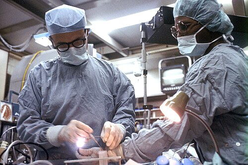

# BRONCOSCOPIA E ENDOSCOPIA RESPIRATÓRIA

Para entender a endoscopia respiratória, você não deve pensar nela apenas como "olhar o pulmão por dentro". Pense nela como a extensão do seu exame físico e a sua principal ferramenta de intervenção em situações críticas. Na prova de residência, o examinador quer saber se você sabe indicar o procedimento correto, se conhece as contraindicações e, principalmente, se sabe manejar emergências como corpo estranho e hemoptise volumosa.

## Fundamentos: O Equipamento e a Escolha da Via

*Figura 1 - Diagrama esquemático demonstrando o procedimento de broncoscopia, com o broncoscópio flexível sendo inserido pela via oral até a árvore brônquica. Fonte: Cancer Research UK, CC BY-SA 4.0 | Wikimedia Commons*

A primeira coisa que você precisa dominar é a diferença entre o broncoscópio flexível e o rígido. Muitos alunos erram questões por achar que o flexível substituiu o rígido. Isso é um erro clássico. Eles são complementares.

### Broncoscopia Flexível (Fibrobroncoscopia)

É o "pau para toda obra". Realizada sob sedação e anestesia local, permite chegar até brônquios segmentares e subsegmentares.

- **Vantagem:** Acessa a periferia, pode ser feita à beira leito (UTI), não exige anestesia geral obrigatoriamente.

- **Limitação:** Canal de trabalho estreito. Se você tiver um sangramento massivo ou um corpo estranho grande, o flexível será insuficiente.

### Broncoscopia Rígida

Aqui está o "padrão-ouro" para intervenções terapêuticas pesadas. É um tubo metálico reto que exige anestesia geral e hiperextensão cervical.

- **Vantagem:** Garante a via aérea (o tubo é a própria via aérea), permite passar instrumentos calibrosos, pinças de corpo estranho e aspiradores potentes.

- **Indicação clássica de prova:** Hemoptise volumosa e retirada de corpo estranho em crianças.

| Característica | Broncoscopia Flexível | Broncoscopia Rígida |
| --- | --- | --- |
| **Anestesia** | Local + Sedação | Geral (obrigatória) |
| **Alcance** | Até brônquios distais | Apenas via aérea central |
| **Via Aérea** | Não protege (risco de obstrução) | Mantém a via aérea pérvia |
| **Uso Principal** | Diagnóstico e biópsias | Terapêutica e emergências |

## Avaliação Pré-Procedimento e Segurança

Antes de introduzir qualquer aparelho, você precisa avaliar o risco. Segundo as recomendações da SBPT (Sociedade Brasileira de Pneumologia e Tisiologia), a segurança do paciente é prioridade.

### Contraindicações

Cuidado aqui: as contraindicações **absolutas** são raríssimas. A maioria é relativa e pode ser contornada com preparo.

**Contraindicações Absolutas:**

- Instabilidade hemodinâmica grave que não responde a volume/vasopressor.

- Hipoxemia refratária (se você não consegue oxigenar o paciente antes, o exame vai piorar a situação).

- Arritmia cardíaca maligna não controlada.

- Infarto do miocárdio recente (menos de 4-6 semanas, a menos que seja uma emergência vital).

**Contraindicações Relativas (Onde a banca tenta te pegar):**

- **Uremia e Coagulopatias:** Se você vai apenas aspirar secreção, pode fazer. Se vai biopsiar, o risco de sangramento é alto. O Dr. Will sempre lembra: "Não se faz biópsia transbrônquica com plaquetas abaixo de 50.000 ou RNI > 1.5".

- **Asma descompensada:** O broncoscópio irrita a via aérea e pode causar broncoespasmo grave. Estabilize o paciente primeiro.

## Diagnóstico de Estenoses e Colapso de Via Aérea

Este é um tema quente em provas de cirurgia torácica. Como diferenciar uma estenose fixa de um colapso dinâmico?

### Traqueobroncomalacia (TBM) e Colapso Dinâmico

A TBM é a fraqueza da cartilagem traqueal, fazendo com que a via aérea "feche" durante a expiração.

- **Pérola de Prova:** O diagnóstico preciso exige a combinação de **Broncoscopia Dinâmica** + **Tomografia Computadorizada de Tórax com Reconstrução 3D**.

- **Por que dinâmica?** Porque se o paciente estiver paralisado pela anestesia geral e em ventilação por pressão positiva, a via aérea ficará aberta e você vai comer bola no diagnóstico. O paciente precisa tossir ou expirar forçado durante o exame para você ver o colapso > 50% da luz.

### Estenose Subglótica e Traqueal

Geralmente sequela de intubação prolongada. A endoscopia é o padrão-ouro para classificar a extensão e o grau de obstrução (Classificação de Cotton-Myer para pediatria).

- **Dica MedEvo:** Se a questão fala em "estridor inspiratório" após extubação, pense em estenose ou granuloma. A conduta é laringoscopia/broncoscopia para visualização direta.

## O Pesadelo da Prova: Corpo Estranho em Via Aérea

Se cair uma criança com história de engasgo e sibilância localizada, não perca tempo.

### Quadro Clínico e Diagnóstico

- **Fase de Aspiração:** Tosse súbita, sufocação.

- **Intervalo Lúcido:** O corpo estranho "se acomoda", a tosse para. É aqui que o médico desatento libera a criança para casa. Erro fatal.

- **Fase de Complicação:** Pneumonia obstrutiva, abscesso ou atelectasia.

**Radiografia:** Pode estar normal em até 25% dos casos (corpos estranhos radiotransparentes como feijão ou plástico). O sinal clássico é o **enfisema obstrutivo** (o ar entra, mas não sai pelo efeito de válvula, deixando o pulmão mais preto e o mediastino desviado para o lado oposto).

### Conduta

Suspeita clínica forte = **Broncoscopia Rígida precoce**.
Por que rígida? Porque as pinças são melhores e você tem controle total da ventilação. Se o corpo estranho inchar (como um grão de feijão que absorve água), ele pode obstruir totalmente o brônquio.

## Hemoptise Volumosa: O Manejo de Emergência

Aqui a banca quer testar seu nervosismo. Hemoptise volumosa (geralmente > 300-600 ml em 24h ou que cause instabilidade) mata por **asfixia**, não por choque hipovolêmico. O sangue inunda o espaço morto e impede a troca gasosa.

### Conduta Imediata (O "ABC" da Hemoptise)

- **Posicionamento:** Decúbito lateral sobre o lado sangrante.

- *Por que?* Para proteger o pulmão sadio. Se o sangue escorrer para o lado bom, o paciente para.

- **Trendelenburg:** Pode ajudar a drenar o sangue para fora da via aérea por gravidade.

- **Proteção da Via Aérea:** Intubação com tubo calibroso (nº 8.5 ou 9.0) ou, preferencialmente, broncoscopia rígida.

### O Papel da Broncoscopia na Hemoptise

A broncoscopia serve para localizar o sangramento e tentar o controle inicial (instilação de soro gelado, adrenalina 1:20.000 ou bloqueadores brônquicos). Se não resolver, o próximo passo costuma ser a **Arteriografia com Embolização de Artérias Brônquicas**.

| Passo | Ação | Justificativa |
| --- | --- | --- |
| 1 | Decúbito lateral (lado doente para baixo) | Evitar aspiração para o pulmão sadio |
| 2 | Oxigenação e estabilização | Garantir troca gasosa mínima |
| 3 | Broncoscopia (preferencialmente rígida) | Localizar e tentar controle local |
| 4 | Embolização ou Cirurgia | Tratamento definitivo se falha endoscópica |

## Infecções e Abscesso Pulmonar

A broncoscopia é fundamental no diagnóstico de infecções em imunocomprometidos (através do Lavado Broncoalveolar - LBA) e no manejo de complicações.

### Abscesso Pulmonar com Estenose Brônquica

Imagine um paciente com abscesso que não melhora com antibiótico e a TC mostra uma obstrução brônquica drenando o pus.

- **Conduta:** Dilatação e aspiração transbrônquica.

- **O "Porquê":** O abscesso precisa drenar para a árvore brônquica para curar. Se houver uma estenose ou um tumor obstruindo, o pus fica retido (infecção pulmonar obstrutiva). A broncoscopia desobstrui e permite a drenagem.

### Tuberculose Pulmonar

Muitas vezes o escarro é negativo (BAAR negativo). A broncoscopia com LBA e biópsia transbrônquica aumenta muito a sensibilidade diagnóstica. Lembre-se: em áreas de alta prevalência, a visualização de granulomas caseosos é fortemente sugestiva.

## Procedimentos Terapêuticos Avançados

A endoscopia respiratória moderna vai muito além de aspirar secreção.

### Biópsia Transbrônquica (BTB)

Utilizada para doenças difusas do parênquima (sarcoidose, carcinomatose).

- **Risco:** Pneumotórax (cerca de 1-5%) e hemorragia.

- **Dica de Prova:** Sempre peça um Raio-X de tórax após uma BTB para excluir pneumotórax.

### Punção Transbrônquica por Agulha (TBNA)

Usada para estadiamento de câncer de pulmão (linfonodos mediastinais). O EBUS (Ultrassom Endobrônquico) é a evolução disso, permitindo ver o linfonodo em tempo real antes de puncionar.

### Próteses (Stents) Traqueobronquiais

Indicadas em estenoses inoperáveis ou colapsos graves (TBM grave). Podem ser de silicone (exigem broncoscopia rígida para colocar) ou metálicas autoexpansíveis.

## Resumo de Manejo: Situações Clínicas Comuns

Para fixar, vamos ver como isso aparece no seu plantão ou na sua prova:

**Cenário 1:** Idoso, tabagista, com atelectasia total de pulmão esquerdo.

- **Pensamento:** Isso é obstrução de brônquio fonte. Provável neoplasia.

- **Conduta:** Broncoscopia flexível para biópsia e diagnóstico histológico.

**Cenário 2:** Criança de 2 anos, sibilância unilateral à direita que não melhora com broncodilatador.

- **Pensamento:** Sibilância unilateral em criança é corpo estranho até que se prove o contrário.

- **Conduta:** Broncoscopia rígida imediata.

**Cenário 3:** Paciente em UTI com pneumonia aspirativa evoluindo com abscesso. Apresenta febre persistente apesar de antibiótico de largo espectro.

- **Pensamento:** Pode haver um "plug" de secreção ou estenose impedindo a drenagem.

- **Conduta:** Broncoscopia para limpeza e desobstrução.

## Complicações da Broncoscopia

Embora segura, você deve conhecer os problemas para poder evitá-los.

- **Hipoxemia:** O aparelho ocupa espaço na via aérea e a aspiração contínua remove oxigênio.

- **Arritmias:** Geralmente por hipóxia ou estimulação vagal.

- **Pneumotórax:** Principalmente após biópsia transbrônquica.

- **Laringoespasmo/Broncoespasmo:** Mais comum em pacientes com via aérea hiper-reativa (asmáticos).

**Manejo da Hemorragia Pós-Biópsia:**
Se após a biópsia começar a sangrar, a primeira medida é **instilar soro fisiológico gelado** e adrenalina. Se persistir, você deve manter o broncoscópio "ocluindo" o brônquio sangrante (tamponamento) até que o coágulo se forme.

## Pontos-Chave para Prova 💡

- **TBM (Traqueobroncomalacia):** O diagnóstico padrão é a broncoscopia dinâmica (paciente acordado/tosse) associada à TC com reconstrução 3D.

- **Hemoptise Volumosa:** A prioridade é a asfixia, não o choque. Posicione o paciente em decúbito lateral sobre o lado do sangramento.

- **Corpo Estranho:** Radiografia normal NÃO exclui o diagnóstico. Na dúvida, faça a broncoscopia rígida.

- **Padrão-Ouro para Obstrução:** Para avaliar qualquer obstrução de via aérea central, a endoscopia (laringo ou bronco) é o padrão-ouro.

- **Contraindicação Absoluta:** Hipoxemia refratária e instabilidade hemodinâmica grave são as principais.

- **Biópsia Transbrônquica:** Sempre solicitar RX de tórax após o procedimento devido ao risco de pneumotórax.

- **Linfonodopatia Mediastinal:** O EBUS-TBNA é o método de escolha atual para estadiamento linfonodal não invasivo do câncer de pulmão.

- **Abscesso Pulmonar:** Se houver suspeita de obstrução brônquica associada, a broncoscopia terapêutica para drenagem é mandatória.

- **Enfisema Obstrutivo:** É o sinal radiológico indireto mais comum de corpo estranho em crianças (hipertransparência localizada).

- **Broncoscopia Rígida:** É a via de escolha para retirada de corpos estranhos e manejo de hemoptises maciças por permitir melhor controle da via aérea.

- **Sedação:** Na broncoscopia flexível, o uso de midazolam e fentanil é comum, mas cuidado com a depressão respiratória.

- **Anestesia Local:** A lidocaína é usada para inibir o reflexo de tosse, mas respeite o limite de dose (aprox. 7mg/kg) para evitar toxicidade (convulsões).

- **Estágios do Corpo Estranho:** Não se deixe enganar pelo "período assintomático"; ele é a armadilha clássica das bancas.

- **Manobra de Heimlich:** Deve ser feita no engasgo agudo com obstrução total. Se o paciente já está no hospital e estável, a conduta é endoscópica.

- **Posicionamento:** Para broncoscopia rígida, o paciente deve estar em posição de "sniffing" (olfativa) ou hiperextensão cervical.

- **Segurança:** Sempre monitorar ECG, SatO2 e pressão arterial durante todo o procedimento.

Lembre-se: a broncoscopia é um procedimento seguro quando bem indicado. O segredo para a prova é identificar quando a intervenção deixa de ser diagnóstica e passa a ser uma manobra de salvamento de vida.

 Cópia offline para consulta pessoal.
 Fonte original:
 [https://www.medevo.com.br/material-apoio/ler/dae730bf-e31c-4344-8529-3cb6628f03a5](https://www.medevo.com.br/material-apoio/ler/dae730bf-e31c-4344-8529-3cb6628f03a5)
