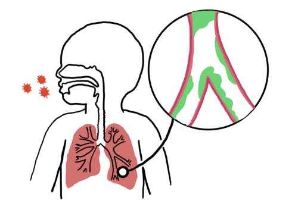
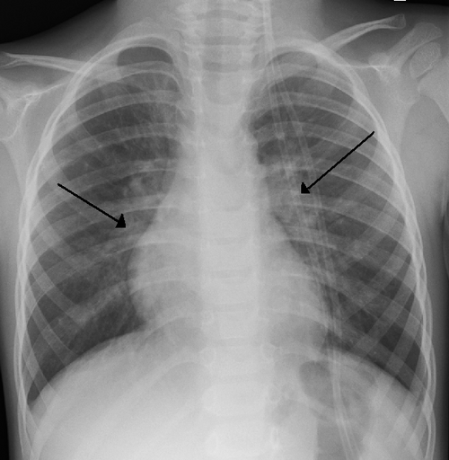

# BRONQUIOLITE VIRAL AGUDA

Bronquiolite viral aguda (BVA) é uma infecção viral das vias aéreas inferiores, típica de lactentes, caracterizada por inflamação e obstrução dos bronquíolos. Em provas, a definição clássica é: **primeiro episódio de sibilância em criança menor de 2 anos, geralmente precedido por sintomas de infecção viral de vias aéreas superiores**.

Atenção: lactente com múltiplos episódios prévios de sibilância, história pessoal ou familiar de atopia e boa resposta a broncodilatador já muda o raciocínio para sibilância recorrente/asma do lactente, não para BVA típica.

## Fisiopatologia

*Figura 1 - Desenho esquemático da bronquiolite viral aguda em crianças, demonstrando inflamação e obstrução dos bronquíolos por edema, muco e debris celulares. Fonte: Annajurlina, CC0 | Wikimedia Commons*

Na BVA, o vírus infecta o epitélio bronquiolar, causando necrose celular, edema de mucosa, aumento de secreção e acúmulo de debris celulares. O principal problema não é broncoespasmo, como na asma, mas obstrução de bronquíolos pequenos.

A obstrução pode causar:

- **Atelectasias**, quando há obstrução completa.

- **Hiperinsuflação**, quando há obstrução parcial com mecanismo de válvula, permitindo a entrada de ar na inspiração e dificultando sua saída na expiração.

- **Desequilíbrio ventilação/perfusão**, principal causa de hipoxemia.

Esse mecanismo explica por que o tratamento é basicamente de suporte, com oxigênio e hidratação quando necessários, e não com corticoide ou broncodilatador de rotina.

## Etiologia

O principal agente é o **vírus sincicial respiratório (VSR)**, especialmente em lactentes pequenos. Outros vírus também podem causar bronquiolite, como rinovírus, metapneumovírus humano, parainfluenza, influenza, adenovírus e coronavírus.

Pontos importantes:

- **VSR**: principal causa de bronquiolite e de hospitalização por infecção respiratória baixa em lactentes.

- **Rinovírus**: associado a maior risco de sibilância recorrente posterior, especialmente em crianças com predisposição atópica.

- **Adenovírus**: menos frequente, mas importante por sua associação com bronquiolite obliterante pós-infecciosa.

No Brasil, a circulação do VSR é sazonal e varia conforme a região, com maior frequência nos meses mais frios e chuvosos em muitas localidades.

## Quadro clínico

O quadro costuma começar com sintomas de vias aéreas superiores:

- Coriza;

- Obstrução nasal;

- Tosse;

- Febre baixa ou ausente;

- Redução da aceitação alimentar.

Após 2 a 5 dias, surgem os sinais de acometimento de vias aéreas inferiores:

- Taquipneia;

- Tiragens subcostais, intercostais ou de fúrcula;

- Batimento de asa nasal;

- Gemência, nos casos mais graves;

- Sibilos;

- Estertores finos;

- Expiração prolongada.

Em lactentes muito jovens, especialmente menores de 2 meses e prematuros, **apneia pode ser a manifestação inicial**, mesmo antes de sibilância evidente.

## Fatores de risco para gravidade

A chance de evolução grave é maior em:

- Idade menor que 3 meses, especialmente menores de 6 semanas;

- Prematuridade, principalmente menores de 32 semanas;

- Doença pulmonar crônica da prematuridade/displasia broncopulmonar;

- Cardiopatia congênita hemodinamicamente significativa;

- Imunodeficiência;

- Doença neuromuscular;

- Síndrome de Down;

- Exposição ao tabagismo;

- Baixo peso, dificuldade alimentar ou desidratação;

- Dificuldade de acesso ao serviço de saúde ou baixa capacidade familiar de reconhecer sinais de alerta.

## Diagnóstico

O diagnóstico é **clínico**. Em um lactente menor de 2 anos, com pródromo viral e primeiro episódio de sibilância, não há necessidade de exames complementares de rotina.

Não solicitar rotineiramente:

- Hemograma;

- PCR;

- gasometria;

- radiografia de tórax;

- pesquisa viral para definir tratamento.

A pesquisa de vírus respiratórios pode ser útil em pacientes internados para vigilância epidemiológica, isolamento/coorte e investigação de síndrome respiratória aguda grave, mas geralmente não muda a conduta individual na BVA típica.

### Radiografia de tórax

*Figura 2 - Radiografia de tórax de criança com bronquiolite por VSR mostrando hiperinsuflação pulmonar bilateral e espessamento peribrônquico peri-hilar. Fonte: James Heilman, MD, CC BY-SA 3.0 | Wikimedia Commons*

A radiografia de tórax **não deve ser solicitada de rotina**, porque pode mostrar achados inespecíficos que confundem a interpretação e aumentam o uso indevido de antibióticos.

Quando realizada, pode mostrar:

- Hiperinsuflação pulmonar;

- Retificação/rebaixamento das cúpulas diafragmáticas;

- Aumento dos espaços intercostais;

- Espessamento peribrônquico;

- Atelectasias laminares ou segmentares.

Solicite radiografia apenas se houver dúvida diagnóstica, suspeita de complicação, assimetria importante na ausculta, evolução atípica, piora súbita ou suspeita de pneumonia, corpo estranho ou cardiopatia.

## Diagnósticos diferenciais

Pense em outros diagnósticos quando o quadro não seguir o padrão clássico de pródromo viral seguido de sibilância difusa.

| Diagnóstico | Pistas clínicas |
| --- | --- |
| Aspiração de corpo estranho | Início súbito, engasgo, sibilância unilateral, ausência de pródromo viral |
| Pneumonia | Febre alta ou persistente, toxemia, estertores localizados, hipoxemia desproporcional |
| Coqueluche | Tosse paroxística, guincho inspiratório, cianose, vômitos após tosse, linfocitose |
| Chlamydia trachomatis | Lactente de 1 a 3 meses, tosse staccato, afebril, conjuntivite neonatal, eosinofilia |
| Insuficiência cardíaca | Cansaço às mamadas, sudorese, hepatomegalia, sopro, cardiomegalia |
| Asma/sibilância recorrente | Episódios repetidos, atopia, história familiar, resposta consistente a broncodilatador |

## Tratamento

O tratamento da BVA é **suporte clínico**.

### Medidas que funcionam

- **Higiene nasal**

Soro fisiológico e aspiração nasal suave podem melhorar a alimentação e o conforto respiratório. É especialmente importante porque o lactente pequeno depende muito da respiração nasal.

- **Oxigenioterapia**

Indicar oxigênio quando houver hipoxemia persistente. Em geral, considera-se oxigênio se SpO₂ estiver persistentemente abaixo de 90%, ou abaixo de 92% em alguns protocolos e em pacientes de maior risco.

O objetivo é manter saturação adequada com o menor suporte necessário. Pode-se usar cateter nasal, máscara, cateter nasal de alto fluxo, CPAP ou ventilação mecânica, conforme gravidade.

- **Hidratação e alimentação**

Manter via oral sempre que possível. Se houver desconforto respiratório importante, fadiga, risco de aspiração ou ingesta insuficiente, considerar sonda nasogástrica ou hidratação venosa.

Evite hiper-hidratação, pois pode piorar o desconforto respiratório e o edema pulmonar.

- **Manuseio mínimo**

Evitar intervenções repetidas e desnecessárias. O excesso de manipulação aumenta o consumo de oxigênio e pode piorar o desconforto.

## O que não fazer de rotina

### Broncodilatadores

Salbutamol e outros broncodilatadores **não são indicados de rotina** na BVA típica. O mecanismo predominante é obstrução por edema, muco e debris celulares, não broncoespasmo.

Em alguns serviços, pode-se considerar teste terapêutico em casos selecionados, principalmente se houver dúvida com sibilância recorrente/asma do lactente. Se não houver melhora clínica objetiva, deve ser suspenso. Em provas, a conduta padrão é: **não usar broncodilatador de rotina**.

### Corticoides

Corticoide sistêmico ou inalatório **não é indicado** na bronquiolite viral aguda. Não reduz tempo de doença, internação ou necessidade de suporte ventilatório.

### Antibióticos

Não usar antibiótico na BVA típica. Indicar apenas se houver evidência de infecção bacteriana associada, como otite média aguda, pneumonia bacteriana ou sepse.

### Fisioterapia respiratória

Não é indicada de rotina na fase aguda da BVA. Técnicas de tapotagem, vibração ou drenagem postural não melhoram desfechos relevantes e podem aumentar o desconforto do lactente.

### Nebulização com salina hipertônica 3%

Não é indicada de rotina no pronto atendimento para evitar internação. Em pacientes internados, seu benefício é controverso e pode ser considerada conforme protocolo institucional, mas não é pilar do tratamento.

## Critérios de internação

Internar ou manter em observação quando houver:

- SpO₂ persistentemente baixa em ar ambiente;

- Desconforto respiratório moderado a grave;

- Apneia ou cianose;

- Frequência respiratória muito elevada, especialmente com fadiga;

- Incapacidade de manter hidratação ou alimentação;

- Vômitos persistentes;

- Menos de 3 meses, especialmente menores de 6 semanas;

- Prematuridade ou comorbidades relevantes;

- Dificuldade de acompanhamento seguro em casa.

## Sinais de gravidade

São sinais de alerta:

- Gemência;

- Tiragens intensas;

- Batimento de asa nasal importante;

- Cianose;

- Apneia;

- Sonolência, irritabilidade extrema ou exaustão;

- Má perfusão periférica;

- Queda persistente de saturação;

- Dificuldade importante para mamar;

- Redução de diurese.

## Prevenção contra VSR

### Vacina materna contra VSR

A vacina recombinante contra VSR para gestantes foi incorporada ao SUS para prevenção de doença do trato respiratório inferior por VSR em lactentes pequenos.

Pontos práticos:

- Indicada em **dose única a cada gestação**.

- No SUS, a recomendação operacional vigente é aplicação **a partir da 28ª semana de gestação**.

- A proteção ocorre pela transferência placentária de anticorpos maternos, reduzindo o risco de doença grave por VSR nos primeiros meses de vida.

- Pode ser administrada no mesmo dia de outras vacinas da gestação, em locais anatômicos diferentes.

### Nirsevimabe

O nirsevimabe é um anticorpo monoclonal de longa ação para prevenção de infecção grave por VSR. Não é tratamento da bronquiolite.

No SUS, o protocolo contempla:

- Crianças nascidas com idade gestacional menor que 37 semanas, independentemente do peso e do histórico de vacinação materna;

- Crianças até 24 meses com comorbidades, como cardiopatia congênita, broncodisplasia, imunocomprometimento grave, síndrome de Down, fibrose cística, doença neuromuscular ou anomalias congênitas de vias aéreas.

O esquema é dose única por via intramuscular, com dose ajustada pelo peso nos lactentes e esquema específico para crianças de alto risco na segunda temporada.

### Palivizumabe

O palivizumabe é outro anticorpo monoclonal contra VSR, também usado para prevenção, não para tratamento.

Historicamente, suas principais indicações no SUS incluem:

- Prematuros com idade gestacional menor ou igual a 28 semanas e idade inferior a 1 ano;

- Crianças menores de 2 anos com doença pulmonar crônica da prematuridade/displasia broncopulmonar que necessitaram tratamento nos últimos 6 meses;

- Crianças menores de 2 anos com cardiopatia congênita com repercussão hemodinâmica.

O esquema clássico é mensal durante a sazonalidade, com até 5 doses. Com a incorporação do nirsevimabe, as indicações e estratégias locais devem seguir o protocolo vigente do Ministério da Saúde.

## Complicações e prognóstico

A maioria dos lactentes melhora em 7 a 10 dias, embora a tosse possa persistir por 2 a 3 semanas.

Complicações possíveis:

- Insuficiência respiratória;

- Apneia;

- Atelectasias;

- Desidratação;

- Otite média aguda;

- Pneumonia bacteriana secundária, menos comum;

- Bronquiolite obliterante pós-infecciosa, principalmente associada ao adenovírus;

- Sibilância recorrente nos anos seguintes.

Sibilância após BVA não significa, obrigatoriamente, diagnóstico de asma, mas aumenta a chance de novos episódios, especialmente quando há rinovírus, atopia ou história familiar.

## Situação especial: SRAG e oseltamivir

Se o lactente preencher critérios de síndrome respiratória aguda grave, especialmente com hipoxemia, desconforto respiratório importante ou necessidade de internação, deve-se considerar investigação viral conforme vigilância local.

Quando houver suspeita de influenza ou cenário epidemiológico compatível, o oseltamivir deve ser iniciado precocemente, preferencialmente nas primeiras 48 horas, sem aguardar confirmação laboratorial em casos graves. Isso não muda o fato de que, na BVA típica por VSR, o tratamento é suporte.

## Pontos-chave para prova

- BVA clássica: primeiro episódio de sibilância em menor de 2 anos após pródromo viral.

- Principal agente: VSR.

- Diagnóstico: clínico.

- Exames laboratoriais e radiografia de tórax: não solicitar de rotina.

- RX, se feito: hiperinsuflação, espessamento peribrônquico, atelectasias e retificação/rebaixamento das cúpulas diafragmáticas.

- Tratamento: suporte, com higiene nasal, hidratação e oxigênio se hipoxemia persistente.

- Não usar de rotina: broncodilatador, corticoide, antibiótico, fisioterapia respiratória e salina hipertônica.

- Apneia pode ser manifestação inicial em lactentes pequenos e prematuros.

- Corpo estranho: início súbito, sem pródromo viral, sibilância unilateral.

- Coqueluche: tosse paroxística, guincho, vômitos, cianose e linfocitose.

- Chlamydia trachomatis: tosse staccato, afebril, lactente jovem e eosinofilia.

- Prevenção contra VSR inclui vacina materna, nirsevimabe e palivizumabe conforme indicação.

- Anticorpos monoclonais contra VSR são prevenção, não tratamento.

 Cópia offline para consulta pessoal.
 Fonte original:
 [https://www.medevo.com.br/material-apoio/ler/a4996142-7d32-4abd-a596-c0d7cdaff647](https://www.medevo.com.br/material-apoio/ler/a4996142-7d32-4abd-a596-c0d7cdaff647)
