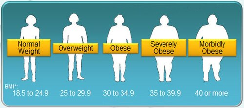

# BYPASS GÁSTRICO EM Y-DE-ROUX

O Bypass Gástrico em Y-de-Roux (BGYR) é, há décadas, considerado o "padrão-ouro" da cirurgia bariátrica no Brasil e no mundo. Para a sua prova de residência, você não deve apenas saber que ele "emagrece", mas entender a complexa alteração anatômica e hormonal que ele promove. Se você compreender a anatomia do "Y", as complicações deixam de ser uma lista para decorar e passam a ser uma dedução lógica.

## Definição e Critérios de Indicação

O BGYR é uma técnica mista. O que isso significa? Que ela combina **restrição** (um reservatório gástrico pequeno) com uma **disabsorção moderada** (desvio de parte do intestino delgado). Além disso, possui um componente hormonal fortíssimo, que hoje chamamos de cirurgia metabólica.

De acordo com o Conselho Federal de Medicina (CFM) e a Sociedade Brasileira de Cirurgia Bariátrica e Metabólica (SBCBM), os critérios para indicação cirúrgica no Brasil são rígidos:

- **IMC ≥ 40 kg/m²**, independentemente de comorbidades.

- **IMC entre 35 e 39,9 kg/m²** na presença de comorbidades relacionadas à obesidade (HAS, DM2, apneia do sono, dislipidemia, osteoartrites, entre outras).

- **IMC entre 30 e 34,9 kg/m²** para a chamada **Cirurgia Metabólica**, especificamente para pacientes com Diabetes Mellitus tipo 2 de difícil controle clínico, com diagnóstico há menos de 10 anos e idade entre 20 e 70 anos.

**Cuidado com a pegadinha:** O paciente deve ter tentado tratamento clínico por pelo menos dois anos, sem sucesso sustentado. Não se opera alguém que "decidiu emagrecer ontem". Além disso, a idade mínima é 16 anos (com avaliação especial) e não há limite superior rígido, desde que o risco cirúrgico seja aceitável.

## Anatomia do Y-de-Roux: O Mapa da Mina

*Figura 1 - Ilustração esquemática do Bypass Gástrico em Y-de-Roux, mostrando o pouch gástrico, a alça alimentar (de Roux), a alça biliopancreática e a alça comum com suas respectivas anastomoses. Fonte: BruceBlaus/Blausen Medical, CC BY 3.0 | Wikimedia Commons*

Para entender as questões de complicações, você precisa visualizar a cirurgia. No BGYR, dividimos o sistema digestório em três "alças":

- **Pouch Gástrico (Bolsa Gástrica):** Criamos um estômago pequeno, de cerca de 30 a 50 ml, na região do cárdia. O restante do estômago (estômago excluso) permanece no corpo, mas não recebe mais comida.

- **Alça Biliopancreática:** É o segmento que sai do estômago excluso e do duodeno. Ela carrega a bile e o suco pancreático. Ela não recebe comida.

- **Alça Alimentar (ou Alça de Roux):** É o segmento do jejuno que é anastomosado ao pouch gástrico (anastomose gastrojejunal). Ela recebe a comida, mas não recebe as secreções digestivas inicialmente.

- **Alça Comum:** É onde a alça alimentar se encontra com a alça biliopancreática (anastomose enteroentérica ou jejunojejunal). É apenas a partir daqui que a digestão e a absorção de gorduras e proteínas realmente começam.

**Dica do Dr. Will:** Em provas, se falarem em "Fobi-Capella", estão se referindo ao BGYR com a colocação de um anel de contenção no pouch gástrico. Embora o uso do anel tenha caído drasticamente devido a complicações como erosão e migração, o nome ainda aparece muito em enunciados de casos clínicos antigos.

## Fisiopatologia e Mecanismos de Perda de Peso

Por que o BGYR é tão superior ao Sleeve (gastrectomia vertical) no controle do Diabetes? A resposta está nos hormônios.

### O Efeito Incretínico

Quando a comida "pula" o duodeno e chega rapidamente ao íleo distal (alça alimentar), ocorre um estímulo maciço das células L intestinais. Isso gera um aumento súbito de:

- **GLP-1 (Glucagon-like peptide-1):** Aumenta a secreção de insulina, melhora a sensibilidade periférica à insulina e promove saciedade central.

- **PYY (Peptídeo YY):** Um potente anorexígeno (reduz a fome).

### A Queda da Grelina

A grelina é o "hormônio da fome", produzida principalmente no fundo gástrico. No BGYR, o fundo gástrico fica no estômago excluso. Como o alimento não passa mais por ali, o estímulo para a produção de grelina cai drasticamente. O paciente não apenas "cabe menos comida", ele sente menos fome.

### Restrição e Disabsorção

A restrição é óbvia: o pouch é pequeno. A disabsorção ocorre porque o alimento só encontra as enzimas digestivas na alça comum. Isso reduz o tempo de contato e a área de absorção, especialmente de gorduras.

## Complicações Precoces: O que mata o paciente?

Se você estiver no plantão e um paciente no 3º dia de pós-operatório de BGYR apresentar **taquicardia persistente (>120 bpm)**, você deve tremer.

### Fístulas Anastomóticas

A taquicardia é o sinal clínico mais precoce e sensível de uma fístula (deiscência de anastomose). Frequentemente aparece antes da febre, da dor abdominal intensa ou da leucocitose.

- **Conduta:** Se o paciente está instável, laparoscopia/laparotomia imediata. Se está estável, TC de abdome com contraste oral e venoso para localizar o vazamento.

- **Erro comum:** Achar que a taquicardia é por dor ou ansiedade e dar analgésico/ansiolítico. No pós-operatório de bariátrica, taquicardia é fístula ou TEP até que se prove o contrário.

### Tromboembolismo Pulmonar (TEP)

O obeso é um paciente pró-trombótico por natureza. A cirurgia bariátrica é de alto risco para TVP/TEP. A profilaxia mecânica e química (heparina) é obrigatória.

### Rabdomiólise

Pouco lembrada, mas cai em prova. Ocorre devido ao peso do paciente sobre a mesa cirúrgica em cirurgias prolongadas, gerando isquemia muscular por pressão.

- **Quadro:** Dor muscular intensa, urina escura (cor de coca-cola), elevação de CPK.

- **Conduta:** Hidratação vigorosa e alcalinização da urina para proteger os rins da mioglobina.

## Complicações Tardias: O Prato Cheio das Bancas

Aqui é onde a MedEvo foca, pois é o que diferencia o bom aluno.

### 1. Hérnia Interna (Espaço de Petersen)

Esta é a complicação "queridinha" das provas. Quando fazemos o Y-de-Roux, criamos espaços (mesenteriais) por onde as alças intestinais podem deslizar e encarcerar. O principal é o **Espaço de Petersen**, localizado entre o mesentério da alça alimentar e o mesocolon transverso.

- **Quadro Clínico:** Dor abdominal em cólica, recorrente, que muitas vezes melhora com mudança de posição, mas que pode evoluir para obstrução intestinal aguda (vômitos, distensão).

- **TC de Abdome:** O sinal clássico é o **"sinal do redemoinho" (whirl sign)**, indicando a rotação do mesentério.

- **Conduta:** Laparoscopia de urgência. A hérnia interna no BGYR é uma emergência, pois o risco de necrose intestinal é alto e a distensão pode ser "fechada" (o estômago excluso pode distender e romper).

### 2. Síndrome de Dumping

Ocorre pela ausência do piloro no pouch gástrico. O alimento (especialmente carboidratos simples/doces) cai bruscamente no jejuno.

- **Dumping Precoce (15-30 min após comer):** O conteúdo hiperosmolar puxa água para o lúmen intestinal. Gera distensão, dor, diarreia, taquicardia e sudorese (sintomas vasomotores).

- **Dumping Tardio (1-3 horas após comer):** A chegada rápida de glicose ao intestino gera um pico maciço de insulina, causando uma **hipoglicemia reativa**. O paciente apresenta tontura, sudorese fria e pode até desmaiar.

- **Tratamento:** Basicamente dietético. Fração das refeições, evitar líquidos durante as refeições e, principalmente, evitar carboidratos simples.

### 3. Úlcera de Boca Anastomótica (Úlcera Marginal)

Ocorre na anastomose entre o estômago e o jejuno. O principal fator de risco é o **tabagismo** e o uso de AINEs.

- **Quadro:** Dor epigástrica que não melhora com alimentação, podendo evoluir para perfuração ou sangramento (melena).

- **Diagnóstico:** Endoscopia Digestiva Alta (EDA).

### 4. Colelitíase

A perda rápida de peso altera a composição da bile, aumentando o risco de cálculos biliares. Cerca de 30% dos pacientes desenvolvem cálculos no primeiro ano.

- **Pérola de Prova:** Se o paciente tem BGYR e desenvolve coledocolitíase, a CPRE convencional é impossível (o endoscópio não chega à papila pelo caminho normal). A solução é a **LA-CPRE (CPRE assistida por laparoscopia)**, onde o cirurgião punciona o estômago excluso para o endoscopista entrar.

| Complicação | Tempo | Sinal Patognomônico/Sugestivo | Conduta Inicial |
| --- | --- | --- | --- |
| **Fístula** | Precoce (1-7 dias) | Taquicardia sustentada (>120) | Reoperação ou TC + Drenagem |
| **Hérnia Interna** | Tardio (>6 meses) | Sinal do Redemoinho na TC | Laparoscopia de Urgência |
| **Dumping Tardio** | Tardio | Hipoglicemia 2h após comer | Ajuste Dietético |
| **Úlcera Marginal** | Variável | Dor epigástrica + Tabagismo | EDA + IBP + Parar de fumar |
| **Wernicke** | Precoce/Médio | Ataxia + Confusão + Oftalmoplegia | Tiamina (B1) IV imediata |

## Deficiências Nutricionais: O Preço da Disabsorção

O BGYR desvia o duodeno e o jejuno proximal, que são os principais sítios de absorção de vários micronutrientes.

- **Ferro:** O duodeno é o sítio primário. Sem ele, a anemia ferropriva é a deficiência mais comum.

- **Vitamina B12:** Precisa do fator intrínseco (produzido no estômago) e de um ambiente ácido para ser liberada da proteína. Como o pouch é pequeno e o alimento não passa pelo estômago excluso, a deficiência é frequente. Gera anemia megaloblástica e neuropatia.

- **Cálcio e Vitamina D:** Absorvidos no duodeno. A deficiência leva ao hiperparatireoidismo secundário e osteoporose a longo prazo.

- **Tiamina (B1):** A deficiência aguda (geralmente por vômitos incoercíveis no pós-op) causa a **Encefalopatia de Wernicke**. Lembre-se da tríade: Ataxia, Confusão Mental e Alterações Oculomotoras (nistagmo/oftalmoplegia). **Nunca dê glicose antes da tiamina** em um paciente desnutrido, pois isso consome o resto de B1 e precipita a crise.

## Diagnóstico Diferencial de Dor Abdominal Pós-Bariátrica

Este é o cenário mais comum em provas de residência. O examinador coloca um paciente que operou há 2 anos e agora tem dor.

- **Dor em cólica + Vômitos + Distensão:** Pense em **Hérnia Interna**.

- **Dor epigástrica + Queimação + Tabagismo:** Pense em **Úlcera Marginal**.

- **Dor em hipocôndrio direito + Náuseas após gordura:** Pense em **Colelitíase**.

- **Dor súbita + Sinais de peritonite:** Pense em **Úlcera Marginal Perfurada** ou, raramente, intussuscepção na anastomose enteroentérica.

- **Obstrução alta (vômitos biliosos) logo após a cirurgia:** Pode ser edema na anastomose jejunojejunal ou a **Síndrome de Wilkie** (compressão da terceira porção do duodeno pela artéria mesentérica superior devido à perda rápida da gordura perivascular).

## Bypass vs. Outras Técnicas

As bancas adoram comparar o BGYR com o Sleeve e o Duodenal Switch.

- **Sleeve (Gastrectomia Vertical):** É puramente restritiva. Não há desvio intestinal. **Vantagem:** Não tem dumping, não tem hérnia interna, permite acesso fácil às vias biliares. **Desvantagem:** Piora muito o Refluxo Gastroesofágico (DRGE).

- **Bypass (BGYR):** É mista. **Vantagem:** É a melhor cirurgia para quem tem DRGE grave e para controle de DM2. **Desvantagem:** Risco de hérnia interna e dumping.

- **Duodenal Switch:** É a técnica mais disabsortiva de todas. Combina um Sleeve com um grande desvio intestinal. **Vantagem:** Maior perda de peso de todas. **Desvantagem:** Desnutrição proteico-calórica grave e diarreia fétida.

**Exemplo Clínico Rápido:**
Paciente, 45 anos, IMC 42, com DM2 descompensado e esofagite de refluxo grau C de Los Angeles. Qual a melhor cirurgia?

- Resposta: **Bypass Gástrico em Y-de-Roux**. O Sleeve está contraindicado pelo refluxo grave, e o Bypass é excelente para o controle metabólico do DM2.

## Manejo de Intercorrências Específicas

### O Estômago Excluso

Um detalhe que poucos alunos sabem: o estômago que ficou "lá dentro" (excluso) continua produzindo suco gástrico. Se houver uma obstrução na alça biliopancreática (por uma hérnia interna, por exemplo), esse estômago pode distender maciçamente. Como ele não tem saída para cima (está grampeado), ele pode romper.

- **Na TC:** Procure por distensão do estômago excluso. Se houver, a descompressão (por gastrostomia percutânea ou cirurgia) é urgente.

### Gravidez Pós-Bariátrica

A recomendação oficial é que a paciente evite engravidar nos primeiros **12 a 18 meses** após a cirurgia. Esse é o período de perda de peso mais rápida e de maior instabilidade nutricional. Se engravidar, o acompanhamento nutricional deve ser redobrado para evitar malformações fetais por deficiência de ácido fólico ou vitamina A.

## Pontos-Chave para Prova

- **Mecanismo:** Técnica mista (restritiva + disabsortiva) com forte componente hormonal (↑ GLP-1, ↑ PYY, ↓ Grelina).

- **Indicação Metabólica:** IMC > 30 com DM2 mal controlado (diagnóstico < 10 anos).

- **Sinal de Alerta Precoce:** Taquicardia (>120 bpm) no pós-op imediato = Fístula até prova em contrário.

- **Hérnia de Petersen:** Causa clássica de obstrução intestinal tardia. Sinal do redemoinho na TC.

- **Síndrome de Dumping:** Precoce (osmótico/vasomotor) vs Tardio (hipoglicemia reativa). Tratamento é dieta.

- **Refluxo (DRGE):** O Bypass é o tratamento de escolha para obesos com refluxo. O Sleeve é contraindicado em refluxo grave.

- **Deficiências Comuns:** Ferro, B12, Cálcio, Vitamina D e Tiamina (B1).

- **Encefalopatia de Wernicke:** Tríade de ataxia, confusão e oftalmoplegia. Tratar com Tiamina IV ANTES da glicose.

- **Coledocolitíase:** Requer LA-CPRE (acesso trans-gástrico laparoscópico) ou exploração cirúrgica, pois a CPRE convencional não alcança a papila.

- **Contraindicação Absoluta:** IAM recente (alto risco cardiovascular), cirrose com hipertensão portal (varizes esofágicas dificultam o grampeamento), psicose não controlada.

- **Úlcera Marginal:** Principal causa é tabagismo e AINEs. Localiza-se na anastomose gastrojejunal.

- **Rabdomiólise:** Suspeitar em cirurgias longas com dor muscular e CPK alta. Hidratar muito! 🩺

Lembre-se: em provas de cirurgia bariátrica, a anatomia dita a regra. Se você visualizar o caminho que a comida faz e o caminho que a bile faz, você mata 90% das questões sobre complicações e deficiências nutricionais. Boa revisão!

 Cópia offline para consulta pessoal.
 Fonte original:
 [https://www.medevo.com.br/material-apoio/ler/df8d2058-9acb-41c4-bbff-1e93d84a07b8](https://www.medevo.com.br/material-apoio/ler/df8d2058-9acb-41c4-bbff-1e93d84a07b8)
