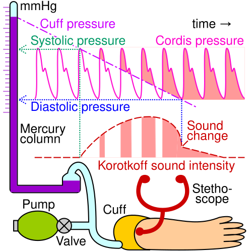

# CADERNETA DE SAÚDE DO IDOSO

A Caderneta de Saúde do Idoso não é apenas um "cartão de vacina gourmet". Se você for para a prova com esse pensamento, vai errar questões de Medicina Preventiva. Ela é, na verdade, um instrumento estratégico de vigilância à saúde e gestão do cuidado na Atenção Primária à Saúde (APS). O Ministério da Saúde a desenhou para ser o elo entre o idoso, sua família e a equipe de saúde, permitindo o acompanhamento longitudinal da capacidade funcional.

Nas provas de residência, o examinador não quer saber apenas se você sabe prescrever anti-hipertensivos. Ele quer saber se você entende o conceito de Envelhecimento Ativo e se sabe utilizar a Caderneta para identificar precocemente o declínio funcional.

## O Cenário Epidemiológico e a Lógica do Instrumento

Para entender por que a Caderneta existe, precisamos olhar para a demografia brasileira. Estamos envelhecendo de forma extremamente rápida. O que a Europa levou 100 anos para processar, o Brasil está fazendo em 30. Isso gera um fenômeno chamado transição epidemiológica: deixamos de morrer majoritariamente por doenças infectocontagiosas e passamos a conviver com doenças crônicas não transmissíveis (DCNT).

Um ponto fundamental que as bancas adoram: a feminização da velhice. Você notará que a longevidade é maior entre as mulheres. Elas vivem mais que os homens, mas cuidado com a pegadinha: embora vivam mais, as mulheres idosas apresentam maiores prevalências de doenças crônicas e incapacidades funcionais. Os homens morrem mais cedo, muitas vezes por causas externas ou doenças cardiovasculares agudas, enquanto as mulheres sobrevivem com mais morbidades.

A Caderneta surge para organizar esse caos. Ela é um documento unificado. Esqueça a ideia de cadernetas separadas por sexo para fins de conduta clínica básica; o instrumento visa o acompanhamento integral, independentemente do gênero, focando na manutenção da autonomia e da independência.

## Comunicação e Acolhimento: Onde o Aluno Perde Pontos

Muitos alunos negligenciam a parte de "Comunicação" achando que é apenas bom senso. Nas questões de prova, isso é cobrado de forma técnica. O acolhimento da pessoa idosa na APS deve ser pautado no respeito à autonomia.

Imagine o seguinte cenário: Seu José, 78 anos, chega à consulta acompanhado da filha. A filha começa a relatar todos os sintomas enquanto Seu José permanece calado. O que você, como médico, deve fazer?
O erro clássico é direcionar a conversa para a filha. A conduta correta, e o que a Caderneta preconiza, é manter o contato visual com o idoso, dirigir as perguntas a ele e validar as informações com o acompanhante apenas se necessário.

### Barreiras na Comunicação Geriátrica

O envelhecimento traz declínios sensoriais naturais (presbiacusia e presbiopia). Por que isso importa na prática?

- **Déficit Auditivo:** Não grite. O idoso com presbiacusia perde primeiro as frequências agudas. Gritar torna a voz mais aguda e distorcida. Fale de frente, de forma clara, em tom moderado.

- **Déficit Visual:** A iluminação do consultório deve ser adequada e o material impresso (como as orientações na Caderneta) deve ter fonte legível.

- **Tempo de Resposta:** O processamento de informações pode ser mais lento. Se você atropelar o paciente com perguntas, ele vai se confundir, e você vai anotar um "déficit cognitivo" que, na verdade, foi erro de técnica propedêutica.

Como o Dr. Will sempre reforça em suas discussões de caso, a individualização da comunicação é o primeiro passo para uma avaliação geriátrica global (AGG) de qualidade. Sem uma boa comunicação, você não preenche a Caderneta corretamente e perde a chance de prevenir um evento catastrófico.

## Avaliação Multidimensional na Caderneta

A Caderneta de Saúde do Idoso estrutura a avaliação em pilares. O objetivo não é apenas diagnosticar doenças (o "quê"), mas entender como essas doenças afetam a vida do indivíduo (o "como").

### Autonomia vs. Independência

Este é o conceito mais importante da geriatria para provas de APS.

- **Autonomia:** É a capacidade de decisão, de autogoverno. Está ligada à cognição e à liberdade. Um idoso em cadeira de rodas pode ter total autonomia se ele decide para onde quer ir e como quer gastar seu dinheiro.

- **Independência:** É a capacidade de execução, de realizar a tarefa sozinho. Está ligada à mobilidade e à função motora.

A Caderneta busca monitorar a **Capacidade Funcional**, que é a interação entre esses dois conceitos. Se o idoso começa a perder independência para atividades básicas (comer, tomar banho, vestir-se), ele está em um processo de fragilização que exige intervenção imediata.

### Avaliação Cognitiva e de Humor

A Caderneta reserva espaço para o rastreio de depressão e demência.

- **Depressão:** Frequentemente subdiagnosticada no idoso porque se apresenta de forma atípica (muitas queixas somáticas, dor crônica, irritabilidade, em vez de tristeza profunda).

- **Cognição:** O uso de instrumentos como o Mini-Exame do Estado Mental (MEEM) ou o Teste do Desenho do Relógio é sugerido para monitorar perdas de memória e orientação.

Cuidado: A banca pode sugerir que qualquer esquecimento é "normal da idade". Isso é erro grave. O envelhecimento traz uma lentificação, mas não a perda de função social ou esquecimentos que geram riscos (como deixar o gás ligado).

## Manejo da Hipertensão Arterial (HAS) no Idoso

*Figura 1 - Diagrama demonstrando o princípio da aferição da pressão arterial sistólica e diastólica com esfigmomanômetro, exame fundamental no acompanhamento do idoso na APS. Fonte: Cmglee, CC BY-SA 4.0 | Wikimedia Commons*

A Caderneta possui campos específicos para o registro da Pressão Arterial (PA). Aqui, a fisiopatologia explica a conduta. Com o envelhecimento, as artérias sofrem um processo de endurecimento (redução da complacência), o que leva à Hipertensão Sistólica Isolada.

### Por que tratar a HAS no idoso?

Antigamente, achava-se que a pressão alta era necessária para "empurrar" o sangue por artérias rígidas. Hoje, as evidências (Diretriz Brasileira de Hipertensão, 2020) mostram que o tratamento reduz drasticamente a incidência de Acidente Vascular Encefálico (AVE), Infarto Agudo do Miocárdio (IAM) e Insuficiência Cardíaca (IC).

### A Pegadinha da Hipotensão Postural

Sempre que você vir uma questão sobre idoso e PA, procure pela medição em pé e sentado. A hipotensão postural (queda da PA sistólica ≥ 20 mmHg ou diastólica ≥ 10 mmHg após 3 minutos em pé) é comum devido à menor sensibilidade dos barorreflexos.

- **Erro de Prova:** Achar que a meta de PA deve ser a mesma para um jovem de 20 anos e um idoso de 85 anos frágil. No idoso frágil, somos mais tolerantes para evitar quedas por hipotensão.

| Categoria | Pressão Sistólica (mmHg) | Pressão Diastólica (mmHg) |
| --- | --- | --- |
| Ótima | < 120 | < 80 |
| Normal | 120 - 129 | 80 - 84 |
| Pré-hipertensão | 130 - 139 | 85 - 89 |
| Hipertensão Estágio 1 | 140 - 159 | 90 - 99 |
| Hipertensão Estágio 2 | 160 - 179 | 100 - 109 |
| Hipertensão Estágio 3 | ≥ 180 | ≥ 110 |

*Nota: Para idosos hígidos, a meta geralmente é < 130/80 mmHg. Para idosos frágeis, a meta pode ser mais flexível (140-150/90 mmHg) para garantir a segurança.*

## Imunização: O Calendário do Idoso na Caderneta

Este é o tópico mais cobrado em provas de Medicina Preventiva relacionadas à Caderneta. O aluno MedEvo precisa ter isso decorado, pois as bancas não perdoam confusões entre as vacinas.

### 1. Influenza (Gripe)

- **Frequência:** Anual.

- **Por que?** Reduz complicações respiratórias e mortalidade por pneumonia e descompensação de doenças cardíacas.

### 2. Pneumocócica 23-valente (VPP23)

- **Indicação na Caderneta/UBS:** Indicada para idosos em condições clínicas especiais (como acamados ou institucionalizados) ou durante campanhas específicas.

- **Esquema:** Geralmente uma dose, com um reforço após 5 anos.

- **Dica de Prova:** Idosos acima de 65 anos que vivem em instituições de longa permanência (ILPI) devem receber a vacina.

### 3. Dupla Adulto (dT - Difteria e Tétano)

- **Esquema:** Completar o esquema de 3 doses se não vacinado. Se já vacinado, reforço a cada 10 anos.

- **Cuidado:** Em caso de ferimentos graves, o intervalo de reforço cai para 5 anos.

### 4. Hepatite B

- **Esquema:** 3 doses (0, 1 e 6 meses) para todos os idosos que não têm comprovação vacinal. Não há limite de idade para essa vacina no SUS.

### 5. Febre Amarela

- **Conduta:** Deve ser avaliada criteriosamente. O risco de eventos adversos graves (doença viscerotrópica) é maior em idosos. Só deve ser feita se o idoso residir ou for viajar para área de risco, após avaliação médica de risco-benefício.

## Prevenção de Quedas e Osteoporose

A Caderneta dedica um espaço considerável para o registro de quedas. Por que? Porque a queda é o marcador de fragilidade por excelência. Uma queda muitas vezes é o início do fim: gera fratura de fêmur, que gera imobilização, que gera pneumonia, que leva ao óbito.

### Rastreamento de Osteoporose

A Caderneta orienta o acompanhamento de fatores de risco.

- **Mulheres:** Rastreamento universal com Densitometria Óssea (DXA) a partir dos 65 anos.

- **Homens:** Rastreamento a partir dos 70 anos.

- **Exceção:** Se houver fatores de risco (tabagismo, uso de corticoide, fratura prévia, baixo peso), o rastreio começa aos 50 anos para ambos.

### Medidas Não-Farmacológicas (MEV)

O examinador adora cobrar o que o médico deve orientar na consulta de APS:

- **Cálcio:** Preferencialmente via dieta (leite e derivados). Meta de 1.200 mg/dia.

- **Vitamina D:** Exposição solar e, se necessário, suplementação (especialmente em idosos institucionalizados).

- **Exercício:** Atividade física de resistência (musculação) e equilíbrio (Tai Chi Chuan) são os melhores para prevenir quedas. A recomendação padrão é de pelo menos 150 minutos de atividade moderada por semana.

## Polifarmácia e Segurança do Paciente

A Caderneta possui uma seção para listar todos os medicamentos em uso. O idoso é o campeão da polifarmácia (uso de 5 ou mais medicamentos).
O problema não é apenas o número de comprimidos, mas a **Cascata Iatrogênica**: o paciente tem um efeito colateral do Remédio A, o médico interpreta como uma nova doença e prescreve o Remédio B para tratar esse efeito colateral.

**Exemplo Clássico:** O idoso usa um bloqueador de canal de cálcio (Anlodipino) para pressão. Tem edema de membros inferiores (efeito colateral). O médico prescreve Furosemida (diurético). O idoso começa a ter incontinência urinária e acorda à noite para urinar (nictúria). Ele cai no escuro e quebra o fêmur.
Tudo começou com uma prescrição que poderia ter sido evitada ou trocada. A Caderneta serve para o médico revisar essa lista em toda consulta.

## Saúde Sexual e DSTs no Idoso

Este é um tema que tem aparecido com frequência crescente. Existe um tabu de que idoso não transa. As bancas exploram isso.

- **Fato:** O número de casos de HIV e Sífilis em idosos tem aumentado.

- **Por que?** Menor uso de preservativos (não há risco de gravidez), resistência cultural e o advento de fármacos para disfunção erétil.

- **Conduta:** O médico deve abordar a saúde sexual de forma natural e oferecer testes rápidos para ISTs, conforme preconizado nas diretrizes de acolhimento da Caderneta.

## Avaliação da Acuidade Visual e Auditiva

A Caderneta sugere o uso da Tabela de Snellen para visão e o Teste do Sussurro para audição.

- **Tabela de Snellen:** Se o idoso não consegue ler a linha 20/40, ele precisa de encaminhamento ao oftalmologista.

- **Impacto:** A correção de um erro refracional ou a remoção de uma catarata é uma das intervenções com maior custo-benefício para prevenir quedas e isolamento social.

## Direitos da Pessoa Idosa e Rede de Apoio

A Caderneta também é um instrumento de cidadania. Ela contém informações sobre o Estatuto do Idoso.

- **Violência Doméstica:** O médico deve estar atento a sinais de maus-tratos (hematomas em locais não usuais, higiene precária, desidratação, medo do acompanhante).

- **Notificação:** A suspeita de violência contra o idoso é de **notificação compulsória**. Não precisa ter certeza; a suspeita já obriga a notificação aos órgãos competentes (Conselho do Idoso, Ministério Público ou Delegacia).

| Tipo de Violência | Sinais de Alerta |
| --- | --- |
| Física | Hematomas, queimaduras, fraturas sem explicação lógica. |
| Psicológica | Isolamento, depressão súbita, medo de falar perto do cuidador. |
| Financeira | Gasto excessivo da aposentadoria por terceiros, falta de recursos para remédios. |
| Negligência | Desnutrição, escaras de decúbito, roupas sujas, privação de óculos/próteses. |

## O Papel da Equipe Multiprofissional

A Caderneta não é de uso exclusivo do médico. O enfermeiro tem papel fundamental no preenchimento dos dados antropométricos e vacinais. O agente comunitário de saúde (ACS) deve verificar se o idoso possui a caderneta e se ela está sendo levada às consultas.

Lembre-se: a Caderneta é um instrumento de **intersetorialidade**. Se o idoso apresenta risco social, a equipe de saúde deve acionar o CRAS (Centro de Referência de Assistência Social).

## Pontos-Chave para Prova

- **Objetivo da Caderneta:** Identificar precocemente o declínio funcional e promover o envelhecimento ativo. Não é apenas um registro vacinal.

- **Feminização da Velhice:** Mulheres vivem mais, porém com maior carga de doenças crônicas e incapacidades (maior morbidade).

- **Autonomia vs. Independência:** Autonomia é decisão (cognição); Independência é execução (mobilidade). A perda de independência nas ABVDs (atividades básicas de vida diária) indica maior gravidade.

- **Comunicação:** Sempre priorizar a fala direta com o idoso. Respeitar o tempo de resposta e adaptar-se aos déficits sensoriais (presbiacusia/presbiopia).

- **Vacina Influenza:** Dose anual para todos os idosos (60+).

- **Vacina Pneumocócica 23:** Não é rotina para todos na UBS; indicada para institucionalizados, acamados ou grupos de risco específicos.

- **Vacina Hepatite B:** 3 doses para todos os idosos sem comprovação vacinal, independentemente da idade.

- **Hipotensão Postural:** Queda de PAS ≥ 20 ou PAD ≥ 10 mmHg após 3 min em pé. Deve ser sempre pesquisada em idosos hipertensos ou com queixa de tontura.

- **Metas de PA:** Individualizar. Idosos hígidos < 130/80 mmHg. Idosos frágeis podem ter metas mais flexíveis para evitar quedas.

- **Osteoporose:** Rastreio com DXA aos 65 anos (mulheres) e 70 anos (homens). Se fatores de risco, iniciar aos 50 anos.

- **Violência contra o Idoso:** A notificação é compulsória em caso de suspeita.

- **Polifarmácia:** Uso de 5 ou mais medicamentos. Sempre revisar a lista para evitar a cascata iatrogênica.

- **Déficits Sensoriais:** A presbiacusia (perda de audição para sons agudos) é a causa mais comum de dificuldade de comunicação.

- **Atividades de Vida Diária:** Lawton (Atividades Instrumentais - ex: usar telefone, gerir dinheiro) e Katz (Atividades Básicas - ex: banho, vestir-se). A perda geralmente começa pelas instrumentais.

- **O que NÃO fazer:** Não ignorar queixas de memória ("é da idade"), não falar apenas com o acompanhante e não prescrever medicamentos sem revisar a lista prévia do paciente. 🩺

 Cópia offline para consulta pessoal.
 Fonte original:
 [https://www.medevo.com.br/material-apoio/ler/5f44352f-6311-425e-b566-ec751cdf2251](https://www.medevo.com.br/material-apoio/ler/5f44352f-6311-425e-b566-ec751cdf2251)
