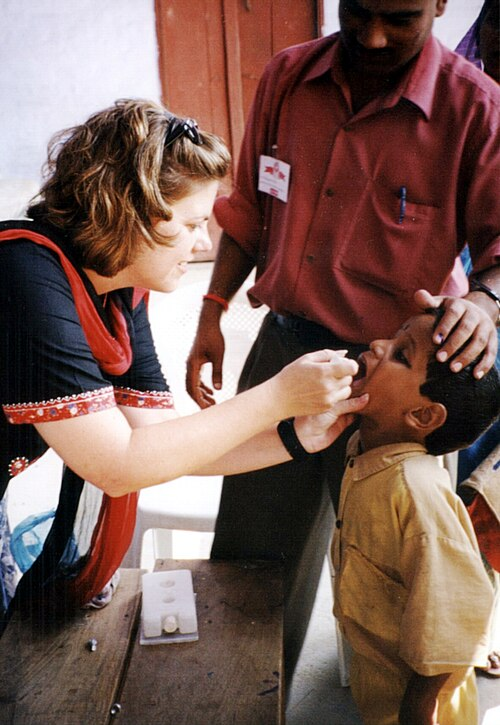
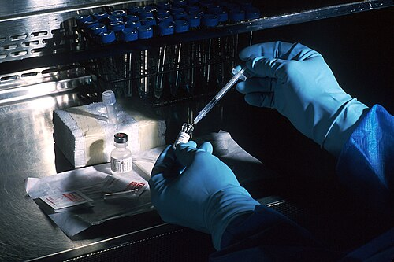

# CALENDÁRIO VACINAL E PRINCIPAIS VACINAS

Para entender vacinação, você precisa parar de tentar decorar uma tabela colorida e começar a entender a lógica do sistema imunológico e da saúde pública. O Programa Nacional de Imunizações (PNI) do Brasil é um dos maiores do mundo, e as bancas de residência amam cobrar as minúcias porque, no dia a dia do posto de saúde, o erro vacinal é um erro de conduta grave.

Aqui no MedEvo, focamos no que realmente cai. Vamos dividir o estudo em três pilares: o tipo de vacina (viva vs. inativada), o calendário cronológico e as situações especiais (atrasos e imunossuprimidos).

## A Lógica das Vacinas: Atenuadas vs. Inativadas

Este é o conceito fundamental. Se você entender isso, você mata metade das questões sobre contraindicações.

As vacinas **vivas atenuadas** contêm o microrganismo vivo, mas "enfraquecido". Elas mimetizam a infecção natural, gerando uma resposta imune robusta, geralmente com menos doses. Por outro lado, as vacinas **inativadas** usam apenas pedaços do vírus/bactéria ou o microrganismo morto. Elas são mais seguras, mas exigem mais reforços.

Por que isso importa? Porque vacina viva não pode ser dada para quem não tem um sistema imune capaz de segurar essa "infecção controlada".

**Tabela 1: Classificação das Vacinas do PNI**

| Tipo de Vacina | Exemplos Principais | Regra de Ouro |
| --- | --- | --- |
| **Vivas Atenuadas** | BCG, Rotavírus, VOP (Sabin), Febre Amarela, Tríplice Viral (SCR), Varicela | Contraindicadas em gestantes e imunossuprimidos graves. |
| **Inativadas / Fragmentadas** | Hepatite B, VIP (Salk), Penta, Pneumo-10, Meningo C/ACWY, Influenza, Hepatite A, HPV | Geralmente seguras em imunossuprimidos (embora a resposta possa ser menor). |

**Dica de Prova:** A vacina do Rotavírus é viva e oral. Se a criança regurgitar ou vomitar após a dose, a orientação oficial do Ministério da Saúde é: **não repetir a dose**. O risco de intussuscepção intestinal é o "fantasma" que as bancas adoram associar a essa vacina.

## O Nascimento e o Primeiro Mês: BCG e Hepatite B

O objetivo aqui é proteção imediata. A BCG protege contra as formas graves de tuberculose (miliar e meníngea), não contra a tuberculose pulmonar em si.

### BCG (Bacilo Calmette-Guérin)

A dose é única e deve ser aplicada o mais precocemente possível.

**O "Pulo do Gato" da BCG:**

- **Peso Mínimo:** Se o recém-nascido (RN) tem menos de 2.000g, você não faz a BCG. Esperamos ele ganhar peso. Isso cai muito em questões de prematuridade.

- **A Cicatriz:** Antigamente, se não formasse cicatriz em 6 meses, revacinava-se. **Esqueça isso.** Segundo a nota informativa atual do Ministério da Saúde, a ausência de cicatriz vacinal não é indicação de revacinação.

- **Contatos de Hanseníase:** Se houver um comunicante de hanseníase no domicílio, a regra muda. Menores de 1 ano já vacinados não precisam de dose extra. Maiores de 1 ano sem cicatriz fazem uma dose; com uma cicatriz, fazem outra dose (intervalo de 6 meses).

- **RN de mãe em uso de imunossupressor:** Se a mãe usou biológicos ou imunossupressores na gestação, a BCG deve ser adiada (geralmente após 6 meses de vida) pelo risco de disseminação do bacilo no bebê.

### Hepatite B (Dose de Nascimento)

Deve ser feita nas primeiras 12 a 24 horas de vida. Se o bebê tiver menos de 2.000g ou menos de 33 semanas de gestação, o esquema muda: ele fará 4 doses (0, 1, 2 e 6 meses), pois a resposta imune do prematuro extremo é errática.

## O Primeiro Semestre: O "Combo" das Proteções

Aos 2, 4 e 6 meses, o lactente recebe o maior volume de antígenos. É aqui que os pais ficam desesperados com as reações febris.

### 2 e 4 Meses (Doses Iguais)

- **Pentavalente:** DTP (Difteria, Tétano, Pertussis) + Hib (Haemophilus influenzae tipo b) + Hepatite B.

- **VIP (Poliomielite Inativada):** O Brasil está em transição para substituir a VOP (gotinha) pela VIP em todas as doses.

- **Pneumocócica 10-valente:** Protege contra os sorotipos mais comuns de pneumonia e meningite pneumocócica.

- **Rotavírus Humano:** Atenção rigorosa aos prazos!

**ATUALIZAÇÃO 2024 (Nota Técnica 193/2024):** Os limites de idade do Rotavírus foram **ampliados** para aumentar cobertura vacinal!

| Dose | LIMITE ANTIGO (até 2024) | LIMITE NOVO (dez/2024) |
| --- | --- | --- |
| **1ª dose** | Até 3 meses e 15 dias | **1m15d até 11m29d** |
| **2ª dose** | Até 7 meses e 29 dias | **3m15d até 23m29d** |

**Atenção:** Se a prova mencionar limites antigos (3m15d/7m29d), responda conforme o ano da diretriz citada. Se não especificar, use os novos limites.
**Intervalo mínimo:** 30 dias entre as doses.
**Vacina:** VORH (monovalente, via oral, viva atenuada).

### 3 e 5 Meses

- **Meningocócica C:** Apenas ela nestes meses. Lembre-se que no PNI usamos a C conjugada para bebês, enquanto a ACWY fica para os adolescentes.

### 6 Meses

- **Pentavalente (3ª dose)**

- **VIP (3ª dose)**

- **Influenza:** Entra no calendário anual (campanhas). Na primeira vez que a criança toma, ela recebe duas doses com intervalo de 30 dias.

## O Segundo Semestre e o Segundo Ano: Reforços e Vírus

Aos 9 meses, temos a **Febre Amarela**. No Brasil, devido à epidemiologia, a recomendação é uma dose aos 9 meses e um reforço aos 4 anos.

### 12 Meses (O "Aniversário" Vacinal)

- **Tríplice Viral (SCR):** Sarampo, Caxumba e Rubéola (1ª dose).

- **Pneumo-10:** Reforço.

- **Meningo C:** Reforço.

### 15 Meses

- **Hepatite A:** Dose única (no PNI). A Sociedade Brasileira de Pediatria (SBP) recomenda duas doses, mas para prova de residência focada em PNI, é dose única.

- **DTP:** 1º reforço (aqui usamos a tríplice bacteriana, pois a HepB e Hib já foram completadas na Penta).

- **VIP (4ª dose)** No novo calendario a VOP foi substituida pela VIP

- **Tetraviral:** SCR + Varicela.

**Dica do Dr. Will:** Se houver surto de sarampo, o Ministério da Saúde pode recomendar a "Dose Zero" para crianças de 6 a 11 meses. Essa dose **não conta** para o esquema de rotina. A criança ainda precisará das doses de 12 e 15 meses.

### 4 Anos

- **DTP:** 2º reforço.

- **VOP:** 2º reforço.

- **Febre Amarela:** Reforço.

- **Varicela:** 2ª dose.

## Adolescência: HPV e Meningo ACWY

A vacinação do adolescente é um tema quente em provas de Saúde Pública.

- **HPV:** A maior mudança recente (2024). O esquema agora é de **dose única** para meninos e meninas de 9 a 14 anos. O objetivo é aumentar a cobertura vacinal. Imunossuprimidos, vítimas de violência sexual e pacientes com papilomatose respiratória recorrente ainda seguem esquemas de 3 doses (0, 2 e 6 meses) até os 45 anos.

- **Meningocócica ACWY:** Dose única ou reforço entre 11 e 14 anos. Mesmo que a criança tenha tomado Meningo C na infância, ela deve receber a ACWY nesta faixa etária.

- **dT (Dupla Adulto):** Reforço a cada 10 anos. Em caso de ferimentos graves, esse intervalo cai para 5 anos.

**Tabela 2: Resumo de Reforços e Idades Limite**

| Vacina | Idade do Reforço / Dose Única | Observação de Prova |
| --- | --- | --- |
| **Hepatite A** | 15 meses | Dose única no PNI; 2 doses na SBP. |
| **HPV** | 9 a 14 anos | Dose única (Atualização 2024). |
| **Meningo ACWY** | 11 a 14 anos | Substitui o reforço da Meningo C nesta idade. |
| **Febre Amarela** | 9 meses e 4 anos | Dose única após os 5 anos se nunca vacinado. |

## Manejo de Sintomas e Antitérmicos

Muitos alunos erram questões de posologia básica. O professor médico sabe que, na prática, você vai prescrever isso todo dia.

- **Paracetamol:** 10 a 15 mg/kg/dose. (Apresentação 200mg/ml: 1 gota por kg).

- **Dipirona:** 10 a 20 mg/kg/dose.

- **Ibuprofeno:** 5 a 10 mg/kg/dose.

**Contraindicação Absoluta:** Nunca use **AAS (Ácido Acetilsalicílico)** em crianças com quadros virais (especialmente Influenza ou Varicela) devido ao risco de **Síndrome de Reye**, uma encefalopatia aguda com degeneração gordurosa do fígado que é altamente fatal. As bancas amam colocar o AAS como opção para "febre pós-vacinal de varicela". Não caia nessa.

## Situações Especiais e Contraindicações

Aqui é onde o aluno "decorador" se perde e o aluno que entende o "porquê" brilha.

### Imunossuprimidos e Corticoterapia

Crianças em uso de corticoide em doses imunossupressoras não podem receber vacinas vivas. O que é dose imunossupressora?

- Prednisona (ou equivalente) ≥ 2 mg/kg/dia ou > 20 mg/dia por mais de 14 dias.
Após suspender o corticoide, deve-se esperar pelo menos **30 dias** para aplicar vacinas vivas.

### Esquemas Atrasados (Catch-up)

Se uma criança chega com o esquema atrasado, a regra geral é: **não se reinicia esquema vacinal**. Você apenas completa de onde parou.

- **Exceção:** Se a criança tem mais de 7 anos e nunca tomou a Pentavalente, você não dá a Penta (que tem o componente Pertussis de células inteiras, muito reatogênico para crianças maiores). Você usa a **dT** (dupla adulto) e complementa a Hepatite B separadamente.

### Prematuros

Prematuros devem ser vacinados de acordo com a **idade cronológica**, não a idade corrigida. A única exceção real, como vimos, é o peso para BCG e a estratégia de 4 doses para Hepatite B se < 2.000g.

## Eventos Adversos Pós-Vacinais (EAPV)

A maioria dos eventos é leve (febre, dor local). No entanto, alguns exigem mudança de conduta:

- **Episódio Hipotônico-Hiporresponsivo (EHH):** Ocorre geralmente após a Pentavalente (componente Pertussis). A criança fica pálida, flácida e não responde a estímulos. Conduta: A próxima dose deve ser feita com a **DTPa (Acelular)**.

- **Convulsão Febril:** Também associada ao componente Pertussis. Conduta: Próxima dose com **DTPa**.

- **Encefalopatia nos primeiros 7 dias:** Conduta: Contraindicação definitiva ao componente Pertussis. A criança deve completar o esquema com **DT (Dupla Infantil)**.

**Tabela 3: Substituição do Componente Pertussis (Penta/DTP)**

| Evento Adverso | Conduta na Próxima Dose |
| --- | --- |
| Febre alta, dor local intensa | Manter DTP + Antitérmico profilático. |
| Episódio Hipotônico-Hiporresponsivo | Substituir por **DTPa** (Acelular). |
| Convulsão nas primeiras 72h | Substituir por **DTPa** (Acelular). |
| Encefalopatia nos primeiros 7 dias | Substituir por **DT** (Dupla Infantil - sem Pertussis). |

## Vacinação de Resgate e Bloqueio

Em situações de surto, a epidemiologia manda mais que o calendário.

- **Bloqueio de Sarampo:** Deve ser feito em até 72 horas após o contato com o caso suspeito, em pessoas acima de 6 meses de idade que não tenham comprovação vacinal.

- **Bloqueio de Varicela:** Pode ser feito em até 120 horas (5 dias) após o contato. Se a criança for imunossuprimida ou gestante (contatos suscetíveis), usa-se a Imunoglobulina específica (VZIG) em até 96 horas.

Lembre-se: Vacina é imunização **ativa** (você produz a defesa). Imunoglobulina é imunização **passiva** (você recebe o anticorpo pronto). A passiva é para quando não há tempo ou capacidade de produzir resposta.

## Fisiopatologia da Resposta Vacinal

Por que a Pentavalente dói tanto e dá tanta febre? O componente *Bordetella pertussis* de células inteiras contém endotoxinas que estimulam uma cascata de citocinas pró-inflamatórias (IL-1, IL-6, TNF-alfa). Isso é necessário para "acordar" o sistema imune, mas causa os efeitos colaterais. A vacina acelular (DTPa) purifica esses antígenos, retirando a maior parte das endotoxinas, por isso é menos reatogênica.

Já as vacinas de RNAm (como algumas de COVID-19) ou de vetor viral funcionam ensinando nossas próprias células a produzir a proteína do vírus, que então é reconhecida pelo sistema imune. Entender que a vacina é um "treinamento" para o sistema imunológico ajuda a explicar ao pai por que a febre baixa após a vacina não é uma doença, mas um sinal de que o corpo está "trabalhando".

## Pontos-Chave para Prova 💉

- **BCG:** Não revacinar se não houver cicatriz. Peso mínimo de 2.000g para aplicação.

- **Rotavírus:** Limites rígidos (1ª dose até 3m15d; 2ª dose até 7m29d). Contraindicada se história de malformação intestinal não corrigida ou intussuscepção prévia.

- **Hepatite B:** RN < 2.000g ou < 33 semanas faz esquema de 4 doses (0, 1, 2 e 6 meses).

- **Pentavalente:** DTP + Hib + HepB. Usada até os 6 anos, 11 meses e 29 dias.

- **HPV:** Dose única para 9-14 anos (PNI 2024). Imunossuprimidos mantêm 3 doses.

- **Meningo ACWY:** Adolescentes de 11 a 14 anos, independente do histórico vacinal.

- **Febre Amarela:** Vacina viva. Dose aos 9 meses e 4 anos. Contraindicada para mulheres amamentando bebês < 6 meses (se vacinar, suspender amamentação por 10-15 dias).

- **Tríplice Viral:** 12 meses (SCR) e 15 meses (SCR + Varicela = Tetraviral).

- **Atraso Vacinal:** Nunca reiniciar esquema, apenas completar. Se > 7 anos, trocar Penta por dT + HepB.

- **EHH e Convulsão:** Indica substituição da DTP pela DTPa (acelular).

- **Encefalopatia pós-DTP:** Contraindicação absoluta ao componente Pertussis (usar DT).

- **AAS em Pediatria:** Proibido em quadros virais/pós-vacinais de vírus vivos pelo risco de Síndrome de Reye.

- **Corticoterapia:** Dose imunossupressora (2mg/kg/dia por >14 dias) contraindica vacinas vivas até 30 dias após o término.

- **Vacinas Vivas e Intervalo:** Se não aplicadas no mesmo dia, respeitar intervalo de 30 dias entre duas vacinas vivas parenterais (ex: Febre Amarela e Tríplice Viral).

- **Hepatite A:** No PNI é dose única aos 15 meses. Limite de idade para resgate é até 4 anos, 11 meses e 29 dias.

- **Pneumo-10:** Esquema 2 + 1 (2, 4 e reforço aos 12 meses). Se a criança chegar com 1-4 anos sem vacina, faz dose única.

 Cópia offline para consulta pessoal.
 Fonte original:
 [https://www.medevo.com.br/material-apoio/ler/3eef00e7-615c-4b41-b0b7-7c1b12f9c6e1](https://www.medevo.com.br/material-apoio/ler/3eef00e7-615c-4b41-b0b7-7c1b12f9c6e1)
