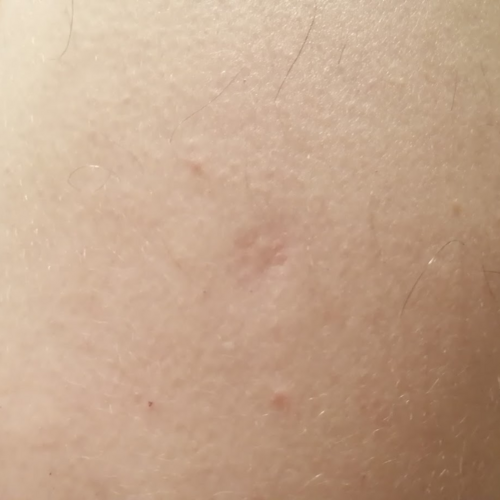
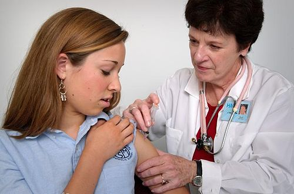

# CALENDÁRIO VACINAL

Para entender o calendário vacinal, você não pode olhar para ele como uma lista de compras que precisa decorar. Se você tentar decorar, vai esquecer na hora da prova ou, pior, vai confundir as idades. O segredo aqui é entender a lógica do Programa Nacional de Imunizações (PNI) e as pequenas diferenças para o calendário da Sociedade Brasileira de Pediatria (SBP).

O PNI é desenhado para saúde pública: proteger a massa, focar nas doenças que mais matam ou deixam sequelas no Brasil, com o melhor custo-benefício. A SBP, por outro lado, foca na proteção individual máxima, oferecendo vacinas que o PNI ainda não consegue cobrir em larga escala ou utilizando tecnologias com menos efeitos adversos (como as vacinas acelulares).

## A Lógica das Vacinas: Vivas vs. Inativadas

Antes de falarmos de meses e anos, você precisa dominar a diferença entre vacinas de vírus/bactérias vivos atenuados e vacinas inativadas. Isso responde metade das questões sobre contraindicações.

As vacinas vivas (BCG, Rotavírus, Febre Amarela, Tríplice Viral, Varicella e VOP histórica) simulam uma infecção leve. Por isso, elas são o grande problema em pacientes imunossuprimidos ou gestantes. Observação importante: a VOP/gotinha foi retirada do calendário infantil de rotina em 2024, substituída por VIP nos reforços; ela pode aparecer em questões antigas ou em discussões históricas/campanhas, mas não deve ser colocada como reforço de rotina atual.

As vacinas inativadas (Penta, VIP, Pneumocócica, Meningocócica, Hepatite A, Influenza, HPV) são "mortas". Elas não causam a doença, mas precisam de mais doses e reforços para manter a memória imunológica.

Aqui entra uma regra de ouro que o Dr. Will sempre reforça: se você tem duas vacinas vivas parenterais (como Tríplice Viral e Febre Amarela), ou você as aplica no mesmo dia, ou precisa de um intervalo de 30 dias entre elas. Se aplicar com 15 dias, a interferência imunológica fará com que a segunda dose não funcione.

## O Nascimento: O Primeiro Contato

Ao nascer, o bebê deve receber duas vacinas: BCG e Hepatite B.

### BCG (Bacilo Calmette-Guérin)

*Figura 1 - Cicatriz vacinal típica da BCG no ombro esquerdo do paciente. A presença da cicatriz era antigamente critério para revacinação, mas a norma atual não recomenda revacinar. Fonte: Glebushko0703, CC0 | Wikimedia Commons*

A BCG protege contra as formas graves de tuberculose (miliar e meníngea). Ela não evita a tuberculose pulmonar clássica, e isso é uma pegadinha comum.

A evolução da lesão é clássica: pápula, pústula, úlcera (4 a 10 mm) e, finalmente, a cicatriz. Se a criança apresentar uma úlcera ou secreção, a orientação é apenas água e sabão. Nada de pomadas ou curativos.

**Atenção para a mudança de conduta:** Antigamente, se não houvesse cicatriz após 6 meses, revacinávamos. Segundo a nota informativa atual do Ministério da Saúde, se a criança foi vacinada e não tem cicatriz, **NÃO** se revacina mais. Considera-se imunizada.

Outro ponto de prova: linfadenopatia axilar ou supraclavicular. Se for menor que 3 cm, indolor e sem sinais inflamatórios (não supurado), a conduta é apenas observação. Se houver supuração ou for maior que 3 cm, pensamos em complicações e tratamento específico.

### Hepatite B

Deve ser aplicada nas primeiras 12 a 24 horas de vida. Por que tão cedo? Para evitar a transmissão vertical caso a mãe seja portadora do vírus (HBsAg positivo). Se a mãe for sabidamente positiva, além da vacina, o recém-nascido deve receber a Imunoglobulina Específica (HBIG) preferencialmente nas primeiras 12 horas.

## O Primeiro Semestre: O "Pesadelo" dos 2, 4 e 6 Meses

Este é o período com maior carga de antígenos. O examinador adora cobrar o que acontece aos 2 e 4 meses, pois as vacinas são idênticas.

### 2 e 4 Meses

- **Pentavalente:** DTP (Difteria, Tétano, Pertussis) + Hepatite B + Hib (Haemophilus influenzae tipo b).

- **VIP (Vacina Inativada Poliomielite):** Via intramuscular. A "gotinha" (VOP) foi **eliminada do calendário em nov/2024**. Agora é VIP em todas as doses (2,4,6m + reforço 15m).

- **Pneumocócica 10-valente:** Protege contra os principais sorotipos de pneumococo.

- **Rotavírus (VORH):** Vacina viva, oral.

**ATUALIZAÇÃO PNI/MS - Rotavírus:** os limites de idade foram **ampliados** no calendário infantil oficial!

- **1ª dose:** Mínimo 1m15d → **Máximo 11m29d** (era 3m15d)

- **2ª dose:** Mínimo 3m15d → **Máximo 23m29d** (era 7m29d)

- Intervalo mínimo entre doses: 30 dias

⚠️ **Atenção em provas:** Se o enunciado mencionar limites antigos (3m15d/7m29d), siga a diretriz citada. Se não especificar ano, use os novos limites.

### 3 e 5 Meses

Aqui o calendário dá um "descanso" e foca na **Meningocócica C**. No PNI atual, são doses aos 3 e 5 meses; aos 12 meses, o reforço do calendário infantil do MS aparece como **Meningocócica ACWY**. A SBP também valoriza ACWY desde cedo, mas com esquemas próprios e, em geral, mais amplos que o PNI.

### 6 Meses

Repetimos a **Pentavalente** e a **VIP**.
*Nota importante:* A Pneumo 10 e a Meningo C não têm dose aos 6 meses no PNI (os reforços vêm mais tarde). Aos **6 meses**, o calendário infantil do MS traz **Penta 3ª dose + VIP 3ª dose + Influenza trivalente 1ª dose + COVID-19 1ª dose**. Para COVID-19, o esquema depende do imunizante disponível: pode ser 2 doses (ex.: Spikevax aos 6 e 7 meses) ou 3 doses (ex.: Comirnaty aos 6, 7 e 9 meses), conforme nota do calendário oficial.

## O Segundo Semestre e o Primeiro Ano

Aos 9 meses, temos a **Febre Amarela**. Lembre-se: em áreas de risco ou conforme a atualização do PNI que expandiu a recomendação para quase todo o Brasil.

### 12 Meses: O Reforço e a Virada

Aos 12 meses, o sistema imune da criança já está mais maduro para responder a vacinas virais mais complexas.

- **Tríplice Viral (SCR):** Sarampo, Caxumba e Rubéola. É a primeira dose.

- **Pneumocócica 10:** Reforço.

- **Meningocócica ACWY:** reforço do calendário infantil atual do MS.

**Dica de Prova:** A SBP recomenda a Hepatite A aos 12 meses. O PNI coloca a Hepatite A apenas aos 15 meses. Fique atento ao enunciado: se ele pede "conforme o Ministério da Saúde", Hepatite A é aos 15 meses.

### 15 Meses: O "Check-up" de Reforços

- **DTP:** Primeiro reforço (aqui usamos a tríplice bacteriana, pois a Hep B e Hib já foram completadas na Penta).

- **VIP (Vacina Inativada Poliomielite):** Desde nov/2024, o reforço também é com VIP (a "gotinha" VOP foi eliminada do calendário).

- **Tetraviral:** SCR + Varicela.

- **Hepatite A:** Dose única no PNI.

### 4 Anos

- **DTP:** Segundo reforço.

- **Varicela:** Segunda dose (atenuada).

- **Febre Amarela:** Reforço.

⚠️ **MUDANÇA 2024:** A dose de reforço com VOP aos 4 anos foi eliminada! O esquema poliomielite agora termina com VIP aos 15 meses.

## Tabela 1: Resumo do Calendário PNI (0-4 anos)

| Idade | Vacinas |
| --- | --- |
| Ao nascer | BCG + Hepatite B |
| 2 meses | Penta + VIP + Pneumo 10 + Rotavírus |
| 3 meses | Meningo C |
| 4 meses | Penta + VIP + Pneumo 10 + Rotavírus |
| 5 meses | Meningo C |
| 6 meses | Penta + VIP + Influenza trivalente (1ª dose) + COVID-19 (início) |
| 7 meses | COVID-19 |
| 9 meses | Febre Amarela + COVID-19 |
| 12 meses | Tríplice Viral + Pneumo 10 (R) + Meningo ACWY (R) |
| 15 meses | DTP (R) + **VIP (R)** + Hepatite A + Tetraviral |
| 4 anos | DTP (R) + Varicela + Febre Amarela (R) |

**⚠️ ATUALIZAÇÃO NOV/2024:** VOP foi substituída por VIP em todo o esquema (incluindo reforços). Não há mais dose de poliomielite aos 4 anos.

## Eventos Adversos: O Medo da Pertussis

A vacina Pentavalente (ou a DTP) é a campeã de queixas em provas. O culpado é quase sempre o componente **Pertussis de células inteiras (DTPw)**. Ele é altamente imunogênico, mas também muito reatogênico.

Você precisa saber a escada de conduta para eventos adversos da DTP:

- **Febre alta e dor local:** Conduta padrão, antitérmico e orientação. Não se faz antitérmico profilático (pode reduzir a resposta imune).

- **Choro persistente e inconsolável (mais de 3 horas):** É assustador para os pais, mas a conduta para as próximas doses é manter a mesma vacina (DTPw).

- **Episódio Hipotônico-Hiporresponsivo (EHH) ou Convulsão:** Aqui a regra muda. O EHH ocorre nas primeiras 48h e a criança fica "molinha", pálida e cianótica. Nestes casos, a próxima dose deve ser com a **DTPa (Acelular)**.

- **Encefalopatia nos primeiros 7 dias:** Este é o evento mais grave. Contraindica totalmente o componente Pertussis. A criança deverá receber apenas a **DT (Dupla Infantil)** nas próximas doses.

## Vacinação em Atraso e Esquemas de Resgate

Este é o tema que separa quem passa de quem fica. O examinador coloca uma criança de 2 anos que nunca vacinou e pergunta o que fazer.

**Regra número 1:** Nunca se reinicia esquema vacinal. Dose aplicada é dose contada.
**Regra número 2:** Respeite os intervalos mínimos (geralmente 30 dias entre doses da mesma vacina).

Se uma criança de 3 anos chega sem nenhuma vacina:

- Ela não toma mais Rotavírus: pelos limites atuais do PNI/MS, a 1ª dose vai até 11m29d e a 2ª até 23m29d; aos 3 anos, passou do limite máximo.

- Ela não toma mais Pneumo 10 ou Meningo C no esquema de bebê; ela fará esquemas de resgate (geralmente dose única ou duas doses dependendo da idade).

- Ela precisa de VIP, Penta, Febre Amarela, Tríplice Viral e Hepatite A.

No MedEvo, sempre ensinamos: olhe para a idade atual e veja o que é obrigatório para aquela faixa etária. Se a criança tem mais de 5 anos e nunca tomou BCG, e não tem cicatriz, você só vacina se ela for contato de paciente com hanseníase. Caso contrário, o PNI não recomenda mais a BCG para maiores de 5 anos sem indicação específica.

## Situações Especiais: Prematuros e Imunodeprimidos

### Prematuros

O prematuro deve ser vacinado de acordo com a **idade cronológica**, não a idade corrigida. O peso importa apenas para a BCG: o bebê deve ter pelo menos **2.000g** para receber a BCG. Se nasceu com 1.800g, esperamos ele ganhar peso. A Hepatite B, porém, é feita na primeira dose independente do peso, mas atenção: se o bebê tiver menos de 2.000g ou menos de 33 semanas, a dose de Hep B do nascimento não é contada como parte do esquema de 3 doses; ele precisará de mais 3 doses (totalizando 4).

### Imunodeprimidos e Corticoides

Vacinas vivas são proibidas em imunodepressão grave. Mas o que define isso para a prova?

- **Corticoides:** Dose maior ou igual a 2 mg/kg/dia (para crianças) ou 20 mg/dia (para adultos) por mais de 14 dias. Se o paciente usou essa dose, ele é considerado imunossuprimido. Deve-se esperar pelo menos 30 dias após a interrupção do corticoide para aplicar vacinas vivas.

- **HIV:** Crianças com HIV podem receber vacinas vivas (como Tríplice Viral e Varicela) se não estiverem com imunossupressão grave (baseado na contagem de CD4). A BCG é indicada apenas para RN de mães HIV positivas se a criança estiver assintomática; se já apresentar sinais de AIDS, a BCG é contraindicada.

## Adolescentes: HPV e Meningo ACWY

O calendário do adolescente sofreu atualizações importantes que as bancas amam.

### HPV (Papilomavírus Humano)

A maior mudança recente: o PNI adotou a **dose única** para meninos e meninas de 9 a 14 anos. O objetivo é aumentar a cobertura vacinal. Se o adolescente tem imunossupressão, o esquema permanece em 3 doses (0, 2 e 6 meses).
Lembre-se: a vacina é a quadrivalente (tipos 6, 11, 16 e 18). Se a paciente já teve lesão por HPV ou atividade sexual, ela **ainda deve ser vacinada**, pois a vacina protege contra outros tipos que ela ainda não teve contato.

### Meningocócica ACWY

O PNI oferece uma dose de reforço ou dose única para adolescentes de 11 a 14 anos. Por que nessa idade? Porque os adolescentes são os maiores portadores assintomáticos de meningococo na orofaringe. Vaciná-los cria imunidade de rebanho, protegendo indiretamente os bebês e idosos.

## Tabela 2: Contraindicações Absolutas vs. Falsas Contraindicações

| Contraindicação Real (Absoluta) | Falsa Contraindicação (Pode Vacinar) |
| --- | --- |
| Anafilaxia em dose anterior | Doença aguda leve (coriza, tosse leve) |
| Imunodeficiência grave (para vacinas vivas) | Uso de antibióticos |
| Gestação (para vacinas vivas) | História familiar de eventos adversos |
| Encefalopatia pós-DTP (para Pertussis) | Prematuridade (exceto peso para BCG) |
| Intussuscepção prévia (para Rotavírus) | Alergia leve ao ovo (exceto anafilaxia grave) |

Muitos alunos erram ao achar que uma criança com febre baixa ou "resfriadinho" não pode vacinar. Pode e deve. O atraso vacinal por motivos banais é um dos grandes responsáveis pela queda das coberturas no Brasil.

## Vacina da Gripe (Influenza)

A vacina da gripe é sazonal e muda todo ano conforme as cepas circulantes (geralmente duas cepas A e uma ou duas B).

- **Idade mínima:** 6 meses.

- **Esquema inicial:** Na primeira vez que a criança vacina (entre 6 meses e 8 anos), ela deve receber duas doses com intervalo de 30 dias. Nos anos seguintes, apenas uma dose anual.

## Profilaxia Pós-Exposição: Tétano e Raiva

Embora façam parte da imunização, elas costumam cair em contextos de pronto-socorro.

### Tétano

Se o paciente sofre um ferimento, você olha duas coisas: o tipo do ferimento (limpo vs. sujo/alto risco) e o histórico vacinal.

- Se o paciente tem esquema completo e a última dose foi há menos de 5 anos: Não faz nada.

- Se o ferimento é de alto risco (terra, prego enferrujado, mordedura) e a última dose foi há mais de 5 anos: Faz reforço de vacina.

- Se o paciente tem esquema incerto ou incompleto: Vacina sempre. Se o ferimento for de alto risco, além da vacina, faz o **Soro Antitetânico (SAT)** ou Imunoglobulina (IGAT).

### Raiva

A conduta depende do animal (cão/gato vs. animais silvestres) e do estado do animal (sadio, suspeito ou raivoso).

- Animal silvestre (morcego, macaco, raposa): Sempre é acidente grave. Vacina + Soro.

- Cão/Gato sadio que pode ser observado: Observa por 10 dias. Se o animal permanecer bem, não faz nada. Se ele sumir ou adoecer, inicia esquema.

## O Desafio do Calendário Atrasado (Catch-up)

Imagine um lactente de 8 meses que só tomou as vacinas do nascimento. O que ele precisa agora?
Ele precisa "correr atrás" da Penta, VIP, Pneumo 10 e Meningo C.

- Ele pode tomar Rotavírus? **Sim, se ainda estiver dentro dos limites ampliados do PNI/MS:** 1ª dose de **1 mês e 15 dias até 11 meses e 29 dias**; 2ª dose de **3 meses e 15 dias até 23 meses e 29 dias**, com intervalo mínimo de 30 dias. Portanto, um lactente de 8 meses ainda pode iniciar a 1ª dose se não houver contraindicação. Uma criança de 3 anos, por outro lado, já passou do limite máximo e não deve iniciar/continuar rotavírus de rotina.

- Ele toma a 1ª dose de Penta e VIP agora, a 2ª daqui a 60 dias e a 3ª 60 dias após a segunda.

- A Pneumo 10 ele fará duas doses com intervalo de 2 meses e o reforço após os 12 meses.

O examinador vai tentar te confundir com os intervalos. Lembre-se que o intervalo padrão entre doses é de 60 dias, mas o intervalo **mínimo** permitido em situações de atraso é de 30 dias.

## Tabela 3: Diferenças PNI vs. SBP (Principais)

| Vacina | PNI (Ministério da Saúde) | SBP (Pediatria) |
| --- | --- | --- |
| **Hepatite A** | 1 dose (15 meses) | 2 doses (12 e 18 meses) |
| **Varicela** | 2 doses (15 meses e 4 anos) | 2 doses (12 e 15 meses) |
| **Meningo ACWY** | Reforço aos 12 meses no calendário infantil atual + dose/reforço em adolescentes (11-14 anos) | Desde os 3 meses de idade, em esquema mais amplo |
| **Meningo B** | Não disponível na rotina | 2 ou 3 doses no primeiro ano |
| **Pneumocócica** | 10-valente | 13-valente ou 15-valente |
| **Pertussis** | Células inteiras (Penta/DTP) | Acelular (menos efeitos colaterais) |

A SBP recomenda a vacina de Hepatite A em duas doses porque a proteção a longo prazo é melhor estabelecida com o reforço. O PNI usa dose única por uma questão de logística e custo, entendendo que já confere uma proteção populacional importante.

## Pontos-Chave para Prova

- **BCG:** Não se revacina mais se não houver cicatriz. Peso mínimo de 2.000g. Protege contra formas graves (miliar/meníngea), não contra a forma pulmonar.

- **Rotavírus:** limites atuais do PNI/MS foram ampliados: 1ª dose de 1m15d até 11m29d; 2ª dose de 3m15d até 23m29d; intervalo mínimo de 30 dias. Criança de 3 anos não inicia/continua rotavírus. História de intussuscepção é contraindicação absoluta.

- **DTP/Pentavalente:** Episódio Hipotônico-Hiporresponsivo (EHH) ou convulsão pós-vacina -> trocar por DTPa (acelular). Encefalopatia -> trocar por DT (sem pertussis).

- **Vacinas Vivas:** Proibidas em gestantes e imunossuprimidos graves. Se não aplicadas no mesmo dia, intervalo de 30 dias entre elas (especialmente Tríplice Viral e Febre Amarela).

- **Febre Amarela:** Dose aos 9 meses e reforço aos 4 anos. Se a primeira dose for após os 5 anos, dose única.

- **HPV:** Dose única para meninos e meninas de 9 a 14 anos no PNI.

- **Poliomielite:** esquema atual de rotina é VIP aos 2, 4 e 6 meses + reforço com VIP aos 15 meses. A VOP/gotinha foi substituída no calendário infantil de rotina; não coloque VOP como reforço atual.

- **Corticoides:** Dose imunossupressora é ≥ 2 mg/kg/dia ou 20 mg/dia por > 14 dias. Aguardar 30 dias após o término para vacinas vivas.

- **Imunoglobulinas:** Podem interferir em vacinas de vírus vivos (SCR e Varicela). O intervalo de espera varia de 3 a 11 meses dependendo da dose recebida.

- **Hepatite B no RN:** Se a mãe for HBsAg+, fazer vacina + imunoglobulina (HBIG) nas primeiras 12 horas, em membros diferentes.

- **Anafilaxia ao ovo:** Contraindica vacina da Influenza e Febre Amarela se a reação for grave. A Tríplice Viral hoje é considerada segura para a maioria dos alérgicos ao ovo, pois o vírus é cultivado em fibroblastos de galinha, não na clara do ovo diretamente.

- **Esquema de Tétano:** Ferimento limpo só ganha reforço se a última dose foi há mais de 10 anos. Ferimento sujo ganha reforço se a última dose foi há mais de 5 anos.

- **Adolescente ACWY:** Dose única ou reforço entre 11 e 14 anos.

- **Vacina COVID-19:** incorporada ao PNI para crianças de 6 meses a 4 anos, 11 meses e 29 dias. O calendário oficial admite esquema de 2 doses ou 3 doses conforme o imunizante disponível; para prova, saiba que começa aos 6 meses e não esqueça a associação com influenza nessa idade.

- **Linfadenite pós-BCG:** Se < 3cm e não supurada, apenas observação. Se supurada ou > 3cm, tratar com Isoniazida. 💉

 Cópia offline para consulta pessoal.
 Fonte original:
 [https://www.medevo.com.br/material-apoio/ler/f94ae06b-3532-4fa7-9792-a30a03f1bdba](https://www.medevo.com.br/material-apoio/ler/f94ae06b-3532-4fa7-9792-a30a03f1bdba)
