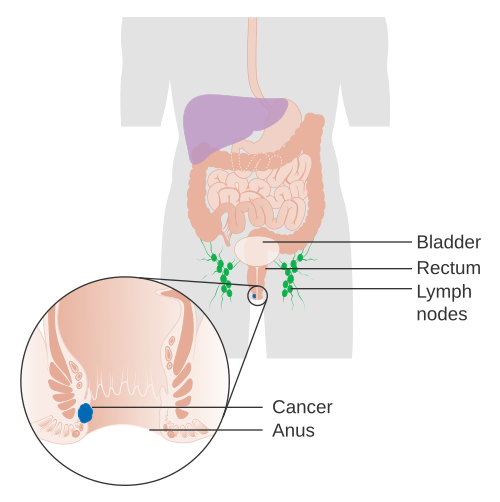
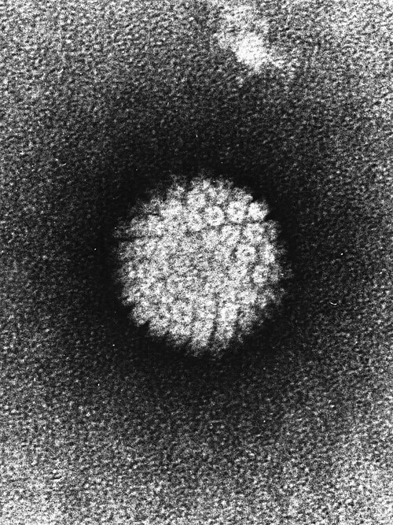

# CÂNCER ANAL

Para começar nosso estudo, você precisa virar uma chave mental: esqueça a lógica do câncer de cólon. No cólon e no reto, a cirurgia costuma ser a protagonista. No **câncer de canal anal**, o bisturi é o coadjuvante que só entra em cena se o tratamento principal falhar. Se você entender essa diferença de paradigma logo de cara, já vai acertar metade das questões de prova.

O câncer anal é uma doença relativamente rara quando comparada ao câncer colorretal, mas sua incidência vem subindo, especialmente em grupos de risco. E é exatamente aqui que as bancas de residência focam: nos fatores de risco e no tratamento que preserva o esfíncter.

## Anatomia e Definições Cruciais

*Figura 1 - Diagrama anatômico do canal anal demonstrando a localização do tumor em estágio inicial, com as camadas da parede anal e estruturas adjacentes. Fonte: Cancer Research UK, CC BY-SA 4.0 | Wikimedia Commons*

Antes de falarmos de tumor, precisamos saber onde ele está. A anatomia aqui define o tratamento e o prognóstico. Dividimos didaticamente em dois locais:

- **Canal Anal:** Vai da junção anorretal (linha anorretal) até a margem anal (onde a pele pigmentada e com fâneros começa). É revestido por mucosa e epitélio de transição.

- **Margem Anal:** É a pele perianal, num raio de aproximadamente 5 cm a partir da abertura anal.

**Por que isso importa?**
Tumores da **margem anal** costumam se comportar como cânceres de pele (carcinoma espinocelular de pele) e, se pequenos, podem ser tratados com ressecção local. Já os tumores do **canal anal** são mais agressivos, drenam para linfonodos diferentes e o tratamento padrão é a radioquimioterapia.

### A Zona de Transição (Cloacogênica)

No canal anal, temos a famosa "linha pectínea". Acima dela, o epitélio é colunar (glandular). Abaixo, é escamoso. Na própria linha, existe uma zona de transição. É por isso que, embora o Carcinoma Epidermoide (CEC) seja o soberano (90% dos casos), também podemos encontrar adenocarcinomas e tumores basaloide/cloacogênicos.

## Epidemiologia e Fatores de Risco

Aqui está o "filé mignon" das provas. As bancas amam associar o câncer anal a condições predisponentes. O principal vilão tem nome e sobrenome: **Papilomavírus Humano (HPV)**.

O HPV, especialmente os subtipos oncogênicos **16 e 18**, está presente em mais de 80-90% dos casos de CEC anal. O vírus integra seu DNA ao genoma da célula hospedeira, inativando proteínas supressoras de tumor (como a p53 e a pRb), levando à proliferação descontrolada.

**Grupos de Alto Risco (Memorize isto):**

- **Imunossuprimidos:** Pacientes HIV positivos e transplantados renais têm um risco drasticamente aumentado. No paciente HIV+, mesmo com carga viral controlada, a persistência do HPV é maior.

- **Prática de sexo anal receptivo:** Aumenta a exposição viral direta na mucosa anal.

- **Tabagismo:** O cigarro é um cofator importante, agindo como carcinógeno direto na zona de transição.

- **Mulheres com histórico de câncer de colo de útero ou vulva:** Como o campo de exposição ao HPV é o mesmo (região anogenital), o risco é compartilhado.

**Dica do Dr. Will:** Se a questão trouxer um paciente com condilomatose anal prévia (verrugas) que agora apresenta uma úlcera que não cicatriza, não pense duas vezes: a suspeita principal é Carcinoma Epidermoide.

## Tipos Histológicos e Lesões Precursoras

O **Carcinoma Epidermoide (ou Escamoso)** é o tipo mais comum. Mas cuidado com as variantes e lesões associadas que aparecem em questões de nível mais difícil:

### Doença de Buschke-Löwenstein

Também chamada de **Condiloma Acuminado Gigante**. É uma lesão verrucosa, exofítica, que embora seja histologicamente benigna em sua base, tem um comportamento localmente invasivo e um **alto potencial de malignização** para CEC. O tratamento costuma ser a ressecção cirúrgica ampla, pois ela não responde bem apenas a podofilina ou tratamentos tópicos.

### Doença de Paget Extramamária

Imagine um idoso com uma "eczema" perianal que não melhora com pomada de corticoide. Isso é um prato cheio para a prova. A Doença de Paget anal é um **adenocarcinoma intraepitelial**. O grande perigo é que em cerca de 40-50% dos casos, existe um adenocarcinoma visceral oculto (no reto ou cólon) associado. Por isso, o diagnóstico exige colonoscopia completa.

### Melanoma Anal

É raríssimo (menos de 1%), mas cai porque o prognóstico é péssimo. Ao contrário do CEC, o tratamento do melanoma anal é **primariamente cirúrgico**, mas mesmo com cirurgias radicais, a sobrevida é baixa devido à disseminação linfática e hematogênica precoce.

## Quadro Clínico: O que o paciente sente?

O sintoma mais comum e precoce é o **sangramento anal**. E aqui mora o perigo: tanto o paciente quanto o médico desatento podem achar que são apenas hemorroidas.

**Sinais de Alerta:**

- Sangramento retal (manifestação mais comum).

- Dor anal ou sensação de "corpo estranho".

- Prurido persistente.

- Alteração do hábito intestinal ou tenesmo (quando o tumor invade o esfíncter ou obstrui o canal).

- Presença de massa palpável no toque retal.

**Exame Físico: O Toque é Mandatório!**
Não existe avaliação proctológica sem toque retal. No câncer anal, o toque permite avaliar o tamanho do tumor, a fixação aos planos profundos e, principalmente, se há invasão do aparelho esfincteriano. Além disso, a palpação das **cadeias inguinais** é obrigatória, pois é para lá que o canal anal abaixo da linha pectínea drena preferencialmente.

## Diagnóstico e Estadiamento

O diagnóstico de certeza é **BIÓPSIA**. Se você tem uma lesão anal atípica, persistente, que não melhorou com tratamento conservador em 2 a 4 semanas, você DEVE biopsiar.

### Estadiamento (TNM)

Para o câncer anal, o "T" é baseado no tamanho (em centímetros), o que facilita nossa vida.

| Estádio T | Definição |
| --- | --- |
| **T1** | Tumor ≤ 2 cm |
| **T2** | Tumor > 2 cm mas ≤ 5 cm |
| **T3** | Tumor > 5 cm |
| **T4** | Invasão de órgãos adjacentes (vagina, uretra, bexiga) |

*Nota: A invasão isolada do esfíncter não classifica como T4, ao contrário do que acontece em outros tumores.*

**Exames de Imagem:**

- **Ressonância Magnética (RNM) de Pelve:** É o melhor exame para avaliar a invasão local e linfonodos perirretais.

- **Tomografia de Tórax e Abdome:** Para pesquisa de metástases à distância (fígado e pulmão são os sítios mais comuns).

- **PET-CT:** Tem ganhado muito espaço, sendo excelente para detectar linfonodos inguinais suspeitos que a TC pode comer bola.

- **CEA (Antígeno Carcinoembrionário):** Cuidado! O CEA é marcador para adenocarcinoma (reto/cólon). No CEC anal, ele não tem utilidade diagnóstica. O marcador que poderia ser usado é o SCC, mas na prática clínica de prova, foque na imagem e biópsia.

## Tratamento: O Império do Protocolo de Nigro

Se você gravar apenas uma coisa desta aula, grave isto: **O tratamento padrão-ouro para o Carcinoma Epidermoide de Canal Anal é a Radioquimioterapia Concomitante.**

Antigamente, fazíamos a Amputação Abdominoperineal do Reto (Cirurgia de Miles) para todos. O paciente ficava com uma colostomia definitiva. Em 1974, o Dr. Nigro percebeu que ao fazer rádio e quimio antes da cirurgia, o tumor muitas vezes sumia. Hoje, esse é o tratamento definitivo.

### O Protocolo de Nigro

Consiste na combinação de:

- **Radioterapia externa** (em pelve e cadeias inguinais).

- **Quimioterapia:** 5-Fluorouracil (5-FU) + Mitomicina C.

**Por que fazemos isso?**
Porque o CEC anal é extremamente radiossensível e quimiossensível. O objetivo é a **preservação esfincteriana**. Queremos curar o paciente sem que ele precise de uma colostomia definitiva.

### Quando a Cirurgia entra como primeira escolha?

Apenas em casos muito selecionados de tumores da **margem anal** ou tumores **T1 de canal anal (≤ 2cm)** que sejam bem diferenciados e não envolvam o esfíncter. Nesses casos, uma ressecção local com margem de 1 cm pode ser considerada. Mas, na dúvida da prova, se for canal anal, marque rádio e quimio.

### E a Cirurgia de Resgate?

Esta é uma pegadinha clássica. A cirurgia (Amputação Abdominoperineal do Reto - AAP) fica reservada para:

- **Falha do tratamento inicial:** O tumor não sumiu após o Protocolo de Nigro.

- **Recidiva local:** O tumor sumiu, mas voltou no mesmo lugar depois.

- **Complicações graves da radioterapia:** Como uma estenose anal intratável ou incontinência fecal grave por fibrose actínica.

Nesta cirurgia, removemos todo o reto e ânus, fechamos o períneo e o paciente recebe uma **colostomia definitiva**.

## Diagnóstico Diferencial: Não confunda!

Na correria do pronto-socorro ou da prova, várias doenças podem mimetizar o câncer anal.

| Patologia | Dica de Diferenciação |
| --- | --- |
| **Hemorroidas** | Sangramento vivo, sem endurecimento à palpação, costuma ser cíclico. |
| **Fissura Anal** | Dor intensa à evacuação, úlcera linear, geralmente na linha média posterior. |
| **Linfogranuloma Venéreo** | Causado pela *Chlamydia trachomatis*. Causa proctite, tenesmo e linfonodopatia inguinal (bubão). |
| **Doença de Crohn** | Fístulas complexas, plicomas edemaciados ("skin tags"), história de diarreia crônica. |
| **Síndrome de Buschke-Löwenstein** | Massa verrucosa gigante, aspecto de "couve-flor", associada ao HPV 6 e 11. |

## Complicações do Tratamento

Como professor, já vi muitos alunos esquecerem que o tratamento também causa problemas. A radioterapia pélvica não é inócua.

### Retite (ou Proctite) Actínica

É a inflamação da mucosa retal pela radiação.

- **Aguda:** Ocorre durante o tratamento. Diarreia, muco, tenesmo.

- **Crônica:** Pode ocorrer meses ou anos depois. O tecido fica fibrótico e surgem telangiectasias que sangram facilmente. O paciente apresenta sangramento retal e urgência evacuatória.

### Disfunção Urinária e Sexual

A cirurgia de resgate (AAP) ou a própria fibrose pela radioterapia podem lesar os nervos do plexo hipogástrico (autonômicos). Isso resulta em:

- Bexiga neurogênica (retenção urinária).

- Disfunção erétil e ejaculação retrógrada nos homens.

- Dispareunia e secura vaginal nas mulheres.

## Situações Especiais e "Pérolas" de Prova

### O Paciente HIV Positivo

Antigamente, achava-se que eles não toleravam a rádio/quimio. Hoje, sabemos que o tratamento é o mesmo (Protocolo de Nigro). A única ressalva é que se o CD4 estiver muito baixo (< 200), as toxicidades hematológicas e cutâneas podem ser mais severas, exigindo ajustes de dose ou pausas no tratamento. Mas o objetivo continua sendo a cura e preservação do esfíncter.

### O Papel do CEA e do Seguimento

Como mencionei, o CEA não serve para o CEC anal. No seguimento pós-Nigro, fazemos o exame físico (toque e palpação inguinal) a cada 3-6 meses. A resposta completa pode demorar até 6 meses para ser atingida. Portanto, não se desespera se em 8 semanas ainda houver um resquício de tumor; esperamos até 26 semanas para declarar "falha de tratamento" e indicar cirurgia de resgate, a menos que a doença esteja progredindo claramente.

### Metástases Inguinais

Se o paciente chega com um linfonodo inguinal suspeito, ele deve ser biopsiado (geralmente PAAF ou biópsia excisional). Se positivo, esse linfonodo deve ser incluído no campo de radioterapia. A presença de linfonodo inguinal positivo muda o estadiamento, mas o tratamento inicial ainda é o Protocolo de Nigro.

## Conectando com a Prática: Um Caso Clínico

Imagine um paciente de 58 anos, tabagista, que trabalha como caminhoneiro e passa muito tempo sentado. Ele queixa-se de uma "hemorroida" que dói e sangra há 4 meses. Já usou várias pomadas sem melhora. Ao exame, você nota uma lesão ulcerada de 3,5 cm na borda anal, que se estende para dentro do canal, endurecida ao toque. Há um linfonodo de 2 cm palpável na região inguinal direita.

**O que você faz?**

- **Biópsia da lesão anal:** Confirmou CEC.

- **Biópsia/PAAF do linfonodo inguinal:** Confirmou metástase.

- **Estadiamento:** RNM de pelve + TC de tórax/abdome.

- **Conduta:** Protocolo de Nigro (Rádio + 5-FU + Mitomicina C).

**E se após 6 meses a lesão ainda estiver lá, do mesmo tamanho?**
Aí sim, indicamos a Amputação Abdominoperineal do Reto (Cirurgia de Miles) com colostomia definitiva.

## Outras Patologias que Caem no "Bolo" do Câncer Anal

As bancas costumam misturar conceitos de coloproctologia geral nas questões de câncer anal. Fique atento a estes conceitos que apareceram na análise das 64 questões:

- **Síndrome de Ogilvie (Pseudo-obstrução colônica aguda):** Paciente idoso, acamado, com distensão abdominal súbita e ceco dilatado (> 12 cm), mas sem obstrução mecânica. O tratamento inicial é suporte e neostigmina. Se houver risco de perfuração, laparotomia. Não confunda com obstrução por tumor!

- **Diverticulite (Classificação de Hinchey):** Hinchey III é peritonite purulenta; Hinchey IV é peritonite fecal. Ambas costumam exigir cirurgia de urgência (Hartmann).

- **Polipose Adenomatosa Familiar (PAF):** Doença autossômica dominante (gene APC). O tratamento é a proctocolectomia profilática, pois o risco de câncer é de 100%. A cirurgia de escolha é a Proctocolectomia Total com Reservatório Ileal em J (Bolsa Ileal), para manter o trânsito pelo ânus.

## Resumo das Condutas Cirúrgicas em Coloproctologia

Para você não confundir as bolas na hora da prova, veja esta tabela comparativa das principais cirurgias citadas nos temas de câncer anal e retal:

| Cirurgia | Indicação Principal | O que é feito? |
| --- | --- | --- |
| **Protocolo de Nigro** | CEC de Canal Anal | Radio + Quimioterapia (Não é cirurgia!) |
| **Amputação Abdominoperineal (Miles)** | Resgate de Câncer Anal ou Câncer de Reto Baixo | Retirada do reto e ânus + Colostomia definitiva |
| **Ressecção Anterior de Reto** | Câncer de Reto Médio/Alto | Retirada do reto com anastomose (preserva o ânus) |
| **Cirurgia de Duhamel-Haddad** | Doença de Hirschsprung | Abaixamento de cólon por trás do reto |
| **Proctocolectomia com Bolsa Ileal** | PAF ou Retocolite Ulcerativa | Retira todo o cólon e reto, cria reservatório com íleo |
| **Operação de Hartmann** | Diverticulite Complicada ou Obstrução | Ressecção do sigmoide + Colostomia terminal + Fechamento do coto retal |

## Pontos-Chave para Prova 🎯

- **Principal tipo histológico:** Carcinoma Epidermoide (CEC), associado ao HPV 16 e 18.

- **Fator de risco crucial:** Imunossupressão (HIV, transplantados) e sexo anal receptivo.

- **Tratamento Padrão-Ouro:** Protocolo de Nigro (Radioquimioterapia concomitante com 5-FU e Mitomicina C).

- **Cirurgia de Resgate:** Amputação Abdominoperineal do Reto (Miles) com colostomia definitiva, indicada apenas em falha ou recidiva pós-Nigro.

- **Tumor T1 de Margem Anal:** Pode ser tratado apenas com ressecção local com margem de 1 cm.

- **Doença de Paget Anal:** Adenocarcinoma intraepitelial; sempre investigar câncer colorretal sincrônico.

- **Doença de Buschke-Löwenstein:** Condiloma gigante com alto risco de transformação maligna.

- **Linfonodos:** A drenagem do canal anal (abaixo da linha pectínea) é para os linfonodos inguinais. Acima, é para os para-retais e ilíacos internos.

- **Diagnóstico Diferencial:** Lesão anal que não cicatriza em 2-4 semanas EXIGE biópsia.

- **Marcadores:** CEA não serve para estadiamento inicial de câncer de reto (é prognóstico) e não tem valor no CEC anal.

- **Contraindicação Absoluta à Preservação Esfincteriana:** Invasão direta e destruição do aparelho esfincteriano pelo tumor ou incontinência prévia grave.

- **Pegadinha de Prova:** A alternativa dirá que o tratamento inicial do CEC anal T3 é cirurgia. **FALSO**. É Nigro.

- **Complicação Radioterápica:** Retite actínica crônica causa sangramento e tenesmo por telangiectasias.

- **HIV+:** O tratamento é o mesmo, mas a vigilância para toxicidade deve ser redobrada.

- **Melanoma Anal:** Tratamento é cirúrgico, mas o prognóstico é muito ruim independente da técnica.

Lembre-se do que o MedEvo sempre reforça: em provas de residência, a banca quer saber se você sabe indicar o tratamento que preserva o órgão. No câncer anal, o órgão é o esfíncter, e a rádio/quimio é a ferramenta para isso. Se você sugerir cirurgia de cara para um CEC de canal anal, você estará "amputando" sua nota.

Siga a lógica: Biópsia -> Estadiamento (Tamanho e Inguinais) -> Nigro -> Reavaliação em 6 meses -> Resgate se necessário. Com esse fluxograma na cabeça, você domina qualquer questão sobre o tema.

 Cópia offline para consulta pessoal.
 Fonte original:
 [https://www.medevo.com.br/material-apoio/ler/b500b642-22e9-44dc-9493-604f98fe408b](https://www.medevo.com.br/material-apoio/ler/b500b642-22e9-44dc-9493-604f98fe408b)
