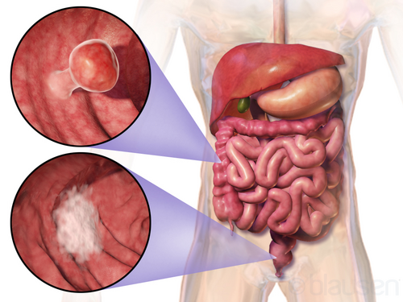
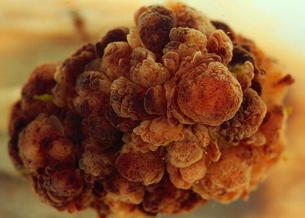

# CÂNCER COLORRETAL

O câncer colorretal (CCR) não é apenas uma doença; é o desfecho final de uma série de eventos genéticos e ambientais que você, como futuro residente, precisa dominar. Nas provas de residência, o CCR é um dos temas "top 5" de cirurgia. Por quê? Porque ele exige que você entenda de anatomia vascular, oncologia clínica, genética e técnica cirúrgica.

Neste material, vamos dissecar o CCR desde a biologia molecular até a mesa de cirurgia. Prepare-se: o que você ler aqui é o que cai na prova e o que você verá no plantão.

## Epidemiologia e Fatores de Risco

*Figura 1 - Representação tridimensional do câncer colorretal, demonstrando massa tumoral na parede do cólon com crescimento intraluminal. Fonte: Blausen Medical Communications, CC BY 3.0 | Wikimedia Commons*

O CCR é a segunda causa mais comum de morte por câncer no Brasil (excluindo pele não-melanoma). O dado que você precisa levar para a prova é a mudança no perfil epidemiológico: estamos vendo cada vez mais casos em pacientes com menos de 50 anos.

### Fatores de Risco Esporádicos

A maioria dos casos (>70%) é esporádica. Os fatores de risco clássicos são:

- Idade > 50 anos (embora o rastreio agora comece aos 45 anos em algumas diretrizes).

- Dieta rica em carne vermelha e processada, pobre em fibras.

- Obesidade, sedentarismo e tabagismo.

- Doença Inflamatória Intestinal (DII): O risco aumenta após 8-10 anos de colite ativa.

### Síndromes Hereditárias: Ouro de Prova

Aqui é onde as bancas fazem a festa. Você precisa diferenciar as duas principais:

-

**Polipose Adenomatosa Familiar (FAP):**

- Mutação no gene APC.

- Milhares de pólipos no cólon.

- Risco de 100% de câncer se não operado.

- **Variante Gardner:** FAP + Osteomas + Dentes supranumerários + Tumores desmoides (massa abdominal fixa e endurecida).

- **Variante Turcot:** FAP + Tumores do SNC (Meduloblastoma).

-

**Síndrome de Lynch (HNPCC):**

- Mutação nos genes de reparo do DNA (MMR: MLH1, MSH2, MSH6, PMS2).

- Câncer precoce, frequentemente no cólon direito.

- **Critérios de Amsterdam II (3-2-1):** 3 familiares com câncer associado ao Lynch (cólon, endométrio, ureter), sendo 1 parente de primeiro grau dos outros dois; 2 gerações sucessivas; 1 caso diagnosticado antes dos 50 anos.

- **Pérola do Dr. Will:** Se a questão fala em paciente jovem com histórico familiar pesado e poucos pólipos, pense em Lynch. Se tiver milhares de pólipos, pense em FAP.

## Fisiopatologia: A Sequência Adenoma-Carcinoma

Por que fazemos colonoscopia? Porque o CCR não nasce câncer. Ele segue a sequência adenoma-carcinoma (via supressora). O pólipo adenomatoso leva, em média, 10 anos para malignizar.

### Tipos de Pólipos

- **Adenoma Tubular:** Menor potencial de malignidade.

- **Adenoma Tubuloviloso:** Potencial intermediário.

- **Adenoma Viloso:** Maior potencial de malignidade ("Viloso é Vilão").

- **Pólipo Serrilhado:** Segue uma via diferente (instabilidade de microssatélites), comum no cólon direito.

**Cuidado:** O Hamartoma Juvenil não é uma neoplasia verdadeira, mas uma malformação tecidual. Não confunda com pólipo neoplásico em questões de prova.

## Quadro Clínico: A Localização Determina o Sintoma

Muitos alunos erram questões por não associarem a anatomia ao sintoma. O cólon direito é largo e o conteúdo é líquido. O cólon esquerdo é estreito e o conteúdo é sólido.

| Característica | Cólon Direito | Cólon Esquerdo | Reto |
| --- | --- | --- | --- |
| **Sintoma Principal** | Anemia ferropriva / Sangue oculto | Alteração do hábito intestinal | Hematoquezia / Tenesmo |
| **Tipo de Lesão** | Vegetante / Exofítica | Infiltrante / Estenosante | Ulcerada / Estenosante |
| **Obstrução** | Rara e tardia | Comum ("fezes em fita") | Comum |

**Exemplo Clínico:** Paciente de 65 anos, refere cansaço e palidez. Hemograma mostra anemia microcítica e hipocrômica. Qual o próximo passo? **Colonoscopia.** No MedEvo, sempre ensinamos: anemia ferropriva em idoso é câncer de cólon direito até que se prove o contrário.

## Diagnóstico e Estadiamento

O diagnóstico é feito por **Colonoscopia com Biópsia**. O Enema Opaco caiu em desuso, mas ainda aparece em provas com a imagem clássica em "maçã mordida".

### O Papel do CEA (Antígeno Carcinoembrionário)

**Erro clássico:** Achar que o CEA serve para diagnóstico. **Não serve!**
O CEA é um marcador de prognóstico e, principalmente, de **seguimento pós-operatório**. Se o CEA sobe após a cirurgia, suspeite de recorrência.

### Estadiamento (TNM)

Para o cólon, usamos TC de Tórax, Abdome e Pelve. Para o reto, a **RM de Pelve** é obrigatória para avaliar a invasão do mesoreto.

- **T1:** Invade submucosa.

- **T2:** Invade muscular própria.

- **T3:** Invade subserosa ou tecidos pericólicos não peritonizados.

- **T4:** Perfura o peritônio visceral (T4a) ou invade órgãos adjacentes (T4b).

- **N1:** 1-3 linfonodos.

- **N2:** 4 ou mais linfonodos.

- **M1:** Metástase à distância (Fígado é o sítio mais comum).

**Pérola de Prova:** No câncer de cólon, a metástase em apenas 1 linfonodo (N1a) já classifica o paciente como Estádio III (se T1-T2, III A). Isso muda tudo, pois indica quimioterapia adjuvante.

## Princípios da Cirurgia de Cólon

A cirurgia oncológica baseia-se em três pilares: margens radiais e proximais/distais livres, ligadura vascular na origem e linfadenectomia regional (mínimo de 12 linfonodos para um estadiamento adequado).

### Tipos de Ressecção

- **Hemicolectomia Direita:** Para tumores de ceco e cólon ascendente. Ligamos os vasos ileocolicos, cólica direita e o ramo direito da cólica média.

- **Hemicolectomia Esquerda:** Para tumores de cólon descendente. Ligamos a artéria mesentérica inferior (AMI) na origem.

- **Colectomia de Ângulo Esplênico:** Exige a ligadura da AMI e do ramo esquerdo da artéria cólica média.

- **Retossigmoidectomia:** Para tumores de sigmoide.

### O Caso do Apêndice

O tumor carcinoide (neuroendócrino) é a neoplasia mais comum do apêndice.

- **Carcinoide < 1cm:** Apendicectomia simples.

- **Carcinoide > 2cm ou invasão da base:** Hemicolectomia direita.

- **Adenocarcinoma de apêndice:** Sempre hemicolectomia direita, independentemente do tamanho, para garantir linfadenectomia. Se for "células em anel de sinete", a conduta é agressiva desde o início.

## Câncer de Reto: O Grande Diferencial

Aqui o jogo muda. O reto está abaixo da reflexão peritoneal e "preso" na pelve. O tratamento depende da distância da borda anal e da profundidade da invasão.

### Neoadjuvância (Quimiorradioterapia Pré-operatória)

Quando fazemos? Para tumores **localmente avançados**:

- T3 ou T4.

- N+ (qualquer linfonodo suspeito na RM).

- Tumores de reto baixo que ameaçam o esfíncter.

**Por que fazer antes?** Para reduzir o tamanho do tumor (downsizing), aumentar a chance de preservação esfincteriana e diminuir a recidiva local. A radioterapia não é usada no cólon porque as alças intestinais são móveis e sofreriam toxicidade actínica grave; o reto é fixo, o que permite a aplicação segura.

### Terapia Neoadjuvante Total (TNT)

A **TNT** é a estratégia em que todo o tratamento neoadjuvante planejado — quimioterapia sistêmica e radioterapia/quimiorradioterapia — é feito **antes** da cirurgia com excisão total do mesorreto. Ela ganhou espaço porque trata micrometástases mais cedo, melhora a adesão à quimioterapia, aumenta *downstaging*/resposta patológica completa e pode ampliar a chance de preservação esfincteriana ou até de preservação de órgão em casos muito selecionados.

**Quando pensar em TNT?** Principalmente no câncer de reto localmente avançado não metastático: T3/T4, N+, margem circunferencial/mesorreto ameaçada na RM, EMVI positiva, linfonodos volumosos ou tumores de reto médio/baixo com maior risco de recidiva local. Tumores iniciais T1 favoráveis ou T2N0 geralmente não precisam dessa estratégia.

**Sequências mais cobradas:**

- **Indução:** quimioterapia primeiro (ex.: FOLFOX ou CAPOX) → quimiorradioterapia de curso longo ou radioterapia curta → cirurgia/TME.

- **Consolidação:** quimiorradioterapia ou radioterapia curta → quimioterapia sistêmica (ex.: FOLFOX ou CAPOX) → cirurgia/TME.

Na quimiorradioterapia de curso longo, usa-se radioterapia pélvica associada a fluoropirimidina (capecitabina oral ou 5-FU). Na radioterapia curta, o esquema clássico é 25 Gy em 5 frações, seguido de quimioterapia e cirurgia conforme protocolo oncológico. Em pacientes com resposta clínica completa após neoadjuvância, a estratégia **watch-and-wait** pode ser discutida em centros experientes, desde que haja vigilância intensiva; não é “alta” nem ausência de seguimento.

### Técnicas Cirúrgicas no Reto

Antes de operar, a **RM de pelve** é central: avalia profundidade de invasão, linfonodos, distância da borda anal, relação com esfíncter/levantadores, fáscia mesorretal e margem circunferencial de ressecção (CRM). Isso define se a cirurgia será direta, se precisa de neoadjuvância convencional ou se o paciente se beneficia de TNT.

- **Excisão Total do Mesorreto (TME):** é o princípio oncológico padrão para reto médio/baixo. O mesorreto, sua gordura e linfonodos são retirados em bloco, buscando CRM livre; isso reduz recidiva local.

- **Ressecção Anterior do Reto (RAR) / RAR baixa:** indicada quando é possível preservar o aparelho esfincteriano, geralmente em reto alto/médio e em alguns tumores baixos após boa resposta. Pode exigir anastomose colorretal ou coloanal.

- **Ileostomia de proteção:** frequentemente usada em anastomoses baixas. Ela não impede a fístula, mas diminui suas consequências sépticas.

- **Cirurgia de Miles (ressecção abdominoperineal):** indicada para tumores muito baixos com invasão do esfíncter, levantadores ou quando não se consegue margem distal/CRM adequada preservando esfíncter. Resulta em colostomia definitiva.

- **Excisão local transanal/TAMIS/TEMS:** apenas para T1 muito selecionado, pequeno, bem ou moderadamente diferenciado, sem invasão linfovascular, sem características de alto risco e com estadiamento local favorável.

**Dica de Prova:** Em tumor de reto baixo T3N1M0, pense primeiro em neoadjuvância/TNT conforme risco na RM. Se houver resposta e margem/esfíncter puderem ser preservados, a conduta típica é ressecção anterior baixa/retossigmoidectomia anterior com TME e, muitas vezes, ileostomia de proteção. Se o esfíncter estiver invadido ou a margem for inviável, a operação passa a ser Miles.

## Complicações: Obstrução e Perfuração

O CCR é a principal causa de obstrução intestinal em adultos.

### Obstrução em Alça Fechada

Se o tumor obstrui o sigmoide e a **válvula ileocecal é continente**, a pressão aumenta drasticamente entre o tumor e a válvula. Pela **Lei de Laplace** (Pressão = Tensão / Raio), o ceco, por ter o maior diâmetro, é o primeiro a perfurar.

- **Conduta na obstrução instável:** Procedimento de Hartmann (ressecção do tumor + colostomia terminal + sepultamento do ceco/reto distal).

- **Conduta na obstrução estável:** Pode-se tentar um Stent colônico como ponte para cirurgia eletiva.

## Doença Metastática

O fígado é o primeiro destino das metástases via sistema portal.

- **Metástases Hepáticas Ressecáveis:** A conduta atual é a ressecção cirúrgica (hepatectomia) associada à quimioterapia. Isso pode oferecer cura ou sobrevida prolongada.

- **Metástases Pulmonares:** Também podem ser ressecadas se forem isoladas e o tumor primário estiver controlado.

## Seguimento Pós-Operatório

Após a cirurgia com intenção curativa, o paciente entra em vigilância:

- **CEA:** A cada 3-6 meses nos primeiros 2 anos.

- **TC de Tórax/Abdome:** Anual.

- **Colonoscopia:** 1 ano após a cirurgia. Se normal, repetir em 3 anos e depois a cada 5 anos.

**Pérola MedEvo:** Se o paciente não conseguiu fazer colonoscopia completa no pré-operatório por causa de um tumor obstrutivo, ele deve fazer a colonoscopia em **3 a 6 meses** após a cirurgia para excluir lesões sincrônicas.

## Tabelas Comparativas para Revisão Rápida

### Tabela 1: Estadiamento e Conduta (Cólon)

| Estádio | Definição | Tratamento |
| --- | --- | --- |
| **I** | T1-T2 N0 | Cirurgia isolada |
| **II** | T3-T4 N0 | Cirurgia (QT se alto risco: <12 linfonodos, perfuração, T4) |
| **III** | Qualquer T, N+ | Cirurgia + Quimioterapia Adjuvante (Oxaliplatina) |
| **IV** | M1 | Quimioterapia +/- Cirurgia de Metástase |

### Tabela 2: Diferenças entre Câncer de Cólon e Reto

| Característica | Cólon | Reto (Extraperitoneal) |
| --- | --- | --- |
| **Estadiamento Local** | TC de Abdome | RM de Pelve (Fundamental) |
| **Radioterapia** | Não se faz | Padrão na Neoadjuvância (T3/T4/N+) |
| **Cirurgia** | Colectomia + Linfadenectomia | TME (Excisão Total do Mesoreto) |
| **Metástase** | Principalmente Fígado | Fígado e Pulmão (via veias ilíacas) |

### Tabela 3: Critérios para Excisão Local no Câncer de Reto

| Critério | Exigência para Excisão Local |
| --- | --- |
| **Estádio T** | Apenas T1 |
| **Tamanho** | < 3 cm |
| **Circunferência** | < 30% da luz do reto |
| **Diferenciação** | Bem ou moderadamente diferenciado |
| **Invasão** | Ausência de invasão linfovascular ou perineural |

## Pontos-Chave para Prova 🎯

- **Anemia ferropriva em idoso:** Colonoscopia obrigatória para descartar tumor de cólon direito.

- **Linfadenectomia:** Mínimo de 12 linfonodos para estadiamento N adequado.

- **CEA:** Não serve para diagnóstico, apenas para seguimento e prognóstico.

- **Síndrome de Lynch:** Critérios de Amsterdam II (3 familiares, 2 gerações, 1 antes dos 50 anos).

- **Síndrome de Gardner:** FAP + Osteomas + Tumores Desmoides.

- **Lei de Laplace:** Na obstrução distal com válvula ileocecal continente, o ceco é o local de maior risco de perfuração.

- **Neoadjuvância no Reto:** Indicada para T3, T4 ou N+ na RM de pelve.

- **Cirurgia de Hartmann:** Opção segura em obstruções/perfurações com instabilidade ou peritonite fecal.

- **Tumor de Apêndice:** Adenocarcinoma sempre exige hemicolectomia direita. Carcinoide > 2cm também.

- **Metástase Hepática:** Se ressecável, a cirurgia é a melhor chance de sobrevida.

- **Pólipo Viloso:** É o tipo histológico de pólipo adenomatoso com maior risco de malignização.

- **Linfonodo Sentinela:** **NÃO** é rotina no câncer colorretal; a ressecção é sempre em bloco com a cadeia linfonodal.

- **Rastreamento na FAP:** Começa na puberdade (10-12 anos) com retossigmoidoscopia anual.

- **Rastreamento no Lynch:** Começa aos 20-25 anos com colonoscopia a cada 1-2 anos.

- **Pós-operatório:** Deambulação precoce e dieta oral precoce (após ruídos hidroaéreos ou conforme protocolos ERAS/ACERTO) são fundamentais.

- **Contraindicação Absoluta à Anastomose:** Instabilidade hemodinâmica grave ou peritonite generalizada severa (fecal).

- **Artéria Mesentérica Inferior:** Deve ser ligada na origem em colectomias esquerdas para garantir a limpeza linfonodal da raiz do vaso.

 Cópia offline para consulta pessoal.
 Fonte original:
 [https://www.medevo.com.br/material-apoio/ler/4a2e9c86-7011-4541-9313-4ddc60de23df](https://www.medevo.com.br/material-apoio/ler/4a2e9c86-7011-4541-9313-4ddc60de23df)
