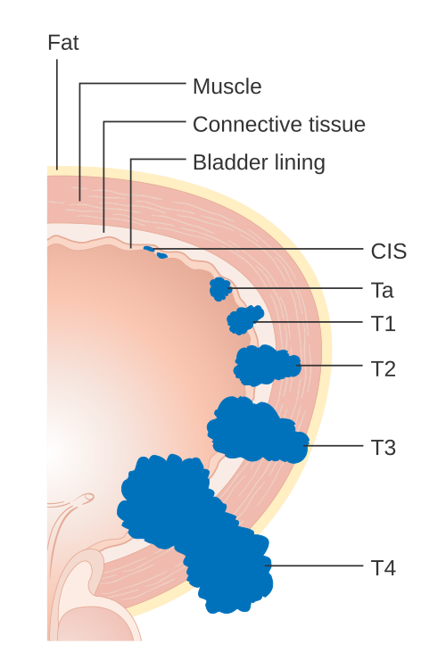
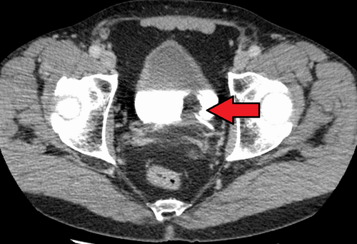

# CÂNCER DE BEXIGA: TU SUPERFICIAL VS MÚSCULO-INVASIVO

O câncer de bexiga é um dos temas preferidos da urologia em provas de residência, e o motivo é simples: a conduta muda radicalmente dependendo de uma única linha no laudo de patologia. Se o tumor atinge ou não a camada muscular (o detrusor) é o que separa o paciente de um tratamento ambulatorial de uma cirurgia de grande porte.

Neste material, vamos dissecar essa diferença e entender por que o urologista é tão obcecado pela "presença de fibras musculares na amostra".

## Epidemiologia e Fatores de Risco: O Perfil do Paciente de Prova

*Figura 1 - Diagrama ilustrando os estágios T do câncer de bexiga, desde tumores confinados à mucosa (Ta/T1 - superficiais) até invasão da camada muscular (T2-T4 - músculo-invasivos). Fonte: Cancer Research UK, CC BY-SA 4.0 | Wikimedia Commons*

Quando você ler um enunciado de questão sobre câncer de bexiga, 90% das vezes ele descreverá um **homem, idoso (> 60-70 anos) e tabagista**.

O **tabagismo** é, de longe, o principal fator de risco. Mas por que o pulmão afeta a bexiga? Porque os carcinógenos do tabaco (como as aminas aromáticas e hidrocarbonetos) são absorvidos, caem na corrente sanguínea e são filtrados pelos rins. Eles ficam concentrados na urina, em contato direto e prolongado com o urotélio (o epitélio de revestimento da bexiga). É o que chamamos de "efeito de campo": todo o urotélio está exposto ao risco, o que explica por que esses tumores são frequentemente multifocais e recorrentes.

Além do cigarro, guarde estes outros fatores que as bancas adoram:

- **Exposição Ocupacional:** Trabalhadores das indústrias de borracha, corantes, couro e tintas (exposição a aminas aromáticas como a benzidina).

- **Irradiação Pélvica Prévia:** Pacientes tratados para câncer de próstata ou colo de útero com radioterapia têm risco aumentado anos depois.

- **Ciclofosfamida:** Um quimioterápico que pode causar cistite hemorrágica e, a longo prazo, câncer de bexiga.

- **Esquistossomose (S. haematobium):** Muito comum em provas que citam o Egito ou Oriente Médio. Importante: a esquistossomose predispõe ao **Carcinoma Espinocelular (CEC)**, e não ao carcinoma urotelial clássico.

**Tabela 1: Fatores de Risco para Câncer de Bexiga**

| Fator de Risco | Observação de Prova |
| --- | --- |
| **Tabagismo** | Principal fator (risco 3-4x maior). |
| **Aminas Aromáticas** | Indústria de tintas, pneus e têxtil. |
| **Idade e Sexo** | Homens > 60 anos (proporção 3:1). |
| **Inflamação Crônica** | Cateteres de demora, cálculos vesicais (risco de CEC). |
| **Esquistossomose** | Associada ao Carcinoma Espinocelular (CEC). |
| **Ciclofosfamida** | Uso prévio em doenças reumatológicas ou linfomas. |

## Quadro Clínico: A Hematúria que Não Dói

Se você tiver que guardar apenas uma informação sobre a clínica, que seja esta: **Hematúria macroscópica indolor é câncer de bexiga até que se prove o contrário.**

Diferente da cólica nefrética (onde a hematúria vem com dor excruciante) ou da cistite (onde vem com disúria e polaciúria), o tumor de bexiga sangra silenciosamente. O paciente urina "suco de morango", não sente nada, e muitas vezes o sangramento para sozinho, o que atrasa o diagnóstico porque o paciente acha que "curou".

**Cuidado com a pegadinha:** O Carcinoma in Situ (CIS) da bexiga é a exceção. Ele costuma se manifestar com **sintomas irritativos** (disúria, urgência, polaciúria) sem evidência de infecção. Se um idoso tabagista tem "cistite" que não melhora com antibiótico e a cultura é negativa, desconfie de CIS.

No exame físico, raramente você encontrará algo nas fases iniciais. Em casos muito avançados, pode haver massa palpável no toque bimanual ou sinais de metástase (linfonodopatia, hepatomegalia), mas isso é raro em questões de diagnóstico inicial.

## Diagnóstico e a Importância da RTU-B

*Figura 2 - Tomografia computadorizada demonstrando carcinoma de células transicionais (urotelial) da bexiga, com contraste evidenciando a lesão intravesical. Fonte: James Heilman, MD, CC BY-SA 4.0 | Wikimedia Commons*

O diagnóstico começa com a suspeita clínica, mas a confirmação exige visualização e biópsia.

- **Citologia Urinária:** Tem alta sensibilidade para tumores de **alto grau** e CIS, mas é ruim para tumores de baixo grau. Um resultado positivo indica que há células malignas em algum lugar do trato urinário (pode ser no rim, ureter ou bexiga).

- **Cistoscopia:** É o exame inicial para olhar dentro da bexiga. Permite ver a lesão, sua localização e aspecto (papilar, séssil ou plano).

- **Ressecção Transuretral de Bexiga (RTU-B):** Aqui está o "pulo do gato". A RTU-B não é apenas um procedimento diagnóstico; ela é o **tratamento inicial** para tumores superficiais e a ferramenta essencial de **estadiamento**.

**O que o patologista precisa dizer?**
Para o Dr. Will e qualquer urologista experiente, um laudo de RTU-B só é completo se responder a duas perguntas:

- Qual o tipo histológico e o grau (baixo vs alto)?

- O tumor invade a lâmina própria (T1) ou a **camada muscular detrusora (T2)**?

**Erro clássico de prova:** Se o laudo da RTU-B diz "Carcinoma urotelial T1" mas o patologista escreve "ausência de fibras da camada muscular na amostra", essa RTU foi incompleta. Você não pode afirmar que é T1 se não viu o músculo para garantir que ele não está invadido. A conduta? **Re-RTU em 2 a 6 semanas.**

## Histopatologia: O Carcinoma Urotelial

Mais de 90% dos tumores de bexiga no Brasil são **Carcinomas Uroteliais** (antigamente chamados de células de transição).

- **Tumores Papilares:** Crescem como "couve-flor" para dentro do lúmen. Costumam ser de melhor prognóstico.

- **Carcinoma in Situ (CIS):** É uma lesão plana, de alto grau, confinada ao epitélio. Não se engane pelo nome "superficial"; o CIS é agressivo e tem alto risco de progressão para invasão se não tratado com BCG. Na cistoscopia, ele aparece como uma área avermelhada, aveludada (eritroplasia).

**Diferencial importante:** Se a questão citar uma placa eritematosa aveludada na **glande** de um paciente não circuncidado, o nome é **Eritroplasia de Queyrat** (um carcinoma in situ de pênis), não de bexiga.

## Estadiamento TNM: O Divisor de Águas

Para a prova, você precisa decorar a barreira da muscular detrusora.

- **Ta:** Tumor papilar não invasivo (restrito ao epitélio).

- **Tis:** Carcinoma in situ (plano, alto grau).

- **T1:** Invade a lâmina própria (submucosa), mas **NÃO** invade o músculo.

- **T2:** Invade a **camada muscular detrusora**. (Aqui o tratamento muda de "raspagem" para "retirada da bexiga").

- **T3:** Invade a gordura perivesical.

- **T4:** Invade órgãos vizinhos (próstata, útero, vagina, parede pélvica).

**Tabela 2: Estadiamento Simplificado e Conduta**

| Estágio | Descrição | Categoria | Conduta Inicial |
| --- | --- | --- | --- |
| **Ta** | Papilar não invasivo | Não Músculo-Invasivo | RTU-B + Vigilância/Quimio intravesical |
| **Tis** | Carcinoma in situ | Não Músculo-Invasivo | RTU-B + BCG intravesical |
| **T1** | Invade lâmina própria | Não Músculo-Invasivo | RTU-B (+ Re-RTU se alto grau) + BCG |
| **T2** | Invade Muscular | **Músculo-Invasivo** | Cistectomia Radical + Quimio Neoadjuvante |
| **T3/T4** | Extensão extravesical | Músculo-Invasivo | Cistectomia ou Paliativo/Quimio Sistêmica |

## Tumor de Bexiga Não Músculo-Invasivo (TBNMI)

Antigamente chamado de "superficial", este grupo engloba Ta, T1 e Tis. O objetivo aqui é evitar a recorrência (que é muito frequente) e a progressão para invasão muscular.

### O Papel da RTU-B e a Quimioterapia Imediata

Após a RTU-B, se a suspeita for de tumor de baixo risco, recomenda-se uma dose única de quimioterapia intravesical (geralmente **Mitomicina C**) nas primeiras 24 horas. Isso serve para "queimar" células tumorais que ficaram flutuando na bexiga após a raspagem, evitando que elas se implantem em outro lugar.

### A Imunoterapia com BCG (Bacilo Calmette-Guérin)

O BCG é o tratamento padrão-ouro para tumores de **alto risco** (T1, alto grau ou CIS).

- **Como funciona?** Não é quimioterapia. O BCG causa uma reação inflamatória e imunológica local intensa. Os macrófagos e linfócitos T atacam as células do urotélio que "internalizaram" o bacilo, destruindo as células tumorais junto.

- **Esquema:** Geralmente 6 semanas de indução, seguidas de manutenção por 1 a 3 anos.

- **Indicação Clássica de Prova:** Carcinoma urotelial T1 de alto grau. A conduta é RTU-B seguida de BCG intravesical para reduzir recidiva e progressão.

### Quando fazer a Re-RTU?

A Re-RTU (repetir a raspagem em poucas semanas) é obrigatória em:

- RTU inicial sem músculo detrusor na amostra (exceto tumores Ta de baixo grau).

- Todos os tumores T1 (para garantir que não há um T2 escondido).

- Tumores de alto grau ou volumosos.

## Tumor de Bexiga Músculo-Invasivo (TBMI)

Aqui o jogo muda. Se o tumor atingiu o músculo (T2), a chance de micrometástases linfonodais é alta e a RTU-B não consegue mais limpar toda a doença.

### Cistectomia Radical: O Padrão-Ouro

O tratamento de escolha para o estágio T2-T4a N0 M0 é a **Cistoprostatectomia Radical** (no homem) ou a **Exenteração Pélvica Anterior** (na mulher), associada à **Linfadenectomia Ilíaca Bilateral**.

- **No homem:** Retira-se bexiga, próstata e vesículas seminais.

- **Na mulher:** Retira-se bexiga, útero, ovários e parede anterior da vagina.

### Quimioterapia Neoadjuvante

Segundo as diretrizes mais recentes (SBU e internacionais), pacientes com TBMI que possuem boa função renal (ClCr > 60) devem receber **Quimioterapia Neoadjuvante baseada em Cisplatina** antes da cirurgia. Isso aumenta a sobrevida global em cerca de 5-8% ao tratar as micrometástases precocemente.

### Derivações Urinárias

Depois de tirar a bexiga, a urina precisa ir para algum lugar. Existem duas opções principais:

- **Conduto Ileal (Bricker):** Incontinente. Os ureteres são ligados a um pedaço de íleo que sai na pele (estoma). O paciente usa uma bolsa coletora. É mais simples e tem menos complicações metabólicas.

- **Neobexiga Ileal:** Continente. Constrói-se um reservatório com o intestino e liga-se à uretra. O paciente urina "pelo canal", mas precisa reaprender a esvaziar a neobexiga por manobras de Valsalva.

## Manejo de Urgências: Hematúria e Coágulos

Muitas questões de pronto-socorro trazem o paciente com câncer de bexiga em **Retenção Urinária Aguda por coágulos**.

**Conduta imediata:**

- Passagem de **Sonda Vesical de 3 vias** (calibre calibroso, tipo 22 ou 24 French).

- Lavagem manual com seringa de bico largo e soro fisiológico até aspirar todos os coágulos.

- Instalação de **Irrigação Vesical Contínua** para evitar a formação de novos coágulos.

**Cenário de Prova (Anticoagulação):**
Se o paciente usa **Dabigatrana** (um anticoagulante oral direto - DOAC) e precisa de uma RTU-B de urgência por sangramento incontrolável, você deve reverter a anticoagulação. O antídoto específico para a Dabigatrana é o **Idarucizumabe**. Memorize esse nome, as bancas adoram essa conexão com a clínica médica.

## Diagnóstico Diferencial e Investigação de Hematúria

Nem toda hematúria é câncer, mas em pacientes acima de 35-40 anos, a investigação é obrigatória.

- **Hematúria Microscópica Assintomática:** Definida como ≥ 3 hemácias por campo em sedimento urinário. Se o paciente tiver fatores de risco (tabagista, > 35 anos), deve ser investigado com cistoscopia e imagem do trato superior (Uro-TC).

- **Cistite Hemorrágica:** Geralmente acompanhada de muita dor e sintomas irritativos.

- **Cálculo Renal:** Dor lombar aguda (cólica nefrética).

- **Iatrogenia:** Pacientes submetidas a cirurgias uroginecológicas (como o **Sling sintético retropúbico** para incontinência de esforço) podem ter lesão vesical inadvertida. Por isso, a **cistoscopia intraoperatória** é obrigatória durante a passagem do sling.

**Tabela 3: Investigação de Hematúria por Faixa Etária**

| Idade | Causa mais comum | Conduta |
| --- | --- | --- |
| **< 40 anos** | ITU, Litíase, Glomerulopatias | Tratar causa base; avaliar nefro se dismorfismo eritrocitário. |
| **> 40 anos** | Neoplasia (Bexiga, Rim), HPB | **Cistoscopia + Uro-TC** (obrigatórios se tabagista). |

## Complicações e Seguimento

O câncer de bexiga é o "campeão" de recidiva. Mesmo um tumor Ta de baixo grau tem 50-70% de chance de voltar. Por isso, a **vigilância cistoscópica rigorosa** é essencial.

- **Protocolo padrão:** Cistoscopia a cada 3 meses nos primeiros 2 anos, depois a cada 6 meses até 5 anos, e depois anualmente.

- **Recidiva vs Progressão:** Recidiva é o tumor voltar no mesmo estágio. Progressão é ele voltar pior (ex: era T1 e voltou T2). O número de lesões iniciais e o grau histológico são os maiores preditores de recidiva.

## Pontos-Chave para Prova 🎯

- **Hematúria macroscópica indolor** em idoso tabagista = Câncer de Bexiga (Carcinoma Urotelial) até que se prove o contrário.

- **Fator de Risco nº 1:** Tabagismo. Fator de risco para **CEC**: Esquistossomose ou inflamação crônica (cateter/cálculo).

- **Diagnóstico e Estadiamento:** Feitos pela **RTU-B**. O laudo deve obrigatoriamente mencionar a presença ou ausência de **músculo detrusor**.

- **Re-RTU:** Obrigatória se T1, se alto grau ou se não veio músculo na primeira amostra.

- **Carcinoma in Situ (Tis):** Lesão plana, avermelhada, de alto grau. Tratamento é **BCG intravesical**. Não responde bem à RTU isolada.

- **Tumor Não Músculo-Invasivo (Ta, T1, Tis):** Tratamento é RTU-B + Adjuvância (BCG para alto risco; Mitomicina para baixo risco).

- **Tumor Músculo-Invasivo (T2 ou mais):** Tratamento é **Cistectomia Radical** + Linfadenectomia + Quimioterapia Neoadjuvante (Cisplatina).

- **BCG:** É imunoterapia. Reduz recidiva e progressão. Contraindicado se hematúria macroscópica franca ou infecção urinária ativa (risco de sepse pelo bacilo).

- **Retenção por coágulos:** Sonda de 3 vias + lavagem manual + irrigação contínua.

- **Dabigatrana:** Se precisar de cirurgia de urgência, reverter com **Idarucizumabe**.

- **Sling Retropúbico:** Exige cistoscopia intraoperatória para descartar perfuração vesical.

- **Citologia Urinária:** Ótima para alto grau e CIS; ruim para baixo grau.

- **Uro-TC:** Exame de escolha para avaliar o trato urinário superior (excluir tumor de pelve renal ou ureter) em pacientes com hematúria.

- **O que NÃO fazer:** Não tratar hematúria em idoso apenas com antibiótico achando que é "só uma ITUzinha" sem investigar neoplasia.

- **Pegadinha de Estadiamento:** T1 invade a lâmina própria (submucosa). T2 invade o músculo. A conduta muda de "preservar a bexiga" (T1) para "retirar a bexiga" (T2).

 Cópia offline para consulta pessoal.
 Fonte original:
 [https://www.medevo.com.br/material-apoio/ler/805d8edb-a59f-4638-99e0-e315b0fead5d](https://www.medevo.com.br/material-apoio/ler/805d8edb-a59f-4638-99e0-e315b0fead5d)
