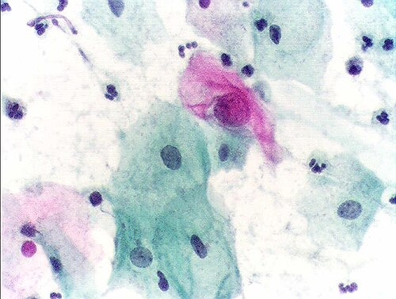
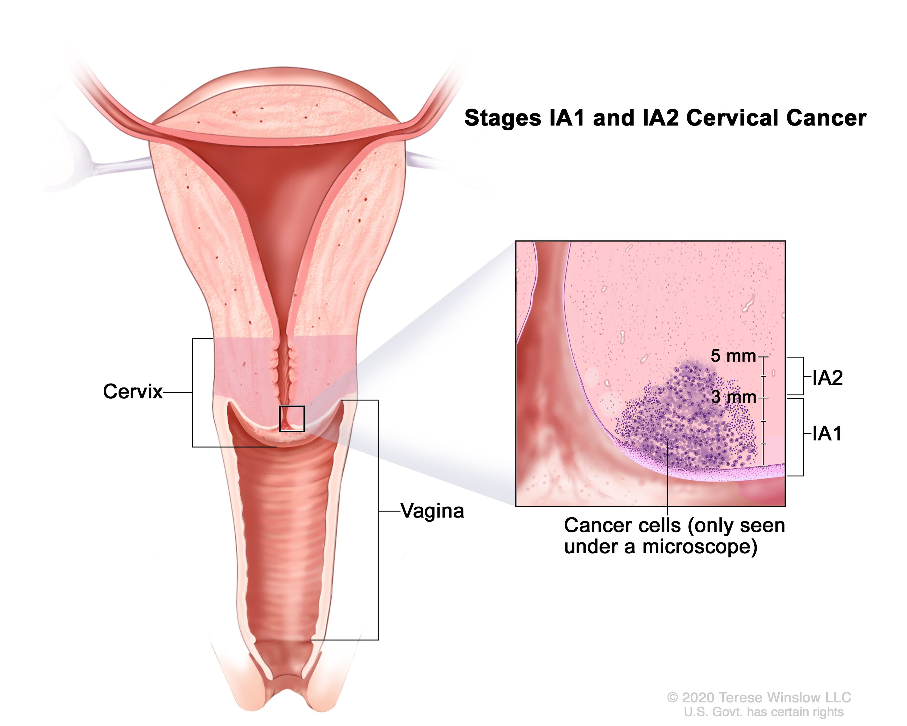
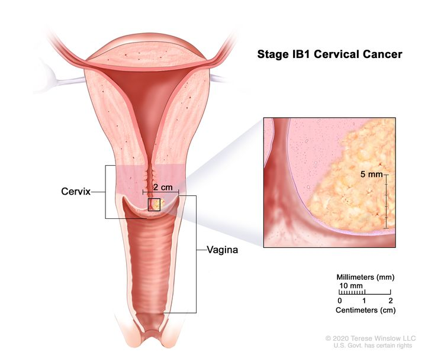
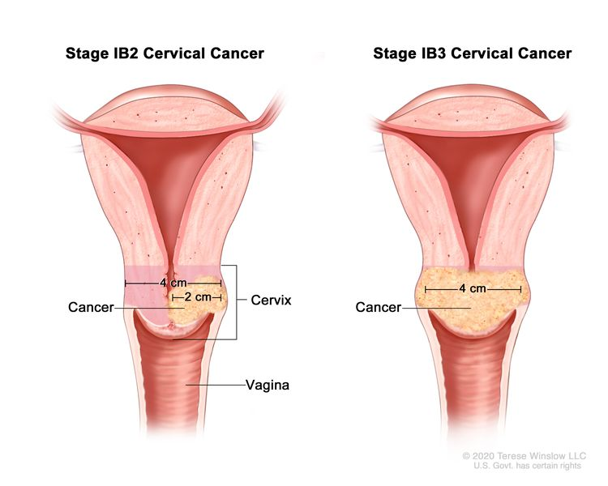
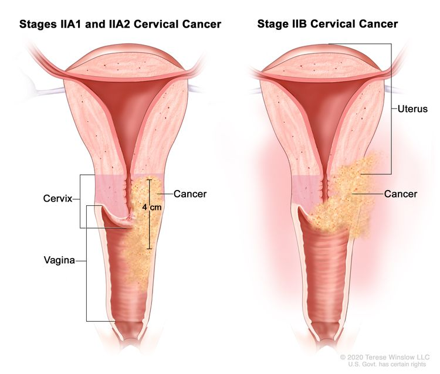
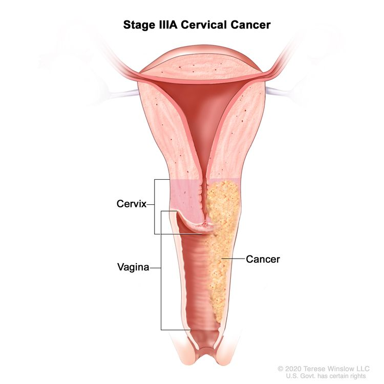
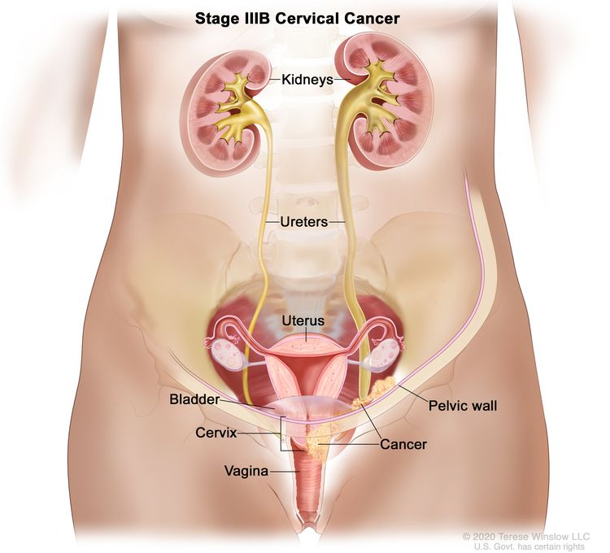
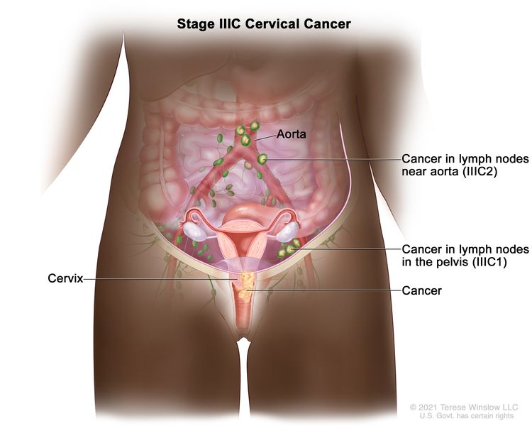
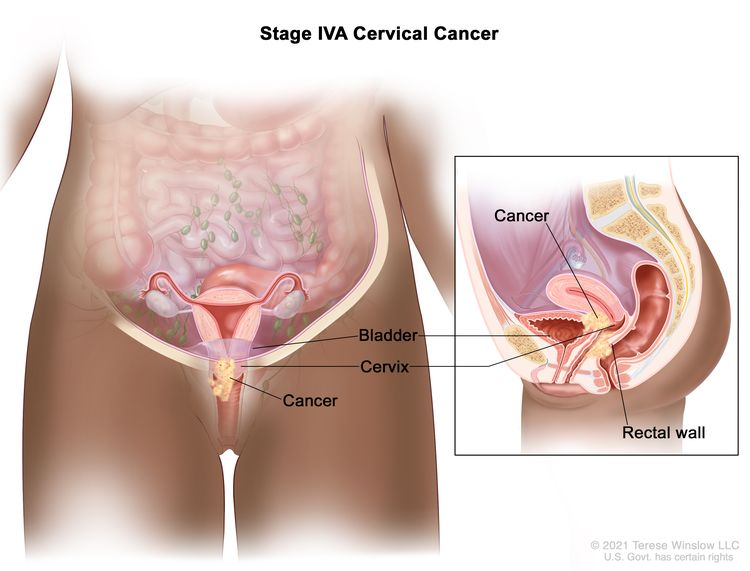

# CÂNCER DE COLO UTERINO

O câncer de colo uterino é, talvez, a doença mais "evitável" da ginecologia oncológica. Se você entender isso, entenderá por que as bancas de residência cobram tanto o rastreamento e as lesões precursoras. Não estamos falando de uma doença que surge do nada, mas de um processo que leva, em média, 7 a 10 anos para progredir de uma infecção viral para um carcinoma invasor.

Como professor, vejo muitos alunos decorando tabelas de estadiamento sem entender a lógica por trás delas. Meu objetivo hoje é que você saia desta leitura sabendo não apenas o que fazer, mas o porquê de cada conduta, desde a vacinação até a quimiorradioterapia.

## Epidemiologia e Fatores de Risco: Onde Tudo Começa

No Brasil, o câncer de colo do útero ainda é um problema de saúde pública gigante, ocupando as primeiras posições em incidência em regiões com menor desenvolvimento socioeconômico. Isso acontece porque o sucesso do controle desta doença depende diretamente de um sistema de rastreamento organizado.

O fator de risco necessário, mas não suficiente, é a infecção pelo Papilomavírus Humano (HPV). Guarde bem: sem HPV, praticamente não existe câncer de colo. Os subtipos 16 e 18 são os grandes vilões, responsáveis por cerca de 70% dos casos de câncer invasor.

Mas por que nem toda mulher com HPV tem câncer? Porque precisamos de cofatores. O tabagismo é o principal deles. As substâncias do cigarro são concentradas no muco cervical e agem de forma sinérgica com o vírus, diminuindo a imunidade local e facilitando a integração do DNA viral ao genoma da célula hospedeira. Outros fatores incluem a baixa condição socioeconômica (dificuldade de acesso ao rastreamento), início precoce da vida sexual, múltiplos parceiros e a imunossupressão (mulheres HIV positivas são um grupo de altíssimo risco).

## Fisiopatologia: A Biologia Molecular que Cai na Prova

*Figura 1 - Representação da displasia cervical mostrando a progressão das alterações celulares no epitélio do colo uterino. Fonte: Blausen Medical Communications, CC BY 3.0 | Wikimedia Commons*

Muitos alunos pulam a parte de biologia molecular, mas as bancas adoram as oncoproteínas E6 e E7. Por que elas são importantes?

O HPV de alto risco (oncogênico) produz essas duas proteínas para dominar a célula. A proteína E6 se liga e inativa a p53 (o "guardião do genoma"), impedindo a apoptose da célula danificada. Já a proteína E7 se liga e inativa a pRB (proteína do retinoblastoma), liberando o ciclo celular para ocorrer de forma descontrolada.

O resultado? Uma célula que não morre quando deveria e que se multiplica sem parar. É aqui que surge a Neoplasia Intraepitelial Cervical (NIC). A maioria dessas lesões ocorre na Zona de Transformação (ZT), aquela área de batalha entre o epitélio escamoso e o colunar. É por isso que, na colposcopia, nosso foco total é visualizar a Junção Escamo-Colunar (JEC).

## Rastreamento: As Regras do Jogo no Brasil

*Figura 2 - Exame de Papanicolaou (citologia oncótica) com coloração de Papanicolaou mostrando célula claramente atípica (400x). Fonte: Alex brollo, CC BY-SA 3.0 | Wikimedia Commons*

Aqui é onde a maioria dos pontos é perdida por falta de atenção às diretrizes do Ministério da Saúde (MS) e do INCA. No MedEvo, sempre reforçamos: para a prova, siga a diretriz nacional, a menos que o enunciado peça especificamente outra (como a da FEBRASGO ou americana).

### Quem e Quando Rastrear?

> **Atualização INCA/MS 2024-2025:** O teste de **DNA-HPV** passou a ser o método preferencial de rastreamento primário para mulheres de 25 a 64 anos. Quando negativo, o intervalo entre exames é de **5 anos**. Quando positivo, a **citologia** é realizada como triagem complementar. A citologia oncótica (Papanicolaou) continua válida onde o DNA-HPV não estiver disponível.

O rastreamento clássico (ainda cobrado em provas) é feito através da citologia oncótica (Papanicolaou).

- **Início:** Aos 25 anos para mulheres que já iniciaram a vida sexual.

- **Periodicidade:** Anual. Após dois exames consecutivos normais (intervalo de 1 ano), o intervalo passa a ser de 3 em 3 anos.

- **Fim:** Aos 64 anos, desde que a mulher tenha pelo menos dois exames negativos nos últimos cinco anos.

**Cuidado com a pegadinha:** Se a mulher tem 65 anos e nunca fez o exame, você deve realizar dois exames com intervalo de 1 a 3 anos antes de dispensá-la.

### Situações Especiais no Rastreamento

- **Mulheres HIV positivas ou imunossuprimidas:** O rastreamento deve começar logo após o início da vida sexual, com intervalos semestrais no primeiro ano e, se normais, anuais enquanto mantiverem CD4 > 200. Se CD4 < 200, manter semestral.

- **Virgens:** Não há indicação de rastreamento.

- **Gestantes:** Seguem o fluxo normal de rastreamento. A gestação não é contraindicação para a coleta, mas não se faz coleta endocervical com escovinha (apenas espátula de Ayre).

- **Histerectomizadas:** Se a histerectomia foi por doença benigna e a paciente tinha exames anteriores normais, não precisa mais rastrear. Se foi por lesão precursora ou câncer, o seguimento é rigoroso.

### Pesquisa de DNA-HPV (Teste Molecular)

Este é um tema cada vez mais cobrado. O teste de DNA-HPV (ou teste molecular para HPV) detecta a presença do material genético do vírus diretamente no colo uterino. Os principais métodos são:

- **Captura Híbrida II:** Detecta 13 tipos de HPV de alto risco em conjunto (sem especificar qual). É o mais utilizado no Brasil.

- **PCR (Reação em Cadeia de Polimerase):** Mais sensível, permite a **genotipagem** (identificar especificamente se é HPV 16, 18, etc.).

#### Quando usar o Teste de DNA-HPV?

| Indicação | Utilidade | Observação |
| --- | --- | --- |
| **Triagem de ASC-US** | Se DNA-HPV positivo → colposcopia. Se negativo → repetir citologia em 3 anos. | Alternativa à repetição da citologia em 6/12 meses. |
| **Co-teste (Citologia + DNA-HPV)** | Rastreamento combinado em mulheres **≥ 30 anos**. | Se ambos negativos, repetir em 5 anos (maior segurança). |
| **Seguimento pós-tratamento de NIC** | Detectar persistência ou recidiva viral após conização/EZT. | DNA-HPV positivo no seguimento → colposcopia. |
| **Rastreamento primário com DNA-HPV** | Tendência atual (OMS 2021): substituir citologia por teste molecular como método primário a partir dos 30 anos. | Intervalo de 5 anos se negativo. Ainda em implementação no Brasil. |

> **Ponto-chave para provas:** O teste de DNA-HPV tem **alta sensibilidade** (detecta quase todos os casos), mas **menor especificidade** que a citologia (muitas mulheres têm HPV transitório sem lesão). Por isso, em mulheres jovens (

| Resultado da Citologia | Conduta Inicial | Justificativa |
| --- | --- | --- |
| **ASC-US** (Atipia de significado indeterminado, possivelmente não neoplásica) | Repetir citologia em 6 meses (se ≥ 30 anos) ou 12 meses (se 25-29 anos) | Alta taxa de regressão e associação com processos inflamatórios. |
| **LSIL** (Lesão intraepitelial de baixo grau) | Repetir citologia em 6 meses (se ≥ 25 anos) ou 3 anos (se < 25 anos) | Reflete geralmente a infecção viral produtiva, com alta taxa de regressão espontânea. |
| **ASC-H** (Atipia de significado indeterminado, não exclui lesão de alto grau) | **Colposcopia imediata** | Risco significativo de haver uma lesão de alto grau oculta. |
| **HSIL** (Lesão intraepitelial de alto grau) | **Colposcopia imediata** | Alta probabilidade de NIC 2 ou 3. |
| **AGC / AGUS** (Atipia em células glandulares) | **Colposcopia imediata** com avaliação endocervical | Pode indicar lesão no canal cervical ou até no endométrio. |
| **AOI** (Atipia de origem indefinida) | **Colposcopia imediata** | Risco de malignidade. |

**Dica de Ouro do Dr. Will:** Se a paciente tem duas citologias consecutivas de ASC-US ou LSIL, ela deve ser encaminhada para colposcopia, independentemente da idade. A repetição é uma chance para o organismo limpar o vírus; se a atipia persiste, precisamos olhar de perto.

## Colposcopia e Biópsia: O Olhar Clínico

A colposcopia serve para localizar a lesão e guiar a biópsia. Não é um exame de rastreamento, é um exame de diagnóstico.

Ao aplicar o **Ácido Acético**, buscamos áreas acetobrancas. O ácido coagula proteínas nucleares; como células neoplásicas têm núcleos grandes, elas ficam brancas.
Ao aplicar o **Lugol (Teste de Schiller)**, buscamos áreas iodo-negativas (Schiller positivo). O epitélio normal é rico em glicogênio e fica marrom (iodo-positivo). Células doentes perdem glicogênio e não coram.

**O que é um achado colposcópico maior?**

- Pontilhado grosseiro.

- Mosaico grosseiro.

- Epitélio acetobranco denso.

- **Vasos atípicos:** Este é o sinal clássico de invasão! Se vir vasos em "saca-rolhas" ou "vírgula", a suspeita de câncer invasor é altíssima.

Se a colposcopia for insatisfatória (não visualizamos a JEC), o próximo passo é a avaliação do canal endocervical (escovado ou curetagem).

## Neoplasia Intraepitelial Cervical (NIC): O Tratamento das Precursoras

Após a biópsia, temos o diagnóstico histológico.

- **NIC 1:** Conduta expectante por até 2 anos, pois a maioria regride.

- **NIC 2 e NIC 3:** São lesões de alto grau. O tratamento padrão é a exérese da zona de transformação (EZT/LEEP) ou conização.

**Por que fazemos conização na NIC 3?** Porque precisamos excluir câncer invasor que a biópsia (que é apenas uma amostra pequena) pode ter deixado passar. Se o resultado da biópsia for NIC 3 em uma paciente com lesão vegetante ou endurecida, desconfie: pode ser um câncer invasor já presente.

## Estadiamento do Câncer de Colo Uterino (FIGO)

O estadiamento da FIGO é, historicamente, clínico. Isso significa que ele deve ser feito através do exame físico (toque vaginal e retal para avaliar paramétrios), biópsia, cistoscopia e proctoscopia. No entanto, a atualização de 2018 permite o uso de imagem (RM, TC, PET-CT) e achados patológicos para refinar o estágio.

### Tabela 2: Resumo do Estadiamento FIGO

| Estágio | Descrição |
| --- | --- |
| **I** | Limitado ao colo uterino |
| **IA1** | Invasão estromal < 3 mm de profundidade |
| **IA2** | Invasão estromal entre 3 mm e 5 mm |
| **IB1** | Lesão invasiva ≥ 5 mm e < 2 cm em sua maior dimensão |
| **IB2** | Lesão invasiva entre 2 cm e 4 cm |
| **IB3** | Lesão invasiva ≥ 4 cm |
| **II** | Além do útero, mas não atinge parede pélvica ou terço inferior da vagina |
| **IIA** | Acomete os 2/3 superiores da vagina (sem invasão de paramétrio) |
| **IIB** | **Invasão de paramétrio** (mas não chega à parede pélvica) |
| **III** | Acomete terço inferior da vagina, parede pélvica ou causa hidronefrose |
| **IIIA** | Terço inferior da vagina |
| **IIIB** | Parede pélvica e/ou **hidronefrose / exclusão renal** |
| **IIIC** | Linfonodos pélvicos (C1) ou para-aórticos (C2) positivos |
| **IV** | Além da pelve verdadeira ou mucosa da bexiga/reto |

**Erro clássico de prova:** Achar que hidronefrose é estágio IV. Não! Hidronefrose por compressão ureteral pelo tumor é **Estágio IIIB**.

## Tratamento: A Linha de Corte do Paramétrio

Para decidir o tratamento, você precisa fazer uma pergunta fundamental: **O paramétrio está livre?**

O paramétrio é o tecido conjuntivo ao lado do útero por onde passam os vasos e os ureteres. Se o tumor invadiu o paramétrio (Estágio IIB em diante), a cirurgia não consegue mais margens livres com segurança.

### Tabela 3: Conduta Terapêutica por Estágio

| Estágio | Tratamento de Escolha | Observações |
| --- | --- | --- |
| **IA1** | Conização ou Histerectomia Total (Tipo A) | Se desejar fertilidade e não houver invasão linfovascular: Conização. |
| **IA2** | Histerectomia Radical Modificada + Linfadenectomia | Risco de metástase linfonodal aumenta aqui. |
| **IB1 / IB2** | Cirurgia de Wertheim-Meigs (Histerectomia Radical + Linfadenectomia Pélvica) | Padrão ouro para doença inicial. |
| **IB3 / IIA2** | Quimiorradioterapia (QRT) ou Wertheim-Meigs | Tumores > 4cm têm alto risco de precisar de rádio adjuvante. |
| **IIB ao IVA** | **Quimiorradioterapia Concomitante** | Cisplatina semanal + Radioterapia externa + Braquiterapia. |

**Exemplo Clínico:** Paciente de 45 anos, com lesão de 3 cm no colo, sem invasão de vagina ou paramétrios ao toque retal. Estágio IB2. Conduta: Wertheim-Meigs. Se durante a cirurgia o patologista encontrar linfonodo positivo ou margem comprometida, ela precisará de radioterapia adjuvante.

### Preservação da Fertilidade

Se a paciente é jovem, nuligesta e tem um tumor inicial (IA1 ou IB1 < 2cm), podemos oferecer a **Traquelectomia Radical**. Retira-se o colo e os paramétrios, mas preserva-se o corpo uterino para uma futura gestação (que será obrigatoriamente via cesárea).

## Situações Especiais e Complicações

### Câncer de Colo na Gestação

O diagnóstico é feito da mesma forma. Se for um NIC 3 ou carcinoma in situ, esperamos o parto para tratar (90 dias pós-parto). Se for invasor inicial, pode-se aguardar a viabilidade fetal se o diagnóstico for no segundo ou terceiro trimestre. Se for avançado, o tratamento oncológico muitas vezes implica na perda da gestação.

### O Papel da Quimioterapia

Diferente do câncer de mama, no colo uterino a quimioterapia isolada raramente cura. Ela é usada como **radiossensibilizador**. A Cisplatina é dada em doses baixas semanalmente para "fragilizar" as células tumorais e potencializar o efeito da radioterapia.

### Complicações Tardias

A radioterapia pélvica pode causar cistite actínica (sangramento urinário) e retite actínica (sangramento retal), além de estenose vaginal. Sempre oriente a paciente sobre o uso de dilatadores vaginais ou atividade sexual após o tratamento para evitar a dispareunia por estenose.

## Diagnóstico Diferencial: Não confunda!

- **Pólipo Cervical:** Geralmente causa sangramento pós-coito, mas é uma lesão pediculada, mole e benigna.

- **Ectopia (Eversão):** Comum em usuárias de ACO e gestantes. O epitélio glandular fica exposto, é vermelho e pode sangrar ao toque, mas a citologia é normal.

- **Câncer de Endométrio:** O sangramento é geralmente na pós-menopausa e de origem intrauterina. No câncer de colo, a lesão é visível no exame especular.

## Prevenção Primária: A Vacina do HPV

Não podemos falar de câncer de colo sem falar de vacina. No Brasil, a vacina disponível no SUS é a **quadrivalente** (subtipos 6, 11, 16 e 18).

- **Público-alvo:** Meninas e meninos de 9 a 14 anos.

- **Esquema:** Dose única (atualização recente do Ministério da Saúde em 2024 para ampliar a cobertura).

- **Imunossuprimidos (incluindo HIV, transplantados e pacientes oncológicos):** 3 doses (0, 2 e 6 meses) para a faixa de 9 a 45 anos.

Lembre-se: a vacina é profilática, não terapêutica. Ela não trata lesões já existentes, mas previne novas infecções pelos subtipos mais perigosos.

## Pontos-Chave para Prova 🎓

- **Rastreamento:** 25 a 64 anos, trienal após dois anuais negativos.

- **Início do Rastreamento:** Apenas após a sexarca. Nunca em virgens.

- **HIV Positiva:** Rastreamento semestral no primeiro ano, depois anual. Se CD4 < 200, manter semestral.

- **ASC-US / LSIL:** Repetir em 6 meses (≥ 30 anos) ou 12 meses (25-29 anos).

- **HSIL / ASC-H / AGC:** Colposcopia imediata.

- **Achado colposcópico mais suspeito de invasão:** Vasos atípicos (saca-rolhas, vírgula).

- **Estágio IA1:** Invasão < 3 mm. Tratamento: Conização (se quiser filhos) ou Histerectomia simples.

- **Estágio IIB:** Invasão de paramétrio. **Divisor de águas:** Aqui para de operar e começa a Quimiorradioterapia.

- **Hidronefrose ou Exclusão Renal:** Estágio IIIB (não é IV!).

- **Tipo Histológico mais comum:** Carcinoma Epidermoide ou Escamoso (90%). O segundo é o Adenocarcinoma.

- **Oncoproteínas:** E6 inativa p53; E7 inativa pRB.

- **Tabagismo:** Principal cofator para o carcinoma escamoso.

- **Sangramento pós-coito:** Sintoma clássico do câncer invasor (lesão friável).

- **NIC 3 na Gestação:** Conduta é apenas acompanhamento citocolposcópico; reavaliar 90 dias após o parto.

- **Margens comprometidas em NIC 3:** Se a paciente tem prole constituída e > 50 anos, a Histerectomia Total é uma opção segura.

- **Vacina HPV no SUS:** Dose única para 9-14 anos (regra geral de 2024).

- **Traquelectomia Radical:** Opção para preservar fertilidade em estágios iniciais (IA2, IB1 < 2cm).

- **Contraindicação absoluta para doação de órgãos:** Neoplasia maligna ativa (como o câncer de colo invasor).

 Cópia offline para consulta pessoal.
 Fonte original:
 [https://www.medevo.com.br/material-apoio/ler/b921c75f-3973-4d0a-b4c5-1b99274931ac](https://www.medevo.com.br/material-apoio/ler/b921c75f-3973-4d0a-b4c5-1b99274931ac)
