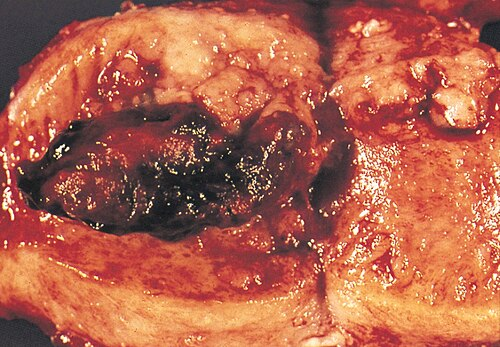

# CÂNCER DE ENDOMÉTRIO

O câncer de endométrio é a neoplasia ginecológica mais comum em países desenvolvidos e a segunda mais frequente no Brasil, atrás apenas do câncer de colo do útero. No entanto, para as provas de residência, ele assume um papel de protagonismo absoluto. Por quê? Porque o diagnóstico costuma ser precoce, o sintoma é clássico (sangramento na pós-menopausa) e a fisiopatologia é um prato cheio para questões sobre hormônios e metabolismo.

Como seu professor, quero que você entenda uma coisa fundamental: o endométrio é um tecido "viciado" em estrogênio e "controlado" pela progesterona. Quase tudo o que falaremos aqui gira em torno do desequilíbrio dessa balança.

## Epidemiologia e Fatores de Risco

*Figura 1 - Ilustração anatômica do câncer de endométrio, mostrando o tumor na cavidade uterina. Fonte: Blausen Medical Communications, CC BY 3.0 | Wikimedia Commons*

O perfil clássico da paciente que aparece na sua prova é a mulher na pós-menopausa, geralmente entre a sexta e sétima décadas de vida, que apresenta sangramento vaginal. Mas não é qualquer mulher. Existe uma tríade clássica que você deve procurar no enunciado: **Obesidade, Diabetes Mellitus e Hipertensão Arterial**.

### O papel central da Obesidade

A obesidade não é apenas um fator de risco, ela é o motor da doença no Tipo I (endometrióide). No tecido adiposo, ocorre a conversão periférica de andrógenos (principalmente a androstenediona) em estrona, através da enzima **aromatase**.

Em mulheres na pós-menopausa, os ovários não produzem mais progesterona (que viria do corpo lúteo após a ovulação). Assim, essa estrona periférica age de forma contínua e sem oposição no endométrio, estimulando a proliferação celular. É por isso que a obesidade aumenta drasticamente o risco.

### Outros Fatores de Risco (Exposição Estrogênica)

Tudo o que aumenta o tempo de exposição ao estrogênio ou diminui a exposição à progesterona é risco:

- **Menarca precoce e Menopausa tardia:** Mais ciclos, mais estrogênio.

- **Nuliparidade e Infertilidade:** A gestação é um período de "repouso" endometrial sob forte influência de progesterona. Quem nunca engravidou não teve esse descanso.

- **Anovulação Crônica (SOP):** Se não ovula, não forma corpo lúteo, não produz progesterona. O endométrio fica sob estímulo estrogênico isolado.

- **Tamoxifeno:** Atenção aqui! O tamoxifeno é um modulador seletivo do receptor de estrogênio (SERM). Ele é antagonista na mama (por isso trata o câncer de mama), mas é **agonista no endométrio**. Ele aumenta o risco de pólipos, hiperplasias e câncer.

- **Terapia de Reposição Hormonal (TRH) apenas com estrogênio:** Nunca se prescreve estrogênio isolado para mulher com útero. Se ela tem útero, a progesterona é obrigatória para proteger o endométrio.

### Fatores Genéticos: Síndrome de Lynch

A Síndrome de Lynch (Câncer Colorretal Não Poliposo Hereditário - HNPCC) é um tema recorrente. Pacientes com mutações nos genes de reparo do DNA (MLH1, MSH2, MSH6, PMS2) têm um risco de até 60% de desenvolver câncer de endométrio ao longo da vida. Muitas vezes, o câncer de endométrio é o "tumor sentinela", ocorrendo antes do câncer de cólon.

### O Paradoxo do Tabagismo

Cuidado com essa pegadinha de prova: o tabagismo, embora seja um desastre para quase tudo na medicina, é um **fator protetor** para o câncer de endométrio. O cigarro reduz os níveis de estrogênio circulante e antecipa a menopausa. Não vá marcar que o tabagismo aumenta o risco de câncer de endométrio só porque ele aumenta o de pulmão!

**Tabela 1: Fatores de Risco vs. Fatores Protetores**

| Fatores de Risco (Aumentam Estrogênio) | Fatores Protetores (Reduzem Estrogênio/Ação) |
| --- | --- |
| Obesidade (principal) | Multiparidade |
| Menarca precoce / Menopausa tardia | Uso de Anticoncepcionais Orais Combinados |
| Nuliparidade | Tabagismo (paradoxal) |
| Síndrome de Lynch II | Atividade Física (reduz gordura) |
| Uso de Tamoxifeno | Dieta rica em fibras |
| Diabetes e Hipertensão | SIU de Levonorgestrel |

## Lesões Precursoras: Hiperplasias Endometriais

*Figura 2 - Peça macroscópica de adenocarcinoma endometrial mostrando massa tumoral na cavidade uterina. Fonte: Armed Forces Institute of Pathology, Domínio Público | Wikimedia Commons*

Antes do câncer propriamente dito, o endométrio costuma passar por um processo de crescimento excessivo chamado hiperplasia. A classificação mudou recentemente para simplificar a conduta clínica. Esqueça aquela divisão antiga de "simples" e "complexa". Segundo a OMS e a FEBRASGO, dividimos em:

- **Hiperplasia Sem Atipias:** O risco de progressão para câncer é muito baixo (menos de 3%). O tratamento é clínico, geralmente com progestagênios (acetato de medroxiprogesterona ou SIU de levonorgestrel) para "opor" o estrogênio.

- **Hiperplasia Com Atipias (Neoplasia Intraepitelial Endometrial):** Aqui o risco é alto. Cerca de 30 a 40% dessas pacientes já têm um câncer invasivo oculto ou progredirão para um em pouco tempo.

**A conduta na Hiperplasia com Atipia:**
Em mulheres que já completaram a prole ou estão na pós-menopausa, a conduta é a **Histerectomia Total**. Não se faz apenas acompanhamento.

E se a paciente for jovem e quiser engravidar? Dr. Will sempre lembra: nesses casos excepcionais, podemos tentar o tratamento conservador com progestagênios em altas doses e biópsias trimestrais, mas isso é a exceção da exceção e exige acompanhamento rigoroso.

## Quadro Clínico e Diagnóstico

O sintoma cardeal é o **Sangramento Uterino Anormal (SUA)**, especificamente o sangramento na pós-menopausa.

> **Regra de Ouro do MedEvo:** Todo sangramento na pós-menopausa é câncer de endométrio até que se prove o contrário.

Embora a causa mais comum de sangramento na pós-menopausa seja a **atrofia endometrial** (o tecido fica tão fino que descama e sangra), o câncer é a causa mais grave que não podemos deixar passar.

### Exame Físico

Geralmente é inespecífico nas fases iniciais. No entanto, em casos avançados, podemos palpar massas anexiais ou notar um útero aumentado e fixo. O exame especular serve para excluir causas cervicais ou vaginais de sangramento.

### Investigação Complementar

O primeiro exame a ser solicitado diante de um sangramento na pós-menopausa é a **Ultrassonografia Transvaginal (USTV)**.

- **Espessura Endometrial:**

- Se a paciente **não** usa TRH: o ponto de corte é **4 mm** (algumas diretrizes aceitam até 5 mm). Endométrio ≤ 4 mm tem um valor preditivo negativo altíssimo para câncer.

- Se a paciente **usa** TRH: aceita-se até **8 mm**.

- Se a paciente é **assintomática** (achado incidental): não há consenso absoluto, mas geralmente investigamos se > 10-11 mm.

Se o endométrio estiver espessado ou se o sangramento persistir mesmo com endométrio fino, precisamos de uma amostra tecidual (biópsia).

### Métodos de Biópsia

- **Biópsia por Aspiração (Pipelle):** Pode ser feita no consultório. É boa, mas se vier negativa e o sangramento persistir, não exclui a doença (é um método cego).

- **Histeroscopia com Biópsia Dirigida:** É o **padrão-ouro**. Permite visualizar a cavidade, identificar áreas suspeitas ou pólipos e biopsiar exatamente onde está o problema.

- **Curetagem Uterina:** Reservada para quando a histeroscopia não está disponível ou quando há sangramento profuso que precisa de controle imediato. Também é um método cego e tem sido substituída pela histeroscopia.

**Cuidado com o Papanicolau:** O preventivo do colo do útero não serve para rastrear câncer de endométrio. No entanto, se o laudo vier com "Células Glandulares Atípicas (AGC-US)" ou presença de células endometriais em mulher após os 45 anos, você deve investigar o endométrio!

## Tipos Histológicos

Nem todo câncer de endométrio é igual. Dividimos em dois grandes grupos (Classificação de Bokhman):

### Tipo I (Endometrióide)

- É o mais comum (80-90%).

- Relacionado ao hiperestrogenismo e obesidade.

- Geralmente precede de hiperplasia.

- Bom prognóstico, diagnosticado precocemente.

- Graus histológicos G1 (bem diferenciado), G2 e G3 (pouco diferenciado).

### Tipo II (Não-endometrióide: Seroso e Células Claras)

- Menos comum, mas muito mais agressivo.

- **Não** tem relação com estrogênio ou obesidade. Ocorre em mulheres mais velhas e magras, com endométrio atrófico.

- Relacionado à mutação do gene **p53**.

- Comportamento semelhante ao câncer de ovário (disseminação peritoneal precoce).

- Sempre considerado alto grau.

**Tabela 2: Comparativo Tipo I vs. Tipo II**

| Característica | Tipo I (Endometrióide) | Tipo II (Seroso/Células Claras) |
| --- | --- | --- |
| Frequência | 80% | 10-20% |
| Estrogênio-dependente | Sim | Não |
| Precursor | Hiperplasia | Carcinoma intraepitelial |
| Tipo de Paciente | Obesa, jovem/peri-menopausa | Magra, idosa |
| Comportamento | Indolente | Agressivo |
| Mutação Comum | PTEN, KRAS, MMR | p53, HER2/neu |

## Estadiamento FIGO 2023

O estadiamento do câncer de endométrio é **cirúrgico-patológico**. Isso significa que você só sabe o estágio real após operar a paciente. Em 2023, a FIGO atualizou os critérios, incluindo marcadores moleculares, mas para a maioria das provas, a estrutura anatômica ainda é o que mais cai.

### Estágio I: Restrito ao corpo uterino

- **IA1:** Restrito ao endométrio ou invade menos de 50% do miométrio (G1 ou G2).

- **IA2:** Restrito ao endométrio ou invade menos de 50% do miométrio (G3 ou tipo II).

- **IB:** Invade 50% ou mais do miométrio.

### Estágio II: Invasão do estroma cervical

O tumor saiu do corpo e foi para o colo do útero, mas não saiu do útero.

### Estágio III: Disseminação local ou regional

- **IIIA:** Invade a serosa do útero ou anexos (ovários/trompas).

- **IIIB:** Invasão vaginal ou de paramétrios.

- **IIIC:** Metástase para linfonodos (C1: pélvicos; C2: para-aórticos).

### Estágio IV: Invasão de órgãos adjacentes ou metástases à distância

- **IVA:** Invasão da mucosa da bexiga ou reto.

- **IVB:** Metástases à distância (incluindo linfonodos inguinais e doença intra-abdominal).

**Novidade FIGO 2023:** Agora, se você tiver a classificação molecular (POLE mutado, MMR deficiente, p53 mutado), isso pode mudar o estágio. Por exemplo, um tumor restrito ao útero (Estágio I) que tem mutação p53 (agressivo) pode ser "upstaged". No entanto, para provas de residência geral, foque na anatomia descrita acima.

## Tratamento

O tratamento base é a **Cirurgia**.

### A Cirurgia Padrão

Para a grande maioria das pacientes (Estágio I), fazemos:

- Histerectomia Total Extra-fascial (tipo A).

- Anexectomia Bilateral (Salpingo-oforectomia).

- Avaliação Linfonodal (Linfonodo Sentinela ou Linfadenectomia Pélvica e Para-aórtica).

**Por que tirar os ovários?** Porque o câncer de endométrio pode ter micrometástases ovarianas (5% dos casos) e porque os ovários são fonte de estrogênio, que alimenta o tumor tipo I.

### O papel da Linfadenectomia

Este é um ponto de debate. Antigamente, fazia-se linfadenectomia em todo mundo. Hoje, a tendência é o **Linfonodo Sentinela**.

- Se o tumor é de baixo risco (Tipo I, G1 ou G2, invasão < 50% do miométrio), a chance de metástase linfonodal é mínima.

- Se o tumor é de alto risco (Tipo II ou G3 ou invasão profunda), a avaliação linfonodal é obrigatória.

### Tratamento Adjuvante (Pós-operatório)

A decisão de fazer Radioterapia (Braquiterapia ou Teleterapia) ou Quimioterapia depende dos fatores de risco encontrados na peça cirúrgica:

- **Braquiterapia vaginal:** Indicada para reduzir recidiva na cúpula vaginal em tumores com invasão miometrial.

- **Radioterapia pélvica:** Indicada quando há invasão de linfonodos ou paramétrios.

- **Quimioterapia:** Reservada para estágios avançados (III e IV) ou tipos histológicos agressivos (Tipo II).

### Tratamento Conservador

Como mencionado, em pacientes jovens, com desejo de gestação, tumor endometrióide G1, restrito ao endométrio (visto por RNM) e sem contraindicações, pode-se usar o **SIU de Levonorgestrel** ou progestagênios orais. Mas atenção: isso é uma exceção e a paciente deve ser submetida à histerectomia assim que completar a prole.

## Diagnósticos Diferenciais e Situações Especiais

Quando uma paciente sangra na pós-menopausa, você deve pensar em:

- **Atrofia Endometrial:** Causa mais comum. O endométrio na USG estará < 4 mm.

- **Pólipo Endometrial:** Frequentemente associado ao uso de Tamoxifeno. O diagnóstico é por histeroscopia.

- **Terapia de Reposição Hormonal:** O sangramento pode ocorrer nos primeiros meses de uso.

- **Leiomiomas:** Menos comuns de causarem sangramento novo na pós-menopausa (geralmente regridem), mas podem estar presentes.

- **Sarcomas Uterinos:** Tumores raros e muito agressivos. O **Leiomiossarcoma** é o principal. Suspeite se um "mioma" crescer rapidamente na pós-menopausa. Cuidado: o morcelador uterino em cirurgias laparoscópicas é contraindicado se houver suspeita de sarcoma, pois dissemina a doença.

### CA-125 no Câncer de Endométrio

O CA-125 não serve para diagnóstico. Ele é útil no **seguimento** e para suspeitar de disseminação extrauterina (especialmente nos tumores tipo II ou estágio III). Se o CA-125 estiver muito alto no pré-operatório, ligue o alerta para doença avançada.

## Prognóstico

O fator prognóstico mais importante isolado é o **Estadiamento** (especialmente o comprometimento linfonodal e a profundidade de invasão miometrial). Tumores Tipo I, Estágio IA, têm sobrevida em 5 anos superior a 90%. Já os tumores Tipo II têm prognóstico reservado, mesmo em estágios iniciais.

## Pontos-Chave para Prova

- **Fator de Risco Principal:** Obesidade (conversão periférica de androstenediona em estrona pela aromatase).

- **Sintoma Cardeal:** Sangramento uterino anormal na pós-menopausa.

- **Investigação Inicial:** Ultrassonografia Transvaginal.

- **Ponto de Corte USG:** 4 mm (sem TRH) ou 8 mm (com TRH).

- **Padrão-Ouro Diagnóstico:** Histeroscopia com biópsia dirigida.

- **Tipo Histológico Comum:** Adenocarcinoma Endometrióide (Tipo I).

- **Tipo Histológico Agressivo:** Seroso e Células Claras (Tipo II - mutação p53).

- **Síndrome de Lynch:** Alto risco para câncer de endométrio e cólon (critérios de Amsterdam).

- **Tamoxifeno:** Agonista estrogênico no útero (risco de câncer) e antagonista na mama.

- **Tabagismo:** Fator protetor (reduz estrogênio).

- **Tratamento Padrão:** Histerectomia Total + Anexectomia Bilateral + Avaliação Linfonodal.

- **Hiperplasia com Atipia:** Conduta é Histerectomia (risco de 30-40% de câncer oculto).

- **Estadiamento:** É cirúrgico-patológico (FIGO).

- **Linfonodo Sentinela:** Técnica de escolha atual para avaliação linfonodal em estágios iniciais.

- **O que NÃO fazer:** Não fazer curetagem como primeira linha se houver histeroscopia disponível; não prescrever estrogênio isolado para quem tem útero.

- **Pegadinha:** O Papanicolau normal NÃO exclui câncer de endométrio, mas AGC-US obriga a investigação endometrial. 🩺

 Cópia offline para consulta pessoal.
 Fonte original:
 [https://www.medevo.com.br/material-apoio/ler/31cac84b-1914-4380-ac42-dca03fec1fc3](https://www.medevo.com.br/material-apoio/ler/31cac84b-1914-4380-ac42-dca03fec1fc3)
