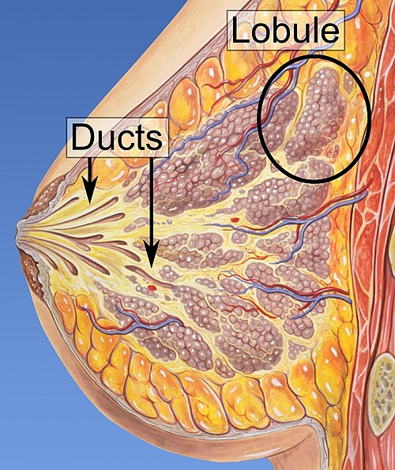
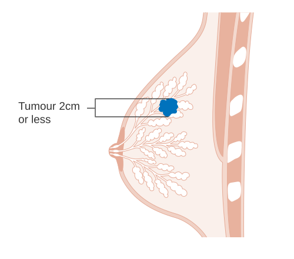

# CÂNCER DE MAMA

O câncer de mama é, disparado, o tema de oncologia cirúrgica mais cobrado em provas de residência médica no Brasil. Mas não se engane: as bancas não querem apenas que você saiba que "nódulo suspeito precisa de biópsia". Elas querem testar se você entende a anatomia cirúrgica da axila, se sabe indicar a quimioterapia no momento correto e se compreende as nuances entre uma cirurgia conservadora e uma mastectomia.

Aqui no MedEvo, focamos no que realmente cai. Vamos dissecar esse tema como se estivéssemos no centro cirúrgico.

## Anatomia Cirúrgica: Onde o Cirurgião se Perde (e você ganha pontos)

*Figura 1 - Anatomia dos lóbulos e ductos lactíferos da mama, estruturas fundamentais para compreender a origem dos carcinomas ductais e lobulares. Fonte: Mikael Häggström, CC BY 2.5 | Wikimedia Commons*

Para entender a cirurgia do câncer de mama, você precisa dominar a axila. A drenagem linfática da mama é 75% voltada para os linfonodos axilares. É por isso que o estadiamento axilar é o fator prognóstico isolado mais importante na doença precocemente detectada.

### Níveis de Berg

As bancas amam os Níveis de Berg. Eles são definidos pela relação anatômica com o **músculo peitoral menor**:

- **Nível I:** Lateral ao bordo lateral do peitoral menor.

- **Nível II:** Atrás (posterior) ao peitoral menor. Aqui também encontramos os **linfonodos de Rotter** (entre o peitoral maior e o menor).

- **Nível III:** Medial ao bordo medial do peitoral menor (ápice da axila).

**Dica de prova:** Na linfadenectomia axilar padrão (esvaziamento), normalmente limpamos os níveis I e II. O nível III só é abordado se houver doença clinicamente evidente ou linfonodos suspeitos nesse nível.

### Inervação e Complicações

Durante o esvaziamento axilar, três nervos estão em risco. Memorize isso, pois as complicações pós-operatórias são prato cheio para questões:

- **Nervo Torácico Longo (Nervo de Bell):** Inerva o músculo serrátil anterior. Se lesado, o paciente apresenta a **escápula alada** (a escápula "foge" das costas quando o paciente empurra uma parede).

- **Nervo Intercostobraquial:** É o nervo mais comumente lesado. Ele é sensitivo. A lesão causa parestesia (dormência) na face medial do braço.

- **Nervo do Grande Dorsal (Toracodorsal):** Inerva o músculo grande dorsal. A lesão prejudica a adução e rotação interna do braço.

### Irrigação Arterial

A mama não depende de um único vaso. Ela recebe 2/3 de sua irrigação da **artéria torácica interna** (mamária interna) e 1/3 da **artéria torácica externa** (lateral). Saber disso é fundamental para entender a viabilidade de retalhos em reconstruções.

## Rastreamento e Diagnóstico: O Caminho do Nódulo

O rastreamento no Brasil gera confusão porque temos duas recomendações. Para a prova, você deve olhar quem é a banca:

| Instituição | Idade de Início | Periodicidade |
| --- | --- | --- |
| **Ministério da Saúde / INCA** | 50 anos | Bienal (cada 2 anos) até os 69 anos |
| **SBM / FEBRASGO** | 40 anos | Anual |

**O "Pulo do Gato":** Se a questão fala em "rastreamento populacional pelo SUS", use a regra do Ministério da Saúde. Se fala em "recomendação das sociedades especialistas", use 40 anos anualmente.

### Avaliação de Massa Mamária

Paciente chegou com nódulo. O que fazer?

- **Exame Clínico:** Nódulo endurecido, fixo, com retração de pele ou descarga papilar hemática é câncer até que se prove o contrário.

- **Imagem:**

- < 35 anos: Ultrassonografia (mama densa).

-

> 35 anos: Mamografia + Ultrassonografia (se necessário).

- **Histopatologia:** O padrão-ouro para diagnóstico de lesão sólida é a **Core Biopsy** (biópsia por agulha grossa).

**Cuidado:** A PAAF (Punção Aspirativa por Agulha Fina) é excelente para **cistos** (esvazia o líquido e resolve o problema) ou para avaliar linfonodos axilares suspeitos. Para o nódulo mamário sólido, a PAAF é insuficiente porque não avalia a arquitetura do tecido (não diferencia carcinoma in situ de invasor).

### Interpretação de Mamografia (BI-RADS)

Você não pode ir para a prova sem saber a conduta do BI-RADS:

- **0:** Inconclusivo → Solicitar exames complementares (USG ou compressão).

- **1 e 2:** Benigno → Rastreamento de rotina.

- **3:** Provavelmente benigno (risco < 2%) → Repetir em 6 meses.

- **4 e 5:** Suspeito/Altamente suspeito → **Biópsia**.

- **6:** Câncer já confirmado por biópsia.

## Diagnóstico Diferencial: Nem tudo que reluz é Carcinoma

*Figura 2 - Diagrama mostrando o estágio T1 do câncer de mama, com tumor até 2 cm confinado à mama. Fonte: Cancer Research UK, CC BY-SA 4.0 | Wikimedia Commons*

Muitas questões trazem casos clínicos de patologias benignas para te testar.

- **Fibroadenoma:** Mulher jovem (20-30 anos), nódulo móvel, consistência fibroelástica. É a lesão benigna mais comum.

- **Esteatonecrose (Necrose gordurosa):** Paciente com história de trauma ou cirurgia prévia na mama. Pode mimetizar um câncer clinicamente e na mamografia (nódulo espiculado). O Dr. Will sempre lembra: "História de trauma + nódulo suspeito = pense em esteatonecrose".

- **Abscesso Subareolar Crônico:** Fortemente associado ao **tabagismo**. Causa fístulas recidivantes. O tratamento exige parar de fumar e ressecção dos ductos principais.

- **Mastite Inflamatória vs. Carcinoma Inflamatório:** Se a paciente tem sinais flogísticos (calor, rubor, edema em "casca de laranja"), você trata como mastite (antibiótico). Se não melhorar em 7-10 dias ou se houver linfonodos endurecidos associados, você **deve** suspeitar de Carcinoma Inflamatório e realizar biópsia de pele (punch).

## Tipos Histopatológicos e Perfil Molecular

O **Carcinoma Ductal Invasivo (CDI)** é o tipo mais comum (80%). O **Carcinoma Lobular Invasivo (CLI)** é o segundo e tem uma característica clássica de prova: tendência à **multicentricidade** (vários focos em quadrantes diferentes) e **bilateralidade**.

### Classificação Molecular (A base do tratamento moderno)

Hoje, não tratamos apenas o "tamanho" do tumor, mas o seu "RG" genético:

- **Luminal A:** Receptor Hormonal (RE/RP) positivo, HER2 negativo, Ki-67 baixo. Melhor prognóstico. Responde bem à hormonioterapia.

- **Luminal B:** RE/RP positivo, HER2 negativo ou positivo, Ki-67 alto. Mais agressivo que o A.

- **HER2-Enriquecido:** HER2 positivo, RE/RP negativos. Tratamento com terapia alvo (Trastuzumabe).

- **Triplo Negativo:** Tudo negativo. É o mais agressivo, comum em pacientes com mutação **BRCA1**. Como não tem receptores, o único tratamento sistêmico é a **quimioterapia**.

## Estadiamento TNM (Simplificado para Prova)

Não tente decorar a tabela inteira do AJCC. Foque nos pontos de corte que mudam a conduta:

- **T1:** ≤ 2 cm.

- **T2:** > 2 cm e ≤ 5 cm.

- **T3:** > 5 cm.

- **T4:** Extensão para parede torácica ou pele (independente do tamanho). O Carcinoma Inflamatório é sempre T4d.

- **N1:** Linfonodos axilares móveis ipsilaterais.

- **M1:** Metástase à distância (osso é o local mais comum).

## Tratamento Cirúrgico: Conservar ou Retirar?

Este é o coração da oncologia cirúrgica mamária. Por que fazemos cirurgia conservadora (quadrantectomia) em vez de tirar a mama toda? Porque estudos clássicos mostraram que **Cirurgia Conservadora + Radioterapia = Mastectomia** em termos de sobrevida global para tumores iniciais.

### Cirurgia Conservadora

**Indicação:** Tumor < 20% do volume da mama e possibilidade de margens livres.
**Contraindicações Absolutas (Memorize!):**

- Impossibilidade de realizar Radioterapia adjuvante (ex: lúpus em atividade, gestação no 1º/2º trimestre onde a RT não pode esperar).

- Doença multicêntrica (focos em quadrantes diferentes).

- Margens persistentemente positivas após re-excisões.

- Relação tumor/mama desfavorável (estética inaceitável).

### Mastectomias

- **Mastectomia Radical (Halsted):** Tira mama + peitoral maior + peitoral menor + axila. Praticamente não se faz mais, mas cai na prova como conceito histórico.

- **Mastectomia Radical Modificada (Patey):** Preserva o peitoral maior, retira o peitoral menor para acessar o nível III da axila.

- **Mastectomia Radical Modificada (Madden):** Preserva ambos os peitorais (maior e menor). É a mais realizada hoje quando se opta pela técnica radical.

### Abordagem da Axila

Antigamente, todo câncer de mama ia para esvaziamento axilar (linfadenectomia). Hoje, somos mais seletivos:

- **Biópsia de Linfonodo Sentinela (LS):** Indicada para axila clinicamente negativa (N0). O LS é o primeiro linfonodo a receber a drenagem do tumor. Se ele estiver limpo, a axila está limpa.

- **Esvaziamento Axilar (Níveis I e II):** Indicado se o linfonodo sentinela for positivo (com exceções como o estudo Z0011) ou se a axila já for clinicamente positiva (N1/N2) ao diagnóstico.

## Terapias Adjuvantes e Neoadjuvantes

Aqui o aluno costuma confundir os termos.

- **Adjuvante:** Feita **depois** da cirurgia (para "limpar" micrometástases).

- **Neoadjuvante:** Feita **antes** da cirurgia.

**Por que fazer Neoadjuvante?**

- Reduzir tumores grandes (T3/T4) para tentar uma cirurgia conservadora.

- Avaliar a resposta do tumor in vivo (especialmente no Triplo Negativo e HER2+).

- Tratar precocemente a doença sistêmica.

**Radioterapia (RT):**
Sempre obrigatória após cirurgia conservadora. Se não fizer RT, o risco de recidiva local é inaceitável. Também indicada na mastectomia se o tumor for > 5 cm (T3) ou se houver ≥ 4 linfonodos positivos.

**Hormonioterapia:**
Indicada se Receptores Hormonais forem positivos.

- Pré-menopausa: **Tamoxifeno** (modulador seletivo do receptor de estrogênio).

- Pós-menopausa: **Inibidores da Aromastase** (Anastrozol, Letrozol).

## Situações Especiais e Genética

### Câncer de Mama Hereditário

Suspeite se: Câncer em idade jovem (< 40 anos), bilateral, homem com câncer de mama, ou múltiplos casos na família (ovário, pâncreas, próstata).

- **BRCA1 e BRCA2:** Aumento drástico de risco para mama e ovário. Conduta: Vigilância estrita ou mastectomia/ooforectomia profilática.

- **Síndrome de Li-Fraumeni (TP53):** Múltiplos tumores (sarcomas, mama, SNC).

- **Gene CDH1:** Associado ao câncer gástrico difuso e carcinoma lobular de mama. Se mutado, pode-se indicar gastrectomia total profilática.

### Câncer de Mama na Gestação

O diagnóstico costuma ser tardio porque a mama da gestante é densa e ingurgitada.

- **Cirurgia:** Pode ser feita em qualquer trimestre.

- **Quimioterapia:** Pode ser feita a partir do **2º trimestre**.

- **Radioterapia e Hormonioterapia:** **Contraindicadas** durante toda a gestação (devem esperar o parto).

### Câncer de Mama Masculino

Raro (1% dos casos). Geralmente associado a mutações (BRCA2) ou condições que aumentam o estrogênio (Cirrose, Klinefelter). O quadro clínico é uma massa subareolar, firme, muitas vezes com retração de mamilo. O tratamento segue os princípios do feminino, mas quase sempre termina em mastectomia pela falta de parênquima para cirurgia conservadora.

## Tabelas Comparativas para Revisão Rápida

### Tabela 1: Diagnóstico Diferencial de Nódulos Mamários

| Característica | Fibroadenoma | Cisto Simples | Carcinoma |
| --- | --- | --- | --- |
| **Idade** | 15 - 35 anos | 35 - 50 anos | > 50 anos |
| **Consistência** | Fibroelástica | Elástica/Renitente | Pétrea/Endurecida |
| **Mobilidade** | Muito móvel | Móvel | Fixo/Aderido |
| **USG** | Nódulo hipoecoico, ovalado | Anecoico, reforço acústico posterior | Espiculado, sombra acústica posterior |

### Tabela 2: Tipos de Mastectomia

| Técnica | O que retira? | O que preserva? |
| --- | --- | --- |
| **Halsted** | Mama + Peitorais (M e m) + Axila | Nada |
| **Patey** | Mama + Peitoral Menor + Axila | Peitoral Maior |
| **Madden** | Mama + Axila | Peitoral Maior e Menor |
| **Simples** | Apenas a mama | Peitorais e Axila |

## Pontos-Chave para Prova 🎗️

- **Níveis de Berg:** I (lateral), II (atrás), III (medial) ao peitoral menor.

- **Escápula Alada:** Lesão do nervo torácico longo (Bell) → paralisia do serrátil anterior.

- **Parestesia do Braço:** Lesão do nervo intercostobraquial (complicação mais comum).

- **Rastreamento MS:** 50-74 anos, bienal (Nota Técnica nº 626/2025). Mulheres 40-49: por demanda, decisão compartilhada. SBM/CBR/FEBRASGO: 40-74 anos, anual.

- **BI-RADS 3:** Repetir em 6 meses. BI-RADS 4 e 5: Biópsia (Core Biopsy).

- **Cirurgia Conservadora + RT:** Tem a mesma sobrevida que a Mastectomia.

- **Contraindicação Absoluta de Cirurgia Conservadora:** Impossibilidade de Radioterapia e Multicentricidade.

- **Linfonodo Sentinela:** Primeiro linfonodo da cadeia. Se negativo, evita o esvaziamento axilar.

- **Carcinoma Inflamatório:** T4d. Conduta inicial é **Quimioterapia Neoadjuvante**, nunca cirurgia imediata.

- **Triplo Negativo:** Mais comum em BRCA1, agressivo, tratamento é quimioterapia.

- **Esteatonecrose:** História de trauma, mimetiza câncer no exame físico e imagem.

- **Abscesso Subareolar:** Associado ao tabagismo, alta taxa de recidiva se não parar de fumar.

- **Paget da Mama:** Lesão eczematosa do mamilo que não melhora com corticoide. Frequentemente associada a carcinoma ductal subjacente.

- **Linfonodos de Rotter:** Localizados entre os músculos peitorais (Nível II).

- **Gestação:** Quimioterapia liberada após o 1º trimestre; Radioterapia só após o parto.

- **Homem com Câncer de Mama:** Sempre investigar mutação genética (BRCA2).

- **Metástase:** O osso é o sítio mais comum de disseminação à distância.

- **Tamoxifeno:** Droga de escolha para hormonioterapia na pré-menopausa.

Este material foi estruturado para que você não precise de mais nada para gabaritar Câncer de Mama. Lembre-se do que discutimos aqui no MedEvo: a prova não quer o médico que decorou o livro, mas o médico que entende a lógica da conduta cirúrgica e oncológica.

 Cópia offline para consulta pessoal.
 Fonte original:
 [https://www.medevo.com.br/material-apoio/ler/1d88806c-ce51-4da5-b18d-19d01955248c](https://www.medevo.com.br/material-apoio/ler/1d88806c-ce51-4da5-b18d-19d01955248c)
