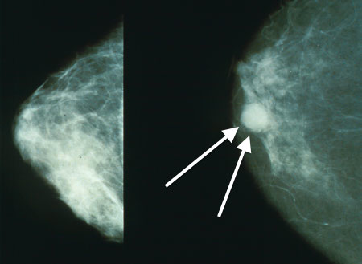
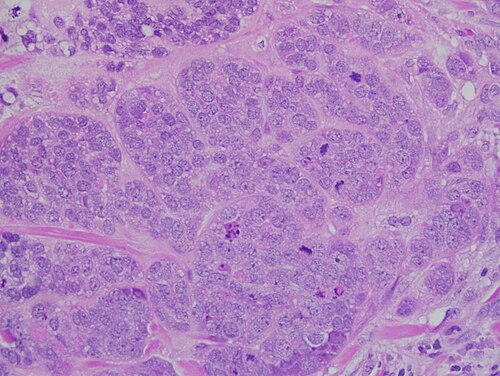

# CÂNCER DE MAMA E TRATAMENTO

O câncer de mama exige integração entre rastreamento, imagem, histopatologia, estadiamento e perfil molecular. A conduta muda conforme extensão da doença, status axilar, receptores hormonais, HER2 e risco de recorrência.

## Epidemiologia e Fatores de Risco

*Figura 1 - Mamografia demonstrando carcinoma de mama (setas). Note o nódulo espiculado, achado altamente suspeito. Fonte: Bakerstmd, CC BY-SA 4.0 | Wikimedia Commons*

Ponto epidemiológico central: o câncer de mama é a neoplasia maligna mais comum entre as mulheres no Brasil, excluindo câncer de pele não melanoma, e importante causa de morte por câncer no sexo feminino.

O principal fator de risco isolado é a idade. A incidência aumenta progressivamente, especialmente após os 50 anos. Ser do sexo feminino é o segundo fator mais relevante, embora o câncer de mama masculino exista (representando cerca de 1% dos casos).

### Fatores Genéticos e Hereditários

Apenas 5 a 10% dos casos são puramente hereditários, mas as bancas amam esse tópico. As mutações nos genes supressores tumorais BRCA1 (cromossomo 17) e BRCA2 (cromossomo 13) são as mais cobradas.

- BRCA1: Maior risco de câncer de mama e ovário ao longo da vida. Frequentemente associado a tumores triplo-negativos.

- BRCA2: Também aumenta o risco de mama e ovário, além de estar muito associado ao câncer de mama em homens.

Cuidado com a pegadinha: ter a mutação BRCA1/2 é um fator de risco para desenvolver a doença, mas não é um fator prognóstico de recorrência para quem já tem o tumor. Outras síndromes importantes incluem a Síndrome de Li-Fraumeni (mutação no TP53) e a Síndrome de Cowden (mutação no PTEN).

### Fatores Hormonais e Reprodutivos

O câncer de mama é, em sua maioria, uma doença da exposição ao estrogênio. Por isso, tudo que aumenta o tempo de exposição hormonal aumenta o risco:

- Menarca precoce (< 12 anos) e menopausa tardia (> 55 anos).

- Nuliparidade (a multiparidade é um fator protetor).

- Primeira gestação após os 30 anos.

- Terapia de Reposição Hormonal (TRH) combinada (estrogênio + progestágeno) por mais de 5 anos.

Dica de prova do Dr. Will: Diabetes Mellitus tipo 2 não é considerado um fator de risco primário para câncer de mama em provas de residência. Além disso, o uso de contraceptivos hormonais orais combinados ainda é um tema controverso na literatura, mas para a maioria das bancas, NÃO é um fator de risco estabelecido.

## Rastreamento: O Grande Embate (MS vs. Sociedades Médicas)

A interpretação do enunciado é essencial: a conduta pode variar conforme a referência solicitada, Ministério da Saúde (MS) ou sociedades especialistas (SBM/FEBRASGO/CBR).

Em dezembro de 2024, o Ministério da Saúde atualizou suas diretrizes, aproximando-se um pouco mais das sociedades, mas as diferenças persistem.

| Critério | Ministério da Saúde (PCDT 2024) | SBM / FEBRASGO / CBR |
| --- | --- | --- |
| **População Alvo** | 50 a 74 anos (Rastreamento populacional) | 40 a 74 anos (Rastreamento oportunístico) |
| **Periodicidade** | Bienal (A cada 2 anos) | Anual |
| **Faixa 40-49 anos** | Sob demanda (Decisão compartilhada) | Recomendação sistemática anual |
| **Acima de 75 anos** | Individualizado (Expectativa de vida) | Se expectativa de vida > 7 anos |

Para pacientes de alto risco (história familiar forte, mutações genéticas ou irradiação torácica prévia entre 10 e 30 anos), o rastreamento deve ser individualizado, geralmente começando mais cedo (aos 25 ou 30 anos) e incluindo Ressonância Magnética (RM) anual.

## Diagnóstico e Avaliação de Lesões

*Figura 2 - Carcinoma ductal invasivo de alto grau em microscopia (40x), o tipo histológico mais comum do câncer de mama. Fonte: Difu Wu, CC BY-SA 3.0 | Wikimedia Commons*

O diagnóstico baseia-se no tripé: Exame Clínico + Exame de Imagem + Histopatologia.

### Achados Clínicos e de Imagem

Um nódulo suspeito na prova costuma ser descrito como: endurecido, fixo, de contornos irregulares e indolor. O quadrante superoexterno é o local mais frequente de acometimento. Sinais como retração de pele, edema em "casca de laranja" (típico do carcinoma inflamatório) ou descarga papilar hemorrágica unilateral são alertas vermelhos.

Na mamografia, as microcalcificações pleomórficas, finas, lineares e ramificadas são altamente suspeitas de Carcinoma Ductal In Situ (CDIS). Já um nódulo espiculado com sombra acústica posterior sugere invasão.

### O Sistema BI-RADS

A conduta pelo BI-RADS deve ser dominada:

- **BI-RADS 0:** Inconclusivo. Conduta: Comparar com exames anteriores ou solicitar incidências adicionais/USG.

- **BI-RADS 1 e 2:** Achados normais ou benignos (ex: fibroadenoma calcificado). Conduta: Rastreamento de rotina.

- **BI-RADS 3:** Provavelmente benigno (< 2% de risco de malignidade). Conduta: Controle em 6 meses.

- **BI-RADS 4 e 5:** Suspeitos (4) ou altamente sugestivos de malignidade (5). Conduta: Biópsia percutânea.

### Métodos de Biópsia

Se o nódulo é BI-RADS 4 ou 5, precisamos de tecido.

- **Core Biopsy (Biópsia por agulha grossa):** É o padrão-ouro para nódulos. Permite avaliar a arquitetura do tecido e diferenciar carcinoma in situ de invasor.

- **Mamotomia (Biópsia a vácuo):** Preferencial para microcalcificações (BI-RADS 4 ou 5 sem nódulo visível no USG).

- **PAAF (Punção Aspirativa por Agulha Fina):** Ótima para esvaziar cistos sintomáticos ou avaliar linfonodos axilares, mas NÃO serve para diagnóstico definitivo de câncer de mama invasor, pois não avalia a invasão da membrana basal.

## Classificação Histopatológica e Molecular

O tratamento varia porque os tumores de mama são biologicamente diferentes, com comportamento determinado por histologia e perfil molecular.

### Tipos Histológicos

- **Carcinoma Ductal Infiltrante (sem tipo especial):** É o tipo mais comum (cerca de 80%).

- **Carcinoma Lobular Infiltrante:** Segundo mais comum. Tem maior tendência à bilateralidade e multifocalidade.

- **Carcinoma Ductal In Situ (CDIS):** Lesão não invasiva que não ultrapassou a membrana basal. Pode se manifestar por microcalcificações suspeitas na mamografia. O tratamento costuma envolver cirurgia conservadora com radioterapia ou mastectomia em doença extensa/multicêntrica.

- **Carcinoma Lobular In Situ (CLIS):** Marcador de risco e lesão não obrigatoriamente precursora direta. Costuma ser achado incidental em biópsia, pode ser multifocal/bilateral e indica maior risco futuro de câncer de mama em ambas as mamas. A conduta geralmente é vigilância intensificada e discussão de quimioprevenção; excisão é considerada em variantes pleomórficas, margens/discordância radiopatológica ou achados de maior risco.

### Subtipos Moleculares (Imuno-histoquímica)

A imuno-histoquímica avalia quatro marcadores: Receptor de Estrogênio (RE), Receptor de Progesterona (RP), HER2 e Ki-67 (índice de proliferação celular).

| Subtipo | Marcadores | Comportamento / Tratamento |
| --- | --- | --- |
| **Luminal A** | RE+, RP+, HER2-, Ki-67 baixo (< 20%) | Melhor prognóstico. Responde muito bem à hormonioterapia. |
| **Luminal B** | RE+, HER2- (mas Ki-67 alto) ou HER2+ | Intermediário. Pode precisar de quimioterapia além da hormonioterapia. |
| **HER2-Enriquecido** | RE-, RP-, HER2+ | Agressivo. Necessita de terapia anti-HER2 (Trastuzumabe). |
| **Triplo Negativo** | RE-, RP-, HER2- | Pior prognóstico. Mais comum em jovens e mutação BRCA1. Tratamento é basicamente quimioterapia. |

## Estadiamento TNM e Axilar

O estadiamento define a extensão da doença. O sistema TNM (8ª edição) considera o tamanho do tumor (T), o acometimento de linfonodos (N) e a presença de metástases (M).

- **T1:** Tumor ≤ 2 cm.

- **T2:** Tumor > 2 cm e ≤ 5 cm.

- **T3:** Tumor > 5 cm.

- **T4:** Extensão para parede torácica, pele (ulceração ou nódulos satélites) ou Carcinoma Inflamatório (T4d).

### A Avaliação da Axila

O status axilar é o fator prognóstico isolado mais importante para recorrência.

- **Axila clinicamente negativa (N0):** Realizamos a Biópsia do Linfonodo Sentinela (LS). O LS é o primeiro linfonodo a receber a drenagem linfática da mama. Se ele estiver negativo, não precisamos mexer no restante da axila, evitando o linfedema.

- **Axila clinicamente positiva ou LS positivo:** Tradicionalmente indica o Esvaziamento Axilar Radical (níveis I, II e III de Berg). No entanto, em casos selecionados (estudos Z0011), se a paciente vai para cirurgia conservadora e radioterapia, podemos evitar o esvaziamento mesmo com 1 ou 2 sentinelas positivos.

## Tratamento Cirúrgico

A escolha entre cirurgia conservadora e radical depende do tamanho do tumor em relação à mama e do desejo da paciente.

### Cirurgia Conservadora (Quadrantectomia)

Indicada para tumores iniciais (geralmente < 5 cm ou T1/T2) que permitam margens livres com bom resultado estético.
**Regra de Ouro:** Toda cirurgia conservadora OBRIGATORIAMENTE deve ser seguida de Radioterapia Adjuvante para reduzir o risco de recidiva local.

### Cirurgia Radical (Mastectomia)

Indicada em tumores volumosos, multicentricidade (focos em quadrantes diferentes), impossibilidade de realizar radioterapia ou desejo da paciente.

- **Mastectomia de Halsted:** Remove mama, peitorais maior e menor e linfonodos. Hoje é raramente usada.

- **Mastectomia de Madden:** Preserva os músculos peitorais. É a técnica mais comum quando se opta pela radicalidade.

A reconstrução mamária imediata deve ser oferecida sempre que possível. O uso de expansores ou próteses não aumenta o risco de recidiva local e não atrasa o tratamento complementar.

## Tratamento Sistêmico: Quimio e Hormonioterapia

O objetivo aqui é tratar a "doença micrometastática" que os exames de imagem não veem.

### Quimioterapia (QT)

- **Neoadjuvante (antes da cirurgia):** Usada para reduzir tumores grandes e permitir cirurgias conservadoras, ou em subtipos agressivos (Triplo Negativo e HER2+) para avaliar a resposta in vivo.

- **Adjuvante (após a cirurgia):** Indicada conforme o risco de recorrência (tumores > 1 cm, linfonodos positivos, subtipos agressivos).

### Hormonioterapia (HT)

Indicada para todos os tumores que expressam receptores hormonais (RE+ ou RP+).

- **Tamoxifeno:** Modulador seletivo do receptor de estrogênio (SERM). É o padrão para mulheres na pré-menopausa.

- Cuidado: Ele age como antiestrogênio na mama, mas como agonista no endométrio. Isso aumenta o risco de pólipos, hiperplasia e câncer de endométrio.

- **Inibidores da Aromataze (Anastrozole, Letrozole):** Indicados para mulheres na pós-menopausa. Eles impedem a conversão periférica de androgênios em estrogênios. O principal efeito colateral é a perda de massa óssea (osteoporose).

### Terapia Alvo

O Trastuzumabe é o anticorpo monoclonal contra a proteína HER2. Mudou a história natural desses tumores, que antes eram fatais e hoje têm excelente controle.

## Situações Especiais e Complicações

### Câncer de Mama na Gestação

É um desafio ético e técnico.

- **Cirurgia:** Pode ser feita em qualquer trimestre.

- **Quimioterapia:** Contraindicada no 1º trimestre (teratogênese). Pode ser feita no 2º e 3º trimestres.

- **Radioterapia:** Contraindicada durante TODA a gestação pelo risco de radiação fetal. Deve ser adiada para o pós-parto.

- **Hormonioterapia:** Contraindicada na gestação.

### Carcinoma Inflamatório

É um diagnóstico clínico: mama vermelha, quente, edemaciada (casca de laranja). É sempre considerado T4d (estádio III ou IV). O tratamento começa obrigatoriamente com quimioterapia neoadjuvante, seguida de mastectomia e radioterapia. Nunca comece pela cirurgia!

### Tumor Filoide

Um tumor estromal que cresce rápido e pode atingir grandes dimensões. O tratamento é a exérese cirúrgica com margens amplas (pelo menos 1 cm). Não costuma metastatizar para linfonodos, então não precisa de avaliação axilar.

### Doença de Paget

Lesão eczematosa do mamilo que não melhora com corticoide. Representa a migração de células neoplásicas pelos ductos até a epiderme da papila. O estadiamento é feito pelo tumor subjacente, se presente.

## Pontos-Chave para Prova

- **Principal fator de risco:** Idade avançada e sexo feminino.

- **Rastreamento MS (2024):** 50 a 74 anos, bienal (40-49 anos sob demanda).

- **Rastreamento SBM/FEBRASGO:** 40 a 74 anos, anual.

- **BI-RADS 3:** Repetir em 6 meses. BI-RADS 4 ou 5: Biópsia.

- **Core Biopsy:** Padrão para diagnóstico de tumor invasor. PAAF não diferencia in situ de invasor.

- **Quadrantectomia:** Sempre exige Radioterapia Adjuvante.

- **Linfonodo Sentinela:** Indicado para axila clinicamente negativa (N0).

- **Tamoxifeno:** Aumenta risco de câncer de endométrio (agonista uterino).

- **Inibidores da Aromataze:** Causam osteoporose (uso na pós-menopausa).

- **Contraindicação absoluta de Radioterapia:** Gestação e doenças do colágeno ativas (como Esclerodermia).

- **Carcinoma Inflamatório:** Diagnóstico clínico, T4d, iniciar com Quimioterapia Neoadjuvante.

- **Triplo Negativo:** Pior prognóstico, comum em jovens e mutação BRCA1.

- **Microcalcificações suspeitas:** Finas, pleomórficas e ramificadas (sugerem CDIS).

- **Dor lombar em paciente com CA de mama:** Suspeitar de metástase óssea e compressão medular. Solicitar RM de coluna urgente.

- **Diabetes Mellitus tipo 2:** Não é fator de risco primário para câncer de mama em provas. 💡

 Cópia offline para consulta pessoal.
 Fonte original:
 [https://www.medevo.com.br/material-apoio/ler/a462f716-880c-4158-b571-63dce5fba7ee](https://www.medevo.com.br/material-apoio/ler/a462f716-880c-4158-b571-63dce5fba7ee)
