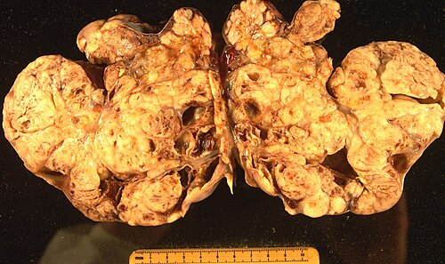
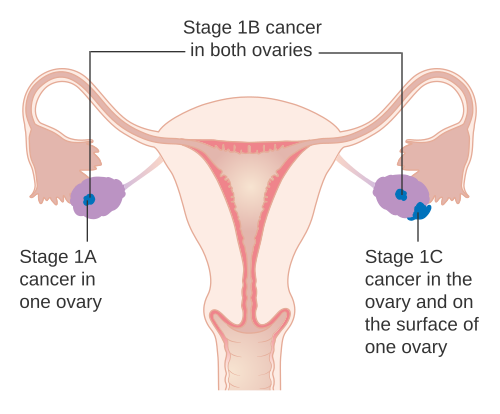

# CÂNCER DE OVÁRIO

O câncer de ovário é, sem dúvida, o "calcanhar de Aquiles" da ginecologia oncológica. Se no colo do útero temos o rastreamento com o Papanicolau e na mama temos a mamografia, no ovário não temos um exame de rastreio eficaz que reduza a mortalidade na população geral. Por isso, ele costuma ser diagnosticado em estádios avançados (75% dos casos em FIGO III ou IV).

Para a sua prova, entenda o seguinte: o examinador não quer apenas que você saiba que o câncer de ovário existe. Ele quer que você saiba diferenciar uma massa benigna de uma maligna, que entenda a importância do estadiamento cirúrgico e que reconheça as síndromes genéticas associadas.

## Epidemiologia e Fatores de Risco

*Figura 1 - Peça macroscópica de carcinoma ovariano, demonstrando a massa tumoral volumosa típica da apresentação tardia. Fonte: CC BY-SA 4.0 | Wikimedia Commons*

O câncer de ovário é a segunda neoplasia ginecológica mais comum (atrás do corpo do útero, se excluirmos o colo) e a mais letal. A maioria dos casos ocorre em mulheres pós-menopausa, com pico de incidência por volta dos 60 anos.

### Por que o câncer de ovário acontece?

A teoria mais aceita é a da "ovulação incessante". Cada vez que a mulher ovula, ocorre um trauma no epitélio ovariano seguido de reparação celular. Quanto mais vezes esse ciclo se repete, maior a chance de mutações. Isso explica por que fatores que interrompem a ovulação são protetores.

**Fatores de Risco:**

- Idade avançada (principal fator isolado).

- História familiar (câncer de mama ou ovário).

- Mutações genéticas (BRCA1 e BRCA2).

- Nuliparidade (quem nunca engravidou ovulou mais vezes).

- Menarca precoce e menopausa tardia.

- Obesidade e tabagismo (especialmente para tumores mucinosos).

**Fatores Protetores (O que "descansa" o ovário):**

- Uso de Anticoncepcionais Orais (ACO): Reduzem o risco em até 50% se usados por longo prazo. Esta é uma "pérola" recorrente em provas.

- Amamentação e Multiparidade.

- Laqueadura tubária e Salpingectomia: Hoje sabemos que muitos carcinomas serosos de alto grau começam, na verdade, nas fimbrias da tuba uterina (lesões STIC). Por isso, a salpingectomia oportunista durante outras cirurgias pélvicas é uma estratégia de redução de risco.

| Fator de Risco | Fator Protetor |
| --- | --- |
| Idade > 60 anos | Uso de ACO (por > 5 anos) |
| Mutação BRCA 1/2 | Multiparidade |
| História Familiar Forte | Amamentação |
| Nuliparidade | Salpingectomia / Laqueadura |
| Dieta rica em gordura | Exercício físico |

## Classificação Histológica

Não trate todo tumor de ovário como igual. Eles se dividem em três grandes linhagens, dependendo de qual célula deu origem ao tumor.

### 1. Tumores Epiteliais (90-95% dos casos)

São os tumores da mulher mais velha. O subtipo mais comum é o **Carcinoma Seroso de Alto Grau**.

- **Seroso:** O mais frequente. Frequentemente bilateral.

- **Mucinoso:** Tende a formar massas gigantes. Associado ao Pseudomixoma Peritoneal se houver ruptura.

- **Endometrioide:** Frequentemente associado à endometriose ovariana.

- **Células Claras:** Também associado à endometriose; tem pior prognóstico e é mais agressivo.

- **Tumor de Brenner:** Geralmente benigno, raro, derivado de epitélio transicional (tipo bexiga).

### 2. Tumores de Células Germinativas

São os tumores das crianças, adolescentes e mulheres jovens.

- **Teratoma Maduro:** O mais comum de todos os tumores ovarianos na infância. É benigno, mas pode complicar com torção.

- **Teratoma Imaturo:** A versão maligna do teratoma.

- **Disgerminoma:** O tumor maligno germinativo mais comum. É o equivalente ao seminoma no homem. Curiosidade de prova: é muito radiossensível e quimiossensível.

- **Tumor do Seio Endodérmico (Saco Vitelino):** Muito agressivo, eleva Alfafetoproteína (AFP).

### 3. Tumores do Estroma e Cordão Sexual

São tumores que podem produzir hormônios.

- **Tumor de Células da Granulosa:** Produz estrogênio. Pode causar puberdade precoce em crianças ou sangramento pós-menopausa em idosas.

- **Androblastoma (Sertoli-Leydig):** Produz androgênios, causando virilização (hirsutismo, clitomegalia).

- **Fibroma:** Tumor benigno. Importante pela **Síndrome de Meigs** (Fibroma + Ascite + Derrame Pleural).

## Diagnóstico e Avaliação Inicial

*Figura 2 - Diagrama mostrando o estádio I do câncer de ovário (tumor confinado ao(s) ovário(s)). Fonte: Cancer Research UK, CC BY-SA 4.0 | Wikimedia Commons*

O quadro clínico inicial é frustrante: distensão abdominal leve, saciedade precoce, flatulência e desconforto pélvico. Como diz o Dr. Will, "se uma paciente pós-menopausa começa com queixas gastrointestinais novas e o gastroenterologista não achou nada, olhe para o ovário".

### Marcadores Tumorais

Cuidado: Marcadores não servem para diagnóstico isolado, mas para seguimento e auxílio na suspeita.

- **CA-125:** É o marcador padrão para tumores epiteliais.

- *Problema:* Baixa especificidade em mulheres jovens (sobe na endometriose, miomatose, DIP, gravidez).

- *Utilidade:* Ótimo para avaliar resposta ao tratamento e recorrência.

- **CEA e CA 19-9:** Sugerem origem mucinosa ou metástase do trato digestivo.

- **hCG e Alfafetoproteína (AFP):** Obrigatórios em mulheres jovens com massa anexial (suspeita de germinativos).

- **LDH:** Elevado no Disgerminoma.

### Ultrassonografia (O padrão-ouro inicial)

A ultrassonografia transvaginal com Doppler é o melhor exame para avaliar o risco de malignidade. As bancas adoram os critérios do IOTA (International Ovarian Tumor Analysis).

**Sinais de Malignidade (Regras M - Malignant):**

- Tumor sólido irregular.

- Presença de ascite.

- Pelo menos 4 estruturas papilares.

- Tumor multilocular sólido irregular > 10 cm.

- Fluxo ao Doppler muito aumentado (Score 4).

**Sinais de Benignidade (Regras B - Benign):**

- Cisto unilocular.

- Presença de componentes sólidos < 7 mm.

- Presença de sombra acústica posterior (comum em teratomas).

- Tumor multilocular liso < 10 cm.

- Ausência de fluxo ao Doppler (Score 1).

## Diagnóstico Diferencial e Metástases

Nem toda massa no ovário nasceu no ovário.

- **Tumor de Krukenberg:** É uma metástase ovariana de um tumor primário do trato gastrointestinal (geralmente estômago). Caracteriza-se por **células em anel de sinete** na histologia. É bilateral em 80% dos casos.

- **Sinais de Alerta para Câncer Gástrico:** Linfonodo de Virchow (supraclavicular esquerdo), Linfonodo da Irmã Maria José (umbilical) e Prateleira de Blummer (toque retal com abaulamento por implante no fundo de saco).

## Estadiamento (FIGO)

Diferente do câncer de colo uterino (que é clínico), o estadiamento do câncer de ovário é **CIRÚRGICO**. Você só sabe o estádio real após abrir a paciente e realizar o inventário da cavidade.

- **Estádio I:** Limitado aos ovários (ou tubas).

- IA: Um ovário, cápsula íntegra.

- IB: Ambos os ovários, cápsula íntegra.

- IC: Ruptura de cápsula, tumor na superfície ou lavado peritoneal positivo.

- **Estádio II:** Extensão pélvica (útero, tubas, outros tecidos pélvicos).

- **Estádio III:** Implantes peritoneais fora da pelve e/ou linfonodos retroperitoneais positivos.

- Aqui entra o conceito de **Omental Cake** (o omento infiltrado por tumor, parecendo uma "placa").

- **Estádio IV:** Metástases à distância.

- IVA: Derrame pleural com citologia positiva.

- IVB: Metástases parenquimatosas (fígado, baço) ou linfonodos extra-abdominais.

## Tratamento

O tratamento do câncer de ovário baseia-se no binômio: **Cirurgia Citorredutora + Quimioterapia Adjuvante.**

### A Cirurgia

O objetivo principal é a **Citorredução Ótima**. Isso significa retirar todo o tumor visível, deixando resíduos menores que 1 cm (idealmente R0, ou seja, nenhum resíduo).

A cirurgia padrão (Estadiamento Completo) inclui:

- Laparotomia mediana ampla.

- Lavado peritoneal (ou coleta de ascite).

- Histerectomia Total Abdominal + Salpingo-ooforectomia Bilateral (HTA + SOB).

- Omentectomia infracólica.

- Linfadenectomia pélvica e para-aórtica.

- Biópsias de cúpulas diafragmáticas e peritônio parietal.

**Exceção (Cirurgia Preservadora):** Pode ser considerada em mulheres jovens, com desejo reprodutivo, em Estádio IA, grau 1 (bem diferenciado) ou em tumores germinativos. Faz-se apenas a anexectomia unilateral e o restante do estadiamento.

### A Quimioterapia

A maioria das pacientes (exceto estádio IA ou IB grau 1) precisará de quimioterapia. O esquema padrão é a combinação de um derivado de platina e um taxano: **Carboplatina + Paclitaxel**.

**Quimioterapia Neoadjuvante:** Se o cirurgião avaliar que a paciente não tem condições clínicas ou que o tumor é irressecável inicialmente (ex: carcinomatose muito extensa), pode-se fazer 3 ciclos de quimioterapia antes da cirurgia para "murchar" o tumor e facilitar a citorredução posterior.

## Situações Especiais e "Pérolas" de Prova

### Tumores Borderline (Baixo Potencial de Malignidade)

São tumores que apresentam proliferação epitelial, mas **sem invasão estromal**.

- Acometem mulheres mais jovens.

- Têm excelente prognóstico.

- O tratamento é basicamente cirúrgico. Mesmo que haja implantes peritoneais, eles costumam ser "não invasivos".

### Síndrome de Meigs

É a tríade: **Fibroma Ovariano + Ascite + Derrame Pleural**.
O que cai na prova: A ascite e o derrame desaparecem após a retirada do tumor (que é benigno!). Não confunda com câncer avançado. Se a questão der uma massa sólida + ascite + derrame, mas o CA-125 for normal e a paciente estiver em bom estado, pense em Meigs.

### Struma Ovarii

É um teratoma especializado composto majoritariamente por tecido tireoidiano. Pode causar **hipertireoidismo** clínico. Imagine a questão: paciente com massa anexial e sintomas de tireotoxicose.

### Pseudomixoma Peritoneal

Ocorre quando um tumor mucinoso (geralmente do apêndice, mas pode ser do ovário) se rompe e espalha células produtoras de mucina pela cavidade abdominal. O abdome fica preenchido por uma substância gelatinosa ("abdome em geleia").

## Rastreamento e Prevenção

Repita comigo: **Não existe rastreamento para câncer de ovário na população geral.**
Estudos como o UKCTOCS mostraram que realizar USG e CA-125 anualmente não reduz a mortalidade e aumenta o número de cirurgias desnecessárias.

**E nas pacientes de alto risco (BRCA1/2)?**
Para essas pacientes, a recomendação da FEBRASGO e de diretrizes internacionais é a **Salpingo-ooforectomia Bilateral Redutora de Risco** após a prole estar constituída (geralmente entre 35-40 anos para BRCA1 e 40-45 anos para BRCA2).

| Marcador | Tumor Associado |
| --- | --- |
| **CA-125** | Epitelial (Seroso) |
| **Alfafetoproteína (AFP)** | Seio Endodérmico (Saco Vitelino) |
| **hCG** | Coriocarcinoma / Disgerminoma (raro) |
| **LDH** | Disgerminoma |
| **Inibina / Estrogênio** | Células da Granulosa |
| **CEA / CA 19-9** | Mucinoso / Origem TGI |

## Diagnóstico Diferencial de Massas Anexiais

Na vida real e na prova, você receberá uma paciente com uma massa no ovário. Como raciocinar?

-

**Idade:**

- Criança/Adolescente: Pense em Germinativos ou Teratoma.

- Menacme: Pense em Cistos Funcionais, Endometriose, Gestação Ectópica, DIP.

- Pós-menopausa: Pense em Malignidade Epitelial até que se prove o contrário.

-

**Características Ultrassonográficas:**

- Cisto simples, anecoico, paredes finas: Provavelmente benigno.

- Cisto com septos espessos, áreas sólidas, papilas, ascite: Suspeita de malignidade.

-

**Marcadores:**

- Sempre peça hCG para excluir gravidez.

- CA-125 se suspeita de epitelial.

No MedEvo, sempre reforçamos: a conduta na massa anexial suspeita na pós-menopausa é **cirúrgica**. Não se faz biópsia de massa ovariana por agulha, pois se for câncer, você pode romper a cápsula e transformar um estádio IA em IC, piorando o prognóstico da paciente.

## Pontos-Chave para Prova

- **Rastreamento:** NÃO é recomendado para a população geral. USG e CA-125 não reduzem mortalidade.

- **Fator Protetor Clássico:** Uso de Anticoncepcionais Orais (ACO) por mais de 5 anos reduz o risco em 50%.

- **Estadiamento:** É obrigatoriamente CIRÚRGICO. Inclui lavado, HTA+SOB, omentectomia e linfadenectomia.

- **Tumor de Krukenberg:** Metástase de TGI (estômago) com células em anel de sinete. Geralmente bilateral.

- **Síndrome de Meigs:** Fibroma ovariano + ascite + derrame pleural. Tratamento é a retirada do tumor (benigno).

- **Marcador do Disgerminoma:** LDH (Desidrogenase Láctica). É o tumor maligno mais comum em jovens.

- **Marcador do Tumor de Saco Vitelino:** Alfafetoproteína (AFP). Muito agressivo.

- **Células da Granulosa:** Produzem estrogênio (causam hiperplasia endometrial e sangramento).

- **Sertoli-Leydig:** Produzem androgênios (causam virilização).

- **CA-125:** Elevado em 80% dos cânceres epiteliais, mas baixo valor preditivo positivo na pré-menopausa (sobe na endometriose).

- **Citorredução Ótima:** Resíduo tumoral < 1 cm após a cirurgia. É o principal fator prognóstico.

- **Quimioterapia Padrão:** Carboplatina + Paclitaxel.

- **Mutação BRCA:** Indicação de salpingo-ooforectomia profilática após prole constituída.

- **Linfonodo da Irmã Maria José:** Nódulo umbilical que indica carcinomatose peritoneal (frequentemente de origem gástrica ou ovariana).

- **Biópsia por Agulha:** Contraindicada em massas anexiais suspeitas pelo risco de disseminação (upstaging).

- **Tumores Borderline:** Proliferação epitelial SEM invasão de estroma. Bom prognóstico.

- **Pseudomixoma Peritoneal:** Associado a tumores mucinosos, geralmente do apêndice.

- **Teratoma Maduro:** Tumor ovariano mais comum na infância/adolescência (benigno). Pode conter dentes, cabelo e sebo.

 Cópia offline para consulta pessoal.
 Fonte original:
 [https://www.medevo.com.br/material-apoio/ler/0f02dcf1-d041-4b11-9fa4-0bc6ca65417b](https://www.medevo.com.br/material-apoio/ler/0f02dcf1-d041-4b11-9fa4-0bc6ca65417b)
