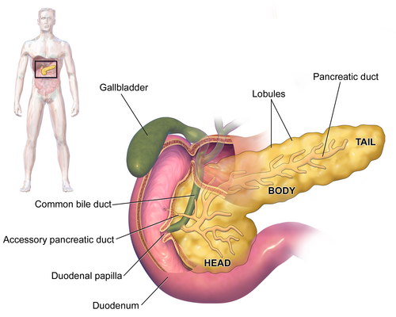
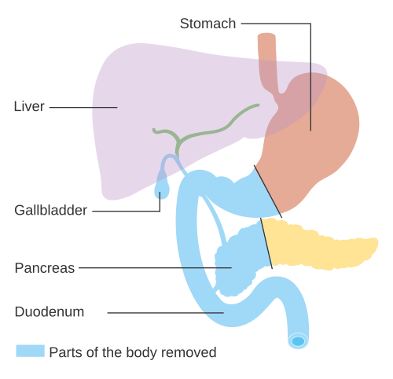

# CÂNCER DE PÂNCREAS

O adenocarcinoma ductal de pâncreas é uma das neoplasias mais desafiadoras da prática cirúrgica. Quando falamos desse tema para provas de residência, você precisa ter em mente que a banca não quer apenas que você saiba o nome da cirurgia. Ela quer que você saiba indicar quem opera, quem vai para quimioterapia primeiro e, principalmente, como diferenciar as diversas massas pancreáticas.

O pâncreas é um órgão "escondido" no retroperitônio. Isso explica por que o diagnóstico costuma ser tardio. Cerca de 80% dos pacientes já se apresentam com doença localmente avançada ou metastática ao diagnóstico. Nas provas, o cenário clássico é o idoso com icterícia indolor. Vamos entender por que isso acontece e como não cair nas pegadinhas de diagnóstico diferencial.

## Epidemiologia e Fatores de Risco

O câncer de pâncreas é a quarta causa de morte por câncer nos países desenvolvidos. No Brasil, sua incidência vem crescendo. O perfil típico é o paciente entre 60 e 80 anos, com leve predominância no sexo masculino.

O tabagismo é o fator de risco modificável mais importante. Ele dobra o risco de desenvolver a doença. Mas aqui vai uma dica de ouro que o MedEvo sempre reforça: preste atenção no diabetes mellitus (DM) de início recente em um idoso. Se um paciente de 65 anos, sem histórico familiar de DM e sem obesidade, subitamente abre um quadro de hiperglicemia, sua primeira suspeita deve ser câncer de pâncreas, não DM tipo 2 comum. O tumor destrói o parênquima e altera a sinalização hormonal antes mesmo de aparecer na tomografia.

Outros fatores incluem:

- Pancreatite crônica (especialmente a hereditária, que aumenta o risco em até 50 vezes).

- Obesidade e dieta rica em gorduras.

- Fatores genéticos: Mutações no gene BRCA2 (sim, o mesmo do câncer de mama), síndrome de Peutz-Jeghers e Lynch.

## Fisiopatologia: O Porquê da Agressividade

*Figura 1 - Anatomia do pâncreas mostrando cabeça, corpo e cauda, além de suas relações com o duodeno e vias biliares. Fonte: BruceBlaus/Blausen Medical, CC BY 3.0 | Wikimedia Commons*

A maioria (90%) dos tumores malignos do pâncreas são adenocarcinomas ductais. Eles se originam no epitélio dos ductos pancreáticos. A localização mais comum é a cabeça do pâncreas (75%), o que é uma "sorte" do ponto de vista diagnóstico, pois esses tumores causam sintomas mais cedo ao obstruir o colédoco.

Tumores de corpo e cauda são silenciosos. Eles crescem livremente no retroperitônio e, quando causam dor ou perda de peso, geralmente já invadiram o plexo celíaco ou o peritônio. Por isso, o prognóstico dos tumores de corpo e cauda costuma ser pior que o de cabeça: não pela biologia em si, mas pelo atraso no diagnóstico.

## Quadro Clínico e Exame Físico

Você vai encontrar na sua prova o binômio: Icterícia obstrutiva + Emagrecimento.

### A Icterícia Indolor

Por que indolor? Diferente da coledocolitíase, onde o cálculo causa uma obstrução aguda e espasmo da musculatura biliar (cólica biliar), o tumor cresce lentamente. A obstrução é progressiva. O organismo se adapta à pressão, e a dor não é o sintoma cardinal inicial.

### Sinal de Courvoisier-Terrier

Este é um clássico absoluto. É a palpação da vesícula biliar distendida e indolor em um paciente ictérico.
**Raciocínio clínico:** Se a obstrução fosse por um cálculo no colédoco, a vesícula geralmente estaria fibrótica e murcha devido a episódios prévios de colecistite ou colelitíase (Lei de Courvoisier). Se a vesícula está dilatada e palpável, a obstrução é distal ao ducto cístico e de natureza neoplásica (cabeça de pâncreas, ampola de Vater, colédoco distal ou duodeno).

### Outros Sinais e Sintomas

- **Dor Epigástrica com Irradiação para o Dorso:** Indica invasão do plexo celíaco (sinal de mau prognóstico).

- **Sinal de Trousseau:** Tromboflebite migratória superficial. O câncer de pâncreas é altamente pró-trombótico.

- **Sinal de Sister Mary Joseph:** Nódulo umbilical palpável, indicando metástase peritoneal (doença avançada).

## Diagnóstico e Estadiamento

Se você suspeita de câncer de pâncreas, o primeiro exame de imagem a ser solicitado, na prática de pronto-socorro, pode ser o ultrassom (USG), que verá a dilatação das vias biliares. Mas, para a prova e para o planejamento cirúrgico, o padrão-ouro é a Tomografia Computadorizada (TC) de abdome com protocolo pancreático (multislice, com contraste venoso em fases arterial, pancreática e portal).

### Por que o Protocolo Pancreático?

O pâncreas é um órgão hipovascular em relação ao restante do parênquima. Na fase pancreática (cerca de 40 segundos após o contraste), o pâncreas normal "brilha" e o tumor aparece como uma massa hipocaptante (mais escura). Isso permite ver a relação do tumor com os vasos, que é o que define se o paciente pode operar ou não.

### Marcadores Tumorais: CA 19-9

Cuidado aqui! O CA 19-9 **NÃO** serve para diagnóstico inicial nem para rastreamento.

- Ele pode estar elevado em qualquer icterícia obstrutiva benigna (colangite, pedra).

- Cerca de 10% da população é "Lewis antígeno negativo" e não produz CA 19-9, mesmo com tumores gigantes.
**Para que serve então?** Prognóstico e acompanhamento pós-operatório. Se o CA 19-9 estava 1000, caiu para 20 após a cirurgia e agora subiu para 200, o tumor voltou.

### O Papel da Ecoendoscopia (EUS) e PAAF

Muitos alunos erram achando que todo mundo precisa de biópsia antes de operar.
**Regra de ouro:** Se o tumor é claramente ressecável na TC e o paciente tem condições cirúrgicas, **NÃO** fazemos biópsia. Vamos direto para a cirurgia. A biópsia (via ecoendoscopia com agulha fina - FNA) está reservada para:

- Casos de dúvida diagnóstica (ex: pancreatite autoimune).

- Pacientes que farão quimioterapia neoadjuvante (precisamos de prova histológica antes da quimio).

- Tumores irressecáveis ou metastáticos.

## Estadiamento e Ressecabilidade (Critérios NCCN)

*Figura 2 - Diagrama da duodenopancreatectomia (cirurgia de Whipple), mostrando as estruturas removidas: cabeça do pâncreas, duodeno, vesícula biliar e parte do estômago. Fonte: Cancer Research UK, CC BY-SA 4.0 | Wikimedia Commons*

Este é o ponto onde as bancas mais apertam. Você precisa saber a relação do tumor com a Veia Mesentérica Superior (VMS), Veia Porta (VP), Artéria Mesentérica Superior (AMS) e Tronco Celíaco.

| Classificação | Critério Vascular (Simplificado) | Conduta Inicial |
| --- | --- | --- |
| **Ressecável** | Sem contato com artérias (AMS, Celíaco). Contato < 180º com VMS/VP sem deformidade. | Cirurgia (Whipple ou Pancreatectomia Distal) |
| **Borderline** | Contato < 180º com AMS. Contato > 180º com VMS/VP ou oclusão passível de reconstrução. | Neoadjuvância (Quimio primeiro) |
| **Localmente Avançado** | Contato > 180º com AMS ou Tronco Celíaco. Oclusão de VMS/VP irreconstruível. | Quimioterapia Sistêmica / Paliativo |
| **Metastático** | Presença de metástase à distância (Fígado é o sítio #1). | Quimioterapia Paliativa |

**Atenção:** Invasão da artéria hepática ou da artéria mesentérica superior > 180º geralmente torna o tumor irressecável. Já a invasão da veia porta ou VMS pode ser manejada com ressecção vascular e reconstrução, mantendo a intenção curativa.

## Tratamento Cirúrgico

A cirurgia depende da localização do tumor.

### 1. Tumores de Cabeça e Processo Uncinado: Cirurgia de Whipple

Também chamada de Gastroduodenopancreatectomia. É uma das cirurgias mais complexas do aparelho digestivo.
**O que é retirado?** Cabeça do pâncreas, duodeno, 15cm iniciais do jejuno, vesícula biliar, colédoco e, na técnica clássica, o antro gástrico (embora a preservação pilórica seja comum hoje).
**A Reconstrução:** São três anastomoses (o "tripé" de Whipple):

- Pancreato-jejunostomia (a mais perigosa, onde ocorrem as fístulas).

- Hepático-jejunostomia.

- Gastro ou Duodeno-jejunostomia.

### 2. Tumores de Corpo e Cauda: Pancreatectomia Distal com Esplenectomia

Aqui a cirurgia é mais simples tecnicamente, mas o prognóstico costuma ser pior pela detecção tardia. A esplenectomia é necessária para garantir a linfadenectomia adequada ao longo da artéria esplênica.

### Complicações Pós-Operatórias

A fístula pancreática é o pesadelo do cirurgião. Segundo o ISGPS (International Study Group on Pancreatic Surgery), ela é definida pela drenagem de líquido pelo dreno abdominal com nível de amilase > 3x o limite superior do soro, a partir do 3º dia de pós-operatório.

- **Fístula Grau A (Bioquímica):** Sem repercussão clínica. Apenas observa.

- **Fístula Grau B e C:** Exigem mudança de conduta (antibiótico, nutrição parenteral, drenagem percutânea ou reoperação).

## Neoplasias Císticas do Pâncreas

Nem toda massa no pâncreas é adenocarcinoma. As bancas amam cobrar o diagnóstico diferencial dos cistos, pois a conduta muda completamente. Como diz o Dr. Will, "nem tudo que é cístico é para operar, mas o que é mucinoso nos preocupa".

| Tipo de Cisto | Perfil do Paciente | Localização | Características / Conduta |
| --- | --- | --- | --- |
| **Cistoadenoma Seroso** | Mulher idosa | Cabeça | Aspecto em "favo de mel", cicatriz central. **Benigno**. Só opera se sintomas compressivos. |
| **Cistoadenoma Mucinoso** | Mulher meia-idade | Corpo/Cauda | Cisto único, grande, com septos. **Potencial Maligno**. Sempre ressecar. |
| **IPMN** | Homem/Mulher idosos | Ducto Principal ou Ramos | Comunica com o ducto pancreático. Risco de malignidade se ducto principal > 10mm ou nódulo sólido. |
| **Tumor de Frantz** | Mulher jovem (20-30 anos) | Qualquer lugar | Massa sólido-cística, hemorrágica. Baixo grau de malignidade. Ressecção é curativa. |

**Dica de Prova:** Se a questão mostrar um líquido de punção (FNA) com CEA elevado (> 192 ng/mL), pense em neoplasia mucinosa (Cistoadenoma Mucinoso ou IPMN). Se o CEA for baixo e a amilase baixa, pense em Seroso. Se a amilase for altíssima, pense em Pseudocisto (sequela de pancreatite).

## Tumores Periampulares

O adenocarcinoma de pâncreas é um dos quatro tumores periampulares. Eles se manifestam de forma muito parecida (icterícia obstrutiva), mas têm prognósticos diferentes.

- **Adenocarcinoma de Cabeça de Pâncreas:** O mais comum e o de pior prognóstico.

- **Ampuloma (Tumor da Ampola de Vater):** Frequentemente causa icterícia flutuante (o tumor sofre necrose central, o canal abre, a icterícia melhora, depois o tumor cresce e obstrui de novo). Tem o melhor prognóstico.

- **Colangiocarcinoma Distal:** Tumor do colédoco terminal.

- **Tumor de Duodeno:** O mais raro.

**Cuidado:** O "Adenocarcinoma de Calot" ou tumores da vesícula biliar NÃO são periampulares. Eles estão em uma topografia superior.

## Tratamento Paliativo

Se o paciente é irressecável ou metastático, o foco é qualidade de vida:

- **Icterícia:** Preferencialmente drenagem por via endoscópica (CPRE) com colocação de prótese (stent). A cirurgia de derivação biliodigestiva só é feita se o paciente já estiver sendo operado e o cirurgião descobrir que o tumor é irressecável no inventário de cavidade.

- **Obstrução Duodenal:** Stent duodenal ou gastrojejunostomia paliativa.

- **Dor:** Bloqueio do plexo celíaco (pode ser feito por ecoendoscopia).

## Pontos-Chave para Prova

- **Icterícia Indolor + Vesícula de Courvoisier:** É o quadro clássico de adenocarcinoma de cabeça de pâncreas.

- **Diabetes de Início Recente em Idoso:** Sempre suspeitar de neoplasia pancreática oculta.

- **Padrão-Ouro Diagnóstico:** TC de abdome multislice com protocolo pancreático.

- **Biópsia Pré-operatória:** NÃO é necessária se a imagem for típica e o tumor for ressecável.

- **Critério de Irressecabilidade Absoluta:** Metástases à distância (fígado, peritônio) ou envolvimento arterial circunferencial (> 180º) da AMS ou Tronco Celíaco.

- **Tumor de Frantz:** Mulher jovem + massa sólido-cística. Conduta: Ressecção (bom prognóstico).

- **Cistoadenoma Seroso:** "Favo de mel", benigno, conduta conservadora na maioria dos casos.

- **Cistoadenoma Mucinoso:** Potencial maligno, corpo/cauda, mulher meia-idade. Conduta: Cirurgia.

- **Marcador CA 19-9:** Útil para seguimento e prognóstico, nunca para diagnóstico isolado.

- **Cirurgia de Whipple:** Retira cabeça do pâncreas, duodeno, colédoco distal e vesícula.

- **Fístula Pancreática:** Amilase no dreno > 3x o valor sérico a partir do 3º dia de PO.

- **GIST Gástrico:** Diferente do pâncreas, a linfadenectomia de rotina NÃO é indicada; o foco é margem R0.

- **Icterícia Flutuante:** Pense em Tumor de Ampola de Vater (Ampuloma).

- **PET-Scan:** Não é o exame inicial. Pode ser usado em casos de dúvida sobre metástases pequenas ou recorrência.

- **Linfoma Gástrico:** O tratamento inicial geralmente é clínico (QT/RT ou erradicação de H. pylori no MALT), não Whipple.

- **O que NÃO fazer:** Não indicar cirurgia curativa se houver implantes peritoneais ou metástases hepáticas, mesmo que pequenas. Nesse caso, a conduta é paliação e biópsia.

 Cópia offline para consulta pessoal.
 Fonte original:
 [https://www.medevo.com.br/material-apoio/ler/625483c1-81d4-40f4-87b6-1165e8f9854b](https://www.medevo.com.br/material-apoio/ler/625483c1-81d4-40f4-87b6-1165e8f9854b)
