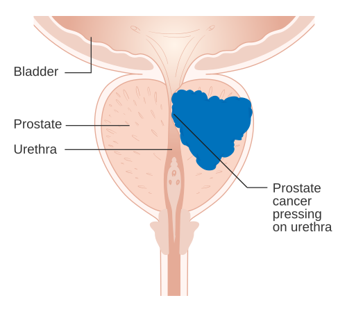
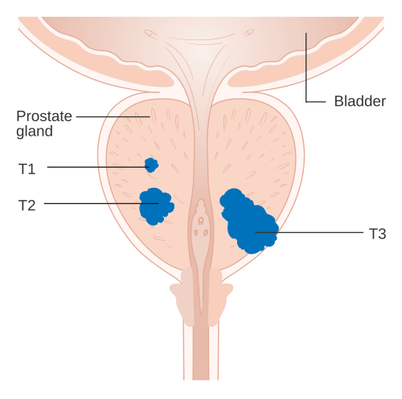

# CÂNCER DE PRÓSTATA: RASTREAMENTO E ESTADIAMENTO

O câncer de próstata (CaP) é o tumor sólido mais comum no homem (atrás apenas do câncer de pele não melanoma) e a segunda causa de morte por câncer no sexo masculino. Para a sua prova de residência, você não precisa ser um urologista, mas precisa pensar como um. O examinador quer saber se você sabe quem rastrear, quando indicar uma biópsia e como separar o "joio do trigo": quem tem uma doença indolente que pode ser apenas observada e quem tem uma doença agressiva que exige tratamento imediato.

## Epidemiologia e Fatores de Risco: Onde o Problema Começa

*Figura 1 - Diagrama mostrando o câncer de próstata comprimindo a uretra prostática. Na maioria dos casos, o tumor origina-se na zona periférica. Fonte: Cancer Research UK, CC BY-SA 4.0 | Wikimedia Commons*

Antes de falarmos de exames, entenda o perfil do paciente. O câncer de próstata é uma doença do envelhecimento. É raríssimo antes dos 40 anos, mas sua incidência decola após os 50.

Existem três fatores de risco "clássicos" que as bancas amam:

- **Idade:** O principal fator. Quanto mais velho, maior o risco.

- **Etnia:** Homens negros possuem maior incidência, apresentam tumores mais agressivos e em idades mais precoces. Guarde isso: a abordagem aqui deve ser mais precoce.

- **História Familiar:** Ter um parente de primeiro grau (pai ou irmão) com CaP duplica o risco. Se forem dois parentes, o risco aumenta em 5 a 10 vezes.

**Cuidado com a pegadinha:** O câncer de próstata NÃO é o câncer mais comum globalmente em homens se incluirmos pele não melanoma. Se a questão disser "câncer mais comum excetuando-se pele", aí sim ele assume o topo do pódio.

Diferente da Hiperplasia Prostática Benigna (HPB), que ocorre predominantemente na zona de transição (ao redor da uretra, causando sintomas obstrutivos), o adenocarcinoma de próstata (95% dos casos são do tipo acinar) origina-se em 70-80% das vezes na **zona periférica** (Classificação de McNeal).

Por que isso importa? Porque a zona periférica é a que você palpa no toque retal. É por isso que o tumor costuma ser assintomático nas fases iniciais; ele está "longe" da uretra, crescendo silenciosamente na periferia da glândula. Quando o paciente apresenta sintomas urinários obstrutivos ou hematúria, ou a doença já está avançada localmente, ou ele tem HPB concomitante.

## Rastreamento: O Dilema do PSA e do Toque Retal

O rastreamento (screening) é o tema que mais gera confusão, pois as diretrizes mudaram muito nos últimos anos. No Brasil, seguimos as orientações da Sociedade Brasileira de Urologia (SBU).

### Quando começar?

- **População Geral:** Aos 50 anos.

- **Grupos de Risco (Negros ou História Familiar de 1º grau):** Aos 45 anos.

- **Expectativa de Vida:** Aqui está o "pulo do gato". Não se faz rastreamento em pacientes com expectativa de vida inferior a 10-15 anos. Se o paciente tem 85 anos e múltiplas comorbidades, o câncer de próstata provavelmente não será a causa de sua morte. O rastreamento nesse caso levaria ao *overdiagnosis* e *overtreatment*.

### Como fazer?

O rastreamento é a combinação de **PSA Total + Toque Retal (DRE)**. Nunca faça apenas um deles.

**O Toque Retal:**
Buscamos nódulos, endurecimentos ou assimetrias.

- **Pérola de Prova:** Se o toque estiver alterado (nódulo palpável), a biópsia está indicada **independentemente do valor do PSA**. Mesmo que o PSA seja 1,0 ng/mL, um nódulo endurecido é suspeito e exige investigação.

**O PSA (Antígeno Prostático Específico):**
O PSA é uma enzima produzida pela próstata para liquefazer o sêmen. Ele é **órgão-específico, mas não é câncer-específico**. Isso significa que o PSA sobe no câncer, mas também sobe na HPB, na prostatite, após o coito, após andar de bicicleta ou após o próprio toque retal (embora o aumento pelo toque seja clinicamente insignificante, as provas ainda podem cobrar o intervalo de espera).

Valores de referência:

- Geralmente, consideramos suspeito um PSA > 4,0 ng/mL.

- No entanto, usamos o PSA ajustado pela idade. Um PSA de 3,5 pode ser normal para um homem de 70 anos, mas é muito suspeito para um de 45.

### Refinando o PSA: A "Zona Cinzenta" (4,0 a 10,0 ng/mL)

Quando o PSA está entre 4 e 10, temos muita dúvida. Para aumentar o Valor Preditivo Positivo (VPP) e evitar biópsias desnecessárias, usamos ferramentas auxiliares:

- **Relação PSA Livre/Total:** No câncer, o PSA circula mais ligado a proteínas. Portanto, se a relação PSA Livre/Total for **baixa (< 15-20%)**, o risco de câncer é maior. Se for alta (> 25%), sugere HPB.

- **Densidade do PSA:** É o valor do PSA dividido pelo volume da próstata (medido pelo USG). Valores **> 0,15** são suspeitos. Por que? Porque uma próstata gigante de 100g pode produzir um PSA de 6 legitimamente por HPB, mas uma próstata de 20g com PSA de 6 tem "algo a mais" produzindo essa enzima.

- **Velocidade do PSA:** Avalia o aumento ao longo do tempo. Um aumento **> 0,75 ng/mL/ano** é preocupante.

- **Ressonância Magnética Multiparamétrica (RMmp) de Pelve:** Hoje, a RMmp é fundamental antes da biópsia. Ela usa o escore **PI-RADS** (1 a 5). PI-RADS 4 e 5 são altamente suspeitos e indicam biópsia dirigida ao alvo.

| Ferramenta | Valor Suspeito | Sugere... |
| --- | --- | --- |
| PSA Total | > 4,0 ng/mL | Câncer, HPB ou Prostatite |
| PSA Livre/Total | < 15% a 20% | Maior probabilidade de Câncer |
| Densidade PSA | > 0,15 | Câncer (produção excessiva para o tamanho) |
| Velocidade PSA | > 0,75 ng/mL/ano | Crescimento tumoral rápido |
| PI-RADS (RM) | 4 ou 5 | Lesão clinicamente significativa |

## Diagnóstico: A Biópsia Prostática

O diagnóstico definitivo de adenocarcinoma de próstata é **HISTOPATOLÓGICO**.
A biópsia é realizada por via transretal guiada por ultrassonografia (USG-TR). Geralmente, colhem-se 12 fragmentos (sextante estendido).

**Indicações de Biópsia:**

- Toque retal suspeito (independente do PSA).

- PSA > 10 ng/mL.

- PSA entre 4-10 ng/mL com refinamentos alterados (L/T baixo, densidade alta).

- RMmp com PI-RADS 4 ou 5.

**Complicações da Biópsia:**
O aluno MedEvo deve lembrar que a próstata está encostada no reto. A principal complicação é a **infecção (prostatite aguda/sepse de origem urinária)** por translocação bacteriana (E. coli). Por isso, o uso de antibióticos profiláticos (geralmente quinolonas) é obrigatório. Outras complicações comuns: hematúria, hemospermia (sangue no sêmen) e retorragia leve.

## Patologia: O Escore de Gleason e a Classificação ISUP

*Figura 2 - Diagrama mostrando os estádios T1 a T3 do câncer de próstata, desde tumor incidental até extensão extracapsular. Fonte: Cancer Research UK, CC BY-SA 4.0 | Wikimedia Commons*

Uma vez que a biópsia confirmou o câncer, precisamos saber o quão "bravo" ele é. Para isso, usamos o **Escore de Gleason**.

O patologista olha as glândulas e dá uma nota de 1 a 5 para o padrão predominante e uma nota de 1 a 5 para o segundo padrão mais comum. A soma é o Gleason.

- **Gleason 6 (3+3):** Tumor bem diferenciado, baixo grau.

- **Gleason 7 (3+4 ou 4+3):** Risco intermediário. Atenção: 4+3 é pior que 3+4, pois o padrão 4 (mais agressivo) é o predominante.

- **Gleason 8 a 10:** Tumor indiferenciado, alto grau, muito agressivo.

Recentemente, a classificação foi simplificada para os **Grupos de Graduação da ISUP (1 a 5)**:

- ISUP 1: Gleason ≤ 6

- ISUP 2: Gleason 7 (3+4)

- ISUP 3: Gleason 7 (4+3)

- ISUP 4: Gleason 8

- ISUP 5: Gleason 9 ou 10

**Dica do Dr. Will:** Se a prova trouxer um Gleason 8 ou superior, ligue o alerta para metástases. Esse paciente obrigatoriamente precisará de estadiamento sistêmico.

## Estadiamento: Localizado ou Metastático?

O estadiamento do CaP utiliza o sistema TNM, mas para a prova, o que realmente cai é a **Classificação de Risco de D'Amico**. Ela prediz o risco de falha bioquímica (o PSA voltar a subir) após o tratamento curativo.

### Classificação de D'Amico (Essencial para Provas)

| Risco | PSA | Gleason | Estádio Clínico (T) |
| --- | --- | --- | --- |
| **Baixo** | < 10 | ≤ 6 (ISUP 1) | T1c ou T2a |
| **Intermediário** | 10 - 20 | 7 (ISUP 2 ou 3) | T2b |
| **Alto** | > 20 | ≥ 8 (ISUP 4 ou 5) | ≥ T2c |

*Nota: Basta UM critério da linha para classificar o paciente naquele risco (sempre pelo pior critério).*

### Quando pedir exames de imagem?

Não pedimos cintilografia óssea para todo mundo! O câncer de próstata tem uma predileção quase exclusiva por **metástases ósseas osteoblásticas** (que "constroem" osso, aparecendo como manchas brancas/densas no RX ou hipercaptação na cintilografia).

Segundo a SBU e as principais diretrizes, solicitamos avaliação de metástases (Cintilografia Óssea + TC/RM de abdome e pelve) se:

- **PSA > 20 ng/mL.**

- **Gleason ≥ 8 (ISUP 4 ou 5).**

- **Estádio T3 ou T4 (tumor que ultrapassa a cápsula prostática).**

- **Sintomas ósseos (dor lombar, por exemplo).**

Se o paciente tem PSA 6 e Gleason 6, a chance de metástase é próxima de zero. Pedir cintilografia nesse caso é erro de conduta e desperdício de recurso.

### Entendendo o TNM (Resumo Prático)

- **T1:** Tumor inaparente clinicamente (não palpável, achado por PSA elevado e biópsia).

- T1c: Diagnosticado por biópsia devido a PSA elevado (o mais comum em provas).

- **T2:** Tumor confinado à próstata (palpável).

- T2a: Envolve metade de um lobo ou menos.

- T2b: Envolve mais de metade de um lobo.

- T2c: Envolve ambos os lobos.

- **T3:** Extensão extracapsular.

- T3a: Extensão extracapsular unilateral ou bilateral.

- T3b: Invade vesículas seminais.

- **N1:** Metástase em linfonodos regionais (pélvicos).

- **M1:** Metástase à distância.

- M1b: Ossos (local mais comum).

## Manejo Terapêutico: Uma Visão Geral para o Estadiamento

Embora o foco seja rastreamento e estadiamento, você precisa saber o que fazer com os dados que colheu.

-

**Vigilância Ativa (Active Surveillance):**

- Indicada para **Baixo Risco** (Gleason 6, PSA < 10, T1c/T2a).

- Por que? Porque o tratamento (cirurgia ou rádio) tem efeitos colaterais como incontinência urinária e disfunção erétil. Se o tumor é "bonzinho", nós o acompanhamos de perto com PSA e biópsias seriadas. Se ele mostrar sinais de progressão, tratamos.

- **Cuidado:** Gleason 7 (3+4) geralmente NÃO é candidato ideal para vigilância ativa em pacientes jovens.

-

**Tratamento Curativo (Doença Localizada):**

- **Prostatectomia Radical:** Retirada da próstata + vesículas seminais. Pode incluir linfadenectomia pélvica se o risco for alto.

- **Radioterapia (RTX):** Opção equivalente à cirurgia em termos de sobrevida. Frequentemente associada à Hormonoterapia (Privação Androgênica) em casos de risco intermediário ou alto.

-

**Tratamento da Doença Metastática:**

- O câncer de próstata é **androgênio-dependente**. A base do tratamento é a **Terapia de Privação Androgênica (ADT)**.

- Pode ser feita via cirúrgica (**Orquiectomia Bilateral** - castração cirúrgica) ou medicamentosa (Análogos de GnRH como a Leuprolida).

- Lembre-se: O objetivo aqui é paliativo (controle da doença), não curativo.

## Diagnóstico Diferencial: Nem tudo que brilha é ouro

Ao avaliar um paciente com suspeita de CaP, considere:

- **HPB:** Causa sintomas obstrutivos (jato fraco, hesitação, nictúria). O PSA sobe, mas a relação Livre/Total costuma ser > 25% e o toque revela uma próstata aumentada, porém elástica e sem nódulos.

- **Prostatite:** PSA pode subir para níveis alarmantes (> 50 ou 100). O quadro é agudo, com febre, dor perineal e sintomas irritativos (disúria). **Nunca peça PSA na vigência de infecção urinária ou prostatite.**

- **Câncer de Bexiga:** Se o paciente tem hematúria macroscópica indolor e é tabagista, pense primeiro em bexiga, não em próstata. A investigação exige uretrocistoscopia e TC de vias urinárias.

## Situações Especiais e Pegadinhas de Prova

**1. O paciente idoso com comorbidades:**
Imagine um paciente de 82 anos, com insuficiência cardíaca grave, que tem um PSA de 12. Conduta? Provavelmente observação clínica (*Watchful Waiting*). Não vamos biopsiar ou operar alguém que tem um risco cirúrgico altíssimo e uma expectativa de vida menor que a evolução natural do tumor.

**2. Falha Bioquímica:**
Após a prostatectomia radical, o PSA deve ser indetectável (< 0,2 ng/mL). Se ele subir acima de 0,2 em duas medidas sucessivas, chamamos de falha bioquímica. Isso indica que sobrou doença local ou há metástase micrometastática.

**3. O papel da Cintilografia:**
A banca vai te dar um paciente com Gleason 6 e PSA 8 e perguntar qual o próximo passo. A alternativa "Cintilografia Óssea" estará lá para te seduzir. Não marque! Esse paciente só precisa definir entre Vigilância Ativa, Cirurgia ou Rádio.

**4. Hematúria e Câncer de Próstata:**
A hematúria não é um sintoma comum do CaP inicial. Se aparecer, sugere invasão da uretra ou do trígono vesical (doença avançada). Sempre investigue o trato urinário superior e a bexiga nesses casos.

## Pontos-Chave para Prova 🎯

- **Rastreamento:** Iniciar aos 50 anos (geral) ou 45 anos (negros e história familiar). Deve ser decisão compartilhada.

- **Toque Retal Alterado:** Indicação de biópsia, mesmo com PSA normal.

- **PSA > 10:** Indicação de biópsia.

- **PSA 4-10:** Usar refinamentos (PSA Livre/Total < 20% e Densidade > 0,15 sugerem câncer).

- **Zona Periférica:** Local onde surgem 70-80% dos adenocarcinomas acinares.

- **Gleason:** Principal fator prognóstico histológico. Gleason 7 (4+3) é pior que 7 (3+4).

- **D'Amico Baixo Risco:** PSA < 10 E Gleason ≤ 6 E T1c/T2a.

- **D'Amico Alto Risco:** PSA > 20 OU Gleason ≥ 8 OU ≥ T2c.

- **Estadiamento Sistêmico:** Cintilografia e TC/RM apenas se PSA > 20, Gleason ≥ 8 ou T3/T4.

- **Metástases Ósseas:** Tipicamente osteoblásticas.

- **Vigilância Ativa:** Opção preferencial para baixo risco e expectativa de vida > 10 anos.

- **Tratamento Metastático:** Privação androgênica (castração cirúrgica ou química).

- **Biópsia e Infecção:** Sempre fazer profilaxia com antibiótico (risco de sepse por E. coli).

- **O que NÃO fazer:** Não rastrear pacientes com expectativa de vida < 10 anos. Não pedir cintilografia para baixo risco.

- **Fator de Risco Genético:** História familiar de primeiro grau é o mais relevante.

- **RM Multiparamétrica:** Fundamental para guiar biópsias (PI-RADS 4 e 5).

Ao revisar este material, lembre-se do que o Dr. Will sempre enfatiza nas discussões do MedEvo: a urologia em provas é lógica. Se o tumor é periférico, eu toco. Se ele produz PSA, eu meço. Se ele é agressivo, eu procuro no osso. Se ele depende de testosterona, eu corto a testosterona. Com essa lógica, você domina qualquer questão de câncer de próstata.

 Cópia offline para consulta pessoal.
 Fonte original:
 [https://www.medevo.com.br/material-apoio/ler/b6c37fdc-e65e-49e6-b121-4ca10a75aa47](https://www.medevo.com.br/material-apoio/ler/b6c37fdc-e65e-49e6-b121-4ca10a75aa47)
