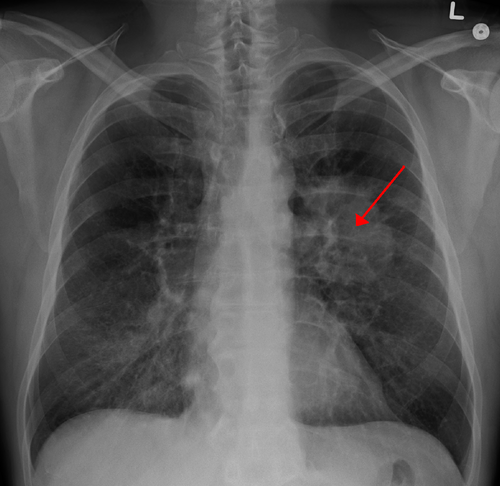
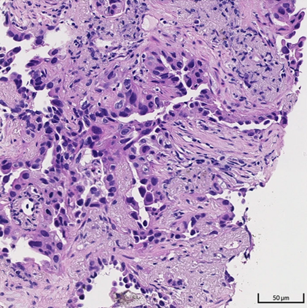

# CÂNCER DE PULMÃO

O câncer de pulmão é a principal causa de morte por neoplasia no Brasil e no mundo. Quando você estiver diante de uma questão de prova sobre esse tema, a primeira coisa que deve vir à sua mente não é apenas "nódulo", mas sim "estratificação de risco". As bancas não querem apenas que você saiba o nome do tumor; elas querem saber se você consegue decidir quem precisa de uma biópsia urgente e quem pode apenas repetir uma tomografia em um ano.

## Epidemiologia e Fatores de Risco

O tabagismo é o protagonista absoluto aqui, sendo responsável por cerca de 85% dos casos. O risco é dose-dependente: quanto mais "maços-ano", maior a chance. Mas cuidado: o risco do ex-fumante cai significativamente após a cessação, mas ele **nunca** retorna ao nível de quem nunca fumou.

Além do cigarro, preste atenção em outros fatores que aparecem em provas de residência:

- **Exposição ocupacional:** Amianto (asbesto) — que também causa mesotelioma —, sílica e radônio.

- **Poluição e biomassa:** Importante em mulheres não fumantes (fumaça de lenha).

- **Doenças prévias:** DPOC e fibrose pulmonar aumentam o risco independentemente do tabaco.

**Dica de Prova:** O tabagismo aumenta o risco de quase tudo (cardiovascular, digestivo, pulmonar), mas as bancas adoram colocar o Lúpus Eritematoso Sistêmico como pegadinha. O tabagismo **não** é fator de risco para Lúpus, embora piore a doença já instalada.

## Nódulo Pulmonar Solitário (NPS)

*Figura 1 - Radiografia de tórax demonstrando massa pulmonar (câncer de pulmão) no pulmão esquerdo. A avaliação radiológica é fundamental no diagnóstico. Fonte: James Heilman, MD, CC BY-SA 3.0 | Wikimedia Commons*

Este é o tópico que mais cai. Por definição, o NPS é uma lesão única, menor que 3 cm (30 mm), cercada por parênquima pulmonar sadio, sem atelectasia ou linfonodopatia associada. Se for maior que 3 cm, chamamos de **massa**, e massa em adulto é câncer até que se prove o contrário.

### Avaliação de Malignidade vs. Benignidade

Por que não biopsiamos todo mundo? Porque o risco de complicações de uma biópsia pulmonar não é desprezível. Precisamos separar o "joio do trigo" usando critérios radiológicos e clínicos.

**Critérios de Benignidade (O que nos deixa tranquilos):**

- **Estabilidade radiológica:** Nódulo que não cresceu em 2 anos (comparar com exames antigos é o primeiro passo!).

- **Padrões de calcificação benignos:** Central, difusa, laminada ou em "pipoca" (clássico do Hamartoma).

- **Presença de gordura:** Também sugere Hamartoma.

- **Complexo de Ghon:** Nódulo calcificado + linfonodo hilar calcificado. Isso é cicatriz de tuberculose primária antiga, não é câncer.

**Critérios de Malignidade (O que acende o alerta):**

- **Idade:** > 50 anos.

- **História de tabagismo:** Ativo ou ex-fumante.

- **Tamanho:** > 8-10 mm (nódulos < 4-6 mm em pacientes de baixo risco raramente são malignos).

- **Margens:** Espiculadas ("coroa radiada").

- **Localização:** Lobos superiores (mais comum no câncer).

- **Crescimento:** Dobrar de volume em menos de 400 dias.

| Característica | Sugere Benignidade | Sugere Malignidade |
| --- | --- | --- |
| Idade | < 35 anos | > 50 anos |
| Tabagismo | Não fumante | Fumante ativo/ex-fumante |
| Margens | Lisas, regulares | Espiculadas, lobuladas |
| Calcificação | Pipoca, central, difusa | Excêntrica, pontilhada |
| Estabilidade | > 2 anos sem mudar | Crescimento documentado |

### Manejo do NPS

Aqui o Dr. Will sempre reforça: a conduta depende da probabilidade pré-teste.

- **Baixo Risco:** Nódulo pequeno, paciente jovem, sem tabagismo. Conduta: Acompanhamento tomográfico (o intervalo depende do tamanho, seguindo critérios de Fleischner).

- **Risco Intermediário:** Aqui entra o **PET-CT**. O PET avalia a atividade metabólica (SUV). Se o SUV for baixo, a chance de câncer cai; se for alto, aumenta a suspeita.

- *Cuidado:* O PET-CT pode dar falso-positivo em doenças granulomatosas (Tuberculose, Histoplasmose). No Brasil, isso é uma pegadinha comum de prova!

- **Alto Risco:** Idoso, fumante pesado, nódulo grande e espiculado. Conduta: Biópsia ou ressecção cirúrgica direta. Não perca tempo com PET se a suspeita é altíssima.

## Tipos Histológicos

O câncer de pulmão é dividido em dois grandes grupos, e essa divisão existe porque o tratamento é completamente diferente.

### 1. Câncer de Pulmão de Não Pequenas Células (CPNPC) - 85% dos casos

- **Adenocarcinoma (40%):** É o tipo mais comum no geral. É o mais frequente em mulheres e em não fumantes. Costuma ser **periférico**. Na imuno-histoquímica, marca **CK7 positivo** e TTF-1 positivo.

- **Carcinoma Epidermoide ou Escamoso (25%):** Fortemente associado ao tabagismo. Costuma ser **central** (próximo aos brônquios principais). Pode cavitar (fazer "buraco") e está associado à **hipercalcemia** (produção de PTH-rp).

- **Carcinoma de Grandes Células (10%):** Diagnóstico de exclusão, muito agressivo, periférico.

### 2. Carcinoma de Pequenas Células (CPPC ou "Oat Cell") - 15% dos casos

É o tumor mais agressivo. Tem altíssima taxa de duplicação e quase sempre já tem metástases ao diagnóstico. É um tumor **neuroendócrino**, central, e tem relação fortíssima com o tabagismo.

- **Tratamento:** Raramente é cirúrgico. Responde bem à quimioterapia e radioterapia, mas recidiva rápido.

## Quadro Clínico e Síndromes Paraneoplásicas

O câncer de pulmão é traiçoeiro porque os sintomas iniciais (tosse, dispneia) são os mesmos do tabagista crônico com DPOC. O paciente acha que é "tosse do cigarro" e demora a procurar ajuda.

**Sinais de Alerta:**

- Mudança no padrão da tosse.

- Hemoptise (expectoração com sangue).

- Perda de peso inexplicada.

- Baqueteamento digital (hipocratismo digital).

### Síndromes de Invasão Local

- **Síndrome de Pancoast (Tumor do Sulco Superior):** O tumor cresce no ápice pulmonar e invade o plexo braquial e a cadeia simpática cervical.

- *Clínica:* Dor no ombro e face interna do braço (C8 a T2) + **Síndrome de Horner** (Ptose palpebral, Miose, Anidrose e Enoftalmia ipsilateral).

- **Síndrome da Veia Cava Superior (SVCS):** Compressão da veia cava por massa mediastinal (comum no CPPC e linfomas).

- *Clínica:* Edema de face e membros superiores, pletora facial, turgência jugular patológica e circulação colateral no tórax. É uma emergência oncológica!

### Síndromes Paraneoplásicas (Clássicos de Prova)

As bancas amam associar o tipo histológico à síndrome:

- **CPPC:**

- **SIADH:** Hiponatremia euvolêmica (excesso de ADH).

- **Síndrome de ACTH ectópico:** Cushing (hiperglicemia, hipocalemia, hipertensão).

- **Síndrome de Eaton-Lambert:** Fraqueza muscular que **melhora** com o esforço (diferente da Miastenia Gravis). É um defeito pré-sináptico.

- **Carcinoma Epidermoide:**

- **Hipercalcemia:** Por produção de proteína relacionada ao PTH (PTH-rp).

- **Adenocarcinoma:**

- **Osteoartropatia Hipertrófica Pulmonar:** Dor óssea e periostite associada ao baqueteamento digital.

## Diagnóstico e Estadiamento

Não adianta apenas saber que é câncer; precisamos saber "onde ele está".

-

**Diagnóstico Histológico:**

- Lesões centrais: Broncoscopia com biópsia ou escovado.

- Lesões periféricas: Biópsia percutânea guiada por TC (PAAF ou Core Biopsy). A PAAF tem alta sensibilidade (cerca de 90%).

- **EBUS (Ecobroncoscopia):** Padrão-ouro moderno para avaliar linfonodos mediastinais sem precisar de cirurgia.

-

**Estadiamento do CPNPC (TNM):**

- **T (Tumor):** Tamanho e invasão de estruturas vizinhas.

- **N (Linfonodo):**

- N1: Hilares ipsilaterais.

- N2: Mediastinais ipsilaterais (O divisor de águas! N2 geralmente não opera de cara).

- N3: Mediastinais ou hilares contralaterais / Supraclaviculares.

- **M (Metástase):** Os locais preferidos do câncer de pulmão são **Cérebro, Ossos, Fígado e Adrenais**.

-

**Estadiamento do CPPC:**

- **Doença Limitada:** Restrita a um hemitórax e linfonodos que cabem em um campo de radioterapia.

- **Doença Extensa:** Ultrapassa os limites acima (maioria dos pacientes).

**Erro comum de aluno MedEvo:** Achar que todo paciente com câncer de pulmão vai para cirurgia. Na verdade, apenas cerca de 20-25% são candidatos à cirurgia no momento do diagnóstico.

## Tratamento

### CPNPC (Não Pequenas Células)

- **Estágios Iniciais (I e II):** Cirurgia é a primeira escolha. O padrão-ouro é a **Lobectomia com Linfadenectomia Mediastinal**. Não basta tirar o nódulo (ressecção em cunha), tem que tirar o lobo inteiro para evitar recidiva.

- **Estágio III:** Geralmente multimodal (Quimioterapia + Radioterapia). Se houver resposta, pode-se considerar cirurgia em casos selecionados (N2 que "limpou").

- **Estágio IV:** Paliativo. Aqui entram as terapias alvo (anti-EGFR, ALK) e a imunoterapia, que revolucionaram o prognóstico.

### CPPC (Pequenas Células)

- **Doença Limitada:** Quimioterapia + Radioterapia. Frequentemente se faz Radioterapia Holocraniana Profilática, pois o tumor adora o cérebro.

- **Doença Extensa:** Quimioterapia isolada.

## Rastreamento (Prevenção Secundária)

O rastreamento reduziu a mortalidade em 20% no estudo NLST. Segundo as diretrizes atuais (SBPT e USPSTF):

- **Quem?** Pacientes entre 50 e 80 anos, tabagistas de pelo menos 20 maços-ano, ativos ou que pararam há menos de 15 anos.

- **Como?** Tomografia de Tórax de Baixa Dosagem (TCBD) anual.

- **Por que baixa dosagem?** Para minimizar a exposição à radiação em um exame que será repetido anualmente.

| Situação Clínica | Conduta de Escolha |
| --- | --- |
| Nódulo < 4mm, baixo risco | Sem acompanhamento obrigatório |
| Nódulo > 8mm, alto risco | Biópsia ou Cirurgia |
| Suspeita de N2 no mediastino | Mediastinoscopia ou EBUS |
| Derrame pleural neoplásico | Estágio IV (M1a) - Inoperável |
| Síndrome da Veia Cava Superior | Radioterapia de emergência + Corticoide |

## Pontos-Chave para Prova

- **Nódulo em Pipoca:** É Hamartoma (benigno). Não precisa de biópsia.

- **Complexo de Ghon:** Cicatriz de TB (benigno).

- **Adenocarcinoma:** Mais comum, periférico, mulheres, não fumantes, CK7+.

- **Epidermoide:** Central, cavita, hipercalcemia (PTH-rp).

- **Pequenas Células (CPPC):** Mais agressivo, central, SIADH, Eaton-Lambert, ACTH.

- **Pancoast:** Dor no ombro + Horner (ptose, miose, anidrose).

- **Estadiamento N2:** Linfonodo mediastinal ipsilateral. Geralmente contraindica cirurgia imediata (faz-se neoadjuvância).

- **Estadiamento N3 ou M1:** Inoperável.

- **Padrão-ouro cirúrgico:** Lobectomia + Linfadenectomia.

- **Rastreamento:** TC de baixa dose, 50-80 anos, >20 maços-ano.

- **Derrame Pleural Maligno:** Se o líquido pleural tiver células cancerígenas, o paciente é Estágio IV (M1a) e não tem indicação de cirurgia curativa.

- **Primeiro passo no derrame pleural:** Toracocentese diagnóstica e terapêutica.

- **Metástases mais comuns:** Cérebro, Ossos, Adrenal e Fígado.

- **Contraindicação Absoluta à Cirurgia:** VEF1 < 0,8L após o cálculo do que sobrará de pulmão (ou < 30-40% do previsto). Se o pulmão que sobra não sustenta a vida, não pode operar.

- **PET-CT:** Útil para risco intermediário, mas cuidado com falsos-positivos por Tuberculose ou fungos no Brasil. 🫁

 Cópia offline para consulta pessoal.
 Fonte original:
 [https://www.medevo.com.br/material-apoio/ler/91e2672b-b0ed-4c2b-a9ec-0124fcc49230](https://www.medevo.com.br/material-apoio/ler/91e2672b-b0ed-4c2b-a9ec-0124fcc49230)
