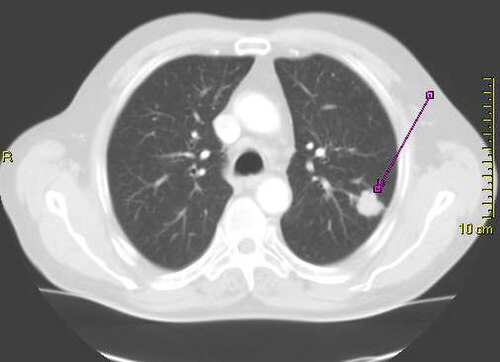
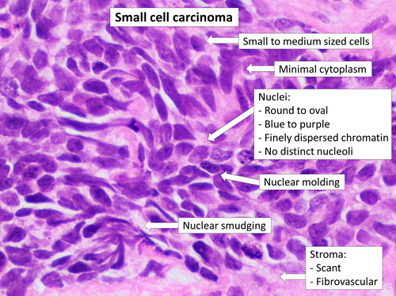

# CÂNCER DE PULMÃO

O câncer de pulmão é, sem dúvida, o tema "rei" da cirurgia torácica em provas de residência. Por que? Porque ele une clínica médica, radiologia, patologia e técnica cirúrgica em um único cenário. Para o examinador, é o prato cheio para testar se você sabe conduzir um caso do diagnóstico ao tratamento definitivo.

Aqui, não vamos apenas listar critérios. Vamos entender a lógica por trás de cada conduta. Se você entender por que um tumor de 3 cm é tratado de forma diferente de um de 7 cm, você nunca mais vai precisar decorar a tabela TNM inteira na véspera da prova.

## Epidemiologia e Fatores de Risco

*Figura 1 - Tomografia de tórax mostrando tumor pulmonar periférico T1 no lobo superior esquerdo, achado típico de adenocarcinoma. Fonte: Lange123, CC BY-SA 3.0 | Wikimedia Commons*

O tabagismo é o protagonista absoluto. Cerca de 85% a 90% dos casos estão diretamente ligados ao cigarro. Mas cuidado: a banca adora o "ponto fora da curva".

O adenocarcinoma é o tipo mais comum em não fumantes e em mulheres. Se a questão descreve uma paciente jovem, que nunca fumou, com uma lesão periférica, seu cérebro deve gritar "Adenocarcinoma".

### Exposições Ocupacionais e Ambientais

Além do cigarro, as doenças ocupacionais caem com frequência absurda.

- **Amianto (Asbesto):** Guarde isso — o amianto aumenta o risco de Câncer de Pulmão (o mais comum) e de Mesotelioma de pleura (o mais específico). Se o paciente trabalhou em estaleiro, construção civil ou com freios de carros, olhe para a pleura na TC. Se houver placas pleurais e fibrose (asbestose), o risco de neoplasia é altíssimo.

- **Sílica:** Trabalhadores de jateamento de areia ou mineração. A silicose predispõe à Tuberculose e também ao câncer.

- **Poeira de madeira e aves:** A poeira de madeira é fator de risco para tumores de nasofaringe e pulmão. Já o contato com aves (psitacídeos) deve te fazer pensar em Pneumonite por Hipersensibilidade (vidro fosco e aprisionamento aéreo na TC), que entra no diagnóstico diferencial.

## Histopatologia: O RG do Tumor

*Figura 2 - Histopatologia do carcinoma de pequenas células (oat cell), com células pequenas de citoplasma escasso e nucléolo inconspícuo, coloração H&E. Fonte: Mikael Häggström, CC0 | Wikimedia Commons*

Dividimos o câncer de pulmão em dois grandes grupos: Carcinoma de Pequenas Células (CPPC) e Carcinoma de Não Pequenas Células (CPNPC). Essa distinção é a base de tudo, pois o comportamento biológico é oposto.

### Carcinoma de Pequenas Células (Small Cell / "Grão de Aveia")

É o vilão das provas. Ele é central, extremamente agressivo e, ao diagnóstico, quase sempre já tem metástases (visíveis ou micrometástases).

- **Por que não operamos?** Porque ele responde muito bem à quimioterapia e radioterapia inicialmente, mas recidiva rápido. A cirurgia raramente oferece benefício porque a doença já é sistêmica.

- **Pérola de Prova:** Associado a síndromes paraneoplásicas endócrinas, como a SIADH (Secreção Inapropriada de ADH) e a secreção de ACTH ectópico (Síndrome de Cushing).

### Carcinoma de Não Pequenas Células (CPNPC)

Representa 80-85% dos casos. Aqui estão os três tipos que você precisa diferenciar:

- **Adenocarcinoma:** O mais comum atualmente. É periférico. Origina-se nas glândulas bronquiais. Frequentemente associado a mutações genéticas (EGFR, ALK, ROS1), o que permite a terapia-alvo.

- **Carcinoma Epidermoide (Escamoso):** É central. Tem forte relação com tabagismo.

- **Dica de mestre:** Ele tende a cavitar (formar buracos no meio da massa). Se a questão mostrar uma "massa cavitada" em um tabagista, pense em Epidermoide. Outra dica: ele causa Hipercalcemia (produz uma proteína semelhante ao PTH).

- **Carcinoma de Grandes Células:** Diagnóstico de exclusão, periférico, cresce rápido e tem prognóstico ruim.

| Tipo Histológico | Localização | Principal Característica | Paraneoplasia Comum |
| --- | --- | --- | --- |
| Adenocarcinoma | Periférico | Comum em não fumantes | Osteoartropatia hipertrófica |
| Epidermoide | Central | Massa cavitada | Hipercalcemia (PTH-rp) |
| Pequenas Células | Central | Altamente agressivo / "Oat Cell" | SIADH / ACTH ectópico |
| Grandes Células | Periférico | Diagnóstico de exclusão | Ginecomastia |

## Quadro Clínico e Síndromes Invasivas

O câncer de pulmão é silencioso. Quando dá sintomas, geralmente já está avançado. Tosse crônica, hemoptise e perda de peso são o básico. O que cai na prova são as invasões locais.

### Síndrome de Pancoast

O tumor está no ápice do pulmão (sulco superior). Ele invade o plexo braquial (raízes C8, T1 e T2).

- **O que o paciente sente?** Dor intensa no ombro que irradia para a face ulnar do braço e antebraço. Pode haver atrofia dos pequenos músculos da mão.

### Síndrome de Horner

Muitas vezes vem junto com o tumor de Pancoast. Ocorre pela invasão do gânglio estrelado (cadeia simpática cervical).

- **A tríade clássica:** Ptose palpebral (pálpebra caída), Miose (pupila contraída) e Anidrose (falta de suor) ipsilateral à lesão.

- **Cuidado:** Se o aluno vê ptose e miose, ele tem que marcar Horner. Se a questão perguntar a estrutura lesada, é o sistema nervoso simpático/gânglio estrelado.

### Síndrome da Veia Cava Superior (SVCS)

O tumor (geralmente central ou linfonodos mediastinais) comprime a veia cava superior, impedindo o retorno venoso da cabeça e membros superiores.

- **Clínica:** Edema de face ("edema em bota"), pletora facial (rosto vermelho/roxo), turgência jugular e circulação colateral no tórax superior.

- **Cenário de prova:** Tabagista com dispneia e rosto inchado pela manhã. Diagnóstico: TC de tórax com contraste para ver a compressão.

## Diagnóstico e Estadiamento: Onde a Prova se Ganha

Como diz o Dr. Will nas discussões do MedEvo, "estadiar não é apenas dar um nome, é decidir se o paciente vai para a faca ou para a agulha".

### O Nódulo Pulmonar Solitário (NPS)

Um NPS é uma lesão < 3 cm, rodeada por parênquima sadio, sem outras alterações. Se for > 3 cm, chamamos de **massa**, e a chance de malignidade é muito maior.

- **Critérios de Benignidade:** Estabilidade por 2 anos (comparar com exames antigos é o primeiro passo!), calcificações em "pipoca" (Hamartoma) ou centrais/difusas (Granulomas de TB ou fungo).

- **Manejo:** Se o risco for alto (idoso, tabagista, nódulo espiculado > 8mm), partimos para investigação ativa. O PET-CT ajuda muito: se captar (SUV alto), a suspeita aumenta. Se o nódulo for > 2 cm em paciente de alto risco, mesmo com broncoscopia negativa, você deve prosseguir para biópsia cirúrgica (VATS).

### O Sistema TNM (8ª Edição)

Não decore tudo, entenda os pontos de corte que mudam a conduta:

**T (Tumor):**

- T1: ≤ 3 cm.

- T2: > 3 cm e ≤ 5 cm.

- T3: > 5 cm e ≤ 7 cm OU invade parede torácica, nervo frênico ou pericárdio.

- T4: > 7 cm OU invade mediastino, coração, grandes vasos, traqueia, esôfago ou corpo vertebral.

**N (Linfonodos) - O mais importante para a cirurgia:**

- N0: Sem linfonodos.

- N1: Linfonodos ipsilaterais peribrônquicos ou hilares (dentro do pulmão).

- N2: Linfonodos mediastinais ipsilaterais ou subcarinais (fora do pulmão, mas do mesmo lado).

- N3: Linfonodos contralaterais ou supraclaviculares.

**M (Metástase):**

- M1a: Derrame pleural neoplásico ou nódulo no pulmão contralateral.

- M1b: Metástase única em um único órgão (ex: uma metástase adrenal).

- M1c: Múltiplas metástases.

**Regra de Ouro:**

- N2 para cima (N2 ou N3) ou M1 geralmente **não** são candidatos à cirurgia de entrada.

- Se o paciente é N2, ele costuma fazer quimio/radio primeiro (neoadjuvância). Se for N3 ou M1, o tratamento é sistêmico/paliativo.

| Estágio | Definição Simplificada | Conduta Padrão |
| --- | --- | --- |
| I (A e B) | Tumor pequeno, sem linfonodo | Cirurgia (Lobectomia) |
| II (A e B) | Tumor maior ou N1 | Cirurgia + Quimioterapia Adjuvante |
| III A | N2 ipsilateral | Multimodal (Quimio/Radio +/- Cirurgia) |
| III B/C | N3 ou invasão de grandes estruturas | Quimio e Radioterapia |
| IV | Metástase à distância | Tratamento Sistêmico / Paliativo |

## Avaliação Funcional: Ele aguenta a cirurgia?

Não adianta o tumor ser ressecável se o paciente não tiver reserva pulmonar para sobreviver sem um lobo ou um pulmão inteiro.

- **VEF1 e DLCO:** São os pilares. Se o VEF1 pós-operatório estimado (ppoVEF1) for > 80% do previsto, o risco é baixo.

- **O limite mágico:** Se o ppoVEF1 for < 30%, o risco de morte perioperatória é altíssimo e a cirurgia é geralmente contraindicada.

- **Teste de esforço:** Se o paciente está na "zona cinzenta" (VEF1 entre 30-60%), pedimos um teste de escada ou ergoespirometria (consumo de O2 - VO2 máx). Se o VO2 máx for < 10 ml/kg/min, não opera.

## Tratamento Cirúrgico

A cirurgia padrão-ouro para o CPNPC é a **Lobectomia com Linfadenectomia Mediastinal Radical**.

- **Por que lobectomia e não apenas tirar o nódulo (ressecção em cunha)?** Porque estudos clássicos mostraram que tirar apenas o nódulo aumenta muito a taxa de recidiva local. Precisamos tirar o lobo inteiro para garantir a drenagem linfática daquela região.

- **Pneumonectomia (tirar o pulmão todo):** Reservada para tumores centrais que invadem a artéria pulmonar principal ou o brônquio fonte, onde a lobectomia não é tecnicamente possível. Tem alta morbidade.

- **VATS (Video-assisted thoracoscopic surgery):** É a via de escolha hoje para estágios iniciais. Menos dor, recuperação mais rápida e mesma eficácia oncológica.

### Situações Especiais de Prova

- **Metástase Adrenal Única:** Se o paciente tem um adenocarcinoma de pulmão ressecável e apenas UMA metástase na adrenal (M1b), a conduta pode ser agressiva: resseca o tumor do pulmão E resseca a metástase da adrenal. Isso pode oferecer cura.

- **Metástase Cerebral Única:** Mesma lógica. Se a lesão cerebral for ressecável ou tratável com radiocirurgia e o pulmão for N0, faz-se o tratamento de ambos com intenção curativa.

## Diagnóstico Diferencial e Complicações

Muitas vezes a prova te dá uma imagem de massa e você precisa diferenciar de outras patologias:

- **Abscesso Pulmonar:** Paciente com febre, dentes em mau estado (foco infeccioso), tosse com expectoração fétida (anaeróbios) e imagem com nível hidroaéreo. Localização comum: segmentos posteriores dos lobos superiores.

- **Aspergiloma (Bola Fúngica):** Ocorre em cavidades prévias (sequela de TB). Na TC, vemos o "sinal do crescente gasoso". Causa hemoptise maciça. Tratamento da hemoptise maciça por aspergiloma? Embolização de artéria brônquica se o paciente não tiver condições cirúrgicas imediatas.

- **Hamartoma:** Tumor benigno. Gordura e calcificação em pipoca na TC. Conduta: Observação ou ressecção se crescer/sintomático.

### Hemoptise Maciça

Definida geralmente como > 300-600 ml de sangue em 24 horas.

- **Prioridade 1:** Proteger a via aérea! Colocar o paciente em decúbito lateral sobre o lado que está sangrando (para o sangue não inundar o pulmão bom).

- **Prioridade 2:** Broncoscopia rígida para localizar e tentar controlar.

- **Tratamento definitivo:** Embolização ou cirurgia de emergência.

## Pontos-Chave para Prova 🧠

- **Tipo histológico mais comum em não fumantes:** Adenocarcinoma (periférico).

- **Tipo histológico que mais cavita e causa hipercalcemia:** Carcinoma Epidermoide (central).

- **Carcinoma de Pequenas Células (CPPC):** Não é cirúrgico de rotina; tratamento é Quimio/Radio. Associado a SIADH.

- **Síndrome de Horner:** Ptose, Miose e Anidrose por lesão da cadeia simpática (Gânglio Estrelado).

- **Síndrome de Pancoast:** Tumor de ápice causando dor no ombro e braço (plexo braquial).

- **Linfonodo N2:** Mediastinal ipsilateral. Indica, na maioria das vezes, tratamento neoadjuvante (quimio antes da cirurgia).

- **Linfonodo N3:** Contralateral ou supraclavicular. Considerado inoperável (doença sistêmica).

- **Metástase Adrenal:** É um dos sítios mais comuns de disseminação do câncer de pulmão.

- **Nódulo Pulmonar Solitário:** Se estável por 2 anos em exames de imagem, é considerado benigno.

- **Calcificação em "pipoca":** Patognomônico de Hamartoma (benigno).

- **Avaliação Funcional:** ppoVEF1 < 30% é contraindicação absoluta para a ressecção planejada naquela extensão.

- **Padrão-ouro cirúrgico:** Lobectomia com esvaziamento linfonodal mediastinal.

- **Amianto (Asbesto):** Principal fator de risco para Mesotelioma de pleura, mas causa mais Câncer de Pulmão em números absolutos.

- **Derrame Pleural Neoplásico:** Classifica o tumor como Estágio IV (M1a).

- **Pérola MedEvo:** Se a questão trouxer um paciente com Tumor de Pancoast E Síndrome da Veia Cava Superior, ela está descrevendo uma invasão local maciça de um tumor de ápice direito.

- **O que NÃO fazer:** Não biopsiar um nódulo com características claras de benignidade (estabilidade ou calcificação típica). Não levar para cirurgia um paciente com VEF1 proibitivo sem antes otimizar com broncodilatadores e fisioterapia (e reavaliar).

- **Primeira escolha na SVCS por tumor maligno:** Radioterapia de urgência ou Stent em veia cava para alívio sintomático rápido, seguido de tratamento da causa base.

 Cópia offline para consulta pessoal.
 Fonte original:
 [https://www.medevo.com.br/material-apoio/ler/a6870b38-4c28-4727-aa1a-7e634e55d0eb](https://www.medevo.com.br/material-apoio/ler/a6870b38-4c28-4727-aa1a-7e634e55d0eb)
