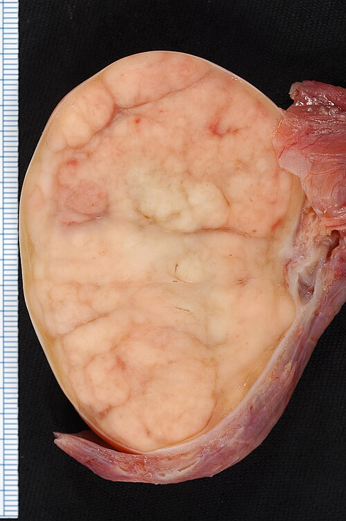
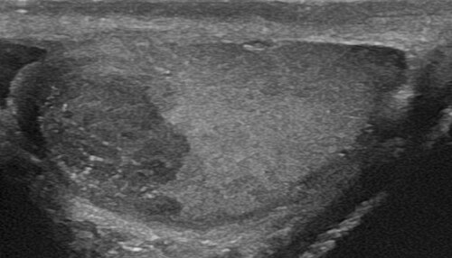

# CÂNCER DE TESTÍCULO E TUMORES DE CÉLULAS GERMINATIVAS

Para entender o câncer de testículo, você precisa primeiro esquecer a lógica da maioria dos tumores sólidos que estudamos na faculdade. Aqui, não estamos falando de pacientes idosos e frágeis; estamos falando do tumor sólido mais comum em homens jovens, entre os 15 e 35 anos. É o paciente que está no auge da sua produtividade e vida reprodutiva.

A boa notícia, que você deve levar para a prova e para a vida, é que este é um dos tumores mais curáveis da oncologia, mesmo quando metastático. Mas, para isso, o diagnóstico não pode atrasar.

*Figura 1 - Peça cirúrgica de seminoma testicular: massa sólida homogênea substituindo o parênquima. Fonte: Ed Uthman, MD, CC BY 2.0 | Wikimedia Commons*

## Epidemiologia e Fatores de Risco

O perfil clássico de prova é o homem jovem com uma massa testicular indolor. Se a questão trouxer um paciente de 25 anos com um "caroço" no testículo, sua mente deve gritar "câncer" até que se prove o contrário.

O principal fator de risco, disparado nas cobranças de residência, é a **criptorquidia**. Preste atenção: mesmo que o testículo tenha sido submetido à orquidopexia (a cirurgia para descê-lo) na infância, o risco de malignização permanece maior do que na população geral. Curiosamente, o testículo contralateral (que desceu normalmente) também apresenta um risco discretamente aumentado.

Outros fatores importantes incluem:

- História familiar (parentes de primeiro grau).

- Presença de tumor no testículo contralateral (risco de 1-2%).

- Disgenesia gonadal.

- Infertilidade.

## Anatomia Vascular e Drenagem Linfática: O "Pulo do Gato"

Muitos alunos erram questões de estadiamento porque não entendem a embriologia do testículo. O testículo não "nasce" na bolsa escrotal; ele se desenvolve na crista gonadal, retroperitonealmente, perto dos rins, e depois desce.

Por que isso importa? Porque ele leva consigo sua vascularização e sua drenagem linfática original.

- **Artéria Testicular:** Origina-se diretamente da **Aorta Abdominal**, logo abaixo das artérias renais.

- **Drenagem Venosa:** A veia testicular direita drena para a Veia Cava Inferior, enquanto a veia testicular esquerda drena para a Veia Renal Esquerda (em ângulo de 90 graus, o que explica por que a varicocele é mais comum à esquerda).

- **Drenagem Linfática:** Este é o ponto mais cobrado. A primeira estação linfonodal do testículo são os **linfonodos retroperitoneais** (lombares/intercavoaórticos).

**Dica de Prova do Dr. Will:** Se a questão mostrar um paciente com câncer de testículo e linfonodo inguinal aumentado, isso NÃO é o padrão normal de disseminação. Isso só acontece se o paciente tiver feito uma cirurgia prévia no escroto ou se o tumor invadir a pele escrotal, alterando a drenagem linfática. Guarde isso: metástase de câncer de testículo vai para o retroperitônio!

## Quadro Clínico e Exame Físico

O sinal clássico é a **massa testicular indolor, endurecida e pesada**. O paciente costuma notar o aumento de volume durante o banho ou após um trauma leve (o trauma não causa o câncer, ele apenas chama a atenção do paciente para o órgão).

No exame físico, você encontrará o chamado **"testículo pétreo"**. Ele é sólido e não permite a transiluminação.

**Cuidado com a pegadinha:** Cerca de 10% dos pacientes podem apresentar dor aguda devido a hemorragia intratumoral ou infarto do tumor, simulando uma orquiepididimite. Se você tratar uma "infecção" e a massa não sumir em 2 semanas, peça um ultrassom imediatamente. Outra apresentação possível é a ginecomastia, causada pelo aumento do beta-hCG (que mimetiza o LH e estimula a produção de estrogênio).

### Diagnóstico Diferencial de Massa Escrotal

| Patologia | Características Clínicas | Transiluminação |
| --- | --- | --- |
| **Câncer de Testículo** | Massa endurecida, indolor, fixa ao testículo | Negativa |
| **Hidrocele** | Aumento de volume cístico, indolor, "elástico" | **Positiva** |
| **Espermatocele** | Nódulo indolor no epidídimo (acima do testículo) | Positiva |
| **Orquiepididimite** | Dor aguda, sinais flogísticos, febre | Negativa |
| **Varicocele** | "Saco de vermes", piora em pé, geralmente à esquerda | Negativa |

*Figura 2 - Ultrassonografia testicular evidenciando seminoma como massa hipoecoica intratesticular. Fonte: Mme Mim, CC BY-SA 4.0 | Wikimedia Commons*

## Investigação Diagnóstica: O Tripé Obrigatório

Suspeitou de câncer de testículo? Você precisa de três coisas antes de qualquer intervenção invasiva:

- **Ultrassonografia de Bolsa Escrotal com Doppler:** É o exame de imagem inicial. Ele diferencia se a massa é intratesticular (provável câncer) ou extratesticular (provável benigno). O tumor costuma ser hipoecoico e heterogêneo.

- **Marcadores Tumorais Séricos:** Devem ser coletados ANTES da cirurgia.

- **Orquiectomia Radical Inguinal:** É diagnóstica e terapêutica ao mesmo tempo.

### Marcadores Tumorais: A "Assinatura" do Tumor

Aqui é onde as bancas fazem a festa. Você precisa decorar quem produz o quê.

- **Alfa-fetoproteína (AFP):** NUNCA, em hipótese alguma, estará elevada em um Seminoma Puro. Se a AFP estiver alta, o tumor tem componente de Não-Seminoma (geralmente Saco Vitelino).

- **Beta-hCG:** Elevado em quase todos os Coriocarcinomas e em cerca de 15-20% dos Seminomas.

- **Lactato Desidrogenase (LDH):** Marcador inespecífico de carga tumoral e renovação celular. Útil para prognóstico.

**Tabela de Marcadores por Tipo Histológico**

| Tipo Histológico | AFP | beta-hCG |
| --- | --- | --- |
| **Seminoma** | Sempre Normal | Pode estar elevado (20%) |
| **Carcinoma Embrionário** | Pode estar elevado | Pode estar elevado |
| **Tumor de Saco Vitelino** | **Sempre Elevado** | Normal |
| **Coriocarcinoma** | Normal | **Muito Elevado** |
| **Teratoma** | Geralmente Normal | Geralmente Normal |

## Classificação Histopatológica

Os tumores de células germinativas (95% dos casos de câncer de testículo) dividem-se em dois grandes grupos. Entender essa divisão é fundamental para o tratamento.

### 1. Seminomas (50%)

É o tipo mais comum. Tem um crescimento mais lento e é extremamente radiossensível e quimiossensível.

- **Seminoma Clássico:** Ocorre na faixa dos 30-40 anos.

- **Seminoma Espermatocítico:** Ocorre em idosos (> 65 anos). É uma entidade clínica diferente, com excelente prognóstico e raramente metastatiza. Não confunda com o clássico!

### 2. Não-Seminomas (50%)

Geralmente ocorrem em homens um pouco mais jovens (20-30 anos) e são mais agressivos.

- **Carcinoma Embrionário:** Muito agressivo, frequentemente invade o cordão espermático.

- **Teratoma:** Curiosamente, em adultos, o teratoma é considerado maligno (diferente do teratoma de ovário). Ele é resistente à quimioterapia e radioterapia.

- **Coriocarcinoma:** A variante mais agressiva de todas. Dissemina-se precocemente por via hematogênica (pulmão, cérebro). O beta-hCG costuma estar nas alturas.

- **Tumor de Saco Vitelino:** O tipo mais comum em crianças.

## O Procedimento Padrão: Orquiectomia Radical Inguinal

Aqui está o erro que reprova em prova e gera processo na vida real: **NUNCA faça biópsia transescrotal ou orquiectomia por via escrotal** em uma suspeita de câncer de testículo.

**Por que fazemos a via inguinal?**
Porque, como vimos na anatomia, a drenagem linfática do testículo é para o retroperitônio. Se você corta o escroto, você "contamina" a drenagem linfática da pele escrotal (que vai para os linfonodos inguinais). Isso muda o estadiamento do paciente e obriga a tratamentos mais agressivos.

A cirurgia consiste na ligadura alta do cordão espermático no nível do anel inguinal interno e remoção do testículo com suas túnicas. Como dizemos no MedEvo, "o cordão sai junto com o dono".

## Estadiamento e Conduta Pós-Operatória

Após a orquiectomia, fazemos o estadiamento sistêmico com **TC de Tórax, Abdome e Pelve**. Não se usa PET-CT de rotina aqui.

O estadiamento do câncer de testículo é o **TNM-S**. O "S" refere-se ao nível dos marcadores séricos (Serum) após a orquiectomia. Se os marcadores não caírem conforme a meia-vida esperada (AFP: 5-7 dias; hCG: 24-36 horas), significa que há doença residual.

### Estágios Clínicos (Simplificado para Prova)

- **Estádio I:** Doença restrita ao testículo.

- **Estádio II:** Metástase para linfonodos retroperitoneais.

- **Estádio III:** Metástase à distância (pulmão é o sítio extra-linfático mais comum) ou marcadores muito elevados.

### Estratégias de Tratamento

**Para Seminoma Estádio I:**
A opção preferencial hoje é a **Vigilância Ativa** (seguimento rigoroso com exames). Como o risco de recidiva é baixo e o tumor é muito sensível ao resgate, evitamos toxicidade desnecessária. Outras opções incluem Carboplatina (dose única) ou Radioterapia.

**Para Não-Seminoma Estádio I:**
Também se prefere Vigilância Ativa, mas se houver fatores de risco (invasão linfovascular), pode-se considerar um ciclo de quimioterapia (BEP: Bleomicina, Etoposídeo e Cisplatina) ou Linfadenectomia Retroperitoneal.

**Para Doença Metastática (Estádios II e III):**
O tratamento de escolha é a **Quimioterapia baseada em Cisplatina (esquema BEP)**.

- Seminomas são muito sensíveis.

- Não-seminomas podem deixar massas residuais após a quimioterapia. Se a massa residual for > 1cm e os marcadores estiverem normais, o próximo passo é a **Linfadenectomia Retroperitoneal de Resgate**, pois pode haver teratoma (que não responde à QT) ou fibrose.

## Situações Especiais e Complicações

### Tumor de Células Germinativas Extragonadal

Às vezes, o tumor nasce diretamente na linha média (mediastino ou retroperitônio) sem tumor no testículo. O raciocínio diagnóstico e os marcadores são os mesmos. Se você vir um homem jovem com uma massa no mediastino e AFP alta, é um tumor germinativo até que se prove o contrário.

### Síndrome de Lise Tumoral

Como esses tumores respondem muito rápido à quimioterapia, em casos de grande volume de doença, o paciente pode evoluir com lise tumoral (hipercalemia, hiperuricemia, hiperfosfatemia e hipocalcemia).

### Infertilidade e Criopreservação

Sempre, eu disse **SEMPRE**, ofereça a criopreservação de sêmen antes de iniciar o tratamento (seja a orquiectomia ou a quimioterapia). O tratamento pode levar à infertilidade definitiva.

## Câncer de Pênis: Um Breve Adendo Necessário

Embora o foco seja testículo, as bancas costumam misturar esses temas em Urologia.

- **Tipo Histológico:** >95% são Carcinoma Espinocelular (CEC).

- **Fatores de Risco:** Fimose (principal), má higiene, infecção por HPV (subtipos 16 e 18), tabagismo.

- **Localização:** Mais comum na glande.

- **Disseminação:** Diferente do testículo, o câncer de pênis drena para os **linfonodos inguinais**.

## Pontos-Chave para Prova

- **Perfil:** Homem jovem (15-35 anos) com massa testicular indolor e endurecida.

- **Principal Fator de Risco:** Criptorquidia (mesmo após orquidopexia).

- **Marcador AFP:** NUNCA sobe no Seminoma Puro. Se estiver alto, é Não-Seminoma.

- **Marcador beta-hCG:** Muito elevado no Coriocarcinoma; pode subir discretamente no Seminoma.

- **Exame Inicial:** Ultrassonografia de bolsa escrotal com Doppler.

- **Conduta Invariável:** Orquiectomia Radical por VIA INGUINAL.

- **Contraindicação Absoluta:** Biópsia transescrotal ou orquiectomia via escroto (risco de mudar drenagem linfática).

- **Drenagem Linfática Primária:** Linfonodos retroperitoneais (lombares e intercavoaórticos).

- **Metástase Hematogênica:** O pulmão é o órgão mais afetado.

- **Seminoma Espermatocítico:** Ocorre em idosos e tem excelente prognóstico.

- **Tratamento de Escolha na Metástase:** Quimioterapia com esquema BEP (Bleomicina, Etoposídeo, Cisplatina).

- **Massa Residual Pós-QT no Não-Seminoma:** Se > 1cm, realizar Linfadenectomia Retroperitoneal (suspeita de Teratoma).

- **Câncer de Pênis:** Associado a fimose e HPV; drena para linfonodos inguinais.

- **O que NÃO fazer:** Não espere o resultado de marcadores para indicar a orquiectomia se a USG for suspeita, mas colha-os antes de operar.

- **Dica de Ouro:** Se a questão falar em "massa de linha média" (mediastino) em jovem, pense em Tumor Germinativo Extragonadal e peça marcadores. 🩺

 Cópia offline para consulta pessoal.
 Fonte original:
 [https://www.medevo.com.br/material-apoio/ler/e3be0798-2b0d-4c35-afd3-3395637ddfcb](https://www.medevo.com.br/material-apoio/ler/e3be0798-2b0d-4c35-afd3-3395637ddfcb)
