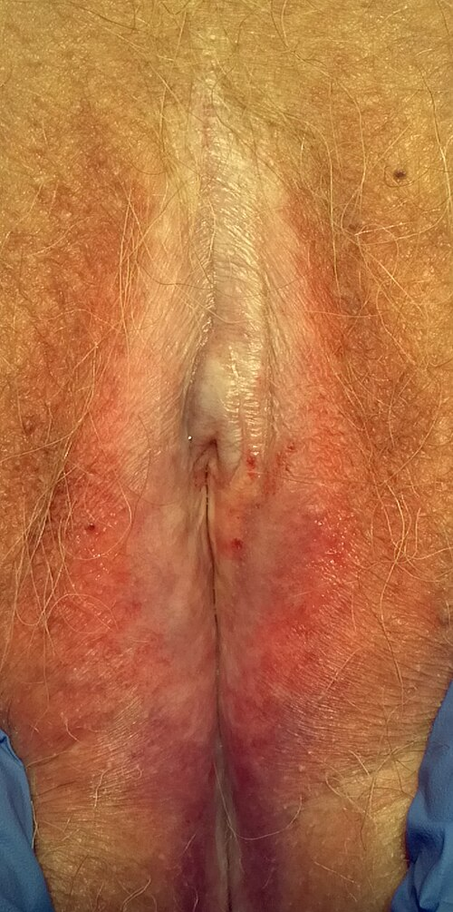
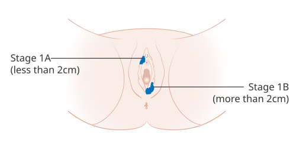

# CÂNCER DE VULVA E VAGINA

Para entender o câncer de vulva, você precisa primeiro esquecer a ideia de que ele é uma doença única. Na prática clínica, e principalmente nas provas de residência, nós dividimos as pacientes em dois grandes grupos com comportamentos biológicos completamente distintos. Se você entender essa divisão, já resolve metade das questões sobre o tema.

O primeiro grupo é composto por mulheres mais jovens, geralmente tabagistas, onde o câncer está diretamente relacionado à infecção pelo HPV de alto risco (especialmente o tipo 16). O segundo grupo, que é o mais comum nas provas, é o das mulheres idosas, pós-menopausadas, onde o câncer surge sobre uma base de inflamação crônica, principalmente o Líquen Escleroso.

*Figura 1 - Líquen escleroso vulvar: aspecto esbranquiçado (cor de marfim) característico, principal fator de risco para CEC diferenciado. Fonte: Mikael Häggström, CC0 | Wikimedia Commons*

## Câncer de Vulva: Epidemiologia e Fatores de Risco

O câncer de vulva representa cerca de 5% das neoplasias malignas do trato genital feminino. O tipo histológico soberano, presente em mais de 90% dos casos, é o Carcinoma Epidermoide, também chamado de Carcinoma de Células Escamosas (CEC).

Por que é importante saber os fatores de risco? Porque a banca vai te dar um caso clínico de uma paciente com prurido vulvar crônico. Se ela for jovem e fumar, pense em HPV. Se ela tiver 70 anos e uma vulva esbranquiçada, pense em Líquen Escleroso.

Os principais fatores de risco incluem:

- Infecção pelo HPV (tipos 16, 18, 31, 33).

- Tabagismo (que potencializa a ação do HPV na vulva, assim como no colo do útero).

- Imunossupressão (pacientes com HIV ou transplantadas).

- Líquen Escleroso Vulvar (fator de risco clássico para o CEC diferenciado).

- Neoplasia Intraepitelial Vulvar (NIV) prévia.

Cuidado com uma pegadinha comum: o Líquen Escleroso em si não é uma lesão maligna, mas ele cria um ambiente de renovação celular acelerada e inflamação que predispõe ao surgimento do câncer. Por isso, toda paciente com Líquen deve ser acompanhada de perto. Se aparecer uma área ulcerada ou vegetante no meio do líquen, a biópsia é obrigatória.

## Lesões Precursoras: Neoplasia Intraepitelial Vulvar (NIV)

Aqui é onde muitos alunos se confundem. Antigamente, usávamos a classificação NIV 1, 2 e 3, mas isso mudou. Hoje, seguindo a classificação da ISSVD (International Society for the Study of Vulvovaginal Disease), dividimos em:

### NIV de Tipo Usual (ou HSIL da vulva)

Está relacionada ao HPV de alto risco. Geralmente é multifocal (várias lesões espalhadas), pode ser pigmentada, verrucosa ou plana. É mais comum em mulheres jovens e tem forte associação com o tabagismo. O tratamento aqui pode ser mais conservador em alguns casos, como o uso de Imiquimode (um imunomodulador) ou vaporização a laser, mas a exérese cirúrgica ainda é muito cobrada.

### NIV de Tipo Diferenciado

Esta é a "queridinha" das bancas para casos de idosas. Não tem relação com o HPV. Ela surge em pacientes com Líquen Escleroso ou Líquen Simples Crônico. Diferente da usual, a NIV diferenciada é geralmente unifocal e tem um risco muito maior de progressão rápida para o carcinoma invasor. Por isso, o tratamento da NIV diferenciada é sempre cirúrgico, com a exérese da lesão com margens.

### Tabela 1: Comparativo das Lesões Precursoras (NIV)

| Característica | NIV Usual (HSIL) | NIV Diferenciada |
| --- | --- | --- |
| Associação Viral | HPV (principalmente 16) | Negativa para HPV |
| Perfil da Paciente | Jovem, tabagista | Idosa, pós-menopausa |
| Lesão Associada | Outras NICs (colo, vagina) | Líquen Escleroso |
| Padrão de Lesão | Multifocal, pigmentada | Unifocal, ulcerada/placa |
| Risco de Invasão | Menor e mais lento | Alto e rápido |
| Conduta | Exérese, Laser ou Imiquimode | Exérese Cirúrgica (Sempre) |

## Quadro Clínico e Diagnóstico

O sintoma mais comum, presente em quase 70% dos casos, é o prurido vulvar crônico. O grande problema é que, na vida real e nas questões, essa paciente costuma tratar esse prurido como "candidiase de repetição" por meses ou anos antes de alguém olhar a vulva dela com atenção.

Ao exame físico, você pode encontrar:

- Lesões esbranquiçadas (leucoplasias).

- Lesões ulceradas que não cicatrizam.

- Massas vegetantes ou verrucosas.

- Áreas de sangramento ao toque.

O diagnóstico é histopatológico. Nunca, em hipótese alguma, comece um tratamento para uma lesão suspeita na vulva sem antes realizar uma biópsia. Para guiar a biópsia, podemos usar o Teste de Collins, que utiliza o Azul de Toluidina. O corante se fixa ao DNA das células com alta atividade mitótica. Áreas que permanecem coradas após a lavagem com ácido acético a 1% são suspeitas.

Lembre-se: se a questão descreve uma lesão ulcerada em uma idosa com história de prurido, a resposta da conduta inicial é biópsia (geralmente feita com punch de Keyes).

## Carcinoma Epidermoide de Vulva (CEC)

Uma vez confirmado o câncer invasor pela biópsia, precisamos entender a extensão da doença. O CEC de vulva tem uma disseminação predominantemente linfática. Ele segue um caminho muito previsível: primeiro para os linfonodos inguinais superficiais, depois para os profundos (abaixo da fáscia cribriforme) e, por fim, para os linfonodos pélvicos (ilíacos).

Um conceito fundamental que o Dr. Will sempre reforça em suas discussões de caso é a importância da linha média. Se a lesão estiver a mais de 2 cm da linha média (clitóris, uretra, vagina, ânus), a drenagem linfática é inicialmente unilateral. Se a lesão toca ou cruza a linha média, a drenagem pode ser bilateral, o que muda completamente o planejamento cirúrgico.

### O Caso Especial do Clitóris

Atenção aqui, pois isso é uma pérola clínica frequente em provas de alto nível. O clitóris possui uma drenagem linfática rica que pode saltar os linfonodos inguinais e ir direto para os linfonodos pélvicos. Portanto, tumores clitidianos têm um prognóstico mais reservado e maior risco de metástases ocultas.

*Figura 2 - Estadiamento 1A e 1B do câncer de vulva, ilustrando a extensão tumoral e profundidade de invasão. Fonte: Cancer Research UK, CC BY-SA 4.0 | Wikimedia Commons*

## Estadiamento FIGO (Atualizado)

O estadiamento do câncer de vulva é cirúrgico. Isso significa que só sabemos o estágio real após operar a paciente e analisar os linfonodos. No entanto, para fins de prova, você precisa decorar os pontos de corte do T (tumor) e do N (linfonodo).

- **Estágio I:** Tumor confinado à vulva.

- **IA:** Lesão ≤ 2 cm E invasão estromal ≤ 1 mm. (Aqui está a "microinvasão").

- **IB:** Lesão > 2 cm OU invasão estromal > 1 mm.

- **Estágio II:** Tumor de qualquer tamanho com extensão para estruturas adjacentes (terço inferior da uretra, terço inferior da vagina, ânus), mas com linfonodos negativos.

- **Estágio III:** Tumor com linfonodos inguino-femorais positivos.

- **Estágio IV:** Doença avançada (invasão de mucosa de bexiga, reto, osso ou metástases à distância).

### Tabela 2: Resumo do Estadiamento e Conduta Cirúrgica

| Estágio FIGO | Descrição Simplificada | Conduta Padrão |
| --- | --- | --- |
| **IA** | ≤ 2cm e Invasão ≤ 1mm | Excisão local ampla (margem 1cm) |
| **IB** | > 2cm ou Invasão > 1mm | Vulvectomia radical + Linfadenectomia |
| **II** | Invasão de uretra/vagina/ânus | Vulvectomia radical + Linfadenectomia |
| **III** | Linfonodos positivos | Cirurgia + Radioterapia adjuvante |
| **IV** | Invasão de órgãos vizinhos/distância | Individualizado (frequentemente Quimio/Radio) |

## Tratamento: A Arte da Individualização

Antigamente, fazíamos a vulvectomia radical "em monobloco" (retirava-se a vulva e os linfonodos em uma única peça, deixando uma ferida enorme). Hoje, a tendência é a individualização e a técnica de "três incisões": uma para a vulva e duas separadas para as virilhas. Isso diminui drasticamente a morbidade e as complicações de cicatrização.

### Quando fazer Linfadenectomia?

Esta é a pergunta de um milhão de dólares nas provas.

- Se a invasão estromal for ≤ 1 mm (Estágio IA), o risco de metástase linfonodal é desprezível (menos de 1%). Portanto, **não fazemos linfadenectomia no estágio IA**. Apenas a excisão local ampla com margem de 1 cm.

- Se a invasão for > 1 mm, a linfadenectomia inguinal bilateral é obrigatória (pode ser unilateral se a lesão for bem lateralizada e > 2 cm da linha média).

### Linfonodo Sentinela

Assim como no câncer de mama, podemos usar a técnica do linfonodo sentinela no câncer de vulva para evitar o esvaziamento inguinal completo, que causa muito linfedema. Os critérios para sentinela são:

- Tumor único.

- Diâmetro < 4 cm.

- Sem evidência clínica de linfonodos acometidos (N0 clínico).

- Invasão estromal > 1 mm.

Se o sentinela for negativo, paramos por ali. Se for positivo, a paciente precisa de esvaziamento completo ou radioterapia.

## Outros Tipos Histológicos de Vulva

Embora o CEC seja o mais comum, as bancas adoram cobrar as exceções:

- **Melanoma de Vulva:** É o segundo mais comum. Diferente do CEC, não tem relação com o HPV ou Líquen. O diagnóstico é por biópsia excisional (sempre que possível). O prognóstico depende da profundidade da lesão (Critérios de Breslow).

- **Doença de Paget Vulvar:** É um adenocarcinoma in situ. Clinicamente, parece um "eczema" que não melhora: uma placa eritematosa, com áreas esbranquiçadas (aspecto de "bolo de morango com chantilly"). Cuidado: em 20 a 30% dos casos, existe um adenocarcinoma oculto (de mama, reto ou bexiga). Por isso, o diagnóstico de Paget exige um rastreamento sistêmico desses outros órgãos.

- **Carcinoma Verrucoso:** É uma variante bem diferenciada do CEC. Tem crescimento lento e raramente dá metástase linfonodal. No entanto, ele é localmente muito agressivo. **Dica de ouro:** Evite radioterapia no carcinoma verrucoso, pois ela pode induzir uma transformação anaplásica e tornar o tumor extremamente agressivo.

- **Sarcoma de Vulva:** Raro, acomete mulheres mais jovens. O tipo mais comum é o leiomiossarcoma.

## Câncer de Vagina

O câncer primário de vagina é uma raridade (menos de 2% dos cânceres ginecológicos). Na verdade, a maioria dos tumores encontrados na vagina são metástases de outros sítios (colo do útero, endométrio ou vulva). Para ser considerado primário de vagina, o colo do útero e a vulva devem estar livres de doença.

### Fatores de Risco e NIVA

Assim como na vulva e no colo, o HPV é o principal vilão. A Neoplasia Intraepitelial Vaginal (NIVA) é a lesão precursora.

- **NIVA 1:** Geralmente acompanhamos, pois a taxa de regressão é alta.

- **NIVA 2 e 3:** Tratamos com laser, exérese cirúrgica ou uso de 5-Fluoracil tópico.

Um fator de risco histórico que ainda cai em prova é a exposição intrauterina ao Dietilestilbestrol (DES). Filhas de mulheres que usaram DES na gravidez têm risco aumentado de **Adenocarcinoma de Células Claras** da vagina. Além disso, essas pacientes podem apresentar Adenose Vaginal (presença de epitélio glandular onde deveria ser escamoso).

### Quadro Clínico e Diagnóstico

O sintoma clássico é a sinusorragia (sangramento após o coito) ou sangramento intermenstrual. Ao exame especular, vemos uma lesão vegetante ou ulcerada. O diagnóstico é por biópsia.

### Estadiamento e Tratamento da Vagina

Diferente da vulva, o estadiamento da vagina é **clínico** (baseado no exame físico, cistoscopia, proctoscopia e exames de imagem).

O tratamento é o grande diferencial aqui. Como a vagina está "espremida" entre a bexiga e o reto, a cirurgia radical (exenteração pélvica) é muito mutilante. Por isso, a **Radioterapia (Teleterapia + Braquiterapia)** é a modalidade de escolha para a maioria dos casos de câncer de vagina invasor.

A cirurgia fica reservada para casos muito iniciais (Estágio I) no terço superior da vagina, onde se pode fazer uma histerectomia radical com colpectomia parcial.

### Sarcoma Botrioide (Rabdomiossarcoma Embrionário)

Esta é a questão clássica da pediatria/ginecologia. Imagine uma lactente ou criança pequena com sangramento vaginal e a saída de uma massa que parece um "cacho de uva". Isso é o Sarcoma Botrioide. É um tumor altamente maligno que requer quimioterapia e cirurgia preservadora. No MedEvo, sempre lembramos que essa imagem do "cacho de uva" é patognomônica para fins de prova.

## Diagnóstico Diferencial das Lesões Vulvares

Nem tudo que arde ou coça na vulva é câncer, mas o médico deve ter um alto índice de suspeição.

### Tabela 3: Diagnóstico Diferencial de Úlceras e Lesões Vulvares

| Doença | Características Clínicas | Diagnóstico/Agente |
| --- | --- | --- |
| **Sífilis (Cancro Duro)** | Úlcera única, indolor, bordos elevados, fundo limpo | *Treponema pallidum* (VDRL/FTA-ABS) |
| **Herpes Genital** | Vesículas agrupadas, muito dolorosas, que ulceram | Clínico / HSV-2 |
| **Cancro Mole** | Úlceras múltiplas, dolorosas, fundo sujo (purulento) | *Haemophilus ducreyi* |
| **Donovanose** | Úlcera "em carne viva", crônica, indolor, sangrante | Corpos de Donovan (biópsia) |
| **Linfogranuloma** | Pápula fugaz seguida de linfonodomegalia fistulizante | *Chlamydia trachomatis* (L1-L3) |
| **Condiloma Acuminado** | Lesões verrucosas, "couve-flor", múltiplas | HPV 6 e 11 |
| **Líquen Escleroso** | Placa branca, atrófica, prurido intenso, "figura em 8" | Biópsia (padrão-ouro) |

## Complicações do Tratamento

O tratamento do câncer de vulva, especialmente a linfadenectomia, deixa marcas. A complicação mais comum a longo prazo é o **linfedema de membros inferiores**, que ocorre em até 30 a 70% das pacientes submetidas ao esvaziamento inguinal completo. Outras complicações incluem:

- Deiscência de sutura (a pele da vulva e virilha tem uma vascularização precária).

- Linfocele (acúmulo de linfa na região inguinal).

- Estenose do introito vaginal.

- Disfunção sexual e alteração da imagem corporal.

Por que fazemos a técnica de três incisões? Justamente para tentar reduzir a taxa de deiscência de sutura, que era quase regra na técnica antiga em monobloco.

## Pontos-Chave para Prova

- **CEC de Vulva:** Tipo histológico mais comum (>90%).

- **Líquen Escleroso:** Principal fator de risco em idosas; causa o CEC diferenciado (não relacionado ao HPV).

- **HPV:** Principal fator de risco em jovens (tipos 16 e 18); causa a NIV usual (HSIL).

- **Prurido Crônico:** Sintoma mais comum. Se houver lesão suspeita, a conduta é **Biópsia**.

- **Estágio IA:** Lesão ≤ 2 cm e invasão ≤ 1 mm. Tratamento: Excisão local ampla. **NÃO** faz linfadenectomia.

- **Invasão > 1 mm:** Linfadenectomia inguinal é obrigatória.

- **Linfonodo Sentinela:** Indicado se tumor único, < 4 cm e N0 clínico.

- **Fator Prognóstico:** O acometimento linfonodal é o fator isolado mais importante para a sobrevida.

- **Tumores de Clitóris:** Maior risco de metástase direta para linfonodos pélvicos.

- **Doença de Paget:** Placa eritematosa ("bolo de morango"). Risco de adenocarcinoma oculto (mama/TGI).

- **Carcinoma Verrucoso:** Não fazer radioterapia (risco de anaplasia).

- **Câncer de Vagina:** A maioria é metástase. O primário é raro e o tratamento de escolha costuma ser Radioterapia.

- **Sarcoma Botrioide:** Criança, massa em "cacho de uva", sangramento vaginal.

- **Dietilestilbestrol (DES):** Associado ao Adenocarcinoma de Células Claras de vagina em filhas expostas.

- **Condiloma na Gestação:** Usar Ácido Tricloroacético (ATA). Podofilina e Imiquimode são **contraindicados**.

- **Margens Cirúrgicas:** O objetivo é uma margem livre de pelo menos 8 mm no laudo histopatológico (o que exige cerca de 1 a 2 cm de margem macroscópica na cirurgia). 🩺

 Cópia offline para consulta pessoal.
 Fonte original:
 [https://www.medevo.com.br/material-apoio/ler/9d386dfb-c52c-451d-9e24-5c7cf589197c](https://www.medevo.com.br/material-apoio/ler/9d386dfb-c52c-451d-9e24-5c7cf589197c)
