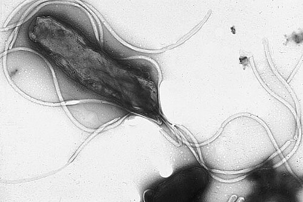
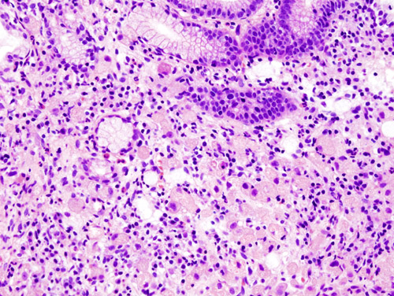

# CÂNCER GÁSTRICO

Quando falamos de câncer gástrico para a residência médica, não estamos falando apenas de uma doença, mas de um divisor de águas na cirurgia oncológica. O adenocarcinoma gástrico representa cerca de 95% das neoplasias malignas do estômago. O restante se divide entre linfomas, GIST (Tumor Estromal Gastrointestinal) e tumores neuroendócrinos.

Para a sua prova, o foco será quase sempre no adenocarcinoma, mas o examinador adora cobrar as diferenças fundamentais entre ele e o GIST ou o Linfoma. Vamos entender o porquê de cada conduta.

## Epidemiologia e Fatores de Risco

O câncer gástrico é uma doença de países em desenvolvimento e de populações que envelhecem. No Brasil, é um dos tumores mais incidentes, especialmente em homens.

*Figura 1 - Helicobacter pylori: micrografia eletrônica mostrando o bacilo gram-negativo com múltiplos flagelos (coloração negativa). Fonte: Yutaka Tsutsumi, Copyrighted free use | Wikimedia Commons*

### O Papel do H. pylori

Por que batemos tanto na tecla do *H. pylori*? Porque ele causa uma inflamação crônica (gastrite atrófica) que leva à metaplasia intestinal, displasia e, finalmente, ao adenocarcinoma (especialmente o tipo intestinal de Lauren). É a famosa cascata de Correa.

### Outros Fatores

- **Dieta:** O excesso de sal e nitratos (embutidos, defumados) agride a mucosa. Por outro lado, frutas e vegetais frescos são protetores.

- **Tabagismo:** Dobra o risco de câncer gástrico.

- **Fatores Genéticos:** Cuidado aqui. O câncer gástrico difuso hereditário está ligado à mutação no gene **CDH1** (caderina-E). Se o paciente tem essa mutação, a indicação é de gastrectomia profilática.

- **Tipo Sanguíneo:** O tipo sanguíneo **A** está classicamente associado ao tipo difuso de Lauren. Guarde isso, pois é uma "decoreba" que ainda aparece em provas.

*Figura 2 - Histopatologia de adenocarcinoma gástrico tipo difuso de Lauren, mostrando células em anel de sinete (signet ring cells). Coloração H&E. Fonte: KGH, CC BY-SA 3.0 | Wikimedia Commons*

## Classificação de Lauren: O Coração da Prova

Se você entender a Classificação de Lauren, você resolve 50% das questões de câncer gástrico. Ela divide o adenocarcinoma em dois tipos principais:

| Característica | Tipo Intestinal | Tipo Difuso |
| --- | --- | --- |
| **Epidemiologia** | Homens, idosos | Mulheres, jovens |
| **Fatores Ambientais** | Fortemente associado (H. pylori, dieta) | Pouca associação |
| **Histologia** | Formação de glândulas, bem diferenciado | Células em anel de sinete, perda de coesão |
| **Disseminação** | Hematogênica | Transmural e Linfática |
| **Prognóstico** | Melhor | Pior |
| **Localização** | Mais comum no antro | Mais comum no corpo/fundo (proximal) |

**Dica do Dr. Will:** O examinador vai te dar um caso de uma paciente de 35 anos com uma lesão infiltrativa no corpo gástrico. Não pense duas vezes: é o tipo **Difuso**. Se o laudo vier "células em anel de sinete", o diagnóstico está selado.

## Classificação de Borrmann (Macroscopia)

Esta classificação descreve o aspecto visual da lesão na endoscopia. É fundamental para o cirurgião planejar a margem.

- **Borrmann I:** Lesão polipoide ou vegetante, bem delimitada.

- **Borrmann II:** Lesão ulcerada com bordas nítidas e elevadas (parece uma cratera de vulcão).

- **Borrmann III:** Lesão ulceroinfiltrativa. As bordas não são nítidas. É o tipo mais comum.

- **Borrmann IV:** Infiltração difusa. A parede do estômago fica espessa e rígida. É a famosa **Linite Plástica**.

**Cuidado:** O Borrmann IV é traiçoeiro. Às vezes a biópsia endoscópica vem negativa porque o tumor está "correndo" pela submucosa e a pinça só pega mucosa normal. Se a TC mostra espessamento gástrico e o paciente tem clínica, insista no diagnóstico.

## Quadro Clínico e Sinais de Alarme

O câncer gástrico precoce é, na maioria das vezes, **assintomático**. Quando surgem sintomas, geralmente a doença já é avançada.

- **Sintomas de Alarme em Dispepsia:** Perda de peso ponderal (>10%), anemia, disfagia, vômitos persistentes e massa palpável. Se um paciente com mais de 45-50 anos apresenta dispepsia nova, a conduta é **EDA**. Não trate empiricamente com IBP antes de excluir câncer.

### Sinais de Doença Avançada (Epônimos de Prova)

As bancas amam esses sinais físicos que indicam metástase à distância:

- **Linfonodo de Virchow:** Supraclavicular esquerdo.

- **Linfonodo de Irish:** Axilar esquerdo.

- **Nódulo de Maria José (Sister Mary Joseph):** Periumbilical (indica carcinomatose peritoneal).

- **Prateleira de Blumer:** Massa palpável no toque retal (metástase no fundo de saco de Douglas).

- **Tumor de Krukenberg:** Metástase para os ovários (clássico do tipo difuso).

## Diagnóstico e Estadiamento

O padrão-ouro para diagnóstico é a **Endoscopia Digestiva Alta (EDA) com biópsia**. Para o estadiamento, seguimos o sistema TNM.

### Como estadiar corretamente?

- **TC de Tórax, Abdome e Pelve:** Essencial para avaliar metástases hepáticas, pulmonares e linfonodais distantes.

- **Ecoendoscopia (USG Endoscópico):** É o melhor exame para avaliar o **T** (profundidade de invasão na parede) e o **N** (linfonodos regionais). É fundamental para decidir se o paciente pode fazer tratamento endoscópico (T1a).

- **Laparoscopia Diagnóstica:** Aqui está o "pulo do gato". A TC falha em detectar pequenas metástases peritoneais em até 30% dos casos. Por isso, em tumores T3 ou T4, a laparoscopia com citologia peritoneal é mandatória antes de abrir o paciente para uma cirurgia curativa. Se houver ascite ou citologia positiva, a doença é considerada M1 (estágio IV).

## Tratamento do Adenocarcinoma Gástrico

O tratamento depende do estágio. O objetivo principal é a ressecção **R0** (margens livres microscopicamente).

### 1. Câncer Gástrico Precoce (T1a ou T1b)

Definição: Tumor limitado à mucosa (T1a) ou submucosa (T1b), independentemente do status linfonodal.

- **Tratamento Endoscópico (EMR ou ESD):** Pode ser feito se o risco de metástase linfonodal for quase zero.

- **Critérios para Ressecção Endoscópica:** Tipo intestinal, não ulcerado, menor que 2 cm e restrito à mucosa (T1a). Se o tumor invadir a submucosa (T1b) ou for do tipo difuso, a cirurgia radical é necessária devido ao alto risco de comprometimento linfonodal.

### 2. Tratamento Cirúrgico Radical

Para tumores que ultrapassam os critérios endoscópicos, a cirurgia é o padrão. Ela consiste em: **Gastrectomia + Linfadenectomia D2**.

- **Gastrectomia Total:** Indicada para tumores de corpo e fundo (proximal) ou tipo difuso (pela infiltração submucosa extensa).

- **Gastrectomia Subtotal:** Indicada para tumores de antro (distal), desde que se consiga uma margem de segurança de pelo menos 5 cm (tipo intestinal) ou 8 cm (tipo difuso).

- **Reconstrução:** A preferida é em **Y de Roux**. Por que? Porque ela evita o refluxo biliar para o esôfago ou para o remanescente gástrico, diminuindo a incidência de esofagite e câncer de coto gástrico.

### 3. A Linfadenectomia D2

Este é o tema preferido das bancas de cirurgia.

- **D1:** Retira apenas os linfonodos perigástricos (estações 1 a 6).

- **D2:** Retira os linfonodos ao longo das artérias do tronco celíaco (estações 7 a 12).

- 7: Gástrica esquerda.

- 8: Hepática comum.

- 9: Tronco celíaco.

- 10: Hilo esplênico (obrigatório em gastrectomia total por tumor de fundo).

- 11: Artéria esplênica.

- 12: Ligamento hepatoduodenal.

**Por que fazemos D2?** Estudos mostram que a D2 reduz a recorrência e melhora a sobrevida a longo prazo, apesar de ter uma curva de aprendizado maior. Para um estadiamento adequado, o patologista deve analisar no mínimo **15 linfonodos**.

### 4. Terapia Perioperatória

Atualmente, para tumores ≥ T2 ou N+, a tendência é realizar a **Quimioterapia Perioperatória** (Esquema FLOT). Faz-se uma parte antes da cirurgia (neoadjuvância) para "limpar" micrometástases e reduzir o tumor, e a outra parte depois.

## Complicações Pós-Operatórias

No pós-operatório imediato de uma gastrectomia, se o paciente apresentar febre baixa e dor abdominal leve no 1º PO, pense em **atelectasia**. Mas se o paciente evoluir com taquicardia, dor abdominal intensa e sinais de sepse, a principal suspeita é **fístula de anastomose** ou de coto duodenal.

A longo prazo, o paciente gastrectomizado pode ter:

- **Deficiência de Vitamina B12:** Pela falta de fator intrínseco (células parietais). Reposição intramuscular é obrigatória para o resto da vida.

- **Síndrome de Dumping:** Passagem rápida de alimento hiperosmolar para o intestino.

- **Anemia Ferropriva:** Pela redução da acidez gástrica que auxilia na absorção do ferro.

## Outros Tumores Gástricos

### GIST (Tumor Estromal Gastrointestinal)

O GIST nasce das **Células Intersticiais de Cajal** (o marcapasso do estômago) na camada muscular.

- **Diagnóstico:** Lesão submucosa na EDA. A biópsia por pinça comum costuma ser negativa. O ideal é a ecoendoscopia com punção (FNA).

- **Marcador:** Proteína **CD117 (c-KIT)** presente em 95% dos casos.

- **Tratamento:** Ressecção cirúrgica com margem. **NÃO precisa de linfadenectomia**. Por que? Porque o GIST quase nunca dá metástase linfonodal; sua disseminação é hematogênica.

- **Terapia Alvo:** Imatinibe (inibidor da tirosina quinase) para casos de alto risco ou metastáticos.

### Linfoma Gástrico

O estômago é o local extranodal mais comum dos linfomas.

- **Linfoma MALT:** Associado ao *H. pylori*. O tratamento inicial é a **erradicação da bactéria**. Sim, tratar a bactéria pode curar o câncer!

- **Linfoma Difuso de Grandes Células B:** Mais agressivo, tratamento com quimioterapia (R-CHOP). A cirurgia hoje é reservada apenas para complicações (perfuração ou sangramento incontrolável).

## Câncer de Vesícula Biliar (Tópico Correlato)

Como este tema aparece frequentemente junto com o gástrico em provas de oncologia cirúrgica, vamos aos pontos-chave:

- **Fator de risco principal:** Colelitíase (especialmente cálculos > 3 cm) e vesícula em porcelana.

- **Achado incidental:** Muitas vezes descoberto após uma colecistectomia por pedra.

- **Conduta conforme o T:**

- **T1a (mucosa):** Colecistectomia simples é suficiente.

- **T1b (muscular) ou T2 (serosa):** Re-ressecção é necessária! Inclui hepatectomia regrada (segmentos IVb e V) + linfadenectomia do ligamento hepatoduodenal.

## Tabelas Comparativas para Revisão Rápida

### Tabela 1: Estadiamento T (Invasão)

| Estágio | Profundidade de Invasão |
| --- | --- |
| **T1a** | Mucosa (Lâmina própria ou muscular da mucosa) |
| **T1b** | Submucosa |
| **T2** | Muscular Própria |
| **T3** | Subserosa |
| **T4a** | Serosa (Visceral Peritoneum) |
| **T4b** | Estruturas adjacentes (Pâncreas, Baço, Fígado) |

### Tabela 2: Adenocarcinoma vs GIST

| Característica | Adenocarcinoma | GIST |
| --- | --- | --- |
| **Origem** | Epitelial (Mucosa) | Mesenquimal (Muscular) |
| **Disseminação** | Linfática e Hematogênica | Principalmente Hematogênica |
| **Cirurgia** | Gastrectomia + D2 | Ressecção em cunha (Margem R0) |
| **Linfadenectomia** | Obrigatória | Desnecessária |
| **Marcador** | CEA / CA 19-9 (Acompanhamento) | CD117 (c-KIT) |

## Pontos-Chave para Prova

- **Padrão-Ouro Diagnóstico:** EDA com biópsia.

- **Estadiamento de Metástase Oculta:** Laparoscopia diagnóstica é mandatória em tumores T3/T4 ou N+.

- **Linfadenectomia D2:** Padrão para tratamento curativo; exige no mínimo 15 linfonodos para ser adequada.

- **Células em Anel de Sinete:** Marca do tipo Difuso de Lauren; pior prognóstico; acomete jovens; disseminação transmural.

- **Linite Plástica (Borrmann IV):** Estômago rígido, biópsia de mucosa pode ser falsamente negativa.

- **Tratamento do Câncer Gástrico Precoce (T1a):** Pode ser endoscópico (ESD) se for tipo intestinal, < 2cm e não ulcerado.

- **Linfonodo de Virchow:** Supraclavicular esquerdo; sinal de inoperabilidade curativa.

- **Reconstrução de Escolha:** Y de Roux (evita refluxo alcalino).

- **GIST:** Não faz linfadenectomia. O tratamento é cirurgia + Imatinibe se necessário.

- **Linfoma MALT:** O primeiro passo é erradicar o *H. pylori*.

- **Contraindicação Absoluta à Cirurgia Curativa:** Metástase à distância (M1), incluindo carcinomatose peritoneal ou citologia oncótica positiva no lavado peritoneal.

- **Câncer de Vesícula T1a:** Colecistectomia simples cura. T1b ou mais exige ampliação de margem hepática e linfadenectomia.

- **Suporte Nutricional:** Pacientes com perda de peso > 10% devem receber suporte nutricional (preferencialmente enteral) por 7-14 dias antes da cirurgia de grande porte.

- **Profilaxia de TEV:** Mandatória com Heparina de Baixo Peso Molecular (HBPM) no pós-operatório de cirurgias oncológicas abdominais.

- **Erro Comum:** Achar que CA 125 é marcador de câncer gástrico. Ele pode subir na carcinomatose, mas não é o marcador do tumor primário (usamos CEA e CA 19-9 para seguimento, nunca para diagnóstico).

Lembre-se do que o MedEvo sempre reforça: na prova de residência, o examinador quer saber se você sabe indicar o exame correto e se conhece os limites da cirurgia. Se houver metástase (Virchow, Maria José, Blumer), a cirurgia não é mais curativa, mas sim paliativa.

 Cópia offline para consulta pessoal.
 Fonte original:
 [https://www.medevo.com.br/material-apoio/ler/bd21a009-9ee5-411f-8200-e40aec32d6f5](https://www.medevo.com.br/material-apoio/ler/bd21a009-9ee5-411f-8200-e40aec32d6f5)
