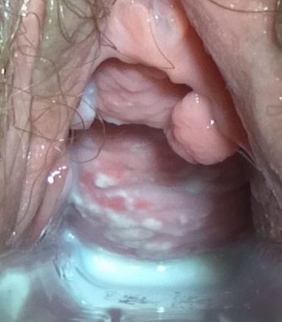

# CANDIDÍASE VULVOVAGINAL

A candidíase vulvovaginal (CVV) não é apenas "mais uma" infecção ginecológica. Ela é a ==segunda causa mais comum de corrimento== vaginal no mundo, ==perdendo== apenas para a ==vaginose bacteriana==. No entanto, se olharmos para o que leva a paciente ao consultório com urgência, a CVV assume o primeiro lugar devido ao sintoma que é a marca registrada da doença: o ==prurido intenso==.

Para a sua prova de residência, o primeiro conceito que você deve fixar é que a candidíase não é considerada uma Infecção Sexualmente Transmissível (IST). Embora possa ocorrer após o coito, ela é fruto de um ==desequilíbrio da flora vaginal==. A *Candida* é um fungo comensal, ou seja, ela já habita a vagina de cerca de ==20==% das mulheres saudáveis em idade reprodutiva sem causar nenhum sintoma. O problema começa quando esse fungo deixa de ser um "morador silencioso" e passa a se multiplicar de forma desordenada, invadindo o epitélio.

*Figura 1 - Cultura de Candida albicans em ágar SABHI a 20°C, mostrando colônias características do fungo. Fonte: CDC/Dr. William Kaplan, Domínio Público | Wikimedia Commons*

## Fisiopatologia: Por que o fungo cresce?

Para entender o tratamento e os fatores de risco, você precisa entender o que mantém a *Candida* sob controle. O ambiente vaginal é um ecossistema delicado, dominado pelos l==actobacilos==, que mantêm o ==pH ácido== (entre 3,8 e 4,5). A *Candida* gosta de ambientes ácidos, mas ela é mantida em xeque pela imunidade celular local e pela competição por nutrientes com os lactobacilos.

Quando esse equilíbrio é quebrado, o fungo passa da forma de ==levedura== (esporos) para a forma de ==hifas== ou ==pseudo-hifas,== que são as estruturas que efetivamente invadem o tecido e causam a inflamação.

### Fatores de Risco: O que as bancas amam cobrar

As questões de prova adoram colocar uma paciente com um "gatilho" específico. Se você identificar o fator de risco no enunciado, o diagnóstico de candidíase deve saltar aos seus olhos.

- **Uso de Antibióticos de Amplo Espectro:** Este é o clássico dos clássicos. O ==antibiótico mata os lactobacilos== (a "polícia" da vagina), deixando o campo livre para o crescimento fúngico. Se a questão diz "paciente apresentou corrimento após tratar uma sinusite ou ITU", pense em candidíase.

- **Diabetes Mellitus Descompensado:** O ==excesso de glicose== no sangue e, consequentemente, nos tecidos e secreções vaginais, serve de "banquete" para a *Candida*. Além disso, a ==hiperglicemia prejudica a função dos neutrófilos==. Se a candidíase for recorrente, você é obrigado a investigar Diabetes ou imunossupressão (como o HIV).

- **Altos Níveis de Estrogênio:** O estrogênio aumenta o conteúdo de glicogênio nas células vaginais. Mais glicogênio significa mais substrato para o fungo. Por isso, a candidíase é comum na gestação, em usuárias de anticoncepcionais orais de alta dose e na fase lútea do ciclo menstrual (logo antes da menstruação).

- **Imunossupressão:** Pacientes com HIV, em uso de corticoides crônicos ou quimioterapia têm uma ==falha na imunidade celular== que deveria conter o fungo.

**Dica do Dr. Will:** Cuidado com a pegadinha! Hipertensão arterial NÃO é fator de risco para candidíase. As bancas adoram colocar uma lista de comorbidades e pedir a exceção.

## Classificação: O divisor de águas na conduta

Nem toda candidíase é igual, e a FEBRASGO, seguindo orientações internacionais, divide a CVV em dois grandes grupos. Essa classificação é fundamental porque define se o tratamento será curto ou prolongado.

### Candidíase Não Complicada

É aquela que ==ocorre esporadicamente== (menos de 4 vezes por ano), com sintomas leves a moderados, causada pela *Candida albicans* e em pacientes hígidas (não grávidas, não diabéticas, não imunossuprimidas). Aqui, uma dose única de antifúngico costuma resolver.

### Candidíase Complicada

Aqui o cenário muda. Consideramos complicada quando:

- Os sintomas ==são graves== (edema vulvar importante, fissuras, escoriações).

- É causada por ==espécies "não-albicans"== (como a *Candida glabrata*).

- Ocorre em pacientes com ==comorbidades== (Diabetes descompensado, HIV, imunossupressão).

- Ocorre durante a gestação.

- ==É recorrente== (4 ou mais episódios em 12 meses).

*Figura 2 - Exame especular em candidíase vulvovaginal: placas brancas espessas (aspecto de leite coalhado) aderidas à parede vaginal anterior. Fonte: Mikael Häggström, CC0 | Wikimedia Commons*

## O Quadro Clínico: O que a paciente sente e o que você vê

O diagnóstico de candidíase é clínico-laboratorial. No MedEvo, sempre reforçamos que você deve visualizar a paciente da questão.

**Sintomas:**

- **==Prurido Vulvar:==** É o sintoma cardeal. É intenso, muitas vezes piora à noite e pode levar a escoriações pelo ato de coçar.

- **==Corrimento Branco e Grumoso:==** Descrito classicamente como "leite coalhado" ou "queijo tipo cottage". Ele é inodoro (não tem cheiro ruim).

- **Ardência e Disúria Terminal:** A urina, ao entrar em contato com a vulva inflamada, causa dor.

- **Dispareunia de Intranito:** Dor na penetração devido à inflamação da mucosa.

**Sinais no Exame Físico:**
Ao realizar o exame especular e a inspeção vulvar, você encontrará:

- ==Eritema== (vermelhidão) e edema de vulva e vagina.

- ==Placas brancas== aderidas à parede vaginal.

- Fissuras vulvares (em casos mais intensos).

- **pH Vaginal Normal ==(< 4,5):==** Guarde isso! Na candidíase, o pH continua ácido. Se o pH estiver > 4,5, desconfie de Vaginose ou Tricomoníase.

## Diagnóstico Laboratorial: A tríade da confirmação

Para fechar o diagnóstico em uma questão de prova, você geralmente receberá os resultados de três testes rápidos feitos no consultório:

- **==Exame a Fresco== (Microscopia):** Coleta-se o corrimento, mistura-se com uma gota de soro fisiológico e observa-se ao microscópio. O que você procura? **==Hifas==, pseudo-hifas e esporos (brotamentos).**

- **Teste do Hidróxido de Potássio (KOH a 10%):** Também chamado de "Teste das Aminas" ou "Whiff Test". Na candidíase, ele é **NEGATIVO**. O KOH ajuda a dissolver as células epiteliais, facilitando a visualização das hifas, mas não libera odor fétido (diferente da Vaginose Bacteriana).

- **pH Vaginal:** Como já dito, permanece **< 4,5**.

**Tabela 1: Diagnóstico Diferencial das Vaginites (O que mais cai!)**

| Característica | Candidíase | Vaginose Bacteriana | Tricomoníase |
| --- | --- | --- | --- |
| **Sintoma Principal** | Prurido intenso | Odor fétido (peixe podre) | Corrimento abundante e dor |
| **Aspecto do Fluxo** | Branco, grumoso (leite coalhado) | Branco-acinzentado, fluido, bolhoso | Amarelo-esverdeado, bolhoso |
| **pH Vaginal** | **< 4,5 (Ácido)** | > 4,5 (Alcalino) | > 4,5 (Alcalino) |
| **Whiff Test (KOH)** | Negativo | **Positivo** | Pode ser positivo |
| **Microscopia** | Hifas e esporos | Clue Cells (Células-alvo) | Tricomonas (protozoário móvel) |

## Tratamento: Do simples ao complexo

O tratamento da candidíase visa a remissão dos sintomas. Como o fungo pode fazer parte da flora, o objetivo não é necessariamente a "esterilização" da vagina, mas sim o retorno ao equilíbrio.

### Candidíase Não Complicada

Pode ser tratada via vaginal (tópica) ou via oral. A eficácia é equivalente, então a escolha depende da preferência da paciente.

-

**Opções Orais:**

- **Fluconazol 150 mg:** Dose única via oral. É a escolha prática para a maioria das pacientes.

- Itraconazol 200 mg: 1 vez ao dia por 3 dias (menos comum em provas).

-

**Opções Tópicas (Cremes/Óvulos):**

- Miconazol creme 2%: 1 aplicador cheio à noite por 7 dias.

- Isoconazol creme ou óvulo: Dose única ou 3 dias (depende da apresentação).

- Nistatina creme (100.000 UI): 1 aplicador por 14 noites. **Atenção:** A nistatina é menos eficaz que os azólicos, sendo reservada para casos específicos ou quando há restrição aos azóis.

### Candidíase Complicada

Se a paciente tem sintomas graves ou comorbidades, o tratamento deve ser mais agressivo:

- **Tópico prolongado:** 7 a 14 dias de creme azólico.

- **Oral:** Fluconazol 150 mg em duas doses (uma no dia 1 e outra no dia 4).

### Candidíase Recorrente (CVVR)

Definida como **4 ou mais episódios em 1 ano**. Aqui, o erro comum é tratar apenas o episódio agudo e liberar a paciente. O protocolo exige uma **Terapia de Manutenção**.

- **Indução:** Fluconazol 150 mg (dias 1, 4 e 7) OU azólico tópico por 10-14 dias.

- **Manutenção:** **Fluconazol 150 mg, uma vez por semana, por 6 meses.**

Se a causa for *Candida glabrata* (que é resistente aos azóis), o tratamento de escolha costuma ser o **Ácido Bórico 600 mg** via vaginal, diariamente, por 14 dias.

**Importante:** Você deve tratar o parceiro? **NÃO.** A candidíase não é IST. Só tratamos o parceiro se ele apresentar sintomas (balanopostite). Isso cai muito em prova!

## Situações Especiais: Onde as pegadinhas se escondem

### 1. Gestação

A gestante tem mais candidíase devido ao alto nível de estrogênio. No entanto, há uma regra de ouro: **É PROIBIDO usar antifúngicos orais (Fluconazol) na gestação.** Eles são teratogênicos (risco de malformações, especialmente se usados em doses altas ou repetidas).

- **Conduta na Gestante:** Tratamento exclusivamente **TÓPICO** (cremes vaginais) por pelo menos 7 dias. O Miconazol ou Clotrimazol são as escolhas clássicas.

### 2. Candidíase Mamária (Amamentação)

Muitas vezes a candidíase vaginal se associa à infecção nos mamilos durante a amamentação.

- **Quadro clínico:** Dor intensa nos mamilos, descrita como "agulhadas" ou "fisgadas" que irradiam para o parênquima mamário, ocorrendo geralmente após a mamada. O mamilo pode estar hiperemiado, com fissuras ou descamação.

- **Conduta:** Tratar a mãe (creme de nistatina ou miconazol nos mamilos após as mamadas) e o bebê (nistatina oral/suspensão), pois eles trocam o fungo entre si.

### 3. Vaginose Citolítica: O grande diagnóstico diferencial

Imagine uma paciente com todos os sintomas de candidíase (prurido, corrimento branco, pH ácido), mas que não melhora com nenhum antifúngico. O exame a fresco mostra um excesso de lactobacilos e citólise (células epiteliais rompidas, núcleos nus).

- Isso é **Vaginose Citolítica**. O tratamento não é antifúngico, mas sim a **alcalinização da vagina** com banhos de assento com bicarbonato de sódio, para reduzir a acidez excessiva que está causando a quebra das células.

## Medidas Não-Farmacológicas (MEV)

Embora os remédios resolvam o quadro agudo, a prevenção da recorrência passa por mudanças de hábito. As bancas gostam de cobrar orientações de higiene:

- Evitar roupas apertadas e de tecido sintético (preferir algodão).

- Dormir sem calcinha para melhorar a ventilação local.

- Não realizar duchas vaginais (que destroem a flora protetora).

- Controle rigoroso da glicemia em diabéticas.

## Erros Comuns e "Pegadinhas" de Prova

- **Tratar paciente assintomática:** Se o Papanicolau vier com "Candida sp", mas a paciente não sente nada, **NÃO TRATE**. A *Candida* pode ser flora normal. Só tratamos se houver sintomas.

- **Confundir com Vaginose Bacteriana:** Lembre-se do pH. Candidíase = pH < 4,5. Vaginose = pH > 4,5.

- **Esquecer da duração na gestante:** Na gestação, o tratamento tópico deve ser por 7 dias, não apenas 3.

- **Achar que Fluconazol é sempre dose única:** Na recorrente, o esquema é prolongado (6 meses).

## Pontos-Chave para Prova 💡

- **Definição de Recorrência:** 4 ou mais episódios em 12 meses.

- **pH Vaginal:** Na candidíase, ele é **NORMAL** (ácido, < 4,5). Se estiver aumentado, pense em outras causas.

- **Whiff Test (KOH):** Sempre **NEGATIVO** na candidíase.

- **Microscopia:** Presença de hifas, pseudo-hifas ou esporos (brotamentos).

- **Fator de Risco Clássico:** Uso recente de antibióticos, gravidez e Diabetes Mellitus.

- **Tratamento na Gestação:** **CONTRAINDICAÇÃO ABSOLUTA** ao Fluconazol oral. Usar apenas azólicos tópicos por 7 a 14 dias.

- **Tratamento do Parceiro:** Não é necessário, a menos que ele seja sintomático.

- **Candidíase Mamária:** Dor tipo "agulhada" após mamar + mamilo descamativo. Tratar mãe e bebê.

- **Vaginose Citolítica:** O "mimic" da candidíase. pH muito baixo, muitos lactobacilos, hifas ausentes. Tratar com bicarbonato.

- **Candida glabrata:** Espécie não-albicans, resistente a azóis. Tratamento com Ácido Bórico.

- **Primeira Escolha (Não Complicada):** Fluconazol 150 mg VO dose única OU Miconazol tópico 7 noites.

- **Papanicolau:** Presença de *Candida* em paciente sem sintomas não requer tratamento.

- **Imunossupressão:** Em pacientes com HIV ou transplantadas, a candidíase tende a ser mais grave e recorrente, exigindo esquemas de manutenção.

- **Diagnóstico Diferencial:** O prurido também pode ocorrer no Líquen Escleroso, mas este causa atrofia e perda da anatomia vulvar, sem o corrimento grumoso típico.

 Cópia offline para consulta pessoal.
 Fonte original:
 [https://www.medevo.com.br/material-apoio/ler/bdf6e096-77b3-4b3b-8b36-11a78ca7596c](https://www.medevo.com.br/material-apoio/ler/bdf6e096-77b3-4b3b-8b36-11a78ca7596c)
