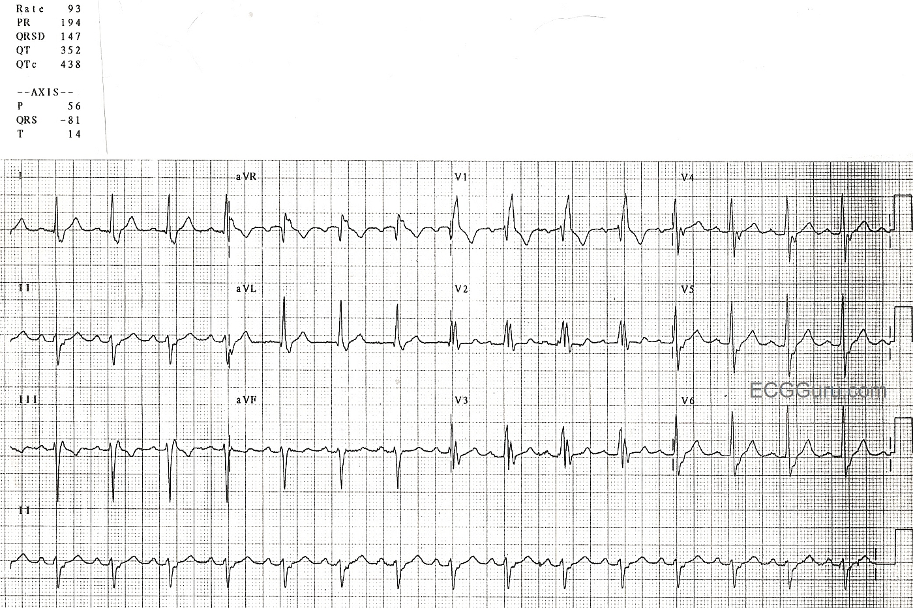
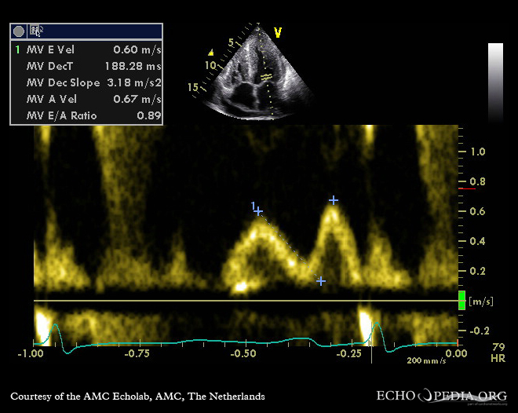
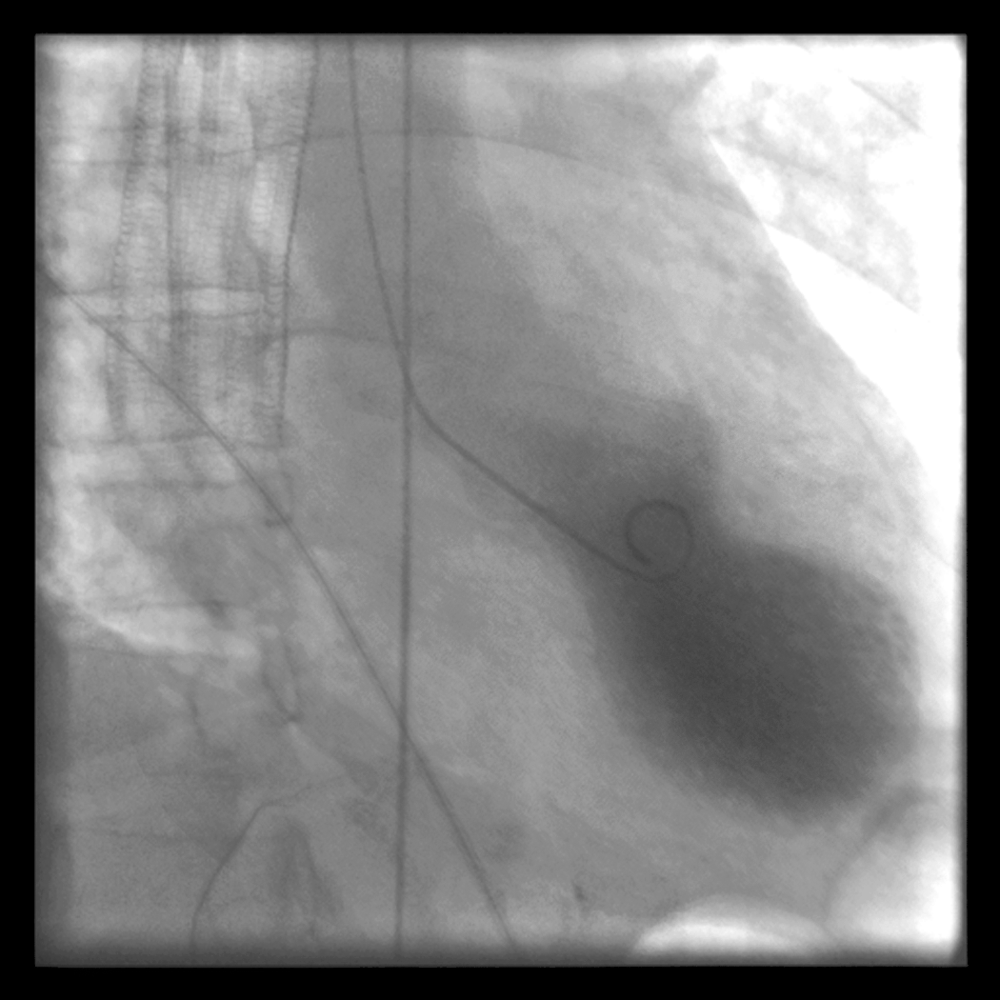
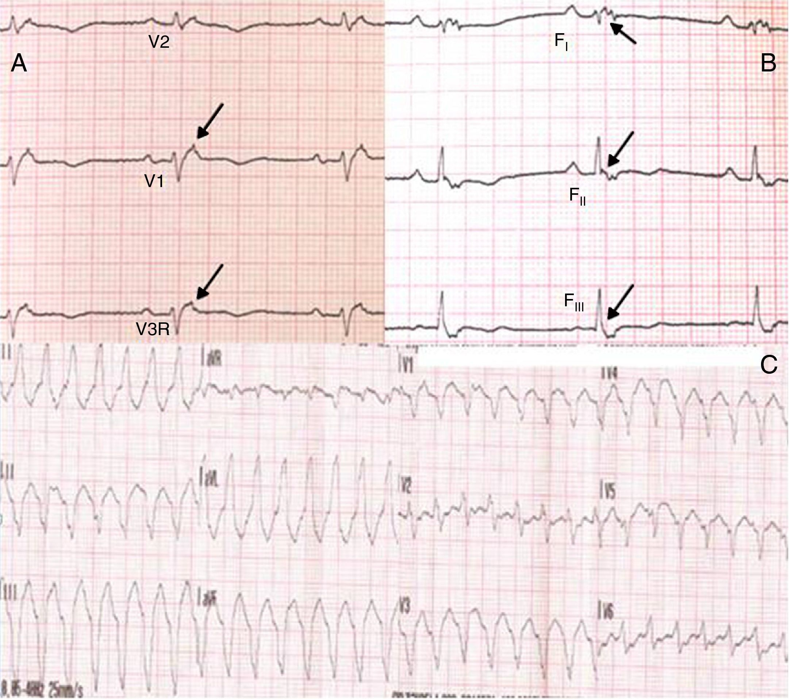

# CARDIOMIOPATIAS

Para entender as cardiomiopatias, o primeiro passo é organizar o raciocínio por fenótipos. No dia a dia da enfermaria e em provas, a pergunta central é: este coração está dilatado, hipertrófico ou rígido?

A definição oficial da Sociedade Brasileira de Cardiologia (SBC) classifica as cardiomiopatias como doenças do miocárdio associadas a disfunção mecânica ou elétrica, geralmente exibindo hipertrofia ou dilatação ventricular inapropriada. O ponto-chave aqui é que elas não são causadas por doença coronariana, hipertensão arterial, valvopatias ou cardiopatias congênitas. Se o ventrículo dilatou porque a aorta está estenosada, isso é uma consequência, não uma cardiomiopatia primária.

## Cardiomiopatia Dilatada (CMPD)

A CMPD é o fenótipo mais comum na prática clínica. Caracteriza-se por dilatação ventricular e disfunção sistólica (fração de ejeção reduzida) na ausência de condições anormais de carga ou doença coronariana.

### Fisiopatologia e Etiologia

Por que o coração dilata? O mecanismo básico é o remodelamento excêntrico. Os sarcômeros são adicionados em série, as paredes afinam e o raio da cavidade aumenta. Isso gera um aumento do estresse de parede (Lei de Laplace), o que consome mais oxigênio e gera um ciclo vicioso de falência miocárdica.

As causas são vastas, mas as mais cobradas são:

- **Idiopática:** Até 50% dos casos.

- **Genética:** Mutação na proteína Titina (TTN) é a mais frequente.

- **Infecciosa:** Miocardite viral (Coxsackie, Adenovírus, COVID-19) e a nossa onipresente Doença de Chagas.

- **Tóxica:** Álcool (reversível se parar de beber!), quimioterápicos (Antraciclinas como a Doxorrubicina) e cocaína.

- **Periparto:** Ocorre no último mês de gestação ou nos primeiros cinco meses pós-parto.

### Quadro Clínico e Exame Físico

O paciente chega com a clássica síndrome de Insuficiência Cardíaca (IC): dispneia progressiva, ortopneia, dispneia paroxística noturna e edema de membros inferiores.

No exame físico, procure por:

- Ictus cordis desviado para a esquerda e para baixo (sinal de dilatação).

- Presença de B3 (bulha da "complacência", indicando sobrecarga de volume).

- Sopro de insuficiência mitral funcional (o ventrículo dilata tanto que afasta os folhetos da valva).

### Diagnóstico e Tratamento

O Ecocardiograma é o seu melhor amigo aqui. Ele vai mostrar o diâmetro diastólico final do VE aumentado (> 55-60 mm) e a fração de ejeção (FEVE) reduzida (< 40-45%).

O tratamento segue o "quarteto fantástico" da IC com Fração de Ejeção Reduzida (ICFEr), conforme a Diretriz Brasileira de Insuficiência Cardíaca (2021):

- **Betabloqueadores (Metoprolol, Carvedilol ou Bisoprolol):** Reduzem mortalidade e arritmias.

- **Inibidores da SRAA (Preferencialmente Sacubitril-Valsartana ou IECA/BRA):** Reduzem remodelamento.

- **Antagonistas do Receptor Mineralocorticoide (Espironolactona):** Reduzem fibrose e mortalidade.

- **Inibidores da SGLT2 (Dapagliflozina ou Empagliflozina):** Reduzem hospitalização e morte cardiovascular, independentemente de diabetes.

**Ponto de prova:** a espironolactona na CMPD idiopática reduz mortalidade por bloqueio neuro-hormonal. Diuréticos de alça, como furosemida, melhoram sintomas congestivos, mas não reduzem mortalidade.

## Doença de Chagas: A Peculiaridade Brasileira

Em provas de residência no Brasil, a miocardiopatia chagásica crônica (MCC) é tema obrigatório. Ela é uma forma agressiva de cardiomiopatia dilatada com características únicas.

### Fases e Fisiopatologia

A fase aguda muitas vezes passa despercebida (Sinal de Romaña ou chagoma de inoculação). A fase crônica pode ser indeterminada (sorologia positiva, mas sem sintomas ou alterações no ECG/Eco) ou determinada (cardíaca, digestiva ou mista).

Existem quatro hipóteses para o dano miocárdico na Chagas:

- **Dano direto pelo parasita:** O *Trypanosoma cruzi* destruindo fibras.

- **Teoria Neurogênica:** Destruição do sistema nervoso autônomo parassimpático, levando a um desequilíbrio simpático e dano por catecolaminas.

- **Teoria Microvascular:** Microinfartos por disfunção endotelial.

- **Teoria Imunológica:** A mais aceita. O sistema imune ataca o coração em resposta ao parasita (mimetismo molecular).

### Achados Clássicos de Prova

Se a questão descrever um paciente do interior de Minas Gerais ou Goiás com:

- **ECG:** Bloqueio de Ramo Direito (BRD) associado a Bloqueio Divisional Anterossuperior Esquerdo (BDASE). Isso é "carimbo" de Chagas.

*Figura 1: ECG típico de Chagas. Note o padrão rSR' em V1 (BRD) e o desvio do eixo para a esquerda (BDASE). Esta combinação é o "carimbo" eletrocardiográfico da miocardiopatia chagásica crônica.*

**Leitura guiada da imagem:**

- observe V1: padrão **rSR'**, com segunda onda R proeminente, compatível com bloqueio de ramo direito;

- observe o eixo no plano frontal: desvio para a esquerda, sugerindo bloqueio divisional anterossuperior esquerdo;

- a associação **BRD + BDASE** em paciente de área endêmica deve acender Chagas crônica como hipótese principal.

- **Ecocardiograma:** Aneurisma de ponta (apical) e trombos intracavitários.

- **Holter:** Arritmias ventriculares complexas e bradicardia sinusal (disfunção do nó sinusal).

O prognóstico da Chagas é pior do que o da CMPD idiopática. O tratamento da IC é o mesmo, mas o risco de morte súbita e fenômenos tromboembólicos é muito maior.

## Cardiomiopatia Hipertrófica (CMH)

Aqui o jogo muda. A CMH é uma doença genética (autossômica dominante) caracterizada por hipertrofia ventricular esquerda na ausência de causas hipertensivas ou valvares. A CMH é uma das principais causas de morte súbita em atletas jovens.

### Fisiopatologia: O Caos Celular

O problema está nas proteínas do sarcômero (principalmente a Cadeia Pesada de Beta-Miosina e a Proteína C de ligação à miosina). O resultado é o **desarranjo (disarray) miocárdico**. As fibras não estão alinhadas; elas estão em "redemoinho", o que predispõe a arritmias ventriculares.

A hipertrofia costuma ser assimétrica, acometendo preferencialmente o septo interventricular. Isso pode gerar a **Obstrução da Via de Saída do VE (CMHO)**.

> **Ecocardiograma modo-M na cardiomiopatia hipertrófica obstrutiva:** o achado-chave é a hipertrofia septal assimétrica associada ao movimento anterior sistólico da valva mitral (**SAM**). Na leitura do traçado/imagem, compare o septo com a parede posterior e procure a aproximação do folheto anterior da mitral em direção ao septo durante a sístole; esse contato estreita a via de saída do VE e explica o sopro dinâmico.

**Leitura guiada:**

- compare septo e parede posterior: o septo está desproporcionalmente espessado;

- durante a sístole, o folheto anterior da mitral se aproxima do septo: esse é o **SAM**;

- a aproximação mitral-septo estreita a via de saída do VE e explica o sopro dinâmico da CMH.

### O Fenômeno SAM (Systolic Anterior Motion)

Preste atenção nisso: durante a sístole, a ejeção rápida de sangue pelo canal estreitado da via de saída cria uma pressão negativa (Efeito Venturi), que "puxa" o folheto anterior da valva mitral em direção ao septo. Isso causa dois problemas:

- Obstrução da saída de sangue (gradiente pressórico).

- Insuficiência mitral secundária (o folheto saiu do lugar, a valva não fecha).

### Exame Físico: A Pegadinha Favorita das Bancas

O sopro da CMH é um sopro sistólico ejetivo, rude, em diamante. Ele se diferencia do sopro da Estenose Aórtica (EAo) pelas manobras dinâmicas:

- **Valsalva ou Ortostatismo:** Diminuem o retorno venoso (pré-carga). Com menos sangue no ventrículo, ele fica "murcho", o septo e a mitral se aproximam mais, a obstrução AUMENTA e o sopro fica MAIS FORTE.

- **Agachamento ou Handgrip:** Aumentam a pré-carga ou pós-carga. O ventrículo "estufa", afastando o septo da mitral. A obstrução DIMINUI e o sopro fica MAIS BAIXO.

**Cuidado:** Na Estenose Aórtica, o Valsalva DIMINUI o sopro. Se o sopro aumenta com Valsalva, marque CMH sem medo.

### Diagnóstico e Estratificação de Risco

O diagnóstico é feito pelo Eco: espessura da parede ventricular ≥ 15 mm (ou ≥ 13 mm se houver história familiar positiva). A Ressonância Magnética Cardíaca (RMC) é fundamental para avaliar o **Realce Tardio com Gadolínio**, que indica fibrose. Se houver > 15% de fibrose, o risco de morte súbita é alto.

### Tratamento

O objetivo é relaxar o ventrículo e diminuir o gradiente.

- **Primeira linha:** Betabloqueadores (prolongam a diástole e diminuem a contratilidade).

- **Segunda linha:** Verapamil ou Diltiazem (bloqueadores de canais de cálcio não-diidropiridínicos).

- **Contraindicação:** Vasodilatadores (nitratos, nifedipino), diuréticos em altas doses e digitálicos. Eles diminuem o volume ventricular e pioram a obstrução.

Para pacientes com alto risco de morte súbita (história de parada cardíaca, TVNS no Holter, espessura > 30 mm, síncope inexplicada), o implante de CDI (Cardioversor Desfibrilador Implantável) é indicado.

## Cardiomiopatia Restritiva (CMPR)

É a menos comum, mas a que mais cai como diagnóstico diferencial. Aqui, o ventrículo não é dilatado nem necessariamente hipertrófico; ele é **rígido**. A função sistólica costuma ser preservada no início, mas a função diastólica é um desastre.

### Amiloidose Cardíaca: A Estrela da CMPR

A amiloidose ocorre pelo depósito de proteínas mal enoveladas (fibrilas amiloides) no interstício miocárdico.
Existem dois tipos principais:

- **AL (Cadeia Leve):** Associada a discrasias plasmocitárias (como Mieloma Múltiplo). É uma emergência médica.

- **ATTR (Transtirretina):** Pode ser hereditária ou "selvagem" (senil, comum em idosos).

**O Padrão Clássico de Prova:**
Paciente idoso com sintomas de IC de direita (turgência jugular, ascite, edema) + Ecocardiograma mostrando paredes espessadas ("hipertrofia") + ECG mostrando **baixa voltagem**.
*Espere um pouco...* Se o coração está grosso no Eco, o ECG deveria ter alta voltagem (índice de Sokolow-Lyon positivo), certo? Se houver essa dissociação (Eco grosso + ECG pequeno), pense em Amiloidose. O tecido que está lá não é músculo, é "lixo" proteico que não conduz eletricidade.

No Eco com Strain, observamos o **"Apical Sparing"** (preservação da contratilidade da ponta com redução na base), o famoso padrão de "cereja no topo".

*Figura 5: Ecocardiograma Doppler na amiloidose cardíaca. O fluxo mitral mostra padrão E<A, indicando disfunção diastólica restritiva típica do envolvimento cardíaco amiloide. Este achado diferencia a amiloidose de outras causas de hipertrofia.*

**Leitura guiada da imagem:**

- foque no Doppler mitral: a alteração do padrão de enchimento sugere disfunção diastólica;

- na amiloidose, o ventrículo pode parecer espesso, mas o problema é infiltração e rigidez, não hipertrofia sarcomérica;

- a pista de prova é a discordância entre parede espessa, baixa voltagem no ECG e sinais sistêmicos de amiloidose.

### Diagnóstico Diferencial: Pericardite Constritiva

Ambas cursam com restrição ao enchimento. A diferença é que na Pericardite Constritiva há uma variação respiratória importante dos fluxos valvares e o pericárdio está espessado na Tomografia ou Ressonância. Na CMPR, o problema é o músculo.

## Miocardite

A miocardite é a inflamação do músculo cardíaco. É uma entidade camaleônica: pode ser desde uma dor torácica boba até um choque cardiogênico fulminante.

### Etiologia e Clínica

A causa viral é a principal (Parvovírus B19, Herpes vírus 6, Coxsackie). Recentemente, a miocardite por COVID-19 e a rara miocardite pós-vacina (especialmente em jovens do sexo masculino após a 2ª dose de vacinas de mRNA) ganharam destaque.

O quadro clínico mimetiza um Infarto Agudo do Miocárdio (IAM): dor torácica, supra de ST no ECG e aumento de Troponina. No entanto, as coronárias são normais na cineangiocoronariografia.

### Diagnóstico: Critérios de Lake Louise (RMC)

A Ressonância Magnética é o padrão-ouro não invasivo. Os critérios de Lake Louise atualizados buscam:

- **Edema miocárdico** (sequências T2).

- **Lesão miocárdica não isquêmica** (Realce tardio ou aumento de T1/ECV).

A Biópsia Endomiocárdica (BEM) é o padrão-ouro definitivo, mas devido ao risco e à natureza focal da inflamação (baixa sensibilidade), reservamos para casos graves: IC de início agudo (< 2 semanas) com instabilidade hemodinâmica ou bloqueios cardíacos.

### Tratamento e Cuidados

- Suporte para IC.

- **Evitar AINEs:** Em modelos animais, o uso de ibuprofeno na fase aguda aumentou a replicação viral e a mortalidade.

- **Repouso:** Atividade física deve ser suspensa por 3 a 6 meses.

- **Imunossupressão:** Reservada para miocardites autoimunes (Lúpus, Células Gigantes) ou eosinofílicas. Na miocardite viral aguda, o corticoide pode piorar o prognóstico.

## Cardiomiopatia de Takotsubo (Síndrome do Coração Partido)

Imagine uma mulher, pós-menopausa, que após um estresse emocional intenso (morte de um ente querido, assalto) apresenta dor torácica típica.

### O que acontece?

Há uma descarga maciça de catecolaminas que causa um "atordoamento" miocárdico. O ventrículo esquerdo assume uma forma de "armadilha de polvo" (Takotsubo em japonês): a base contrai excessivamente e o ápice fica acinético e balonado.

*Figura 3: Takotsubo. À esquerda: ventriculografia mostrando o ventrículo com ápice balonado e base hipercontrátil. À direita: a armadilha de polvo japonesa (takotsubo) que deu nome à síndrome.*

**Leitura guiada da imagem:**

- observe o ápice: há balonamento apical, com contração reduzida;

- observe a base: a contração basal é relativamente preservada ou hipercontrátil;

- o conjunto imita IAM, mas a ausência de obstrução coronariana significativa e a reversibilidade favorecem Takotsubo.

**Características:**

- Mimetiza IAM (dor + ECG alterado + troponina alta).

- Coronárias sem obstruções significativas.

- Disfunção ventricular é **transitória** (recupera em dias ou semanas).

- Tratamento é suporte para IC e controle do estresse.

## Cardiomiopatia Arritmogênica do Ventrículo Direito (CAVD)

Aqui, o músculo do ventrículo direito é substituído por tecido fibrogorduroso. É uma doença genética (defeitos nos desmossomos).

**Achados de Prova:**

- Jovem com arritmia ventricular originada no VD (padrão de BRE).

- **ECG:** Inversão de onda T de V1 a V3 e a famosa **Onda Épsilon** (uma pequena deflexão após o QRS).

*Figura 4: Onda Épsilon. Esta pequena onda terminal após o QRS em V1 é PATOGNOMÔNICA da Cardiomiopatia Arritmogênica do VD (CAVD). Note também a inversão de onda T em precordiais direitas.*

**Leitura guiada da imagem:**

- procure a pequena deflexão logo após o fim do QRS em V1: essa é a **onda épsilon**;

- avalie V1-V3: inversão de onda T em precordiais direitas reforça acometimento do ventrículo direito;

- em jovem com síncope/palpitações e TV com morfologia de BRE, esse ECG favorece CAVD.

- RMC mostra infiltração gordurosa e microaneurismas no VD.

## Tabelas Comparativas para Revisão Rápida

> **Comparativo das cardiomiopatias:** - **Dilatada:** câmaras ventriculares dilatadas, paredes relativamente finas e disfunção sistólica. - **Hipertrófica:** hipertrofia miocárdica, especialmente septal, podendo causar obstrução dinâmica da via de saída do VE. - **Restritiva:** ventrículos pouco complacentes, função sistólica relativamente preservada no início e átrios aumentados por dificuldade de enchimento diastólico. - **Arritmogênica do VD:** substituição fibrogordurosa do miocárdio do ventrículo direito, com arritmias ventriculares e risco de morte súbita. *Figura 6: Comparação anatômica dos 3 tipos de cardiomiopatia. Na dilatada, predominam câmaras grandes e paredes relativamente finas; na hipertrófica, septo espesso e cavidade menor; na restritiva, ventrículos pouco complacentes com átrios dilatados.*

**Leitura guiada da imagem:**

- dilatada = problema sistólico predominante, ventrículo grande e fração de ejeção reduzida;

- hipertrófica = parede espessa, cavidade pequena e risco de obstrução dinâmica;

- restritiva = ventrículo rígido, enchimento difícil e aumento atrial desproporcional.

### Tabela 1: Padrões Hemodinâmicos e Morfológicos

| Tipo | Morfologia | Função Sistólica | Função Diastólica | Principal Causa |
| --- | --- | --- | --- | --- |
| **Dilatada** | Dilatação de câmaras, paredes finas | Reduzida (FE < 40%) | Alterada (tardiamente) | Idiopática, Álcool, Chagas |
| **Hipertrófica** | Hipertrofia assimétrica (septo) | Preservada ou Supranormal | Muito alterada (rigidez) | Genética (Sarcômero) |
| **Restritiva** | Câmaras normais, átrios aumentados | Preservada (inicialmente) | Muito alterada (restrição) | Amiloidose, Sarcoidose |
| **Takotsubo** | Balonamento apical transitório | Reduzida (agudo) | Alterada (agudo) | Estresse emocional/físico |

### Tabela 2: Diagnóstico Diferencial de Sopros Sistólicos

| Manobra | Estenose Aórtica (EAo) | CMH Obstrutiva | Insuficiência Mitral |
| --- | --- | --- | --- |
| **Valsalva** | Diminui | **Aumenta** | Diminui |
| **Ortostatismo** | Diminui | **Aumenta** | Diminui |
| **Agachamento** | Aumenta | **Diminui** | Aumenta |
| **Handgrip** | Diminui | **Diminui** | Aumenta |

### Tabela 3: Chagas vs. Amiloidose no ECG

| Achado | Doença de Chagas | Amiloidose Cardíaca |
| --- | --- | --- |
| **Ritmo/Condução** | BRD + BDASE (clássico) | Bloqueios de condução variados |
| **Voltagem** | Normal ou Baixa (se fibrose extensa) | **Baixa voltagem generalizada** |
| **Arritmias** | TVNS, Extrassístoles frequentes | Fibrilação Atrial comum |
| **Outros** | Ondas Q patológicas (pseudoinfarto) | Padrão de pseudoinfarto (QS de V1-V3) |

## Detalhes que Fazem a Diferença (Pérolas Clínicas)

Alguns detalhes refinam o diagnóstico diferencial e aparecem com frequência em questões:

- **Distrofia de Duchenne:** Se a questão trouxer um menino em cadeira de rodas, com escoliose e sinais de IC, olhe o ECG. Se houver ondas R altas em V1 e V2 (sugerindo acometimento da parede posterior), a causa da cardiomiopatia dilatada é a deficiência de distrofina.

- **Beribéri:** A deficiência de tiamina (B1) causa uma IC de **alto débito**. O coração está dilatado, mas a pele está quente e há um estado hiperdinâmico. É diferente da CMPD clássica, onde o débito é baixo e o paciente está "frio".

- **Fenitoína:** Este anticonvulsivante é uma causa clássica de miocardite por hipersensibilidade (eosinofílica). O paciente apresenta rash cutâneo, eosinofilia periférica e IC aguda.

- **Álcool:** A cardiomiopatia alcoólica é dose-dependente. A boa notícia é que, se o paciente interromper o consumo precocemente, a função ventricular pode normalizar completamente.

- **Verapamil na CMH:** É excelente para os sintomas, mas cuidado! Se o paciente tiver um gradiente de via de saída muito elevado em repouso (> 100 mmHg) ou estiver em IC descompensada, o Verapamil pode causar vasodilatação periférica e piorar dramaticamente a obstrução.

## Tratamento Farmacológico: Doses e Alvos

Na CMPD com ICFEr, os principais fármacos e alvos são:

- **Carvedilol:** Iniciar 3,125 mg 12/12h, alvo 25-50 mg 12/12h.

- **Enalapril:** Iniciar 2,5 mg 12/12h, alvo 10-20 mg 12/12h.

- **Espironolactona:** 25 mg/dia (monitorar potássio e função renal).

- **Dapagliflozina:** 10 mg/dia (não precisa de titulação).

Na **CMH**, evite a "tríade do erro": Nitratos, Diuréticos em excesso e Digitálicos. Se o paciente com CMH entrar em Fibrilação Atrial, o anticoagulante de escolha é o Varfarina ou NOACs, independentemente do escore CHA2DS2-VASc. O átrio na CMH é muito propenso a trombos.

## Pontos-Chave para Prova

- **CMH:** Sopro sistólico que **aumenta** com Valsalva e ortostatismo; **diminui** com agachamento e handgrip.

- **Amiloidose:** Suspeite se houver dissociação entre a espessura no Eco (grosso) e a voltagem no ECG (baixa).

- **Chagas:** A combinação BRD + BDASE é altamente sugestiva. Aneurisma de ponta é o achado ecocardiográfico típico.

- **Miocardite:** O padrão-ouro diagnóstico é a Biópsia Endomiocárdica, mas a Ressonância (Lake Louise) é o exame de escolha na prática.

- **Takotsubo:** Mulher, estresse, coronárias normais, balonamento apical do VE. Prognóstico geralmente bom e reversível.

- **CAVD:** Onda Épsilon no ECG e inversão de T em precordiais direitas (V1-V3). Risco de morte súbita em exercício.

- **Tratamento CMH:** Betabloqueadores são a primeira escolha. **NUNCA** use nifedipino ou nitratos se houver obstrução.

- **Contraindicação Absoluta na Miocardite Aguda:** Exercício físico extenuante por 3-6 meses e uso de AINEs (como Ibuprofeno).

- **Periparto:** Ocorre no final da gestação ou até 5 meses pós-parto. Alto risco de recorrência em gestações futuras se a FEVE não normalizar.

- **Duchenne:** Cardiomiopatia dilatada em jovens com R alta em V1/V2 e fraqueza muscular.

- **SGLT2i:** Agora fazem parte do tratamento padrão da cardiomiopatia dilatada com FE reduzida, mesmo sem diabetes.

- **Morte Súbita na CMH:** O principal preditor é a presença de fibrose extensa (> 15%) na Ressonância Magnética.

- **Linfócitos T:** São as principais células encontradas no infiltrado inflamatório da miocardite viral e autoimune.

- **Vacina COVID-19:** Risco de miocardite é real, mas a incidência é baixíssima (cerca de 2-4 casos por 100.000) e o curso clínico é geralmente leve. 💡

 Cópia offline para consulta pessoal.
 Fonte original:
 [https://www.medevo.com.br/material-apoio/ler/0459064d-3bcc-4326-a47a-0b7a9292e2de](https://www.medevo.com.br/material-apoio/ler/0459064d-3bcc-4326-a47a-0b7a9292e2de)
