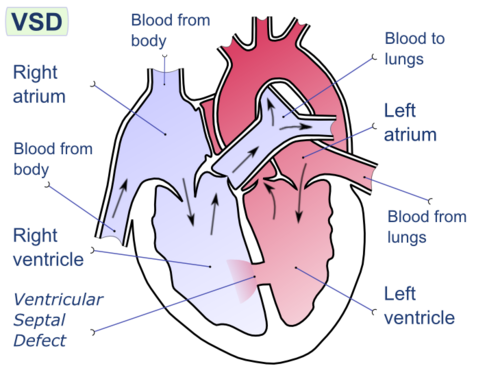
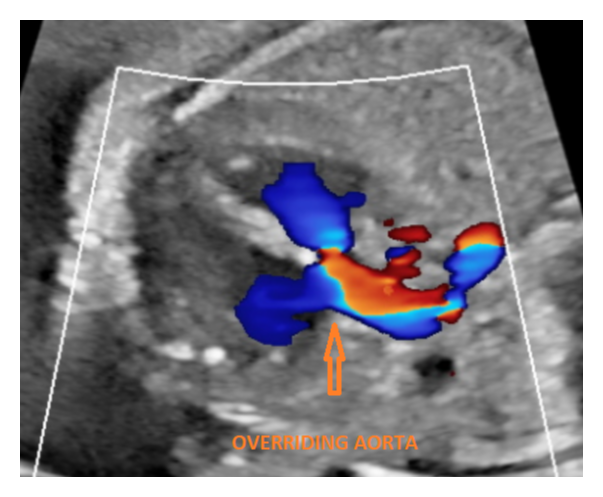
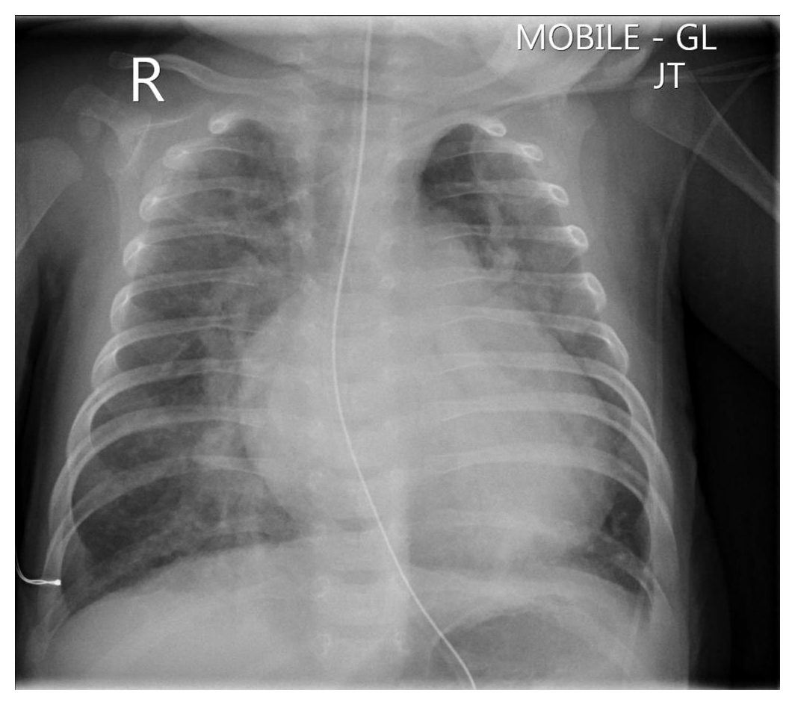
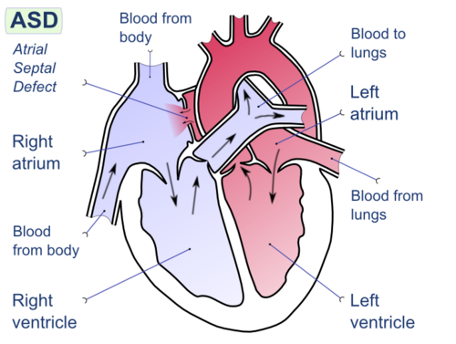
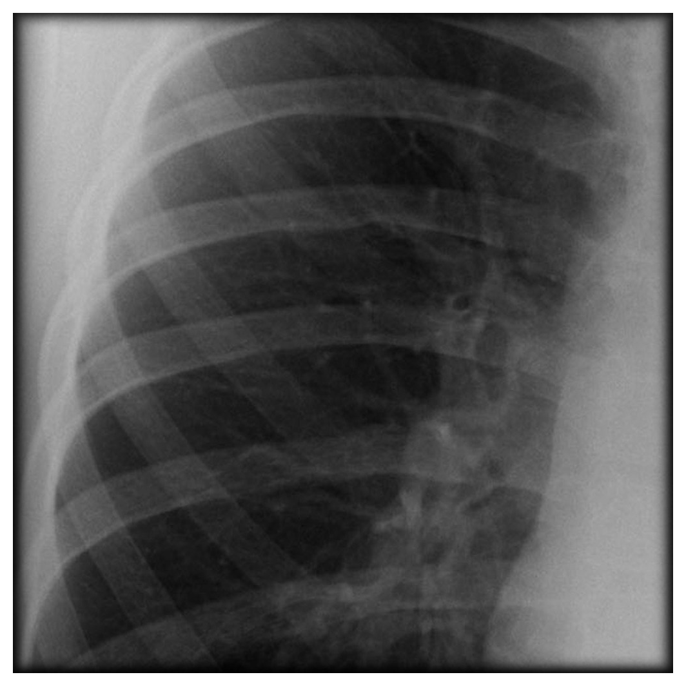
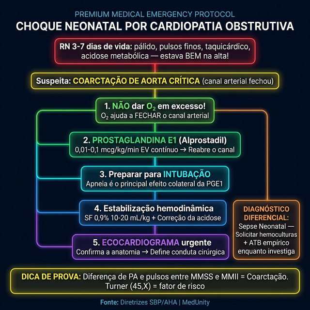

# CARDIOPATIAS CONGÊNITAS ACIANÓTICAS

Para entender as cardiopatias congênitas acianóticas, você precisa primeiro organizar sua mente em dois grandes grupos fisiopatológicos. Não tente decorar nomes soltos. O segredo das provas de residência e da vida prática é entender o que o sangue está fazendo de errado.

Nas acianóticas, o sangue que já passou pelo pulmão e está oxigenado (sangue "vermelho") acaba voltando para o lado direito do coração ou encontrando um obstáculo à sua saída. Por isso, o paciente não fica roxo (cianótico), pois o sangue que vai para o corpo é oxigenado. O problema aqui é **volume** (hiperfluxo) ou **pressão** (obstrução).

## Classificação e Fisiopatologia: O "Porquê" dos Sintomas

As cardiopatias acianóticas são divididas em:

- **Shunt Esquerda-Direita (Hiperfluxo Pulmonar):** O sangue oxigenado do lado esquerdo (maior pressão) escapa para o lado direito (menor pressão). Isso sobrecarrega o pulmão e as câmaras cardíacas. Exemplos: Comunicação Interventricular (CIV), Comunicação Interatrial (CIA), Persistência do Canal Arterial (PCA) e Defeito do Septo Atrioventricular (DSAV).

- **Lesões Obstrutivas (Normofluxo Pulmonar):** Existe um "pedágio" ou estreitamento que dificulta a passagem do sangue. O fluxo para o pulmão é normal, mas o coração precisa fazer uma força absurda para vencer a obstrução. Exemplos: Coarctação da Aorta (CoAo), Estenose Pulmonar (EP) e Estenose Aórtica (EA).

### Por que a CIV demora 2 a 3 meses para dar sintomas?

Esta é uma pergunta clássica de prova. Ao nascer, a Resistência Vascular Pulmonar (RVP) do bebê ainda é alta, quase igual à resistência sistêmica. Como as pressões estão equilibradas, o sangue não "escolhe" ir para o pulmão através do buraquinho da CIV.

Conforme as semanas passam, a RVP cai fisiologicamente. Agora, o pulmão é um caminho de "baixa pressão", e o sangue da esquerda começa a inundar o lado direito. É por isso que o lactente com CIV nasce bem e começa a cansar, suar nas mamadas e parar de ganhar peso por volta do segundo ou terceiro mês de vida.

## Shunts Esquerda-Direita: O Grupo do Hiperfluxo

## Comunicação Interventricular (CIV)

A CIV é a cardiopatia congênita mais comum (excluindo a valva aórtica bicúspide). Ela pode ser pequena (restritiva), onde o defeito é pequeno e a pressão no ventrículo direito (VD) permanece normal, ou grande (não restritiva), onde as pressões se igualam.

-

**Quadro Clínico:** O sopro é **holossistólico** (ou pansistólico) rude, melhor ouvido na borda esternal esquerda baixa. Curiosamente, quanto menor o buraco, mais barulhento é o sopro (maior turbulência).

-

**Sinais de Alerta:** Se o lactente apresenta sudorese excessiva (especialmente na testa durante a mamada), taquipneia e baixo ganho ponderal, ele está em Insuficiência Cardíaca (IC).

-

**História Natural:** Cerca de 80% das CIVs pequenas fecham espontaneamente nos primeiros dois anos de vida.

## Comunicação Interatrial (CIA)

Diferente da CIV, a CIA costuma ser silenciosa na infância. O shunt ocorre entre os átrios, onde a diferença de pressão é pequena.

- **O Achado de Ouro:** **Desdobramento fixo e constante da segunda bulha (B2)**. Por que fixo? Porque o excesso de sangue que chega ao átrio direito via CIA mantém o volume do VD alto independentemente da respiração, atrasando o fechamento da valva pulmonar de forma constante.

- **Exame Físico:** Sopro sistólico ejetivo em foco pulmonar (pelo hiperfluxo na valva, não pelo buraco em si).

- **Dica MedEvo:** Se a questão trouxer uma criança de 10 anos, assintomática, com desdobramento fixo de B2, não pense duas vezes: é CIA.

### Persistência do Canal Arterial (PCA)

O canal arterial liga a artéria pulmonar à aorta na vida fetal. Deve fechar nas primeiras 24-48 horas após o nascimento. Se persistir, o sangue da aorta (alta pressão) vai para a artéria pulmonar.

- **Fator de Risco:** Prematuridade e Rubéola Congênita (lembre-se da tríade: surdez, catarata e PCA).

- **Sopro Típico:** **Sopro contínuo em maquinaria** (ou sopro de Gibson), audível em região infraclavicular esquerda.

- **Pulsos:** Pulsos amplos e céleres (tipo martelo d'água), devido ao "roubo" de fluxo da aorta para a pulmonar na diástole, aumentando a pressão de pulso.

### Defeito do Septo Atrioventricular (DSAV)

É a combinação de uma CIA ostium primum, uma CIV de via de entrada e uma valva atrioventricular comum.

- **Associação Genética:** **Síndrome de Down (Trissomia do 21)**. Quase 50% dos pacientes com Down têm cardiopatia, e o DSAV é a mais frequente.

- **Eletrocardiograma (ECG):** O achado clássico é o **Desvio do Eixo para a Esquerda** (eixo entre -30° e -90°), o que é muito raro em bebês (que normalmente têm eixo para a direita).

## Lesões Obstrutivas: O Grupo da Pressão

### Coarctação da Aorta (CoAo)

É um estreitamento na aorta, geralmente próximo ao canal arterial.

- **Apresentação Neonatal (Crítica):** Se a coarctação for grave, o bebê depende do canal arterial para levar sangue para a parte inferior do corpo. Quando o canal fecha, o bebê entra em choque cardiogênico súbito.

- **Apresentação no Lactente/Criança:** Hipertensão arterial em membros superiores e **pulsos femorais diminuídos ou ausentes**.

- **Associação:** Síndrome de Turner (45,X). Sempre que vir uma menina com linfedema de mãos e pés e hipertensão, investigue Coarctação.

- **Sinal Radiológico:** Sinal de Roesler (corrosão das bordas inferiores das costelas por circulação colateral), visto em crianças maiores.

### Estenose Pulmonar e Aórtica

- **Estenose Pulmonar:** Sopro sistólico ejetivo em foco pulmonar com clique de abertura. Pode causar hipertrofia de VD. Associada à Síndrome de Noonan e Rubéola Congênita.

- **Estenose Aórtica:** Sopro sistólico ejetivo em foco aórtico, irradiando para as carótidas. A forma supravalvular está associada à **Síndrome de Williams** (face de "fada/duende", hipercalcemia e personalidade muito sociável).

## Diagnóstico e Exames Complementares

O diagnóstico começa no **Teste do Coraçãozinho** (Oximetria de Pulso Neonatal). Ele deve ser feito entre 24 e 48 horas de vida, no membro superior direito (pré-ductal) e em um dos membros inferiores (pós-ductal).

- **Teste Normal:** Saturação ≥ 95% em ambos e diferença < 3% entre eles.

- **Teste Alterado:** Saturação < 95% ou diferença ≥ 3%. Conduta: Repetir em 1 hora. Se persistir alterado, realizar Ecocardiograma em até 24 horas.

### Tabela 1: Comparativo das Principais Cardiopatias Acianóticas

| Cardiopatia | Sopro Típico | ECG Sugestivo | Associação Comum |
| --- | --- | --- | --- |
| **CIV** | Holossistólico em Borda Esternal Esquerda Baixa | Sobrecarga de VE e VD (se grande) | Cardiopatia mais comum isolada |
| **CIA** | Desdobramento fixo de B2 | Bloqueio de Ramo Direito (BRD) | Frequentemente assintomática |
| **PCA** | Contínuo em maquinaria (Infraclavicular E) | Sobrecarga de VE | Prematuridade, Rubéola |
| **DSAV** | Holossistólico (CIV + Insuf. Valvar) | **Eixo desviado para esquerda** | Síndrome de Down |
| **CoAo** | Sistólico em dorso / Infraclavicular E | Sobrecarga de VE | Síndrome de Turner |

## Tratamento da Insuficiência Cardíaca Pediátrica

O objetivo do tratamento clínico nas cardiopatias de hiperfluxo (CIV, PCA, DSAV) é controlar a congestão pulmonar e permitir que a criança cresça até que a cirurgia possa ser realizada ou o defeito feche.

### Medidas Não-Farmacológicas

- **Nutrição:** É o pilar mais importante. O bebê cardiopata gasta muita energia para respirar e mamar. Usamos fórmulas hipercalóricas (aumentar a densidade calórica de 0,67 kcal/mL para 0,8 ou 1,0 kcal/mL) para garantir ganho de peso sem sobrecarga de volume.

- **Posicionamento:** Manter a cabeceira elevada a 30-45 graus.

### Tratamento Farmacológico

Segundo a Diretriz Brasileira de Insuficiência Cardíaca (SBC), as drogas de escolha são:

- **Diuréticos:** Para reduzir a congestão.

- **Furosemida:** 1 a 2 mg/kg/dose (máximo 6 mg/kg/dia). Cuidado com a hipocalemia.

- **Espironolactona:** 1 a 2 mg/kg/dia. É um poupador de potássio e ajuda no remodelamento.

- **Vasodilatadores (Inibidores da ECA):** Reduzem a pós-carga do VE, diminuindo o shunt esquerda-direita.

- **Captopril:** 0,1 a 0,5 mg/kg/dose, administrado 3 vezes ao dia (1 hora antes das refeições).

- **Inotrópicos:**

- **Digoxina:** 10 mcg/kg/dia. Menos usada hoje, mas ainda indicada em casos de disfunção ventricular ou controle de frequência.

- **Prostaglandina E1 (Alprostadil):** **URGÊNCIA NEONATAL**.

- Indicada em cardiopatias ducto-dependentes (como Coarctação Crítica).

- Dose: 0,01 a 0,1 mcg/kg/min em infusão contínua.

- Efeito colateral principal: **Apneia** (esteja pronto para intubar).

### Tabela 2: Manejo da PCA no Prematuro

| Droga | Dose Padrão | Observações |
| --- | --- | --- |
| **Ibuprofeno** | 10 mg/kg (ataque) + 5 mg/kg (24h e 48h) | Primeira escolha clássica; menos efeitos renais que indometacina. |
| **Paracetamol** | 15 mg/kg a cada 6 horas por 3 a 7 dias | Opção segura se houver contraindicação a AINEs (ex: plaquetopenia). |
| **Indometacina** | 0,2 mg/kg (esquema varia com idade) | Mais potente, porém com maior risco de isquemia renal e mesentérica. |

## Complicações e Prognóstico: A Temida Síndrome de Eisenmenger

Se uma cardiopatia de hiperfluxo (como uma CIV grande) não for corrigida, o excesso de sangue no pulmão causa uma lesão endotelial crônica nos vasos pulmonares. Com o tempo, a Resistência Vascular Pulmonar sobe tanto que ultrapassa a resistência sistêmica.

O resultado? O shunt inverte. O sangue passa a ir da Direita para a Esquerda. O paciente, que era acianótico, torna-se cianótico, desenvolve policitemia e baqueteamento digital. **Neste estágio, a cirurgia é contraindicada**, pois o fechamento do defeito causaria falência aguda do VD. Por isso, Dr. Will sempre reforça: o momento cirúrgico ideal é antes da hipertensão pulmonar se tornar fixa.

## Endocardite Infecciosa em Pediatria

Crianças com cardiopatias estruturais (exceto CIA isolada) têm risco aumentado.

- **Etiologia:** *Staphylococcus aureus* (mais comum em agudos/pós-cirúrgicos) e *Streptococcus viridans* (procedimentos dentários).

- **Diagnóstico:** Critérios de Duke Modificados (ou Duke-ISCVID 2023).

- **Maiores:** Hemoculturas positivas (2 amostras para germes típicos) e evidência de envolvimento endocárdico no Eco (vegetação, abscesso ou nova regurgitação).

- **Menores:** Febre ≥ 38°C, cardiopatia predisponente, fenômenos vasculares (manchas de Janeway), fenômenos imunológicos (nódulos de Osler, manchas de Roth, glomerulonefrite).

- **Profilaxia:** Indicada apenas para pacientes de alto risco (valvas protéticas, endocardite prévia, cardiopatias cianóticas não corrigidas ou corrigidas com material protético nos últimos 6 meses) antes de procedimentos dentários que envolvam manipulação gengival. Usa-se Amoxicilina 50 mg/kg (máximo 2g) 1 hora antes do procedimento.

## Emergências: O Choque Neonatal

Imagine um recém-nascido que recebe alta com 48 horas de vida, mamando bem. No 5º dia, ele chega ao pronto-socorro pálido, taquicárdico, com pulsos finos e acidose metabólica grave.

Isso é **Coarctação de Aorta Crítica** até que se prove o contrário. O canal arterial fechou, e o ventrículo esquerdo não consegue vencer a obstrução da aorta.

- **Conduta Imediata:** Estabilização hemodinâmica, evitar excesso de oxigênio (o O2 ajuda a fechar o canal!) e iniciar **Prostaglandina E1** imediatamente para reabrir o ducto.

### Tabela 3: Diagnóstico Diferencial de Sopro Sistólico na Infância

| Tipo de Sopro | Localização | Causa Provável |
| --- | --- | --- |
| **Holossistólico Rude** | Borda Esternal Esquerda Baixa | CIV |
| **Ejetivo com Desdobramento Fixo B2** | Foco Pulmonar | CIA |
| **Ejetivo com Irradiação para Carótidas** | Foco Aórtico | Estenose Aórtica |
| **Contínuo (Sístole e Diástole)** | Infraclavicular Esquerda | PCA |
| **Sistólico Ejetivo Suave (Grau I-II)** | Borda Esternal Esquerda Média | Sopro Inocente (ex: Sopro de Still) |

## Pontos-Chave para Prova

- **CIV** é a cardiopatia congênita mais comum no geral. A maioria das pequenas fecha sozinha.

- **CIA** apresenta desdobramento fixo de B2. É a causa mais comum de shunt E-D em adultos que não foram diagnosticados na infância.

- **PCA** é associada à prematuridade e rubéola. O sopro é contínuo (maquinaria).

- **DSAV** é a marca registrada da Síndrome de Down. ECG com desvio de eixo para a esquerda em lactente é a dica de ouro.

- **Coarctação de Aorta** em meninas sugere Síndrome de Turner. O diagnóstico clínico é feito pela diferença de pulsos e pressão entre braços e pernas.

- **Prostaglandina E1 (Alprostadil)** é a droga que salva vidas no choque neonatal por cardiopatia obstrutiva esquerda. Dose: 0,01-0,1 mcg/kg/min.

- **Tratamento da IC:** Furosemida (1-2 mg/kg/dose) e Captopril (0,1-0,5 mg/kg/dose) são a base.

- **Teste do Coraçãozinho:** Alterado se Sat < 95% ou diferença ≥ 3%. Repetir em 1h; se mantiver, pedir Ecocardiograma.

- **Síndrome de Eisenmenger:** Inversão do shunt (E-D vira D-E) por hipertensão pulmonar fixa. Torna a cardiopatia incurável cirurgicamente.

- **Onda T positiva** em V1 após o 7º dia de vida sugere sobrecarga de ventrículo direito (o normal é ser negativa na infância).

- **Sopro Inocente:** Sempre sistólico, suave, sem frêmito, sem sintomas associados e muda com a posição.

- **Profilaxia de Endocardite:** Não é para todo mundo! Apenas alto risco + procedimento dentário invasivo. Amoxicilina 50 mg/kg.

- **Adenosina:** Droga de escolha para Taquicardia Supraventricular (TSV) em lactentes (FC > 220 bpm, QRS estreito).

- **Paracetamol** pode ser usado para fechar PCA em prematuros com contraindicação a AINEs. 🩺

 Cópia offline para consulta pessoal.
 Fonte original:
 [https://www.medevo.com.br/material-apoio/ler/b4d74eda-b30f-43cd-9739-b77d5ea58ff9](https://www.medevo.com.br/material-apoio/ler/b4d74eda-b30f-43cd-9739-b77d5ea58ff9)
