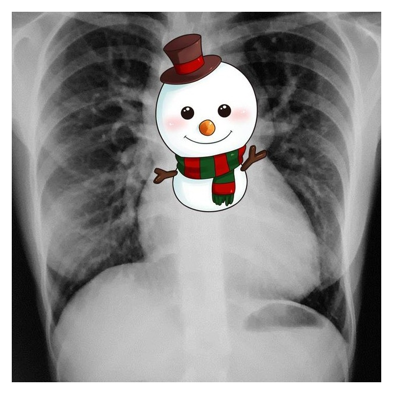
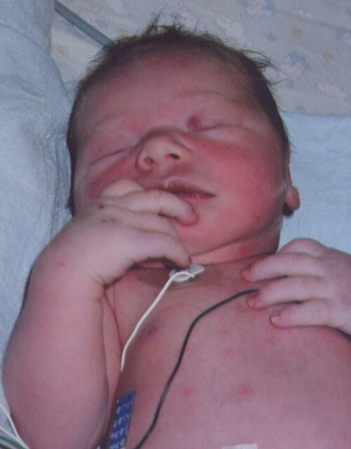
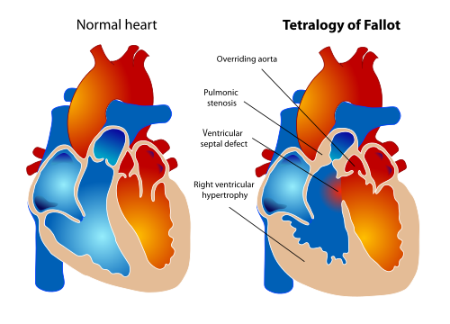
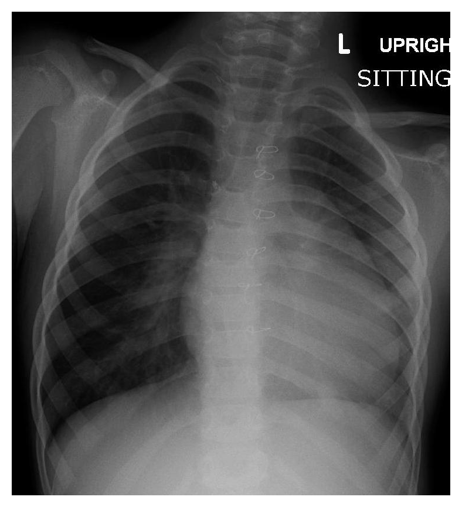
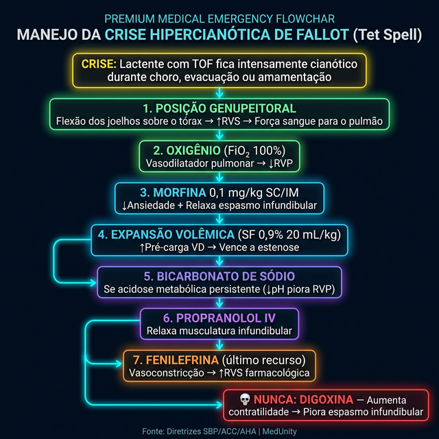
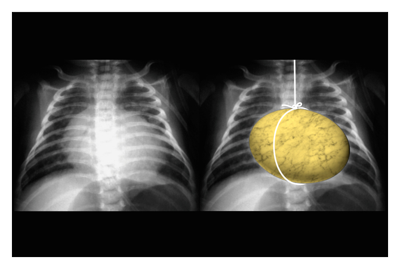

# CARDIOPATIAS CONGÊNITAS CIANÓTICAS

Para entender as cardiopatias cianóticas, você precisa primeiro esquecer a decoreba de nomes e focar em um conceito fundamental: o caminho do sangue. Nas cardiopatias acianóticas, o sangue sobra no pulmão (shunt esquerda-direita). Já nas cianóticas, o problema é que o sangue pobre em oxigênio consegue "pular" a etapa do pulmão e ir direto para o corpo. Isso é o que chamamos de shunt direita-esquerda.

A cianose clínica só aparece quando temos pelo menos 5 g/dL de hemoglobina reduzida (desoxigenada) no sangue capilar. Isso explica por que um bebê gravemente anêmico pode estar hipoxêmico, mas não parecer cianótico, enquanto um bebê policitêmico parece azulado com facilidade. Guarde isso: a cianose depende da quantidade absoluta de hemoglobina desoxigenada, não apenas da saturação percentual.

## A Fisiopatologia do Shunt Direita-Esquerda

Por que o sangue decide ir da direita para a esquerda? Na vida fetal, a resistência vascular pulmonar (RVP) é altíssima e a resistência vascular sistêmica (RVS) é baixa (por causa da placenta). Ao nascer, isso inverte. O pulmão expande, a RVP despenca e a RVS sobe.

Nas cardiopatias cianóticas, existe algum obstáculo ou erro de conexão que impede o sangue de seguir o fluxo normal. Se a pressão do lado direito do coração se torna maior que a do lado esquerdo, ou se os vasos estão trocados, o sangue venoso mistura-se ao arterial.

Aqui no MedEvo, sempre reforçamos que o raciocínio clínico deve ser dividido pelo fluxo pulmonar. Se você olhar para o Raio-X de um bebê azul e vir um pulmão "preto" (hipotrama), o sangue não está chegando lá. Se vir um pulmão "branco" (hipertrama), o sangue está chegando demais, mas está misturado. Essa distinção é o que as bancas mais cobram para diferenciar Tetralogia de Fallot de Transposição de Grandes Artérias.

## Classificação Prática para Provas

Não tente decorar todas de uma vez. Divida-as em dois grandes grupos baseados na vascularização pulmonar ao Raio-X.

### Grupo 1: Cianóticas com Hipofluxo Pulmonar (Pulmão "Preto")

Neste grupo, existe uma obstrução à saída de sangue para o pulmão. O sangue, impedido de seguir para a artéria pulmonar, é desviado para o lado esquerdo através de uma comunicação (CIV ou CIA).

- Tetralogia de Fallot (a mais comum após o período neonatal).

- Atresia Tricúspide.

- Atresia Pulmonar.

- Anomalia de Ebstein grave.

### Grupo 2: Cianóticas com Hiperfluxo Pulmonar (Pulmão "Branco")

Aqui, o problema não é a falta de sangue no pulmão, mas sim a mistura total ou a inversão dos vasos.

- Transposição das Grandes Artérias (TGA) (a mais comum no recém-nascido).

- Drenagem Anômala Total de Veias Pulmonares (DATVP).

- Truncus Arteriosus.

- Síndrome do Coração Esquerdo Hipoplásico (SCEH).

| Cardiopatia | Fluxo Pulmonar | Achado Radiológico Típico |
| --- | --- | --- |
| Tetralogia de Fallot | Diminuído (Hipofluxo) | Coração em "tamanco holandês" ou bota |
| Transposição (TGA) | Aumentado (Hiperfluxo) | Coração em "ovo deitado" |
| DATVP | Aumentado (Hiperfluxo) | Imagem em "boneco de neve" ou "8" |
| Atresia Tricúspide | Diminuído (Hipofluxo) | Coração de tamanho normal, mas com VE dominante |

## O Teste do Coraçãozinho (Oximetria de Pulso)

Este é um tema onipresente em provas de residência. Segundo a Sociedade Brasileira de Pediatria (SBP), o teste deve ser realizado em todo recém-nascido aparentemente saudável com idade gestacional > 34 semanas, entre 24 e 48 horas de vida.

Onde medir? Sempre no membro superior direito (MSD), que representa a saturação pré-ductal, e em um dos membros inferiores (MI), que representa a saturação pós-ductal.

**Critérios de Interpretação:**

- **Teste Negativo (Normal):** Saturação ≥ 95% em ambas as medidas E diferença entre elas < 3%.

- **Teste Positivo:** Saturação < 89% em qualquer medida. Aqui não repete, já vai direto para o Ecocardiograma em até 24h.

- **Teste Duvidoso:** Saturação entre 90% e 94% OU diferença ≥ 3% entre MSD e MI.

- Conduta no duvidoso: Repetir o teste após 1 hora. Se persistir alterado após 3 medidas (com intervalo de 1h entre elas), o teste é considerado positivo e o Ecocardiograma é obrigatório.

Cuidado com a pegadinha: a Coarctação de Aorta é a cardiopatia que mais gera falso-negativo no teste do coraçãozinho, pois se o canal arterial ainda estiver aberto, as pressões e saturações podem se equalizar momentaneamente.

## Tetralogia de Fallot (TOF)

A Tetralogia de Fallot é a "queridinha" das bancas. Você precisa saber os quatro componentes de cor e salteado, mas, mais importante, precisa entender que a gravidade da doença é determinada por apenas UM deles: o grau de estenose pulmonar.

**Os 4 componentes:**

- **Estenose Pulmonar (Infundibular):** É a obstrução da via de saída do ventrículo direito.

- **Comunicação Interventricular (CIV):** Geralmente grande e não restritiva.

- **Dextroposição da Aorta (Cavalgamento):** A aorta "senta" em cima do septo, recebendo sangue de ambos os ventrículos.

- **Hipertrofia do Ventrículo Direito (HVD):** Consequência da pressão alta que o VD precisa fazer contra a estenose.

### Quadro Clínico e Exame Físico

O bebê com Fallot nem sempre é azul ao nascer (o chamado "Fallot Acianótico"). A cianose costuma ser progressiva, surgindo conforme a estenose infundibular piora ou quando o canal arterial fecha.

No exame físico, o sopro que você ouve NÃO é da CIV. A CIV no Fallot é tão grande que não faz barulho (não há turbulência). O sopro que você ouve é da **Estenose Pulmonar** (sistólico de ejeção em borda esternal esquerda média/alta).

Dica de ouro: Se o bebê entrar em crise cianótica, o sopro DIMINUI ou desaparece. Por quê? Porque na crise, o sangue para de ir para o pulmão e vai todo para a aorta. Sem sangue passando pela estenose pulmonar, não há sopro.

### A Crise Hipercianótica (Tet Spell)

Este é o cenário clássico: um lactente com Fallot está chorando, evacuando ou amamentando e, de repente, fica intensamente cianótico, taquipneico e irritado.

O que aconteceu? Houve um espasmo do infundíbulo pulmonar ou uma queda da resistência vascular sistêmica (RVS). Isso faz com que quase todo o sangue venoso seja "empurrado" pela CIV para a aorta.

**Manejo da Crise (Siga esta ordem):**

- **Posição Joelho-Tórax (Genupeitoral):** Em crianças maiores, elas fazem isso sozinhas (posição de cócoras). Isso dobra as artérias femorais, aumentando subitamente a RVS. Com a pressão maior na aorta, o sangue é "forçado" a voltar para o pulmão.

- **Oxigênio:** Embora ajude pouco na saturação (o problema é mecânico), o O2 é um potente vasodilatador pulmonar (reduz RVP).

- **Morfina (0,1 mg/kg SC ou IM):** Reduz a ansiedade e, crucialmente, relaxa o espasmo do infundíbulo pulmonar.

- **Expansão Volêmica (SF 0,9% 20 ml/kg):** Aumenta o pré-load do VD e ajuda a vencer a resistência da estenose.

- **Bicarbonato de Sódio:** Se a crise for prolongada, para tratar a acidose metabólica (que piora a RVP).

- **Betabloqueadores (Propranolol):** Usados para relaxar a musculatura infundibular.

- **Vasoconstritores (Fenilefrina):** Se nada funcionar, para aumentar a RVS de forma farmacológica.

**O que NUNCA fazer na crise de Fallot?** Digoxina. A digoxina aumenta a contratilidade do coração e pode piorar o espasmo infundibular, agravando a obstrução.

## Transposição das Grandes Artérias (TGA)

Se o Fallot é a cianótica mais comum da infância, a TGA é a cianótica mais comum no **período neonatal** (primeiros dias de vida).

Na TGA, a aorta nasce do ventrículo direito e a artéria pulmonar nasce do ventrículo esquerdo. Temos duas circulações em paralelo, o que é incompatível com a vida, a menos que existam comunicações (shunts) que permitam a mistura do sangue.

### O Bebê "Confortavelmente Azul"

Imagine um recém-nascido de termo, filho de mãe diabética (fator de risco importante), que está muito cianótico, mas não apresenta desconforto respiratório importante (sem tiragens, sem batimento de asa de nariz). Os pulsos são normais e, frequentemente, **não há sopros**. Esse é o quadro clássico da TGA com septo interventricular íntegro.

Se o canal arterial (PCA) ou o forame oval fecham, esse bebê morre rapidamente. Por isso, a conduta imediata diante da suspeita é manter a patência do canal arterial.

### Manejo e Tratamento

- **Prostaglandina E1 (Alprostadil):** Dose de 0,01 a 0,1 mcg/kg/min EV contínuo. É uma medicação de resgate para manter o canal arterial aberto. Cuidado: o principal efeito colateral é a apneia, então esteja pronto para intubar.

- **Atriosseptostomia por Balão (Procedimento de Rashkind):** Se a mistura de sangue ainda for insuficiente mesmo com a prostaglandina, o cardiologista entra com um cateter e "rasga" o septo interatrial para criar uma CIA grande.

- **Cirurgia de Jatene (Inversão Arterial):** É a correção definitiva, idealmente realizada nas primeiras 2 semanas de vida, enquanto o ventrículo esquerdo ainda aguenta a pressão sistêmica.

## Atresia Tricúspide

Aqui, a valva tricúspide simplesmente não existe. O sangue que chega no átrio direito não tem como ir para o ventrículo direito. Ele é obrigado a passar por uma CIA para o átrio esquerdo.

**A grande dica de prova:** O eletrocardiograma (ECG).
Em quase todas as cardiopatias cianóticas, o ventrículo direito está sobrecarregado, então o eixo do QRS está desviado para a direita. Na Atresia Tricúspide, como o VD é hipoplásico e o VE faz todo o trabalho, o ECG mostra **Desvio do Eixo para a Esquerda** e Hipertrofia Ventricular Esquerda.

Viu um RN cianótico com eixo para a esquerda no ECG? Marque Atresia Tricúspide sem medo.

## Síndrome do Coração Esquerdo Hipoplásico (SCEH)

Esta é a forma mais grave de cardiopatia congênita. O lado esquerdo do coração (valva mitral, ventrículo esquerdo, valva aórtica e aorta ascendente) é subdesenvolvido.

O bebê nasce bem, pois o canal arterial supre a circulação sistêmica. No entanto, entre o 2º e o 5º dia de vida, quando o canal começa a fechar, o bebê entra em **choque cardiogênico** súbito: pulsos finos, má perfusão, palidez e acidose grave.

Muitos alunos confundem esse choque com sepse neonatal. A dica é: se o bebê estava bem e "chocou" subitamente após 24-48h de vida, pense em cardiopatia ducto-dependente de canal. O tratamento inicial é Prostaglandina E1 para reabrir o canal e estabilizar o paciente para a cirurgia (estágios de Norwood, Glenn e Fontan).

## Diagnóstico Diferencial da Cianose Neonatal

Nem toda cianose no RN é cardíaca. Pode ser pulmonar (angústia respiratória, pneumonia) ou até metabólica. Como diferenciar?

### O Teste da Hiperóxia

Oferecemos oxigênio a 100% por cerca de 10 minutos e medimos a PaO2 (gasometria arterial).

- **Causa Pulmonar:** A PaO2 costuma subir significativamente (geralmente > 150-200 mmHg). O oxigênio consegue vencer a barreira da membrana alveolar doente.

- **Causa Cardíaca (Cianótica):** A PaO2 sobe muito pouco, raramente ultrapassando 100 mmHg. Isso ocorre porque o problema é o "desvio" (shunt) do sangue, que nem passa pelo alvéolo para ser oxigenado.

## Complicações a Longo Prazo

Crianças com cardiopatias cianóticas crônicas desenvolvem mecanismos compensatórios e complicações específicas que você deve conhecer:

- **Policitemia Eritrocitária:** O corpo produz mais hemoglobina para tentar carregar mais oxigênio. Isso aumenta a viscosidade sanguínea.

- **Baqueteamento Digital (Dedos em Baqueta de Tambor):** Hipóxia crônica levando à proliferação de tecido conjuntivo nas falanges distais.

- **Abscesso Cerebral:** O shunt direita-esquerda permite que bactérias "pulem" o filtro pulmonar (onde seriam fagocitadas) e cheguem diretamente à circulação cerebral.

- **Acidente Vascular Cerebral (AVC):** Pode ocorrer tanto pela hiperviscosidade (policitemia) quanto por microembolias paradoxais.

- **Endocardite Infecciosa:** Cardiopatias cianóticas são de alto risco. A profilaxia com Amoxicilina (50 mg/kg) 1 hora antes de procedimentos dentários que envolvam manipulação de tecido gengival é mandatória.

## Resumo de Condutas Farmacológicas

Como o Dr. Will sempre diz nas aulas práticas, em cardiologia pediátrica, a dose é tão importante quanto o diagnóstico.

| Droga | Indicação Principal | Dose/Observação |
| --- | --- | --- |
| **Alprostadil (PGE1)** | Manter canal arterial aberto (TGA, SCEH, Atresia Pulmonar) | 0,01 a 0,1 mcg/kg/min EV. Risco de apneia. |
| **Morfina** | Crise hipercianótica de Fallot | 0,1 mg/kg SC, IM ou EV. |
| **Propranolol** | Prevenção de crises de Fallot | 1 a 4 mg/kg/dia VO. |
| **Furosemida** | Sinais de congestão (Hiperfluxo) | 1 mg/kg/dose EV ou VO. |
| **Amoxicilina** | Profilaxia de Endocardite | 50 mg/kg VO (máx 2g) 1h antes do procedimento. |

## Pontos-Chave para Prova

- **Tetralogia de Fallot:** É a cianótica mais comum após o período neonatal. O sopro é de estenose pulmonar e desaparece na crise. O RX mostra o coração em bota.

- **Transposição de Grandes Artérias:** É a cianótica mais comum no RN. O RX mostra o coração em "ovo deitado". É uma emergência ducto-dependente.

- **Atresia Tricúspide:** A única cianótica clássica que cursa com desvio do eixo para a ESQUERDA no ECG.

- **Teste do Coraçãozinho:** Positivo se Sat < 89% ou se Sat 90-94% (ou diferença > 3%) que persiste após 1h de reteste. Realizar entre 24-48h de vida.

- **Crise de Fallot:** Posição joelho-tórax e morfina são as primeiras medidas. Digoxina é contraindicação absoluta na crise.

- **Profilaxia de Endocardite:** Indicada para todas as cardiopatias cianóticas não corrigidas ou com shunts residuais em procedimentos dentários.

- **Teste da Hiperóxia:** Se a PaO2 não subir acima de 100 mmHg após O2 a 100%, a causa da cianose é provavelmente cardíaca.

- **Prostaglandina E1:** Droga de escolha para manter o canal arterial aberto em cardiopatias críticas. O principal efeito colateral é a apneia.

- **Síndrome de Eisenmenger:** É a inversão do shunt (de E-D para D-E) devido à hipertensão pulmonar fixa. O paciente torna-se cianótico tardiamente.

- **Drenagem Anômala Total de Veias Pulmonares:** O achado clássico no RX é o sinal do "boneco de neve".

- **Cuidado com a Anemia:** Um paciente cianótico com hemoglobina baixa é muito mais grave do que parece, pois tem menos capacidade de transporte de O2.

- **Falso Negativo no Teste do Coraçãozinho:** A Coarctação de Aorta é a causa mais comum, pois o fluxo pelo canal arterial pode mascarar a diferença de saturação. 🩺

 Cópia offline para consulta pessoal.
 Fonte original:
 [https://www.medevo.com.br/material-apoio/ler/8bfc23b1-86c1-4c55-9fb7-9318f7fb674a](https://www.medevo.com.br/material-apoio/ler/8bfc23b1-86c1-4c55-9fb7-9318f7fb674a)
