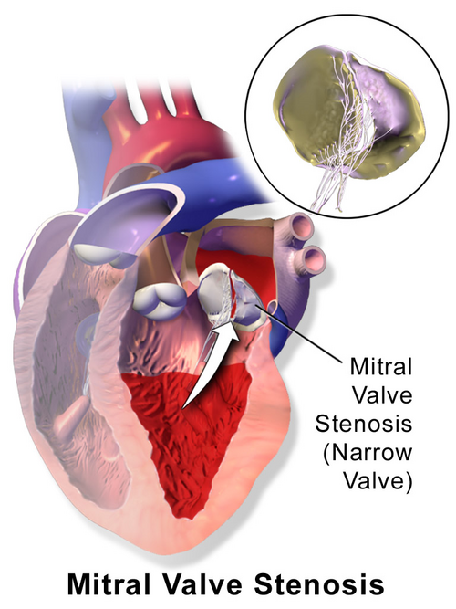
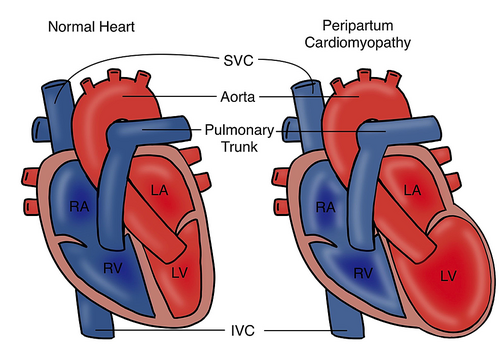

# CARDIOPATIAS NA GESTAÇÃO

Para entender as cardiopatias na gestação, você precisa primeiro esquecer a ideia de que a gravidez é apenas um estado fisiológico de "espera". Na verdade, a gestação é o maior teste de esforço natural que o coração de uma mulher pode enfrentar. Se o coração tem uma reserva limitada, é aqui que a máscara cai.

As cardiopatias são a principal causa não obstétrica de morte materna no Brasil. Isso cai muito em prova porque reflete a transição epidemiológica: nossas gestantes estão engravidando mais tarde, muitas vezes já com hipertensão, obesidade ou cicatrizes de febre reumática da infância.

## As Adaptações Cardiovasculares: O Porquê dos Sintomas

Por que uma gestante saudável sente falta de ar e palpitação? Se você não entender isso, vai diagnosticar insuficiência cardíaca em toda grávida que entrar no seu consultório.

A partir da 5ª ou 6ª semana, ocorre uma vasodilatação sistêmica mediada por progesterona, óxido nítrico e relaxina. O corpo entende que a resistência vascular sistêmica (RVS) caiu e ativa o sistema renina-angiotensina-aldosterona. O resultado? Uma retenção hídrica brutal. O volume plasmático aumenta em até 50%.

Para dar conta desse volume, o débito cardíaco (DC) sobe de 30% a 50%. Como o DC é o produto da frequência cardíaca (FC) pelo volume sistólico (VS), ambos aumentam. A FC sobe cerca de 10 a 15 batimentos por minuto.

### O Exame Físico "Falsamente" Patológico

Devido a esse estado hiperdinâmico, alguns achados que seriam anormais em você ou em mim são normais na gestante:

- **Sopro sistólico funcional (ejetivo):** Presente em mais de 90% das gestantes. É o sangue "correndo rápido" demais.

- **Hiperfonese de B1 e desdobramento de B2:** Pelo fechamento vigoroso das valvas.

- **Presença de B3:** Pelo enchimento ventricular rápido.

- **Edema de membros inferiores:** Pela compressão da veia cava pelo útero e queda da pressão oncótica.

**Dica de Prova:** Se a questão descrever um **sopro diastólico**, isso NUNCA é fisiológico. Sopro diastólico na gestante é sinônimo de patologia valvar até que se prove o contrário. Outro sinal de alerta é a dispneia paroxística noturna ou a tosse seca noturna, que não fazem parte da fisiologia normal.

*Figura 1 - Estenose mitral: cardiopatia reumática que é a principal causa de descompensação cardíaca durante a gestação. Fonte: Blausen Medical, CC BY 3.0 | Wikimedia Commons*

## Estratificação de Risco: A Classificação da OMS

Este é o tópico mais cobrado. A banca quer saber se você sabe quem pode engravidar e quem deve ser aconselhada a evitar ou até interromper a gestação. A Sociedade Brasileira de Cardiologia (SBC) adota a Classificação de Risco Materno da OMS modificada.

| Categoria OMS | Risco de Complicações | Conduta Sugerida | Exemplos Clínicos |
| --- | --- | --- | --- |
| **I** | Sem risco detectável | Pré-natal habitual | Pequeno prolapso de valva mitral, comunicação interatrial (CIA) pequena. |
| **II** | Risco levemente aumentado | Consultas trimestrais com cardiologista | CIA ou CIV corrigidas, arritmias leves. |
| **III** | Risco significativamente aumentado | Pré-natal de alto risco (mensal) | Prótese valvar mecânica, ventrículo único, estenose mitral moderada. |
| **IV** | Risco extremamente alto (Mortalidade elevada) | **Contraindicação absoluta à gestação** | Síndrome de Eisenmenger, Hipertensão Pulmonar grave, FEVE < 30%. |

**Atenção ao Dr. Will:** Na Classe IV, se a paciente já estiver grávida, a legislação brasileira permite a discussão sobre a interrupção terapêutica da gestação (aborto legal por risco de vida materno), especialmente em casos como a Síndrome de Eisenmenger, onde a mortalidade materna chega a 50%.

### A Temida Síndrome de Eisenmenger

Por que ela é tão perigosa? Imagine um shunt esquerda-direita (como uma CIV) que, por anos de hiperfluxo, causou hipertensão pulmonar. Agora o shunt inverteu (direita-esquerda). Na gestação, a RVS cai drasticamente. Isso faz com que o sangue "fuja" ainda mais para o lado direito e pulmões, ou pior, aumente o shunt direita-esquerda, levando a uma cianose refratária e colapso circulatório. É uma bomba relógio.

## Valvopatias: A Estenose Mitral é a Rainha das Questões

No Brasil, a febre reumática ainda é a grande vilã. E a estenose mitral (EM) é a valvopatia que mais descompensa na gravidez.

**O Porquê da Descompensação:**
Na EM, o sangue tem dificuldade de passar do átrio esquerdo (AE) para o ventrículo esquerdo (VE). A gestante tem dois problemas: aumento da volemia (mais sangue tentando passar) e aumento da frequência cardíaca. Como o enchimento ventricular ocorre na diástole, e a taquicardia encurta a diástole, o sangue "represa" no átrio esquerdo e volta para o pulmão.

- **Resultado:** Edema Agudo de Pulmão (EAP).

- **Gatilho clássico:** Fibrilação Atrial (FA). O átrio dilatado da EM somado ao estresse da gravidez gera FA. Sem a contração atrial, o enchimento do VE despenca e o pulmão encharca.

**Manejo da Estenose Mitral Grave:**
Se a paciente está sintomática apesar do repouso e betabloqueadores (o propranolol ou metoprolol são nossos amigos aqui para reduzir a FC), e a área valvar é < 1,0 cm², a intervenção de escolha é a **Valvoplastia Mitral por Balão Percutâneo**. Ela é preferível à cirurgia de peito aberto porque evita a circulação extracorpórea, que tem alta mortalidade fetal (cerca de 30%).

## Anticoagulação: O Dilema das Próteses Metálicas

Aqui está o maior "nó" na cabeça do aluno. Próteses biológicas não precisam de anticoagulação (ótimo para a gestante), mas duram pouco. Próteses metálicas duram muito, mas exigem Varfarina.

**O problema da Varfarina:** Ela atravessa a placenta. Se usada entre a 6ª e 12ª semana, causa a **Embriopatia Varfarínica** (hipoplasia nasal, pontilhado epifisário). Além disso, causa hemorragia intracraniana fetal no momento do parto.
**O problema da Heparina (HBPM ou HNF):** Ela não atravessa a placenta (segura para o feto), mas é menos eficaz para prevenir trombose de valva metálica na mãe.

**Protocolo Recomendado (SBC):**

- **1º Trimestre:** Se a dose de Varfarina for baixa (≤ 5mg/dia), alguns protocolos aceitam manter. Mas a recomendação mais segura para o feto é trocar por Heparina de Baixo Peso Molecular (HBPM) em doses terapêuticas (ajustadas pelo fator anti-Xa) entre a 6ª e 12ª semana.

- **2º e 3º Trimestre (até 36 semanas):** Varfarina é a droga mais segura para a mãe.

- **Após 36 semanas:** Troca-se Varfarina por Heparina novamente. Por que? Porque se o trabalho de parto começar com a paciente anticoagulada com Varfarina, o feto (que também está anticoagulado) terá hemorragias graves durante a passagem pelo canal de parto. A Heparina tem meia-vida curta e pode ser revertida ou suspensa rapidamente.

*Figura 2 - Cardiomiopatia periparto: representação das alterações cardíacas com dilatação ventricular e redução da fração de ejeção. Fonte: Muhammad Sanusi, CC0 | Wikimedia Commons*

## Insuficiência Cardíaca e Cardiomiopatia Periparto

A insuficiência cardíaca (IC) pode surgir por descompensação de uma doença prévia ou ser uma entidade nova.

### Cardiomiopatia Periparto (CMPP)

É um diagnóstico de exclusão. Os critérios são:

- Desenvolvimento de IC no último mês de gestação ou nos primeiros 5 meses de pós-parto.

- Ausência de outra causa identificável de IC.

- Ausência de doença cardíaca prévia.

- Fração de ejeção do ventrículo esquerdo (FEVE) geralmente < 45%.

**Dica de Ouro:** Se a paciente teve CMPP e a função ventricular não recuperou (FEVE permanece baixa), uma nova gravidez é **contraindicada**. O risco de morte na próxima gestação é altíssimo. Se a função recuperou, o risco ainda existe, mas é menor.

### Tratamento Farmacológico da IC na Gestante

Cuidado com as drogas proibidas!

- **IECA e BRA:** Contraindicação absoluta. Causam disfunção renal fetal, oligodrâmnio e malformações cranianas. Se a paciente usa para hipertensão ou IC, troque imediatamente por Metildopa, Hidralazina ou Nifedipina.

- **Espironolactona:** Evitar (efeito antiandrogênico no feto masculino).

- **Diuréticos (Furosemida):** Usar com cautela. Podem reduzir a perfusão placentária. Use apenas se houver congestão pulmonar clara.

## O Momento do Parto: Onde o MedEvo se destaca

Muitos alunos acham que toda cardiopata deve fazer Cesariana. **Erro clássico!**
Para a maioria das cardiopatas, o **parto vaginal** é preferível. Ele tem menor perda sanguínea, menor risco de infecção e menor risco de tromboembolismo.

**As Exceções (Indicações de Cesárea Cardiovascular):**

- Aorta dilatada (> 45mm na Síndrome de Marfan).

- Hipertensão pulmonar grave/Eisenmenger (embora o risco seja alto em ambos, a estabilidade hemodinâmica da cesárea programada pode ser preferida em alguns centros).

- Insuficiência cardíaca descompensada aguda.

- Paciente anticoagulada com Varfarina (risco de hemorragia fetal no parto vaginal).

**Manejo no Trabalho de Parto:**

- **Analgesia precoce:** A dor aumenta a descarga adrenérgica, que aumenta a FC e o DC. Queremos essa paciente calma e sem dor.

- **Posição:** Decúbito lateral esquerdo para evitar compressão da veia cava.

- **Fórceps de alívio (ou vácuo-extração):** Indicado para abreviar o segundo estágio (expulsivo). Não queremos a gestante fazendo a manobra de Valsalva (fazer força), pois isso altera bruscamente o retorno venoso e pode descompensar o coração.

**O Puerpério Imediato: O Perigo Oculto**
O momento de maior risco de EAP é logo após a saída da placenta. Por que?

- O útero contrai e "devolve" cerca de 500ml de sangue para a circulação sistêmica (autotransfusão).

- A compressão da veia cava acaba, aumentando subitamente o retorno venoso.
Se a paciente tem estenose mitral, é aqui que ela faz o edema agudo. Monitore de perto nas primeiras 24-48 horas.

## Profilaxia de Endocardite Infecciosa

As diretrizes mudaram nos últimos anos, mas para as provas de residência, o conceito ainda é forte.
A FEBRASGO e a SBC recomendam a profilaxia de endocardite no parto (especialmente vaginal) para pacientes de **alto risco**:

- Portadoras de próteses valvares (mecânicas ou biológicas).

- História prévia de endocardite infecciosa.

- Cardiopatias congênitas cianóticas não corrigidas.

O esquema clássico é Ampicilina 2g + Gentamicina 1,5mg/kg na hora do procedimento (ou início do trabalho de parto).

## Emergência: Parada Cardiorrespiratória (PCR) na Gestante

Se uma gestante para na sua frente, o protocolo muda. O útero gravídico (acima de 20 semanas ou na altura do umbigo) comprime a veia cava inferior, reduzindo o retorno venoso e tornando a massagem cardíaca ineficaz.

- **Desvio Uterino para a Esquerda:** Alguém deve deslocar o útero manualmente para a esquerda durante toda a ressuscitação. Não se inclina mais a prancha em 30 graus como antigamente, pois isso prejudica a qualidade da massagem. O desvio é manual.

- **Cesariana Perimortem (Histerotomia de Emergência):** Se após **4 a 5 minutos** de RCP de qualidade a circulação espontânea não retornou, você deve realizar a cesariana ali mesmo, onde a paciente estiver.

- **Objetivo:** Não é apenas salvar o feto, é salvar a MÃE. Ao esvaziar o útero, você descomprime a cava e aumenta as chances de a RCP funcionar.

## Infarto Agudo do Miocárdio (IAM) na Gestação

O IAM na gestação é raro, mas letal. A causa mais comum não é a placa de gordura (aterosclerose), mas sim a **Dissecção Espontânea da Artéria Coronária (SCAD)**.
O manejo clínico é semelhante ao da não gestante (Aspirina, Nitrato, Betabloqueador), mas a angioplastia deve ser considerada se houver instabilidade. Lembre-se: o que é bom para a mãe (oxigenação e estabilidade) é bom para o feto.

## Contracepção na Cardiopata

Não adianta tratar a paciente e deixá-la engravidar de novo sem planejamento.

- **OMS Classe III e IV:** Devem usar métodos de alta eficácia (LARC - Long-Acting Reversible Contraception).

- **DIU de Cobre ou Mirena:** Excelentes opções. Cuidado apenas com a inserção do DIU em pacientes com alto risco de endocardite (embora a recomendação de profilaxia para inserção de DIU seja controversa, muitos especialistas fazem).

- **Evitar Estrogênio:** Em pacientes com risco trombogênico (próteses, IC, hipertensão pulmonar), o estrogênio é contraindicado. Use métodos apenas com progesterona ou DIU.

## Tabelas Comparativas para Revisão Rápida

### Diagnóstico Diferencial: Fisiológico vs. Patológico

| Achado | Provavelmente Fisiológico | Sugestivo de Cardiopatia |
| --- | --- | --- |
| **Dispneia** | Leve, melhora com repouso | Paroxística noturna, ortopneia, progressiva |
| **Sopro** | Sistólico, suave (grau I/II) | Diastólico, Sistólico > III/IV, Irradiado |
| **Edema** | Maleolar, melhora ao acordar | Generalizado (anasarca), associado a estertores |
| **Ritmo** | Taquicardia sinusal leve | Fibrilação Atrial, extrassístoles frequentes |

### Drogas na Gestação e Lactação

| Droga | Uso na Gestação | Uso na Amamentação |
| --- | --- | --- |
| **Metildopa** | Primeira escolha (Hipertensão) | Seguro |
| **Hidralazina** | Seguro (IC e Crises) | Seguro |
| **IECA / BRA** | **PROIBIDO** (Teratogênico) | Enalapril/Captopril são seguros |
| **Varfarina** | Risco fetal (1º tri e parto) | Seguro (não passa no leite) |
| **Estatina** | Contraindicado | Contraindicado |
| **Aspirina (baixa dose)** | Seguro | Seguro |

## Pontos-Chave para Prova 💡

- **Principal causa de morte indireta:** Cardiopatia (especialmente a reumática no Brasil).

- **Alteração fisiológica clássica:** Aumento do débito cardíaco e queda da resistência vascular sistêmica.

- **Sopro diastólico:** Sempre patológico. Solicite Ecocardiograma.

- **OMS Classe IV:** Contraindicação absoluta à gestação (Ex: Eisenmenger, Hipertensão Pulmonar, FEVE < 30%, Marfan com aorta > 45mm).

- **Estenose Mitral:** Valvopatia que mais descompensa. O risco é o Edema Agudo de Pulmão no parto e puerpério imediato.

- **Fibrilação Atrial:** Principal gatilho para descompensação na estenose mitral.

- **Anticoagulação em Prótese Metálica:** Varfarina no 2º e 3º trimestres (até 36 sem); Heparina no 1º trimestre (6-12 sem) e após 36 semanas.

- **Via de Parto:** Vaginal com analgesia e fórceps de alívio é a regra. Cesárea apenas por indicação obstétrica ou aorta dilatada.

- **IECA e BRA:** Nunca usar na gestação. Risco de oligodrâmnio e morte fetal.

- **Cardiomiopatia Periparto:** IC sem causa prévia no final da gravidez ou até 5 meses pós-parto. Se a FEVE não recuperar, proibir nova gravidez.

- **PCR na Gestante:** Desvio manual do útero para a esquerda. Se não voltar em 4-5 min, Cesariana Perimortem.

- **Profilaxia de Endocardite:** Indicada no parto para pacientes de alto risco (próteses, endocardite prévia, congênitas cianóticas).

- **AINEs:** Evitar, especialmente no 3º trimestre, pelo risco de fechamento precoce do ducto arterioso e oligodrâmnio.

Este material cobre o núcleo duro das questões de residência. Lembre-se: na prova, a banca vai tentar te forçar a indicar Cesárea para toda cardiopata ou vai colocar uma paciente com estenose mitral "encharcando" o pulmão logo após o parto. Agora você já sabe o porquê de cada coisa.

 Cópia offline para consulta pessoal.
 Fonte original:
 [https://www.medevo.com.br/material-apoio/ler/8035bdfd-fac2-4867-aafd-d0dbeb0e0068](https://www.medevo.com.br/material-apoio/ler/8035bdfd-fac2-4867-aafd-d0dbeb0e0068)
