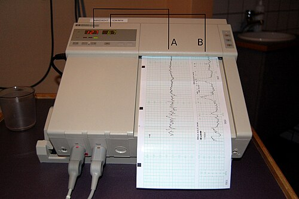
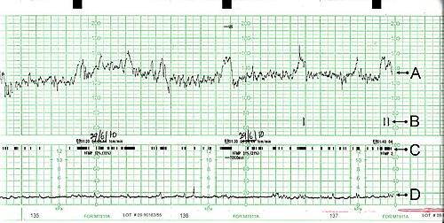

# CARDIOTOCOGRAFIA E INTERPRETAÇÃO

A cardiotocografia (CTG) é, essencialmente, uma janela para o Sistema Nervoso Central (SNC) do feto. Quando estudamos esse tema para a residência, o maior erro é tentar decorar padrões sem entender a fisiologia por trás deles. Como professor, vejo alunos perdendo questões porque decoram que "DIP II é ruim", mas não entendem que ele é o reflexo de uma reserva placentária exaurida.

O objetivo da CTG é avaliar a oxigenação fetal de forma indireta. O coração do feto não bate de forma isolada; ele responde a estímulos do Sistema Nervoso Autônomo (SNA). Se o tronco cerebral está bem oxigenado, os sistemas simpático e parassimpático "brigam" milissegundo a milissegundo, gerando a variabilidade. Se a oxigenação cai, essa briga para, e o traçado fica liso. É essa lógica que deve guiar sua interpretação.

## Fisiologia e Controle da Frequência Cardíaca Fetal

Para entender a CTG, você precisa lembrar que o feto vive em um ambiente de relativa hipoxemia em comparação ao adulto, mas ele é adaptado a isso. O controle da Frequência Cardíaca Fetal (FCF) depende de:

- **Sistema Nervoso Simpático (SNS):** Atua como o acelerador. Ele amadurece mais cedo na gestação, o que explica por que fetos muito prematuros tendem a ter uma FCF basal mais alta.

- **Sistema Nervoso Parassimpático (SNP):** Atua como o freio, via nervo vago. Ele amadurece mais tardiamente. É o SNP o principal responsável pela variabilidade e pelas desacelerações rápidas.

- **Barorreceptores e Quimiorreceptores:** Localizados no arco aórtico e seios carotídeos. Eles detectam mudanças na pressão arterial e nos níveis de O2/CO2, enviando sinais para o tronco cerebral ajustar a FCF.

Quando ocorre uma contração uterina, o fluxo sanguíneo para o espaço interviloso é temporariamente interrompido. Um feto saudável, com boa reserva, tolera isso sem problemas. Um feto com reserva limítrofe ativará quimiorreceptores, gerando as temidas desacelerações.

*Figura 1 - Esquema da cardiotocografia: o transdutor de ultrassom (A) capta os batimentos cardíacos fetais e o tocodinamômetro (B) registra as contrações uterinas em papel contínuo. Fonte: Steven Fruitsmaak, CC BY 3.0 | Wikimedia Commons*

## Técnica e Preparo para o Exame

A CTG pode ser realizada de forma anteparto (avaliação de vitalidade em gestações de alto risco) ou intraparto (vigilância do trabalho de parto).

A posição da gestante é fundamental. Nunca deixe uma paciente em decúbito dorsal horizontal para fazer CTG. O útero gravídico comprime a veia cava inferior, reduzindo o retorno venoso e o débito cardíaco materno, o que leva à hipotensão supina e, consequentemente, a uma queda artificial da perfusão placentária. O correto é a posição de semi-Fowler ou decúbito lateral esquerdo.

O tempo padrão de registro é de 20 minutos. Se o traçado não for reativo nesse período, não se apresse em diagnosticar sofrimento fetal. O feto tem ciclos de sono que duram de 20 a 40 minutos. Nesses casos, prolongamos o exame por mais 20 minutos ou utilizamos a estimulação vibroacústica para "acordar" o feto.

## Parâmetros de Análise da Cardiotocografia

Para interpretar qualquer traçado, você deve seguir uma ordem sistemática. Pular etapas é o caminho mais curto para o erro.

### Frequência Cardíaca Fetal Basal

É a média da FCF em um período de 10 minutos, excluindo acelerações e desacelerações.

- **Normal:** 110 a 160 bpm.

- **Bradicardia:** < 110 bpm por mais de 10 minutos.

- **Taquicardia:** > 160 bpm por mais de 10 minutos.

**Dica de Prova:** A taquicardia fetal isolada costuma ser sinal de febre materna (corioamnionite), uso de medicações (beta-agonistas como a terbutalina) ou prematuridade extrema. Já a bradicardia mantida e profunda é uma emergência, sugerindo descolamento de placenta ou prolapso de cordão.

### Variabilidade da FCF

Este é o parâmetro mais importante para prever a ausência de acidose metabólica no momento do exame. Ela representa as flutuações na FCF basal, medidas em batimentos por minuto (amplitude).

| Categoria | Amplitude (bpm) | Significado Clínico |
| --- | --- | --- |
| Ausente | Indetectável | Grave. Sugere hipóxia/acidose ou lesão neurológica. |
| Mínima | ≤ 5 bpm | Sono fetal, uso de opioides, sulfato de magnésio ou hipóxia precoce. |
| Moderada | 6 a 25 bpm | **Normal.** Indica SNC oxigenado e íntegro. |
| Acentuada | > 25 bpm | Padrão saltatório. Pode ser resposta a compressões agudas de cordão. |

Cuidado: Muitos alunos confundem variabilidade acentuada com padrão sinusoidal. A variabilidade acentuada é "feia", parece um traçado serrilhado e caótico, mas geralmente é benigna se isolada. O padrão sinusoidal é liso e regular (veremos adiante).

### Acelerações Transitórias

São aumentos abruptos da FCF acima da linha de base.

- **Em gestações ≥ 32 semanas:** Aumento de ≥ 15 bpm por ≥ 15 segundos.

- **Em gestações < 32 semanas:** Aumento de ≥ 10 bpm por ≥ 10 segundos (devido à imaturidade do SNA).

A presença de duas acelerações em 20 minutos define um traçado como **Reativo**. Isso é o que o Dr. Will sempre reforça: a reatividade é um excelente preditor de bem-estar nas próximas 24-48 horas.

*Figura 2 - Traçado de cardiotocografia: A) Frequência cardíaca fetal; B) Indicador de movimentos percebidos pela mãe; C) Movimentos fetais; D) Contrações uterinas. Fonte: PhantomSteve, CC BY-SA 3.0 | Wikimedia Commons*

### Desacelerações (DIPs)

Aqui é onde as bancas de residência concentram 80% das questões. Você precisa diferenciar o mecanismo fisiopatológico de cada uma.

#### Desaceleração Precoce (DIP I ou Cefálico)

É a desaceleração "espelho" da contração. O pico da contração coincide com o nadir (ponto mais baixo) da desaceleração.

- **Causa:** Compressão da cabeça fetal no canal de parto → Estímulo vagal → Bradicardia reflexa.

- **Significado:** Benigno. Não indica hipóxia. Não exige conduta além da observação.

#### Desaceleração Tardia (DIP II)

A desaceleração começa após o início da contração e o seu nadir ocorre **após** o pico da contração. O retorno à linha de base é lento.

- **Causa:** Insuficiência uteroplacentária. Durante a contração, o feto não recebe O2 suficiente, a PO2 cai abaixo de um nível crítico, ativando quimiorreceptores.

- **Significado:** Patológico. Indica baixa reserva fetal e risco de acidose.

#### Desaceleração Variável (DIP III ou Umbilical)

Não tem relação fixa com a contração. Tem início e fim abruptos (queda e subida rápidas), muitas vezes precedida e sucedida por pequenas acelerações (chamadas de "ombros").

- **Causa:** Compressão do cordão umbilical.

- **Significado:** Depende da frequência e da gravidade. Se forem ocasionais, são comuns no trabalho de parto. Se forem recorrentes e perderem os "ombros" (sinal de perda de reserva), tornam-se preocupantes.

### Dinâmica Uterina

A CTG também registra as contrações. O normal é termos até 5 contrações em 10 minutos (média em 30 min).

- **Taquissistolia:** > 5 contrações em 10 minutos.

- **Por que importa?** Se o útero contrai demais, não há tempo para o relaxamento e reoxigenação do espaço interviloso, o que pode levar a DIPs tardios mesmo em placentas previamente normais.

## Classificação dos Traçados (Categorias)

A classificação adotada pela FEBRASGO e pela ACOG divide os traçados em três categorias, o que facilita a tomada de decisão clínica.

| Categoria | Descrição do Traçado | Significado e Conduta |
| --- | --- | --- |
| **I (Normal)** | FCF 110-160, Variabilidade moderada, Sem DIP II ou III, Acelerações presentes ou ausentes. | Prediz fortemente estado ácido-básico normal. Conduta: Expectante. |
| **II (Indeterminado)** | Tudo que não é I nem III. Ex: Taquicardia, variabilidade mínima, DIPs variáveis recorrentes. | Não prediz acidose, mas exige vigilância e reavaliação contínua. |
| **III (Anormal)** | Variabilidade ausente + (DIP II recorrente OU DIP III recorrente OU Bradicardia) OU Padrão Sinusoidal. | Alto risco de acidose fetal e lesão neurológica. Conduta: Resolução imediata. |

**Exemplo Clínico:** Imagine uma gestante em trabalho de parto ativo, 6 cm de dilatação, apresentando traçado Categoria II com DIPs variáveis recorrentes. O que fazer? Primeiro, as manobras de reanimação intrauterina: decúbito lateral esquerdo, hidratação venosa, oxigênio (se houver hipóxia materna) e suspensão da ocitocina. Se o traçado não melhorar e evoluir para Categoria III, a via de parto mais rápida deve ser escolhida.

## Padrões Especiais e Pegadinhas

### Padrão Sinusoidal

É um traçado com oscilações lisas, regulares, em forma de onda de seno, com frequência de 3 a 5 ciclos por minuto e amplitude de 5 a 15 bpm.

- **O que significa?** É um sinal de gravidade extrema. Indica anemia fetal grave (como na isoimunização Rh ou hemorragia feto-materna) ou hipóxia grave com asfixia iminente. É Categoria III automática.

### Padrão Saltatório

Variabilidade muito aumentada (> 25 bpm). Antigamente era visto com muito medo, mas hoje sabemos que, se for um episódio isolado durante o trabalho de parto, geralmente reflete uma resposta compensatória a compressões de cordão. No entanto, se persistente, deve ser visto com cautela.

### O "Falso Reativo" e o Estímulo Sonoro

A CTG anteparto pode ser não reativa simplesmente porque o feto está dormindo. Antes de dizer que o feto está em sofrimento, fazemos a estimulação sonora. Se o feto responder com uma aceleração, o teste torna-se reativo (bem-estar confirmado). Se não responder, ele é classificado como hiporreativo e precisamos de outros exames, como o Perfil Biofísico Fetal (PBF) ou Doppler.

## Cardiotocografia no Sofrimento Fetal Agudo vs. Crônico

É vital diferenciar como a CTG se comporta em cada cenário. No MedEvo, sempre enfatizamos que a prova vai tentar te confundir com esses conceitos.

- **Sofrimento Fetal Agudo (SFA):** Ocorre tipicamente no intraparto. O traçado era normal e, devido a um evento (ex: taquissistolia por ocitocina, DPP, prolapso de cordão), surgem DIPs tardios ou bradicardia. A conduta é rápida.

- **Sofrimento Fetal Crônico:** Ocorre na insuficiência placentária crônica (ex: Pré-eclâmpsia, Restrição de Crescimento Fetal - RCF). Aqui, a CTG pode mostrar variabilidade reduzida e ausência de acelerações por longos períodos. O feto está "poupando" energia. Se surgirem DIPs tardios mesmo com contrações leves (Braxton-Hicks), a reserva acabou.

## Diagnóstico Diferencial de Alterações na CTG

Nem toda bradicardia ou perda de variabilidade é hipóxia. O bom médico (e o aluno que passa na prova) sabe diferenciar:

- **Drogas Maternas:** Opioides (morfina, fentanil) e Sulfato de Magnésio são as causas mais comuns de redução da variabilidade na prática hospitalar. Sempre cheque a prescrição antes de indicar uma cesárea por "variabilidade mínima".

- **Sono Fetal:** A causa mais comum de CTG não reativa. Dura até 40 min.

- **Arritmias Fetais:** Podem causar bradicardia ou taquicardia sustentada que não responde às manobras habituais.

- **Prematuridade:** Fetos < 28 semanas frequentemente têm variabilidade menor e menos acelerações.

## Condutas Baseadas na Cardiotocografia

A diretriz da FEBRASGO orienta que a conduta deve ser individualizada, mas existem regras de ouro:

### Na Categoria I

Manter a conduta de rotina. Se for anteparto, repetir conforme a indicação clínica (ex: semanal em diabéticas, 2x/semana em gestações > 41 semanas). Se for intraparto, manter monitorização (intermitente em baixo risco, contínua em alto risco).

### Na Categoria II

É a "zona cinzenta". Você deve:

- Identificar a causa (Ex: A paciente está hipotensa após a peridural? O útero está em taquissistolia?).

- Realizar reanimação intrauterina.

- Se houver melhora, observar.

- Se houver piora ou persistência de padrões não tranquilizadores, considerar métodos complementares (como o PBF) ou o parto.

### Na Categoria III

Não há tempo a perder.

- Reanimação intrauterina imediata enquanto prepara a sala.

- Se não houver reversão imediata (em minutos), realizar o parto pela via mais rápida. Se o colo estiver todo e o feto baixo, pode ser fórceps. Se estiver no início do trabalho de parto, cesárea.

## Perfil Biofísico Fetal (PBF) e sua relação com a CTG

Muitas questões de prova colocam a CTG dentro do contexto do PBF. O PBF avalia 5 parâmetros:

- Cardiotocografia (Reatividade).

- Movimentos Respiratórios Fetais.

- Movimentos Fetais Globais.

- Tônus Fetal.

- Volume de Líquido Amniótico (ILA ou Maior Bolsão Vertical).

Cada parâmetro vale 2 pontos (se normal) ou 0 (se alterado). O primeiro parâmetro a desaparecer na hipóxia aguda é a reatividade da CTG, seguida pelos movimentos respiratórios. O último a desaparecer é o tônus. Por outro lado, o líquido amniótico reflete a oxigenação crônica (redistribuição de fluxo para o cérebro e menos sangue para os rins → menos urina → oligodrâmnio).

**Dica de Ouro:** Se a CTG é não reativa, mas todos os outros parâmetros do PBF estão normais (8/10), a chance de sofrimento fetal é baixa. Provavelmente era apenas sono fetal.

## Monitorização Fetal Pós-Trauma

Em casos de trauma materno (ex: acidente automobilístico), mesmo que a mãe esteja estável, a CTG é obrigatória por pelo menos 4 a 6 horas em gestações viáveis (> 24 semanas). O descolamento prematuro de placenta (DPP) traumático pode ser oculto, e a CTG com contrações frequentes ou alterações de FCF é o sinal mais precoce de alerta.

## Resumo de Parâmetros e Valores para Memorizar

Para facilitar sua revisão de véspera, aqui estão os números que você não pode esquecer:

| Parâmetro | Valor Normal | Alerta |
| --- | --- | --- |
| FCF Basal | 110 - 160 bpm | < 110 (Bradicardia) / > 160 (Taquicardia) |
| Variabilidade | 6 - 25 bpm | < 5 (Mínima/Ausente) / > 25 (Acentuada) |
| Acelerações (≥32s) | ≥ 2 em 20 min | Ausentes (Não reativo) |
| Dinâmica Uterina | ≤ 5 em 10 min | > 5 (Taquissistolia) |
| DIP I (Precoce) | Coincide com contração | Benigno (Cefálico) |
| DIP II (Tardio) | Após o pico da contração | Patológico (Uteroplacentário) |
| DIP III (Variável) | Abrupto, sem relação fixa | Compressão de cordão |

## Pontos-Chave para Prova

- **Variabilidade Moderada:** É o sinal mais confiável de que o feto não está em acidose metabólica no momento do exame.

- **DIP II (Tardio):** Indica insuficiência uteroplacentária. A conduta inicial é sempre reanimação intrauterina (DLE, O2, hidratação, suspender ocitocina). Se persistir: Parto.

- **DIP III (Variável):** Indica compressão de cordão. Torna-se preocupante quando perde os "ombros" de aceleração ou quando a recuperação para a linha de base é lenta.

- **Padrão Sinusoidal:** Categoria III. Indica anemia fetal grave ou hipóxia terminal.

- **Taquissistolia:** Mais de 5 contrações em 10 minutos. É a causa iatrogênica mais comum de DIP II (por uso excessivo de ocitocina).

- **Posição da Gestante:** Sempre evitar o decúbito dorsal para não causar a Síndrome da Hipotensão Supina.

- **Estimulação Vibroacústica:** Usada para descartar sono fetal em CTG não reativa.

- **Fetos Prematuros:** Têm FCF basal mais alta e variabilidade/acelerações menores devido à imaturidade do sistema nervoso autônomo.

- **Medicamentos:** Opioides e Sulfato de Magnésio reduzem a variabilidade da FCF.

- **CTG Categoria I:** É sinônimo de bem-estar fetal. Conduta expectante.

- **CTG Categoria III:** Requer resolução imediata da gestação se as manobras de reanimação não funcionarem prontamente.

- **Oligodrâmnio na CTG:** Frequentemente associado a desacelerações variáveis recorrentes por falta de "coxim" para o cordão umbilical.

- **Erro Comum:** Achar que DIP I (precoce) indica sofrimento. Ele é reflexo vagal por compressão do polo cefálico, sem hipóxia.

- **Pegadinha de Prova:** A alternativa diz que a CTG avalia movimentos respiratórios. Falso! Movimentos respiratórios são avaliados no Perfil Biofísico Fetal (ultrassonografia), não na CTG.

- **Primeira Escolha no SFA:** Se o traçado é Categoria III, a primeira escolha é a reanimação intrauterina imediata enquanto se organiza o parto. Não se pula direto para a cirurgia sem tentar estabilizar o feto no útero.

 Cópia offline para consulta pessoal.
 Fonte original:
 [https://www.medevo.com.br/material-apoio/ler/eabbacd7-e3e2-41a2-97f7-a201eb0f2fdc](https://www.medevo.com.br/material-apoio/ler/eabbacd7-e3e2-41a2-97f7-a201eb0f2fdc)
