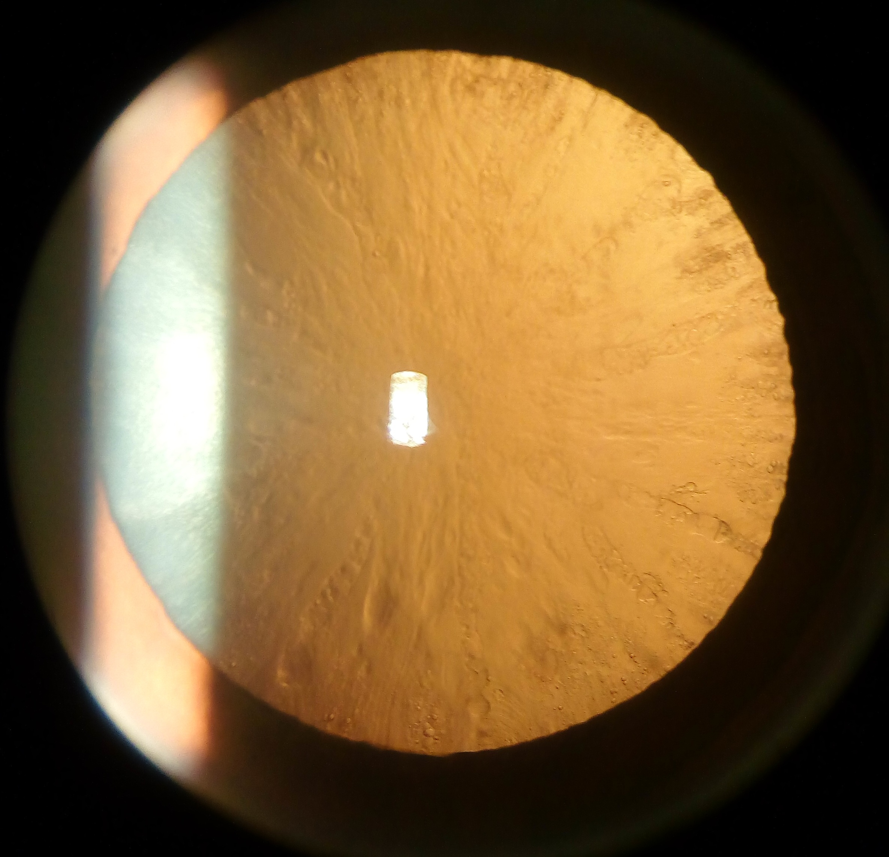
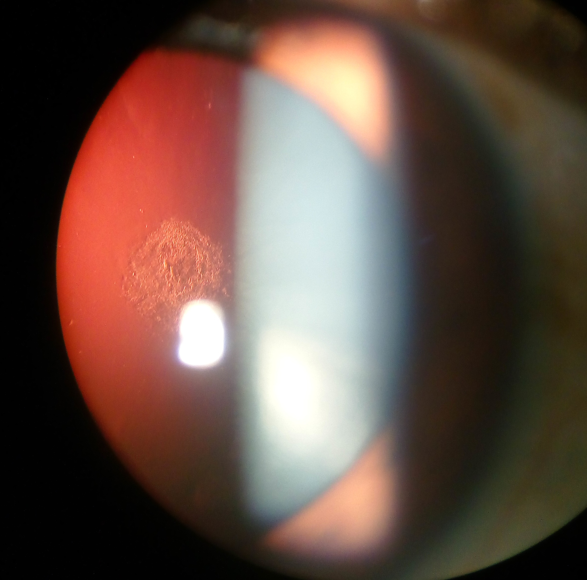
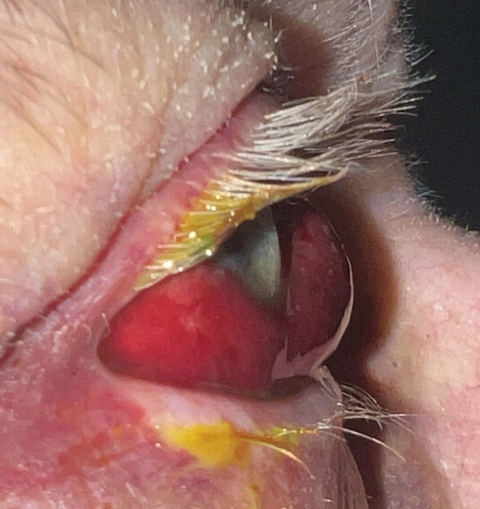
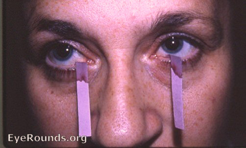
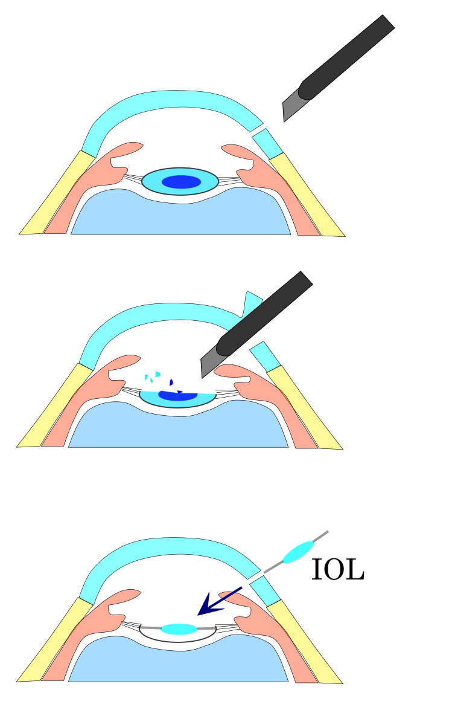

# CATARATA E CRISTALINO

Para entender a catarata, você precisa primeiro visualizar o cristalino não como uma "lente de vidro" estática, mas como uma estrutura biológica viva, dinâmica e extremamente organizada. O cristalino é uma lente biconvexa, transparente e avascular. Ele não possui nervos nem vasos sanguíneos.

Por que isso importa? Porque qualquer nutrição ou troca metabólica depende exclusivamente do humor aquoso. Se o metabolismo do humor aquoso falha ou se substâncias tóxicas se acumulam ali, o cristalino sofre. Ele é composto por uma cápsula (uma membrana basal elástica), um epitélio subcapsular e as fibras do cristalino.

O segredo da transparência está no arranjo preciso das proteínas chamadas cristalinas (α, β e γ). Quando esse arranjo é quebrado por oxidação, trauma ou radiação, as proteínas se agregam. É essa agregação que gera a opacidade que chamamos de catarata.

## Anatomia e Fisiologia Aplicada à Clínica

O cristalino fica suspenso atrás da íris pelas fibras zonulares (a zônula de Zinn), que se ligam ao corpo ciliar. Aqui entra o conceito de acomodação: quando o músculo ciliar contrai, a zônula relaxa, o cristalino se torna mais globoso e o poder refrativo aumenta, permitindo a visão de perto.

Com o passar dos anos, o cristalino continua crescendo. Novas fibras são formadas na periferia e empurram as antigas para o centro, criando um núcleo cada vez mais denso e menos elástico. Isso explica dois fenômenos que você verá no consultório:

- **Presbiopia:** A perda da capacidade de acomodação (a "vista cansada").

- **Catarata Nuclear:** O endurecimento e amarelecimento do centro do cristalino.

## Epidemiologia e Impacto

A catarata é a principal causa de cegueira reversível no mundo. No Brasil, com o envelhecimento da população, a prevalência aumenta drasticamente após os 60 anos. De acordo com o Conselho Brasileiro de Oftalmologia (CBO), estima-se que cerca de 25% das pessoas com mais de 65 anos e 50% das pessoas com mais de 75 anos apresentem algum grau de opacificação do cristalino com repercussão visual.

Os principais fatores de risco que você deve investigar na anamnese são:

- Idade avançada (principal fator).

- Diabetes Mellitus (causa catarata mais precoce e de progressão rápida).

- Uso crônico de corticoides (tópicos, sistêmicos ou inalatórios).

- Exposição à radiação ultravioleta sem proteção.

- Trauma ocular prévio.

- Tabagismo e etilismo.

## Etiologia e Fisiopatologia: O "Porquê" das Coisas

Muitos alunos decoram que o diabetes causa catarata, mas poucos entendem o mecanismo. No paciente diabético com hiperglicemia sustentada, os níveis de glicose no humor aquoso sobem. A enzima aldose redutase converte essa glicose em sorbitol dentro do cristalino.

O sorbitol é osmoticamente ativo e não atravessa membranas facilmente. Resultado? Ele "puxa" água para dentro das fibras do cristalino, causando edema, ruptura das fibras e opacificação. É por isso que o paciente diabético pode ter variações agudas na acuidade visual conforme o controle da glicemia muda.

### Classificação Etiológica

| Tipo de Catarata | Característica Principal | Fator Associado Comum |
| --- | --- | --- |
| **Senil** | Progressiva, bilateral, assimétrica | Envelhecimento (estresse oxidativo) |
| **Traumática** | Geralmente unilateral, aspecto em "roseta" | Trauma contuso ou perfurante |
| **Metabólica** | Progressão rápida, bilateral | Diabetes Mellitus, Galactosemia |
| **Tóxica** | Subcapsular posterior | Corticosteroides, Clorpromazina |
| **Congênita** | Presente ao nascimento | Rubéola, Toxoplasmose, Genética |

## Quadro Clínico: Sinais e Sintomas

O sintoma clássico é a baixa acuidade visual progressiva e indolor. O paciente costuma descrever como se estivesse olhando através de um "vidro sujo" ou de uma "névoa".

No entanto, as bancas de residência adoram cobrar as nuances:

- **Glare (Ofuscamento):** Dificuldade de dirigir à noite devido às luzes dos carros ou sensibilidade excessiva à luz solar. Isso ocorre porque a opacidade dispersa a luz em vez de focá-la.

- **Mudança Refrativa (Miopização):** O paciente idoso que usava óculos para perto e, de repente, consegue ler sem eles. Cuidado! Isso não é uma melhora real. É a catarata nuclear aumentando o índice de refração do cristalino, tornando o paciente "míope". Chamamos isso de "segunda visão".

- **Redução da Sensibilidade ao Contraste:** As cores parecem desbotadas ou amareladas.

### Exame Físico e Diagnóstico

O diagnóstico é essencialmente clínico, realizado através da biomicroscopia na lâmpada de fenda. Com a pupila dilatada, o oftalmologista consegue classificar a catarata quanto à localização:

- **Nuclear:** Opacidade no centro (núcleo). Relacionada à idade.

*Figura 1: Catarata nuclear brunescente. O núcleo amarelo-acastanhado aumenta o poder refrativo, causando a "segunda visão" (miopização transitória).*

- **Cortical:** Opacidades em formato de "raios de roda" na periferia. Comum no diabetes.

*Figura 2: Catarata cortical. Note as opacidades periféricas em formato de "raios de roda" vistas por retroiluminação. Comum no diabetes mellitus.*

- **Subcapsular Posterior:** Localizada logo à frente da cápsula posterior.

*Figura 3: CSP. Opacidade tipo placa na cápsula posterior. Fortemente associada ao uso crônico de corticoides (oral, inalatório ou tópico).* É a que mais compromete a visão de perto e está fortemente ligada ao uso de corticoides.

**Dica de Prova:** Se a questão mencionar um paciente jovem com catarata subcapsular posterior e uso de bombinha para asma ou pomada dermatológica, pense imediatamente em efeito colateral de corticoide.

## Diagnóstico Diferencial de Visão Turva

Este é um ponto crítico onde o Dr. Will sempre enfatiza: nem toda visão turva é catarata. As provas de residência testam sua capacidade de diferenciar causas oculares, sistêmicas e neurológicas.

### Causas Oculares

- **Erros Refrativos:** Miopia, astigmatismo (melhoram com óculos ou pinhole/buraco estenopeico).

- **DMRI (Degeneração Macular Relacionada à Idade):** Perda da visão central, metamorfopsia (linhas tortas).

- **Glaucoma:** Geralmente perda de campo periférico (silencioso até fases tardias).

### Causas Sistêmicas e Neurológicas

- **Diabetes Mellitus:** Flutuação da visão por edema do cristalino.

- **Hipotensão ou Hipoglicemia:** Turvação visual transitória.

- **Enxaqueca com Aura:** Escotomas cintilantes seguidos ou não de cefaleia.

- **Neurite Óptica:** Perda visual súbita, dolorosa à movimentação ocular, comum na Esclerose Múltipla.

**Atenção:** Em questões de prova, o hipotireoidismo e cardiopatias leves geralmente aparecem como distratores. Eles não causam visão turva direta. Se o paciente tem insuficiência cardíaca grave com baixo débito, ele pode ter amaurose fugaz, mas não é o quadro típico de "visão turva" crônica.

## Olho Vermelho e Hemorragia Subconjuntival

Muitas vezes, o tema catarata vem acompanhado de questões sobre o "olho vermelho" no pronto-socorro. Um cenário clássico é o paciente hipertenso que acorda com uma mancha de sangue "vivo" no olho.

### Hemorragia Subconjuntival

*Figura 6: Hemorragia subconjuntival. Achado benigno, autolimitado. Conduta: tranquilizar e checar PA. Regride em 7-14 dias.*
É o rompimento de pequenos vasos da conjuntiva.

- **Quadro:** Mancha vermelha brilhante, assintomática (sem dor, sem baixa visual).

- **Causas:** Picos hipertensivos, tosse intensa, manobra de Valsalva, uso de AAS/anticoagulantes ou trauma leve.

- **Conduta:** Tranquilizar o paciente. É uma condição benigna que regride espontaneamente em 7 a 14 dias. Não precisa de colírio antibiótico ou corticoide. Deve-se apenas monitorar a pressão arterial.

### Diagnóstico Diferencial do Olho Vermelho (Tabela Comparativa)

| Condição | Dor | Acuidade Visual | Pupila | Secreção |
| --- | --- | --- | --- | --- |
| **Conjuntivite** | Desconforto/Prurido | Normal | Normal | Mucopurulenta ou Serosa |
| **Hemorragia Subconj.** | Ausente | Normal | Normal | Ausente |
| **Uveíte Anterior** | Moderada/Forte | Diminuída | Miose (pupila pequena) | Ausente (hiperemia ciliar) |
| **Glaucoma Agudo** | Intensa | Muito Diminuída | Midríase média paralítica | Ausente (olho "duro") |

## Síndrome do Olho Seco e Síndrome de Sjögren

A ceratoconjuntivite seca é uma comorbidade frequente no paciente com catarata. No MedEvo, aprendemos que o diagnóstico preciso é fundamental antes de qualquer cirurgia, pois o olho seco não tratado piora o pós-operatório.

### Diagnóstico de Olho Seco

*Figura 5: Teste de Schirmer I. Normal: >15mm em 5 min. Deficiência grave: <5mm. Fundamental avaliar antes da cirurgia de catarata.*

- **Teste de Schirmer I:** Mede a produção basal e reflexa de lágrima. Um valor < 5 mm em 5 minutos indica deficiência aquosa grave. (Normal > 15 mm).

- **Coloração com Rosa Bengala ou Lisamina Verde:** Estes corantes coram células epiteliais mortas ou desvitalizadas e áreas sem mucina. É um sinal de sofrimento da superfície ocular.

- **Tempo de Ruptura do Filme Lacrimal (BUT):** Avalia a estabilidade da lágrima. < 10 segundos é anormal.

### Síndrome de Sjögren

Quando o paciente apresenta olho seco grave (Schirmer baixo + Rosa Bengala positivo) associado a xerostomia (boca seca) e, possivelmente, uma doença do tecido conjuntivo (como Artrite Reumatoide), devemos suspeitar de Sjögren.

- **Pérola de Prova:** A tríade "olho seco + boca seca + artrite" é a descrição clássica. O diagnóstico envolve biópsia de glândula salivar menor e anticorpos Anti-Ro (SSA) e Anti-La (SSB).

## Tratamento da Catarata: A Cirurgia

Não existe tratamento farmacológico (colírios ou vitaminas) que reverta a catarata. O tratamento é exclusivamente cirúrgico.

**Quando operar?** A indicação não depende apenas da acuidade visual medida na tabela de Snellen (ex: 20/40), mas sim do impacto na qualidade de vida do paciente. Se a catarata impede o paciente de dirigir, ler ou realizar seu trabalho, a cirurgia está indicada.

*Figura 4: Etapas da Facoemulsificação (padrão-ouro). Pequena incisão → ultrassom fragmenta o cristalino → aspiração → implante de LIO dobrável. Sem pontos.*

### Técnicas Cirúrgicas

- **Facoemulsificação (Padrão-Ouro):** Uma pequena incisão (2.2 a 2.75 mm) é feita. Uma sonda de ultrassom fragmenta e aspira o núcleo do cristalino. Em seguida, uma Lente Intraocular (LIO) dobrável é inserida. Não costuma precisar de pontos.

- **Extração Extracapsular (EECC):** Reservada para cataratas muito duras ou em locais sem tecnologia de faco. A incisão é maior, o núcleo sai inteiro e são necessários pontos.

### Lentes Intraoculares (LIO)

Hoje, a cirurgia de catarata também é uma cirurgia refrativa.

- **Monofocais:** Corrigem a visão para longe (o paciente precisará de óculos para perto).

- **Multifocais/Trifocais:** Corrigem longe, intermediário e perto.

- **Tóricas:** Corrigem o astigmatismo pré-existente.

## Complicações Cirúrgicas e a Síndrome da Íris Flácida (IFIS)

Aqui está o tópico que mais caiu nas últimas provas de oftalmologia para clínica médica.

### Bloqueadores Alfa-1 Adrenérgicos e a Tamsulosina

A tamsulosina é um bloqueador alfa-1 seletivo amplamente utilizado para o tratamento da Hiperplasia Prostática Benigna (HPB). O problema é que existem receptores alfa-1 no músculo dilatador da íris.

O uso crônico de tamsulosina causa uma atrofia ou relaxamento permanente desse músculo. Durante a cirurgia de catarata, isso resulta na **Síndrome da Íris Flácida Intraoperatória (IFIS)**, caracterizada por:

- Íris "mole" que ondeia com as correntes de fluido (billowing).

- Tendência da íris a prolapsar pelas incisões.

- Miose progressiva (a pupila fecha durante a cirurgia, dificultando o acesso ao cristalino).

**Cuidado:** Suspender a tamsulosina dias antes da cirurgia geralmente NÃO resolve o problema, pois o efeito na íris pode ser permanente. O cirurgião deve estar preparado com ganchos de íris ou anéis de expansão pupilar.
*Pergunta de prova típica:* "Paciente masculino, 70 anos, em tratamento para HPB, vai operar catarata. Qual a complicação esperada?" Resposta: IFIS.

### Outras Complicações

- **Endoftalmite:** É a complicação mais temida. Uma infecção intraocular grave. Ocorre geralmente nos primeiros 7 dias pós-op. O paciente apresenta dor intensa, olho muito vermelho e perda súbita de visão. É uma emergência oftalmológica.

- **Opacificação da Cápsula Posterior (OCP):** Chamada erroneamente de "catarata voltando". É a proliferação de células remanescentes na cápsula que segura a lente. O tratamento é simples: **YAG Laser (Capsulotomia)**. Não precisa de nova cirurgia no bloco.

- **Edema Macular Cistoide (Síndrome de Irvine-Gass):** Edema na retina após a cirurgia, tratado com anti-inflamatórios.

## Impacto de Doenças Sistêmicas no Olho

Como professor, eu sempre digo: o olho é a janela para o sistema vascular.

### Hipertensão Arterial (HAS)

A HAS causa alterações agudas (vasoespasmo) e crônicas (esclerose vascular).

- **Retinopatia Hipertensiva:** Classificada por Scheie ou Keith-Wagener-Barker. Sinais como cruzamentos arteriovenosos patológicos, fios de prata/cobre e exsudatos algodonosos.

- **Hemorragia Subconjuntival:** Como já discutido, é um sinal de alerta para descontrole pressórico agudo.

### Diabetes Mellitus (DM)

O DM é a principal causa de cegueira em idade laboral. Além da catarata precoce, a **Retinopatia Diabética** é o grande vilão.

- **Microaneurismas:** Primeiro sinal clínico visível.

- **Neovascularização:** Define a fase Proliferativa, com alto risco de hemorragia vítrea e descolamento de retina.

## Resumo de Condutas Farmacológicas e Doses

Embora a catarata seja cirúrgica, o manejo das condições associadas exige precisão:

- **Olho Seco Leve:** Lágrimas artificiais (Carmelose sódica 0,5% ou Hipromelose 0,3%) 1 gota 4 a 6x ao dia.

- **Olho Seco Grave/Sjögren:** Ciclosporina tópica 0,05% (Restasis) ou Corticoides de baixa penetração (Loteprednol) por curto período, sob supervisão.

- **Prevenção de Endoftalmite:** Uso de antibiótico intracameral (Cefuroxima 1mg/0,1ml) ao final da cirurgia de catarata (reduz o risco em até 5 vezes, segundo estudos da ESCRS).

- **Pós-operatório padrão:** Combinação de Antibiótico (Moxifloxacino 0,5%) e Corticoide (Prednisolona 1%) por 2 a 4 semanas.

## Situações Especiais

### O Idoso Frágil

Muitas vezes a família hesita em operar um paciente de 90 anos. No entanto, a correção da catarata reduz drasticamente o risco de quedas e fraturas de fêmur, além de melhorar o declínio cognitivo. A cirurgia é feita sob anestesia local e sedação leve, sendo muito segura.

### O Paciente com Glaucoma

A cirurgia de catarata, por si só, tende a baixar um pouco a pressão intraocular (PIO) ao abrir o ângulo da câmara anterior. Em alguns casos, realizamos a "facotrabeculectomia" (cirurgia combinada de catarata e glaucoma).

## Estratificação de Risco e Metas

Antes de encaminhar para a cirurgia, o clínico deve garantir:

- **Controle Glicêmico:** HbA1c idealmente abaixo de 8% para reduzir risco de complicações infecciosas e edema macular.

- **Controle Pressórico:** PA < 140/90 mmHg para evitar hemorragias expulsivas (raríssimas, mas catastróficas).

- **Avaliação de Coagulopatias:** Não é necessário suspender AAS para facoemulsificação, mas anticoagulantes orais (Varfarina) devem estar na faixa terapêutica (INR 2-3).

## Pontos-Chave para Prova

- **Catarata Nuclear e Miopização:** O endurecimento do núcleo aumenta o poder refrativo. O idoso volta a ler de perto sem óculos ("segunda visão"). Isso é catarata, não melhora da visão.

- **Tamsulosina e IFIS:** O uso de bloqueadores alfa-1 (mesmo que interrompido) causa a Síndrome da Íris Flácida Intraoperatória. A tríade é: billowing (íris ondulante), prolapso e miose progressiva.

- **Hemorragia Subconjuntival:** Mancha de sangue vivo, indolor, visão normal. Conduta: tranquilizar e checar pressão arterial. É benigno.

- **Catarata por Corticoide:** Tipicamente do tipo **Subcapsular Posterior**. Pode ocorrer com qualquer via de administração (oral, inalatória, tópica).

- **Teste de Schirmer I:** Valores menores que 5 mm em 5 minutos confirmam deficiência lacrimal grave.

- **Síndrome de Sjögren:** Olho seco (Schirmer baixo) + Boca seca (Xerostomia) + Rosa Bengala positivo. Frequentemente associada a doenças autoimunes.

- **Diagnóstico Diferencial de Visão Turva:** Hipotireoidismo e cardiopatias leves NÃO são causas diretas de visão turva em provas. Foque em DM, Catarata, DMRI e Erros Refrativos.

- **Endoftalmite:** Dor, olho vermelho e perda visual após cirurgia. É a complicação mais grave e uma emergência.

- **Opacificação de Cápsula Posterior:** Complicação tardia mais comum. Tratamento: YAG Laser (não é nova cirurgia).

- **Diabetes e Sorbitol:** A via do sorbitol (aldose redutase) é o mecanismo fisiopatológico da catarata diabética por edema osmótico das fibras.

- **Contraindicação Absoluta para Cirurgia:** Infecção ocular ativa (conjuntivite, blefarite grave) ou saúde sistêmica instável que impeça o posicionamento em decúbito dorsal.

- **Primeira Escolha Cirúrgica:** Facoemulsificação com implante de Lente Intraocular (LIO).

- **Rosa Bengala:** Corante que identifica áreas de xerose (secura) e células desvitalizadas na superfície ocular.

- **Sinais de Alarme no Olho Vermelho:** Dor intensa, fotofobia e baixa acuidade visual. Se houver esses sinais, não é apenas conjuntivite ou hemorragia subconjuntival.

- **Glaucoma Agudo vs. Uveíte:** Glaucoma tem pupila em midríase média; Uveíte tem pupila em miose. Ambos causam olho vermelho e dor.

- **Catarata Congênita:** Deve ser operada precocemente (nas primeiras semanas) para evitar a ambliopia (olho preguiçoso por falta de estímulo).

 Cópia offline para consulta pessoal.
 Fonte original:
 [https://www.medevo.com.br/material-apoio/ler/5c200988-7a2b-47aa-a3ea-2cc7e8e80d0b](https://www.medevo.com.br/material-apoio/ler/5c200988-7a2b-47aa-a3ea-2cc7e8e80d0b)
