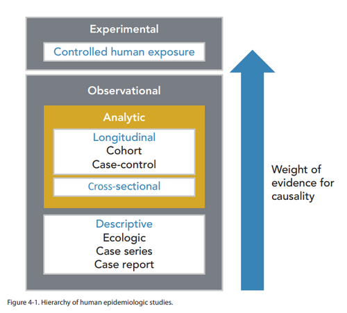

# CAUSALIDADE EM EPIDEMIOLOGIA

Em epidemiologia, associação estatística não é sinônimo de causa. Uma associação pode refletir causalidade verdadeira, acaso, viés, confundimento, causalidade reversa ou erro de aferição. A interpretação correta exige integrar temporalidade, plausibilidade biológica, desenho do estudo e tamanho do efeito.

A epidemiologia evoluiu de uma visão unicausal, em que um agente produzia uma doença, para uma compreensão multicausal, baseada em teias de causalidade. Nesse contexto, temporalidade é mais fundamental que força de associação: uma exposição muito associada ao desfecho não pode ser sua causa se ocorre depois dele.

*Figura 1 - Clássico mapa de John Snow mostrando casos de cólera agrupados ao redor de bombas de água em Londres (1854), marco fundador da epidemiologia moderna e da investigação causal. Fonte: John Snow, Domínio Público | Wikimedia Commons*

## O Conceito de Causa e a Evolução dos Modelos

Antigamente, seguíamos o modelo determinista. Era a lógica dos Postulados de Koch: para uma doença existir, o agente precisava estar presente, ser isolado e, se inoculado em alguém saudável, causar a mesma doença. Isso funciona bem para a tuberculose, mas tente aplicar isso ao diabetes ou à hipertensão. Não funciona.

Hoje, trabalhamos com o modelo multicausal ou sistêmico. A doença não é fruto de um evento isolado, mas de uma conjunção de fatores. Imagine um paciente com infarto agudo do miocárdio. A "causa" foi a placa de ateroma que rompeu? Foi o tabagismo de 30 anos? Foi a genética? Foi o estresse do trabalho? A resposta é: todos eles.

### Modelo de Leavell e Clark: A História Natural da Doença

Este é um dos temas que mais cai. Leavell e Clark dividiram a doença em dois grandes períodos:

- **Período de Pré-patogênese:** Aqui a doença ainda não existe no indivíduo. O que existe é a interação entre o agente (ex: vírus), o hospedeiro (indivíduo suscetível) e o ambiente (o meio onde vivem). Se houver um desequilíbrio aqui, a doença começa.

- **Período de Patogênese:** A doença já se instalou. Ela começa com alterações bioquímicas e celulares (subclínicas), cruza o "horizonte clínico" (quando aparecem sintomas) e evolui para cura, cronicidade, sequela ou óbito.

Ponto de classificação: o bloqueio de fatores pré-patogênicos corresponde à **prevenção primária**, pois atua antes do início da doença. Os níveis de prevenção serão retomados adiante.

## Contrafactual, DAG e Cadeia Causal

A forma moderna de pensar causalidade pergunta: **o que aconteceria com o mesmo indivíduo se a exposição fosse removida?** Esse cenário alternativo é o contrafactual. Como ele não pode ser observado diretamente no mesmo indivíduo ao mesmo tempo, a epidemiologia usa grupos comparáveis para estimar o efeito causal.

DAG simplificado

Confusor
 ↘ ↘
 Exposição → Desfecho

Mediador
 Exposição → Mediador → Desfecho

Modificador de efeito
 Exposição → Desfecho
 ↑
 efeito diferente conforme idade, sexo, genética ou contexto

- **Confusor:** associado à exposição e ao desfecho, mas não está no caminho causal. Deve ser controlado.

- **Mediador:** está no caminho entre exposição e desfecho. Ajustá-lo pode retirar parte do efeito causal real.

- **Modificador de efeito:** muda a magnitude ou direção da associação em subgrupos. Não é erro; é informação clínica relevante.

Essa distinção evita o erro de “ajustar demais” o modelo estatístico ou de confundir mecanismo causal com viés.

## Critérios de Causalidade de Bradford Hill

Os critérios de Hill são um conjunto de aspectos que ajudam a julgar se uma associação observada pode ser interpretada como causal. Em 1965, Austin Bradford Hill propôs nove critérios; eles não funcionam como checklist rígido, mas como matriz de julgamento.

### 1. Sequência Cronológica (Temporalidade)

Este é o critério de ouro. Para que X cause Y, X deve vir antes de Y. Parece óbvio, mas em estudos transversais, onde medimos exposição e desfecho ao mesmo tempo, não conseguimos afirmar quem veio primeiro.

- **Pérola de Prova:** A temporalidade é o único critério considerado indispensável (sine qua non) para estabelecer causalidade.

### 2. Força da Associação

Quanto maior a medida de efeito (Risco Relativo ou Odds Ratio), maior a probabilidade de ser causal. Se quem fuma tem 20 vezes mais chance de ter câncer de pulmão (RR=20), a associação é muito forte. Se o RR fosse 1,1, poderíamos desconfiar de algum erro ou viés.

### 3. Relação Dose-Resposta (Gradiente Biológico)

Quanto maior a exposição, maior tende a ser a frequência ou a gravidade do desfecho. Por exemplo, se o risco aumenta progressivamente entre quem fuma 1 maço/dia e quem fuma 3 maços/dia, a hipótese causal fica mais forte.

- **Cuidado:** Nem toda doença tem dose-resposta. Algumas reações são do tipo "tudo ou nada" (ex: alergias graves).

### 4. Consistência

Diferentes pesquisadores, em diferentes lugares e com diferentes desenhos de estudo, chegam ao mesmo resultado. Se o estudo em Porto Alegre diz que carne vermelha aumenta risco de câncer colorretal e o estudo em Tóquio diz o mesmo, a associação ganha força.

### 5. Plausibilidade Biológica

A associação faz sentido à luz do conhecimento científico atual? Existe um mecanismo fisiopatológico que explique isso?

- **Exemplo:** É plausível que o HPV cause câncer de colo de útero porque o vírus integra seu DNA ao genoma da célula hospedeira, alterando o ciclo celular.

### 6. Coerência

A interpretação de causa e efeito não deve conflitar com o que se sabe sobre a história natural da doença.

### 7. Especificidade

Uma causa leva a um efeito específico. Este critério é o mais fraco hoje em dia, pois sabemos que o tabagismo (uma causa) leva a dezenas de doenças diferentes (vários efeitos).

### 8. Evidência Experimental

Quando uma intervenção, como um ensaio clínico randomizado, remove ou reduz o fator de risco e a incidência da doença diminui, a evidência causal se torna mais robusta.

### 9. Analogia

Se um medicamento X causa malformação fetal, é razoável pensar que um medicamento Y, da mesma classe química, também possa causar.

| Critério | O que avalia? | Importância em Prova |
| --- | --- | --- |
| **Temporalidade** | A causa precede o efeito? | **Máxima (Indispensável)** |
| **Força** | Qual a magnitude do RR ou OR? | Alta |
| **Dose-Resposta** | Mais exposição = Mais doença? | Alta |
| **Plausibilidade** | Existe explicação biológica? | Média |
| **Consistência** | Resultados repetidos em outros estudos? | Média |

*Figura 2 - Hierarquia dos estudos epidemiológicos: diferentes níveis de evidência para estabelecer causalidade, de relatos de caso a revisões sistemáticas. Fonte: NIOSH/CDC, Domínio Público | Wikimedia Commons*

## Vieses, Confundimento e Erros de Interpretação

Muitas associações parecem causais, mas resultam de erro sistemático. Antes de aceitar uma relação como causal, é necessário descartar viés, confundimento, causalidade reversa e problemas de mensuração.

### O Fator de Confusão (Confundimento)

Este é o erro clássico de prova. Um fator de confusão é uma variável que está associada tanto à exposição quanto ao desfecho, mas não faz parte do caminho causal entre eles.

**Exemplo Clínico:** Imagine um estudo que sugere associação entre consumo de café e câncer de pulmão, com p < 0,05. Ao avaliar os dados, percebe-se que pessoas que tomam muito café também fumam mais frequentemente. O cigarro está associado ao café (exposição) e ao câncer (desfecho). Quando o modelo é ajustado para tabagismo, a associação do café desaparece. O cigarro era o fator de confusão.

**Como controlar o confundimento?**

- **No desenho do estudo:** Randomização (o melhor método para ensaios clínicos), Pareamento (escolher controles parecidos com os casos) e Restrição (ex: estudar apenas não fumantes).

- **Na análise dos dados:** Estratificação (analisar fumantes e não fumantes separadamente) e Análise Multivariada (modelos matemáticos que "limpam" o efeito das variáveis).

### Vieses de Seleção e Aferição

- **Viés de Seleção:** Quando os grupos comparados são diferentes de uma forma que afeta o resultado. Um exemplo é o **Viés de Sobrevida (Neyman)** em estudos transversais: a amostra inclui apenas sobreviventes da doença e ignora óbitos precoces, o que distorce a gravidade da associação.

- **Viés de Aferição (ou de Memória):** Comum em estudos de caso-controle. Quem está doente lembra muito mais de exposições passadas do que quem está saudável.

## Níveis de Prevenção e a Causalidade

A compreensão da causa dita como vamos prevenir. Seguindo o modelo de Leavell e Clark, e adicionando os conceitos modernos de prevenção quaternária, temos a seguinte estrutura:

### Prevenção Primária

Atua no período de **pré-patogênese**. O objetivo é impedir que a doença ocorra, removendo as causas ou aumentando a resistência do hospedeiro.

- **Promoção da Saúde:** Medidas genéricas (educação, saneamento, dieta equilibrada).

- **Proteção Específica:** Medidas direcionadas (vacinação, uso de preservativos, uso de EPIs, fortificação de alimentos com ácido fólico).

### Prevenção Secundária

A doença já existe, mas está no início ou é assintomática. O foco é o **diagnóstico precoce** e o **tratamento imediato**.

- **Exemplos:** Rastreamento (Screening) como mamografia, Papanicolau, teste do pezinho. Inquéritos para descoberta de casos de tuberculose.

- **Objetivo:** Evitar a progressão e as complicações.

### Prevenção Terciária

A doença já causou danos. O objetivo é a **reabilitação** e a redução de sequelas.

- **Exemplos:** Fisioterapia pós-AVC, terapia ocupacional, uso de próteses, controle rigoroso do diabetes para evitar amputações.

### Prevenção Quaternária

Este conceito é fundamental para as provas modernas. Foi proposto por Marc Jamoulle e foca em **evitar a iatrogenia** e a **medicalização desnecessária**.

- **Por que fazemos?** Para proteger o paciente de intervenções que trazem mais riscos do que benefícios.

- **Exemplos:** Não pedir PSA para um paciente de 90 anos com múltiplas comorbidades; evitar o uso excessivo de antibióticos em resfriados virais; evitar o **sobrediagnóstico** (diagnosticar algo que nunca causaria sintomas ou morte).

| Nível de Prevenção | Fase da Doença | Ação Principal | Exemplo Típico |
| --- | --- | --- | --- |
| **Primária** | Pré-patogênese | Remover causas / Vacinar | Vacina HPV / Uso de Cinto de Segurança |
| **Secundária** | Patogênese Inicial | Diagnóstico Precoce | Mamografia de rastreamento |
| **Terciária** | Patogênese Avançada | Reabilitação | Fisioterapia após infarto |
| **Quaternária** | Qualquer fase | Evitar Iatrogenia | Não fazer check-up desnecessário |

## Desenhos de Estudo e a Hierarquia da Causalidade

Nem todo estudo tem o mesmo "poder" de sugerir causalidade.

- **Estudos Transversais (Seccionais):** São ótimos para prevalência, mas péssimos para causalidade. Como medem tudo ao mesmo tempo, sofrem com a falta de temporalidade. Podem gerar o **Paradoxo da Prevenção** ou associações reversas.

- **Estudos de Caso-Controle:** Partem do desfecho (doentes) para a exposição (passado). São bons para doenças raras e longos períodos de latência. Calculam o **Odds Ratio (OR)**.

- **Estudos de Coorte:** Partem da exposição para o desfecho (futuro). São excelentes para observar a incidência e estabelecer temporalidade. Calculam o **Risco Relativo (RR)**.

- **Ensaios Clínicos Randomizados:** O padrão-ouro. A randomização controla os fatores de confusão conhecidos e desconhecidos. É o desenho que melhor isola a relação de causa e efeito.

Ponto de identificação do desenho: doença rara, baixo custo e investigação retrospectiva de exposição favorecem **caso-controle**; acompanhamento, incidência e cálculo de risco relativo favorecem **coorte**.

## O Paradoxo da Prevenção e a Visão de Geoffrey Rose

Geoffrey Rose trouxe uma reflexão importante: uma medida preventiva que traz muito benefício para a população pode trazer pouco benefício para cada indivíduo isoladamente.

Imagine o uso de cintos de segurança. Para a sociedade, isso reduz drasticamente a mortalidade por acidentes (grande benefício coletivo). Mas, para um indivíduo isolado, a chance de o cinto salvar uma vida em um dia específico é pequena, pois a probabilidade diária de acidente grave é baixa.

Rose defendia que devemos focar na **estratégia populacional** (mudar a média de risco de todos) em vez de focar apenas na **estratégia de alto risco** (tratar apenas quem já está muito doente). Isso é a base das políticas públicas de saúde modernas.

## Erros comuns de interpretação

- **Confundir Prevenção Secundária com Primária:** A banca vai dizer que "fazer mamografia evita o câncer". Errado! Mamografia não evita que o câncer apareça (isso seria primária), ela detecta o câncer que já existe para tratá-lo cedo (secundária).

- **Achar que p < 0,05 prova Causalidade:** O valor de p diz apenas que a associação provavelmente não foi ao acaso. Para ser causa, precisa passar pelo crivo dos critérios de Hill.

- **Ignorar o Fator de Confusão:** Sempre que vir uma associação estranha (ex: dentes amarelos causam câncer de pulmão), procure a variável oculta (neste caso, o tabagismo).

- **Associação Reversível:** Se a retirada do fator de risco diminui a incidência da doença, isso é um forte indício de causalidade. As bancas chamam isso de "evidência experimental" ou "cessação da exposição".

## Exemplo Clínico Aplicado

Imagine um paciente de 55 anos, obeso, sedentário, que consome muita carne vermelha e processados. Ele é diagnosticado com câncer colorretal.

- **Causalidade:** O consumo de carne vermelha e a obesidade são fatores de risco (causas componentes). A associação entre carne vermelha e câncer colorretal é uma **correlação positiva** (quanto mais consome, mais risco).

- **Prevenção Primária:** Teria sido a orientação dietética e o estímulo à atividade física anos atrás.

- **Prevenção Secundária:** Seria a realização de colonoscopia de rastreamento aos 45 anos, que poderia ter detectado um pólipo precursor.

- **Prevenção Quaternária:** Seria evitar cirurgias heróicas ou quimioterapias fúteis se o paciente estivesse em fase terminal, focando em cuidados paliativos e dignidade.

## Análise de Dados e Significância

É essencial saber interpretar um intervalo de confiança (IC).

- Se o **RR ou OR é 2,5** e o **IC 95% é [1,8 - 3,2]**: A associação é estatisticamente significativa porque o intervalo não inclui o valor 1 (que é o valor de nulidade).

- Se o **IC 95% é [0,9 - 4,5]**: Não há significância estatística, pois o risco pode ser menor que 1, igual a 1 ou maior que 1.

Lembre-se: a magnitude do Risco Relativo (força da associação) independe da magnitude do Risco Absoluto (probabilidade real de ter a doença). Pode haver RR de 10 para uma doença que atinge apenas 1 em 1 milhão de pessoas. O risco continua sendo baixo em termos absolutos, embora a associação seja forte.

## Pontos-chave

- **Temporalidade:** Único critério de Hill obrigatório (a causa deve preceder o efeito).

- **Fator de Confusão:** Variável associada à exposição e ao desfecho, mas que não é um passo intermediário na cadeia causal.

- **Controle de Confundimento:** Randomização (no desenho) e Estratificação/Multivariada (na análise).

- **Prevenção Primária:** Promoção da saúde + Proteção específica (ex: vacinas, EPIs). Atua na pré-patogênese.

- **Prevenção Secundária:** Diagnóstico precoce + Tratamento imediato (ex: rastreamento). Atua na patogênese inicial.

- **Prevenção Terciária:** Reabilitação e limitação de incapacidades.

- **Prevenção Quaternária:** Evitar medicalização excessiva, sobrediagnóstico e iatrogenia.

- **Estudo Transversal:** Não estabelece causalidade nem temporalidade. Sofre com o viés de sobrevida (Neyman).

- **John Snow:** Pai da epidemiologia moderna; usou o método epidemiológico para provar que a cólera era transmitida pela água, antes mesmo da descoberta da bactéria.

- **Postulados de Koch:** Modelo determinista/unicausal, hoje insuficiente para doenças crônicas.

- **Sobrediagnóstico:** Diagnosticar uma condição que não causaria dano ao paciente se ficasse oculta.

- **Plausibilidade Biológica:** A associação deve ter uma explicação lógica pela fisiopatologia.

- **Dose-Resposta:** Quanto maior a exposição, maior o risco (reforça a causalidade).

- **Significância Estatística:** p < 0,05 ou IC 95% que não contenha o valor 1. Não garante causalidade por si só.

- **Associação Reversível:** A retirada do fator de risco leva à redução da doença (sugere fortemente causalidade). 🩺

 Cópia offline para consulta pessoal.
 Fonte original:
 [https://www.medevo.com.br/material-apoio/ler/a4f8d748-caae-434a-935d-d58c240a147b](https://www.medevo.com.br/material-apoio/ler/a4f8d748-caae-434a-935d-d58c240a147b)
