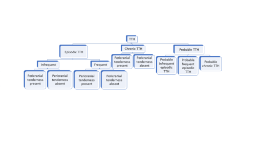

# CEFALEIA NA INFÂNCIA

Quando falamos de cefaleia na pediatria, a primeira coisa que você, como futuro residente, precisa colocar na cabeça é: o nosso papel principal não é dar um nome bonito para a dor, mas sim separar o "joio do trigo". O "trigo" são as cefaleias primárias, como a enxaqueca, que incomodam muito, mas não matam. O "joio" são as cefaleias secundárias, especialmente os tumores de Sistema Nervoso Central (SNC), que na criança têm uma predileção cruel pela fossa posterior.

Muitos alunos erram questões de prova porque tentam aplicar os critérios diagnósticos do adulto na criança. Esqueça isso. A criança não é um adulto pequeno. A enxaqueca dela dura menos, a dor pode ser bilateral e, às vezes, a dor nem é na cabeça, mas na barriga. Vamos entender o porquê de cada coisa.

*Figura 1 - Aura visual de migrânea: escotoma cintilante com estruturas em zigue-zague (espectro de fortificação), fenômeno típico da aura migranosa. Fonte: S. Jähnichen, CC BY-SA 3.0 | Wikimedia Commons*

## A Base do Raciocínio: Primária vs. Secundária

A grande maioria das cefaleias na infância é primária. No entanto, a ansiedade dos pais (e a sua, no início da carreira) gira em torno das causas secundárias.

Por que as cefaleias primárias acontecem? Na migrânea (enxaqueca), existe uma hiperexcitabilidade neuronal de base genética. Não é um "vaso que entope", como se dizia antigamente, mas sim uma ativação do sistema trigeminovascular. Já as cefaleias secundárias ocorrem porque algo está tracionando, comprimindo ou inflamando estruturas sensíveis à dor, como as meninges, os vasos sanguíneos ou os nervos cranianos. O parênquima cerebral em si não dói.

### O Exame Físico: Onde a Prova te Pega

Se a questão de prova descreve uma criança com cefaleia recorrente, mas o exame neurológico é normal e não há sinais de alarme, a conduta é quase sempre observação e tratamento sintomático. Não peça TC ou RM "só para desencargo de consciência". Segundo as diretrizes da Sociedade Brasileira de Pediatria (SBP), a neuroimagem não é indicada de rotina em exames neurológicos normais.

No exame físico, você não pode esquecer três coisas que as bancas amam:

- **Fundo de olho:** A presença de papiledema é sinal patognomônico de hipertensão intracraniana (HIC).

- **Perímetro cefálico:** Essencial em lactentes e pré-escolares. Um crescimento súbito sugere hidrocefalia ou massa expansiva.

- **Pele:** Manchas café-com-leite podem indicar Neurofibromatose tipo 1, que aumenta o risco de tumores de via óptica e outros gliomas.

*Figura 2 - Diagrama de classificação das cefaleias: diferenciação entre cefaleias primárias (tensional, migrânea) e suas características clínicas. Fonte: Ucfmed2019, CC BY-SA 4.0 | Wikimedia Commons*

## Sinais de Alerta (Red Flags): O Coração da Prova

Se você decorar apenas uma parte deste material, que seja esta. As bancas de residência focam exaustivamente nos sinais que indicam que a cefaleia é secundária. Na MedEvo, sempre reforçamos que o diagnóstico de tumor cerebral na infância é um desafio porque os sinais iniciais são inespecíficos.

Os principais sinais de alerta que exigem neuroimagem imediata são:

- **Padrão progressivo:** A dor que vem piorando em frequência e intensidade nas últimas semanas ou meses.

- **Cefaleia matinal ou que desperta a criança à noite:** Por que isso acontece? Quando deitamos, o retorno venoso cerebral muda e a pressão intracraniana tende a subir levemente. Se já existe uma massa ocupando espaço, esse pequeno aumento é o suficiente para causar dor e vômitos "em jato" logo ao acordar.

- **Vômitos persistentes:** Especialmente se ocorrerem sem náusea prévia ou se trouxerem alívio temporário para a dor.

- **Alterações neurológicas focais:** Ataxia (instabilidade na marcha), dismetria, estrabismo adquirido ou torcicolo. Cuidado: torcicolo súbito em criança com cefaleia é tumor de fossa posterior até que se prove o contrário.

- **Mudança no comportamento ou queda no desempenho escolar:** Muitas vezes o primeiro sinal de um tumor frontal ou de hidrocefalia crônica.

- **Idade muito jovem:** Cefaleia em menores de 5-6 anos sempre merece um olhar mais cauteloso.

**Dica de Ouro do Dr. Will:** Se a questão mencionar "estrabismo + cefaleia + vômitos matinais", a resposta é Hipertensão Intracraniana por Processo Expansivo. O nervo mais afetado é o VI par (abducente), pois ele tem o trajeto intracraniano mais longo e é o primeiro a sofrer com o aumento da pressão.

## Migrânea (Enxaqueca) na Infância

A migrânea é a cefaleia primária mais comum que leva a criança ao consultório. Mas atenção aos critérios da *International Headache Society* (ICHD-3), pois eles têm adaptações para a pediatria.

### Critérios Diagnósticos (Migrânea sem Aura)

Para o diagnóstico, precisamos de pelo menos 5 crises que preencham:

- **Duração:** 1 a 72 horas. (No adulto é 4-72h. Guarde isso! Se a dor durou 2 horas e melhorou com o sono, pode ser enxaqueca na criança).

- **Características (pelo menos 2):**

- Localização bilateral (frontal/bitemporal) ou unilateral. (No adulto é predominantemente unilateral, na criança é frequentemente bilateral).

- Qualidade pulsátil.

- Intensidade moderada a grave (impede as atividades).

- Agravada por atividade física rotineira (subir escadas, correr).

- **Sintomas Associados (pelo menos 1):**

- Náuseas e/ou vômitos.

- Fotofobia E fonofobia (na criança, isso pode ser inferido pelo comportamento: ela procura um quarto escuro e silencioso).

### Migrânea com Aura

A aura ocorre em cerca de 20 a 30% dos casos. O sintoma visual é o mais comum, especificamente a **fotopsia** (luzes brilhantes, flashes) ou escotomas (pontos cegos).

A aura deve durar entre 5 e 60 minutos e ser totalmente reversível. Se a aura durar mais de uma hora, ou se houver déficit motor (migrânea hemiplégica), a investigação com imagem torna-se obrigatória para excluir AVC ou malformações.

### Variantes e Síndromes Periódicas

Aqui mora a "pediatria raiz". Existem condições que são precursoras da enxaqueca:

- **Enxaqueca Abdominal:** Crises de dor abdominal intensa, na linha média (periumbilical), durando 1-72h, associadas a palidez, náuseas ou vômitos. A criança é completamente normal entre as crises. Frequentemente há história familiar de enxaqueca.

- **Vômitos Cíclicos:** Episódios estereotipados de vômitos intensos que duram horas ou dias, com intervalos de saúde completa.

- **Vertigem Paroxística Benigna:** Crises súbitas de tontura em crianças pequenas, que podem cair ou agarrar-se a algo, sem perda de consciência.

## Cefaleia do Tipo Tensional (CTT)

É a cefaleia mais prevalente na população geral, mas menos comum que a migrânea em serviços de neuropediatria (porque dói menos e os pais se preocupam menos).

**Características da CTT:**

- Dor em "aperto" ou "pressão" (não pulsátil).

- Localização bilateral (holocraniana ou em faixa).

- Intensidade leve a moderada (não impede as atividades, a criança continua brincando, embora reclamando).

- **Ausência** de náuseas ou vômitos.

- Pode haver fotofobia OU fonofobia, mas nunca as duas juntas.

O gatilho costuma ser estresse escolar, bullying, privação de sono ou problemas de visão (embora o erro refracional seja uma causa superestimada de cefaleia).

## Diagnóstico Diferencial de Peso: Hipertensão Intracraniana

### Tumores Cerebrais

Lembre-se: o câncer infantil é uma doença mimetizante. Os tumores de SNC são as neoplasias sólidas mais comuns na infância.

- **Fossa Posterior:** É o local mais comum. O astrocitoma pilocítico e o meduloblastoma são os grandes vilões. Eles causam ataxia, vômitos matinais e sinais de compressão de tronco.

- **Supratentoriais:** Mais comuns em adolescentes, podem causar crises convulsivas e déficits focais.

### Pseudotumor Cerebral (Hipertensão Intracraniana Idiopática)

Cenário clássico de prova: adolescente, sexo feminino, obesa, com cefaleia crônica, zumbido pulsátil e diplopia (por paralisia do VI par).

- **Diagnóstico:** TC/RM normal (para excluir massas), mas com LCR apresentando pressão de abertura elevada (> 25 cmH2O em adolescentes ou > 28 cmH2O em crianças sedadas) e composição normal.

- **Tratamento:** Perda de peso e Acetazolamida (para reduzir a produção de LCR).

## Manejo Terapêutico: O que fazer e o que não fazer

O tratamento se divide em três pilares: Medidas Não Farmacológicas, Tratamento Agudo (Crise) e Profilaxia.

### 1. Medidas Não Farmacológicas (Higiene de Vida)

Não subestime isso. Muitas questões de prova trazem a "mudança de hábitos" como resposta correta inicial.

- **Sono:** Horários regulares. A privação de sono é o maior gatilho para migrânea.

- **Hidratação:** 1,5 a 2 litros de água por dia.

- **Alimentação:** Evitar jejum prolongado. O jejum causa hipoglicemia relativa, que dispara a cascata da dor.

- **Atividade física:** Regular, mas evitar excessos sob sol forte sem hidratação.

### 2. Tratamento da Crise Aguda

O objetivo é aliviar a dor em até 2 horas.

- **Primeira linha:** Ibuprofeno (10 mg/kg) ou Dipirona (20-25 mg/kg). O Ibuprofeno tem excelente evidência em pediatria.

- **Segunda linha (Triptanos):** Usados se os analgésicos comuns falharem. O **Sumatriptano nasal** tem nível A de evidência para crianças acima de 12 anos (algumas diretrizes aceitam a partir de 6 anos em casos selecionados).

- **Antieméticos:** Se houver muitos vômitos, a Metoclopramida ou Ondansetrona podem ser usadas.

**Erro comum:** Usar opioides. **Nunca** use opioides para cefaleia primária em crianças. Eles causam cronificação da dor e cefaleia por uso excessivo de medicação.

### 3. Tratamento Profilático

Quando indicar?

- Mais de 3-4 crises por mês que interferem na vida escolar.

- Crises muito intensas, mesmo que infrequentes.

- Uso de medicação aguda mais de 2 vezes por semana (risco de cefaleia rebote).

**Medicamentos mais usados:**

- **Amitriptilina:** Excelente se houver distúrbio do sono associado. Cuidado com efeitos anticolinérgicos.

- **Propranolol:** Primeira escolha se não houver asma ou broncoespasmo (contraindicação clássica).

- **Topiramato:** Muito usado, especialmente se houver comorbidade com epilepsia ou obesidade (ajuda na perda de peso). Cuidado com efeitos cognitivos ("lentificação").

- **Flunarizina:** Um bloqueador de canal de cálcio muito eficaz na infância, mas pode causar ganho de peso e sintomas depressivos.

| Medicamento | Dose Inicial | Principais Efeitos Colaterais |
| --- | --- | --- |
| **Amitriptilina** | 0,25 - 0,5 mg/kg/dia (noite) | Sonolência, boca seca, arritmias (raro) |
| **Propranolol** | 0,5 - 1 mg/kg/dia | Bradicardia, hipotensão, broncoespasmo |
| **Topiramato** | 0,5 - 1 mg/kg/dia | Parestesias, perda de peso, alteração cognitiva |
| **Valproato** | 10 - 15 mg/kg/dia | Ganho de peso, queda de cabelo, teratogenicidade |

## Tabelas Comparativas para Fixação

### Tabela 1: Migrânea vs. Cefaleia Tensional

| Característica | Migrânea (Enxaqueca) | Cefaleia Tensional |
| --- | --- | --- |
| **Localização** | Unilateral ou Bilateral (frontal) | Bilateral (em faixa) |
| **Qualidade** | Pulsátil | Aperto / Pressão |
| **Intensidade** | Moderada a Grave | Leve a Moderada |
| **Atividade Física** | Piora a dor | Não altera |
| **Náuseas/Vômitos** | Comuns | Ausentes |
| **Foto/Fonofobia** | Presentes (ambas) | Pode haver apenas uma |
| **Duração** | 1 a 72 horas | 30 min a 7 dias |

### Tabela 2: Sinais de Alarme (Neuroimagem Indicada)

| Categoria | Sinal Específico | Suspeita Clínica |
| --- | --- | --- |
| **Padrão** | Progressivo ou "Pior da vida" | Tumor / Hemorragia |
| **Desencadeante** | Valsalva, tosse, esforço físico | Malformação de Chiari / HIC |
| **Exame Físico** | Papiledema, Ataxia, Hemiparesia | Processo Expansivo |
| **Sintomas Sistêmicos** | Febre, perda de peso, rash | Meningite / Neoplasia sistêmica |
| **Idade** | Menor de 5 anos | Malformações / Tumores |

## Outros Temas Correlatos em Provas de Neuropediatria

As bancas costumam misturar cefaleia com outros distúrbios paroxísticos e dificuldades de aprendizado.

### Parassonias (Sono NREM)

O **Terror Noturno** e o **Sonambulismo** ocorrem no primeiro terço da noite (sono profundo NREM).

- **Terror Noturno:** A criança senta na cama, grita, parece apavorada, tem taquicardia e sudorese, mas **não está acordada**.

- **Ponto-chave:** Não tente acordar a criança. No dia seguinte, ela tem **amnésia total** do evento. Isso o diferencia do pesadelo (que ocorre no sono REM, no final da noite, e a criança lembra do que sonhou).

### Dificuldades Escolares e Dislexia

Muitas vezes a queixa de "dor de cabeça" surge para evitar a escola.

- **Dislexia:** É um transtorno específico de aprendizagem, de origem neurobiológica, caracterizado pela dificuldade na fluência e decodificação da leitura, apesar de inteligência normal e oportunidades educativas adequadas. Não é problema de visão!

## O "Pulo do Gato" nas Questões de Prova

- **A questão diz que a criança tem cefaleia e o pai também tem enxaqueca?** Pense em Migrânea. O componente familiar é fortíssimo (até 70% dos casos).

- **A questão fala em "alucinações olfatórias"?** Cuidado, isso é raro na enxaqueca e deve fazer você pensar em epilepsia de lobo temporal (crise uncinada).

- **A criança tem cefaleia e começou a apresentar queda no rendimento escolar e mudança de personalidade?** Investigue Hipertensão Intracraniana.

- **Cefaleia súbita, explosiva, após trauma leve?** Pense em Hemorragia Intradural, mas na pediatria, o trauma cranioencefálico (TCE) tem regras próprias (Critérios de PECARN) para indicar TC.

## Pontos-Chave para Prova 🧠

- **Duração da Migrânea Pediátrica:** 1 a 72 horas (diferente das 4h do adulto).

- **Localização da Migrânea:** Frequentemente bilateral em crianças pequenas.

- **Sinal de Alarme Máximo:** Cefaleia que desperta a criança à noite ou ocorre ao acordar com vômitos.

- **Exame Físico Obrigatório:** Fundo de olho (procurar papiledema) e avaliação de marcha (ataxia).

- **Tumor mais comum de fossa posterior:** Astrocitoma Pilocítico (bom prognóstico) e Meduloblastoma (maligno).

- **Tratamento Agudo:** Ibuprofeno (10mg/kg) é a primeira escolha. Evite opioides.

- **Sumatriptano Nasal:** Opção de resgate com boa evidência para adolescentes.

- **Profilaxia:** Indicada se > 3-4 crises/mês ou crises incapacitantes. Amitriptilina e Propranolol são os mais cobrados.

- **Contraindicação do Propranolol:** Asma e bloqueios atrioventriculares.

- **Pseudotumor Cerebral:** Menina, obesa, cefaleia, papiledema, TC normal e LCR com pressão aumentada.

- **Enxaqueca Abdominal:** Dor periumbilical recorrente, sem causa orgânica, em criança com histórico familiar de enxaqueca.

- **Neuroimagem (RM é preferível):** Indicada sempre que houver sinais de alarme ou exame neurológico alterado.

- **O que NÃO fazer:** Não pedir exames de imagem para cefaleias claramente primárias com exame físico normal.

- **Paralisia de VI par:** Sinal falso localizatório de hipertensão intracraniana.

- **Terror Noturno:** Ocorre no sono NREM, com amnésia pós-episódio.

- **Dislexia:** Dificuldade de leitura com inteligência preservada.

- **Higiene do Sono:** Medida não farmacológica mais importante no manejo da enxaqueca.

Lembre-se: na prova, se a criança está bem entre as crises e o exame físico é normal, o diagnóstico é de cefaleia primária. Se há qualquer sinal de "perda de marcos" ou alteração focal, a imagem é o próximo passo. Como sempre dizemos aqui no MedEvo, o segredo está nos detalhes do enunciado.

 Cópia offline para consulta pessoal.
 Fonte original:
 [https://www.medevo.com.br/material-apoio/ler/6cbcca2d-5f77-4d73-8a76-fff1170704d1](https://www.medevo.com.br/material-apoio/ler/6cbcca2d-5f77-4d73-8a76-fff1170704d1)
