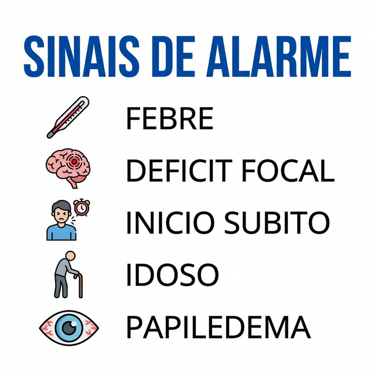
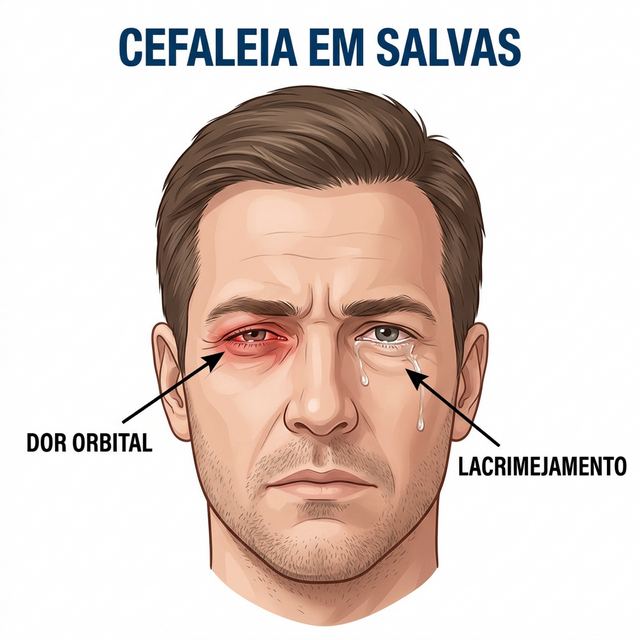
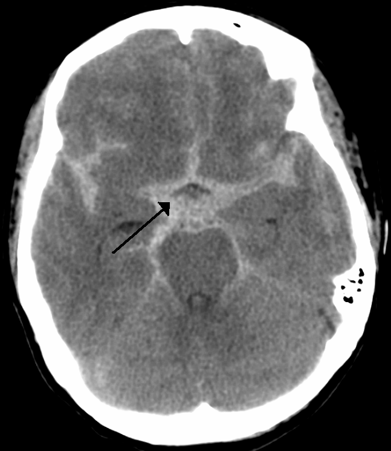
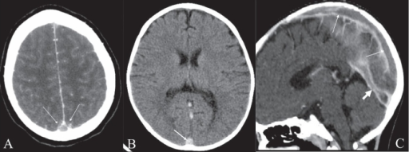
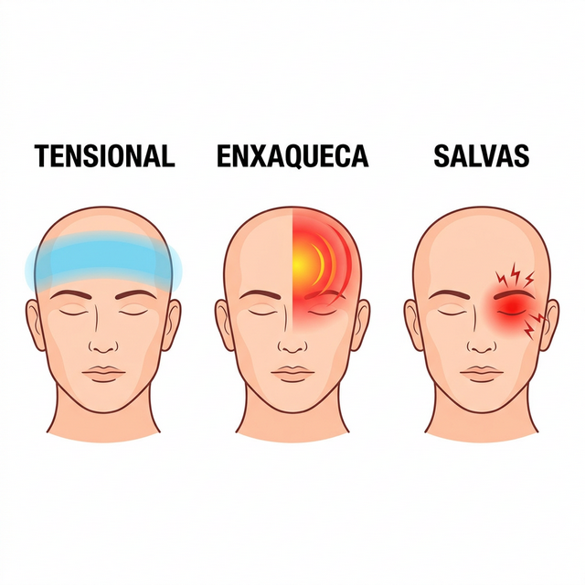

# CEFALEIAS

Para começar nosso estudo, você precisa entender que, em neurologia, o diagnóstico das cefaleias é 90% anamnese. Diferente de uma pneumonia, onde o raio-X te ajuda, ou de um infarto, onde o ECG é soberano, na cefaleia o seu "estetoscópio" é a pergunta certa. As bancas de residência sabem disso e vão testar se você sabe diferenciar uma dor primária, que é a própria doença, de uma dor secundária, que é apenas o sintoma de algo potencialmente fatal.

## A Grande Divisão: Primárias vs. Secundárias

Antes de decorarmos critérios, entenda a lógica. As cefaleias primárias (Migrânea, Tensional, em Salvas) são funcionais. O cérebro é estruturalmente normal, mas há um distúrbio no processamento da dor. Já as secundárias são causadas por "algo" (tumor, sangue, pus, pressão alta no líquor).

O seu primeiro passo diante de qualquer paciente é procurar os sinais de alerta. Se houver um sinal de alerta, você para de pensar em enxaqueca e vai investigar uma causa secundária.

### Sinais de Alarme (O Mnemônico SNOOP4)

As bancas adoram o SNOOP4. Memorize isso, pois é o que define se você pede uma Tomografia (TC) ou se apenas prescreve um analgésico.

- **S (Sistêmicos):** Febre, perda de peso, câncer prévio, HIV. Se o paciente tem câncer de pulmão e começa com cefaleia, você deve pensar em metástase cerebral, não em estresse.

- **N (Neurológicos):** Qualquer déficit focal, alteração de consciência ou papiledema. Se o paciente tem anisocoria com midríase unilateral, suspeite de compressão do III nervo craniano (oculomotor).

- **O (Onset - Início Súbito):** A famosa "Thunderclap headache" ou cefaleia em trovoada. É aquela dor que atinge o pico de intensidade em menos de 1 minuto. Até que se prove o contrário, isso é Hemorragia Subaracnoidea (HSA).

- **O (Older - Idade):** Início de uma nova cefaleia após os 50 anos. Cuidado com a Arterite de Células Gigantes.

- **P1 (Progressiva):** Aquela dor que piora a cada dia, sem períodos de melhora.

- **P2 (Precipitação por Manobra de Valsalva):** Dor que surge ao tossir, espirrar ou evacuar. Sugere hipertensão intracraniana ou malformação de Chiari.

- **P3 (Postural):** Dor que piora muito ao levantar e melhora ao deitar (hipotensão liquórica) ou o contrário (hipertensão intracraniana).

- **P4 (Papiledema):** O achado crucial no fundo de olho que grita "pressão intracraniana aumentada".

**Dica de Prova:** Se a questão descreve uma cefaleia em trovoada, a TC de crânio é o primeiro exame. Se a TC vier normal, você NÃO parou a investigação. Você deve realizar a punção lombar para excluir HSA, pois a TC pode não detectar pequenos volumes de sangue após as primeiras horas.

## Migrânea (Enxaqueca)

A migrânea não é apenas uma "dor de cabeça forte". É um distúrbio neurovascular complexo. O que acontece é uma ativação do sistema trigeminovascular. O nervo trigêmeo libera neuropeptídeos inflamatórios (como o CGRP) que causam vasodilatação e inflamação estéril nas meninges. É por isso que a dor é pulsátil.

### Critérios Diagnósticos (A Regra do 5-4-3-2-1)

Para diagnosticar Migrânea Sem Aura (segundo a ICHD-3), o paciente precisa de:

- **5** ou mais crises na vida.

- **4** horas a **72** horas de duração (se não tratada).

- Pelo menos **2** das seguintes características: Unilateral, Pulsátil, Intensidade moderada/grave, Piora com atividade física rotineira.

- Pelo menos **1** dos seguintes sintomas associados: Náuseas e/ou vômitos, Fotofobia E Fonofobia.

**Cuidado:** Muitos alunos acham que toda enxaqueca tem que ser unilateral. Na verdade, cerca de 40% dos pacientes podem ter dor bilateral. O que mais diferencia da tensional é a náusea e a piora com o esforço.

### Migrânea com Aura

A aura ocorre em cerca de 20 a 30% dos pacientes. É um fenômeno neurológico focal transitório que geralmente precede a dor.

- **Duração:** 5 a 60 minutos. Se durar mais de 60 minutos, chamamos de aura prolongada.

- **Tipo mais comum:** Visual (escotomas cintilantes, pontos luminosos, visão em zigue-zague).

- **Outros tipos:** Sensitiva (parestesias que "caminham" pelo corpo), de linguagem (afasia/disfasia).

**Pegadinha de Prova:** A aura de tronco cerebral (antiga enxaqueca basilar) apresenta sintomas como vertigem, disartria, diplopia e ataxia. Já a amaurose fugaz (perda súbita de visão em um olho) deve te fazer pensar em doença carotídea, não necessariamente em aura típica.

### Tratamento da Crise (Agudo)

Aqui o objetivo é parar a dor rápido. No MedEvo, sempre reforçamos: trate cedo e com dose adequada.

- **Crises Leves a Moderadas:** AINEs (Ibuprofeno 600mg, Naproxeno 500mg) ou Analgésicos simples (Dipirona 1g).

- **Crises Moderadas a Graves:** Triptanos (Sumatriptano, Naratriptano). Eles são agonistas 5-HT 1B/1D e agem inibindo a liberação de CGRP e causando vasoconstrição.

- **Adjuvantes:** Antieméticos (Metoclopramida ou Domperidona). A metoclopramida é excelente porque, além de tratar a náusea, ajuda na motilidade gástrica (que está reduzida na crise) e tem efeito analgésico intrínseco em cefaleias.

- **Na Emergência:** Se o paciente chega com náuseas intensas, usamos Metoclopramida EV + Dexametasona (para prevenir a recorrência da cefaleia nas próximas 72 horas).

**Contraindicação Absoluta dos Triptanos:** Pacientes com doença coronariana, AVC prévio, hipertensão arterial não controlada ou doença vascular periférica. Por quê? Porque eles causam vasoconstrição sistêmica, não apenas cerebral.

### Tratamento Profilático (Preventivo)

Quando indicar? Se o paciente tem 3 ou mais crises por mês que impactam a vida, ou se o tratamento agudo é contraindicado ou ineficaz. O objetivo é reduzir a frequência em pelo menos 50%.

A escolha da droga depende das comorbidades do paciente (isso cai muito!):

- **Paciente Obesa ou com Epilepsia:** Topiramato (ajuda na perda de peso).

- **Paciente com Depressão, Ansiedade ou Insônia:** Amitriptilina (antidepressivo tricíclico).

- **Paciente com Hipertensão ou Tremor Essencial:** Propranolol ou Atenolol.

- **Paciente com Asma ou DPOC:** Evitar Propranolol (risco de broncoespasmo). Prefira Flunarizina ou Topiramate.

- **Migrânea Crônica (>15 dias de dor/mês):** Topiramato é a primeira linha. Toxina botulínica também é uma opção aprovada.

**Tabela 1: Resumo da Profilaxia da Migrânea**

| Medicamento | Dose Inicial | Perfil de Paciente Ideal | Principais Efeitos Colaterais |
| --- | --- | --- | --- |
| Propranolol | 20-40 mg/dia | Hipertenso, ansioso | Bradicardia, fadiga, broncoespasmo |
| Amitriptilina | 10-25 mg/dia | Depressão, insônia, dor tensional associada | Sonolência, boca seca, ganho de peso |
| Topiramato | 25-50 mg/dia | Obeso, epiléptico | Parestesias, alteração de memória, cálculos renais |
| Flunarizina | 5-10 mg/dia | Asmático, vertigem associada | Ganho de peso, parkinsonismo (em idosos) |
| Valproato | 500 mg/dia | Epiléptico | Ganho de peso, queda de cabelo, teratogênico |

## Cefaleia Tipo Tensão (CTT)

É a cefaleia mais comum na população geral, mas a que menos leva o paciente ao consultório (porque ele se automedica).

### Características Clínicas

- **Localização:** Bilateral, em "pressão" ou "aperto" (como uma faixa na cabeça).

- **Intensidade:** Leve a moderada.

- **Duração:** 30 minutos a 7 dias.

- **Sintomas Associados:** Ausência de náuseas ou vômitos. Pode haver fotofobia OU fonofobia, mas nunca as duas juntas.

- **Atividade Física:** NÃO piora com esforço físico (diferente da enxaqueca).

### Tratamento

- **Agudo:** Analgésicos simples (Dipirona, Paracetamol) ou AINEs.

- **Profilático:** Indicado se a forma for crônica (>15 dias/mês por mais de 3 meses). A droga de escolha é a Amitriptilina.

**Erro Comum:** Achar que toda dor bilateral é tensional. Lembre-se da Pérola Clínica 1: Cefaleia >15 dias/mês, bilateral, mas que tem náuseas, pulsatilidade ou piora com esforço, deve ser classificada como Enxaqueca Crônica, não tensional.

## Cefaleias Trigêmino-Autonômicas

Aqui entramos em um grupo de dores unilaterais e muito intensas, acompanhadas de sintomas autonômicos ipsilaterais (do mesmo lado da dor).

### Cefaleia em Salvas (Cluster Headache)

É a "cefaleia do suicídio" devido à intensidade excruciante. Mais comum em homens (diferente da enxaqueca).

- **Quadro Clínico:** Dor unilateral, periorbitária ou temporal, extremamente forte. Dura de 15 a 180 minutos.

- **Sintomas Autonômicos (Ipsilaterais):** Lacrimejamento, congestão nasal, rinorreia, miose, ptose palpebral, edema palpebral.

- **Comportamento:** O paciente fica agitado, anda de um lado para o outro (na enxaqueca, o paciente quer ficar parado no escuro).

- **Periodicidade:** Ocorre em "salvas" (períodos de semanas com crises diárias, seguidos de meses de remissão). Muitas vezes as crises são noturnas, acordando o paciente.

**Tratamento da Crise:**

- **Oxigênio a 100%:** 7 a 12 litros/minuto via máscara facial sem reinalação, por 15 minutos. É a primeira escolha.

- **Sumatriptano Subcutâneo (6mg):** Muito eficaz, age rápido. Triptanos via oral não funcionam bem aqui porque a dor é muito curta e intensa.

**Tratamento Profilático:**

- **Verapamil:** É a droga de primeira escolha (em doses altas, geralmente >240mg/dia). Exige monitorização com ECG devido ao risco de bloqueio atrioventricular.

- **Corticoides (Prednisona):** Usados apenas como "ponte" para parar as crises enquanto o Verapamil não atinge o nível terapêutico.

### Hemicrania Paroxística

Muito parecida com a cefaleia em salvas, mas com duas diferenças fundamentais:

- **Duração:** Mais curta (2 a 30 minutos) e muito mais frequente (mais de 5 crises por dia).

- **Resposta à Indometacina:** É o que as bancas cobram. Se o paciente tem dor unilateral com disautonomia e a dor some completamente com Indometacina, o diagnóstico é Hemicrania Paroxística.

## Cefaleias Secundárias Importantes para Prova

### Hemorragia Subaracnoidea (HSA)

Cefaleia súbita ("a pior da vida"), rigidez de nuca, náuseas e vômitos. Geralmente causada por ruptura de aneurisma sacular.

- **Conduta:** TC de crânio sem contraste imediata. Se negativa e suspeita alta, Punção Lombar (procurar xantocromia).

### Hipertensão Intracraniana Idiopática (Pseudotumor Cerebral)

Perfil clássico: Mulher, jovem, obesa, que apresenta cefaleia, papiledema bilateral e diplopia (por paralisia do VI par craniano - abducente).

- **Diagnóstico:** Neuroimagem normal (para excluir tumores) e Punção Lombar com pressão de abertura aumentada (>25 cmH2O).

- **Tratamento:** Perda de peso e Acetazolamida (reduz a produção de líquor).

### Arterite de Células Gigantes (Arterite Temporal)

Paciente >50 anos, cefaleia nova, claudicação de mandíbula (dor ao mastigar) e hipersensibilidade no couro cabeludo (dor ao pentear o cabelo).

- **Risco:** Cegueira irreversível por oclusão da artéria oftálmica.

- **Diagnóstico:** VHS e PCR muito elevados. O padrão-ouro é a biópsia da artéria temporal.

- **Tratamento:** Corticoide em doses altas IMEDIATAMENTE, antes mesmo do resultado da biópsia se a suspeita for alta.

### Trombose Venosa Central (TVC)

Cefaleia progressiva em paciente com fatores de risco (uso de anticoncepcional oral, tabagismo, puerpério, trombofilias).

- **Sinal Clássico na TC com contraste:** Sinal do Delta Vazio (falha de enchimento no seio sagital superior).

- **Tratamento:** Anticoagulação (mesmo que haja um pequeno componente hemorrágico associado).

### Cefaleia por Uso Excessivo de Medicamentos (Rebote)

Paciente que já tem uma cefaleia primária (geralmente enxaqueca) e usa analgésicos ou triptanos em excesso (>10-15 dias por mês, dependendo da droga). A dor muda de padrão, torna-se diária e o analgésico para de funcionar.

- **Tratamento:** Retirada abrupta da medicação excessiva ("detox") e início imediato de profilaxia adequada.

**Tabela 2: Diagnóstico Diferencial das Cefaleias Primárias**

| Característica | Migrânea | Tensional | Em Salvas |
| --- | --- | --- | --- |
| Localização | Unilateral (60%) | Bilateral | Unilateral (Orbital) |
| Caráter | Pulsátil | Aperto/Peso | Lancinante/Furada |
| Intensidade | Moderada/Grave | Leve/Moderada | Excruciante |
| Sintomas Assoc. | Náusea, Foto/Fonofobia | Raro | Disautonomia |
| Atividade Física | Piora | Não altera | Agitação psicomotora |
| Duração | 4 - 72 horas | 30 min - 7 dias | 15 - 180 min |
| Sexo | Feminino (3:1) | Feminino (1.2:1) | Masculino (3:1) |

## Outras Condições e Nevralgias

### Nevralgia do Trigêmeo

Dor em "choque" ou "facada", extremamente intensa, de curtíssima duração (segundos), em território de um dos ramos do trigêmeo (geralmente V2 ou V3). Gatilhos: tocar o rosto, barbear, vento frio, mastigar.

- **Tratamento de escolha:** Carbamazepina. Oxcarbamazepina é alternativa.

### Herpes Zoster e Nevralgia Pós-Herpética

O vírus Varicella-Zoster pode reativar no gânglio trigeminal. Se houver vesículas no pavilhão auricular e paralisia facial, pensamos em Síndrome de Ramsay Hunt (Herpes Zoster Oticus). A dor que persiste após a cicatrização das lesões é a dor neuropática pós-herpética, tratada com Gabapentina, Pregabalina ou Amitriptilina.

### Cefaleia Hípnica

Conhecida como "cefaleia do despertador". Ocorre exclusivamente durante o sono, acordando o paciente idoso sempre no mesmo horário. É uma dor holocraniana que melhora ao despertar. Curiosamente, o tratamento pode envolver cafeína antes de dormir ou Lítio.

## Exames de Imagem: Quando pedir?

Como professor, vejo muitos alunos pedindo TC para todo mundo "por segurança". Na prova, isso é erro. Segundo as diretrizes, se o paciente tem critérios claros de enxaqueca, exame neurológico normal e nenhum sinal de alarme (SNOOP4), **não se pede imagem**.

Peça imagem se:

- Mudança no padrão da dor (era de um jeito, ficou muito pior ou diferente).

- Primeira ou pior dor da vida.

- Início após os 50 anos.

- Paciente com câncer ou HIV.

- Déficit neurológico focal ou papiledema.

**Dica do Dr. Will:** Em questões de emergência, a TC sem contraste é o exame inicial para ver sangue (HSA) ou efeito de massa. Se você suspeita de Trombose Venosa ou Tumor pequeno, a Ressonância (RNM) com venografia ou contraste é superior.

## Situações Especiais

### Gestação

A maioria das enxaquecas melhora na gestação devido à estabilidade estrogênica. Se houver crise:

- **Primeira linha:** Paracetamol.

- **Segunda linha:** Metoclopramida.

- **Evitar:** AINEs (especialmente no 3º trimestre pelo risco de fechamento do ducto arterioso) e Triptanos (usar apenas se benefício > risco).

- **Contraindicação Absoluta:** Ergotamínicos (causam contração uterina).

### Infância

A enxaqueca na criança costuma ser mais curta (pode durar apenas 1-2 horas) e frequentemente é bilateral (frontal). Sintomas como vômitos cíclicos e vertigem paroxística benigna são considerados precursores da enxaqueca na infância.

## Pontos-Chave para Prova

- **Critério Migrânea:** 5 crises, 4-72h, unilateral, pulsátil, náusea, foto/fonofobia.

- **Sinal de Alarme:** Início súbito (trovoada) = TC de crânio imediata. Se TC normal, fazer Punção Lombar.

- **Cefaleia em Salvas:** Homem, dor orbital excruciante, agitação, lacrimejamento. Tratamento: O2 a 100% e Sumatriptano SC. Profilaxia: Verapamil.

- **Hemicrania Paroxística:** Resposta absoluta à Indometacina.

- **Arterite Temporal:** Idoso, VHS alto, dor ao mastigar. Risco de cegueira. Tratar com Corticoide antes da biópsia.

- **Hipertensão Intracraniana Idiopática:** Mulher obesa, papiledema, TC normal, pressão de líquor alta. Tratamento: Acetazolamida e perda de peso.

- **Trombose Venosa Central:** Sinal do Delta Vazio na TC. Comum em usuárias de anticoncepcional.

- **Profilaxia Migrânea:** Propranolol (evitar em asmáticos), Amitriptilina (bom para insônia/depressão), Topiramato (bom para obesos).

- **Cefaleia por Abuso de Analgésicos:** >15 dias/mês de analgésicos simples ou >10 dias/mês de triptanos/ergotamínicos.

- **Anisocoria com Midríase:** Suspeitar de compressão do III par (aneurisma de comunicante posterior).

- **Sinal do Delta Vazio:** Patognomônico de Trombose de Seio Sagital Superior.

- **Contraindicação Triptanos:** Doença cardiovascular isquêmica (IAM, Angina, AVC).

- **Dexametasona na Crise:** Não tira a dor aguda, mas reduz a taxa de recorrência em 72h.

- **Papiledema:** Sinal tardio de hipertensão intracraniana; sua ausência não exclui HIC aguda.

- **Aura:** Sintoma neurológico focal (geralmente visual) que dura de 5 a 60 minutos.

- **Metoclopramida:** Excelente para enxaqueca na emergência (procinético + antiemético + analgésico). 🧠

 Cópia offline para consulta pessoal.
 Fonte original:
 [https://www.medevo.com.br/material-apoio/ler/45fa5f56-9b6b-47fa-b767-0d18432b9eef](https://www.medevo.com.br/material-apoio/ler/45fa5f56-9b6b-47fa-b767-0d18432b9eef)
