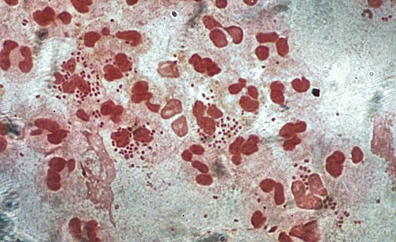
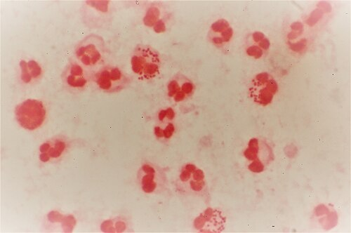

# CERVICITES

Para entender as cervicites, você precisa primeiro visualizar a anatomia do colo do útero. O colo não é uma estrutura homogênea. Ele possui dois tipos de epitélio muito diferentes, e cada patógeno tem o seu "gosto" pessoal por um deles.

O ectocérvice, que é a parte que enxergamos ao exame especular voltada para a vagina, é revestido por epitélio escamoso estratificado, igual à vagina. Já o endocérvice, o canal por onde passa o fluxo menstrual e os espermatozoides, é revestido por epitélio colunar simples (ou cilíndrico).

Por que isso importa? Porque os grandes vilões das cervicites, a *Chlamydia trachomatis* e a *Neisseria gonorrhoeae*, têm tropismo exclusivo pelo epitélio colunar. Portanto, a cervicite propriamente dita é uma inflamação da mucosa do canal cervical (endocervicite). Se a inflamação estiver apenas no ectocérvice, geralmente estamos falando de uma extensão de uma vaginite, como a tricomoníase.

## Etiologia e Fisiopatologia

Quando falamos em cervicite para provas de residência, o seu cérebro deve disparar imediatamente dois nomes: Clamídia e Gonococo. Eles são os agentes clássicos da cervicite mucopurulenta.

### Chlamydia trachomatis

A clamídia é a infecção sexualmente transmissível (IST) bacteriana mais comum no mundo. Ela é um ==parasita intracelular obrigatório.== Isso explica por que ela é tão "silenciosa". Ela n==ão quer matar a célula== hospedeira rápido demais, ela quer se ==replicar.==

Nas provas, a clamídia é a rainha das infecções a==ssintomáticas.== Cerca de 70 a 80% das mulheres infectadas não sentem absolutamente nada. Isso é um perigo, pois a ==falta de sint==omas impede o tratamento, levando a complicações graves como a Doença Inflamatória Pélvica (DIP) e a esterilidade tubária.

*Figura 1 - Coloração de Gram de secreção purulenta mostrando Neisseria gonorrhoeae: diplococo Gram-negativo responsável pela cervicite mucopurulenta. Fonte: Graham Beards, CC BY-SA 4.0 | Wikimedia Commons*

### Neisseria gonorrhoeae

O gonococo é um ==diplococo Gram-negativo intracelular.== Diferente da clamídia, ele costuma ser ==mais "barulhento" e agressivo,== causando uma resposta inflamatória purulenta mais exuberante. Ele também tem uma capacidade incrível de desenvolver resistência a antibióticos, o que mudou as diretrizes de tratamento nos últimos anos.

### Outros Agentes

Embora menos citados como causas primárias de "cervicite" no sentido estrito do canal cervical, não podemos esquecer do *==Trichomonas vaginalis==*==. Ele causa uma ectocervicite intensa.== Sabe aquele aspecto de "colo em framboesa" ou "colo em morango" que você leu nas pérolas clínicas? Isso é clássico da tricomoníase e cai muito em prova.

*Figura 2 - Coloração de Gram de secreção uretral: diplococos Gram-negativos intracelulares (gonococos) no interior de polimorfonucleares, achado diagnóstico clássico. Fonte: Dr Graham Beards, CC BY-SA 4.0 | Wikimedia Commons*

## Quadro Clínico: O que o paciente sente e o que você vê

Muitas vezes, a paciente chega ao consultório com uma queixa inespecífica de corrimento vaginal. O seu papel como médico é diferenciar se esse corrimento vem da vagina (vaginite) ou do colo (cervicite).

Os sintomas cardinais da cervicite são:

- Corrimento cervical mucopurulento (amarelado ou esverdeado).

- Friabilidade cervical: o colo sangra facilmente ao toque da espátula ou do swab (sinusorragia).

- Dispareunia de profundidade (dor no coito).

- Sangramento intermenstrual ou pós-coital.

Cuidado: se a paciente apresentar dor à mobilização do colo do útero ou dor à palpação dos anexos, você já saiu do campo da cervicite isolada e entrou no território da Doença Inflamatória Pélvica (DIP). Como o Dr. Will sempre reforça em suas discussões de caso no MedEvo, a cervicite é, muitas vezes, a porta de entrada para a DIP.

### O Exame Especular

Este é o momento decisivo. Ao colocar o espéculo, você deve observar o orifício externo do colo.

- Se houver saída de secreção purulenta pelo orifício, o diagnóstico de cervicite está feito.

- Se ao passar o swab para coletar material o colo começar a sangrar (friabilidade), isso reforça muito a suspeita de Clamídia ou Gonococo.

- Se você observar petéquias no colo (o tal colo em framboesa), pense em Tricomoníase.

## Diagnóstico Laboratorial

Embora o tratamento muitas vezes seja iniciado de forma empírica (veremos adiante), o diagnóstico de certeza é importante, especialmente em casos recorrentes ou para controle epidemiológico.

### Coloração de Gram

É rápida e barata. O achado patognomônico para ==gonorreia é a presença de diplococos Gram-negativos intracelulares== (dentro dos leucócitos polimorfonucleares).
Atenção: se o Gram mostrar muitos leucócitos, mas nenhum diplococo, a suspeita de Clamídia aumenta consideravelmente (uretrite ou cervicite não gonocócica).

### Testes de Amplificação de Ácidos Nucleicos (NAAT)

Hoje, este é o padrão-ouro. Pode ser feito com material do endocérvice, da vagina ou até da urina. Tem alta sensibilidade e especificidade para ==Clamídia e Gonococo==. Se estiver disponível, deve ser solicitado.

### Cultura

A cultura em meio Thayer-Martin ainda é utilizada para o gonococo, principalmente quando se quer testar a sensibilidade a antibióticos. Para a clamídia, a cultura é difícil e restrita a centros de pesquisa.

| Método | Vantagem | Desvantagem |
| --- | --- | --- |
| **Gram** | Rápido, identifica Gonococo | Baixa sensibilidade para Clamídia |
| **NAAT** | Padrão-ouro, alta sensibilidade | Custo mais elevado |
| **Cultura** | Permite antibiograma (Gono) | Demorado, exige meios especiais |
| **Exame a fresco** | Identifica Trichomonas (flagelados) | Não vê Clamídia/Gono |

## Tratamento: A Abordagem Sindrômica e Etiológica

Aqui é onde a maioria dos alunos se confunde, mas você não vai errar. O Ministério da Saúde do Brasil preconiza a abordagem sindrômica. O que isso significa? Se você viu pus saindo do colo ou se o colo está friável, você trata para os dois principais agentes (Clamídia e Gonococo) na mesma hora. Não se espera o resultado de exames.

### Protocolo Atual (Ministério da Saúde)

Para cervicite não complicada (sem sinais de DIP):

- **Ceftriaxona 500 mg, IM, dose única.** (Cobre o Gonococo).
*Nota de rodapé importante:* Antigamente usava-se 250 mg, mas devido ao aumento da resistência, a dose padrão agora é 500 mg. Algumas questões de prova mais antigas ainda podem trazer 250 mg, mas se houver 500 mg nas opções, marque esta.

- **Azitromicina 1 g, VO, dose única.** (Cobre a Clamídia).
*Alternativa para Clamídia:* Doxiciclina 100 mg, VO, 12/12h por 7 dias. Mas cuidado: a Doxiciclina é contraindicada em gestantes!

### Por que tratar os dois?

Porque a coinfecção é extremamente comum (cerca de 20 a 50% dos casos). Tratar apenas um é deixar a porta aberta para complicações no futuro. Além disso, o tratamento deve ser estendido aos parceiros sexuais dos últimos 60 dias, mesmo que eles não tenham sintomas. Isso evita o efeito "pingue-pongue".

### O que NÃO usar

A Ciprofloxacina não é mais recomendada para o tratamento da gonorreia no Brasil devido às altas taxas de resistência. Se você vir "Cipro" como opção de tratamento para gonococo em uma questão atualizada, pode descartar.

## Situações Especiais

### Gestantes

A gestação muda um pouco o nosso jogo.

- Para Clamídia: Usamos Azitromicina 1g VO dose única. A Doxiciclina é proibida (risco de malformações ósseas e manchas nos dentes do feto).

- Para Gonococo: Ceftriaxona 500 mg IM.

- Se a gestante for alérgica à penicilina/cefalosporinas: A droga de escolha para o gonococo passa a ser a **Espectinomicina** 2g IM (dose única), se disponível.

A infecção por clamídia na gestação é perigosa não só para a mãe, mas para o bebê, podendo causar conjuntivite neonatal e pneumonia tardia no recém-nascido.

### Alergia a Cefalosporinas

Se o paciente não pode usar Ceftriaxona, o manejo se torna complexo. Em alguns casos, utiliza-se a associação de Azitromicina em dose mais alta (2g), mas isso causa muitos efeitos colaterais gastrointestinais e não é o ideal. A Espectinomicina é a alternativa clássica de prova.

## Complicações: O perigo do silêncio

A cervicite não tratada é o primeiro passo para uma cascata de problemas.

- **Doença Inflamatória Pélvica (DIP):** A infecção ascende para o útero, trompas e peritônio.

- **Infertilidade por Fator Tubário:** A clamídia causa uma inflamação crônica que "cicatriza" as trompas (salpingite), impedindo a passagem do óvulo.

- **Gravidez Ectópica:** Trompas danificadas aumentam o risco de o embrião se implantar fora do útero.

- **Dor Pélvica Crônica:** Sequelas de aderências pélvicas.

- **Síndrome de Fitz-Hugh-Curtis:** É uma peri-hepatite gonocócica ou por clamídia. A paciente apresenta dor em hipocôndrio direito e, na laparoscopia, vemos aderências em "corda de violino" entre o fígado e a parede abdominal.

- **Artrite Séptica:** O gonococo pode se disseminar pela corrente sanguínea, causando febre, lesões cutâneas (pústulas) e artrite em grandes articulações.

## Diagnóstico Diferencial de Corrimentos

É fundamental não confundir a cervicite com as vaginites. Veja esta tabela comparativa que resume o que mais cai:

| Característica | Vaginose Bacteriana | Candidíase | Tricomoníase | Cervicite (Gono/Clamídia) |
| --- | --- | --- | --- | --- |
| **Agente** | *Gardnerella vaginalis* | *Candida albicans* | *Trichomonas vaginalis* | *N. gonorrhoeae / C. trachomatis* |
| **Aspecto** | Branco-cinzento, bolhoso | Branco, "leite coalhado" | Amarelo-esverdeado, bolhoso | Mucopurulento (sai do colo) |
| **Odor** | Fétido (peixe podre) | Ausente | Fétido | Pode estar presente |
| **pH Vaginal** | > 4,5 | < 4,5 | > 4,5 | Geralmente normal (se isolada) |
| **Teste do KOH** | Positivo (Whiff test) | Negativo | Pode ser positivo | Negativo |
| **Colo** | Normal | Normal | **Colo em framboesa** | **Friável / Pus no orifício** |
| **Tratamento** | Metronidazol | Antifúngicos (Fluconazol) | Metronidazol | Ceftriaxona + Azitromicina |

## Linfogranuloma Venéreo (LGV)

Embora o tema principal seja cervicite, a *Chlamydia trachomatis* também causa o LGV (sorotipos L1, L2 e L3).
Diferente da cervicite comum, o LGV se manifesta em fases:

- Pápula ou úlcera indolor efêmera (passa despercebida).

- Linfadenopatia inguinal dolorosa (geralmente unilateral) que pode fistulizar por orifício único (sinal do bueiro).

- Proctite (em quem pratica coito anal), com tenesmo, dor anal e hematoquezia.

O tratamento do LGV é mais longo: Doxiciclina 100 mg VO 12/12h por 21 dias.

## Manejo de Parceiros e Seguimento

Não adianta tratar a paciente e deixar o parceiro infectado. A recomendação é tratar todos os parceiros sexuais dos últimos 60 dias. No sistema público, muitas vezes utiliza-se a "Terapia do Parceiro Entregue pelo Paciente" (Patient-Delivered Partner Therapy), onde a paciente leva a receita ou o medicamento para o parceiro.

O teste de cura não é rotineiramente necessário se os sintomas desaparecerem, exceto em gestantes (para garantir que o bebê não será infectado) ou se os sintomas persistirem.

## Exemplo Clínico 1

Paciente, 22 anos, nuligesta, queixa-se de sangramento após as relações sexuais há 2 semanas. Nega dor abdominal ou febre. Ao exame especular: presença de conteúdo mucopurulento em orifício externo do colo uterino. Ao toque vaginal: ausência de dor à mobilização do colo ou palpação de anexos.

**Conduta:** Estamos diante de uma cervicite mucopurulenta clássica. Como não há sinais de DIP (ausência de dor à mobilização), o tratamento é ambulatorial e sindrômico: Ceftriaxona 500 mg IM + Azitromicina 1 g VO. Não esqueça de convocar os parceiros.

## Exemplo Clínico 2

Paciente, 28 anos, gestante (20 semanas), apresenta corrimento amarelado e disúria. Exame especular mostra colo friável e secreção purulenta.

**Conduta:** O diagnóstico é cervicite. Por ser gestante, a Doxiciclina está fora de cogitação. O tratamento deve ser feito com Ceftriaxona 500 mg IM e Azitromicina 1 g VO. Se ela fosse alérgica à penicilina, usaríamos Espectinomicina para o gonococo.

## Pontos-Chave para Prova

- **Cervicite Mucopurulen==ta:==**== Os agentes principais são ==*==Chlamydia trachomatis==*== (mais comum) e ==*==Neisseria gonorrhoeae==*== (mais agressiva).==

- **==Quadro Clínico Típico:==**== Pus saindo pelo orifício== externo do colo e colo friável (sangra ao toque).

- **Sinusorragia:** Sangramento pós-coito é um sinal clássico de cervicite por clamídia.

- **Tratamento Sindrômico (MS):** Ceftriaxona 500 mg IM (dose única) + Azitromicina 1 g VO (dose única).

- **Gonococo no Gram:** Diplococos Gram-negativos intracelulares.

- **Colo em Framboesa/Morango:** Patognomônico de Tricomoníase (tratar com Metronidazol).

- **Ciprofloxacina:** NÃO deve ser usada para gonococo devido à resistência.

- **Gestantes:** NUNCA usar Doxiciclina. Usar Azitromicina para Clamídia.

- **Alergia grave à Penicilina em gestante:** A droga para Gonococo é a Espectinomicina.

- **Complicação Crônica:** A clamídia é a principal causa de infertilidade tubária por salpingite silenciosa.

- **Síndrome de Fitz-Hugh-Curtis:** Peri-hepatite com aderências em "corda de violino" pós-cervicite/DIP.

- **Manejo de Parceiros:** Tratar todos os parceiros dos últimos 60 dias, mesmo que assintomáticos.

- **Diferença Anatômica:** Clamídia e Gonococo infectam o epitélio colunar (endocérvice).

- **Linfogranuloma Venéreo (LGV):** Causado pelos sorotipos L1-L3 da Clamídia; tratamento por 21 dias com Doxiciclina.

- **Artrite Séptica em Jovens:** Sempre suspeitar de disseminação hematogênica de *Neisseria gonorrhoeae*.

- **Erro Comum:** Achar que todo corrimento é vaginite. Se vem do colo, é cervicite e o tratamento é diferente. 🎯

 Cópia offline para consulta pessoal.
 Fonte original:
 [https://www.medevo.com.br/material-apoio/ler/b4c97173-8905-4acb-b380-3f965796957c](https://www.medevo.com.br/material-apoio/ler/b4c97173-8905-4acb-b380-3f965796957c)
