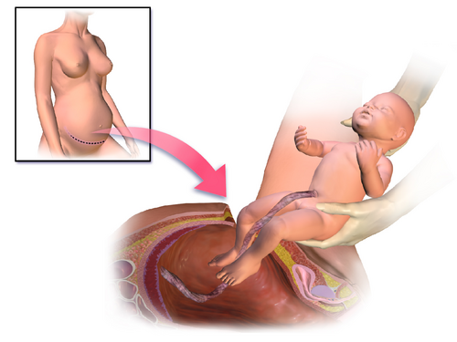
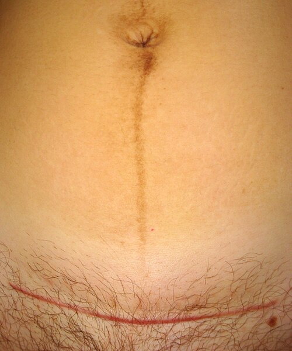

# CESARIANA

A cesariana é, tecnicamente, a transmigração do feto por meio de uma incisão na parede abdominal (laparotomia) e na parede uterina (histerotomia). Mas, para você que está se preparando para a residência, ela é muito mais que uma técnica cirúrgica, é um dos temas mais recorrentes em Obstetrícia, com pegadinhas que moram nos detalhes das indicações e na legislação vigente.

No Brasil, vivemos um cenário de alta prevalência, mas as bancas de prova focam no que é tecnicamente correto e baseado em evidências. Vamos entender o porquê de cada conduta, pois o examinador não quer apenas que você saiba que "faz cesárea", ele quer saber se você entende o risco de uma rotura uterina ou a indicação precisa em uma gestante HIV positiva.

*Figura 1 - Cesariana: ilustração mostrando a extração fetal por laparotomia e histerotomia segmentar transversa. Fonte: BruceBlaus/Blausen Medical, CC BY 3.0 | Wikimedia Commons*

## Indicações de Cesariana: O Divisor de Águas

Este é o ponto onde a maioria dos alunos erra. As bancas adoram confundir indicações absolutas com relativas. Uma indicação absoluta é aquela em que o parto vaginal é impossível ou acarreta risco iminente e altíssimo de morte materna ou fetal.

### Indicações Absolutas

Aqui não há discussão. Se você tentar um parto vaginal nestes cenários, o desfecho será catastrófico.

- **Desproporção Cefalopélvica (DCP):** É a principal indicação absoluta. Ocorre quando o trajeto (pelve) é insuficiente para o objeto (feto). Cuidado: o diagnóstico de DCP real só costuma ser feito durante o trabalho de parto, com dilatação total e sem progressão, exceto em casos de estreitamento pélvico óbvio ou tumores obstrutivos.

- **Placenta Prévia Centro-Total:** Imagine a placenta como uma tampa sobre o colo do útero. Se o colo dilatar, a placenta descola e a hemorragia é maciça. Mesmo que o feto esteja morto, se a placenta for total, a indicação continua sendo cesariana para salvar a mãe da exsanguinação.

- **Apresentações Anômalas:** A apresentação de fronte (onde o feto tenta entrar no canal com o maior diâmetro da cabeça) e a situação transversa (apresentação córmica) tornam o parto vaginal mecanicamente impossível.

- **Herpes Genital Ativo:** Se houver lesão ativa (vesículas ou úlceras) no momento do trabalho de parto ou da ruptura das membranas, a cesariana é mandatória para evitar a transmissão vertical, que pode causar encefalite herpética grave no recém-nascido.

- **Prolapso de Cordão:** Uma emergência absoluta. O cordão sai antes do feto e é comprimido, cortando o oxigênio. A conduta é elevar a apresentação fetal manualmente e correr para a sala de cirurgia.

- **Câncer de Colo Uterino Invasivo:** O parto vaginal pode causar disseminação tumoral e hemorragia incontrolável.

- **Síndrome de Marfan com Dilatação da Raiz da Aorta:** O esforço do puxo no parto vaginal pode causar a dissecção da aorta. Aqui, a cesariana é profilática para a vida da mãe.

### Indicações Relativas

Nesses casos, o parto vaginal pode ser tentado, mas a cesariana é frequentemente escolhida por segurança ou falha na progressão.

- **Cesariana Prévia:** Ter uma cesárea anterior NÃO obriga a uma segunda. O parto vaginal após cesárea (VBAC) é possível e encorajado se a incisão anterior foi segmentar transversa. O risco aqui é a rotura uterina, que é baixo (cerca de 0,5 por cento). No entanto, se a paciente tem duas ou mais cesáreas prévias, a maioria dos protocolos brasileiros recomenda a via alta.

- **Apresentação Pélvica:** Em primigestas ou fetos com mais de 3500g, a chance de cesariana é altíssima. Contudo, pode-se tentar a Versão Cefálica Externa (VCE) a partir de 36 semanas para transformar o pélvico em cefálico.

- **Sofrimento Fetal Agudo (Feto não reativo):** Se a cardiotocografia está alterada, mas o parto é iminente (dilatação total, feto baixo), o parto vaginal assistido (fórceps) pode ser mais rápido que uma cesárea. Por isso, é uma indicação relativa.

| Indicação Absoluta | Indicação Relativa |
| --- | --- |
| Placenta Prévia Total | Cesariana Prévia (1x) |
| Apresentação de Fronte | Apresentação Pélvica |
| Herpes Genital Ativo | Diabetes Gestacional (sem macrossomia) |
| Prolapso de Cordão | Sofrimento Fetal (depende da rapidez do parto) |
| DCP confirmada | Gemelaridade (se o primeiro for cefálico) |

## Aspectos Legais e Éticos: A Resolução do CFM e a Nova Lei da Laqueadura

Este tópico despenca em provas de Preventiva e Obstetrícia. Você precisa conhecer as regras do jogo.

### Cesariana a Pedido Materno

Segundo a Resolução CFM 2232/2019, a gestante tem o direito de escolher a via de parto, desde que devidamente informada sobre riscos e benefícios. No entanto, para garantir a segurança do feto (especialmente a maturidade pulmonar), a cesariana eletiva a pedido só pode ser realizada a partir de **39 semanas de idade gestacional**.

Por que 39 semanas? Porque antes disso, o risco de Taquipneia Transitória do Recém-Nascido (TTRN) e outras complicações respiratórias é significativamente maior. O Dr. Will sempre lembra nas aulas: "A natureza não marcou o tempo de 40 semanas à toa; o pulmão é o último a ficar pronto".

### Esterilização Cirúrgica (Lei 14.443/2022)

Houve uma mudança recente e fundamental na lei da laqueadura que as bancas estão amando cobrar. Esqueça as regras antigas.

- **Idade mínima:** 21 anos OU pelo menos 2 filhos vivos.

- **Consentimento do cônjuge:** NÃO é mais necessário. A autonomia é individual.

- **Prazo:** Deve haver um intervalo mínimo de 60 dias entre a manifestação da vontade e o ato cirúrgico.

- **Laqueadura durante o parto:** Agora é permitida, desde que respeitado o prazo de 60 dias de antecedência e as condições de saúde.

*Figura 2 - Cicatriz de cesariana (incisão de Pfannenstiel) e línea nigra: aspecto pós-operatório típico da incisão transversal suprapúbica. Fonte: Azoreg, CC BY-SA 3.0 | Wikimedia Commons*

## Preparo Pré-Operatório e Riscos Cirúrgicos

Toda gestante saudável é classificada como **ASA 2**. Por que não ASA 1? Porque a gravidez, por si só, impõe alterações fisiológicas (aumento do débito cardíaco, edema de vias aéreas, redução da capacidade residual funcional) que aumentam o risco anestésico.

### Antibioticoprofilaxia

A regra de ouro é a **Cefazolina (2g IV)**. O momento ideal é entre 30 a 60 minutos antes da incisão cutânea. Se a paciente for obesa (IMC > 30), a dose deve ser aumentada para 3g.

E se houver alergia à penicilina?

- Se a alergia for leve (rash sem anafilaxia): Cefazolina ainda pode ser usada (baixo risco de reação cruzada).

- Se a alergia for grave (anafilaxia): Clindamicina associada a um Aminoglicosídeo (Gentamicina).

### Prevenção da Compressão Aortocava

Este é um conceito fisiológico que explica por que nunca deixamos a gestante em decúbito dorsal total. O útero gravídico comprime a veia cava inferior, reduzindo o retorno venoso e causando hipotensão materna e hipóxia fetal. Na mesa cirúrgica, devemos promover o **desvio do útero para a esquerda** (geralmente inclinando a mesa em 15 graus).

## Técnica Cirúrgica: O que a evidência diz?

Muitos alunos se perdem nos nomes das técnicas (Pfannenstiel, Joel-Cohen, Misgav-Ladach). Para a prova, foque no que impacta o desfecho.

- **Incisão de Pele:** A Pfannenstiel (arciforme) é a mais comum pela estética, mas a Joel-Cohen (reta, 3cm acima da sínfise) é tecnicamente mais rápida e associada a menor perda sanguínea.

- **Histerotomia:** A técnica preferencial é a **segmentar transversa (técnica de Kerr)**. Ela é feita na parte mais fina do útero (segmento inferior), o que facilita a sutura e reduz drasticamente o risco de rotura em gestações futuras.

- **Incisão Corporal (Clássica):** É uma incisão vertical no corpo do útero. É raramente usada, exceto em prematuros extremos com segmento inferior não formado, situações transversas com dorso inferior ou placentas prévias com grandes vasos no segmento. **Cuidado:** Uma cesárea corporal prévia é contraindicação ABSOLUTA ao parto vaginal futuro.

- **Fechamento do Peritônio:** A recomendação atual (baseada em grandes estudos como o CAESAR) é de que o fechamento do peritônio (tanto visceral quanto parietal) é **opcional**. Não há evidência de que fechar melhore a cicatrização, e não fechar reduz o tempo cirúrgico e a dor pós-operatória.

- **Sutura do Útero:** Pode ser feita em um ou dois planos. O fechamento em plano único é mais rápido, mas alguns estudos sugerem que o fechamento em dois planos pode conferir maior resistência à cicatriz.

## Situações Especiais e Emergências

### Cesariana Perimortem

Este é o cenário de pesadelo que cai em provas de alto nível. Se uma gestante com mais de 20 semanas (útero acima da cicatriz umbilical) entra em Parada Cardiorrespiratória (PCR), o tempo é o fator determinante.

Se após **4 minutos** de Manobras de Ressuscitação Cardiopulmonar (RCP) efetivas não houver Retorno da Circulação Espontânea (RCE), deve-se iniciar a cesariana imediatamente no local onde a paciente está. O objetivo é realizar o parto até o **5º minuto**.

- **Por que fazemos isso?** Não é apenas pelo feto. Ao retirar o feto e a placenta, eliminamos a compressão da veia cava e reduzimos a demanda metabólica, o que aumenta em até 30 por cento as chances de a mãe ser ressuscitada com sucesso. É uma medida de ressuscitação materna.

### HIV e Transmissão Vertical

A via de parto no HIV depende exclusivamente da **Carga Viral (CV)** coletada a partir da 34ª semana.

| Carga Viral (34 sem) | Conduta de Parto | Manejo Adicional |
| --- | --- | --- |
| Indetectável (< 50 cópias) | Indicação Obstétrica (pode ser vaginal) | Não precisa de AZT IV no parto |
| 50 - 999 cópias | Cesariana Eletiva (38 sem) | AZT IV 3h antes e durante a cirurgia |
| > 1000 cópias ou desconhecida | Cesariana Eletiva (38 sem) | AZT IV 3h antes e durante a cirurgia |

Lembre-se: no parto vaginal de paciente HIV com CV indetectável, devemos evitar procedimentos invasivos (amniotomia, fórceps, episiotomia).

### Rotura Uterina

Diferente da deiscência (que é assintomática), a rotura uterina é uma catástrofe. Os sinais clássicos são:

- **Sinal de Bandl:** Anel de retração separando o corpo do segmento (útero em "ampulheta").

- **Sinal de Frommel:** Ligamentos redondos retesados e desviados para a frente.

- **Sinal de Reasens:** Subida da apresentação fetal ao toque (o feto "foge" para a cavidade abdominal).

- **Dor súbita e lancinante** seguida de parada das contrações e choque materno.

A conduta é laparotomia imediata. No MedEvo, sempre reforçamos: se o feto está fora do útero, a palpação das partes fetais torna-se muito fácil através da parede abdominal.

## Complicações Pós-Operatórias

A cesariana aumenta em 5 a 10 vezes o risco de infecção em comparação ao parto vaginal.

- **Endometrite:** É a causa mais comum de febre no pós-parto. Caracteriza-se pela tríade: Febre + Dor Uterina + Lóquios fétidos. O tratamento é com Clindamicina e Gentamicina IV até a paciente ficar 24-48h afebril.

- **Tromboembolismo Venoso (TEV):** A gestação e a cirurgia são estados pró-trombóticos. Gestantes com fatores de risco (obesidade, idade > 35 anos, imobilização) devem receber tromboprofilaxia mecânica e, muitas vezes, farmacológica (Enoxaparina) no pós-operatório.

- **Fístula Vesico-Uterina (Síndrome de Youssef):** Uma complicação rara da cesárea. A paciente apresenta hematúria cíclica (menúria), amenorreia secundária e perda urinária vaginal.

## Recuperação e Cuidados Neonatais

O manejo moderno (protocolo ERAS - Enhanced Recovery After Surgery) foca na desospitalização segura e rápida.

- **Deambulação precoce:** Deve ocorrer em cerca de 4 a 6 horas após a cirurgia para prevenir TEV.

- **Amamentação:** Deve ser estimulada ainda na primeira hora de vida (Golden Hour), mesmo na sala de parto, se mãe e feto estiverem estáveis.

- **Alojamento Conjunto:** Essencial para o vínculo e sucesso da amamentação.

No recém-nascido, a principal complicação da cesariana eletiva é a **Taquipneia Transitória do Recém-Nascido (TTRN)**. No parto vaginal, a compressão do tórax fetal no canal de parto ajuda a expulsar o líquido pulmonar. Na cesárea, esse mecanismo não ocorre, e o excesso de líquido intersticial causa desconforto respiratório leve a moderado, que geralmente se resolve em 24-48h com suporte de oxigênio.

## Pontos-Chave para Prova 🚀

- **Placenta Prévia Total:** Indicação ABSOLUTA de cesariana, mesmo com feto morto, pelo risco de hemorragia.

- **Herpes Genital:** Cesárea apenas se houver lesão ATIVA no momento do parto. História de herpes sem lesão permite parto vaginal.

- **HIV:** Carga viral > 1000 ou desconhecida = Cesárea eletiva com 38 semanas + AZT IV.

- **Cesárea a Pedido:** Permitida apenas após 39 semanas completas.

- **Laqueadura:** Nova lei permite durante o parto, desde que solicitada 60 dias antes. Não precisa de autorização do marido. Idade mínima 21 anos (ou qualquer idade se tiver 2 filhos).

- **Antibiótico:** Cefazolin 2g (ou 3g se IMC > 30) 30-60 min antes da pele.

- **Peritônio:** O fechamento dos folhetos peritoneais é opcional e não melhora desfechos.

- **DCP:** Diagnóstico clínico durante o trabalho de parto (parada de progressão com contração eficiente e dilatação total).

- **Cesárea Perimortem:** Iniciar após 4 min de RCP sem sucesso; nascimento até o 5º minuto.

- **Apresentação de Fronte:** Indicação absoluta de cesariana (diâmetro occipitomentoniano é incompatível com a pelve).

- **ASA 2:** Classificação de risco de qualquer gestante saudável devido às mudanças fisiológicas da gravidez.

- **Sinal de Reasens:** Subida da apresentação fetal no toque vaginal, indicativo de rotura uterina.

- **TTRN:** Complicação respiratória neonatal mais comum em cesáreas eletivas fora do trabalho de parto.

- **Bariátrica Prévia:** NÃO é indicação de cesariana. O parto vaginal é seguro.

- **Gemelaridade:** Se o primeiro feto for cefálico, pode-se tentar parto vaginal (mesmo que o segundo seja pélvico).

- **Condiloma (HPV):** Não é indicação de cesárea, a menos que as lesões obstruam mecanicamente o canal de parto.

- **GBS Positivo:** Se a paciente vai para cesariana eletiva com membranas íntegras (fora do trabalho de parto), NÃO precisa de profilaxia para Estreptococo do Grupo B.

 Cópia offline para consulta pessoal.
 Fonte original:
 [https://www.medevo.com.br/material-apoio/ler/aa0b6341-d8b5-4d3c-b933-708b85b36b7a](https://www.medevo.com.br/material-apoio/ler/aa0b6341-d8b5-4d3c-b933-708b85b36b7a)
