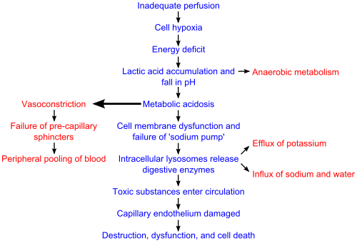

# CHOQUE EM PEDIATRIA

Para entender choque em pediatria, você precisa esquecer a ideia de que "choque é pressão baixa". Se você esperar a pressão cair para diagnosticar choque em uma criança, você chegou tarde demais. O choque é, por definição, um estado de falência circulatória aguda onde a oferta de oxigênio (DO2) não supre a demanda metabólica dos tecidos (VO2).

Na pediatria, o sistema cardiovascular é extremamente resiliente. A criança tem uma reserva funcional fantástica e consegue manter a pressão arterial normal à custa de mecanismos compensatórios intensos, como a taquicardia e a vasoconstrição periférica. Por isso, o diagnóstico é clínico e precoce.

## Fisiopatologia: O Coração da Criança não é um Coração de Adulto Pequeno

Por que a criança se comporta de forma diferente? O débito cardíaco (DC) é o produto do Volume Sistólico (VS) pela Frequência Cardíaca (FC). No adulto, se precisamos aumentar o DC, conseguimos aumentar o volume sistólico (força de contração). Na criança, o miocárdio é imaturo, tem menos elementos contráteis e é menos complacente (mais "rígido").

Isso significa que o volume sistólico da criança é relativamente fixo. Se ela precisa de mais débito, ela só tem uma saída: aumentar a frequência cardíaca. É por isso que a **taquicardia é o sinal mais precoce e confiável de hipoperfusão em pediatria**. Guarde isso, pois as bancas adoram colocar a taquicardia como um sinal inespecífico, mas no contexto de choque, ela é o seu primeiro alerta.

### A Oferta de Oxigênio (DO2)

A oferta depende do Débito Cardíaco e do Conteúdo Arterial de Oxigênio (CaO2). O CaO2, por sua vez, depende da Hemoglobina e da Saturação.

- **Dica do Dr. Will:** Se o seu paciente está em choque séptico, tem uma hemoglobina de 8 g/dL e a saturação venosa central (SvO2) está abaixo de 70%, você precisa transfundir hemácias. Por quê? Porque você precisa melhorar o transporte de oxigênio, e não apenas "empurrar" o sangue com volume.

*Figura 1 - Fisiopatologia celular do choque: representação esquemática dos efeitos da hipoperfusão tecidual a nível celular. Fonte: Premeditated Chaos, CC0 | Wikimedia Commons*

## Classificação do Choque

As provas de residência exigem que você saiba diferenciar os quatro tipos principais de choque. O tratamento de um pode matar o paciente do outro.

### 1. Choque Hipovolêmico

É o mais comum na pediatria brasileira, geralmente causado por desidratação (gastroenterite) ou hemorragia (trauma).

- **Fisiopatologia:** Menos volume circulante -> Menos retorno venoso (pré-carga) -> Queda do Débito Cardíaco.

- **Clínica:** Extremidades frias, TEC prolongado, pulsos finos, mas com pulmão limpo (sem estertores).

### 2. Choque Distributivo

O volume está lá, mas o "continente" (os vasos) aumentou demais. Há uma vasodilatação maciça.

- **Exemplos:** Sepse (mais comum), Anafilaxia, Choque Neurogênico.

- **Choque Séptico:** Pode se apresentar como "Choque Quente" (vasodilatação, TEC rápido, pulsos amplos) ou "Choque Frio" (vasoconstrição compensatória, TEC lento, pulsos finos). Na pediatria, o choque frio é muito mais frequente que no adulto.

- **Choque Neurogênico:** Suspeite em traumas cervicais. A tríade clássica é hipotensão com **bradicardia** (perda do tônus simpático) e pele quente.

### 3. Choque Cardiogênico

O problema é a bomba. O coração não consegue ejetar o sangue.

- **Causas:** Miocardite viral (principal causa adquirida), cardiopatias congênitas, arritmias (TSV).

- **Diferencial Crítico:** Aqui o paciente tem sinais de **congestão**. Se você der 60 mL/kg de soro para uma criança com miocardite, ela vai entrar em edema agudo de pulmão. Procure por hepatomegalia, ritmo de galope (B3), turgência jugular (difícil em lactentes) e estertores crepitantes.

### 4. Choque Obstrutivo

O coração funciona, o volume está lá, mas algo impede o fluxo de sangue.

- **Exemplos:** Tamponamento cardíaco, Pneumotórax hipertensivo, Tromboembolismo Pulmonar (raro em crianças, mas possível em adolescentes).

- **Tríade de Beck (Tamponamento):** Hipotensão, abafamento de bulhas e turgência jugular.

| Tipo de Choque | Pré-carga (PVC) | Contratilidade | Pós-carga (RVS) | Clínica Distintiva |
| --- | --- | --- | --- | --- |
| **Hipovolêmico** | Baixa | Normal/Alta | Alta | Mucosas secas, sem edema |
| **Distributivo** | Baixa/Normal | Normal/Alta | Baixa | TEC rápido (quente) ou lento (frio) |
| **Cardiogênico** | Alta | Baixa | Alta | Hepatomegalia, estertores |
| **Obstrutivo** | Alta | Normal | Alta | Pulso paradoxal, desvio de traqueia |

## Diagnóstico Clínico: O Exame Físico é sua Melhor Ferramenta

O diagnóstico de choque é clínico. Não espere o lactato chegar para agir. O PALS (Pediatric Advanced Life Support) foca na avaliação sistemática:

### Avaliação da Perfusão Tecidual

- **Tempo de Enchimento Capilar (TEC):** O normal é até 2 segundos. Mais que isso indica vasoconstrição (choque frio ou hipovolêmico). Menos de 1 segundo ("flash refill") indica choque quente (distributivo).

- **Pulsos:** Compare os pulsos periféricos (pedioso, radial) com os centrais (braquial, femoral). No choque compensado, o pulso periférico some primeiro.

- **Nível de Consciência:** O cérebro é um órgão nobre. Se a criança está irritável, letárgica ou não reconhece os pais, o choque está afetando a perfusão cerebral.

- **Débito Urinário:** O rim é o "termômetro" do choque. O ideal é > 1 mL/kg/h. Se houver oligúria, há má perfusão renal.

### Choque Compensado vs. Descompensado

Esta é a maior pegadinha de prova.

- **Choque Compensado:** A criança está taquicárdica, com TEC lentificado e pulsos finos, mas a **Pressão Arterial está NORMAL**.

- **Choque Descompensado:** É quando os mecanismos falham e a **Pressão Arterial CAI**. Em pediatria, a hipotensão é um sinal pré-morte.

**Valores de Hipotensão (Percentil 5):**

- 0 a 28 dias: < 60 mmHg

- 1 mês a 1 ano: < 70 mmHg

- 1 a 10 anos: < 70 + (2 x idade) mmHg

-

> 10 anos:

| Parâmetro | Meta |
| --- | --- |
| Tempo de Enchimento Capilar | < 2 segundos |
| Pressão Arterial | Normal para a idade (Percentil > 5) |
| Pulsos | Periféricos presentes e simétricos aos centrais |
| Débito Urinário | > 1 mL/kg/h |
| Nível de Consciência | Alerta, reconhece os pais |
| Lactato Sérico | Tendência de queda |
| Saturação Venosa Central (SvO2) | > 70% |

### Tabela 2: Drogas Vasoativas na Pediatria

| Droga | Dose Inicial | Indicação Principal |
| --- | --- | --- |
| **Adrenalina** | 0,05 - 0,1 mcg/kg/min | Choque Séptico (Frio/Hipotensivo) |
| **Noradrenalina** | 0,05 - 0,1 mcg/kg/min | Choque Séptico (Quente/Vasodilatado) |
| **Dobutamina** | 5 - 20 mcg/kg/min | Choque Cardiogênico (Inotrópico puro) |
| **Milrinone** | 0,25 - 0,75 mcg/kg/min | Choque Cardiogênico com RVS alta |

### Tabela 3: Fórmula de Holliday-Segar (Manutenção Hídrica)

| Peso da Criança | Volume de Líquido (24h) |
| --- | --- |
| Até 10 kg | 100 mL / kg |
| 10 a 20 kg | 1000 mL + 50 mL para cada kg acima de 10 |
| Acima de 20 kg | 1500 mL + 20 mL para cada kg acima de 20 |
| *Lembre-se: No choque, usamos bolus de 20 mL/kg. O Holliday é para depois que o paciente estabilizou.* | |

## Conectando os Pontos: Exemplo Clínico

Imagine um lactente de 10 meses, com história de diarreia há 3 dias, chega ao pronto-socorro letárgico, com olhos encovados, TEC de 5 segundos e pulsos radiais imperceptíveis. A frequência cardíaca é de 190 bpm e a PA é de 65/40 mmHg.

**Análise do MedEvo:**

- **Diagnóstico:** Choque Hipovolêmico Descompensado (PA < 70 para a idade).

- **Conduta Imediata:** Oxigênio, monitorização e acesso vascular.

- **Ação:** Se não conseguir veia em 90 segundos, agulha na tíbia (IO).

- **Expansão:** 200 mL (20 mL/kg) de SF 0,9% em bolus.

- **Reavaliação:** Se após o bolus a FC cair para 150 e o TEC melhorar para 3s, o caminho está certo. Se continuar igual, repita o bolus.

Se esse mesmo lactente tivesse o fígado a 4 cm do rebordo costal e estertores finos na ausculta, o diagnóstico mudaria para Choque Cardiogênico (provável miocardite pós-viral) e o volume seria perigoso. Percebe como um detalhe no exame físico muda tudo?

## Pontos-Chave para Prova

- **Taquicardia** é o sinal mais precoce; **Hipotensão** é sinal tardio e de mau prognóstico.

- **Choque Compensado:** PA normal. **Choque Descompensado:** PA baixa.

- **Acesso Intraósseo:** Indicado após 2 tentativas frustradas ou 90 segundos de busca por acesso venoso no choque.

- **Volume inicial:** 20 mL/kg de cristaloide isotônico (SF 0,9% ou Ringer Lactato).

- **Choque Séptico Pediátrico:** Adrenalina é a droga vasoativa de primeira escolha para a maioria dos casos (choque frio).

- **Choque Cardiogênico:** Evite excesso de fluidos; use inotrópicos (Dobutamina/Milrinone). Procure por hepatomegalia.

- **CAD e Edema Cerebral:** Deterioração neurológica durante o tratamento da CAD sugere edema cerebral. Trate com Manitol ou Salina 3%.

- **Queimaduras:** A diurese é o melhor parâmetro para avaliar se a ressuscitação volêmica está adequada (meta 1 mL/kg/h).

- **Bradicardia no Choque:** Se FC < 60 bpm com má perfusão em lactente/criança, inicie RCP.

- **Acidose Hiperclorêmica:** Complicação comum do uso de grandes volumes de Soro Fisiológico 0,9%.

- **Corticoides na Sepse:** Apenas no choque refratário a catecolaminas com suspeita de insuficiência adrenal.

- **Triade da SHU:** Anemia hemolítica microangiopática + Trombocitopenia + Insuficiência Renal Aguda.

- **Contraindicação Absoluta de Acesso IO:** Fratura no osso onde será realizada a punção ou tentativa prévia de IO no mesmo osso.

- **Saturação Venosa Central (SvO2):** Reflete o balanço entre DO2 e VO2. Meta no choque é > 70%.

- **Lactato:** Marcador de hipoperfusão e metabolismo anaeróbio; útil para avaliar resposta ao tratamento (clearance de lactato). 🩺

 Cópia offline para consulta pessoal.
 Fonte original:
 [https://www.medevo.com.br/material-apoio/ler/5f5132e1-70e0-4af9-940d-c55d102e0393](https://www.medevo.com.br/material-apoio/ler/5f5132e1-70e0-4af9-940d-c55d102e0393)
