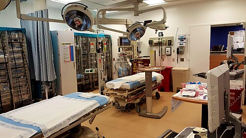
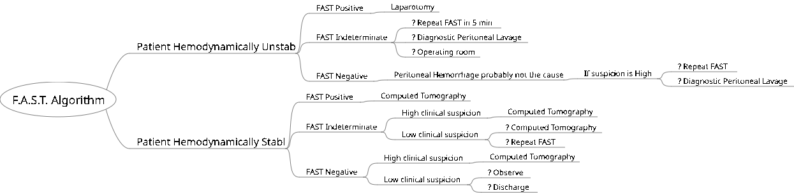

# CHOQUE NO TRAUMA

Para entender o choque no trauma, você precisa esquecer aquela definição simplista de "pressão baixa". Se você esperar a pressão cair para diagnosticar um choque, você chegará atrasado na maioria das vezes. No trauma, choque é, por definição, uma anormalidade do sistema circulatório que resulta em perfusão orgânica e oxigenação tecidual inadequadas.

O que isso significa na prática? Significa que o oxigênio não está chegando na ponta, na célula. E por que isso acontece no trauma? Ou porque o "líquido" saiu (hipovolemia), ou porque a "bomba" falhou (cardiogênico), ou porque o "cano" entupiu (obstrutivo), ou porque o "cano" dilatou demais (neurogênico).

*Figura 1 - Sala de trauma (trauma bay): ambiente preparado com monitores, equipamentos de ressuscitação e acesso vascular para atendimento ao politraumatizado. Fonte: Ppatalano, CC BY-SA 4.0 | Wikimedia Commons*

## Fisiopatologia: O Porquê dos Sinais Clínicos

Quando um paciente começa a sangrar, o corpo não fica parado assistindo. Ele ativa mecanismos compensatórios imediatos. O primeiro deles é a descarga adrenérgica. O aumento de catecolaminas (noradrenalina, adrenalina) causa vasoconstrição periférica.

Por que o paciente fica pálido e com as extremidades frias? Porque o corpo é inteligente: ele retira sangue da pele e dos músculos (órgãos "não nobres") para manter o fluxo no cérebro, coração e rins. Por isso, a taquicardia e a vasoconstrição cutânea são os sinais MAIS PRECOCES do choque hipovolêmico.

Cuidado: muitos alunos acham que o primeiro sinal é a hipotensão. Errado. A pressão arterial é mantida por mecanismos compensatórios até que cerca de 30% do volume sanguíneo tenha sido perdido. Se a pressão caiu, o paciente já está, no mínimo, em um Choque Classe III.

## Classificação do Choque no Trauma

Embora o choque hipovolêmico hemorrágico seja o soberano no trauma, não podemos ter visão de túnel. O ATLS (Advanced Trauma Life Support) nos ensina a olhar para quatro categorias principais:

### 1. Choque Hipovolêmico (Hemorrágico)

É a causa mais comum. No trauma, até que se prove o contrário, todo choque é hemorrágico. Onde o paciente sangra? No "chão" (sangramento externo) ou em quatro cavidades ocultas: tórax, abdome, pelve e ossos longos (fêmur).

### 2. Choque Obstrutivo

Aqui o sangue não consegue circular porque algo bloqueia o fluxo. As duas grandes estrelas das provas são:

- **Pneumotórax Hipertensivo:** O ar acumulado no espaço pleural desvia o mediastino e acotovela as veias cavas, impedindo o retorno venoso.

- **Tamponamento Cardíaco:** O sangue no saco pericárdico impede o enchimento das câmaras cardíacas (diástole).

### 3. Choque Cardiogênico

Ocorre por falha direta da bomba. No trauma, suspeitamos disso em casos de contusão miocárdica (trauma contuso de esterno, como volante no peito) ou infarto agudo do miocárdio precedendo o acidente.

### 4. Choque Neurogênico

Cuidado aqui: não confunda choque neurogênico com choque medular. O choque neurogênico é uma falha hemodinâmica por perda do tônus simpático devido a uma lesão medular alta (geralmente acima de T6).

- **A tríade clássica:** Hipotensão + Bradicardia (ou ausência de taquicardia) + Vasodilatação periférica (extremidades quentes).

## Diagnóstico Diferencial: O Jogo das Jugulares

Esta é a ferramenta mais poderosa que você tem à beira do leito e que as bancas amam cobrar. Imagine um paciente hipotenso após um trauma de tórax. Como diferenciar o choque?

| Achado Clínico | Hipovolêmico | Pneumotórax Hipertensivo | Tamponamento Cardíaco |
| --- | --- | --- | --- |
| **Turgência Jugular** | Veias Colabadas (Vazias) | **Turgência Jugular** | **Turgência Jugular** |
| **Murmúrio Vesicular** | Presente e Simétrico | **Abolido/Diminuído** | Presente e Simétrico |
| **Percussão** | Claro Pulmonar | **Hipertimpanismo** | Claro Pulmonar |
| **Bulas Cardíacas** | Normais | Normais | **Abafadas** |

Percebeu a lógica? Se o paciente está chocado e tem jugular saltada, o problema é obstrutivo ou cardiogênico. Se a jugular está "murcha", o problema é falta de volume (hipovolemia).

## Classificação da Hemorragia (ATLS 10ª Edição Atualizada)\n\n> **Nota de atualização:** Publicações recentes e algumas bancas já simplificam esta classificação em **Leve** (Classe I), **Moderada** (Classe II), **Grave** (Classe III) e **Maciça** (Classe IV). Fique atento ao enunciado da questão para saber qual terminologia a banca adota.

Esta tabela é o "Santo Graal" das provas de residência. Você precisa saber os parâmetros de cor, mas, mais importante, precisa entender a progressão.

| Parâmetro | Classe I | Classe II | Classe III | Classe IV |
| --- | --- | --- | --- | --- |
| **Perda Sanguínea (mL)** | < 750 | 750 - 1500 | 1500 - 2000 | > 2000 |
| **Perda Sanguínea (%)** | < 15% | 15% - 30% | 30% - 40% | > 40% |
| **Frequência Cardíaca** | Normal (<100) | 100 - 120 | 120 - 140 | > 140 |
| **Pressão Arterial** | Normal | Normal | **Diminuída** | **Diminuída** |
| **Pressão de Pulso** | Normal | **Diminuída** | Diminuída | Diminuída |
| **Freq. Respiratória** | 14 - 20 | 20 - 30 | 30 - 40 | > 35 |
| **Base Deficit (mEq/L)** | 0 a -2 | -2 a -6 | **-6 a -10** | **< -10** |
| **Estado Mental** | Leve Ansiedade | Ansiedade Moderada | **Confuso/Agitado** | Letárgico/Comatoso |
| **Débito Urinário** | > 30 mL/h | 20 - 30 mL/h | 5 - 15 mL/h | Desprezível |
| **Conduta Inicial** | Cristalóide | Cristalóide | **Cristalóide + Sangue** | **Protocolo Transfusão Maciça** |

> **📌 NOVIDADE ATLS 11:** O Base Deficit agora é parâmetro oficial da classificação! Útil para identificar gravidade em pacientes com sinais vitais enganosos (idosos, betabloqueados).

**Dica de Ouro do Dr. Will:** A Pressão de Pulso (diferença entre a sistólica e a diastólica) encurta na Classe II. Por quê? Porque a diastólica sobe devido à vasoconstrição periférica compensatória, enquanto a sistólica ainda se mantém. Quando a sistólica cai, já entramos na Classe III.

*Figura 2 - Algoritmo FAST: avaliação ultrassonográfica focada no trauma para identificação rápida de líquido livre intra-abdominal e pericárdico. Fonte: Nevit Dilmen, CC BY-SA 4.0 | Wikimedia Commons*

## Manejo Inicial: O ABCDE do Choque

No trauma, o tratamento do choque acontece simultaneamente à avaliação primária. Não esperamos o diagnóstico definitivo para começar a tratar.

### Acesso Venoso

Onde puncionar? A regra é clara: dois cateteres periféricos de grosso calibre (14 ou 16 Gauge).

- **Onde?** Fossas antecubitais são preferíveis.

- **E se não conseguir?** No adulto, se duas tentativas falharem, partimos para o Acesso Intraósseo (IO) ou Dissecção de Veia Safena (Maléolo Medial). O acesso venoso central (subclávia ou jugular) não é a primeira escolha no choque agudo porque demora mais e tem mais complicações imediatas.

### Reposição Volêmica

Aqui houve uma mudança drástica nos últimos anos. Antigamente, "lavávamos" o paciente com 2 ou 3 litros de soro. Hoje, a tendência é a **reposição restritiva**: bolus de **250 a 500 mL de Cristalóide (Ringer Lactato de preferência)** aquecido, reavaliando a resposta hemodinâmica após cada bolus. O ATLS clássico falava em 1L inicial, mas a prática atual e as atualizações enfatizam volumes menores para evitar a tríade letal.

Por que apenas 1 litro? Porque o excesso de cristalóide causa:

- **Coagulopatia dilucional:** Você dilui os fatores de coagulação que o paciente ainda tem.

- **Acidose hiperclorêmica:** Se usar muito Soro Fisiológico 0,9%.

- **Hipotermia:** Se o soro não estiver aquecido.

- **Aumento do sangramento:** Ao aumentar demais a pressão antes de controlar o furo, você "expulsa" o coágulo que estava se formando (o conceito de Hipotensão Permissiva).

### Ácido Tranexâmico (TXA)

Baseado no estudo CRASH-2, o TXA deve ser administrado em pacientes com sinais de choque hemorrágico ou sangramento importante.

**⏱️ ATLS 11 - Janela Temporal Atualizada:**

-

**Ideal:** Dentro da **primeira hora** após o trauma (máximo benefício)

-

**Aceitável:** Até 3 horas (benefício menor, mas ainda presente)

-

**Após 3 horas:** Contraindicado (aumenta mortalidade!)

-

**Dose:** 1g em bólus (nos primeiros 10 min) + 1g infundido em 8 horas se sangramento persistir.

## Protocolo de Transfusão Maciça (PTM) e Hipotensão Permissiva

**ATLS 11 - Metas de PAM (Hipotensão Permissiva):**

- **Sem TCE/lesão medular:** PAM ≥ 50 mmHg (antes era 65)

- **Com TCE/lesão medular:** PAM ≥ 80 mmHg

> Objetivo: Evitar "expulsar o coágulo" com ressuscitação agressiva antes do controle cirúrgico

Quando o paciente está em Choque Classe IV ou tem um **ABC Score** ≥ 2, ativamos o PTM. O objetivo é repor o que o paciente perdeu: sangue total. Como não temos sangue total disponível facilmente, simulamos ele com **proporções padrão aceitáveis (ATLS 11):**

- **1:1:1** ou **2:1:1** (Concentrado de Hemácias : Plasma Fresco Congelado : Plaquetas)
Ambas as proporções são válidas; a 1:1:1 replica mais fielmente o sangue total.

**O que é o ABC Score?**

- Mecanismo de trauma penetrante (1 ponto)

- PAS ≤ 90 mmHg (1 ponto)

- FC ≥ 120 bpm (1 ponto)

- FAST positivo (1 ponto)
*Se ≥ 2 pontos, chance de precisar de transfusão maciça é alta.*

## A Tríade Letal e o Controle de Danos

O paciente com choque grave morre por uma combinação de três fatores que se retroalimentam: **Hipotermia, Acidose e Coagulopatia**.

Se você levar um paciente nesse estado para uma cirurgia definitiva de 6 horas para reconstruir cada lesão, ele morrerá na mesa de operação. Para isso, inventamos a **Cirurgia de Controle de Danos**:

- **Fase 1 (Bloco):** Laparotomia rápida para controle de hemorragia (packing/tamponamento) e controle de contaminação (grampeamento de alças). Não se faz anastomose aqui! Fecha-se a pele ou deixa-se em peritoniostomia.

- **Fase 2 (UTI):** Aquecimento, correção da coagulopatia, estabilização hemodinâmica.

- **Fase 3 (Bloco):** Retorno após 24-48h para reparo definitivo.

## Avaliação da Resposta à Reanimação

Como saber se o que estamos fazendo está funcionando? Não olhe apenas para a pressão. O melhor parâmetro de perfusão orgânica à beira do leito é o **Débito Urinário**.

- **Adultos:** 0,5 mL/kg/h

- **Crianças:** 1,0 mL/kg/h

- **Lactentes (<1 ano):** 2,0 mL/kg/h

Além disso, monitoramos o Lactato e o Déficit de Bases (Base Excess). Se o lactato está caindo, a perfusão está melhorando.

| Tipo de Resposta | Sinais Vitais | Perda Sanguínea Estimada | Necessidade de Sangue |
| --- | --- | --- | --- |
| **Resposta Rápida** | Voltam ao normal | Pequena (10-20%) | Baixa (apenas tipagem) |
| **Resposta Transitória** | Melhora, mas depois cai | Moderada/Persistente (20-40%) | **Alta (Sangue Tipo-específico)** |
| **Sem Resposta** | Permanecem anormais | Grave (>40%) | **Imediata (Sangue O Negativo)** |

**Pegadinha de Prova:** Se o paciente tem resposta transitória, ele ainda está sangrando! Você precisa identificar o foco e, provavelmente, ele precisará de intervenção cirúrgica ou angioembolização.

## Situações Especiais: Onde o Aluno Erra

### O Idoso

O idoso é o "traiçoeiro" do trauma. Ele pode estar chocado com uma frequência cardíaca de 80 bpm. Por quê? Porque ele pode usar betabloqueadores ou ter um marcapasso. Além disso, a reserva fisiológica é menor; uma pequena perda volêmica causa uma queda abrupta na perfusão.

### O Atleta

O atleta tem um tônus vagal muito alto. A frequência cardíaca basal dele pode ser 45 bpm. Se ele chegar com 90 bpm, ele pode estar extremamente taquicárdico para o padrão dele, mas o aluno desatento achará que "está normal".

### A Gestante

A gestante tem um volume plasmático aumentado em até 50%. Ela pode perder 1,5L de sangue e manter sinais vitais normais, enquanto o feto já está em sofrimento por hipóxia. No trauma na gestante, tratamos a mãe agressivamente para salvar o feto. Outro detalhe: a partir do segundo trimestre, o útero gravídico comprime a veia cava inferior. Sempre incline a prancha para a esquerda (15-30 graus) para melhorar o retorno venoso.

### Hipocalcemia na Transfusão

Se você fizer muitas bolsas de sangue (transfusão maciça), o citrato presente nas bolsas (que serve para o sangue não coagular no estoque) vai quelar o cálcio do paciente. O resultado é hipocalcemia, que causa depressão miocárdica e piora a coagulopatia. Por isso, no PTM do MedEvo, sempre lembramos de repor Gluconato de Cálcio.

## Trauma Abdominal e Choque

Se o paciente tem trauma abdominal contuso e está instável, o órgão mais provável de estar sangrando é o **Baço**, seguido pelo Fígado.

- **Conduta no Trauma Contuso + Instabilidade:** FAST ou Lavado Peritoneal Diagnóstico (LPD). Se positivo -> Laparotomia.

- **Conduta no Trauma Penetrante + Instabilidade:** Não perde tempo com exame de imagem. É Laparotomia Exploradora imediata.

## Choque Neurogênico vs. Choque Medular

Essa confusão é clássica.

- **Choque Medular:** É um fenômeno neurológico. Perda de reflexos e flacidez abaixo da lesão após trauma medular. Não é um estado hemodinâmico.

- **Choque Neurogênico:** É um fenômeno hemodinâmico. Ocorre por perda do tônus simpático (vasodilatação).

- **Diferencial:** No choque neurogênico, o paciente está hipotenso, mas a pele está quente e seca (pela vasodilatação) e ele não faz taquicardia compensatória (está bradicárdico ou normocárdico).

## Síndrome do Compartimento Abdominal (SCA)

Após uma reanimação volêmica vigorosa, as alças intestinais e o retroperitônio podem inchar (edema). Se fecharmos a fáscia sob tensão, a pressão intra-abdominal (PIA) sobe.

- **Definição de SCA:** PIA > 20 mmHg + Disfunção de órgãos (ex: queda do débito urinário, aumento da pressão inspiratória no ventilador, queda do débito cardíaco).

- **Tratamento:** Descompressão abdominal (Laparotomia) e deixar em peritoniostomia (bolsa de Bogotá ou curativo a vácuo).

## Pontos-Chave para Prova

- **Sinal mais precoce do choque:** Taquicardia e vasoconstrição cutânea (extremidades frias).

- **Hipotensão:** Sinal tardio, surge apenas na Classe III (perda > 30% ou 1500mL).

- **Choque + Jugular Turgida:** Pensar em Pneumotórax Hipertensivo ou Tamponamento Cardíaco.

- **Choque + Jugular Colabada:** Pensar em Hipovolemia.

- **Tríade de Beck (Tamponamento):** Hipotensão + Bulas Abafadas + Estase Jugular.

- **Tratamento inicial do choque hemorrágico:** 1 Litro de cristalóide aquecido + Ácido Tranexâmico (se < 3h).

- **Melhor parâmetro de resposta à reanimação:** Débito urinário (0,5 mL/kg/h no adulto).

- **Tríade Letal:** Acidose, Hipotermia e Coagulopatia.

- **Transfusão Maciça:** Proporção 1:1:1 (Hemácias, Plasma, Plaquetas).

- **Hipotensão Permissiva:** Manter PAS em torno de 80-90 mmHg até que o sangramento seja controlado cirurgicamente. **Contraindicada em pacientes com TCE** (o cérebro precisa de pressão de perfusão).

- **Choque Neurogênico:** Hipotensão + Bradicardia + Extremidades Quentes.

- **Cricotiroidostomia:** Indicada em trauma facial grave onde a intubação orotraqueal é impossível.

- **Fratura de Bacia:** Pode causar choque hemorrágico maciço por sangramento retroperitoneal (plexo venoso).

- **O que NÃO fazer:** Não perca tempo com Tomografia em paciente instável. Se o paciente não estabiliza, o diagnóstico é clínico/FAST e o destino é o Centro Cirúrgico ou Angiografia.

- **Lactato e Base Excess:** Marcadores indiretos de dívida de oxigênio e gravidade do choque.

- **Cálcio:** Deve ser monitorado e reposto durante protocolos de transfusão maciça para evitar depressão miocárdica. 🩸

 Cópia offline para consulta pessoal.
 Fonte original:
 [https://www.medevo.com.br/material-apoio/ler/cf663eab-e28f-4251-a6e5-7f09e68ab2b7](https://www.medevo.com.br/material-apoio/ler/cf663eab-e28f-4251-a6e5-7f09e68ab2b7)
