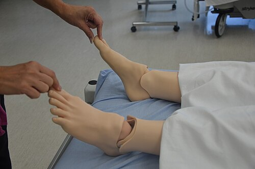
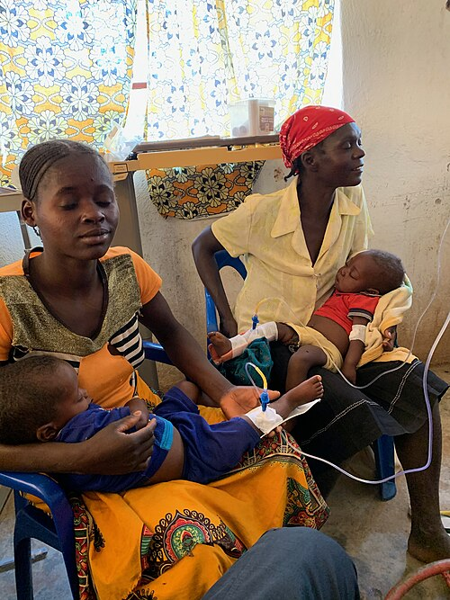

# CHOQUE PEDIÁTRICO

Para entender o choque em pediatria, você precisa esquecer a ideia de que "choque é igual a pressão baixa". Se você esperar a pressão cair para diagnosticar choque em uma criança, você chegou tarde demais. O choque é, por definição, um estado de **falência circulatória aguda** onde a oferta de oxigênio (DO2) não supre a demanda metabólica dos tecidos (VO2).

O corpo da criança é uma máquina de compensação fantástica. Ela aumenta a frequência cardíaca e fecha a periferia (vasoconstrição) com uma eficiência muito maior que a do adulto. Por isso, a pressão arterial é o último parâmetro a se alterar. Quando a pressão cai, os mecanismos de compensação exauriram.

## Fisiopatologia: O "Porquê" dos Sinais Clínicos

A oferta de oxigênio depende do Conteúdo Arterial de Oxigênio (CaO2) e do Débito Cardíaco (DC). O débito cardíaco, por sua vez, é o produto da Frequência Cardíaca (FC) pelo Volume Sistólico (VS).

Diferente do adulto, o coração da criança tem uma complacência limitada. O ventrículo é mais "rígido" e tem menos reserva contrátil. Isso significa que a criança não consegue aumentar muito o seu volume sistólico. Para aumentar o débito cardíaco, ela depende quase exclusivamente da **Frequência Cardíaca**.

É por isso que a **taquicardia** é o sinal mais precoce e universal do choque pediátrico. Se uma criança está doente e taquicárdica, ela está em choque até que se prove o contrário.

### A Progressão do Choque

- **Choque Compensado:** O organismo mantém a Pressão Arterial (PA) dentro da normalidade através da taquicardia e do aumento da resistência vascular sistêmica (vasoconstrição). Você verá sinais de má perfusão periférica (TEC lentificado, pulsos finos), mas a PA estará normal.

- **Choque Descompensado (Hipotensivo):** Os mecanismos falham. A PA cai. Aqui, o risco de parada cardiorrespiratória é iminente.

- **Choque Irreversível:** Lesão orgânica permanente, falência de múltiplos órgãos e morte, independentemente das manobras terapêuticas.

*Figura 1 - Teste de enchimento capilar (TEC): técnica de avaliação da perfusão periférica por compressão digital. TEC > 2 segundos indica hipoperfusão tecidual. Fonte: Glynda Rees Doyle e Jodie Anita McCutcheon, CC BY 4.0 | Wikimedia Commons*

## Avaliação Inicial: O Triângulo de Avaliação Pediátrica (TAP)

Antes de encostar a mão no paciente, você faz o TAP. É uma avaliação visual e auditiva de 30 segundos que nos diz "quão doente" a criança está.

- **Aparência:** Avalia o SNC (tônus, interatividade, olhar, choro). Se está hipoativa ou letárgica, o cérebro não está sendo perfundido.

- **Trabalho Respiratório:** Avalia a tentativa de compensar uma acidose metabólica (taquipneia) ou a presença de insuficiência respiratória primária.

- **Circulação Cutânea:** Palidez, livedo reticular ou cianose.

Se o TAP mostrar alteração na Circulação + Aparência, você está diante de um choque provável. No MedEvo, sempre reforçamos: alteração de consciência em criança desidratada ou febril é sinal de alerta vermelho para choque.

## Classificação Etiológica do Choque

As bancas de residência amam classificar o choque. Você precisa saber o que está acontecendo com a pré-carga, a contratilidade e a pós-carga em cada um.

### 1. Choque Hipovolêmico

É o mais comum na pediatria brasileira, geralmente por desidratação (diarreia/vômitos) ou hemorragia.

- **Fisiopatologia:** Queda drástica da pré-carga (volume intravascular).

- **Clínica:** Taquicardia, pulsos finos, Tempo de Enchimento Capilar (TEC) > 2 segundos, extremidades frias, oligúria e mucosas secas.

- **Dica de Prova:** Se a questão trouxer um lactente com **vômito bilioso**, dor abdominal e sonolência, pense em **invaginação intestinal** levando ao choque obstrutivo/hipovolêmico.

### 2. Choque Distributivo

O volume está lá, mas o "continente" (vasos) dilatou demais ou o líquido vazou para o terceiro espaço.

- **Causas:** Sepse (mais comum), anafilaxia e choque neurogênico.

- **Choque Séptico "Quente":** Fase inicial. Vasodilatação periférica, pulsos amplos (saltitantes), TEC rápido (< 1 seg) e extremidades quentes. É a única forma de choque que pode se apresentar com pele quente inicialmente.

- **Choque Séptico "Frio":** Evolução da sepse. Vasoconstrição compensatória, TEC lentificado e extremidades frias.

### 3. Choque Cardiogênico

O problema é a "bomba".

- **Causas:** Miocardites, arritmias, cardiopatias congênitas e, um clássico de prova, o **Escorpionismo grave**.

- **Clínica:** Taquicardia, sinais de congestão (hepatomegalia, turgência jugular - difícil de ver em lactentes, estertores crepitantes).

- **Cuidado:** Se você der muito volume (20 mL/kg) para um choque cardiogênico, você pode causar Edema Agudo de Pulmão (EAP).

### 4. Choque Obstrutivo

Impedimento físico ao débito cardíaco.

- **Causas:** Tamponamento cardíaco, pneumotórax hipertensivo e lesões ducto-dependentes no período neonatal (quando o canal arterial fecha).

| Tipo de Choque | Pré-carga | Contratilidade | Pós-carga (RVS) | TEC |
| --- | --- | --- | --- | --- |
| **Hipovolêmico** | ↓↓ | Normal/↑ | ↑ (Compensatória) | Lentificado |
| **Distributivo (Fase Inicial)** | Normal/↓ | Normal/↑ | ↓↓ (Vasodilatação) | Rápido ("Flash") |
| **Cardiogênico** | ↑ (Congestão) | ↓↓ | ↑ (Compensatória) | Lentificado |

*Figura 2 - Acesso intraósseo (IO) em paciente pediátrico: via de acesso vascular de emergência na tíbia proximal, indicada quando o acesso periférico não é obtido em 90 segundos. Fonte: Tim Kubacki, CC BY 2.0 | Wikimedia Commons*

## O Manejo Prático: Protocolo ABCDE

O Dr. Will sempre diz: "No choque, o tempo é tecido". A cada minuto de choque não revertido, a mortalidade sobe exponencialmente.

### A - Vias Aéreas

Garanta que a via aérea está pérvia. Se houver rebaixamento de consciência (Glasgow < 8), considere intubação.

### B - Boa Ventilação

**O2 a 100% para todos.** Por quê? Mesmo que a saturação esteja 98%, o choque é um problema de entrega de oxigênio. Queremos maximizar o oxigênio dissolvido no plasma.

- **Atenção:** Se a criança tiver sinais de insuficiência respiratória iminente (bradicardia, exaustão), a intubação deve ser imediata.

### C - Circulação (Onde a mágica acontece)

- **Acesso Vascular:** Tente dois acessos venosos periféricos calibrosos. Se não conseguir em 90 segundos ou 3 tentativas, parta para a **Intraóssea (IO)**. Não perca tempo tentando acesso central em criança chocada.

- **Expansão Volêmica:** O padrão-ouro é o **Cristaloide Isotônico** (Soro Fisiológico 0,9% ou Ringer Lactato).

- **Dose:** 20 mL/kg em 5 a 20 minutos.

- **Repetição:** Pode-se repetir até 3 vezes (totalizando 60 mL/kg), reavaliando sempre após cada bolus.

- **Exceção:** No choque cardiogênico ou trauma cranioencefálico, usamos volumes menores (5-10 mL/kg) e com mais cautela.

- **Drogas Vasoativas:** Se após 40-60 mL/kg a criança continua chocada (choque fluido-refratário), iniciamos aminas.

- **Adrenalina:** Preferencial no choque frio (ajuda na contratilidade e faz vasoconstrição).

- **Noradrenalina:** Preferencial no choque quente (vasoconstrição pura).

- **Dobutamina:** Usada no choque cardiogênico (ex: escorpionismo grave).

### D - Disfunção Neurológica

Avalie a escala de coma de Glasgow e a reatividade pupilar.

### E - Exposição e Controle de Temperatura

Procure por petéquias, púrpuras (pense em meningococcemia/sepse) e sinais de trauma. Mantenha a criança aquecida para evitar a tríade da morte (acidose, coagulopatia e hipotermia).

## Situações Específicas que Caem em Prova

### 1. Desidratação Grave (Plano C da OMS)

As bancas adoram confundir a expansão do choque com o Plano C. Segundo o Ministério da Saúde e a SBP:

- **Menores de 1 ano:** 30 mL/kg em 1 hora + 70 mL/kg em 5 horas.

- **Maiores de 1 ano:** 30 mL/kg em 30 min + 70 mL/kg em 2,5 horas.

- **Pérola Clínica:** Se a criança está em choque (hipotensa, letárgica), você faz os 20 mL/kg rápidos do PALS *antes* de iniciar a contagem do Plano C.

### 2. Dengue Grave

O choque na dengue é distributivo por extravasamento plasmático (aumento da permeabilidade capilar).

- **Sinais de Alarme:** Dor abdominal intensa, vômitos persistentes, acúmulo de líquidos (ascite, derrame pleural), hipotensão postural, hepatomegalia > 2cm.

- **Manejo:** Hidratação venosa imediata com 20 mL/kg em 20 minutos. Na dengue, o uso de corticoides é **contraindicado**.

### 3. Escorpionismo

No Brasil, o escorpião amarelo (*Tityus serrulatus*) causa uma tempestade autonômica.

- **Mecanismo:** Liberação maciça de catecolaminas.

- **Quadro Grave:** Vômitos profusos (sinal de gravidade!), hipertensão seguida de choque cardiogênico, edema agudo de pulmão e arritmias.

- **Tratamento:** Soro antiescorpiônico + Dobutamina para o choque cardiogênico. **Evite hidratação agressiva** aqui, pois o coração está falhando.

### 4. Anafilaxia

Choque distributivo por liberação de histamina.

- **Conduta Imediata:** **Adrenalina IM** (vasto lateral da coxa). Dose: 0,01 mg/kg (máximo 0,3mg em crianças e 0,5mg em adolescentes).

- **Por que IM e não SC?** A absorção IM é muito mais rápida e confiável no choque.

- **Diagnóstico:** Dosagem de **Triptase sérica** pode confirmar o evento a posteriori.

### 5. Queimaduras

O choque aqui é misto (hipovolêmico e distributivo).

- **Fórmula de Parkland:** 2 a 4 mL x Peso x % Superfície Corpórea Queimada.

- **Regra:** Metade do volume nas primeiras 8 horas (contadas a partir do momento da queimadura, não da chegada ao hospital) e a outra metade nas 16 horas seguintes.

- **Importante:** Além do Parkland, a criança precisa da **hidratação de manutenção** (Regra de Holliday-Segar).

## Diagnóstico Diferencial e Exames Complementares

Não espere exames para tratar o choque, mas peça-os para guiar a terapia:

- **Glicemia Capilar:** Obrigatório. Crianças têm pouca reserva de glicogênio e fazem hipoglicemia rapidamente no estresse.

- **Gasometria Arterial:** Avalia acidose metabólica e lactato. O lactato é um marcador de hipóxia tecidual; se ele está caindo, seu tratamento está funcionando.

- **Eletrólitos:** Cuidado com a hiponatremia. Crianças doentes secretam muito ADH, o que retém água livre. Por isso, **nunca use soluções hipotônicas** (como soro glicosado puro ou soro a 0,45%) na fase de expansão.

- **Hemograma e Culturas:** Se houver suspeita de sepse. Na meningococcemia, o choque pode ser fulminante (Síndrome de Waterhouse-Friderichsen: choque + púrpura + insuficiência adrenal).

## Tabelas Comparativas para Memorização

### Tabela 1: Definição de Hipotensão por Idade (Percentil 5)

*Esses valores definem o Choque Descompensado.*

| Idade | Pressão Sistólica (mmHg) |
| --- | --- |
| 0 a 28 dias (Neonatos) | < 60 |
| 1 mês a 12 meses (Lactentes) | < 70 |
| 1 a 10 anos | < 70 + (2 x idade em anos) |
| > 10 anos | < 90 |

### Tabela 2: Sinais Clínicos de Desidratação (OMS/SBP)

| Sinal | Desidratação Leve/Moderada | Desidratação Grave (Choque) |
| --- | --- | --- |
| **Consciência** | Irritado, alerta | Letárgico, comatoso |
| **Sede** | Bebe avidamente | Não consegue beber |
| **Olhos** | Fundos | Muito fundos |
| **Sinal da Prega** | Desaparece lentamente (< 2s) | Desaparece muito lentamente (> 2s) |
| **Pulso** | Rápido, mas palpável | Débil ou ausente |

### Tabela 3: Drogas Vasoativas na Emergência Pediátrica

| Droga | Indicação Principal | Dose Inicial |
| --- | --- | --- |
| **Adrenalina** | Choque Frio / Anafilaxia / PCR | 0,05 - 0,3 mcg/kg/min (EV) |
| **Noradrenalina** | Choque Quente (Vasodilatado) | 0,05 - 0,5 mcg/kg/min |
| **Dobutamina** | Choque Cardiogênico | 2 - 20 mcg/kg/min |

## Erros Comuns e Pegadinhas de Prova

- **Atrasar o Antibiótico:** No choque séptico, o antibiótico deve ser feito na primeira hora. Não espere a coleta de líquor (punção lombar) se o paciente estiver instável. Estabilize primeiro, trate depois.

- **Uso de Bicarbonato:** Não se usa bicarbonato de rotina na acidose do choque. A acidose é resolvida com volume e melhora da perfusão. O bicarbonato pode piorar a acidose intracelular e desviar a curva de dissociação da hemoglobina.

- **Corticoides na Dengue:** Erro clássico. São contraindicados. Já na insuficiência adrenal ou choque séptico refratário a catecolaminas, podem ser considerados (Hidrocortisona).

- **Achar que Pressão Normal exclui Choque:** Lembre-se do choque compensado. O TEC > 2s e a taquicardia são seus melhores amigos no diagnóstico precoce.

- **Síncope vs. Choque:** A síncope é uma perda transitória da consciência com recuperação espontânea. Se a criança desmaiou e não acordou ou está mal perfundida, não é síncope, é choque. Síncope durante exercício físico sempre exige investigação cardíaca (arritmias, miocardiopatia hipertrófica).

## Pontos-Chave para Prova 🩺

- **Prioridade Absoluta:** Estabilização hemodinâmica (ABCDE) antes de qualquer exame de imagem ou laboratorial.

- **Expansão Volêmica:** Cristaloide isotônico (SF 0,9%) 20 mL/kg em 5-20 min. Repetir conforme necessidade e resposta clínica.

- **Acesso na Emergência:** Se não conseguir acesso venoso periférico rápido, a via **Intraóssea** é a escolha imediata.

- **Hipotensão:** É um sinal tardio de choque em pediatria. Sua ausência não exclui o diagnóstico.

- **Choque Séptico Quente:** Caracterizado por TEC rápido (< 1s), pulsos amplos e extremidades quentes (vasodilatação).

- **Choque Séptico Frio:** Caracterizado por TEC lentificado (> 2s), pulsos finos e extremidades frias (vasoconstrição).

- **Escorpionismo Grave:** Causa choque cardiogênico e EAP. O tratamento envolve soro específico e inotrópicos (Dobutamina), evitando excesso de fluidos.

- **Anafilaxia:** O tratamento de primeira escolha é **Adrenalina IM** imediata. Corticoides e anti-histamínicos são medicações de segunda linha.

- **Dengue:** Sinais de choque incluem PA convergente (diferença entre sistólica e diastólica ≤ 20 mmHg) e dor abdominal intensa.

- **Invaginação Intestinal:** Suspeitar em lactentes com dor abdominal em cólica, vômitos biliosos e "fezes em geleia de morango" (sinal tardio).

- **Queimaduras:** Parkland (2-4 mL/kg/%SCQ) + Hidratação de manutenção (Holliday).

- **Contraindicação Absoluta:** Nunca use soluções hipotônicas para expansão volêmica no choque devido ao risco de edema cerebral e hiponatremia dilucional.

- **Meta Terapêutica:** TEC < 2s, pulsos normais, débito urinário > 1 mL/kg/h e melhora do nível de consciência.

- **Afogamento:** A complicação pré-hospitalar mais comum é o vômito. No Grau 4 (sem pulso), a prioridade é RCP de alta qualidade.

- **Meningococcemia:** Se houver choque e púrpura, inicie Ceftriaxone IV imediatamente. Não atrase para realizar exames.

- **Síncope Vasovagal:** Diagnóstico diferencial comum em adolescentes. Ocorre por ortostatismo ou estresse, com pródromos (tontura, visão turva) e recuperação rápida.

Este material resume as condutas baseadas nas diretrizes da Sociedade Brasileira de Pediatria (SBP) e no protocolo PALS (American Heart Association). Ao revisar esses conceitos, você estará preparado para enfrentar as questões mais complexas de urgência pediátrica. No MedEvo, nosso foco é que você entenda a fisiologia para nunca mais precisar decorar condutas isoladas.

 Cópia offline para consulta pessoal.
 Fonte original:
 [https://www.medevo.com.br/material-apoio/ler/19535ce8-a7cd-45a9-832c-c54f3b751845](https://www.medevo.com.br/material-apoio/ler/19535ce8-a7cd-45a9-832c-c54f3b751845)
