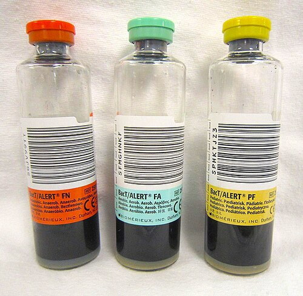

# CHOQUE: RECONHECIMENTO E PROTOCOLO INICIAL

Para começar nossa conversa, esqueça a ideia de que choque é sinônimo de pressão baixa. Se você esperar a hipotensão aparecer para diagnosticar o choque, você chegará atrasado na maioria das vezes. Como costumamos discutir no MedEvo, o choque é, antes de tudo, um fenômeno **celular**.

O choque é definido como um estado de **hipoperfusão tecidual generalizada**. Isso significa que o oxigênio que chega na ponta (a oferta de O2 ou DO2) é insuficiente para o que a célula precisa consumir (a demanda de O2 ou VO2). Quando essa conta não fecha, a célula para de fazer metabolismo aeróbico e passa a fazer metabolismo anaeróbico, gerando lactato e acidose. É aqui que a falência orgânica começa.

## A Fisiopatologia: Por que o paciente choca?

Para entender o choque, você precisa dominar uma fórmula simples: **PA = DC x RVS**.
(Pressão Arterial = Débito Cardíaco x Resistência Vascular Sistêmica).

O Débito Cardíaco, por sua vez, depende do Volume Sistólico (que depende de pré-carga, contratilidade e pós-carga) e da Frequência Cardíaca.

Por que isso cai na prova? Porque as bancas querem que você saiba qual componente da fórmula falhou. No choque hipovolêmico, falta pré-carga. No cardiogênico, falta contratilidade. No distributivo, a RVS despenca (vasodilatação).

**Dica de Professor:** O corpo é inteligente. No início (fase compensada), se o débito cardíaco cai, ele aumenta a RVS (vasoconstrição) para manter a PA. É por isso que o paciente pode estar chocado, com a pele fria e tempo de enchimento capilar lentificado, mas com a PA ainda normal. Isso é o que chamamos de "pré-choque" ou choque compensado (perda de até 10-15% da volemia).

*Figura 1 - Mecanismo celular do choque: a hipoperfusão tecidual leva ao metabolismo anaeróbico, produção de lactato e disfunção celular progressiva. Fonte: Premeditated Chaos, CC0 | Wikimedia Commons*

## Classificação Hemodinâmica do Choque

Esta é a tabela que você precisa tatuar no braço para a prova de residência. Ela resume o perfil hemodinâmico de cada tipo de choque.

| Tipo de Choque | Débito Cardíaco (DC) | Resistência Vascular (RVS) | Pressão Venosa Central (PVC) | Exemplo Clássico |
| --- | --- | --- | --- | --- |
| **Hipovolêmico** | Diminuído | Aumentada | Baixa | Hemorragia, Desidratação |
| **Cardiogênico** | Diminuído | Aumentada | Alta | IAM, Miocardite |
| **Distributivo** | Aumentado (inicial) | Baixa | Baixa ou Normal | Sepse, Anafilaxia |
| **Obstrutivo** | Diminuído | Aumentada | Alta | Tamponamento, TEP |

**Cuidado com a pegadinha:** O choque distributivo (especialmente a sepse) é o único onde o paciente pode estar "quente" na fase inicial, pois a RVS está baixa (vasodilatação). Todos os outros costumam cursar com pele fria e pegajosa.

## Choque Hipovolêmico: O Foco no Trauma e no ATLS

No contexto do trauma, a regra de ouro é: **todo choque no trauma é hipovolêmico (hemorrágico) até que se prove o contrário**.

O ATLS (10ª e 11ª edições) classifica o choque hemorrágico em quatro classes. As bancas amam cobrar os parâmetros da Classe III e IV, pois é onde a hipotensão se torna óbvia.

### Classificação do Choque Hemorrágico (Baseada em um homem de 70kg)

- **Classe I:** Perda de até 15% (750ml). FC normal ou leve taquicardia. PA normal.

- **Classe II:** Perda de 15-30% (750-1500ml). Taquicardia (FC > 100), PA ainda normal, mas a pressão de pulso (Sistólica - Diastólica) encurta.

- **Classe III:** Perda de 30-40% (1500-2000ml). **Aqui a PA cai**. Taquicardia importante (FC > 120), taquipneia, oligúria e confusão mental.

- **Classe IV:** Perda > 40% (> 2000ml). Choque gravíssimo. FC > 140, anúria (diurese < 10 mL/h), letargia. É o paciente que está morrendo na sua frente.

**O que fazer primeiro?** Segundo o Dr. Will, a prioridade no choque hemorrágico traumático é o controle da fonte de sangramento e a reposição volêmica parcimoniosa.

- **Acesso:** 2 acessos venosos periféricos calibrosos (Jelco 14 ou 16) em membros superiores. Esqueça o acesso central na fase inicial; o fluxo é maior em cateteres curtos e grossos (Lei de Poiseuille).

- **Fluido:** Iniciar com 1 litro de cristaloide (Ringer Lactato é preferível para evitar acidose hiperclorêmica do SF 0,9%). Se não responder, parta para o sangue (Protocolo de Transfusão Maciça).

## Choque Distributivo: Sepse e Além

Aqui o problema não é falta de volume, mas sim que o "cano" (vaso) dilatou demais.

### Sepse e Choque Séptico (Critérios Sepsis-3)

A definição atual abandonou o SIRS para fins diagnósticos de gravidade, a diretriz também reforça que o SOFA não deve ser utilizado como ferramenta única de triagem. Agora usamos o **NEWS, NEWS 2 OU MEWS** como ferramentas de screening em pacientes hospitalizados. O SOFA ajuda a caracterizar disfunção orgânica e o qSOFA chama atenção para deteriorização clínica, mas nenhum dos dois deve ser a única ferramenta de screening.

- **Sepse:** Disfunção orgânica ameaçadora à vida causada por uma resposta desregulada do hospedeiro à infecção. (Aumento de ≥ 2 pontos no score SOFA).

- **Choque Séptico:** É um subgrupo da sepse onde as alterações circulatórias e celulares são graves o suficiente para aumentar a mortalidade.

- **Critérios:** Necessidade de vasopressor para manter PAM ≥ 65 mmHg **E** Lactato > 2 mmol/L (18 mg/dL) após ressuscitação volêmica adequada.

**Protocolo de 1 Hora (Surviving Sepsis Campaign):**

- Medir lactato (e remedir se > 2).

- Obter culturas (sangue, urina, etc.) **antes** do antibiótico.

- Administrar antibiótico de amplo espectro (Não atrase o ATB se a cultura demorar!).

- Ressuscitação volêmica: 30 mL/kg de cristaloide se hipotensão ou lactato ≥ 4.

- Iniciar vasopressor (Noradrenalina) se a PAM continuar < 65 após os fluidos.

**Exemplo Clínico:** Idoso acamado, confuso, com febre e dor suprapúbica. PA 80/40 mmHg. Conduta? Coletar culturas, lactato e iniciar 30ml/kg de cristaloide imediatamente. Se for uma PAC grave, a escolha costuma ser Ceftriaxona + Azitromicina.

### Choque Anafilático

Diferente da sepse, aqui a conduta é **Adrenalina IM** (0,3 a 0,5 mg no vasto lateral da coxa) IMEDIATAMENTE. Não perca tempo com corticoide ou anti-histamínico na fase aguda; eles não salvam a vida no choque anafilático, a adrenalina sim.

### Choque Neurogênico

Ocorre em traumas raquimedulares altos (acima de T6). O paciente perde o tônus simpático.
**A pegadinha de prova:** É o único choque que cursa com **Hipotensão + Bradicardia** (ou ausência de taquicardia compensatória). No trauma, se houver arreflexia e reflexo bulbocavernoso ausente, pense em choque medular/neurogênico.

*Figura 2 - Frascos de hemocultura: aeróbio (azul), anaeróbio (laranja) e pediátrico (amarelo). A coleta de culturas antes do antibiótico é mandatória no protocolo de sepse. Fonte: James Heilman, MD, CC BY-SA 3.0 | Wikimedia Commons*

## Choque Cardiogênico e Obstrutivo: O Coração em Apuros

No choque cardiogênico, o coração falha como bomba. O cenário típico é o IAM extenso.

- **Clínica:** Hipotensão, sinais de má perfusão periférica (frieza) **MAIS** sinais de congestão sistêmica (estase jugular, estertores pulmonares, B3).

- **Diagnóstico:** O POCUS (ultrassom à beira leito) ajuda muito. Veremos uma Vena Cava inferior dilatada e fixa, além de linhas B no pulmão (edema).

- **Manejo:** Inotrópicos (Dobutamina) podem ser necessários, mas a prioridade é tratar a causa (ex: angioplastia no IAM). **Cuidado:** Furosemida em paciente chocado e hipoxêmico sem clareza de sobrecarga volêmica é perigoso; estabilize a hemodinâmica primeiro.

### Choque Obstrutivo

O sangue não consegue circular por um bloqueio mecânico.

- **Tamponamento Cardíaco:** Tríade de Beck (Hipotensão + Bulhas Abafadas + Estase Jugular). Tratamento: Pericardiocentese.

- **Pneumotórax Hipertensivo:** Desvio de traqueia, ausência de murmúrio vesicular unilateral, timpanismo. Tratamento: Toracocentese de alívio imediata.

- **TEP de Alto Risco:** Paciente com dispneia súbita e instabilidade hemodinâmica. Tratamento: Trombólise sistêmica (Alteplase).

## Diagnóstico Diferencial: A Dor Abdominal no Choque

As bancas adoram misturar temas. Um clássico é o paciente com **Fibrilação Atrial (FA)** que abre um quadro de dor abdominal súbita, desproporcional ao exame físico (o abdome está flácido, mas o paciente urra de dor) e evolui com acidose lática grave.

- **Diagnóstico:** Isquemia Mesentérica Aguda.

- **Conduta:** AngioTC de abdome e Laparotomia de emergência. Se houver gás na veia porta, o prognóstico é sombrio.

Outro cenário: Dor abdominal súbita + rigidez ("abdome em tábua") + hipotensão. Pense em **Úlcera Péptica Perfurada**. O exame inicial é o Rx de tórax/abdome em pé para buscar pneumoperitônio.

## Metas de Ressuscitação: Como saber se estou ganhando a luta?

Não basta dar volume e droga vasoativa; você precisa de metas. Segundo as diretrizes de Medicina Intensiva (AMIB):

- **PAM ≥ 65 mmHg:** Garante a autorregulação cerebral e renal.

- **Débito Urinário ≥ 0,5 mL/kg/h:** O rim é o melhor "perfusômetro" que temos.

- **Clareamento de Lactato:** Redução de pelo menos 10-20% do lactato inicial nas primeiras horas indica que a perfusão está melhorando.

- **Saturação Venosa Central (ScvO2) > 70%:** Indica que a oferta de oxigênio está adequada para o consumo.

## Tabelas Comparativas para Revisão Rápida

### Diferenciando as Bradicardias no Choque

| Causa | Contexto | Achado Adicional |
| --- | --- | --- |
| **Neurogênico** | Trauma de coluna | Arreflexia, pele quente abaixo da lesão |
| **Séptico (Fase final)** | Sepse grave/refratária | Sinal de mau prognóstico iminente |
| **Hipotermia Grave** | Exposição ao frio (T < 32°C) | Onda J de Osborn no ECG, risco de FV/TV |
| **Medicamentosa** | Intoxicação por Beta-bloq/BCC | História de ingestão |

### Manejo de Fluidos: Qual escolher?

| Fluido | Indicação | Observação |
| --- | --- | --- |
| **Ringer Lactato** | Choque Hemorrágico / Queimaduras | Mais fisiológico, evita acidose |
| **SF 0,9%** | Choque Hipovolêmico / Alcalose | Pode causar acidose hiperclorêmica em grandes volumes |
| **Albumina** | Sepse (após grandes volumes de cristaloide) | Não é primeira linha, mas recomendada pela Surviving Sepsis se volume alto |
| **Sangue Total/Hemoderivados** | Choque Hemorrágico Classe III e IV | Meta de Hb entre 7-9 g/dL na maioria dos pacientes |

## Pontos-Chave para Prova 💡

- **Definição:** Choque é hipoperfusão tecidual, não apenas hipotensão. O lactato elevado (> 2 mmol/L) é o marcador laboratorial clássico da hipóxia celular.

- **Choque Séptico:** Exige vasopressor para manter PAM ≥ 65 **E** lactato > 2 após volume. A meta de volume inicial é **30 mL/kg** nas primeiras 3 horas.

- **Dengue:** Sinais de alarme (dor abdominal, vômitos, hipotensão) exigem hidratação venosa imediata. É uma das causas mais comuns de choque distributivo/hipovolêmico em provas brasileiras.

- **Trauma:** No choque hemorrágico classe IV (perda > 40%), a FC é > 140 e o paciente está letárgico. A prioridade é o controle do sangramento.

- **Acesso Venoso:** Sempre 2 acessos periféricos curtos e calibrosos (14-16G). O acesso central não é prioridade na ressuscitação inicial.

- **Choque Neurogênico:** A tríade clássica é hipotensão, bradicardia e vasodilatação periférica (pele quente).

- **Tamponamento Cardíaco:** Suspeite em pacientes com trauma torácico ou IRC dialítica que apresentam a Tríade de Beck.

- **Isquemia Mesentérica:** FA + Dor abdominal desproporcional + Acidose lática. Peça AngioTC.

- **Hipotermia:** T < 32°C é grave. Causa bradicardia e risco de arritmias ventriculares (FV/TV). O aquecimento deve ser gradual.

- **Anafilaxia:** Adrenalina 0,5mg IM é a primeira conduta. Nunca espere para fazer no choque.

- **Contraindicação Absoluta:** Trombolíticos no AVC se houver hemorragia intracraniana prévia ou AVC isquêmico nos últimos 3 meses.

- **Monitorização:** A PVC (Pressão Venosa Central) isolada não é um bom preditor de resposta a fluido, mas valores muito baixos sugerem hipovolemia.

- **Erro Comum:** Iniciar vasopressor antes de tentar volume no choque hipovolêmico ou séptico (exceto se hipotensão extrema ameaçadora).

- **Queimaduras:** A fórmula de Parkland (ou a atualizada do ATLS) usa Ringer Lactato. Evite soro glicosado na fase inicial de ressuscitação.

- **Vasoativos:** A Noradrenalina é a droga de primeira escolha na maioria dos choques (séptico, cardiogênico grave, neurogênico).

- **Pneumotórax Hipertensivo:** O diagnóstico é CLÍNICO. Não espere Raio-X para drenar/esvaziar se o paciente estiver chocado.

 Cópia offline para consulta pessoal.
 Fonte original:
 [https://www.medevo.com.br/material-apoio/ler/b8e4e34c-50f5-4a09-a79c-4c9a0b5d1042](https://www.medevo.com.br/material-apoio/ler/b8e4e34c-50f5-4a09-a79c-4c9a0b5d1042)
