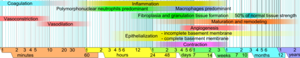
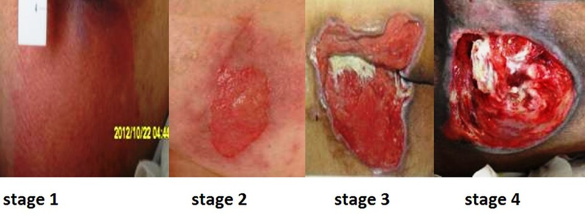
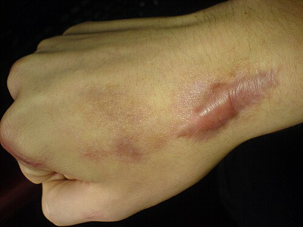

# CICATRIZAÇÃO, FERIDAS E LESÕES POR PRESSÃO

*Figura 1 - Fases da cicatrização: diagrama mostrando a sobreposição temporal das fases inflamatória, proliferativa e de remodelamento na cicatrização de feridas. Fonte: Mikael Häggström, Domínio Público | Wikimedia Commons*

## Fases da cicatrização

A cicatrização é um processo dinâmico e sobreposto. Para prova, pense em três fases principais: inflamatória, proliferativa e remodelamento.

### 1. Fase inflamatória

Começa imediatamente após a lesão e predomina nos primeiros dias. Tem dois objetivos principais: **hemostasia** e **limpeza da ferida**.

Logo após o trauma, ocorre vasoconstrição inicial, formação do tampão plaquetário e ativação da coagulação. Em seguida, há vasodilatação e aumento da permeabilidade vascular, permitindo chegada de células inflamatórias.

Os **neutrófilos** chegam primeiro e participam da defesa contra bactérias por fagocitose. Porém, em feridas limpas e estéreis, eles não são indispensáveis para que a cicatrização ocorra.

A célula mais importante da cicatrização é o **macrófago**. Ele remove debris e tecido necrótico, coordena a resposta inflamatória e libera citocinas e fatores de crescimento que estimulam fibroblastos, angiogênese e transição para a fase proliferativa.

**Ponto de prova:** sem macrófago, a cicatrização não progride adequadamente.

### 2. Fase proliferativa

Predomina aproximadamente do 4º ao 14º dia. É marcada por:

- **Angiogênese**

- **Fibroplasia**

- **Formação de tecido de granulação**

- **Epitelização**

- **Contração da ferida**

O **tecido de granulação** é vermelho vivo, brilhante e sangra facilmente, devido à intensa neovascularização.

O **fibroblasto** é a principal célula dessa fase. Ele sintetiza inicialmente **colágeno tipo III**, mais frouxo e desorganizado. Com o tempo, esse colágeno será substituído por **colágeno tipo I**, mais resistente.

A **epitelização** ocorre a partir das bordas da ferida e dos anexos cutâneos, como folículos pilosos e glândulas. Por isso, feridas superficiais tendem a cicatrizar mais rapidamente do que feridas profundas.

### 3. Fase de remodelamento

Inicia-se ainda na fase proliferativa e pode durar meses. O objetivo é aumentar a **resistência tênsil** da cicatriz.

Nessa fase, ocorre degradação do colágeno tipo III e deposição progressiva de **colágeno tipo I**, com reorganização das fibras conforme as linhas de tensão.

**Pegadinha clássica:** a cicatriz nunca recupera 100% da resistência da pele íntegra. Em geral, atinge cerca de **80% da força original** após meses a 1 ano.

## Fatores que prejudicam a cicatrização

### Fatores locais

- **Hipóxia e isquemia:** reduzem a síntese adequada de colágeno e a defesa contra infecção.

- **Infecção:** prolonga a fase inflamatória, aumenta a degradação tecidual e dificulta a fibroplasia.

- **Corpo estranho:** fio, tela, fragmentos e tecido desvitalizado mantêm inflamação persistente.

- **Tensão na ferida:** aumenta risco de deiscência e cicatriz hipertrófica.

- **Ambiente seco:** retarda a epitelização. Feridas bem manejadas cicatrizam melhor em ambiente úmido controlado.

### Fatores sistêmicos

- **Diabetes mellitus:** prejudica perfusão, função leucocitária e resposta inflamatória.

- **Tabagismo:** causa vasoconstrição e hipóxia tecidual por aumento de carboxi-hemoglobina.

- **Desnutrição:** deficiência proteica compromete síntese de colágeno e resposta imune.

- **Deficiência de vitamina C:** prejudica hidroxilação do colágeno.

- **Deficiência de zinco:** reduz proliferação celular e reparo tecidual.

- **Corticoides:** reduzem resposta inflamatória, fibroplasia e síntese de colágeno.

- **Quimioterapia e radioterapia:** podem prejudicar proliferação celular e vascularização.

**Vitamina A:** pode atenuar parte do efeito deletério dos corticoides sobre a cicatrização, tema frequentemente cobrado em provas.

## Classificação das feridas cirúrgicas

### Ferida limpa

Procedimento eletivo, sem inflamação local, sem quebra de técnica asséptica e sem abertura dos tratos respiratório, digestivo, genital ou urinário.

Exemplo: herniorrafia eletiva sem intercorrências.

### Ferida limpa-contaminada

Há abertura controlada de trato colonizado, sem extravasamento importante e sem infecção estabelecida.

Exemplos: colecistectomia eletiva, gastrectomia sem contaminação grosseira.

### Ferida contaminada

Há contaminação importante, trauma recente, quebra grosseira de técnica ou extravasamento de conteúdo gastrointestinal.

Exemplos: ferida traumática recente com sujidade, apendicite supurada sem abscesso organizado.

### Ferida infectada ou suja

Há infecção já estabelecida, pus, tecido desvitalizado, perfuração de víscera oca ou ferida traumática antiga.

Exemplos: peritonite fecal, abscesso drenado, ferida com pus.

## Tipos de fechamento

### Primeira intenção

As bordas são aproximadas por sutura, grampos, cola ou fita. É indicada para feridas limpas ou pouco contaminadas, com bom desbridamento e baixa tensão.

### Segunda intenção

A ferida é deixada aberta e cicatriza por granulação, contração e epitelização. É usada em feridas infectadas, muito contaminadas ou com perda tecidual importante.

A contração da ferida é mediada pelos **miofibroblastos**.

### Terceira intenção ou fechamento primário retardado

A ferida é inicialmente deixada aberta para limpeza, desbridamento e observação. Após alguns dias, se estiver limpa e viável, é fechada cirurgicamente.

É útil em feridas contaminadas, mas sem infecção estabelecida após controle local adequado.

## Complicações da ferida operatória

### Seroma

É o acúmulo de líquido seroso em espaço morto, comum após grandes descolamentos, como mastectomia e abdominoplastia.

Conduta: observação se pequeno e assintomático; aspiração em técnica asséptica se volumoso, sintomático ou tenso. Curativo compressivo pode ajudar.

### Hematoma

É o acúmulo de sangue na ferida. Pode aumentar risco de infecção e deiscência.

Hematoma em expansão, especialmente em região cervical após tireoidectomia ou cirurgia de pescoço, é emergência por risco de compressão de via aérea.

Conduta em hematoma cervical expansivo: abertura imediata da ferida e controle cirúrgico do sangramento.

### Infecção de sítio cirúrgico

Geralmente aparece a partir do 5º dia pós-operatório, com dor, calor, rubor, edema, secreção purulenta ou febre.

O tratamento principal da infecção superficial com coleção é **abrir a ferida e drenar**. Antibiótico é indicado quando há celulite extensa, sinais sistêmicos, imunossupressão ou infecção profunda.

### Deiscência de aponeurose e evisceração

A deiscência de aponeurose costuma ocorrer entre o 5º e o 10º dia pós-operatório. O quadro clássico é paciente em pós-operatório de laparotomia que refere sensação de “estalo” após tosse ou esforço, seguida de saída de líquido serossanguinolento abundante pela ferida.

Se a pele permanece íntegra, pode haver abaulamento ou eventração. Se alças intestinais exteriorizam pela ferida, ocorre **evisceração**.

Conduta na evisceração:

- Cobrir as alças com compressas estéreis umedecidas com soro fisiológico morno.

- Não tentar reduzir as alças no leito.

- Reposição volêmica e analgesia.

- Encaminhar imediatamente ao centro cirúrgico.

## Lesões por pressão

Lesão por pressão é dano localizado na pele e/ou tecidos moles subjacentes, geralmente sobre proeminência óssea, causado por pressão sustentada ou pressão associada a cisalhamento. Também pode estar relacionada a dispositivos médicos, como sondas, máscaras, cateteres e imobilizadores.

Locais comuns:

- Sacro

- Calcâneos

- Trocânteres

- Ísquios

- Maléolos

- Occipital, especialmente em pacientes acamados

Fatores de risco:

- Imobilidade

- Redução do nível de consciência

- Incontinência

- Desnutrição

- Baixa perfusão tecidual

- Idade avançada

- Neuropatia

- Umidade excessiva da pele

- Uso de dispositivos médicos com pressão local

### Estadiamento

*Figura 2 - Exemplos clínicos de lesões por pressão em estágios 1 a 4. Use a imagem como apoio visual: o estadiamento continua dependente da profundidade, tecidos expostos e definição oficial; lesões não classificáveis e lesão tissular profunda não estão representadas nesse painel. Fonte: Babagolzadeh, CC BY-SA 3.0 | Wikimedia Commons.*

#### Estágio 1

Pele íntegra com eritema não branqueável, geralmente sobre proeminência óssea. Em pele mais escura, pode haver alteração de cor, temperatura, consistência ou dor, sem clareamento evidente à digitopressão.

#### Estágio 2

Perda parcial da espessura da pele, com exposição da derme. Pode parecer abrasão, bolha ou úlcera rasa. Não há exposição de gordura, músculo, tendão ou osso.

#### Estágio 3

Perda total da espessura da pele, com exposição de tecido adiposo. Pode haver esfacelo, tecido de granulação, epíbole e túneis. Não há exposição de fáscia, músculo, tendão, ligamento, cartilagem ou osso.

#### Estágio 4

Perda total da pele e dos tecidos, com exposição ou palpação direta de fáscia, músculo, tendão, ligamento, cartilagem ou osso. Pode haver túneis, descolamentos, esfacelo ou escara.

#### Não classificável

Há perda total da pele e tecido, mas a profundidade real está encoberta por esfacelo ou escara. Só pode ser estadiada após remoção suficiente do tecido desvitalizado, quando clinicamente indicada.

#### Lesão tissular profunda

Pele intacta ou não, com área vermelho-escura, marrom, púrpura ou bolha sanguinolenta, sugerindo dano profundo por pressão ou cisalhamento. Pode evoluir rapidamente para necrose.

### Prevenção e manejo

A prevenção é mais importante que o tratamento. Medidas essenciais:

- Mudança regular de decúbito.

- Superfícies de suporte, como colchões e coxins adequados.

- Controle de umidade e incontinência.

- Avaliação nutricional e correção de déficit proteico-calórico.

- Inspeção diária da pele em pacientes de risco.

- Alívio de pressão em calcâneos e proeminências ósseas.

- Reposicionamento ou proteção de áreas sob dispositivos médicos.

No tratamento, a conduta depende do estágio, presença de necrose, infecção, exsudato e perfusão local.

Princípios gerais:

- Aliviar pressão sobre a área.

- Limpar a ferida, preferencialmente com soro fisiológico ou solução apropriada.

- Manter ambiente úmido controlado.

- Remover tecido desvitalizado quando indicado.

- Tratar infecção quando houver sinais clínicos.

- Proteger pele perilesional.

- Otimizar nutrição, glicemia e perfusão.

**Atenção:** não se deve indicar antibiótico sistêmico apenas por colonização da ferida. Antibiótico sistêmico é reservado para celulite, osteomielite, bacteremia, sepse ou infecção profunda.

## Cicatrizes patológicas

*Figura 3 - Queloide: cicatriz patológica com crescimento excessivo de tecido fibroso além das margens da ferida original, resultado de proliferação desregulada de colágeno. Fonte: Michael Rodger, CC BY 3.0 | Wikimedia Commons*

| Característica | Queloide | Cicatriz hipertrófica |
| --- | --- | --- |
| Limites | Ultrapassa a ferida original | Respeita os limites da ferida |
| Surgimento | Pode surgir meses após a lesão | Geralmente surge semanas após a lesão |
| Evolução | Raramente regride espontaneamente | Pode regredir com o tempo |
| Predisposição | Forte componente individual e familiar | Mais relacionada à tensão local |
| Locais comuns | Orelha, ombro, região pré-esternal | Áreas de tensão e articulações |

O tratamento do queloide é difícil e a excisão isolada tem alta recidiva. Opções incluem corticoide intralesional, silicone, compressão, cirurgia associada a terapias adjuvantes e radioterapia local em casos selecionados.

## Fístulas enterocutâneas

Fístula enterocutânea é uma comunicação anormal entre o trato gastrointestinal e a pele. Em cirurgia, costuma aparecer após laparotomias, deiscência de anastomose, infecções intra-abdominais, doença inflamatória intestinal, neoplasia ou trauma.

### Classificação pelo débito

- **Baixo débito:** < 200 mL/dia

- **Médio débito:** 200 a 500 mL/dia

- **Alto débito:** > 500 mL/dia

Quanto maior o débito, maior o risco de distúrbios hidroeletrolíticos, desnutrição e menor chance de fechamento espontâneo.

### Fatores que dificultam fechamento espontâneo

Fatores clássicos que reduzem a chance de fechamento espontâneo da fístula:

- Corpo estranho no trajeto, como fio, tela ou dreno.

- Radioterapia prévia ou enterite actínica.

- Infecção, abscesso ou inflamação persistente.

- Epitelização do trajeto fistuloso.

- Neoplasia associada.

- Obstrução distal.

- Alto débito.

- Trajeto curto ou amplo.

- Doença intestinal ativa, como doença de Crohn.

### Manejo inicial

O tratamento inicial é geralmente conservador:

- Reposição volêmica e correção hidroeletrolítica.

- Controle de sepse e drenagem de abscessos.

- Proteção da pele.

- Controle do débito.

- Suporte nutricional, preferindo via enteral quando possível e usando nutrição parenteral quando necessário.

- Definição anatômica por imagem após estabilização.

Cirurgia é considerada quando não há fechamento com tratamento adequado, quando há fatores impeditivos de fechamento espontâneo ou quando há sepse/obstrução não controlada. Em geral, evita-se reoperação precoce em abdome hostil, salvo urgência.

## Fios cirúrgicos

A escolha do fio depende do tecido, tensão, risco de infecção e necessidade de suporte.

### Absorvíveis

- **Sintéticos**, como poliglactina e polidioxanona: degradados por hidrólise e causam menor reação inflamatória.

- **Orgânicos**, como catgut: degradados por proteólise, causam maior reação inflamatória e são pouco usados atualmente.

### Não absorvíveis

- **Nylon e polipropileno:** monofilamentares, baixa capilaridade, úteis para pele e áreas com maior risco de contaminação.

- **Seda e algodão:** multifilamentares, maior capilaridade e maior risco de abrigar bactérias, devendo ser evitados em feridas infectadas.

**Ponto de prova:** em feridas infectadas ou contaminadas, prefira fios monofilamentares quando houver necessidade de sutura.

## Pontos-chave para prova

- Macrófago é a célula central da cicatrização.

- Neutrófilos chegam primeiro, mas não são indispensáveis em feridas limpas.

- Colágeno tipo III aparece primeiro; colágeno tipo I predomina na cicatriz madura.

- A cicatriz não recupera 100% da resistência original da pele.

- Hipóxia, infecção, diabetes, tabagismo, desnutrição e corticoides atrasam a cicatrização.

- Ambiente úmido controlado favorece epitelização.

- Ferida limpa-contaminada envolve abertura controlada de trato colonizado.

- Ferida suja ou infectada já tem pus, tecido desvitalizado ou infecção estabelecida.

- Evisceração exige compressas úmidas, não redução no leito e abordagem cirúrgica imediata.

- Infecção superficial de ferida com coleção trata-se principalmente com abertura e drenagem.

- Queloide ultrapassa os limites da ferida; cicatriz hipertrófica respeita os limites.

- Lesão por pressão estágio 1 tem pele íntegra com eritema não branqueável.

- Lesão por pressão estágio 2 tem perda parcial da pele com exposição da derme.

- Lesão por pressão estágio 3 expõe gordura, mas não músculo, tendão ou osso.

- Lesão por pressão estágio 4 expõe ou permite palpar estruturas profundas, como fáscia, músculo, tendão ou osso.

- Fístula enterocutânea de alto débito é aquela com > 500 mL/dia.

- Corpo estranho, radioterapia, infecção, epitelização do trajeto, neoplasia e obstrução distal dificultam o fechamento espontâneo de fístulas.

- Fios multifilamentares devem ser evitados em feridas infectadas.

 Cópia offline para consulta pessoal.
 Fonte original:
 [https://www.medevo.com.br/material-apoio/ler/06c5cd39-6796-499f-b2f6-a2fe296b5bec](https://www.medevo.com.br/material-apoio/ler/06c5cd39-6796-499f-b2f6-a2fe296b5bec)
