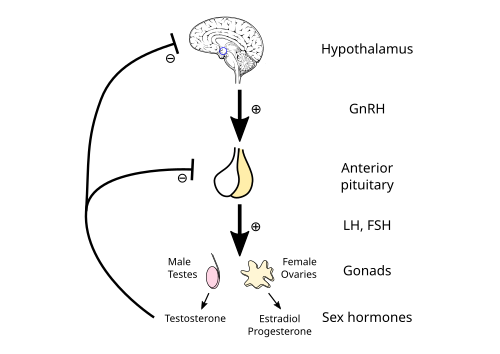
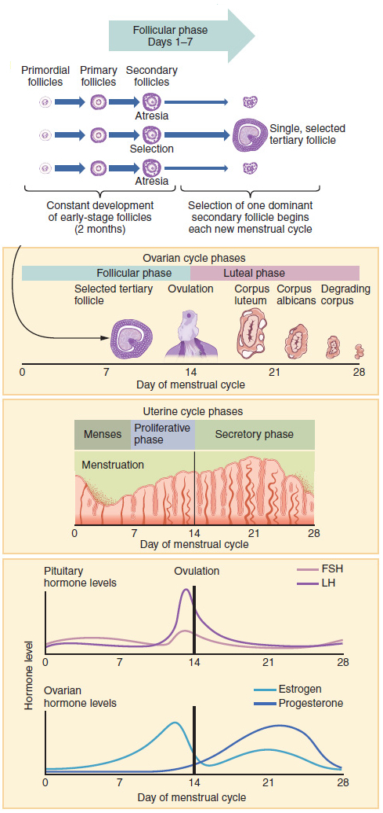

# CICLO MENSTRUAL E FISIOLOGIA

Para entender ginecologia, você precisa dominar o ciclo menstrual. Não é apenas decorar nomes, é entender a coreografia entre o cérebro e os ovários. Se você compreender o "porquê" de cada hormônio subir ou descer, as questões de prova sobre Sangramento Uterino Anormal (SUA), infertilidade e até climatério se tornam lógicas.

Aqui no MedEvo, sempre batemos na tecla: o ciclo menstrual é o sinal vital da saúde reprodutiva. Vamos dissecar esse processo.

*Figura 1 - Eixo hipotálamo-hipófise-gonadal mostrando a secreção pulsátil de GnRH, gonadotrofinas (FSH e LH) e os mecanismos de feedback. Fonte: Artoria2e5, CC BY 3.0 | Wikimedia Commons*

## O Maestro e a Orquestra: O Eixo Hipotálamo-Hipófise-Ovariano (HHO)

O ciclo menstrual não começa no útero, começa no hipotálamo. Ele secreta o GnRH (Hormônio Liberador de Gonadotrofinas) de forma pulsátil.

Cuidado: se o GnRH for liberado de forma contínua, a hipófise "desliga" (downregulation). É por isso que usamos análogos de GnRH de depósito para tratar endometriose ou miomas, criando uma menopausa reversível. Para o ciclo ser normal, o GnRH precisa ser pulsátil.

Esses pulsos estimulam a hipófise anterior a liberar as gonadotrofinas: FSH (Hormônio Folículo Estimulante) e LH (Hormônio Luteinizante).

### A Teoria das Duas Células e Duas Gonadotrofinas

Este é o conceito preferido das bancas para testar se você entende a esteroidogênese. O ovário produz estrogênio através da cooperação de duas células:

- **Célula da Teca:** Fica na periferia do folículo. Ela responde ao **LH**. O LH estimula a teca a converter colesterol em androgênios (androstenediona e testosterona).

- **Célula da Granulosa:** Fica na parte interna. Ela responde ao **FSH**. O FSH ativa a enzima **aromatase**, que pega os androgênios produzidos pela teca e os converte em estrogênios (estradiol).

Erro clássico de prova: dizer que a aromatase converte progesterona em estrogênio. Errado. Ela converte androgênios em estrogênios. Lembre-se: FSH começa com "S" de "Síntese de estrogênio" e "Aromatase".

## O Ciclo Ovariano: Do Recrutamento à Ovulação

O ciclo ovariano médio dura 28 dias, mas o intervalo normal varia de 21 a 35 dias (em adolescentes, até 45 dias pode ser aceitável nos primeiros anos). Ele é dividido em Fase Folicular e Fase Lútea.

### Fase Folicular (O Recrutamento)

Tudo começa com a queda da progesterona e do estrogênio do ciclo anterior. Quando esses hormônios caem, o feedback negativo sobre o hipotálamo cessa, e o **FSH começa a subir**.

Esse aumento do FSH no início do ciclo é o que recruta um grupo de folículos primordiais para começarem a crescer. Por que apenas um folículo se torna o "dominante"?

A seleção do folículo dominante ocorre por volta do 5º ao 7º dia. O folículo que tiver mais receptores de FSH e um microambiente mais rico em estrogênio consegue sobreviver mesmo quando os níveis de FSH começam a cair (devido ao feedback negativo do estradiol que ele mesmo está produzindo). Os outros folículos, com menos receptores, sofrem atresia.

### A Ovulação e o Pico de LH

À medida que o folículo dominante cresce, ele produz quantidades massivas de estradiol. Quando o estradiol atinge um nível crítico (acima de 200 pg/ml por cerca de 48 horas), ocorre um fenômeno único no corpo humano: o **feedback positivo**.

Em vez de inibir, o estradiol alto estimula uma liberação súbita e maciça de LH.

- O pico de LH ocorre cerca de 36 horas antes da liberação do óvulo.

- A ovulação propriamente dita ocorre cerca de 10 a 12 horas após o LH atingir seu nível máximo.

Dica de prova: O pico de LH dura cerca de 48 a 50 horas. Se a questão perguntar o marcador mais fidedigno de que a ovulação vai acontecer em breve, é o pico de LH. Se perguntar se a ovulação já ocorreu, olhamos para a progesterona.

### Fase Lútea (A Supremacia da Progesterona)

Após a saída do óvulo, o que restou do folículo (células da granulosa e da teca) se transforma no **Corpo Lúteo**.

O corpo lúteo é uma glândula temporária que produz progesterona e estradiol. A progesterona é fundamental para preparar o endométrio para a implantação. Ela também inibe novos pulsos de GnRH, impedindo que um novo folículo seja recrutado enquanto o corpo "espera" por uma gravidez.

Se não houver fecundação, o corpo lúteo regride (luteólise) após cerca de 14 dias. A queda da progesterona leva à descamação endometrial (menstruação) e o ciclo recomeça.

| Fase | Hormônio Dominante | Evento Principal |
| --- | --- | --- |
| Folicular Inicial | FSH | Recrutamento folicular |
| Folicular Tardia | Estradiol | Seleção do folículo dominante |
| Ovulatória | LH | Ruptura folicular |
| Lútea | Progesterona | Preparação endometrial / Suporte inicial |

*Figura 2 - Linha do tempo dos ciclos ovariano e menstrual mostrando os níveis de FSH, LH, estrogênio e progesterona e suas correlações com as fases endometriais. Fonte: OpenStax College, CC BY 4.0 | Wikimedia Commons*

## O Ciclo Endometrial: O Alvo dos Hormônios

O endométrio responde fielmente às variações ovarianas. Ele é dividido em duas camadas:

- **Camada Basal:** Não descama. É ela que regenera o endométrio a cada ciclo.

- **Camada Funcional:** Composta pelas camadas compacta e esponjosa. É esta que descama durante a menstruação.

### Fase Proliferativa (Influência do Estrogênio)

O estrogênio faz o endométrio crescer (proliferar). As glândulas são retas e o estroma é denso. É aqui que o muco cervical se torna filante e transparente para facilitar a ascensão espermática.

### Fase Secretora (Influência da Progesterona)

Após a ovulação, a progesterona interrompe a proliferação e inicia a secreção. As glândulas tornam-se tortuosas e começam a produzir glicogênio.

Cuidado com a pegadinha: a progesterona é um hormônio "anti-proliferativo" para o endométrio, embora seja essencial para a sua manutenção. Ela estabiliza o tecido. Se você tem estrogênio sem progesterona (como na anovulação crônica), o endométrio cresce desordenadamente e descama de forma irregular, causando sangramento.

## Terminologia e Distúrbios do Ciclo

As bancas adoram usar termos técnicos para descrever sangramentos. Segundo a Federação Brasileira das Associações de Ginecologia e Obstetrícia (FEBRASGO), devemos preferir a terminologia do sistema FIGO (PALM-COEIN), mas termos clássicos ainda aparecem:

- **Polimenorreia:** Ciclos com intervalo menor que 21 dias. Geralmente indica uma fase folicular curta ou insuficiência lútea.

- **Oligomenorreia:** Ciclos com intervalo maior que 35 dias.

- **Hipermenorreia:** Sangramento com duração prolongada (mais de 8 dias).

- **Menorragia:** Sangramento excessivo em quantidade (mais de 80 ml).

Como o Dr. Will sempre diz nas aulas: "Não confunda a queixa da paciente com o diagnóstico". Uma paciente com polimenorreia pode estar apenas passando por um período de estresse que encurtou seu ciclo, ou pode ter uma disfunção tireoidiana.

### O Ciclo na Adolescência

Este é um tema quente. Nos primeiros 2 a 3 anos após a menarca (primeira menstruação), é **fisiológico** ter ciclos irregulares.

Por que isso acontece? Porque o eixo HHO ainda é imaturo. O feedback positivo do estradiol para gerar o pico de LH ainda não está bem ajustado, resultando em ciclos anovulatórios.

- **Conduta:** Expectante e orientação. Não precisa de anticoncepcional para "regular o ciclo" de uma menina de 13 anos que menstruou há 6 meses, a menos que o sangramento seja grave (causando anemia).

## Dor Pélvica e Ciclo Menstrual

Nem toda dor pélvica é patológica.

### Mittelschmerz (Dor da Ovulação)

É a dor no meio do ciclo (por volta do 14º dia). Ela é unilateral, súbita e autolimitada. Ocorre devido à irritação do peritônio pelo fluido folicular ou pequeno sangramento que acompanha a ruptura do folículo.

- **Dica de prova:** Se a questão descreve dor pélvica cíclica, unilateral, no 14º dia, sem febre e sem corrimento, o diagnóstico é Mittelschmerz. Conduta? Apenas analgésicos se necessário.

### Mastalgia Cíclica

Muitas mulheres sentem dor e ingurgitamento mamário no período pré-menstrual. Isso é causado pelo aumento da progesterona e do estradiol, que levam à retenção de líquido e proliferação ductal.

- **Conduta inicial:** Tranquilização e orientações verbais (uso de sutiã adequado, redução de cafeína).

- **Casos graves/refratários:** O Tamoxifeno pode ser considerado como opção terapêutica, mas é a exceção, não a regra.

## Fisiologia da Lactação e Amamentação

A mama é um órgão endócrino complexo. A fisiologia da lactação é dividida em estágios:

- **Mamogênese:** Crescimento das mamas durante a gestação (estrogênio e progesterona).

- **Lactogênese I:** Início da capacidade secretora ainda na gestação, mas a produção de leite é inibida pelos altos níveis de progesterona placentária.

- **Lactogênese II (A "Apojadura"):** Ocorre 2 a 3 dias após o parto. O gatilho é a **queda brusca da progesterona** após a saída da placenta, permitindo que a prolactina atue livremente.

- **Galactopoese:** Manutenção da lactação. Aqui o controle deixa de ser puramente hormonal e passa a ser autócrino (local). Se a mama é esvaziada, ela produz mais leite.

### Hormônios da Lactação

- **Prolactina:** Produzida na hipófise anterior. Responsável pela **produção** do leite. É estimulada pela sucção e inibida pela dopamina.

- **Ocitocina:** Produzida no hipotálamo e armazenada na hipófise posterior. Responsável pela **ejeção** do leite através da contração das células mioepiteliais. Também causa contrações uterinas (ajudando na involução do útero no pós-parto).

### Farmacologia e Lactação

- **Galactagogos:** Substâncias que aumentam a produção de leite. Metoclopramida e Domperidona funcionam porque são antagonistas da dopamina. Menos dopamina = mais prolactina.

- **Inibidores:** Cabergolina e Bromocriptina são agonistas dopaminérgicos. Usados quando se deseja interromper a lactação (ex: óbito fetal ou contraindicação ao aleitamento).

### Mastite Puerperal

A mastite é uma complicação comum, geralmente causada por estase láctea (leite parado) seguida de infecção por *Staphylococcus aureus*.

- **Quadro:** Febre, dor, calafrios e uma área de hiperemia e endurecimento na mama.

- **Tratamento:** Antibioticoterapia empírica (Cefalexina é a primeira escolha) e, o mais importante, **esvaziamento mamário**.

- **Erro fatal em prova:** Dizer que deve suspender a amamentação na mama com mastite. Pelo contrário! A amamentação deve continuar para ajudar no esvaziamento e evitar abscessos.

| Condição | Características | Conduta |
| --- | --- | --- |
| Ingurgitamento Fisiológico | Mamas cheias, mas leite flui | Ordenha de alívio, amamentação frequente |
| Mastite | Febre, dor localizada, hiperemia | Antibiótico + Esvaziamento (manter amamentação) |
| Abscesso Mamário | Flutuação, dor intensa, febre persistente | Drenagem + Antibiótico + Esvaziamento |

## Contratilidade Uterina e Trabalho de Parto

O útero não é um músculo estático. Durante o ciclo, ele apresenta contrações sutis. No trabalho de parto, essas contrações precisam ser coordenadas.

O marca-passo uterino normal fica nos cornos uterinos. A onda de contração deve ser descendente (do fundo para o colo), o que chamamos de tríplice gradiente descendente.

### Incoordenação Uterina

- **1º Grau:** Dois marca-passos funcionando ao mesmo tempo em ritmos diferentes.

- **2º Grau (Incoordenação de 2º grau):** Múltiplos marca-passos ectópicos. As contrações são desordenadas, assincrônicas e ineficientes para dilatar o colo.

Imagine o útero como um coração em fibrilação. Ele gasta energia, dói, mas não "bombeia" (não dilata). Isso é o que chamamos de trabalho de parto disfuncional.

## Avaliação Nutricional na Prática Médica

Embora pareça um tema isolado, a nutrição afeta diretamente o ciclo menstrual (pense na tríade da mulher atleta ou na anorexia causando amenorreia).

Pérola de prova: A avaliação nutricional inicial **não exige** exames laboratoriais. A Avaliação Subjetiva Global (ASG) e a antropometria (IMC, pregas cutâneas, circunferências) são as ferramentas padrão-ouro para o diagnóstico inicial de desnutrição ou sobrepeso. Exames como albumina ou pré-albumina podem ser influenciados por inflamação e não refletem fielmente o estado nutricional agudo em todas as situações.

## Anticoncepção e Riscos Cardiovasculares

Ao prescrever hormônios para regular o ciclo ou evitar gravidez, você deve conhecer os critérios de elegibilidade da OMS.

Um ponto que cai muito: **Cefaleia com aura**.
Mulheres que apresentam cefaleia com aura têm um risco significativamente aumentado de AVC isquêmico se usarem Anticoncepcionais Orais Combinados (AOC).

- **Classificação:** Categoria 4 (Contraindicação absoluta).

- **Por que?** O estrogênio do comprimido aumenta a síntese de fatores de coagulação no fígado, o que, somado à fisiopatologia da aura (vasoespasmo seguido de vasodilatação), potencializa o risco trombótico.

## Resumo da Fisiologia do Muco e Secreção Vaginal

A secreção vaginal muda conforme o ciclo, e isso é frequentemente cobrado em questões de ginecologia pediátrica ou preventiva.

- **Fase Estrogênica:** O muco é abundante, fluido, transparente e elástico (filância). Ao microscópio, forma o padrão em "folha de samambaia". Isso facilita a entrada dos espermatozoides.

- **Fase Progesterônica:** O muco fica espesso, opaco e sem elasticidade. Forma um "tampão" que protege o útero.

- **Glicogênio e Lactobacilos:** O estrogênio estimula a deposição de glicogênio nas células vaginais. Os lactobacilos de Döderlein metabolizam esse glicogênio em ácido lático, mantendo o pH vaginal ácido (proteção contra infecções).

## Pontos-Chave para Prova

- **Pico de LH:** Ocorre 36 horas antes da ovulação. É desencadeado pelo feedback positivo do estradiol.

- **Progesterona Sérica:** Se estiver > 3 ng/ml na fase lútea (idealmente medida no 21º dia), é o melhor marcador de que a paciente ovulou.

- **Camada Funcional:** É a parte do endométrio que descama (compacta + esponjosa). A camada basal permanece para regenerar o tecido.

- **Adolescência:** Ciclos irregulares nos primeiros 2 a 3 anos pós-menarca são fisiológicos. Conduta: Expectante.

- **Mastite Puerperal:** NÃO suspender a amamentação. O tratamento é esvaziamento mamário + Cefalexina.

- **Galactagogos:** Metoclopramida e Domperidona aumentam a prolactina por serem antagonistas dopaminérgicos.

- **Inibidores da Lactação:** Cabergolina e Bromocriptina (agonistas dopaminérgicos).

- **Mittelschmerz:** Dor pélvica unilateral no meio do ciclo, associada à ovulação. Conduta expectante.

- **Aromatase:** Enzima na célula da granulosa (estimulada pelo FSH) que converte androgênios em estrogênios.

- **Cefaleia com Aura:** Contraindicação ABSOLUTA ao uso de estrogênio (AOC).

- **Incoordenação Uterina de 2º Grau:** Múltiplos marca-passos ectópicos, contrações desordenadas e ineficientes.

- **Hipertrofia Mamária Neonatal:** Fisiológica, causada pela passagem de hormônios maternos pela placenta. Conduta: Expectante (nunca espremer!).

- **Polimenorreia:** Ciclos com intervalo < 21 dias.

- **Lactogênese II:** O gatilho é a queda da progesterona após o parto.

- **Tamoxifeno:** Opção para mastalgia cíclica grave e refratária.

- **Avaliação Nutricional:** ASG e antropometria são essenciais; exames laboratoriais não são obrigatórios para o diagnóstico inicial.

- **Feedback do GnRH:** Pulsos rápidos favorecem LH; pulsos lentos favorecem FSH. A secreção contínua bloqueia o eixo.

- **Muco Cervical:** Estrogênio aumenta a filância; Progesterona torna o muco hostil ao espermatozoide. 🩺

 Cópia offline para consulta pessoal.
 Fonte original:
 [https://www.medevo.com.br/material-apoio/ler/aa3cf0ae-40d5-4ceb-b0da-23f9320dcd64](https://www.medevo.com.br/material-apoio/ler/aa3cf0ae-40d5-4ceb-b0da-23f9320dcd64)
